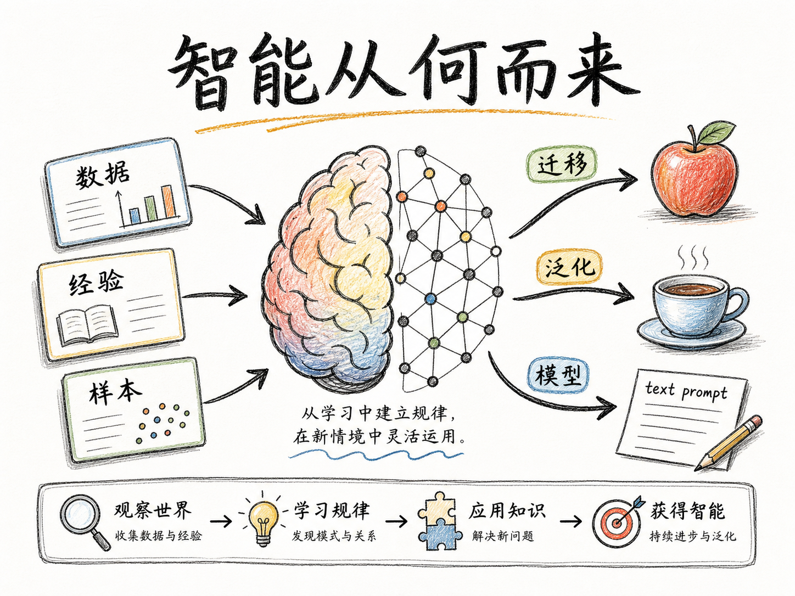
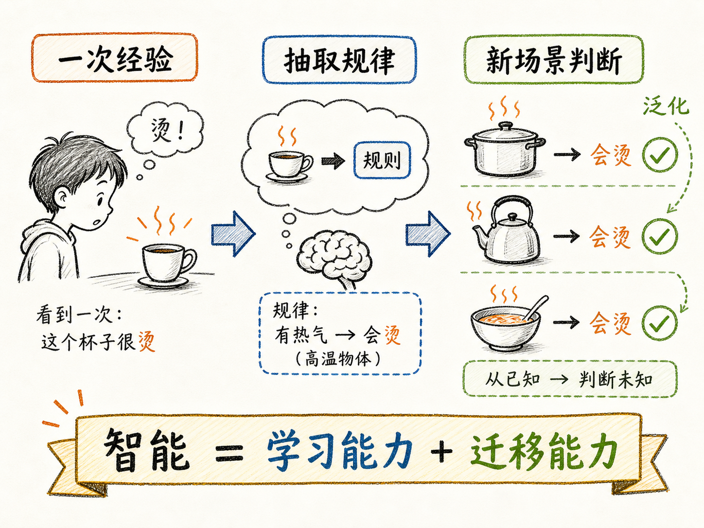
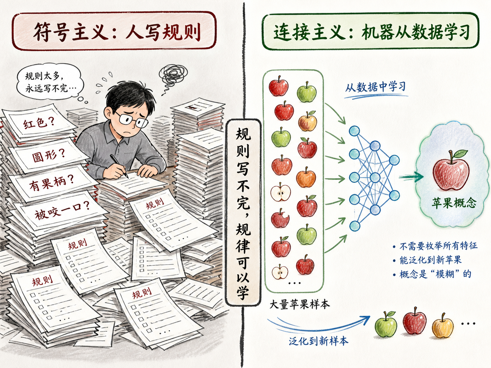
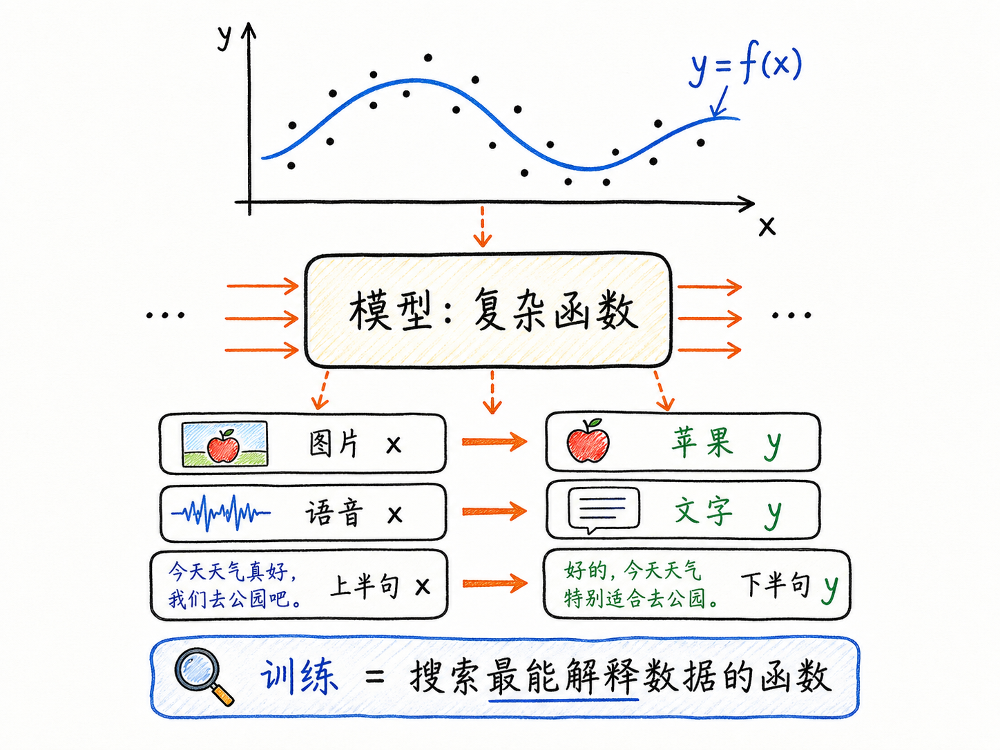
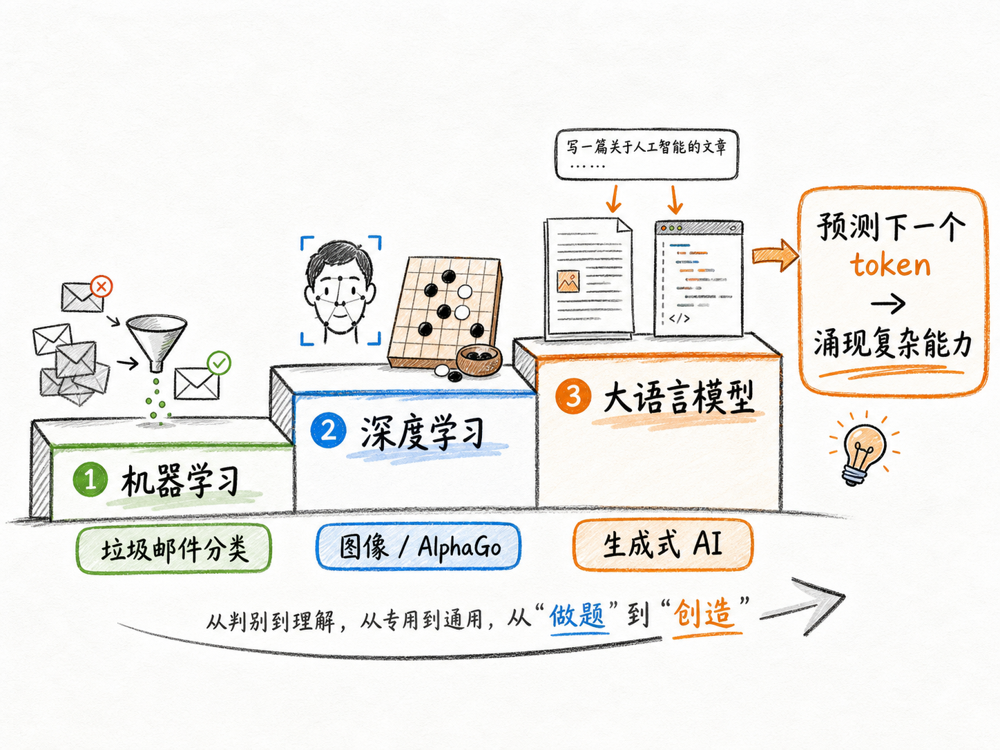

# 智能从何而来

很多人第一次学 AI，会先撞上一堆名词：机器学习、深度学习、NLP、CV、大语言模型、Transformer。再往下看，是公式、参数、矩阵和各种模型结构。问题是，如果一开始就从这些名词往里钻，很容易把 AI 学成一张术语表。

更直接的问题应该是：我们说一个东西“有智能”，到底在说什么？它是会背很多知识，还是会算得很快？如果机器真的有智能，这种智能又是从哪里长出来的？

读完这篇，你会知道

- 为什么“学习能力 + 迁移能力”比“会完成某个任务”更接近智能的核心
- 为什么早期靠人工写规则的 AI 路线很难走向通用智能
- 为什么现代 AI 要靠数据和算力，把世界规律拟合成一个模型
- 机器学习、深度学习和大语言模型之间到底是什么关系
- 为什么有人认为语言模型接近 AGI，也有人认为空间智能才是关键

## 智能不是会做题，而是会举一反三

先看一个小孩的例子。

小孩被一杯冒热气的开水烫过一次，以后他不只是会躲开那一个杯子。他还会警惕冒热气的锅、壶、汤，甚至在陌生环境里看到类似现象，也会先判断“这个东西可能烫”。

这里真正重要的不是“记住某个杯子危险”，而是从一次经验里抽出规律：冒热气的东西可能很烫。然后把这个规律迁移到新的场景。

这就是智能的核心：先能学习，再能迁移。

如果一个系统只能在固定任务上表现很好，但换个任务就失效，它更像是专用工具。AlphaGo 能击败围棋冠军，但它不会因为会下围棋，就自动学会下五子棋、军棋，或者处理真实世界里的其他问题。它很强，但强在一个边界很清楚的任务里。

通用智能追求的是另一件事：一个系统能理解、推理、学习，并且能把学到的东西迁移到不同领域里解决问题。

## 人类为什么能认出苹果

再看一个更日常的例子：苹果。

你看到一张苹果照片，通常马上能认出来。可是如果让你写出“苹果”的精确定义，你会发现很难。它必须多圆？必须什么颜色？被咬了一口还算不算？光线变暗了还算不算？一个抽象的苹果图标为什么也能被认出来？

人不是靠一条条精确规则认出苹果的。

我们见过足够多苹果：真实的苹果、照片里的苹果、视频里的苹果、不同颜色和形状的苹果。大脑在这些样本里不断抽取特征，神经连接也在持续调整。最后，我们脑子里形成了一个模糊但有效的概念：什么样的东西大概率是苹果。

这个概念不一定能被我们清楚说出来，但它足够好用。它让我们在看到一个从未见过的苹果品种时，仍然能判断“这也是苹果”。

现代 AI 的关键思路，就是把这件事搬到机器上：不给机器写死所有规则，而是给它足够多样本，让它自己从数据里学出特征和规律。

## 写规则为什么走不远

早期人工智能走过一条很自然的路：专家系统。

工程师像站在上帝视角一样，把世界写成一条条规则。什么条件对应什么判断，什么输入对应什么输出。这样的系统在一些明确场景里确实有用，比如早期客服、医疗辅助判断、固定流程诊断。

但它有一个根本问题：世界太复杂，规则写不完。

如果你想让机器识别苹果，你可以写“圆形、红色、有果柄”。但青苹果怎么办？切开的苹果怎么办？坏了一半的苹果怎么办？光影变化、角度变化、遮挡、抽象图标，又怎么办？

靠人工规则穷举世界，越往后越不现实。

这条路线通常被称为符号主义：世界先被人类拆成符号和规则，再交给机器执行。它的优点是清楚、可解释；缺点是边界很硬，遇到开放世界就容易崩。

后来更有生命力的路线，是连接主义：不再让人类把规则全部写出来，而是让机器从数据中学习规律。机器学习的经典定义也指向这一点：让计算机不通过明确编程，也能获得学习能力。

换句话说，AI 的关键转向是：从“人写规则，机器执行”，变成“机器看数据，自己归纳规律”。

## 为什么 1959 年有想法，最近才爆发

机器学习的想法并不新。1959 年，Arthur Samuel 就已经提出了类似定义：让计算机在没有被明确编程的情况下学习。

那为什么几十年后，AI 才真正爆发？

因为机器学习听起来像“让机器自己学”，但实际需要两个前提：数据和算力。

第一是数据。一个小孩能认识苹果，是因为他看过大量真实样本。机器也一样。如果数据太少，它学不到稳定规律。互联网把文字、图片、视频、百科、社交网络、网页点击和大量人类活动数字化，才给 AI 提供了前所未有的训练材料。

第二是算力。人脑功耗大约只有 20 瓦，却能完成复杂认知任务；机器想模拟类似能力，实际靠的是大规模矩阵运算和参数优化。深度神经网络动辄涉及数十亿、上百亿甚至更多参数，每次训练都要做海量计算。GPU、TPU 等硬件发展起来后，这件事才真正变得可行。

所以 AI 的突破不是某个单点灵感突然出现，而是三个条件碰到了一起：学习思想早就有，数据规模终于够了，算力也终于撑得住了。

## 模型到底是什么

日常说“AI 模型”，很容易把它想成一个装满知识的数据库。这个理解不够准确。

从数学上看，模型更像一个函数。

在平面坐标里，如果有一堆点，我们会找一个函数 $y=f(x)$ 来拟合这些点。这个函数不一定穿过所有点，但它能描述整体趋势。下一次给它一个新的 $x$，它就能预测对应的 $y$ 大概在哪里。

机器学习做的事情也类似，只是这个函数复杂得多。

给模型一张图片 $x$，它输出“苹果”这个分类 $y$；给它一段语音 $x$，它输出文字 $y$；给它一句话的前半句 $x$，它输出可能的后半句 $y$。

训练模型，本质上就是在巨大的参数空间里反复试错和优化，寻找一个最能解释数据规律的函数。这个函数就是模型。

这也是为什么“参数”重要。参数不是知识条目，而是函数的形状。参数被调到什么状态，决定了模型如何把输入映射成输出。

## 机器学习是在规模化地找规律

可以把机器学习理解成一件朴素但强大的事：把“找规律”变成可规模化、可重复、可计算的过程。

人类也会找规律，但人的记忆和算力有限。面对复杂世界，我们很难穷尽所有隐藏秩序。机器学习把这个过程放进巨大的参数空间里，用海量数据和海量计算不断逼近那个能描述规律的函数。

它不是魔法。它是用计算，把过去只能靠少数天才直觉偶然发现的模式，变成一种工程化流程。

这对学习 AI 很重要。不要先把模型想成“懂一切的机器脑袋”，而要先把它想成“一个被大量数据塑形出来的复杂函数”。它的强弱，取决于数据、结构、训练目标、算力，以及它是否真的学到了可迁移的规律。

## 从机器学习到深度学习，再到大语言模型

人工智能的发展可以粗略看成三层推进。

第一层是通用机器学习。机器不再完全依赖预设规则，而是从数据中学习概率和模式。垃圾邮件识别就是典型例子。机器并不真的“理解”什么是垃圾邮件，但它能统计某些词频和组合，例如“中奖”“恭喜”等信号，然后判断一封邮件的风险。

这比纯规则系统进了一步，但仍然依赖人工特征。人类要告诉机器看哪些特征，机器再在这些框架里优化。

第二层是深度学习。它用深度神经网络去自动学习更复杂的特征。人脸识别、智能驾驶、AlphaGo 这类能力，都和深度学习高度相关。深度学习让机器在图像、语音、博弈等任务上表现得非常聪明。

但很多深度学习系统仍然是专用智能。它们在一个任务里很强，迁移到另一个任务时不一定好用。

第三层是大语言模型，也就是生成式 AI 的重要基础。过去很多 AI 更像在做选择题：这是不是垃圾邮件？这张图是不是人脸？车该往左还是往右？大语言模型开始做生成题：写一段文字、解释一个概念、补全代码、推演一个方案。

它的训练任务看起来很简单：根据已有上下文预测下一个 token。

但为了预测得准，模型被迫学习语言背后的结构。要预测物理题答案，就得捕捉物理规律；要预测代码下一行，就得学会程序结构；要预测故事结局，就得理解人物动机和因果关系。

简单任务叠加到巨大规模后，涌现出复杂能力。这是大语言模型最反直觉的地方。

## 为什么语言可能通向通用智能

语言为什么这么关键？

因为语言不只是词。语言是人类对世界的压缩。

几千年的文字记录里，压缩了人类对物理、社会、情感、制度、工具、历史和因果关系的理解。一个“所以”背后是因果，一个“但是”背后是转折，一个故事背后有时间、空间、动机、冲突和结果。

大语言模型学习海量文本，表面上是在学 token 的统计规律，深层上却可能学到了人类描述世界时留下的大量结构。它因此能表现出逻辑、常识、推理、创作、代码能力，甚至某种程度上的情感模拟。

这就是很多人认为语言模型接近 AGI 的原因：如果语言足够充分地压缩了世界，那么学习语言，也许就能间接学习世界。

但这个判断并不没有争议。

## 语言是不是世界本身

反对者会指出：语言是世界的镜子，但不是世界本身。

比如李飞飞等学者更强调空间智能。语言是很晚才出现的能力，而生物在几亿年里首先面对的是空间世界：距离、速度、遮挡、重力、轨迹、碰撞、捕食与逃生。

一个真正理解世界的智能，不能只知道“球从桌上掉下去”这句话在文本里经常出现。它还要理解球、桌子、边缘、重力和运动之间的物理关系。

所以，也许通向 AGI 的路径不只是语言。语言智能和空间智能可能都需要。一个负责压缩人类知识，一个负责连接真实物理世界。

这也是今天 AI 发展的开放问题：大语言模型是不是足够通用？多模态、具身智能、世界模型，是否会成为下一阶段的关键？

## 最后收束：智能来自可迁移的学习

如果只记一句话，可以记住这个版本：

智能不是把所有答案背下来，而是从有限经验里学出规律，再把规律迁移到新场景。

早期 AI 试图让人类把世界规则写完，但世界太复杂，规则永远写不完。现代 AI 的路线，是让机器在数据中学习，用算力搜索规律，把这些规律压缩进模型这个复杂函数里。

机器学习、深度学习、大语言模型，都是围绕这件事展开：怎样把数据变成可学习的任务，让机器在反复试错中形成对世界的某种认知。

这也是正式学习机器学习之前最该先想清楚的问题：我们不是在学一堆模型名词，而是在学机器如何从经验中长出智能。
