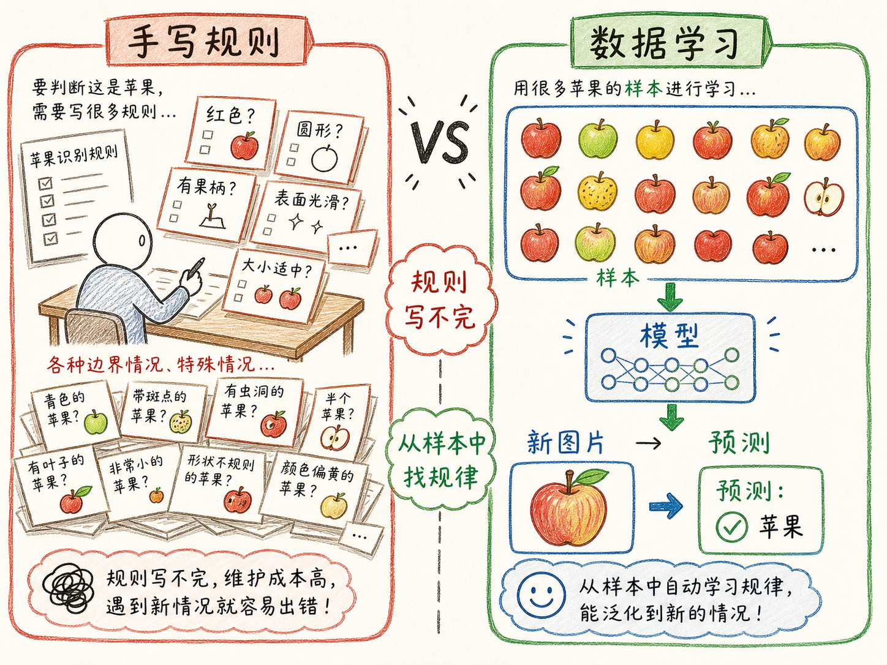
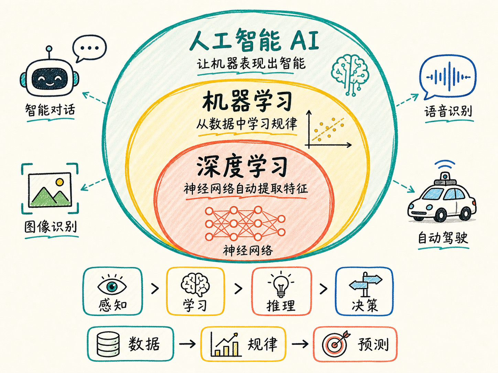
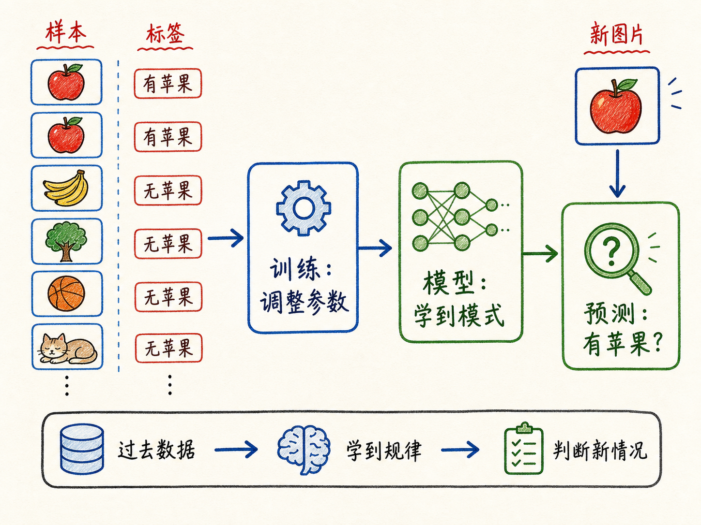
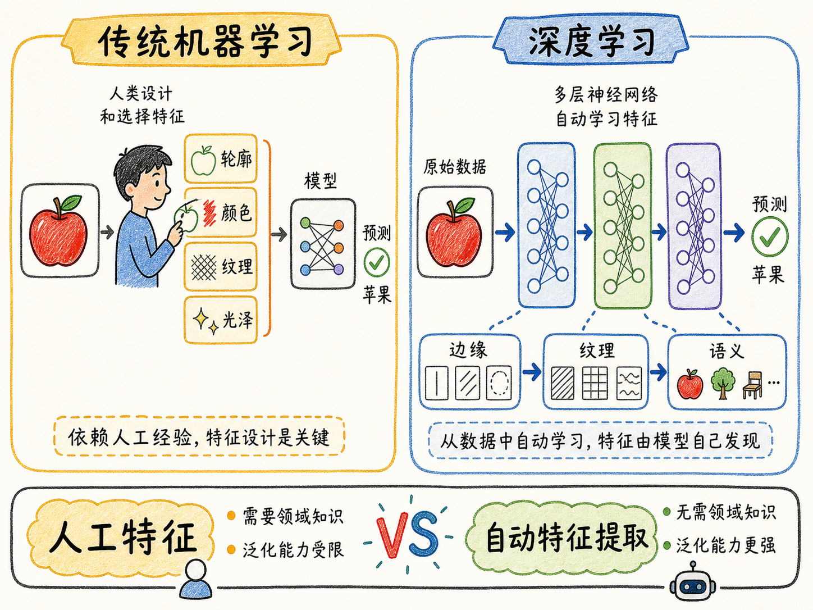

# 机器学习是什么

如果让你写一段程序，判断一张图片里有没有苹果，你会很快发现这件事没那么简单。红苹果、青苹果、被咬了一口的苹果、光线很暗的苹果、卡通画里的苹果，它们都算苹果。可是到底哪一条规则能把这些情况全写完？

这就是机器学习要解决的问题：有些任务不是不能做，而是很难靠人手把规则写清楚。机器学习换了一条路，不再让人把每个判断步骤都写死，而是让计算机从大量数据里自己找规律，再用这个规律去判断新情况。

读完这篇，你会知道

- 机器学习和人工智能、深度学习之间到底是什么包含关系
- 为什么“无需显式编程”不等于“不需要编程”
- 机器学习为什么能处理那些规则写不完的任务
- 传统机器学习和深度学习的关键差别是什么
- 为什么学习机器学习之前，要先理解“用数据找规律”这件事

## 人工智能是目标，机器学习是主要路径

先把三个常被混在一起的词拆开：人工智能、机器学习、深度学习。

人工智能，也就是 AI，是一个更大的目标。它关心的是：怎样让机器表现出类似人类的智能，比如感知、学习、推理、决策。日常说 AI，有时指研究这些能力的方法，有时也指已经具备这些能力的系统，比如聊天机器人、智能客服、自动驾驶系统。

机器学习是实现 AI 的核心路径之一。它研究的是：怎样让计算机在没有被人明确写出所有规则的情况下，自动从数据中学习规律。学到规律以后，计算机就可以对未来或新输入做预测。

深度学习又是机器学习里的一个子领域。它使用多层神经网络，让机器能够从原始数据里自动抽取更深层的特征。今天的大语言模型、图像识别、语音识别、自动驾驶和机器人，背后几乎都离不开深度学习。

所以三者不是并列关系，而是包含关系：

人工智能是大目标，机器学习是实现这个目标的重要方法，深度学习是机器学习中非常强的一类方法。

## 机器学习本质上是在模仿人类的经验判断

人类其实每天都在做类似机器学习的事。

比如我告诉你：我最近戒烟了，也开始规律运动。你大概率会预测，明年我的身体状况可能会变好。你为什么敢这么判断？因为你的生活经验告诉你，戒烟和运动通常有利于健康。

再比如你看天气。过去一年里，出现乌云的日子有 50 天，其中 40 天后来都下雨了。于是你总结出一个经验：只要有乌云，下雨概率就比较高。明天你抬头看到乌云，就会倾向于带伞。

这就是“从过去经验中找规律，再把规律用到未来”的过程。

机器学习做的是同一件事，只是把人类经验换成数据，把人的直觉总结换成计算机的训练过程。人类根据经验决策，机器根据数据决策。

## 为什么不能把所有规则都写进程序

在机器学习之前，我们想让计算机完成任务，通常要靠编程：人先把步骤写清楚，机器再按步骤执行。

这种方法适合规则明确的任务。比如计算工资、排序表格、按条件筛选数据，这些都可以写成清楚的流程。

但有些任务，人会做，却很难说清楚自己是怎么做的。

识别苹果就是典型例子。一个人看过很多苹果以后，见到新图片通常能认出来。但如果让他写出一套完整规则，就会卡住：

- 苹果必须是红色吗？青苹果怎么办？
- 苹果必须是圆的吗？被遮挡、被切开还算不算？
- 光线、角度、背景变化以后，规则还成立吗？
- 卡通图标、简笔画、照片里的苹果，应该用同一套规则吗？

靠人手把这些可能性全部穷举出来，几乎不现实。世界不是一张规则表，而是连续变化的。

机器学习的价值就在这里：人不再试图把所有规则写出来，而是给机器大量样本，让它自己从样本里捕获模式。

## 机器怎么学会“这是苹果”

人认识苹果，大概经历过这样的过程：看过很多真实苹果、照片、视频和图标，大脑慢慢提取出一些关键特征，比如轮廓、颜色、表皮纹理、光泽、果柄位置。

你不一定能把这些特征说清楚，但你的神经系统已经调整好了。见到一个新苹果时，你会直接判断“这是苹果”。

机器学习也是类似逻辑。

我们向计算机展示大量图片，并告诉它哪些图片里有苹果，哪些图片里没有苹果。它一开始不会判断，但在反复训练中，它会调整内部参数，逐渐捕获“苹果”相关的模式。

训练完成以后，再给它一张从未见过的新图片，它就可以根据学到的模式判断：这张图里有没有苹果。

这里最关键的一点是：我们没有手写“苹果长什么样”的全部答案。我们写的是学习过程，让机器通过数据自己逼近答案。

## “无需显式编程”不是“不需要编程”

很多人听到机器学习的定义，会误解成：既然机器可以自己学习，那 AI 时代是不是就不用写程序了？

不是。

机器学习说的“无需显式编程”，意思不是不编程，而是不把任务答案逐条写死。

我们仍然要编程，只是编写的重点变了。过去我们写的是“如何判断一张图是不是苹果”；现在我们写的是“计算机应该如何从图片和标签中学习”。也就是说，人写的是学习机制、训练流程、数据处理、模型结构、评估方法，而不是每一种苹果的判断规则。

这对学习 AI 很重要。AI 不是把编程取消了，而是把编程从“写规则”推进到“设计学习系统”。

## 传统机器学习：人先告诉机器看哪些特征

传统机器学习已经不再要求人把最终答案写死，但仍然常常需要人先设计特征。

还用苹果识别来讲。传统机器学习里，人可能会先告诉计算机：你应该关注轮廓、颜色、表皮纹理、光泽这些特征。至于什么样的轮廓和光泽更像苹果，再让机器根据数据自己学习。

这里的“特征”就是机器判断时要看的关键线索。

传统机器学习适合很多结构化数据场景。所谓结构化数据，就是可以比较清楚地放进表格里的数据，比如用户年龄、购买次数、收入区间、点击次数、历史违约记录。

金融风控、商品推荐、用户分层、价格预测，这些场景里，传统机器学习仍然有很大价值。它的优点是计算成本相对低、结果通常更快、确定性和可解释性也更强。

## 深度学习：让机器自己抽取特征

深度学习比传统机器学习更进一步。

在深度学习里，我们往往不再手工告诉机器“你应该关注轮廓、颜色、纹理”。我们把原始图片输入神经网络，让它自己一层层抽取特征。

浅层可能先学到边缘、线条、颜色变化；中间层可能学到纹理、局部形状；更深层可能学到“苹果”“人脸”“车辆”这样的语义模式。

这就是深度学习强大的地方：它不只是根据人工特征做判断，而是可以从原始数据中自动学习特征。

也正因为这个特点，深度学习特别擅长处理非结构化数据，比如图片、文字、音频、视频。这些数据很难直接放进整齐的表格里，也很难靠人工规则描述完整。

代价是，它通常需要更多数据、更大算力，训练出来的模型也更复杂。

## 为什么现在大部分 AI 都离不开深度学习

今天我们接触到的大部分 AI 能力，背后都和深度学习有关。

大语言模型要处理文字，自动驾驶要理解图像和传感器数据，语音识别要把声波变成文字，机器人要理解环境并做动作决策。这些任务的共同点是：输入复杂、变化很多、规则很难写完。

深度学习正适合这种情况。

它可以用海量数据训练一个模型，让模型在大量样本里捕捉模式。算力越强、数据越丰富、模型结构越合适，模型学到的规律就可能越复杂，表现也越强。

这并不意味着传统机器学习过时了。更准确地说：结构化、确定性强、要求快速输出的任务，传统机器学习仍然很实用；图像、语音、文本、视频这类非结构化任务，深度学习通常更有优势。

## 机器学习不是魔法，是工程化的归纳

如果只从表面看，机器学习像魔法：给它一堆数据，它好像就“会了”。

但把过程拆开，它做的事情并不神秘。它先看大量历史样本，再在样本中寻找输入和输出之间的关系。训练的目标，是让模型在已经见过的数据上表现更好，同时希望它在没见过的新数据上也能表现不错。

这就是为什么数据质量很重要。如果训练数据错误很多，模型就会学到错误规律。如果样本不全面，模型就可能在真实场景里失效。如果训练目标设计错了，模型可能看起来准确，却解决不了真正的问题。

机器学习的能力来自数据里的规律，也受限于数据、目标和训练方式。它不是凭空产生智慧，而是在规模化地做归纳。

## 最后收束：机器学习是在教机器从经验里长出判断力

机器学习最朴素的定义可以这样记：

它让计算机从数据中学习规律，并把学到的规律用于未来预测或新情况判断。

人工智能是让机器表现出智能的目标；机器学习是实现这个目标的重要路径；深度学习是机器学习中用神经网络自动抽取深层特征的方法。

传统编程像是人把规则写给机器，机器照着执行。机器学习则是人设计学习过程，机器从数据中自己归纳规律。

真正理解了这一点，再往后学习训练集、测试集、特征、模型、损失函数、过拟合、深度神经网络，就不会只是背名词。你会知道这些概念都围绕同一个问题展开：怎样让机器从过去的数据里，学到对未来有用的判断力。
