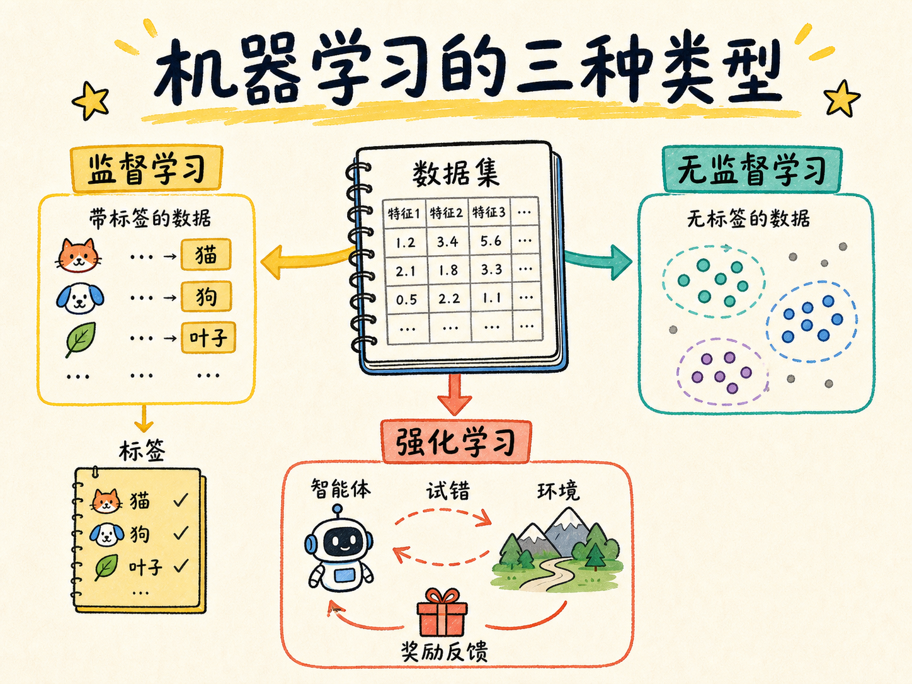
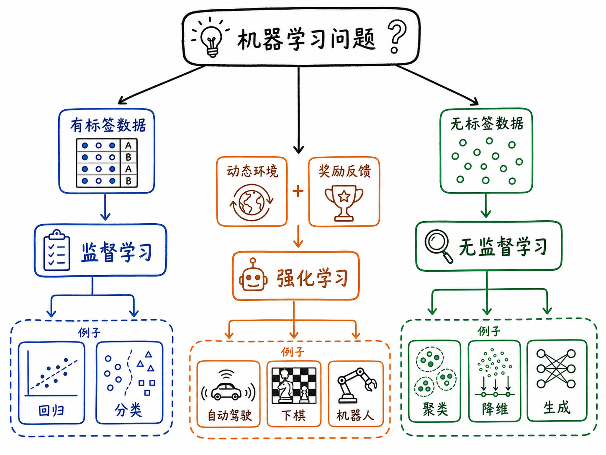
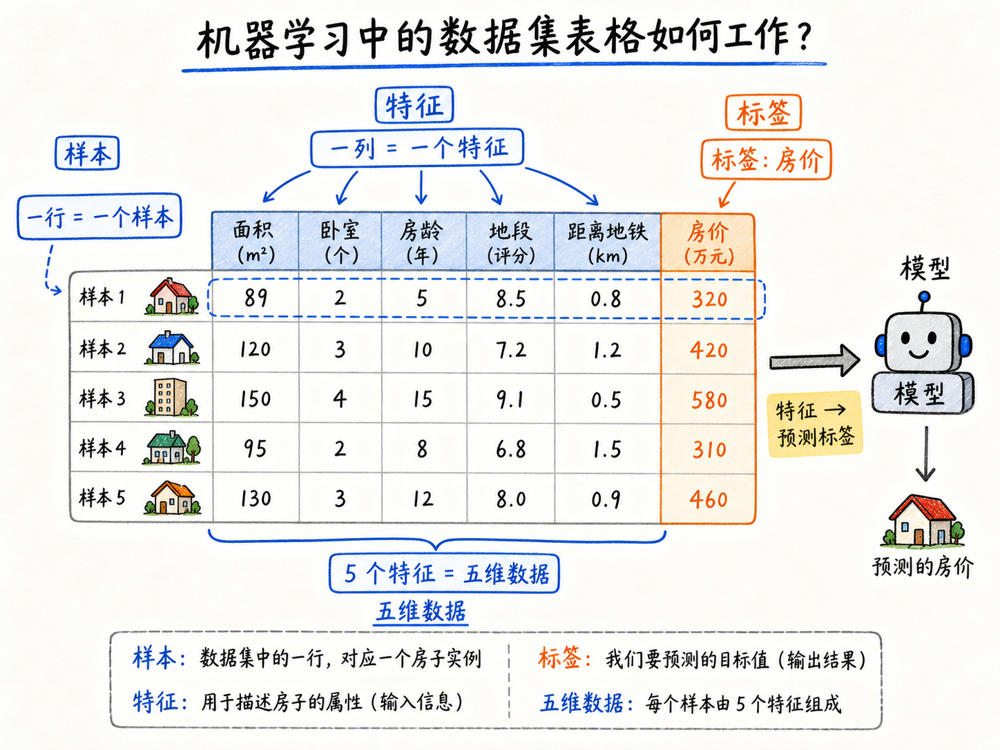
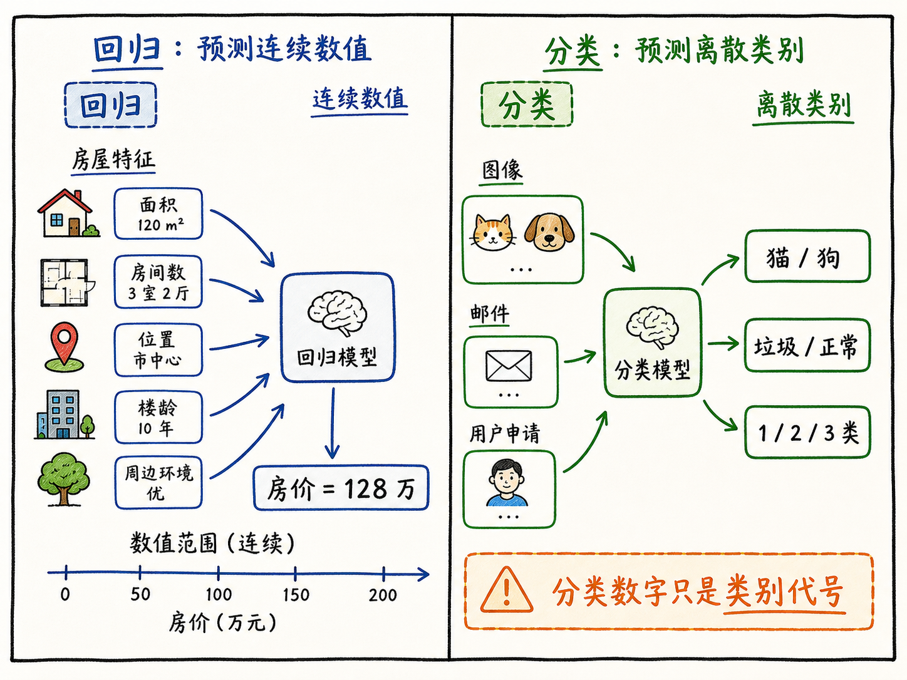
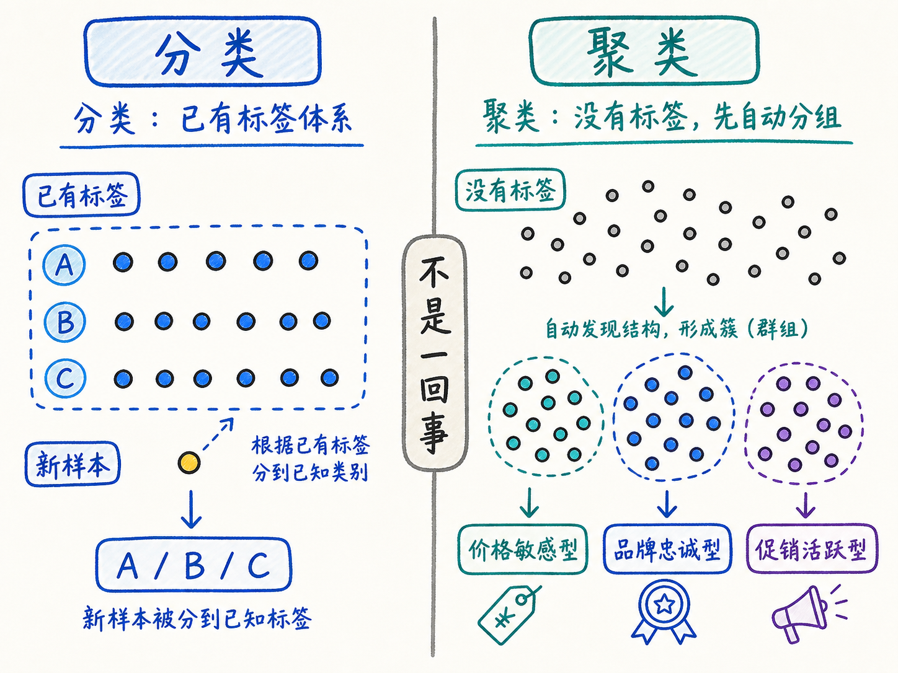
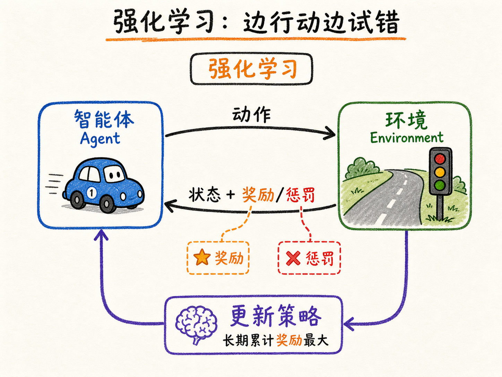

# 机器学习的三种类型

刚开始学机器学习时，最容易卡住的不是某个公式，而是地图感。今天听到线性回归，明天听到聚类，后天又冒出强化学习、生成模型、智能体。每个词好像都很重要，但它们到底谁和谁是一类，谁又解决不同问题？

这篇文章先不急着讲算法细节，而是先把机器学习的“大地图”摊开。判断一个机器学习问题属于哪一类，最直接的线索有两个：数据有没有标签，以及模型是在静态数据里找规律，还是要在动态环境里边试边学。

读完这篇，你会知道

- 为什么理解机器学习分类之前，要先理解数据、特征和标签
- 监督学习为什么可以继续分成回归和分类
- 无监督学习在没有标签时到底能学什么
- 聚类、降维、生成算法分别解决什么问题
- 强化学习为什么不只是“预测”，而是在环境中学习策略

## 先把数据看成一张表

机器学习听起来很抽象，但它真正处理的东西通常很朴素：数据。

在很多入门场景里，数据可以想成一张表。每一行代表一个对象，叫一个数据点，也常叫样本。每一列代表这个对象的一个属性，叫特征。

比如做房价预测时，一行就是一套房子；列里可能有面积、卧室数量、房龄、地段评分、距离地铁站多远。模型要做的事情，是根据这些特征，预测这套房子的价格。

这里还有一个非常关键的词：标签。

标签就是我们希望模型最终预测的那个答案。在房价预测里，房价就是标签。在垃圾邮件识别里，“是不是垃圾邮件”就是标签。在图片识别里，“猫还是狗”就是标签。

所以一张机器学习数据表里，通常可以这样理解：

- 行：一个个样本
- 列：描述样本的特征
- 标签：模型要学会预测的答案
- 维度：特征的数量，也就是模型要观察多少个线索

有了这个基础，机器学习的分类就清楚很多：有些任务的数据带标签，有些任务没有标签；有些任务不是看一张静态表，而是让智能体在环境中不断行动和反馈。

## 第一类：监督学习，是“带答案的练习题”

监督学习处理的是带标签的数据。

这就像学生刷题时，题目后面有标准答案。你做完以后，可以对答案，知道自己错在哪里。机器学习也是类似逻辑：模型看见样本的特征，也看见对应标签，于是可以不断调整自己，学习“特征和答案之间的关系”。

房价预测就是典型的监督学习。历史数据里，每套房子都有面积、房龄、地段等特征，也有真实成交价格。模型学习这些历史样本以后，下一次看到一套没有标价的新房子，就可以根据学到的规律估算价格。

监督学习最核心的问题是：

给我一批已经有答案的数据，我能不能学出一套规则，用来预测新数据的答案？

它在现实中非常常见。图像识别、垃圾邮件检测、信用卡风险判断、文本分类、推荐系统、价格预测，很多都可以归到监督学习里。

## 回归和分类：看标签是什么类型

监督学习还可以继续分成两类：回归和分类。

区别不在输入，而在标签。

如果标签是连续数值，通常就是回归问题。房价是多少、股票价格是多少、明天温度是多少、销售额是多少，这些答案本身有数值大小和连续变化。100 万和 200 万不是两个随便起的名字，而是真正有数量差异。

所以回归模型预测的是一个数。

如果标签是离散类别，通常就是分类问题。图片里是猫还是狗，邮件是不是垃圾邮件，交易是不是风险交易，用户属于哪一类人群，这些答案更像类别名称。

类别也可以用数字表示，比如猫是 0，狗是 1。但这里的数字只是编码，不代表 1 比 0 大，也不代表狗比猫“多一份”。你也可以把猫写成 10，狗写成 20，只要系统能区分类别就行。

这就是分类模型和回归模型的关键差别：

- 回归预测连续数值，数字本身有大小意义。
- 分类预测离散类别，数字只是类别代号。

入门时只要抓住这点，很多算法的位置就不会乱。线性回归属于回归问题；垃圾邮件识别、猫狗识别、风险交易判断属于分类问题。

## 第二类：无监督学习，是“没有答案时先找结构”

现实里，并不是所有数据都带标签。

更常见的情况是：我们手里有大量数据，但没有人工标好的答案。给 100 万用户逐个打标签，判断谁是价格敏感型、谁是品牌忠诚型，成本很高。很多行业甚至专门有“数据标注”这件事，因为只要依赖人工，成本就上来了。

这时就需要无监督学习。

无监督学习不再问“这个样本的正确答案是什么”。它问的是：

这些没有标签的数据内部，有没有隐藏的结构、模式或规律？

它不直接预测某个已知标签，而是让模型自己探索特征之间的关系。数据只有特征，没有答案，模型就从特征里找秩序。

无监督学习常见的方向有三类：聚类、降维和生成算法。

## 聚类：先把相似的人或物分到一起

聚类解决的是“物以类聚”的问题。

假设一个电商平台每天有 100 万用户访问和交易。我们想知道这些用户大概可以分成几类，但又没有人为他们提前贴好标签。这时就可以用聚类算法，让模型根据浏览、购买、停留时间、价格敏感程度等行为特征，自动把相似用户分到同一组。

聚类后的结果可能是：一类用户特别看重价格，一类用户对品牌更忠诚，一类用户只在大促时活跃。平台有了这样的用户画像，就可以做更精准的推荐和运营。

这里要注意一个常见混淆：监督学习里也有“分类”，无监督学习里也会“分组”，但它们不是一回事。

监督学习的分类，是事先已经有标签，模型学会后判断新样本属于哪个已知类别。

无监督学习的聚类，是事先没有标签，模型先根据相似性把数据分成几组。至于每一组应该叫什么名字，通常还需要人后续解释。

一句话区分：

分类是在已有标签体系里认人，聚类是在没有标签时先把相似的人聚到一起。

## 降维：把几十个线索压成几个关键线索

降维解决的是“特征太多”的问题。

一个数据集里的特征越多，维度越高。高维数据不一定更好，因为很多特征可能是噪声，可能彼此重复，也可能和任务关系不大。把所有特征都丢给模型，训练会更慢，计算成本更高，还可能让模型学到一些没用的干扰。

降维的目标是在尽量保留关键信息的前提下，简化数据。

比如做房价预测时，“距离地铁站多远”“周边学校数量”“商场数量”“医院数量”“主干道距离”等几十个特征，可能都在描述同一件事：地段怎么样。

降维算法可以把这些相关特征压缩成一个新的综合特征，例如“综合地段评分”。这样模型看到的维度少了，但重要信息还在，后续训练会更高效。

PCA 就是典型的降维算法。它的作用不是直接给出房价，也不是直接给用户分类，而是帮助我们把复杂数据压缩成更容易处理的形式。

## 生成算法：从数据里学会创造新样本

生成算法解决的是“能不能根据已有数据，创造出新的相似数据”。

今天大家对生成式 AI 已经很熟悉了。输入一句话，模型生成图片；输入需求，模型生成文字；给一段描述，模型生成视频。这类能力背后的具体技术路线很多，但从机器学习分类上看，它们都和“从数据中学习分布，再生成新内容”有关。

生成算法不只是给人消费内容，也能服务后续训练。

比如医疗 AI 里，真实病人数据涉及隐私，不能随便共享。某些场景下，可以用生成算法合成逼真的病理切片或医学图像，扩充训练集，降低对真实敏感数据的依赖。

早期常被提到的 GAN，也就是生成对抗网络，就是一种典型生成模型。今天很多更强的生成系统已经采用 Transformer、扩散模型等路线，但核心问题仍然相通：从已有数据里学到规律，再生成看起来合理的新样本。

所以无监督学习不只是“没有标签也凑合用”。它的价值在于：当数据还没有答案时，先帮我们发现结构、压缩复杂性，甚至创造可用的新数据。

## 第三类：强化学习，是“边行动边试错”

监督学习和无监督学习，大多是在一批静态数据上学习。

但有些问题不是看完历史数据就能结束。自动驾驶、机器人控制、下棋、游戏 AI、工业机械臂调度，这些任务都要求模型在环境中连续行动。每一步动作会改变后续状态，环境也会给出反馈。

这就是强化学习的位置。

强化学习里有一个智能体，也就是 Agent。它被放进一个环境中，观察当前状态，采取动作，然后环境根据动作结果给它奖励或惩罚。智能体不断试错，目标是学到一套策略，让长期累计奖励最大。

自动驾驶可以这样理解：车就是智能体，道路就是环境。它选择加速、刹车、变道、转向。闯红灯、撞墙、压线会受到惩罚；平稳通过路口、保持车道、避免碰撞会得到奖励。训练足够多以后，它就逐渐学会在不同路况下采取更合适的动作。

下围棋也是类似。棋手每下一步，棋盘状态都会变化。某一步眼前看起来占便宜，但长期可能输棋；另一步短期看不明显，却可能带来最终胜利。强化学习关心的不是某一步像不像历史答案，而是整套策略最终能不能赢。

AlphaGo 在 2016 年击败李世石，是强化学习非常重要的里程碑。后来的 AlphaGo Zero 更进一步，主要通过自我对弈，从规则和环境中学习，不再高度依赖人类棋谱。这说明在规则清晰、反馈明确的环境里，智能体可以靠反复试错学出非常强的策略。

今天的大语言模型训练中，也常会在预训练和监督微调之后，引入与人类偏好相关的强化学习或偏好优化思想，让模型输出更符合人类意图。这里的细节会更复杂，但它同样体现了一个核心：模型不只是拟合静态答案，还要根据反馈调整行为。

## 三种类型的分界线

把三类机器学习放在一起看，边界其实很清楚。

监督学习面对的是带标签数据。模型知道历史样本的答案，所以学习的是“特征到标签”的映射。它常用于预测数值和判断类别。

无监督学习面对的是无标签数据。模型不知道标准答案，所以学习的是数据内部的结构。它常用于聚类、降维和生成。

强化学习面对的是动态环境。智能体不只是看数据，还要采取动作、接受反馈、调整策略。它常用于游戏、控制、调度、机器人和复杂决策。

如果你以后听到一个新算法，可以先问三个问题：

第一，数据有没有标签？有标签，优先考虑监督学习。

第二，没有标签时，是要找相似分组、压缩特征，还是生成新样本？这通常落在无监督学习里。

第三，模型是不是要在环境里不断行动，并根据奖励惩罚学习长期策略？如果是，那就是强化学习的典型场景。

## 最后收束：先分清问题，再选择算法

机器学习不是一堆孤立名词，而是一张解决问题的地图。

你要预测房价，这是监督学习里的回归。你要判断邮件是不是垃圾邮件，这是监督学习里的分类。你要把 100 万用户先自动分群，这是无监督学习里的聚类。你要把几十个地段相关特征压成一个综合评分，这是降维。你要让模型生成图片、文字或模拟医学图像，这是生成算法。你要让自动驾驶、棋类 AI 或机器人在环境里学习行动策略，这是强化学习。

先分清问题，再选择算法。

这就是学习机器学习分类真正有用的地方。它不是为了背“监督、无监督、强化”三个词，而是为了让你以后看到任何一个具体任务时，都能先判断：我手里有什么数据？有没有答案？目标是预测、发现结构，还是学习行动策略？

有了这张地图，后面再学线性回归、K-Means、PCA、生成模型、Q-Learning，就不再是一串散乱名词，而是各自站在地图上的一个明确位置。
