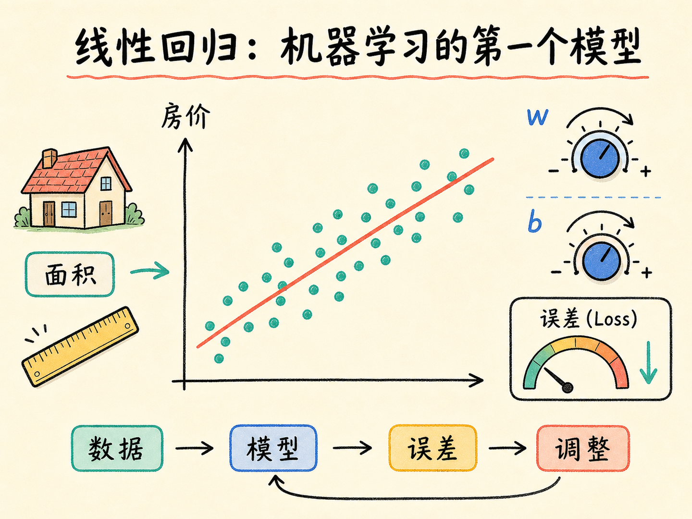
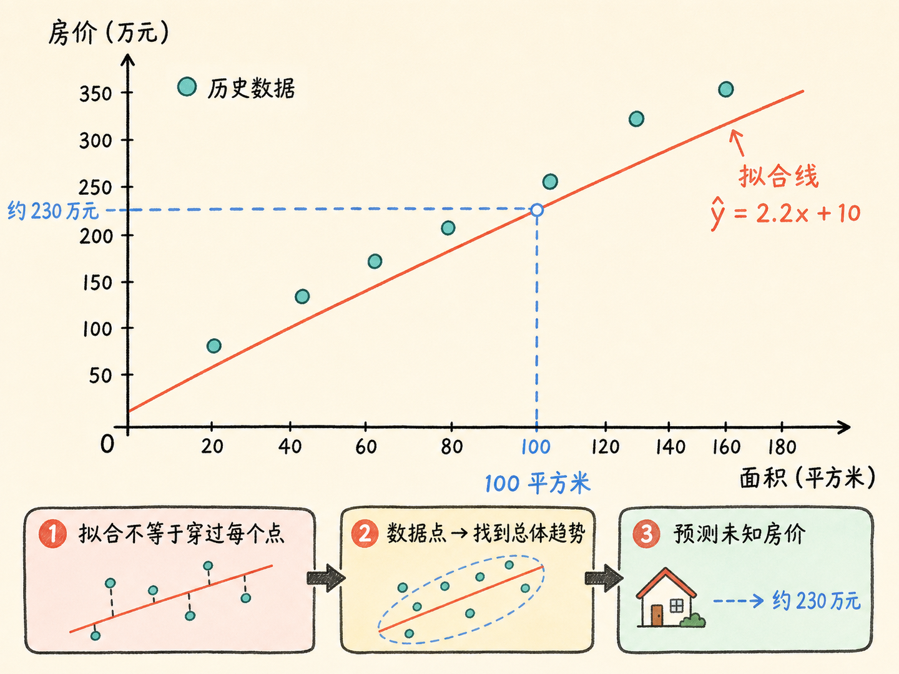
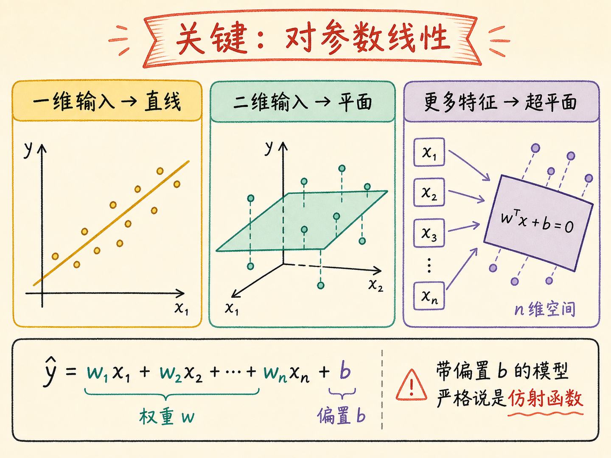
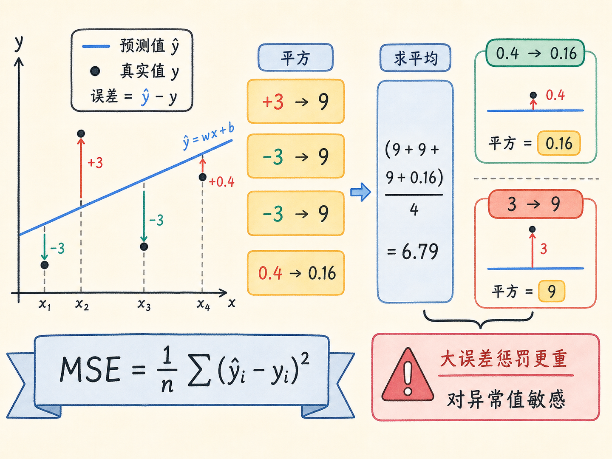
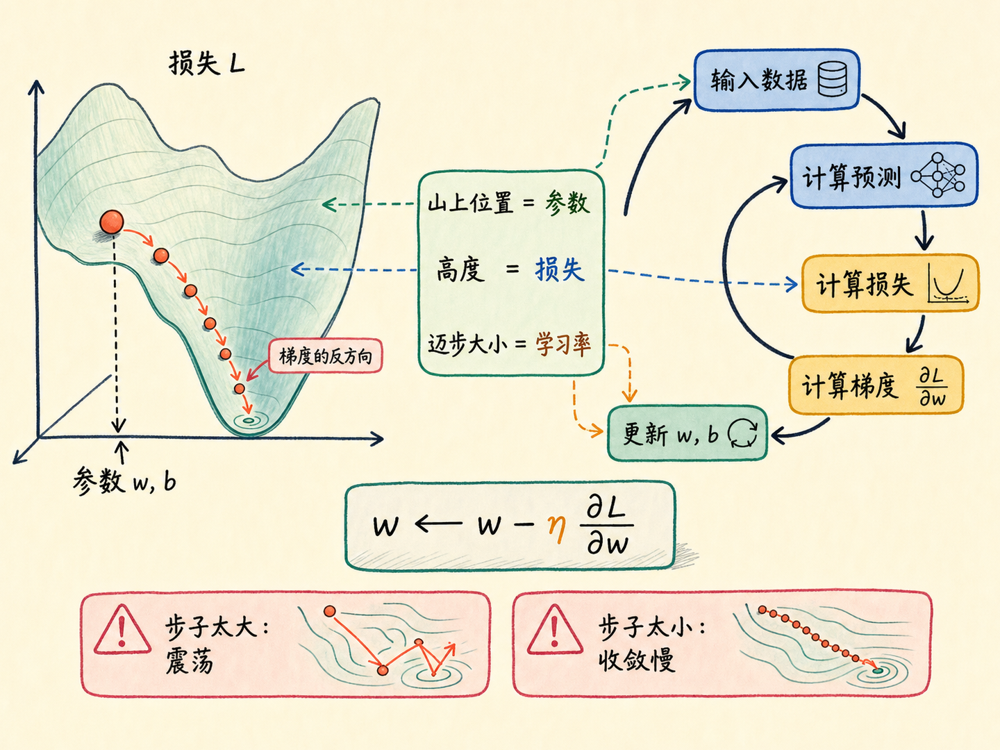
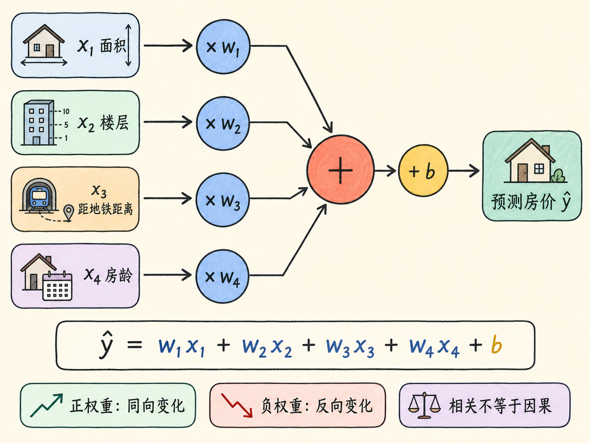
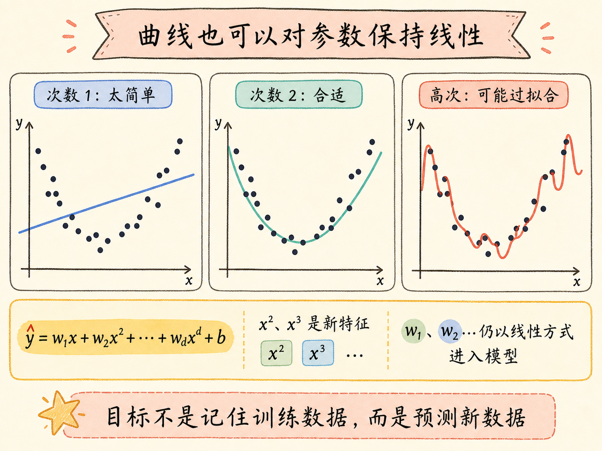

# 线性回归：机器学习的第一个模型

给你几套房子的面积和成交价，再问一套 100 平方米的房子值多少钱，你大概会先看趋势：面积越大，价格通常越高。然后在这些数据点中间“画一条最合适的线”，用它估算未知房价。

这件看起来很朴素的事，已经包含了机器学习最核心的闭环：用模型表达规律，用损失衡量错误，再根据错误调整参数。线性回归之所以适合作为第一个模型，不是因为它只能画直线，而是因为它把“机器怎样从数据中学习”完整地摊在了桌面上。

读完这篇，你会知道

- 线性回归到底在“回归”什么，又为什么叫“线性”
- 权重 $w$ 和偏置 $b$ 分别表达什么
- 均方误差为什么能衡量一条线画得好不好
- 梯度下降怎样一步步找到更合适的参数
- 多特征和多项式回归为什么仍属于同一套框架

## 从一套房子的价格开始

假设历史数据大致呈现这样的关系：面积越大，总价越高。我们尝试用一个简单模型描述它：

$$\hat y=wx+b$$

这里的 $x$ 是房屋面积，$\hat y$ 是模型预测的房价。$w$ 是权重，在二维图上表现为直线的斜率；它回答“面积每增加 1 平方米，预测价格改变多少”。$b$ 是偏置，在图上表现为截距；它给整条预测线提供一个基准位置。

例如，模型学到 $w=2.2$、$b=10$，那么一套 100 平方米的房子，预测总价就是 $2.2\times100+10=230$ 万元。

这个数字不一定等于真实成交价。楼层、房龄、地段和市场情绪都会产生影响。线性回归做的不是宣布“房价必然等于面积的 2.2 倍再加 10”，而是在给定数据和特征的条件下，找到一个整体误差较小、可以用于预测的近似关系。

这也是“拟合”的含义：模型不要求穿过每一个点，而是要尽可能贴近数据呈现的总体规律。

## 为什么叫线性回归

“回归”来自统计学。今天在机器学习里，它通常指预测连续数值的任务，例如房价、温度、销量和设备剩余寿命。它与分类的区别在输出：回归给出一个连续数值，分类给出离散类别或类别概率。

“线性”更容易被误解。在线性代数中，严格的线性映射要满足齐次性和可加性；带偏置的 $\hat y=wx+b$ 严格说是仿射函数。但在机器学习语境里，人们通常仍把它称为线性模型，因为预测结果是参数的线性组合。

真正需要记住的是：

> 线性回归的“线性”，核心是对参数线性，不是画面上必须出现一条直线。

只有一个特征时，模型在二维坐标系里是一条直线；有两个特征时，它对应一个平面；特征继续增加后，它位于人眼无法直接画出的高维空间中，几何上称为超平面。维度变了，基本结构没有变。

## 模型怎么知道自己错了多少

随便给一组 $w$ 和 $b$，我们就能画出一条线，但它可能离数据点很远。模型需要一个统一的评分，判断当前参数好不好。这个评分叫损失函数。

在线性回归中，常见选择是均方误差 MSE：

$$\mathrm{MSE}=\frac{1}{n}\sum_{i=1}^{n}(\hat y_i-y_i)^2$$

计算过程分三步：

1. 对每个样本做预测，得到 $\hat y_i$。
2. 用预测值减真实值，得到误差 $\hat y_i-y_i$。
3. 把误差平方后求平均。

平方有两个直接作用。第一，正误差和负误差不会互相抵消。一个样本高估 10 万，另一个低估 10 万，直接相加看似为零，但模型显然没有预测准确。平方以后，两种错误都会贡献正的损失。

第二，大误差会被更重地惩罚。误差为 3 时平方是 9，误差为 0.4 时平方只有 0.16。模型因此会更积极地修正偏差较大的样本。

不过，这也意味着 MSE 对异常值比较敏感。如果数据中有一套房子的成交价异常离谱，它可能强烈拉动整条拟合线。损失函数不是“天然正确”的答案，而是我们对“什么样的错误更不能接受”做出的数学选择。

## 训练就是不断调整参数

有了损失函数，训练目标就清楚了：寻找一组 $w$ 和 $b$，让损失尽可能小。

对于普通线性回归，可以用最小二乘法直接求解；在更一般、数据更大或模型更复杂的场景中，常用梯度下降逐步优化。梯度下降可以想成在雾里下山，但这个类比必须和数学一一对应：

- 山上的位置：当前参数 $w$ 和 $b$
- 所在位置的高度：当前损失
- 最陡的上升方向：梯度
- 向相反方向走一步：让损失下降
- 每一步的大小：学习率

一次训练迭代可以写成一个闭环：

数据输入 $\rightarrow$ 计算预测 $\rightarrow$ 计算损失 $\rightarrow$ 计算梯度 $\rightarrow$ 更新参数 $\rightarrow$ 再次预测。

参数更新的基本形式是：

$$w\leftarrow w-\eta\frac{\partial L}{\partial w}$$

$$b\leftarrow b-\eta\frac{\partial L}{\partial b}$$

其中 $L$ 是损失函数，$\eta$ 是学习率。学习率太大，模型可能一步跨过低谷，在两边来回震荡；学习率太小，方向虽然正确，却要走很久才能接近最低点。

“收敛”也不等于损失必须变成零。真实数据通常有噪声，特征也不可能涵盖所有影响因素。更合理的判断是：损失已经稳定、验证数据上的表现不再改善，并且模型对新数据仍有预测能力。

## 一个特征不够，就让模型同时看多个特征

房价显然不只由面积决定。楼层、距地铁距离、房龄、地段都可能影响结果。把它们一起加入模型，就得到多元线性回归：

$$\hat y=w_1x_1+w_2x_2+\cdots+w_dx_d+b$$

如果 $x_1$ 是面积，$x_2$ 是楼层，$x_3$ 是距地铁距离，$x_4$ 是房龄，那么每个权重都表达“在其他特征不变时，这个特征增加一个单位，预测结果怎样改变”。

权重的正负也提供了方向信息。面积的权重可能为正；距地铁距离的权重可能为负，因为距离越远，价格往往越低。但不能把权重直接当成因果结论：特征之间可能相关，数据也可能遗漏重要变量。模型告诉我们的是这批数据中的统计关系，不是自动完成了因果证明。

把所有特征写成向量 $\mathbf{x}$，把权重写成向量 $\mathbf{w}$，公式可以压缩为：

$$\hat y=\mathbf{w}^{\mathsf T}\mathbf{x}+b$$

无论是 1 个特征还是 100 个特征，模型骨架都没有改变。变化的只是输入维度和需要学习的参数数量。

特征也不是越多越好。无关特征会带来噪声，高度重复的特征会让参数解释变得不稳定。真正重要的是给模型提供与任务有关、质量可靠的信号。

## 曲线也可能是线性模型

现实数据不一定沿直线分布。例如，房屋面积增加带来的价格变化可能先快后慢。这时可以加入 $x^2$、$x^3$ 等多项式特征：

$$\hat y=w_1x+w_2x^2+\cdots+w_dx^d+b$$

图像看起来已经是一条曲线，为什么仍可以放在线性回归框架中？

因为模型对参数 $w_1,w_2,\ldots,w_d$ 仍然是线性的。我们可以把 $x^2$ 看成一个新特征，把 $x^3$ 再看成另一个新特征，模型依然是在做“特征乘权重，再全部相加”。

这件事揭示了一个重要边界：模型是否属于线性模型，不取决于输入特征长什么样，而取决于参数以什么方式进入公式。

多项式次数越高，曲线越灵活，但灵活不等于更好。次数过高时，模型可能把训练数据中的偶然波动也当成规律，这就是过拟合。机器学习真正追求的不是把已知数据记得滴水不漏，而是对没见过的数据仍然有效。

## 为什么它是后续模型的起点

线性回归把机器学习的基本范式压缩到了最小：

- 用特征表示一个对象
- 用参数化模型表达输入与输出的关系
- 用损失函数度量预测错误
- 用优化方法寻找更合适的参数
- 用未见过的数据检验模型是否真的学到了规律

逻辑回归在仿射输出 $\mathbf{w}^{\mathsf T}\mathbf{x}+b$ 之后接上 Sigmoid 等函数，把结果映射为类别概率，因此可用于二分类。

神经网络则把“仿射变换 + 非线性激活”反复堆叠。非线性激活非常关键：如果只有多层线性变换而没有非线性，它们最终仍可合并成一次线性变换，深度不会带来更强的表达能力。

所以，深度学习并不是凭空出现的另一套魔法。它继承了线性模型的参数、预测、损失和优化框架，再通过多层结构与非线性获得更强的表达能力。

## 最后收束：机器学习就是可纠错的规律搜索

回到 100 平方米房价的问题。人凭经验画一条大致的线，机器则把这件事变成了一套可重复计算的流程：先提出一个模型，用损失函数检查它错得有多远，再根据误差调整参数。

线性回归真正值得记住的，不是某一条直线，也不是某一组 $w$ 和 $b$。

它教会我们的第一条机器学习原则是：

> 学习不是一次猜中规律，而是让一个可以被检验、可以被纠错的模型，在数据反馈中逐步变得更好。
