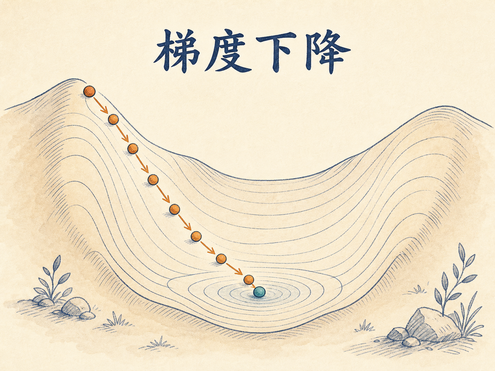
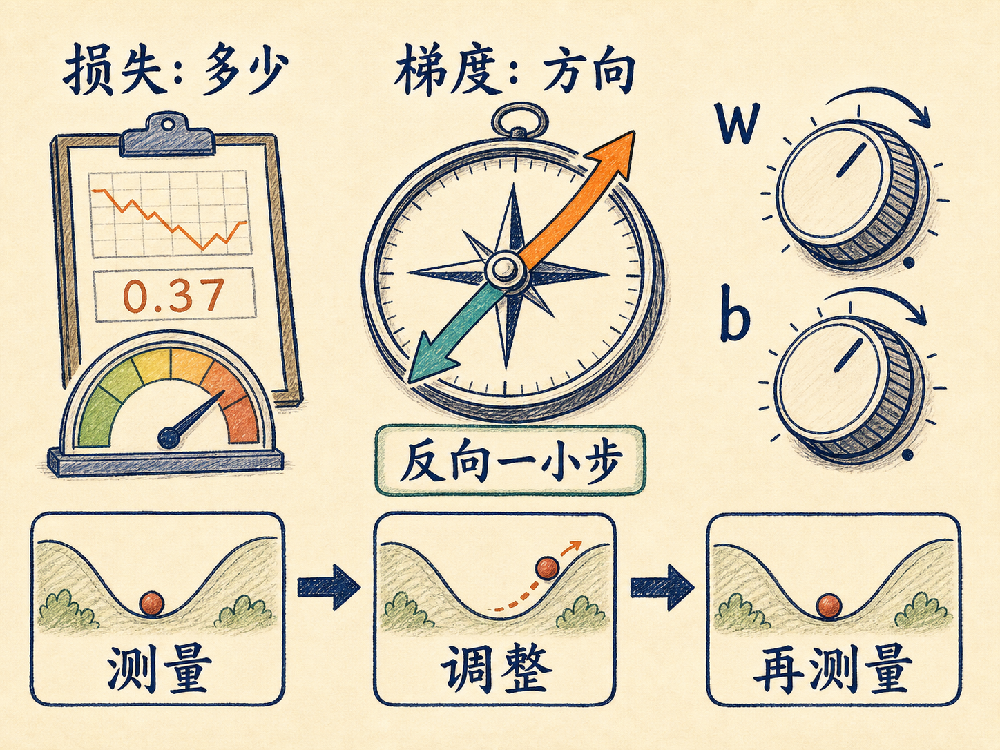
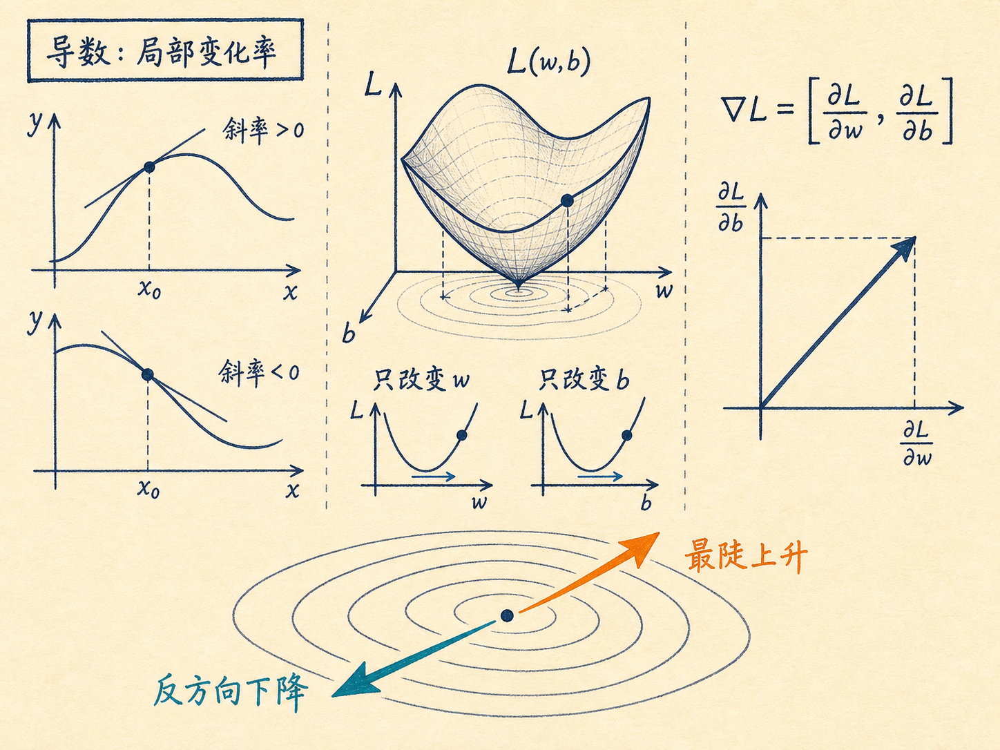
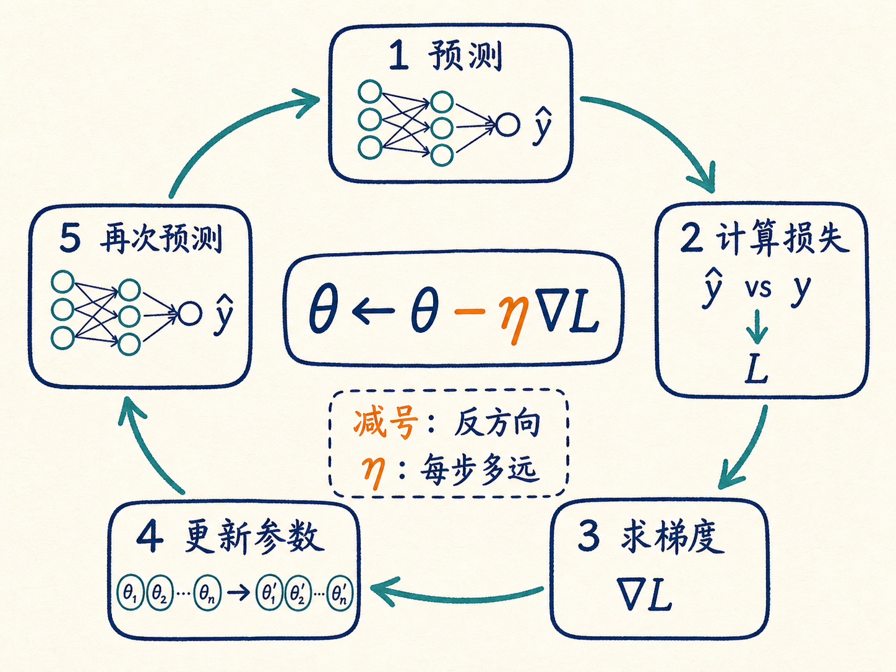
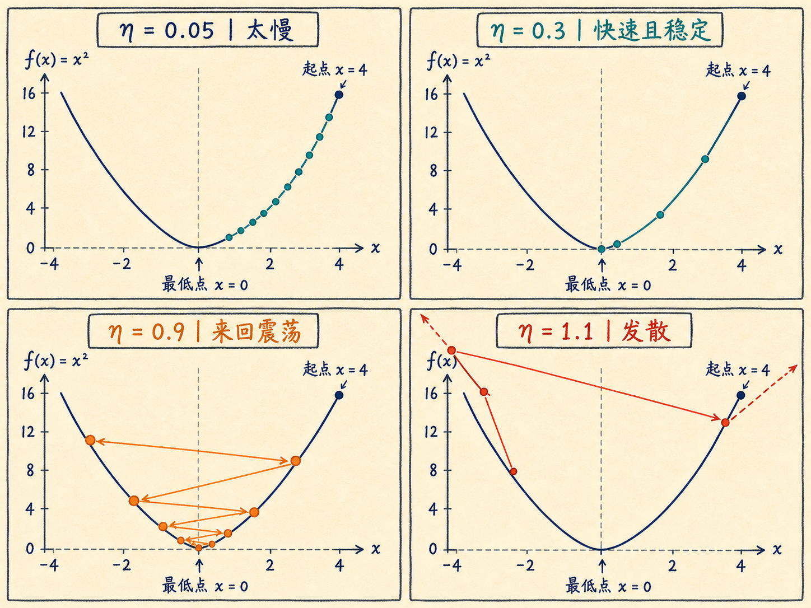
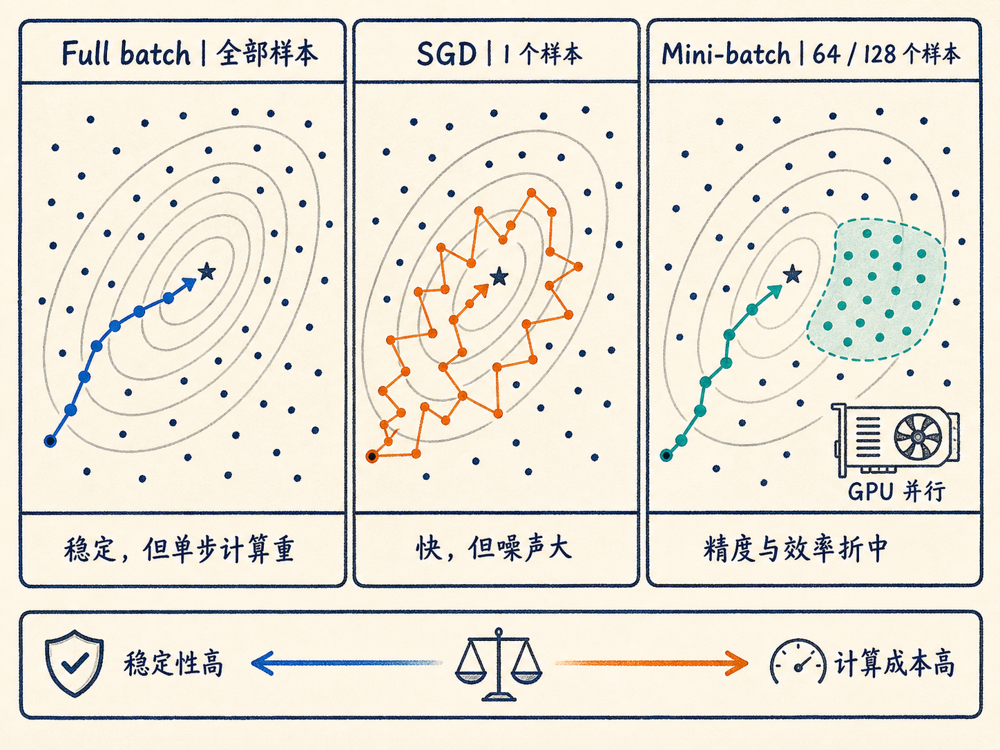

# 梯度下降：模型如何自己找到更好的参数

假设你正在调一台老式收音机。声音不清楚，你知道当前旋钮位置不对，但只知道“不对”还不够：下一步应该往左拧，还是往右拧？拧多少才不会越过信号最清楚的位置？

训练模型面对的是同一个问题。损失函数能告诉模型“现在错了多少”，梯度则进一步告诉它“往哪个方向改会更糟”。于是模型反着走一小步，再测一次，再走一小步。所谓学习，很多时候就是把这个纠错循环重复成千上万次。

读完这篇，你会知道

- 损失函数为什么只能评分，不能独自完成学习
- 导数、偏导数和梯度分别在告诉模型什么
- 参数更新公式为什么要减去梯度
- 学习率太大或太小会造成什么后果
- Adam 和 mini-batch 为什么能让训练更快、更稳

## 损失函数只告诉你错了多少

从最简单的线性模型开始：

$$\hat y=wx+b$$

$x$ 是输入，$\hat y$ 是预测值，$w$ 是权重，$b$ 是偏置。训练的目标，就是找到一组更合适的 $w$ 和 $b$，让预测尽量接近真实值 $y$。

在线性回归中，常用均方误差衡量预测效果：

$$L(w,b)=\frac{1}{n}\sum_{i=1}^{n}(\hat y_i-y_i)^2$$

损失越小，说明这组参数在当前数据上表现越好。但损失函数只像一块记分牌：它会告诉你现在得了 30 分，却不会直接告诉你下一道题该怎么改。

模型真正缺少的是方向信息。假设当前损失很大，增大 $w$ 会让损失下降，还是减小 $w$ 才会下降？$b$ 又该怎样变化？梯度下降就是用数学方法回答这些问题。

## 导数是一个局部方向指示器

一元函数在某一点的导数，可以理解为这一点附近的变化率：

$$f'(x)=\lim_{\Delta x\to0}\frac{f(x+\Delta x)-f(x)}{\Delta x}$$

如果导数大于零，说明 $x$ 稍微增大时，函数值倾向于增大；如果导数小于零，说明 $x$ 稍微增大时，函数值倾向于减小。导数的绝对值越大，局部变化越陡。

模型通常不只有一个参数。损失 $L(w,b)$ 同时取决于 $w$ 和 $b$，这时就分别求偏导数：

- $\frac{\partial L}{\partial w}$：暂时把 $b$ 看成常量，只看 $w$ 的微小变化怎样影响损失；
- $\frac{\partial L}{\partial b}$：暂时把 $w$ 看成常量，只看 $b$ 的微小变化怎样影响损失。

把所有参数的偏导数排成一个向量，就得到梯度：

$$\nabla L=\left[\frac{\partial L}{\partial w},\frac{\partial L}{\partial b}\right]$$

梯度指向函数值局部增长最快的方向。它不是在说“最优参数就在这里”，而是在说“从当前位置看，朝这个方向走，损失上升得最快”。

这一区别很重要：梯度提供的是当前位置附近的方向，不是整个地形的地图。模型必须走一步、重新计算，再决定下一步。

## 为什么参数更新要减去梯度

既然梯度指向损失增长最快的方向，那么要让损失下降，就沿相反方向走：

$$\theta_{\text{new}}=\theta_{\text{old}}-\eta\nabla_\theta L$$

这里的 $\theta$ 代表任意待学习参数，$\eta$ 是学习率。在线性回归中，更新写成：

$$w\leftarrow w-\eta\frac{\partial L}{\partial w}$$

$$b\leftarrow b-\eta\frac{\partial L}{\partial b}$$

减号决定方向，学习率决定步长。一次完整训练迭代可以压缩为五步：

1. 用当前参数进行预测；
2. 计算预测值与真实值之间的损失；
3. 计算损失对各参数的梯度；
4. 沿梯度反方向更新参数；
5. 用新参数开始下一轮。

深度学习中的反向传播负责利用链式法则高效算出各层参数的梯度，梯度下降及其优化器负责用这些梯度更新参数。两者经常一起出现，但职责不同：一个算方向，一个走下一步。

## 学习率决定你是挪不动、走得稳，还是直接失控

以最简单的函数 $f(x)=x^2$ 为例，它在 $x=0$ 处取得最小值，导数是 $f'(x)=2x$。从 $x=4$ 出发，更新规则为：

$$x\leftarrow x-\eta\cdot2x$$

不同学习率会产生完全不同的结果：

- $\eta=0.05$：每步很小，方向正确，但收敛缓慢；
- $\eta=0.3$：快速接近零，速度与稳定性较平衡；
- $\eta=0.9$：一步跨过最低点，在两侧来回震荡；
- $\eta=1.1$：更新幅度越来越大，可能发散。

学习率太小，计算资源会消耗在大量几乎没有进展的步骤上；学习率太大，模型可能反复越过低谷，甚至出现梯度爆炸。合适的学习率不是单纯追求“大”或“小”，而是在训练速度和稳定性之间取得平衡。

训练曲线通常也不是匀速下降。模型从很差变得可用，往往发生得很快；从可用继续磨到更好，速度会明显放慢。损失下降越来越慢，不一定说明训练坏了，也可能只是已经接近当前模型和数据所能达到的区域。

## 优化器是在梯度下降上加一套驾驶系统

最基础的梯度下降只看当前梯度，并用统一学习率更新所有参数。真实模型的损失地形更复杂：有狭长峡谷、局部低点，不同参数的数值尺度也可能相差几个数量级。

因此，人们给基础更新规则加上了更好的“驾驶系统”：

- Momentum 引入历史方向形成惯性，减少左右摇摆，并帮助参数穿过浅小凹槽；
- AdaGrad 为不同参数调整步长，但累计梯度可能让后期学习率衰减得过小；
- RMSProp 更关注近期梯度，避免很久以前的信息一直压低当前步长；
- Adam 结合动量和自适应学习率，同时估计梯度的一阶矩与二阶矩，通常能较快、较稳地训练。

Adam 常被当作深度学习的实用默认起点，但它不是任何任务上都必然最优。优化器减少了手工调节的难度，没有消除验证学习率、泛化表现和训练稳定性的必要。

## 每次看多少数据，也是一种工程取舍

计算一次梯度时，还要决定使用多少训练样本。

批量梯度下降使用全部样本。方向稳定、估计准确，但数据量大时，每走一步都很贵。

随机梯度下降每次只使用一个样本。更新非常快，却容易被单个异常样本和噪声带偏，训练路径会明显抖动。

mini-batch 取两者之间的折中：每次随机选一小批样本，例如 64 或 128 个。它既能降低单样本噪声，又能充分利用 GPU 的并行计算，因此成为深度学习训练的主流方式。

这里的关键不是“哪一种永远最好”，而是估计质量与计算成本的平衡：

- 批量越大，梯度越稳定，但单步计算越重、显存占用越高；
- 批量越小，更新更频繁，但噪声更大、硬件利用率可能更低。

## 最后收束：学习就是有方向的试错

梯度下降并没有让机器突然拥有理解力。它做的是一件更朴素、也更可靠的事：把每次错误转换成参数调整方向。

损失函数回答“错了多少”，梯度回答“往哪边会更糟”，学习率决定“反方向走多远”，优化器改善“怎样走得更稳”，mini-batch 决定“每次用多少证据来判断方向”。

把这些环节连起来，就是模型训练最核心的纠错闭环：

> 预测、计算损失、求梯度、更新参数，然后重复，直到继续调整带来的收益已经足够小。

神经网络和大语言模型虽然拥有海量参数，训练的基本逻辑仍然建立在这个循环上。模型不是一次找到了答案，而是在大量局部、可计算的修正中，逐步逼近一组更有用的参数。
