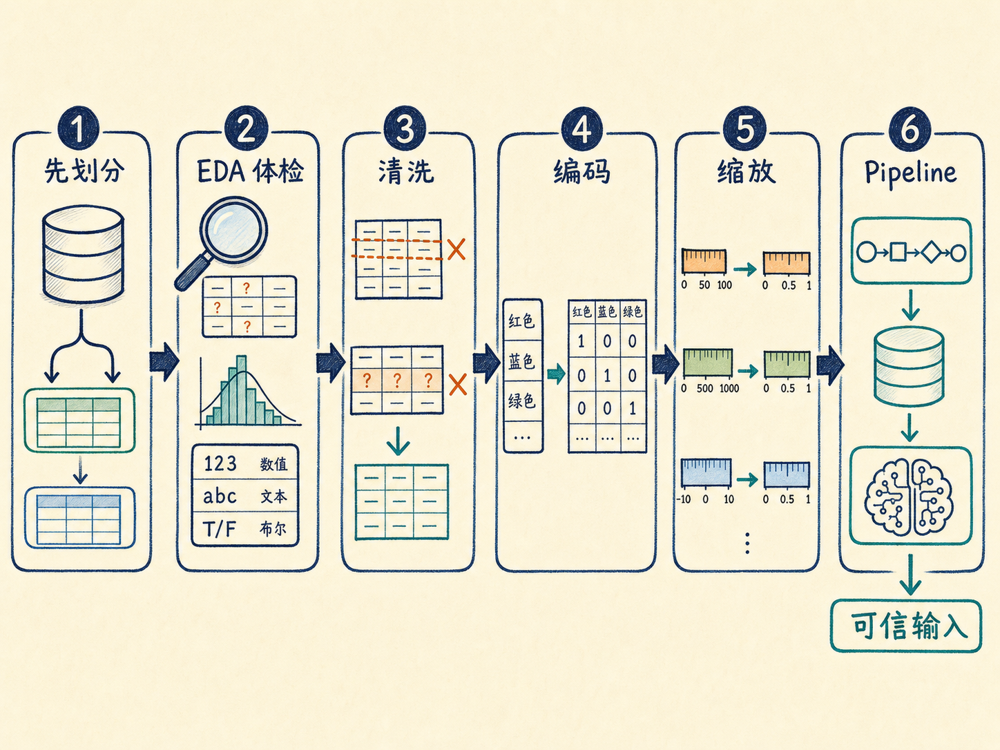
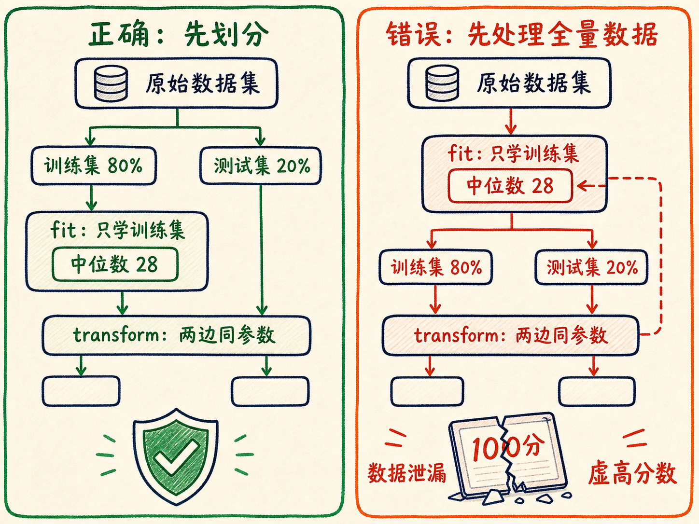
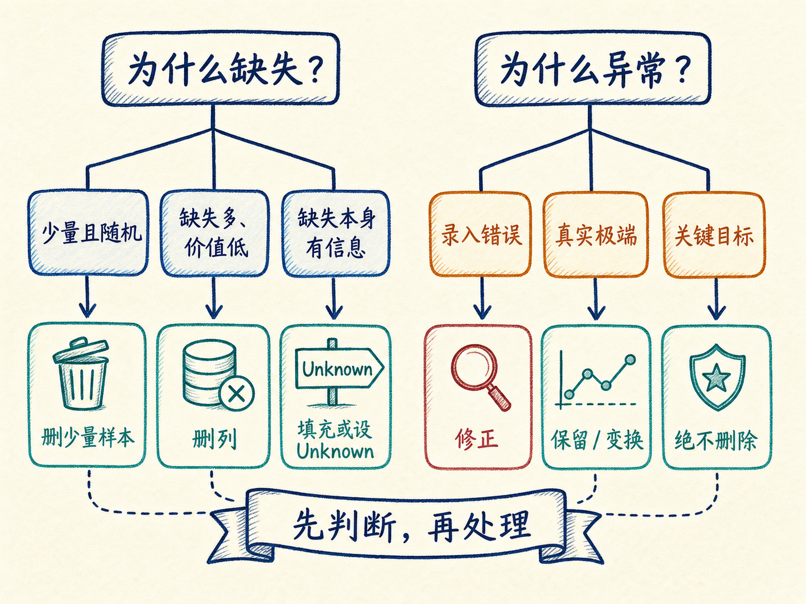
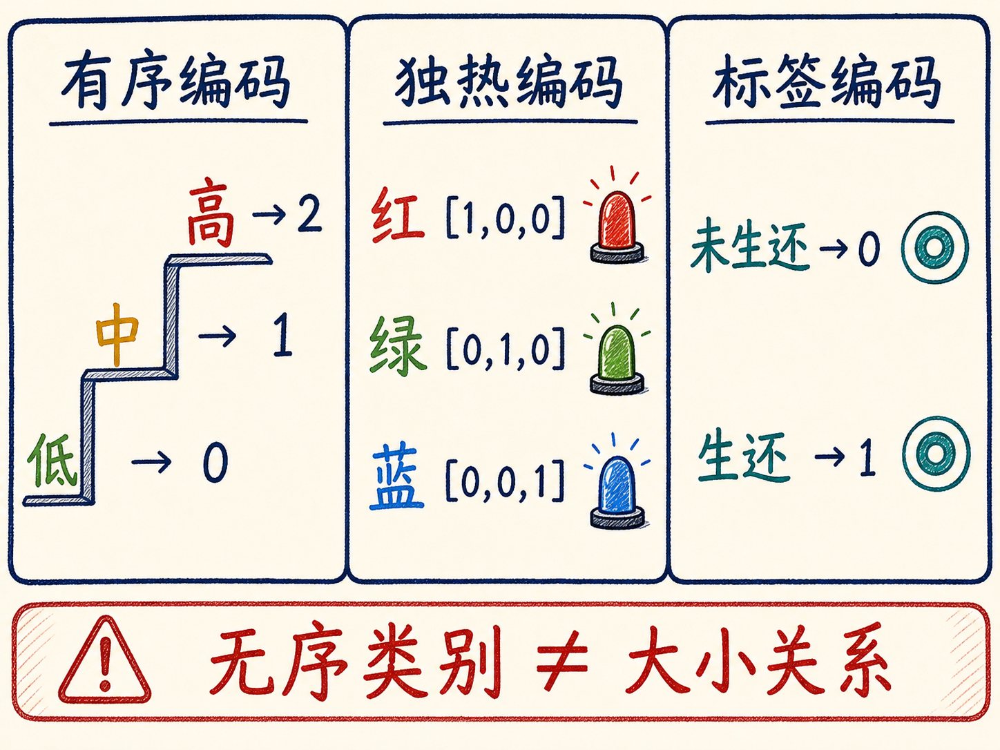
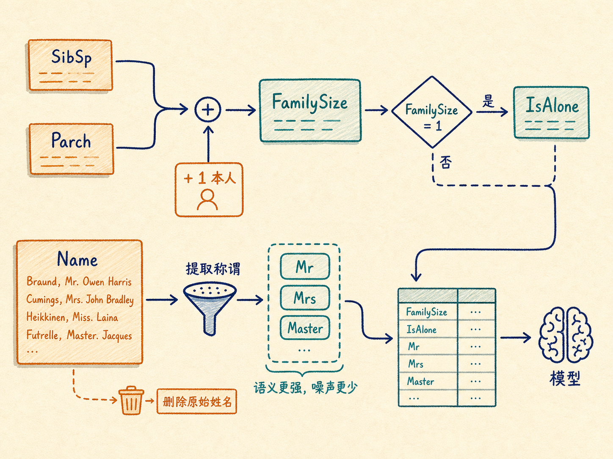
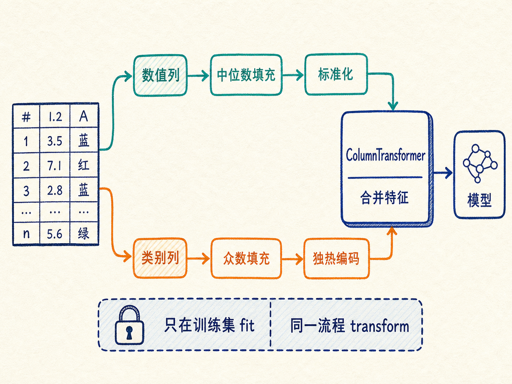

# 数据预处理：模型开工前，先把数据变成可信的输入

你训练了一个模型，代码没有报错，损失也在下降，测试分数甚至相当漂亮。可一放到真实环境里，它就开始胡乱预测。问题未必出在算法，也可能发生在模型看到第一行数据之前。

现实数据不是教材里的整洁表格：年龄会缺失，票价可能相差几百倍，性别和港口是文字，同一个人可能被记录两次。更隐蔽的是，如果你先用全部数据算平均值，再划分训练集和测试集，测试集已经偷偷参与了训练。模型得到的不是能力，而是一次被泄题后的高分。

读完这篇，你会知道

- 为什么数据预处理决定了模型能达到的上限
- 为什么必须先划分数据集，再让预处理器学习参数
- 缺失值、重复值和异常值应该怎样判断，而不是机械删除
- 有序类别、无序类别和标签为什么需要不同的编码方式
- 标准化、归一化与流水线分别解决什么问题

## 数据预处理不是打扫卫生，而是在定义模型看到的世界

机器学习模型不会自动理解一张表格里的业务含义。它只会从输入的数字中寻找统计规律。

这意味着，数据中的每一个问题都会被模型当成现实的一部分：

- 重复记录会让某些样本获得额外权重；
- 缺失值如果被随意填成零，模型可能把“未知”误解成“真的为零”；
- 把红、绿、蓝编码成 1、2、3，线性模型会以为三种颜色存在大小关系；
- 年收入用百万计、家庭人数用个位数表示时，梯度优化和距离计算可能被大数值特征主导；
- 测试集的信息如果参与预处理，评估结果会比真实表现更乐观。

这就是“Garbage in, garbage out”：算法只能学习输入中存在的规律，不能把错误的测量、错误的表示和错误的流程自动变成可靠知识。

所以，数据预处理的本质不是让表格“看起来干净”，而是完成三件事：

1. 修复或隔离不可靠的信息；
2. 把业务含义翻译成模型可以计算的表示；
3. 保证训练和评估之间没有信息串线。

## 第一道门：先划分，再学习

拿到数据后，最容易犯的错误是先把整张表处理完，再划分训练集和测试集。顺序看似只差一步，结果却可能完全失真。

训练集、验证集和测试集各有不同职责：

- 训练集用于学习模型参数；
- 验证集用于选择模型、调整超参数；
- 测试集模拟最终遇到的未知数据，只在最后评估泛化能力。

简单任务也可以只保留训练集和测试集，例如按 80% 和 20% 划分。分类任务还常用分层抽样，让训练集和测试集中的类别比例接近整体分布。泰坦尼克号数据中，若整体生存率约为 38%，分层划分可以让两边都维持相近比例，避免某次随机抽样把大量生还者集中到一边。

真正关键的是两个动作：

- `fit`：从数据中学习参数，例如训练集年龄的中位数、票价的均值和标准差、类别列表；
- `transform`：使用已经学到的参数转换数据。

正确流程是：

1. 先划分训练集与测试集；
2. 只在训练集上 `fit`；
3. 用同一套参数 `transform` 训练集和测试集。

假设训练集年龄中位数是 28 岁，测试集是 34 岁。测试集的缺失年龄也必须用 28 岁填充，而不是重新从测试集算出 34 岁。后者等于让模型提前知道了未知数据的分布，这种现象叫数据泄漏。

数据泄漏最危险的地方，是它通常不会让程序报错。它只会给你一个过于漂亮、无法在现实中复现的成绩。

## EDA：先给数据做体检，再决定怎么治疗

在不知道数据有什么问题时，不能直接套一份固定的预处理清单。探索性数据分析（EDA）就是预处理前的体检。

第一轮体检可以从几个简单问题开始：

- 数据有多少行、多少列？
- 每列是什么类型？
- 哪些列存在缺失，缺失比例是多少？
- 数值列的均值、中位数、标准差、分位数和极值是什么？
- 类别列有哪些取值，各自出现多少次？
- 特征分布是否偏斜，是否存在长尾和离群点？
- 特征与标签之间是否可能存在关系？

以泰坦尼克号数据为例，它有 891 行、12 列。`Age` 只有 714 个非空值，约缺失 20%；`Cabin` 只有 204 个非空值，约缺失 77%；`Embarked` 只缺 2 条。这三种缺失显然不该用同一种方法处理。

统计表能告诉你范围，图形则能揭示结构。直方图可以看到年龄集中在 20～40 岁；票价分布明显右偏，少数高价票拉出很长的尾巴；箱线图可以暴露离群点；按性别或舱位分组的生存率，可以帮助判断哪些类别值得保留。

但相关性不是因果关系，也不是自动删除特征的按钮。EDA 的作用是提出问题、发现风险、形成处理假设，最终仍要通过验证集表现和业务逻辑检验这些假设。

## 数据清洗：先判断“为什么坏了”，再决定删、填还是保留

### 重复值：删除前先确认它真的是重复

完全重复的记录可能来自重复采集或数据合并错误。删除特征表中的重复行时，标签也必须按相同索引同步删除，否则特征和答案会错位。

不过，业务中“字段相同”不一定代表“同一条记录”。两名乘客可能恰好拥有相同年龄、性别和票价。可靠做法是先确认唯一标识、采集时间和业务主键，再决定是否去重。

### 缺失值：缺失本身也可能是一条信息

处理缺失值常见四种方向：

1. 缺失很少，而且近似随机，可以删除少量对应样本；
2. 某列缺失极多、业务价值又低，可以删除整列；
3. 数值特征可以用均值或中位数填充；
4. 类别特征可以用众数填充，或新增 `Unknown` 类别。

中位数对极端值不敏感，数据偏斜时通常比均值稳健。例如年龄分布存在长尾时，用中位数填充不容易被少数高龄乘客拉偏。

但“低于 5% 就删行”“高于 70% 就删列”只能当作初步检查线索，不能当成铁律。一个缺失 80% 的医学指标，如果它只在高风险患者身上被检测，缺失本身就带有强烈信息；直接删列会把这条规律一起丢掉。

泰坦尼克号的 `Cabin` 也是类似例子。与其填补具体客舱号，不如构造“是否有客舱记录”这一特征。它保留了信息，又避开了大量缺失和高基数类别。

### 异常值：离群不等于错误

箱线图常用四分位距识别可疑值。设第一四分位数为 $Q_1$，第三四分位数为 $Q_3$，则：

$$IQR=Q_3-Q_1$$

常见检查区间是：

$$[Q_1-1.5IQR,\ Q_3+1.5IQR]$$

超出区间的点值得检查，但不应自动删除。80 岁的乘客可能少见，却是真实的人；512 元的船票可能是录入错误，也可能确实代表豪华舱位。

异常值的处理取决于它从哪里来：

- 录入错误：回查数据源并修正；
- 真实但极端：保留，或使用对数变换减弱长尾；
- 会严重干扰模型：按训练集学到的上下界进行截断；
- 本身是研究目标：绝不能当噪声删除，例如设备故障和欺诈交易。

关键不是“把离群点消灭”，而是判断这个点代表错误、稀有事件，还是重要信号。

## 类别编码：数字不仅表示取值，还会偷偷表达关系

模型需要数值输入，但把文字换成数字并不是简单编号。编号方式会向模型注入不同含义。

### 有序类别：保留顺序

学历、风险等级、满意度等类别具有明确顺序，可以使用有序编码：

- 低 → 0
- 中 → 1
- 高 → 2

这种编码告诉模型“高”排在“中”之后。但它也隐含了相邻等级间隔相近的假设。如果“低到中”和“中到高”的差异并不相等，就要谨慎解释。

### 无序类别：不要虚构大小

红、绿、蓝三种颜色没有天然顺序。如果编码为 1、2、3，线性模型和距离模型会把这些数字当作大小或距离。

独热编码把每个类别拆成一列：

- 红 → `[1, 0, 0]`
- 绿 → `[0, 1, 0]`
- 蓝 → `[0, 0, 1]`

每一列只表达“是不是”，不再暗示蓝色比红色更大。

代价是列数增加。一个包含 500 个城市的字段，独热编码后可能增加近 500 列，带来内存和计算压力。高基数类别往往需要合并稀有类别、使用频率编码、目标编码或嵌入等方法，同时严格防止目标泄漏。

### 标签编码：主要用于答案，不是无序特征的通行证

分类任务的标签经常需要从文字映射为数字，例如“未生还”→ 0，“生还”→ 1。这里的数字只是算法要求的输出格式。

对于输入特征，二元类别可以直接映射为 0 和 1；但多类别无序特征不能因为标签编码省空间，就直接编号后交给线性模型。编码选择必须服从类别的真实结构和模型如何解释数字。

## 特征工程：把记录变成更接近问题本质的表达

原始字段只是采集系统留下的记录，不一定是模型最容易使用的表达。

泰坦尼克号数据里，兄弟姐妹或配偶数量与父母或子女数量分散在两个字段中。把它们相加并加上乘客本人，可以得到家庭规模：

$$FamilySize=SibSp+Parch+1$$

再根据 `FamilySize=1` 构造 `IsAlone`，就能直接表达“是否独自出行”。这比让模型自己从两个零值中猜出“独自一人”更明确。

姓名字段本身高基数、噪声很大，但其中的 `Mr`、`Mrs`、`Master` 等称谓可能反映年龄、婚姻状态或社会身份。提取称谓后，就能删除原始姓名，留下更紧凑的业务信息。

好的特征工程做的是语义压缩：减少噪声，把多个低层记录合成一个更接近真实机制的变量。它不是随意制造字段，每个新特征都应能回答两个问题：

1. 为什么它可能与预测目标有关？
2. 它在模型真正上线时能否稳定获得？

如果一个特征只有事后才能知道，例如事故后的赔偿结果，它即使预测力很强，也会造成数据泄漏。

## 特征缩放：让不同量纲在同一张地图上工作

年龄可能在 0～80 之间，票价可能在 0～512 之间，亲属数量则通常只有个位数。不同量纲会明显影响梯度下降、K 近邻、支持向量机等依赖数值尺度或距离的算法。

最常见的标准化是：

$$z=\frac{x-\mu}{\sigma}$$

其中 $\mu$ 是训练集均值，$\sigma$ 是训练集标准差。转换后数据大致以 0 为中心、标准差为 1。它不会把数据限制在固定区间，对异常值仍然敏感，因此通常要先检查离群点。

归一化常把数据压到 0～1：

$$x'=\frac{x-x_{\min}}{x_{\max}-x_{\min}}$$

它适合输入范围有明确边界的场景，例如将 0～255 的像素缩放到 0～1。但最小值和最大值一旦被离群点拉开，大部分正常数据就会挤在很窄的区间。

需要特别纠正一个常见误解：数值大不等于模型一定认为它“更重要”。问题取决于模型类型。梯度模型和距离模型通常受尺度影响明显；决策树、随机森林和梯度提升树按分裂规则工作，通常不需要标准化。

缩放不是固定仪式，而是为具体算法服务的工具。

## Pipeline：把正确顺序固化成不会忘的流程

当数值列要填中位数并标准化，类别列要填众数并独热编码，手工一步步执行很容易出现三类错误：

- 忘记对测试集做同样转换；
- 训练集和测试集产生不同的列；
- 不小心在测试集上重新 `fit`。

scikit-learn 的 `Pipeline` 可以把连续步骤串起来，`ColumnTransformer` 可以让不同类型的列走不同分支：

- 数值分支：缺失值填充 → 标准化；
- 类别分支：缺失值填充 → 独热编码；
- 汇合后：进入模型训练。

流水线的价值不只是少写几行代码，而是把“不泄漏、同参数、同顺序”变成系统行为。交叉验证时，每一折都会只在当次训练部分学习预处理参数；上线预测时，新数据也会自动经过同一套转换。

这正是自动化应该承担的工作：不是替你决定业务含义，而是保证已经做出的正确决定不会因为手工操作而变形。

## 一份可以复用的预处理检查表

拿到一份新数据，可以按以下顺序推进：

1. 明确标签、样本单位和上线时可获得的字段；
2. 先划分训练集、验证集和测试集；
3. 只用训练集做 EDA 和学习预处理参数；
4. 检查重复、缺失、类型错误、异常值和分布偏斜；
5. 根据业务含义选择删除、填充、截断或保留；
6. 按真实顺序关系选择类别编码；
7. 构造有机制解释、上线可获得的特征；
8. 根据模型类型决定是否缩放；
9. 用 Pipeline 和 ColumnTransformer 固化流程；
10. 在验证集上比较处理方案，最后只用一次测试集。

这份清单的重点不是记住每个函数名，而是守住四条原则：

- 数据质量决定模型上限；
- 先划分，再 `fit`；
- EDA 决定该做什么，不是固定模板决定；
- 能用流水线固化的步骤，不要依赖人工记忆。

## 最后收束：预处理是在保护模型，也是在保护评估

训练模型像参加考试。清洗和编码是在把题目印清楚，特征工程是在把问题表达准确，缩放是在统一计量单位，而先划分再 `fit`，是在确保答案没有提前泄露。

一个复杂模型配上一条有泄漏的预处理流程，得到的只是昂贵的假象；一个普通模型配上可信的数据和严格的评估流程，才可能产生可以复现、可以上线的结果。

真正可靠的数据预处理，不是把所有数据改得一样整齐，而是让每一次修改都有理由、每一个参数只从训练数据学习、每一次评估都尽可能接近真实世界。
