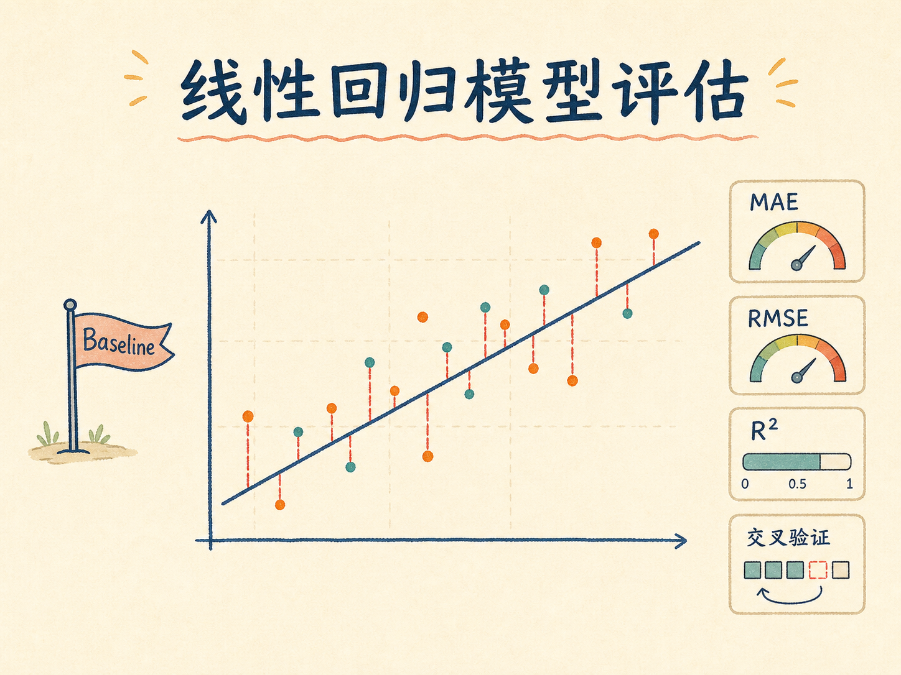
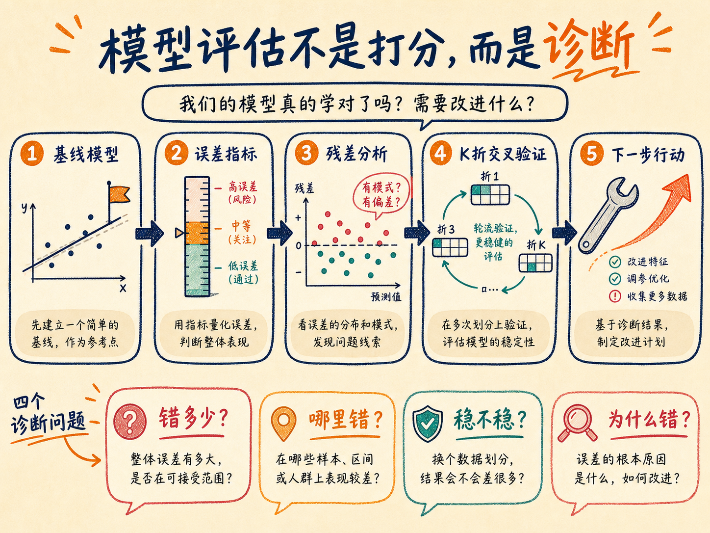
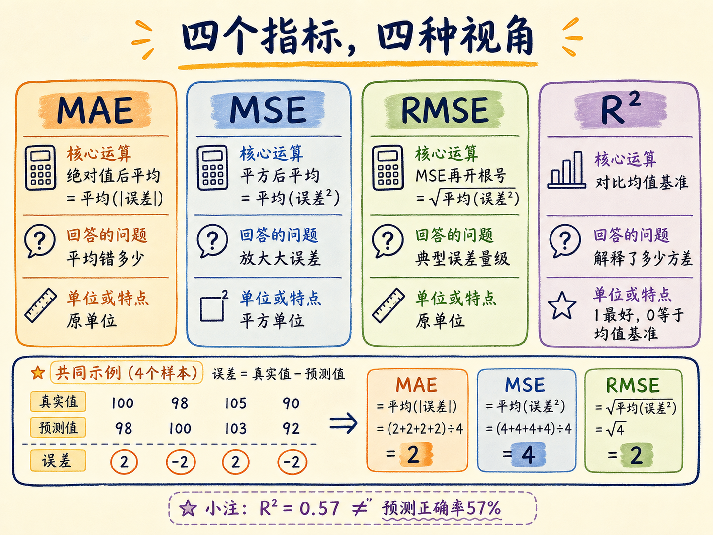
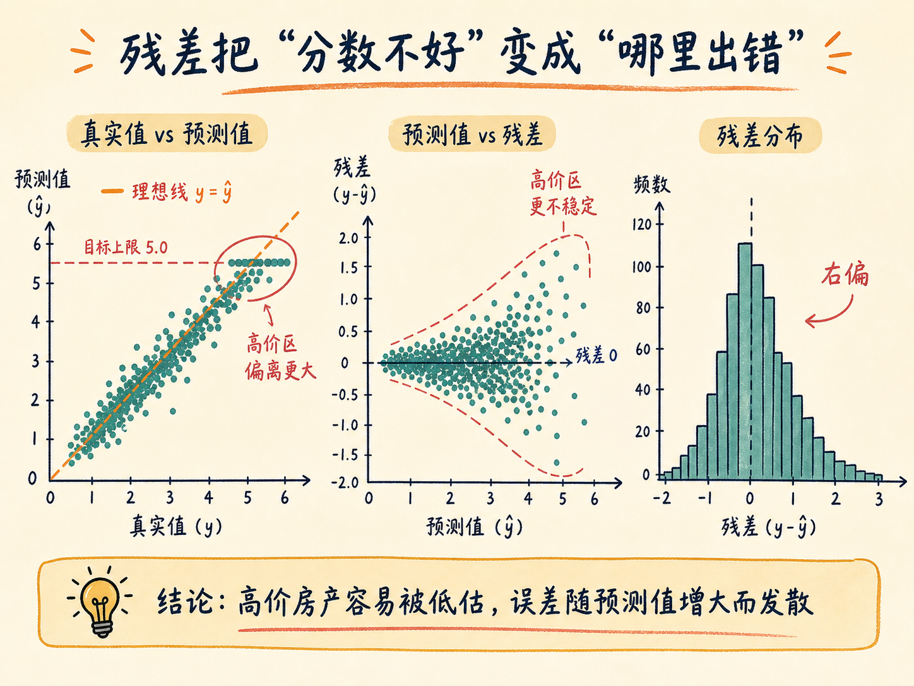
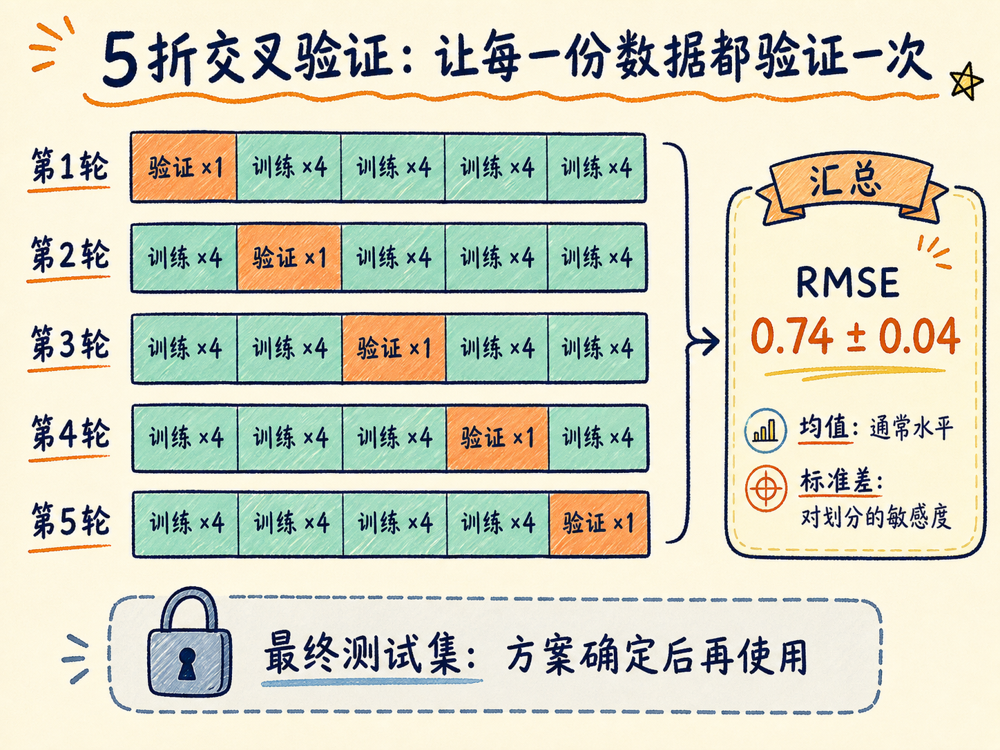
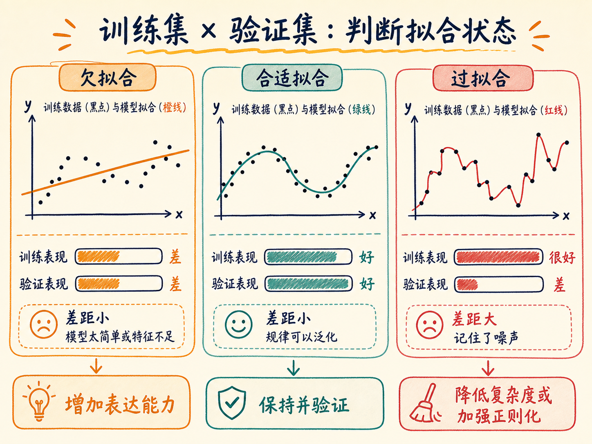

# 线性回归模型评估：从一个分数走向可行动的诊断

模型训练完成后，你随手打印十组结果：有几组预测得很接近，也有几组偏得离谱。此时说模型“还行”或者“不太准”都没有意义，因为你仍然不知道误差有多大、错误集中在哪里，也不知道下一步该改数据、改特征，还是换模型。

模型评估要做的，不是给模型判一个孤立的分数，而是建立一条诊断链：先用基线模型确定起点，再用误差指标衡量偏差，用残差图寻找错误结构，用交叉验证排除一次随机划分的运气，最后比较训练与验证表现，判断模型更像欠拟合还是过拟合。

读完这篇，你会知道

- 为什么第一版模型应该追求“可比较”，而不是一开始就追求复杂
- MAE、MSE、RMSE 和 $R^2$ 分别回答什么问题
- 为什么残差图比单个分数更接近“诊断工具”
- K 折交叉验证如何区分模型能力与随机运气
- 怎样从训练集和验证集的差距判断欠拟合与过拟合

## 先建立基线：没有参照，就没有优化

基线模型（baseline）是最先快速实现的、相对简单且流程可靠的模型。它的首要任务不是取得最高分，而是给后续实验提供一个稳定参照。

如果没有基线，每次加入新特征、改变预处理或更换算法后，你只能说结果“看起来不一样”。有了基线，问题会变成：RMSE 是否真的下降？不同数据划分下是否仍然更好？改善来自泛化能力，还是只来自对训练集记得更牢？

以加州房价数据为例，可以用 8 个特征预测街区房价中位数，目标值的单位是 10 万美元。一个合理的起点是：先划分训练集和测试集，只在训练数据上学习预处理参数，再训练 `LinearRegression`。

需要注意，标准化通常写成 $z=(x-\mu)/\sigma$，它让特征的均值约为 0、标准差约为 1，但不会自动把任意分布变成正态分布。这个区别会影响我们如何解释数据和残差。

基线建立后，评估可以按四个问题推进：错多少、哪里错、稳不稳、为什么错。

## 第一个问题：模型平均错多少

设真实值为 $y_i$，预测值为 $\hat y_i$，残差为 $e_i=y_i-\hat y_i$，样本数为 $n$。

### MAE：一次预测通常偏离多少

平均绝对误差 MAE 为：

$$\mathrm{MAE}=\frac{1}{n}\sum_{i=1}^{n}|y_i-\hat y_i|$$

它把每次预测偏差的绝对值直接取平均，因此和目标变量保持相同单位。若房价目标以 10 万美元为单位，MAE 为 0.5，就表示一次预测平均偏离约 5 万美元。

MAE 的优点是直观，而且不会因为平方而过度放大少数极端误差。代价是它对“大错”和“小错”按线性比例计罚；当业务不能接受少数巨大偏差时，MAE 可能不够敏感。

### MSE：大错要付出更高代价

均方误差 MSE 为：

$$\mathrm{MSE}=\frac{1}{n}\sum_{i=1}^{n}(y_i-\hat y_i)^2$$

误差为 2 时，平方后变成 4；误差为 0.1 时，平方后变成 0.01。平方让大误差获得更高权重，也让目标函数连续、便于求导，因此 MSE 常用于线性回归训练。

但平方也改变了量纲。房价的 MSE 不再是“美元”，而是“美元平方”，业务人员很难直接解释这个数字。

### RMSE：保留对大误差的敏感，又回到原单位

均方根误差 RMSE 是 MSE 的平方根：

$$\mathrm{RMSE}=\sqrt{\frac{1}{n}\sum_{i=1}^{n}(y_i-\hat y_i)^2}$$

它仍然会被大误差拉高，但数值重新回到目标变量的单位。若 RMSE 为 0.746，而房价单位是 10 万美元，就表示典型误差量级约为 7.46 万美元。

RMSE 通常不小于 MAE。两者差距明显时，往往意味着误差分布中存在一批较大的偏差。不过，仅凭两者差距不能知道这些大误差发生在哪类样本上，还要继续看残差。

### $R^2$：模型比“始终猜均值”好多少

决定系数 $R^2$ 为：

$$R^2=1-\frac{\sum_i(y_i-\hat y_i)^2}{\sum_i(y_i-\bar y)^2}$$

其中 $\bar y$ 是真实值的均值。分子是模型的残差平方和，分母是“所有样本都预测为均值”时的误差平方和。

- $R^2=1$：预测与真实值完全一致；
- $R^2=0$：模型和始终预测均值差不多；
- $R^2<0$：模型在这批数据上还不如均值基准。

$R^2=0.57$ 的准确含义是：相对均值基准，模型解释了约 57% 的目标方差。它不是“57% 的房子预测正确”，也不能单独告诉我们误差是几万美元。

这四个指标不是互相替代的排行榜。MAE 和 RMSE回答“偏差多大”，两者差距提示“大错是否突出”，$R^2$ 回答“相比均值基准学到了多少”。把它们放在一起，才有可解释的起点。

## 第二个问题：模型到底在哪里错

总分只能告诉你结果不够好，残差能告诉你错误有没有结构。

残差定义为：

$$e_i=y_i-\hat y_i$$

残差为正，表示真实值高于预测值，模型低估了；残差为负，表示模型高估了。一个合适的回归模型，其残差应在 0 附近随机散开，不应随着预测值出现明显曲线、漏斗或分组结构。

最有用的三类图是：

1. 真实值对预测值散点图：理想状态下，点应靠近 $y=\hat y$ 的对角线；
2. 预测值对残差散点图：理想状态下，点应在 0 上下随机分布；
3. 残差直方图：用于查看误差是否明显偏斜、长尾或包含异常群体。

在加州房价基线中，高价区域的误差更分散，模型还倾向于低估高价房产。这比“RMSE 约为 0.746”多给了一层信息：问题并非所有价格段都同样严重，而是高价值样本更不稳定。

这里还存在一个数据边界：该数据集的目标值在 5.0 附近存在上限截断，也就是 50 万美元附近的房价被压到同一个上限。模型看到的不是完整高价分布，残差结构会同时受到数据截断和线性模型表达能力的影响。

因此残差图不是直接给出答案，而是在缩小排查范围：

- 出现弯曲结构，可能缺少非线性项或特征交互；
- 呈漏斗形发散，可能存在异方差，误差随目标规模增大；
- 某一群体整体偏正或偏负，可能遗漏了分组特征；
- 少数点远离主体，可能存在异常值、数据错误或特殊样本；
- 在目标上限堆积，可能是采集或标签截断造成的边界效应。

## 第三个问题：结果稳定，还是这次划分运气好

一次训练集与测试集划分只是一次抽样。换一个随机种子后，某些难样本可能从测试集进入训练集，分数也可能随之改变。

K 折交叉验证把数据分成 $K$ 份。每一轮取 1 份作为验证集，其余 $K-1$ 份作为训练集；轮换 $K$ 次后，每一份都恰好做过一次验证集。

最后不要只看 $K$ 个分数的平均值，还要看标准差：

- 平均 RMSE 代表模型通常能达到的误差水平；
- RMSE 标准差代表结果对数据划分有多敏感。

假设 5 折 RMSE 的均值约为 0.74、标准差约为 0.04，可以判断模型表现相对稳定：当前误差不太像某一次划分造成的偶然结果。稳定不等于优秀，它只说明模型持续地处在相近水平。

使用 scikit-learn 时还要注意，评分接口通常遵循“越大越好”，所以 RMSE 常以负值形式返回，例如 `neg_root_mean_squared_error`。读取结果时需要取负号还原，而不是把负 RMSE 当作真实业务含义。

交叉验证用于模型选择和诊断，最终测试集仍应保持独立，只在方案确定后用于一次最终评估。否则不断查看测试集并据此改模型，测试集也会逐渐变成训练过程的一部分。

## 第四个问题：模型太简单，还是记得太多

把训练集和验证集指标并排看，可以形成一张最实用的诊断表。

### 欠拟合：训练集和验证集都不好

如果模型在训练集上表现就不理想，在验证集上也差不多差，而且两者差距不大，问题通常不是“泛化失败”，而是模型连训练数据中的主要规律都没有学充分。

这叫欠拟合。常见原因包括：

- 模型表达能力太弱，例如用一条直线拟合明显的曲线关系；
- 特征不足，关键业务变量没有进入模型；
- 缺少多项式项、交互项或合适的数据变换；
- 正则化过强，把有效关系也压掉了。

### 过拟合：训练集很好，验证集明显变差

如果训练误差很低，而验证误差明显更高，说明模型学到了训练数据中特有的细节，包含噪声和偶然关系。它像是记住了练习题答案，却没有掌握解题规律。

这叫过拟合。常见改进方向包括：降低模型复杂度、增加正则化、减少噪声特征、增加高质量数据，或重新检查是否存在数据泄漏。

在加州房价线性基线中，训练集与验证集的 RMSE、MAE 和 $R^2$ 相差不大，但两边都不算理想。这意味着没有明显过拟合，问题更接近欠拟合：当前线性关系和 8 个原始特征还没有充分描述房价结构。

不过，这是一条诊断假设，不是最终结论。下一步应通过增加合理特征、加入非线性关系或尝试更有表达能力的模型，再用同一套交叉验证流程检验是否真正改善。

## 一条可复用的回归评估链

面对一个新的回归任务，可以按以下顺序推进：

1. 明确目标单位和业务可接受误差；
2. 建立简单、可复现的基线模型；
3. 保留独立测试集，所有预处理只在训练数据上学习；
4. 同时报告 MAE、RMSE 和 $R^2$，不要只挑最好看的一个；
5. 比较 MAE 与 RMSE，判断大误差是否突出；
6. 画真实值—预测值图、残差图和残差分布图；
7. 用 K 折交叉验证报告均值与标准差；
8. 对比训练集与验证集表现，判断欠拟合或过拟合；
9. 根据诊断只改变一个主要因素，再和同一基线比较；
10. 方案确定后，最后一次使用测试集验证泛化能力。

这条链路把“模型不准”拆成四类证据：误差量级、错误结构、抽样稳定性和拟合状态。每一类证据都对应不同的优化方向。

## 最后收束：评估的终点不是分数，而是下一步行动

一个 RMSE 只能告诉你模型离答案还有多远，不能告诉你为什么。残差图揭示哪里出了问题，交叉验证告诉你问题是不是偶然，训练与验证的对比则帮助判断该增加表达能力，还是抑制复杂度。

所以，模型评估真正有价值的产物不是一句“这个模型还可以”，而是一份可以执行的诊断：它在哪些样本上失败、失败是否稳定、最可能的原因是什么，以及下一次实验应该改变什么。
