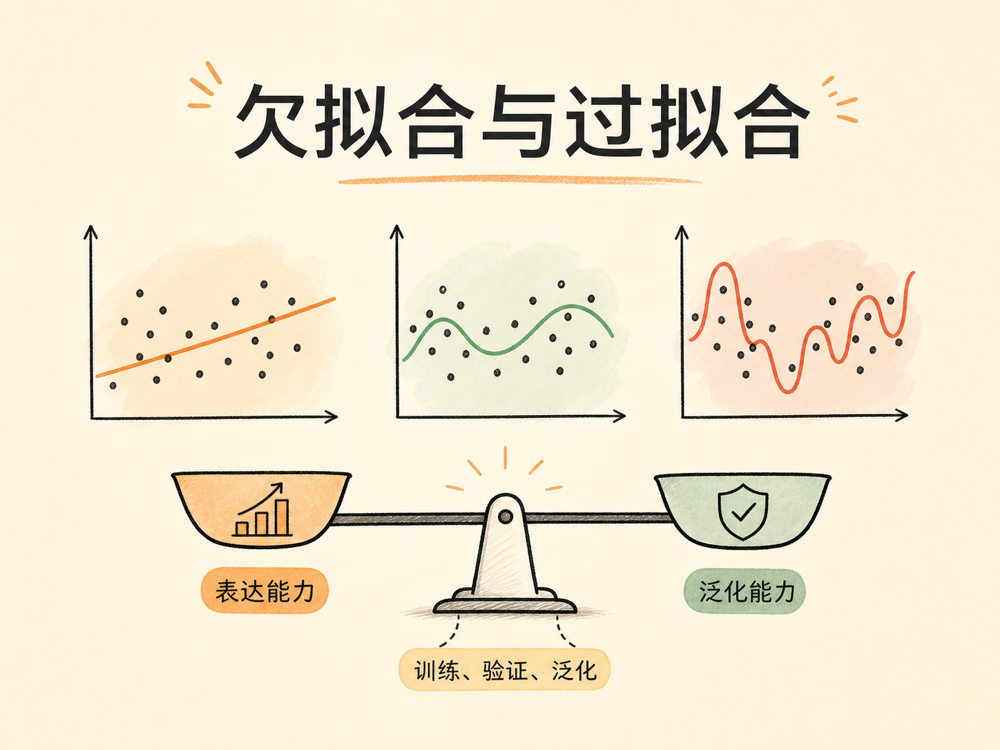
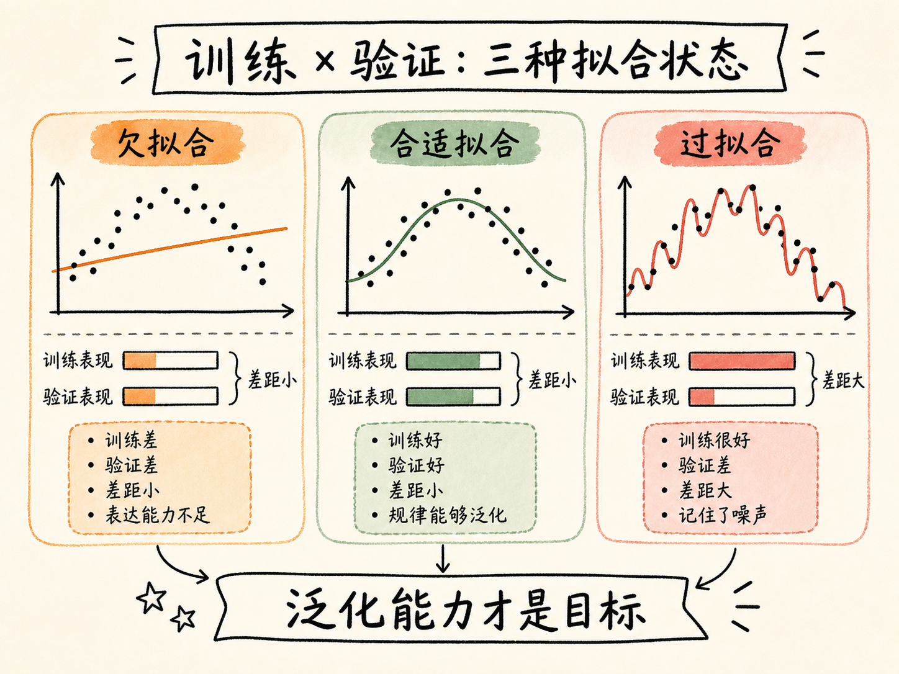
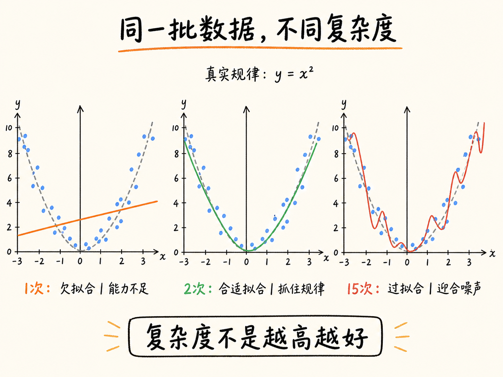
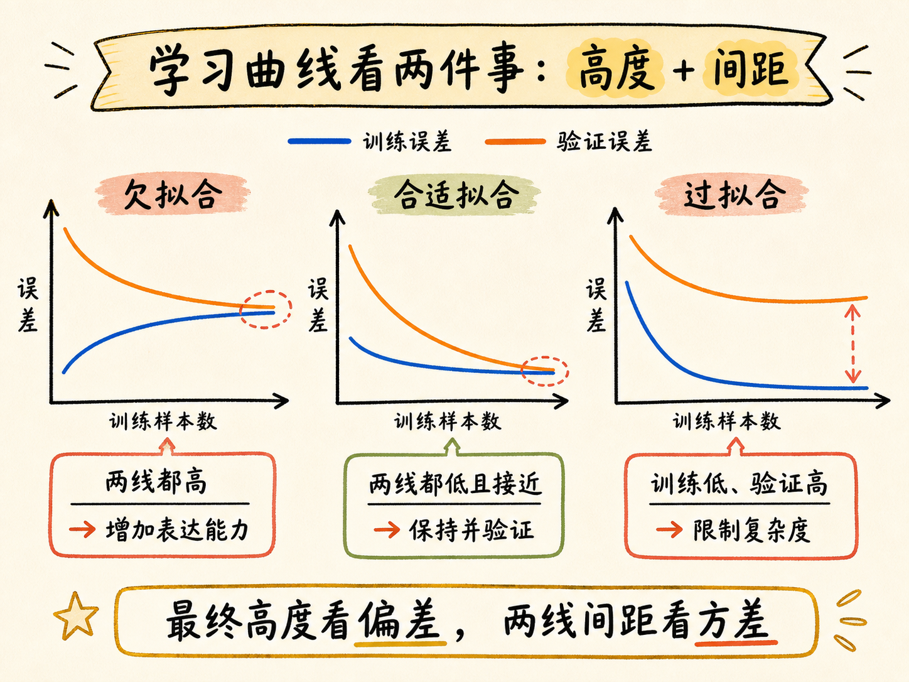
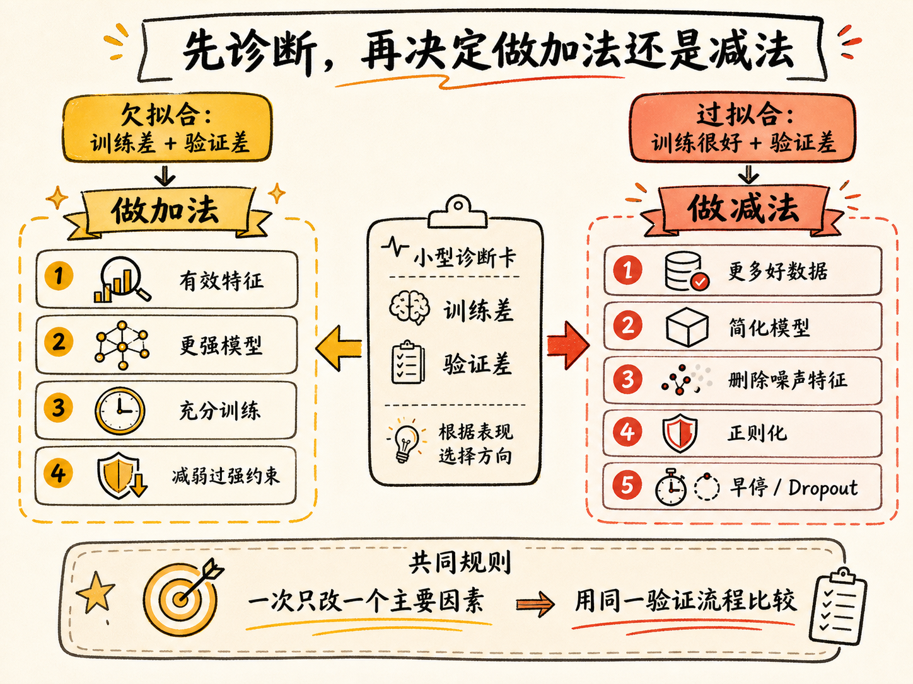
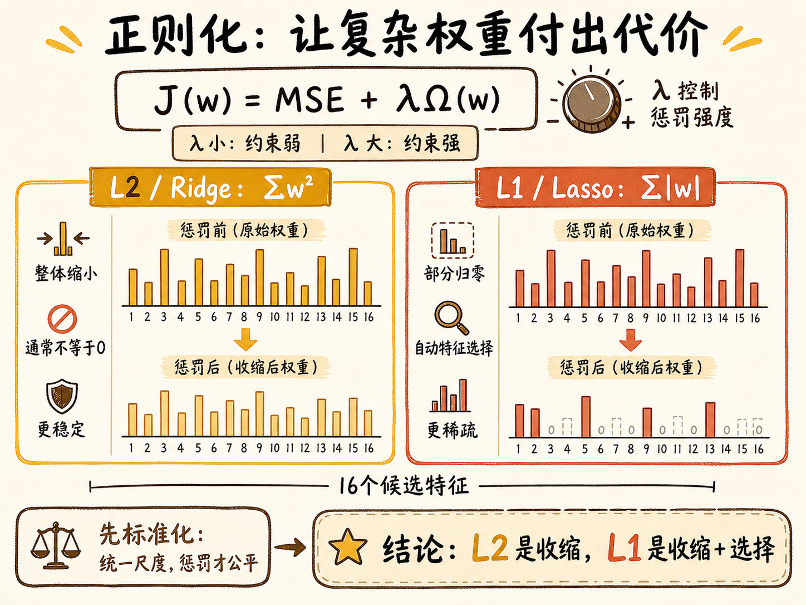

# 欠拟合与过拟合：先看学习曲线，再决定做加法还是减法

一个模型在训练集上拿到近乎完美的成绩，未必值得高兴。它可能真的学会了规律，也可能只是把训练样本和噪声一起背了下来。反过来，一个训练成绩普通的模型，也不一定只是“还需要多练几轮”；它可能从一开始就没有能力表达数据中的关系。

机器学习真正追求的不是记住已经见过的数据，而是对没见过的数据也能做出可靠预测，这种能力叫泛化。欠拟合与过拟合，就是模型偏离良好泛化的两个方向：一个学得不够，一个记得太细。诊断清楚以后，解决思路其实很直接——欠拟合通常做加法，过拟合通常做减法。

读完这篇，你会知道

- 怎样从训练集与验证集表现区分欠拟合和过拟合
- 为什么 1 次、2 次和 15 次多项式会得到完全不同的结果
- 学习曲线如何把“模型效果不好”变成可判断的证据
- 欠拟合时应该加什么，过拟合时又该减什么
- L1 与 L2 正则化如何抑制过拟合，以及二者有什么差别

## 模型要学的是规律，不是答案

把模型训练想成学生备考，会比较容易理解。

欠拟合像是只背了课本目录。训练题不会做，换成考试新题更不会做。它的问题不是粗心，而是连主要规律都没有学进去。对应到模型上，就是训练误差高，验证误差也高，而且两者通常相差不大。

过拟合则像是把练习册答案逐字背了下来。训练题一模一样时答得很好，题目稍微变化就束手无策。模型不仅学习了稳定规律，还把训练数据里的偶然波动和噪声当成了规律。于是训练误差很低，验证误差却明显更高。

这里要区分验证集和测试集。训练过程中反复比较模型时，应该看训练集与验证集；测试集应尽量留到方案确定后再做最终评估。否则测试集被反复用于决策，也会间接参与训练过程。

所以，第一张诊断表可以写得非常简单：

| 拟合状态 | 训练表现 | 验证表现 | 两者差距 | 核心问题 |
| --- | --- | --- | --- | --- |
| 欠拟合 | 差 | 差 | 通常较小 | 表达能力不足，规律没学会 |
| 合适拟合 | 好 | 好 | 较小 | 学到的规律能够泛化 |
| 过拟合 | 很好 | 差 | 明显较大 | 记住了训练数据的噪声 |

这张表比只看一个训练分数更有用，因为训练分数只能回答“记住了多少”，不能回答“能不能迁移到新数据”。

## 一条抛物线，为什么能难住直线，也能诱惑高阶曲线

假设数据背后的真实规律是 $y=x^2$，但每个观测点还叠加了一些高斯噪声。现在分别用 1 次、2 次和 15 次多项式去拟合。

### 1 次模型：能力边界决定了它学不会

1 次模型只有 $y=wx+b$ 这样的直线。无论怎样调整 $w$ 和 $b$，一条直线都无法表示抛物线。继续增加同类训练数据，或者盲目延长训练时间，都不能改变这个表达能力边界。

这就是典型欠拟合：不是参数还没调好，而是模型假设过于简单。训练误差和验证误差都会停在较高水平。

### 2 次模型：复杂度与真实规律匹配

2 次多项式可以写成 $y=w_2x^2+w_1x+b$。它的表达空间包含真实关系 $y=x^2$，所以在数据和训练过程合理时，模型能够找到一条接近真实规律、又不必穿过每一个噪声点的平滑曲线。

这时训练误差较低，验证误差也较低，两条曲线最终靠得比较近。模型既利用了训练数据，又没有被个别样本牵着走。

### 15 次模型：能力太强，也可能用错地方

15 次多项式自由度很高。它可以不断弯折，试图穿过几乎每一个训练点，因此训练误差甚至可能比 2 次模型更低。

问题在于，那些额外弯折往往是在迎合噪声。换一批带有不同噪声的新样本后，曲线的剧烈波动就不再成立，验证误差随之升高。这就是过拟合：模型有能力表达规律，但把多余能力用在了记忆偶然细节上。

这个例子说明，模型复杂度不是越高越好。合适的复杂度，取决于数据中的稳定结构、噪声水平和样本数量。

## 学习曲线：不要猜，让误差自己说话

只比较一次训练结果，容易受到某次数据划分的影响。学习曲线会逐步增加训练样本数量，并在每个规模下记录训练误差与交叉验证误差，从而展示“数据越来越多时，模型表现如何变化”。

可以把训练集从 10%、20% 一直增加到 100%。每个规模下，用交叉验证得到更稳定的验证误差。横轴是训练样本数量，纵轴是误差。

### 欠拟合的学习曲线：两条线靠近，但都停得很高

数据很少时，模型可能暂时把少量训练样本拟合得不错；随着样本增多，训练误差会上升并趋于稳定。验证误差通常从较高位置下降，最后与训练误差靠近。

如果两条曲线最终都停在较高误差，而且差距很小，就说明增加同类数据的收益已经有限。模型连训练数据的主要规律都表示不好，问题更可能在模型、特征或优化过程。

### 过拟合的学习曲线：训练线很低，验证线高得多

过拟合模型在训练集上表现很好，所以训练误差长期保持较低；验证误差则明显更高，两条曲线之间存在较大间隙。

如果随着样本增加，验证误差仍在下降、两条线仍在靠近，那么更多高质量数据可能继续改善泛化。如果曲线已经稳定却仍有大间隙，就要更直接地降低模型复杂度或加强约束。

### 良好拟合的学习曲线：两条线都低，而且差距小

理想情况不是训练误差等于零，而是训练误差和验证误差都进入可接受范围，并在较低位置接近。所谓“可接受”，还要结合目标量纲、业务风险和基线模型判断，不能只看图形是否漂亮。

因此学习曲线回答了两个不同问题：曲线最终停在哪里，反映模型的偏差是否过高；两条曲线相隔多远，反映模型的方差是否过高。

## 欠拟合要做加法，但先确认缺的是什么

欠拟合的核心是表达能力不足或训练不足。解决方向通常是增加有效能力，而不是机械地把所有东西都加大。

### 增加有信息量的特征

如果关键变量没有进入模型，再复杂的算法也无法凭空恢复信息。可以加入新的业务特征，也可以构造多项式项、交互项或合适的数学变换。例如，对 $y=x^2$ 的关系加入 $x^2$ 特征，就给线性回归提供了表示曲线的入口。

### 使用更有表达力的模型

当线性模型无法描述明显的非线性关系时，可以尝试决策树、随机森林或其他更复杂模型。复杂模型不是天然更好，但在当前模型的能力上限已经明确时，提升复杂度是合理方向。

### 让优化过程真正收敛

如果模型能力足够，只是训练轮数太少、学习率不合适或优化尚未收敛，那么延长训练或调整优化参数可能有效。这里需要先看训练损失是否仍在明显下降。若模型结构本身无法表达目标关系，多训练并不会解决问题。

### 检查约束是否过强

正则化过强也会造成欠拟合，因为它把有效权重一起压得太小。此时可以适当减弱正则化强度。这个动作看似是在“做减法”，实际是在释放模型原本被限制的表达能力。

## 过拟合要做减法：减少模型对偶然细节的自由度

过拟合的核心是模型对训练数据中的噪声过于敏感。解决方案的共同目标，是让模型更难依赖偶然细节。

### 增加高质量数据

更多样本能稀释孤立噪声，让稳定规律反复出现。数据增强也可以在合理假设下扩大有效样本。需要注意，重复收集同一种偏差数据不会自动解决问题；新增数据必须覆盖模型真正会遇到的变化。

### 降低模型复杂度

15 次多项式明显过度时，可以降低阶数；决策树过深时，可以限制深度；神经网络容量过大时，可以减少层数或参数。问题是现实中通常不知道“正确复杂度”是多少，所以需要通过交叉验证比较候选方案，而不是凭感觉一次选中。

### 删除无关或冗余特征

噪声特征为模型提供了制造偶然关系的机会。通过业务判断、特征选择和稳定性验证减少无关输入，可以降低方差。但删除特征也可能损失有效信息，因此要在固定验证流程下比较，而不是只看训练分数。

### 早停与 Dropout

在迭代训练中，验证误差通常先下降，随后可能因为模型开始记忆训练细节而上升。早停（early stopping）会在验证误差不再改善时停止训练，并保留表现最好的参数。

在神经网络中，Dropout 会在训练时随机屏蔽一部分神经元，降低模型对少数连接的依赖。它们都不是让模型“少学规律”，而是减少模型记忆特定训练路径的机会。

## 正则化：不拆掉模型，而是让复杂参数付出代价

直接降低模型复杂度，需要事先决定保留几次项、多少特征或多深的树。正则化提供了另一条路径：保留候选能力，但在损失函数中对过大的权重增加惩罚，让模型只有在确实能明显改善拟合时才使用复杂参数。

设线性模型的原始损失为均方误差：

$$\mathrm{MSE}=\frac{1}{n}\sum_{i=1}^{n}(y_i-\hat y_i)^2$$

正则化后的优化目标可以写成：

$$J(\mathbf{w})=\mathrm{MSE}+\lambda\,\Omega(\mathbf{w})$$

其中 $\mathbf{w}$ 是模型权重，$\Omega(\mathbf{w})$ 是复杂度惩罚，$\lambda$ 控制惩罚强度。$\lambda$ 太小，约束不足，模型仍可能过拟合；$\lambda$ 太大，有效关系也会被压制，模型又会转向欠拟合。

### L2 正则化：把权重整体压小

L2 正则化使用权重平方和：

$$\Omega_{L2}(\mathbf{w})=\sum_{j=1}^{p}w_j^2$$

在线性回归中，它通常称为 Ridge 回归。平方会让大权重受到更强惩罚，因此模型倾向于把权重平滑地缩小。大多数权重会接近 0，但通常不会恰好变成 0，所以 L2 更像是“所有特征都保留，但不要让任何一个权重走得太远”。

这种处理通常比较稳定，尤其适合多个特征都可能有贡献、或者特征之间存在相关性的情况。

### L1 正则化：把部分权重直接压到 0

L1 正则化使用权重绝对值之和：

$$\Omega_{L1}(\mathbf{w})=\sum_{j=1}^{p}|w_j|$$

在线性回归中，它通常称为 Lasso。Lasso 是 `Least Absolute Shrinkage and Selection Operator` 的缩写。它的解具有稀疏性：一些不重要特征的权重可以直接变成 0，相当于模型在训练时同时完成特征选择。

因此，L1 更适合希望得到稀疏模型的场景；代价是当多个特征高度相关时，它可能只保留其中一部分，特征选择结果会对数据扰动更敏感。

### 为什么正则化前通常要先标准化

正则化直接惩罚权重大小，而权重大小又受特征量纲影响。一个数值范围很大的特征，可能只需要很小权重；一个数值范围很小的特征，可能需要更大权重。若不先统一尺度，惩罚就不再公平。

因此常见做法是把 `PolynomialFeatures`、`StandardScaler` 和 Ridge 或 Lasso 放进同一个 `Pipeline`。这样既能保证每次训练与交叉验证都只从训练折学习缩放参数，也能减少数据泄漏风险。

## 把诊断变成一套行动顺序

遇到模型效果不好时，可以按下面的顺序排查：

1. 用独立验证集或交叉验证得到训练误差与验证误差；
2. 画学习曲线，观察两条曲线的最终高度和间距；
3. 两边都差且差距小，优先排查欠拟合；
4. 训练很好、验证明显更差，优先排查过拟合；
5. 欠拟合时检查特征、模型能力、优化收敛和正则化强度；
6. 过拟合时检查数据量与覆盖、模型复杂度、噪声特征、正则化和早停；
7. 每次只改变一个主要因素，用同一套验证流程与基线比较；
8. 方案确定后，最后一次使用测试集检验真实泛化能力。

这套流程的重点不是给模型贴标签，而是把标签连接到下一步实验。只有当诊断能改变行动，欠拟合和过拟合才不只是两个定义。

## 最后收束：训练成绩不是目的，泛化能力才是

欠拟合与过拟合看起来相反，背后其实是同一个问题：模型的有效复杂度与数据规律不匹配。欠拟合时，模型没有足够能力学习稳定规律；过拟合时，模型把多余能力花在了偶然噪声上。

所以最值得记住的不是一串解决技巧，而是一条判断逻辑：先比较训练与验证表现，再用学习曲线确认误差的高度和间距；欠拟合就增加有效表达能力，过拟合就限制对偶然细节的自由度。模型真正学会的标志，不是训练集上的满分，而是面对新数据仍然答得出来。
