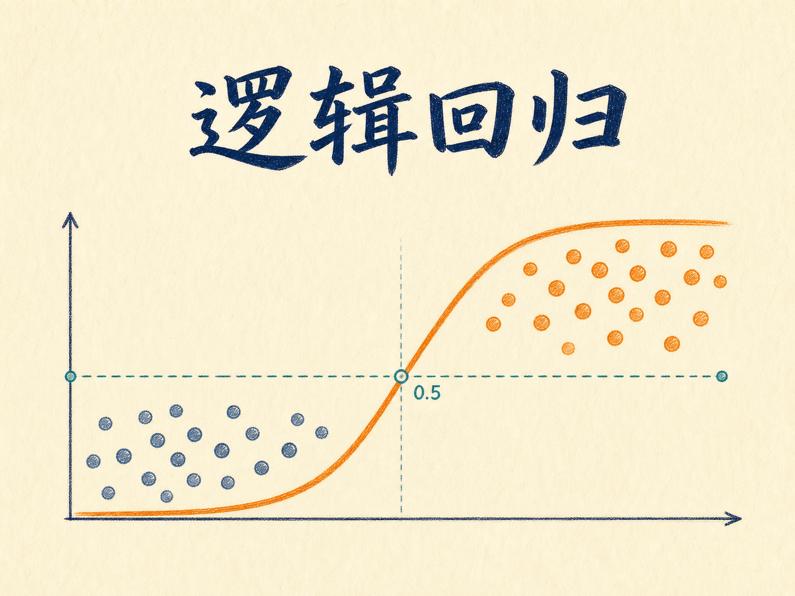
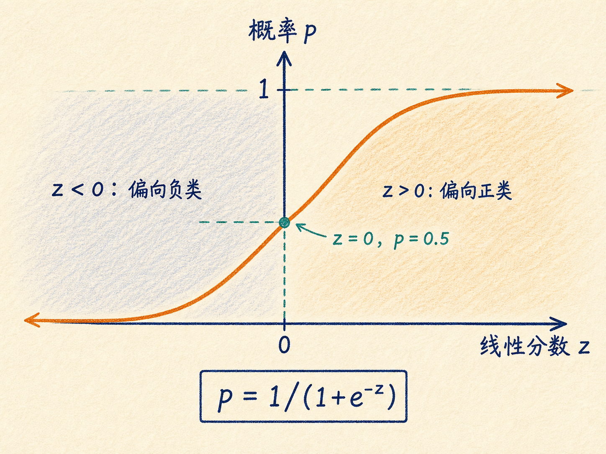
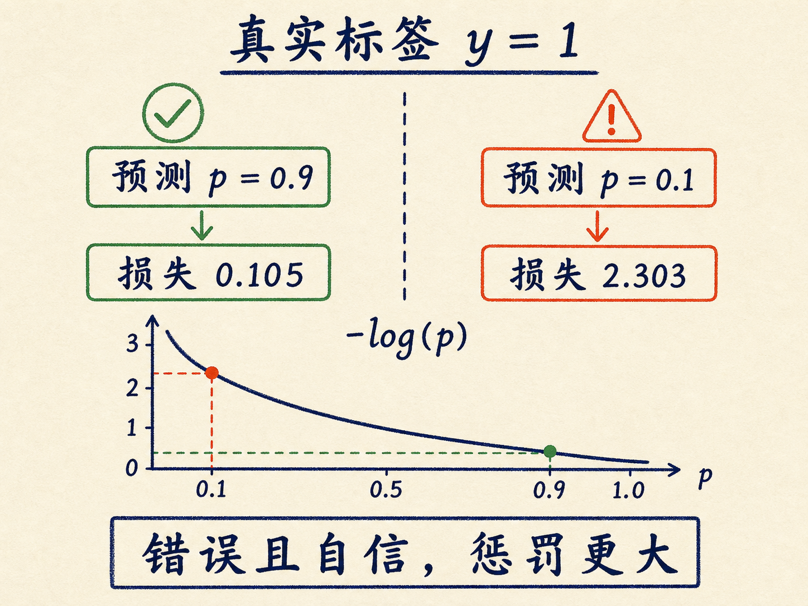
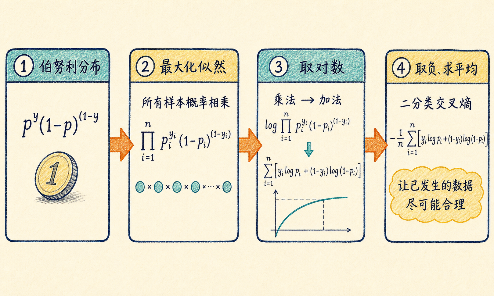
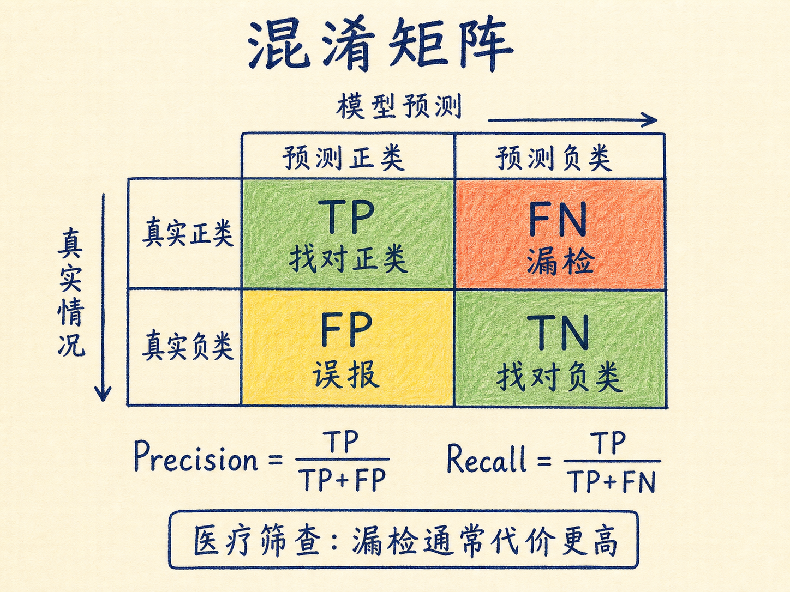
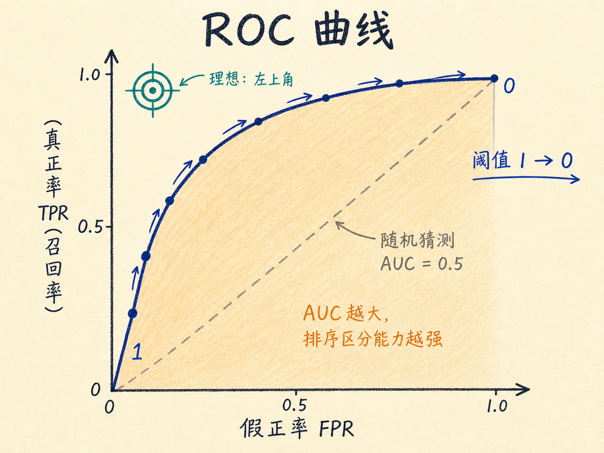

# 逻辑回归：把一个分数变成可以决策的概率

一封邮件要么是垃圾邮件，要么不是；一次检测要么提示恶性风险，要么没有。我们需要的不是“价格是多少”，而是“它更可能属于哪一类”。但计算机擅长做的，仍然只是把一组数字加权相加。

逻辑回归解决的正是这道转换题：先像线性回归一样算出一个分数，再把这个分数压进 0 到 1 之间，解释成概率，最后根据业务代价做决定。它结构简单，却已经包含了神经网络输出层、交叉熵和分类评估的基本骨架。

读完这篇，你会知道

- 为什么不能直接用线性回归做二分类
- Sigmoid 如何把任意实数变成概率
- 交叉熵为什么比均方误差更适合逻辑回归
- 为什么准确率高不等于模型有用
- 决策阈值、精确率、召回率和 AUC 如何共同决定模型价值

## 分类问题问的不是“多少”，而是“属于哪一类”

线性回归预测连续数值，例如房价、温度或销量；分类模型预测有限个互斥标签，例如垃圾邮件与正常邮件、良性与恶性、数字 0 到 9。

二分类常用 $y\in\{0,1\}$ 表示真实标签。看起来，我们似乎可以让线性回归输出一个数，再规定“大于 0.5 是 1，否则是 0”。问题在于，线性模型的输出 $z=\mathbf{w}^{\mathsf T}\mathbf{x}+b$ 可以从负无穷延伸到正无穷。预测出 $-50$ 或 $10000$，都很难解释成概率。

更重要的是，分类任务需要一套与概率相匹配的训练目标。模型不只要跨过一条界线，还要能表达“有多确定”，并且在非常自信却判断错误时受到更大的惩罚。

## 第一步：线性模型先算一个分数

输入特征记为 $\mathbf{x}$，权重记为 $\mathbf{w}$，偏置记为 $b$。线性部分先计算：

$$z=\mathbf{w}^{\mathsf T}\mathbf{x}+b$$

$z$ 不是概率，而是样本偏向正类还是负类的原始分数。$z$ 越大，模型越倾向于正类；$z$ 越小，越倾向于负类。真正需要解决的是：怎样把整个实数轴平滑地映射到 0 和 1 之间？

## 第二步：Sigmoid 把分数压成概率

逻辑回归使用 Sigmoid 函数：

$$\sigma(z)=\dfrac{1}{1+e^{-z}}$$

预测概率记为 $\hat y=\sigma(z)$。它有三个关键性质：

- 无论 $z$ 多大或多小，$\hat y$ 都严格落在 0 到 1 之间。
- 当 $z=0$ 时，$\hat y=0.5$，自然形成默认决策边界。
- 它连续且处处可导，导数为 $\sigma'(z)=\sigma(z)[1-\sigma(z)]$，可以用梯度下降更新参数。

如果阈值设为 0.5，那么 $z\ge 0$ 时预测正类，$z<0$ 时预测负类。这里需要区分两个概念：Sigmoid 给出的是概率分数，阈值负责把概率变成最终类别。阈值并不是模型不可修改的常数，而是业务决策的一部分。

为什么不用一个更直接的阶跃函数：$z<0$ 输出 0，$z\ge0$ 输出 1？因为阶跃点不可导，其他位置的梯度又几乎处处为零，模型无法从错误中得到连续的调整方向。

## 第三步：用交叉熵衡量“错得有多离谱”

对于真实标签为 1 的样本，预测概率越接近 1 越好；如果模型非常自信地预测成 0，损失应该急剧增大。真实标签为 0 时则正好相反。

二分类交叉熵恰好满足这个要求。单个样本的损失是：

$$\ell(y,\hat y)=-[y\log\hat y+(1-y)\log(1-\hat y)]$$

因为 $y$ 只能是 0 或 1，这个看似复杂的公式其实只是把两个分支写在了一起：

- 当 $y=1$ 时，$\ell=-\log\hat y$。$\hat y$ 越接近 1，损失越接近 0。
- 当 $y=0$ 时，$\ell=-\log(1-\hat y)$。$\hat y$ 越接近 0，损失越接近 0。

假设真实标签是 1。模型预测 0.9 时，损失约为 0.105；预测 0.1 时，损失约为 2.303。后者不仅判断错了，而且错得很自信，因此惩罚大得多。

## 交叉熵从哪里来：最大似然的一条直线

把二分类想成一次带偏硬币实验。若正类概率是 $p$，则负类概率是 $1-p$。伯努利分布可以把两种情况合成一个公式：

$$P(y\mid\mathbf{x})=p^y(1-p)^{1-y}$$

对一批相互独立的样本，整批观测同时出现的概率是各样本概率的乘积。最大似然估计的想法很直接：既然这批数据已经出现，就寻找一组参数，让它们出现的概率最大。

连续相乘许多小于 1 的概率容易造成数值下溢，所以先取对数，把乘法变成加法。最大化对数似然，再取负号并对样本求平均，就得到二分类交叉熵：

$$J(\mathbf{w},b)=-\dfrac{1}{m}\sum_{i=1}^{m}[y_i\log\hat y_i+(1-y_i)\log(1-\hat y_i)]$$

这里 $m$ 是样本数。对于线性得分加 Sigmoid 的标准逻辑回归，这个目标关于参数是凸的，因此不会出现由目标函数本身造成的多个局部最小值。这也是不能简单把“Sigmoid 加上均方误差”当作标准训练方案的重要原因。

求导后的形式比损失函数看起来简单得多：

$$\dfrac{\partial J}{\partial\mathbf{w}}=\dfrac{1}{m}\mathbf{X}^{\mathsf T}(\hat{\mathbf y}-\mathbf y),\quad \dfrac{\partial J}{\partial b}=\dfrac{1}{m}\sum_{i=1}^{m}(\hat y_i-y_i)$$

它和线性回归的梯度结构很相似，差别主要在预测值：线性回归直接输出 $z$，逻辑回归输出 $\sigma(z)$。

## 一个模型准确率 99%，为什么仍可能毫无用处

假设 10000 个样本中有 99% 是正常样本。一个模型无论看到什么都预测“正常”，准确率仍有 99%，但它一个真正的异常都找不到。

分类模型必须把四种结果拆开看：

| 真实情况 | 预测为正 | 预测为负 |
|---|---:|---:|
| 正类 | TP，真正例 | FN，假负例 |
| 负类 | FP，假正例 | TN，真负例 |

在恶性肿瘤筛查中，FN 表示患者实际有恶性风险，模型却判断为阴性，也就是漏检；FP 表示实际没有恶性风险，模型却给出阳性提示，也就是误报。误报会带来复查成本，漏检却可能延误治疗，两种错误的代价并不相等。

因此，我们至少还要看三个指标：

- 精确率 $\text{Precision}=\dfrac{TP}{TP+FP}$：模型预测为正的样本中，有多少真的为正。它衡量“报出来的结果有多可靠”。
- 召回率 $\text{Recall}=\dfrac{TP}{TP+FN}$：所有真实正类中，有多少被模型找到了。它衡量“该找的找回了多少”。
- $F_1=2\dfrac{\text{Precision}\cdot\text{Recall}}{\text{Precision}+\text{Recall}}$：精确率与召回率的调和平均，只有两者都不太差时才会较高。

## 阈值不是数学答案，而是业务选择

默认阈值 0.5 只表示“正类概率超过一半就判为正类”。如果医疗筛查更怕漏检，可以把阈值从 0.5 降到 0.4：更多样本会被判为阳性，召回率通常上升，但误报也可能增加。如果审核成本很高，更强调每一次报警都可靠，就可能提高阈值，换取更高精确率。

阈值的选择，本质上是在 FN 与 FP 的代价之间做权衡。模型负责排序和给出概率，业务负责决定在哪个位置采取行动。

## ROC 与 AUC：跨越所有阈值看区分能力

ROC 曲线把不同阈值下的真正率和假正率画在一起。纵轴是真正率 $TPR=TP/(TP+FN)$，也就是召回率；横轴是假正率 $FPR=FP/(FP+TN)$。

理想模型会尽量靠近左上角：召回尽可能多的正类，同时尽量少把负类误报为正类。AUC 是 ROC 曲线下面积：

- AUC 越接近 1，模型区分正负类的排序能力通常越强。
- AUC 约为 0.5，表现接近随机猜测。
- AUC 小于 0.5，往往意味着方向反了、标签有问题，或模型确实失效。

AUC 不直接替你选择业务阈值，也不能取代精确率、召回率和错误成本。它回答的是另一个问题：随机取一个正样本和一个负样本，模型把正样本排在前面的概率有多大。

## 从二分类走向多分类与神经网络

当类别从两个扩展到多个，例如识别数字 0 到 9，常用 Softmax 代替 Sigmoid。模型先为每个类别计算分数 $z_k$，再转成总和为 1 的概率：

$$P(y=k\mid\mathbf{x})=\dfrac{e^{z_k}}{\sum_j e^{z_j}}$$

最后选择概率最大的类别。这个结构也叫多项逻辑回归。

逻辑回归还可以看成一个没有隐藏层的单层神经网络：输入经过加权求和，再通过 Sigmoid 或 Softmax 输出概率。现代神经网络虽然在前面增加了许多隐藏层，输出端仍经常使用相同的概率变换与交叉熵。

## 最后收束：逻辑回归真正学的是什么

逻辑回归不是“用回归勉强做分类”，而是一条完整的决策链：线性部分计算证据分数，Sigmoid 把分数转成概率，交叉熵让错误概率得到合理惩罚，阈值再根据现实代价把概率变成行动。

记住一句话：模型给概率，指标揭示取舍，业务决定阈值。
