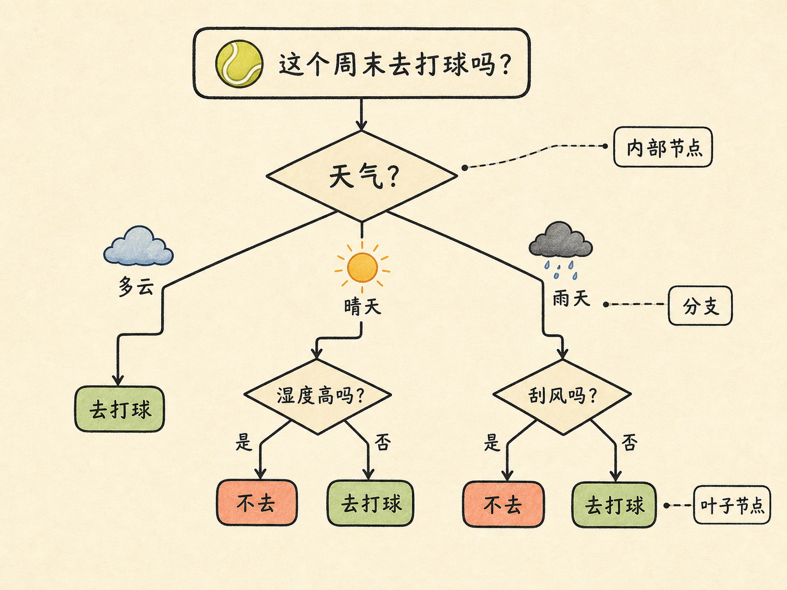
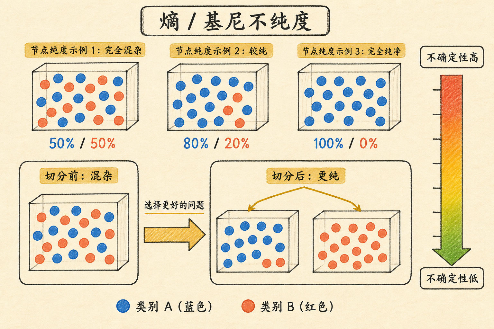
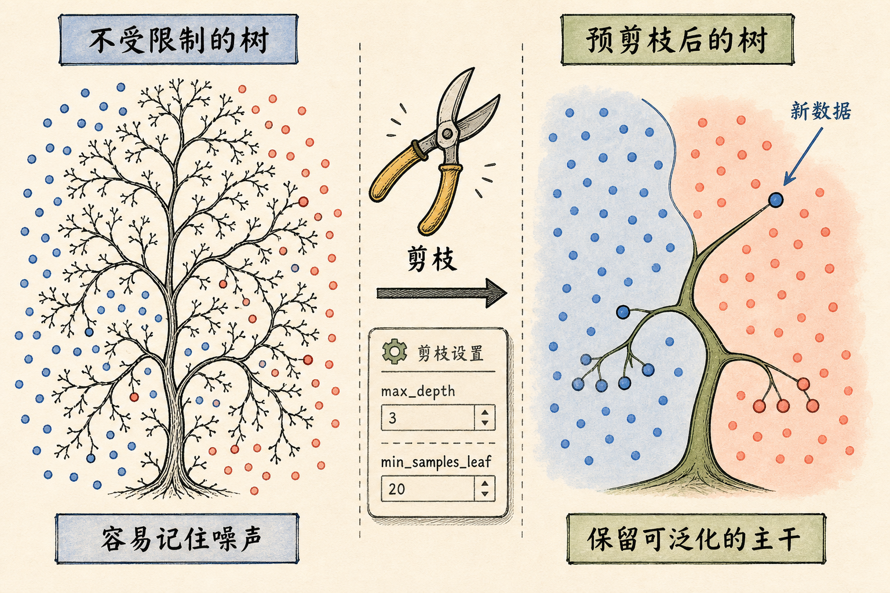

# 决策树：把 if...else 变成会学习的判断系统

假设你每个周末都想去打网球。天气是多云，直接去；晴天但湿度很高，不去；下雨时还要看风大不大。你会发现，自己并不是在背一张表，而是在不断提问：**先问哪个问题，才能最快做出可靠判断？**

决策树把这种日常思考方式变成了机器学习模型。它不只给出“去”或“不去”，还会把判断路径摊开：模型看了什么条件、走了哪条分支、为什么落到这个结果。正因如此，它特别适合需要解释证据链的场景。

读完这篇，你会知道

- 决策树为什么可以理解成一串会学习的 `if...else`
- 模型怎样从许多特征中选出第一个该问的问题
- 熵、信息增益和基尼不纯度分别在衡量什么
- 为什么一棵树很容易“记住训练数据”，以及如何给它修枝
- 随机森林和梯度提升树怎样从一棵树继续走向更强的模型

## 从“要不要去打球”开始：一棵树是什么

把过去十个周末记成一张表：天气、温度、湿度、是否刮风是特征；最终有没有去打球是标签。这是一个二分类问题，因为答案只有“去”和“不去”。

人观察这张表时，往往会先发现：多云时都去了。于是第一个问题可以是“天气是否多云？”如果不是，再继续问：晴天时湿度是否很高？雨天时是否刮风？这正是一棵决策树。

一棵树由三类部分组成：

- **内部节点**：一个需要回答的问题，例如“湿度是否高？”
- **分支**：问题的不同答案，例如“是”和“否”
- **叶子节点**：最终输出，例如“去打球”或“不去打球”

所以它本质上就是层层嵌套的条件判断。区别在于，普通程序里的 `if...else` 由人手写；决策树会从训练数据里学习该问哪些问题、阈值放在哪里，以及何时停止继续问。

决策树既能做分类，也能做回归。分类时叶子节点给出类别或类别概率；回归时叶子节点通常给出该区域训练样本目标值的均值。因此“是否放贷”和“房价大约是多少”都可以用树的形式建模，只是叶子节点表达的结果不同。

## 第一个问题为什么不是随便挑的

假设我们拿“温度”来分组，但每个温度组里仍然同时混着“去”和“不去”的样本。这个问题没有把局面理清，分完以后仍然很难判断。

相反，如果按照“天气”分组，多云这一组全是“去”。这说明这个问题把原本混杂的数据切出了一个更单纯的小组。决策树每一步追求的，正是让子节点里的样本尽量同类：去的尽量和去的放在一起，不去的尽量和不去的放在一起。

这里的“纯”不是指数据干净，而是指标签是否一致。一个节点里一半去、一半不去，面对新样本时的不确定性最大；若全都去，或全都不去，不确定性就降到最低。训练决策树的核心，就是每个节点都在候选特征和候选切分点中，寻找能让不确定性下降最多的那一个。

## 用熵把“混乱”量化

对分类问题，熵常用来描述一个节点的标签混乱程度。若节点中第 $k$ 类所占比例为 $p_k$，共有 $K$ 个类别，则熵为：$H=-\sum_{k=1}^{K}p_k\log_2 p_k$。

不必先陷进公式。二分类时，如果比例是 $50\%$ 对 $50\%$，你几乎无法从节点的已有信息猜出新样本属于哪类，熵最高；如果比例是 $100\%$ 对 $0\%$，答案已经确定，熵为 $0$。

用某个特征切分后，模型会计算切分前后的变化。信息增益就是：$IG=H(\text{切分前})-H(\text{切分后})$。它回答的问题很直白：问完这个问题后，我消除了多少不确定性？信息增益越大，这个问题越值得放在当前节点。

需要注意，信息增益偏好取值很多的特征。比如“客户编号”几乎能把每个人单独分开，训练集看似变得很纯，但这通常不是可泛化的规律。它只是把样本记住了。实际建模时要配合特征约束、最小样本数或其他分裂准则，避免这种表面上的高收益。

## 基尼不纯度：同一个目标的更轻量计算

工程中很常见的另一种指标是基尼不纯度：$G=1-\sum_{k=1}^{K}p_k^2$，也可写成 $G=\sum_{k=1}^{K}p_k(1-p_k)$。

它可以理解成：从这个节点随机抽样，类别发生混淆的可能性有多高。节点只有一种类别时，$G=0$；类别越均匀混合，$G$ 越大。二分类且两类各占一半时，$G=0.5$，这正是最不纯的状态。

基尼不纯度和熵都在寻找“切分后更纯”的节点，只是数学表达不同。基尼不纯度不需要对数运算，计算简单，因此很多实现默认使用它。例如 scikit-learn 的 `DecisionTreeClassifier` 默认准则就是 `gini`。选哪个不是为了追求某个公式更漂亮，而是为了在准确性、计算成本和项目约束之间取得合适平衡。

## 训练时，树是怎样一层层长出来的

训练过程可以看成递归地重复同一个动作：

1. 在当前节点枚举可用特征和候选阈值。
2. 计算每种切分后的不纯度，选出下降最多的方案。
3. 按这个规则把样本分成子节点。
4. 对每个子节点重复上述步骤，直到满足停止条件。

以经典的鸢尾花数据集为例，有 150 个样本、4 个花部特征和 3 个品种。训练集里，花瓣长度小于 $2.45$ 的一组可能全部是山鸢尾，节点很快就变纯；其余样本再按花瓣长度、花瓣宽度继续切分，逐渐区分变色鸢尾和维吉尼亚鸢尾。

画出树以后，每个节点通常会显示切分条件、不纯度、样本数量、各类别计数和当前预测类别。这个可视化不是装饰：它让你能检查模型是否依赖合理特征、错误集中在哪个区域，也让业务人员能复核一条具体决策路径。

## 树为什么容易过拟合

如果不限制生长，树会不断分裂，直到把训练集里少见的例外也单独分出来。训练准确率可能很高，但新数据稍微变化，原本为个别样本长出的分支就会失效。这就是过拟合：模型学到的不只是规律，还学到了噪声。

最常用的控制方式是**预剪枝**，也就是在生长前就规定边界，例如限制最大深度 `max_depth`、每个叶子节点的最小样本数 `min_samples_leaf`，或要求一次切分至少带来足够大的不纯度下降。它计算量小、可控性强，也是多数实际项目的首选。

另一种是**后剪枝**：先让树长得较完整，再自底向上删掉对验证效果帮助不大的分支。它有机会得到更合适的结构，但训练和评估成本更高。无论用哪种方法，目标都一样：保留能稳定解释新数据的主干，删去只为训练集个例服务的枝条。

## 一棵树不稳，就让很多树共同判断

单棵树的优点是直观，但对训练样本很敏感；数据稍有变化，顶部切分条件就可能改变。集成学习的思路是不要把最终判断交给一棵树。

**随机森林**并行训练许多彼此有差异的树：每棵树只看到随机抽取的一部分样本和特征，最后由它们投票或取平均。这样单棵树的偶然错误不会轻易支配结果，稳定性会提高。

**梯度提升树**则是串行纠错：先训练第一棵树作为基线，再让下一棵树重点学习前一轮留下的误差，逐轮叠加修正。XGBoost 和 LightGBM 都属于这一类思路的代表。它们通常能在表格数据任务中取得很强的效果，但也更需要谨慎调参和验证，避免把提升轮数变成新的过拟合来源。

## 最后把它记成一句话

决策树不是神秘的黑箱：它是在每一步选择一个最能减少不确定性的问题，再把样本分到更容易判断的区域。它的价值不只是预测结果，还在于你能沿着分支看见模型为什么这么判断。

当你需要一个可解释、能同时处理分类和回归、又便于检查的起点时，决策树很合适；当单棵树的稳定性不够时，再让随机森林或梯度提升树把许多有限的判断组合起来。
