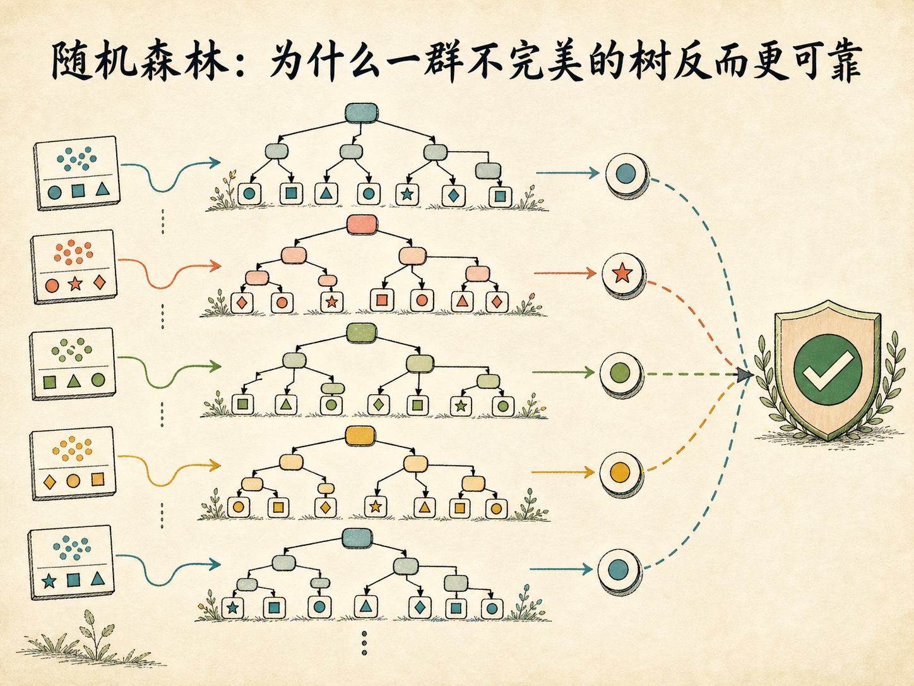
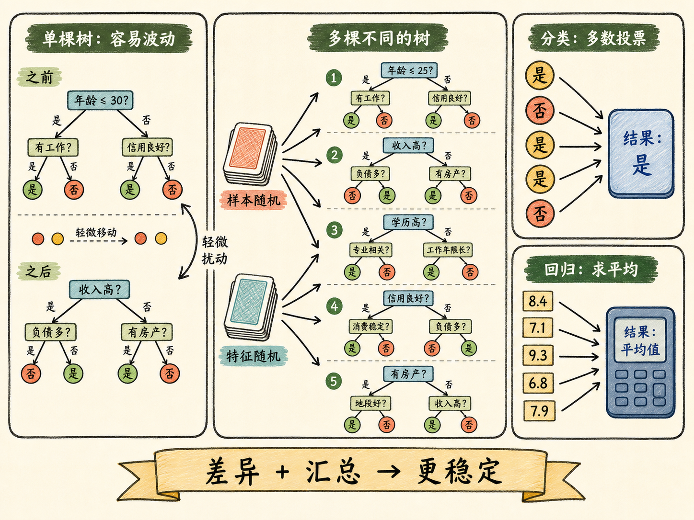
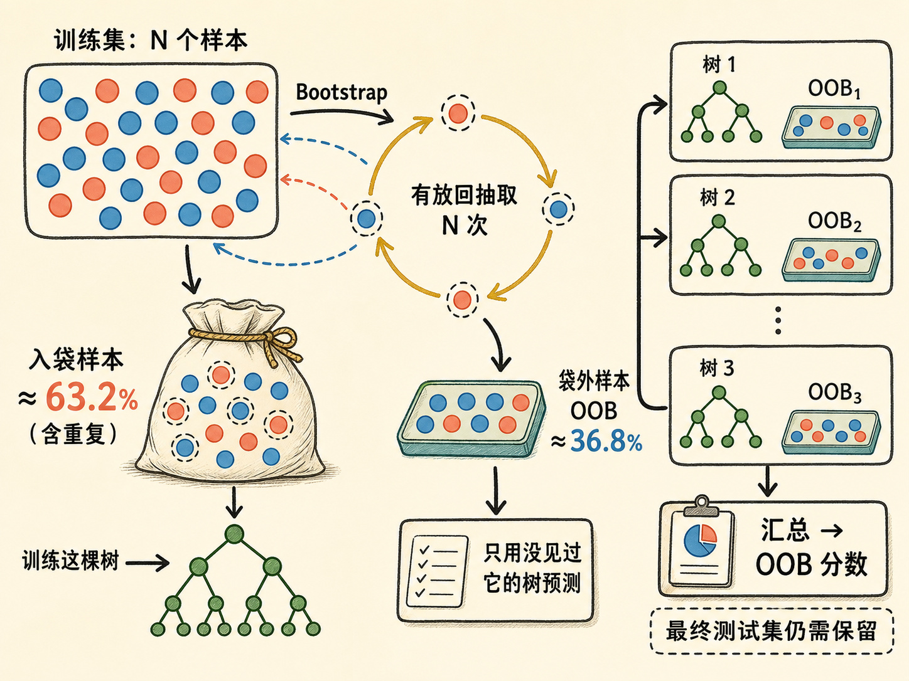
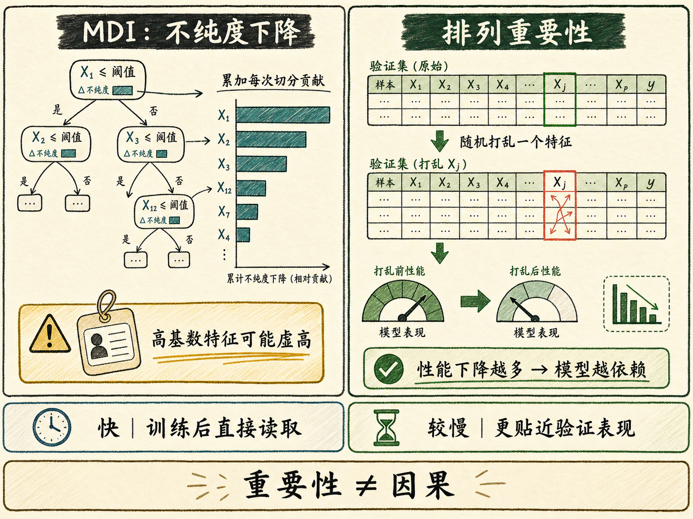

# 随机森林：为什么一群不完美的树反而更可靠

一棵决策树看起来很像一位思路清晰的专家：先问一个问题，再沿着答案继续追问，最后给出判断。问题是，这位专家太容易记住训练数据里的细节。样本稍微变一点，树顶端的问题就可能改变，后面的整套判断路径也随之重排。

随机森林的解决办法有些反直觉：它不追求先造出一棵完美的树，而是故意训练许多彼此不同的树，再让它们共同决定答案。单棵树仍然可能出错，但只要这些树的错误不完全一致，集体判断就会比任何一个成员更稳定。

读完这篇，你会知道

- 单棵决策树为什么清晰，却容易过拟合和不稳定
- 随机森林中的“随机”究竟发生在样本还是特征上
- 分类投票、回归求均值为什么能降低偶然误差
- 为什么大约 $36.8\%$ 的样本会成为袋外样本，以及 OOB 分数能做什么
- 两种特征重要性方法有什么区别，为什么“重要”不等于“因果”

## 决策树的问题不是不会判断，而是太容易记住

决策树通过一连串 `if...else` 式的问题不断切分特征，直到抵达叶子节点。它既能做分类，也能做回归；通常不需要为了距离计算而做归一化或标准化；从根节点到叶子节点的路径还能直接展示判断依据。

这些优点并没有消除一个根本问题：决策树属于高方差模型。它会不断寻找当前训练数据上最有利的切分，一旦生长限制不足，就可能把噪声、异常点和少数样本的偶然组合也写进树结构。训练集上的表现很好，新数据上的表现却可能明显下降，这就是过拟合。

更麻烦的是，树的生长具有连锁效应。根节点的切分一旦变化，后面的样本分组都会变化，整棵树可能长成另一种形状。因此，单棵树即使平均表现不差，也可能对数据扰动非常敏感。工程上真正缺少的不是一条清晰路径，而是面对新数据时的稳定性。

## 从一棵树到一片森林

随机森林属于集成学习：把许多基础模型组合起来，得到一个整体模型。这里的基础模型就是决策树。

训练时，每棵树独立学习自己的判断规则；预测时，森林再汇总所有树的结果：

- 分类任务：每棵树投一票，票数最多的类别成为最终结果。
- 回归任务：每棵树给出一个数值，森林对这些结果求平均。

可以把它理解成一次结构化会诊。只增加专家人数还不够，如果所有人看的是同一份材料、采用同一种思路，他们很可能犯相同的错误。集体判断真正有效的前提，是成员之间既有基本能力，又保持足够差异。

因此，随机森林的关键不只是“森林”，更是“随机”。算法用两层随机性主动制造树与树之间的差异：样本随机和特征随机。

## 第一层随机：每棵树看到不同的样本

假设训练集有 $N$ 个样本。训练一棵树时，算法会从这 $N$ 个样本中有放回地抽取 $N$ 次，这个过程叫 Bootstrap 采样。

“有放回”意味着每抽到一个样本，就把它放回样本池，再进行下一次抽取。结果是：

- 有些样本会被一棵树重复看到多次；
- 有些样本在这棵树的训练过程中一次也没有出现；
- 不同树拿到的训练集合会彼此不同。

这正是需要的效果。如果所有树都用完全相同的数据训练，它们很容易长出相似结构，投票只是在重复同一种判断。Bootstrap 采样让每棵树接触到略有差异的“世界”，从而形成不同的误差模式。

需要注意，重复抽样不是简单地丢掉数据。整片森林包含许多树，某个样本没有进入这棵树，仍可能进入其他树。随机森林利用的是树与树之间的差异，而不是永久舍弃一部分训练数据。

## 第二层随机：每次分裂只看部分特征

只有样本随机还不够。假设数据里有一个特别强的特征，例如收入与是否违约高度相关。如果每个节点都允许查看全部特征，许多树仍会优先选择收入，导致树结构高度相似。

随机森林在每个节点分裂时，只随机抽取一部分特征作为候选，再从这些候选里寻找最佳切分。若总共有 $D$ 个特征，分类任务中常见的起点是每次考虑约 $\sqrt{D}$ 个特征；这不是不可更改的定律，而是需要结合数据和实现调节的超参数。

特征随机会迫使部分树暂时看不到那个最强特征，只能尝试其他线索。单看某一棵树，这种限制可能让它不如“全知”的树；但从森林整体看，不同树会探索不同判断路径，彼此更不相似。

这里很关键：随机森林并不是通过让每棵树都更优秀来提升整体，而是通过降低成员之间的同质性，减少同一种偶然错误被整个集体重复放大的机会。

## 投票与平均为什么能让结果更稳

假设一片森林有 100 棵树。面对一个分类样本，有些树因为训练样本偏差投错票，有些树因为候选特征受限选择了次优路径。但只要这些错误没有高度同步，少数树的偏差就不容易改变多数票。

回归任务也是同一逻辑。某棵树的预测可能偏高，另一棵可能偏低；求平均后，个体的极端波动会被削弱。

因此，随机森林主要改善的是单棵树的不稳定性。树的数量从很少增加到足够多时，结果通常会逐渐稳定；继续加树仍会增加计算与内存开销，收益却可能越来越小。常见的 100、300 或 500 棵树只是起点，不是适用于所有数据集的固定答案。

## 没被抽中的 $36.8\%$ 样本有什么用

Bootstrap 采样还带来一个很实用的副产品：袋外样本，英文是 Out-of-Bag，简称 OOB。

对某个具体样本来说，一次抽取没有选中它的概率是 $1-1/N$。连续有放回抽取 $N$ 次后，它始终没有被选中的概率为 $(1-1/N)^N$。当 $N$ 足够大时，这个值趋近于 $e^{-1}$，约为 $36.8\%$。

所以，对每棵树来说，大约有三分之一的训练样本没有参与这棵树的训练。评估某个样本时，只汇总那些没有见过该样本的树的预测，就能得到它的 OOB 预测；再汇总所有样本，就得到 OOB 分数。

OOB 分数提供了一种训练过程内部的泛化能力估计。在数据较少时，它可以减少单独切出大块验证集造成的样本损失，也能帮助快速比较参数。

但 OOB 不能取消最终测试集。模型选择、参数尝试和反复分析都会逐渐利用验证信息，因此仍然需要一份独立、从未参与决策的测试数据，判断最终模型面对真正新数据时的表现。某次鸢尾花实验得到约 $94\%$ 的 OOB 准确率和 $100\%$ 的测试准确率，只能说明那次划分下结果较好；数据集很小，$100\%$ 不是模型在所有新样本上都不会出错的证明。

## 用 scikit-learn 建立一个起点模型

在 scikit-learn 中，随机森林分类器可以先从下面几个参数理解：

- `n_estimators=100`：森林包含 100 棵树。
- `max_features="sqrt"`：每个节点只考虑总特征数平方根数量的候选特征。
- `bootstrap=True`：开启有放回采样。
- `oob_score=True`：计算 OOB 分数。
- `n_jobs=-1`：允许多棵树并行训练，使用可用 CPU 核心。
- `random_state=42`：固定随机过程，便于复现实验。

建模时仍要保留独立测试集，并同时查看 OOB 表现和测试表现。若两者接近，说明内部估计与外部评估较一致；若差距很大，需要回头检查数据划分、类别不平衡、参数选择和随机波动，而不是只保留更好看的那个数字。

随机森林通常不依赖特征缩放，因此预处理比许多距离模型简单。但“简单”不等于“不检查数据”。缺失值能否直接输入取决于具体库、版本和参数；类别特征的编码、数据泄漏、异常标签和训练测试分布差异仍然需要处理。

## 特征重要性：模型依靠了什么

随机森林不仅能预测，还能帮助检查哪些特征影响了模型判断。常见方法有两类。

第一类是基于不纯度下降的重要性，常称 MDI。每次某个特征参与切分并降低基尼不纯度或熵，就累计它带来的下降量，再在整片森林中汇总。它计算很快，训练完成后通常可以直接读取。

MDI 的问题是容易偏爱可切分点很多的特征。连续变量、高基数类别和近似 ID 的字段可能获得虚高的重要性，因为它们拥有更多机会把训练样本切得更细。这个分数高，不一定意味着它对新数据真的有用。

第二类是排列重要性。先记录模型在验证数据上的表现，再随机打乱某一个特征的取值，破坏它与目标之间的关系。如果模型性能明显下降，说明模型确实依赖这个特征；下降越少，说明它提供的独立信息越有限。

排列重要性通常比 MDI 更贴近“拿走这个信息，模型会损失多少”，但计算更慢，而且在多个特征高度相关时可能低估其中任何一个特征：打乱一个，模型仍可借助它的替代特征完成判断。

还有一条必须守住的边界：特征重要性描述的是模型依赖关系，不是因果关系。一个字段很重要，可能因为它是原因，也可能只是结果、代理变量，甚至是数据泄漏。它适合帮助业务提出下一轮问题，不能单独证明“改变这个特征就会改变结果”。

## 随机森林适合作为基线，但不是默认终点

随机森林常被用作表格数据任务的基线模型，原因很直接：

- 比单棵树更不容易受训练样本扰动影响；
- 能同时处理分类和回归；
- 通常无需归一化或标准化；
- 可以并行训练多棵树；
- 能提供 OOB 估计和特征重要性；
- 在特征较多、非线性关系明显的任务上容易快速获得可用结果。

它也有明确代价：

- 单棵树的路径容易解释，几百棵树的集体判断却不再直观；
- 树越多，模型文件、内存占用和预测延迟通常越大；
- 数据噪声很强或参数控制不足时，森林仍可能过拟合；
- 特征重要性可能被误读，不能直接当成业务因果结论。

所以，随机森林适合回答的第一个问题通常是：“在不做复杂建模的情况下，这份表格数据大约能达到什么水平？”它给出一个稳定、易训练的起点，再决定是否需要更细的特征工程、梯度提升树或其他模型。

## 最后把它记成一句话

随机森林的核心不是简单地把树的数量变多，而是先用样本随机和特征随机制造足够不同的树，再通过分类投票或回归平均，削弱单棵树的偶然偏差。

一棵树追求一条清晰的判断路径；一片森林追求许多不同路径在新数据上形成更可靠的共识。
