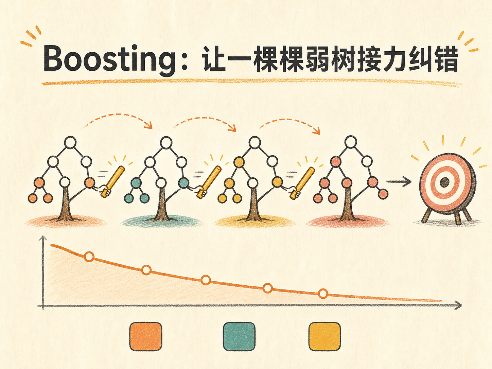
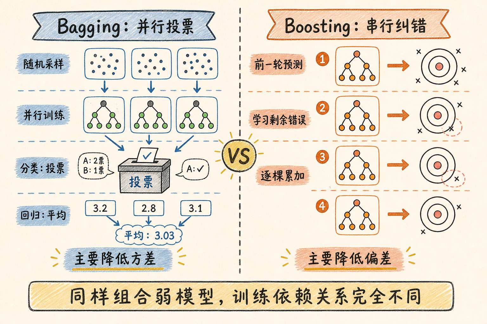
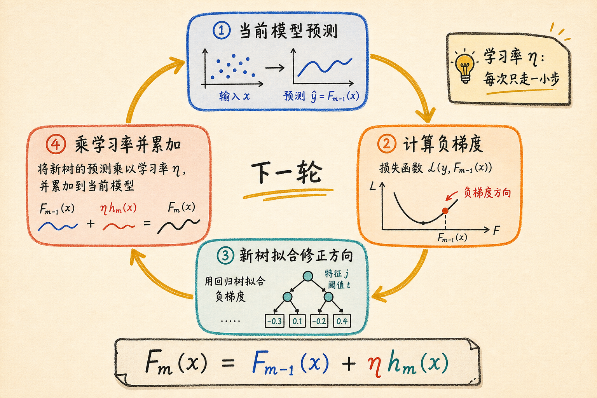
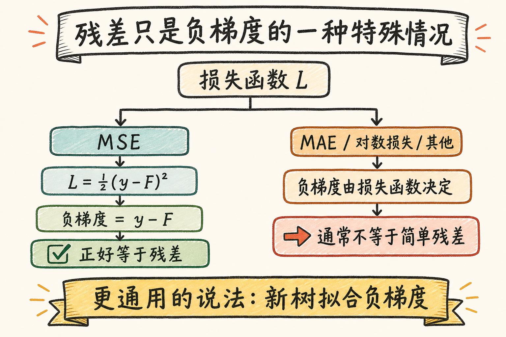
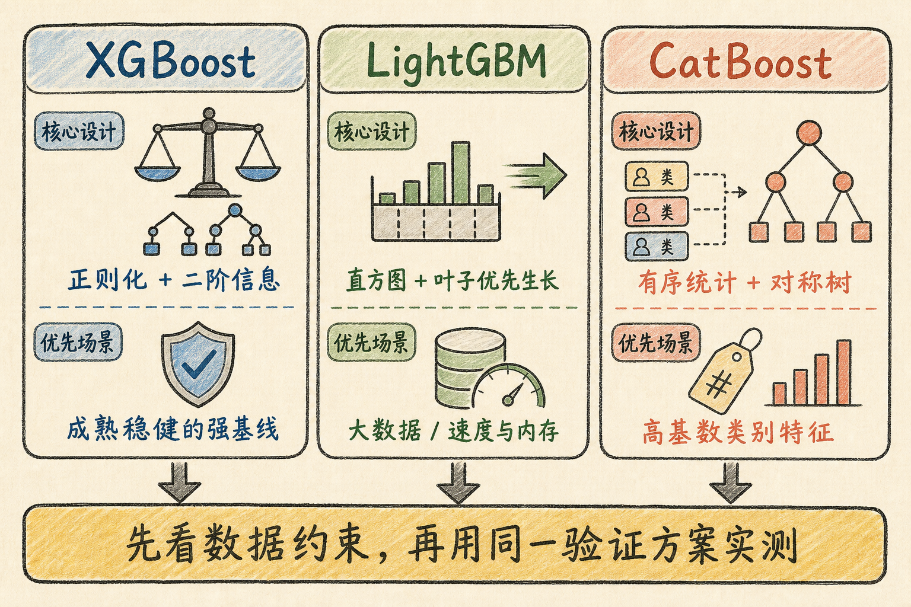

# Boosting：让一棵棵弱树接力纠错

假设高尔夫球洞在 350 米外。第一杆打了 300 米，第二杆不需要重打 350 米，只需要处理剩下的 50 米；如果第二杆打了 45 米，第三杆就继续处理最后 5 米。每一杆都不完美，但只要不断纠正前面的偏差，几杆加起来就能逼近目标。

Boosting 做的正是这件事。它不要求一棵决策树独自解决整个问题，而是让许多棵较弱的树依次出场：后一棵树专门学习当前模型还没有解决的部分。XGBoost、LightGBM 和 CatBoost，都是这条思路在不同工程约束下长出的实现。

读完这篇，你会知道

- Bagging 和 Boosting 都在“集成”，为什么训练方式却完全不同？
- 为什么它叫“梯度提升”，而不是更直观的“残差下降”？
- 一棵新树到底在学习什么，学习率又控制什么？
- XGBoost、LightGBM、CatBoost 分别解决了哪类瓶颈？
- 面对一份表格数据，应该先从哪个模型开始？

## 两种集成路线：并行投票，还是串行纠错

单棵决策树很容易理解，但也很容易受训练样本影响。换一批数据，树的结构可能就变了。集成学习的基本想法，是把多棵不够稳定或能力有限的树组合起来，让整体表现更可靠。

Bagging 和 Boosting 都在做组合，但它们解决问题的方式不同。

Bagging 的代表是随机森林。它通过有放回采样准备多份训练数据，再随机选择部分特征，让多棵树彼此独立地训练。预测时，分类任务投票，回归任务取平均。每棵树都在回答同一个问题，只是观察角度不同。多棵树的意见相互抵消，可以降低模型对单份数据的敏感程度，也就是降低方差。

Boosting 则是一条串行链路。第一棵树先给出粗略答案，第二棵树学习第一轮留下的错误，第三棵树再学习前两轮合起来仍未解决的部分。最终预测不是投票，而是把每一轮的贡献累加起来。它的主要目标，是持续修正模型“还没学会”的规律，从而降低偏差。

一句话区分：

- Bagging：多棵树并行观察，最后综合意见。
- Boosting：多棵树串行纠错，后者补前者的不足。

串行也意味着代价：后一棵树依赖前一轮结果，训练过程不能像随机森林那样完全并行。

## 为什么是“梯度”，不只是“残差”

“后一棵树拟合残差”是理解 Boosting 的好入口，但它只在特定损失函数下严格成立。

设第 $m-1$ 轮的模型为 $F_{m-1}(x)$，样本真实值为 $y_i$，损失函数为 $L(y_i,F(x_i))$。下一轮先为每个样本计算当前预测位置上的负梯度：

$r_{im}=-\left[\frac{\partial L(y_i,F(x_i))}{\partial F(x_i)}\right]_{F=F_{m-1}}$

这个 $r_{im}$ 表示：为了让损失下降，当前模型对样本 $i$ 最应该朝哪个方向修正。接着训练一棵新树 $h_m(x)$ 去拟合这些负梯度，再把它以较小步长加入现有模型：

$F_m(x)=F_{m-1}(x)+\eta h_m(x)$

其中，$\eta$ 是学习率。它控制每棵新树对总模型的影响。学习率过大，更新可能越过合适位置并产生震荡；学习率较小，通常更稳，但需要更多棵树。

为什么人们总把负梯度说成残差？看均方误差的特殊情况。若

$L=\frac{1}{2}(y-F(x))^2$

那么对预测值 $F(x)$ 求导后，负梯度正好是

$-\frac{\partial L}{\partial F(x)}=y-F(x)$

右侧就是“真实值减预测值”，也就是残差。但换成绝对误差、对数损失或其他目标函数，负梯度一般不再等于简单残差。因此，更通用的说法是：每一棵新树拟合当前损失函数的负梯度。

“提升”也不是让梯度越来越大，而是让多棵弱树叠加成更强的模型。更准确的直觉是：用梯度指路，用一棵新树走一小步。

## 一轮 Boosting 到底发生了什么

把公式翻译成操作，一轮训练只有四步：

1. 用当前模型对所有训练样本做预测。
2. 根据损失函数，计算每个样本的负梯度。
3. 训练一棵较浅的决策树，让它拟合这些负梯度。
4. 把新树乘以学习率，再加到当前模型上。

模型通常从一个很简单的常数预测开始。例如回归任务使用均值作为初始预测。第一棵树修正最明显的偏差，后续树继续处理剩余结构。若用带噪声的正弦曲线观察这个过程，会看到预测线从近乎水平逐渐贴近数据轮廓，而误差逐轮向零附近收缩。

这里有两个容易混淆的点。

第一，新树不是重新学习真实标签。它学习的是“当前模型应该怎样改”。所以 Boosting 中每棵树的训练目标都会变化。

第二，新树通常较浅。单棵树只承担一次局部修正，复杂能力来自许多棵树的累加。树太深、步长太大或轮数太多，都可能把噪声也当成规律继续修正，造成过拟合。

## 为什么 Boosting 擅长表格数据

树模型天然擅长处理非线性关系、特征间交互和不同尺度的数值。它不依赖“所有特征都处在相同量纲”这一假设，所以通常不需要像线性模型或距离模型那样先做标准化。对于分类和回归任务，也可以通过替换损失函数使用同一套提升框架。

这使 Boosting 长期成为结构化表格数据中的重要基线。它还能提供特征重要性等解释线索，训练后的预测通常也比大型神经网络轻量。

但基础梯度提升树有几个明显瓶颈：

- 树与树之间串行依赖，训练速度受限。
- 持续追逐错误可能把噪声一并拟合。
- 学习率、树深、树数量等超参数互相牵制。
- 高基数类别特征若先做 One-Hot 编码，会产生巨大而稀疏的特征空间。
- 如何寻找最佳分裂点，会直接决定训练时间和内存占用。

XGBoost、LightGBM 和 CatBoost 的差别，正是它们分别把优化重点放在这些瓶颈的不同位置。

## XGBoost：把精度、正则化和工程效率放在一起

XGBoost 可以理解为一套更完整的梯度提升树系统。与只利用一阶梯度的基础描述相比，它在目标函数近似中同时使用一阶与二阶信息。直觉上，一阶信息告诉模型“往哪边走”，二阶信息帮助判断当前位置的曲率，从而更精细地评估一次分裂能带来多少收益。

它还把树的复杂度惩罚直接放进优化目标，例如约束叶子数量和叶子权重，降低无限细分训练数据的冲动。再加上列采样、行采样、缺失值处理、并行化分裂计算等工程设计，XGBoost 在精度、速度和可控性之间取得了较均衡的结果。

Early stopping 是很实用的一项能力。可以把最大树数量设得较大，同时用验证集监控误差；如果连续若干轮没有改善，就停止增加新树，并保留表现最好的轮次。这样，“训练多少棵树”不再完全依赖拍脑袋，但前提是验证集和停止条件设置合理。

需要注意，某次实验中 XGBoost 比随机森林更准或更快，不代表所有数据都如此。数据规模、特征类型、参数预算和评价指标都会改变结果。正确做法是把它们放在同一数据划分和验证流程中比较。

## LightGBM：当数据规模成为主要矛盾

传统分裂搜索如果逐一检查大量特征值，计算开销会很高。LightGBM 的关键思路之一，是先把连续特征离散进有限数量的直方图桶。寻找分裂点时，只比较桶边界，不再遍历每个原始取值。候选点变少，内存访问也更规整，训练速度和内存效率因而改善。

它还常采用 leaf-wise，也就是叶子优先生长：每一轮优先分裂当前收益最大的叶子，而不是让同一层的所有叶子整齐地一起生长。这样可以更快降低训练损失，但也可能形成不平衡的深枝。因此，实际使用时要配合最大深度、叶子数量和最小叶子样本数等限制，避免小数据上过拟合。

当样本量或特征量很大、训练吞吐成为主要约束时，LightGBM 往往值得优先尝试。它的优势来自算法与数据结构的共同设计，而不只是名字里的“Light”。

## CatBoost：把类别特征当作一等公民

如果一个特征有上百甚至上千个类别，One-Hot 编码会把它展开成大量稀疏列。CatBoost 的核心定位，就是更自然地处理这类类别特征，减少繁琐的手工编码。

直接用全量标签统计量编码类别会引入泄漏：某个样本的标签参与了自身特征的构造，模型相当于提前看见一部分答案。CatBoost 通过有序统计与 ordered boosting 思路，只使用样本顺序中“前面”的信息构造当前样本的统计量和更新目标，以减轻这种预测偏移。

CatBoost 还使用对称树：同一层的所有节点采用相同分裂条件。它牺牲了一部分树形自由度，却让模型结构规整，推理路径更容易批量执行，因此常有较快、稳定的预测性能。

当数据包含大量类别特征，或者希望减少类别编码工作时，CatBoost 是非常自然的起点。这里的“Cat”来自 categorical，而不是因为模型和猫有关。

## 三个模型怎么选

不要把三者理解成简单的排名。更实用的选择方式，是先看数据和约束：

- 数据规模中等，希望获得成熟、稳健且容易调优的强基线：先试 XGBoost。
- 数据量很大，训练速度和内存压力突出：优先比较 LightGBM。
- 类别特征多、基数高，不想手工设计复杂编码：优先试 CatBoost。
- 任务重要且资源允许：三者使用相同交叉验证方案实测，再决定。

选型时至少同时记录验证指标、训练时间、推理时间、峰值内存和调参成本。只比较一个准确率数字，很容易忽略模型上线后的真实代价。

## 最后把三类树放回同一张地图

单棵决策树简单、直观，适合快速建立 baseline，但预测不够稳定。随机森林让多棵深树并行训练，再通过投票或平均降低方差。Boosting 让多棵浅树串行纠错，通过逐轮修正降低偏差。

所以真正需要记住的，不是三个库的参数表，而是一条共同机制：

**Boosting 用损失函数的负梯度指出修正方向，再让一棵新树完成这一小步；许多小步累加起来，就形成一个强模型。**

XGBoost、LightGBM 和 CatBoost 没有改变这条主线。它们分别围绕正则化与精确优化、大规模训练效率、类别特征与预测偏移，重新设计了“这一步怎样走得更稳、更快、更省事”。

