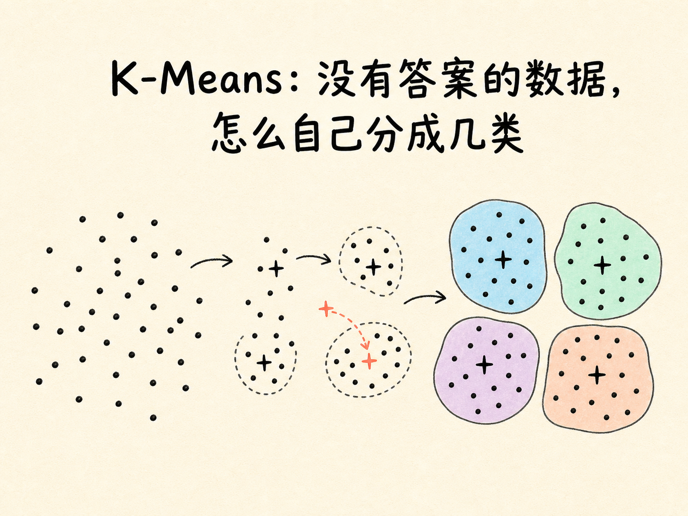
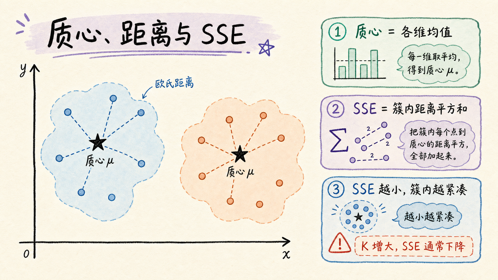
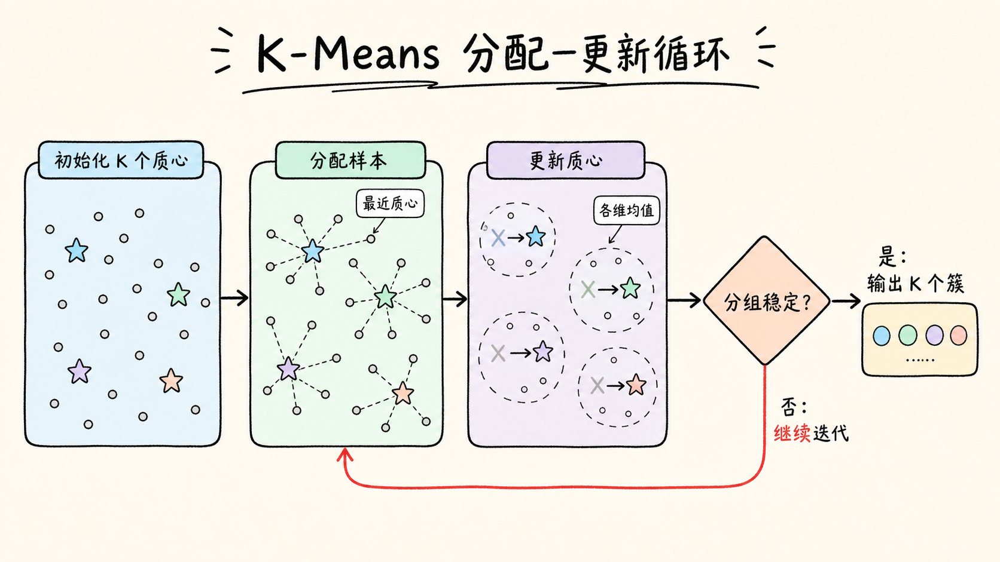
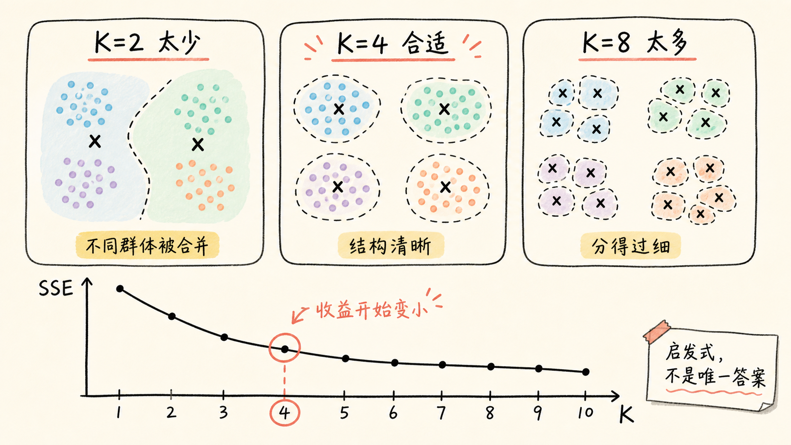
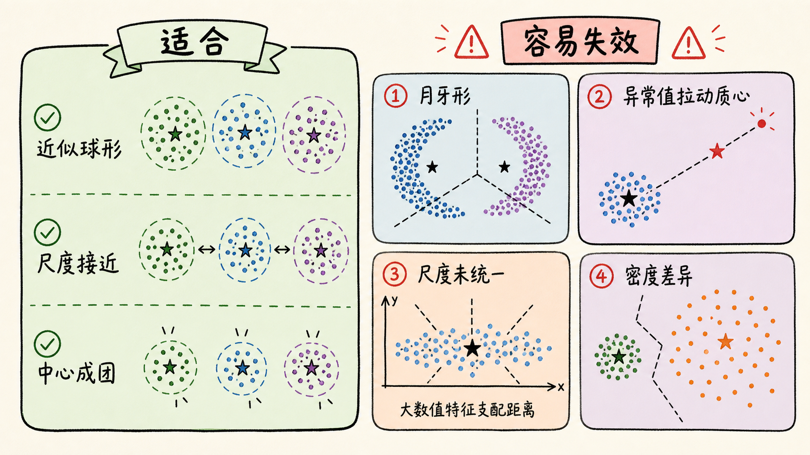

# K-Means：没有答案的数据，怎么自己分成几类

如果一张表里已经写着“高价值用户、普通用户、流失用户”，模型只需学习特征与答案之间的关系。但现实中的数据经常没有这列答案：我们只有购买频率、消费金额、访问时长，却不知道人群本来应该分成几类。

K-Means 做的事，是先假设“相似的数据应该聚在一起”，再让每个样本寻找离自己最近的中心。中心随着成员变化，成员又随着中心变化。这个看似循环的过程，最终会把一团没有标签的数据整理成 $K$ 个簇。

读完这篇，你会知道

- 没有标签时，K-Means 凭什么把数据分组
- 质心、欧氏距离和 SSE 分别在算法里做什么
- “分配样本—更新质心”为什么能逐步收敛
- K-Means++ 和肘部法则分别解决什么问题
- 哪些数据适合 K-Means，哪些形状和异常值会让它失效

## 聚类不是猜标签，而是寻找结构

回归和分类属于监督学习。训练数据带着答案，模型可以把预测值和真实值比较，再根据误差调整自己。聚类属于无监督学习：数据没有预先写好的类别，模型只能从样本之间的关系寻找结构。

K-Means 的目标不是发现一个天然存在、唯一正确的标签体系，而是按照选定的特征和距离，把数据划分成 $K$ 个簇，使同一簇内的样本尽量相似，不同簇的样本尽量分开。

这里有两个容易忽略的前提。第一，$K$ 需要提前指定；第二，“相似”必须由特征和距离定义。用消费金额和购买频率分出的客户群，与用商品偏好和访问时间分出的客户群，含义可能完全不同。聚类结果不是数据自己说出的真理，而是数据、特征、尺度和算法假设共同产生的结构。

K-Means 常被用来做客户分群、图像颜色量化、探索性数据分析和推荐系统冷启动。它也可以用距离辅助识别离群点，但它不是专门的异常检测算法；如果数据形状不符合它的假设，距离很远未必就等于业务异常。

## 三个部件：质心、距离和簇内平方和

理解 K-Means，只需要先抓住三个部件。

第一个是质心。设第 $i$ 个簇为 $C_i$，其中包含若干 $d$ 维样本。它的质心 $\mu_i$ 是这些样本在每个维度上的平均值：

写成公式就是 $\mu_i=\frac{1}{|C_i|}\sum_{x\in C_i}x$。

在二维平面里，就是分别对所有点的横坐标和纵坐标求平均。质心不一定恰好是某个真实样本，它更像这个簇的“平均位置”。

第二个是距离。经典 K-Means 通常使用欧氏距离。两个 $d$ 维样本 $x$ 和 $y$ 的距离为：

写成公式就是 $d(x,y)=\sqrt{\sum_{j=1}^{d}(x_j-y_j)^2}$。

第三个是簇内平方和，常写作 SSE，也叫 inertia。它把每个样本到所属质心的距离平方相加：

写成公式就是 $\mathrm{SSE}=\sum_{i=1}^{K}\sum_{x\in C_i}\lVert x-\mu_i\rVert^2$。

SSE 越小，说明样本围绕各自质心越紧凑。但它不能单独证明聚类“更正确”，因为增加 $K$ 几乎总会让 SSE 下降。当每个样本都独占一个簇时，SSE 甚至可以变成 0，却失去了分组的意义。

## 核心循环：先分配，再更新

K-Means 的训练过程可以写成一个反复执行的两步循环。

开始时，先选出 $K$ 个初始质心。随后进行：

1. 分配：计算每个样本到所有质心的距离，把样本交给最近的质心。
2. 更新：对每个簇里的样本求平均，得到新的质心。

新质心出现后，原来的簇边界可能改变，一些样本会换组；换组又会改变下一轮的质心。算法就这样在“谁属于哪个中心”和“中心应该在哪里”之间交替优化。

停止条件通常包括：质心变化已经很小、样本归属不再改变，或达到最大迭代次数。每轮分配和更新都不会让 SSE 增大，因此过程会停在一个局部最优解。需要注意，“收敛”只表示这次迭代稳定了，不表示找到了所有可能划分中唯一的全局最优解。

## 为什么随机起点会改变终点

如果初始质心碰巧挤在同一片区域，算法可能从一个不理想的起点出发，最后停在较差的局部最优解。换一组初始点，最终簇边界和 SSE 都可能改变。

K-Means++ 用更分散的方式挑选初始质心。第一个中心随机选择；之后，每个样本被选为新中心的概率，与它到“最近已有中心”的距离平方成正比。离已有中心越远，被选中的机会越大。它不是机械地每次拿最远点，而是进行带权抽样，从而兼顾分散性和随机性。

另一个实用做法是用不同初始状态运行多次，再保留 SSE 最小的结果。在 scikit-learn 中，`init` 控制初始化方式，`n_init` 控制独立运行次数。不同版本的默认值可能变化，正式实验最好显式写出这两个参数，并固定 `random_state` 方便复现。

## $K$ 该选多少：别只盯着最低 SSE

如果 $K$ 太小，原本不同的群体会被硬塞在一起；如果 $K$ 太大，一个有意义的群体又可能被切得过碎。选择 $K$ 本质上是在“簇内紧凑”和“模型简洁”之间权衡。

肘部法则是一种常见启发式方法：依次尝试多个 $K$，画出 $K$ 与 SSE 的关系。开始增加簇数时，SSE 往往下降很快；到某个位置后，继续增加 $K$ 的收益明显变小。曲线从陡降转为平缓的转折点，就像手臂弯曲处，因此被称为“肘部”。

它不是自动给出正确答案的定律。有些数据的曲线没有清晰转折，有些业务即使统计上可以分 6 类，运营上也只能维护 3 套策略。更可靠的做法是把肘部曲线、轮廓系数、重复运行的稳定性、可解释性和实际使用成本一起考虑。

## 一个图像例子：把上万种颜色压成 $K$ 种

一张 RGB 图片中的每个像素，都可以看成三维向量 $(R,G,B)$。把所有像素交给 K-Means，设 $K=16$，算法会在颜色空间里找到 16 个质心。随后，每个像素都用离它最近的质心颜色替代，整张图就只剩下 16 种代表色。

$K=4$ 时，色彩层次少，画面容易呈现明显的海报或卡通效果；$K=16$ 时，主要色块通常已经能被保留；$K=64$ 时，视觉上可能更接近原图，但压缩程度也随之减弱。

这里需要区分两件事：K-Means 完成的是颜色量化，减少了颜色种类；最终文件是否明显变小，还取决于图片格式、调色板编码和压缩方式。颜色更少为压缩创造了条件，却不保证把像素换色后文件体积一定按同样比例下降。

## K-Means 的隐含假设，决定了它会在哪里失败

K-Means 倾向于寻找围绕质心分布、近似球形、尺度相近的簇。因为它用到质心和欧氏距离，所以会遇到几类典型问题。

- 非球形结构：两个月牙形簇在几何上彼此环绕，按“离哪个中心近”切分，很容易把真实结构切错。
- 簇的大小或密度差异很大：大而稀疏的簇与小而紧密的簇可能被不合理地拆分或合并。
- 异常值：均值会被极端点拉动，质心随之偏移，附近样本的归属也可能改变。
- 特征尺度不同：一个取值范围为 0 到 100000 的金额特征，会压过取值范围为 0 到 10 的频率特征。使用距离前通常要根据业务含义做标准化或归一化。
- 高维数据：维度升高后，距离之间的差异可能变得不明显，噪声特征也会干扰分组。

大规模数据还会带来计算成本。标准 K-Means 每轮都要计算大量“样本—质心”距离；MiniBatch K-Means 每次只抽取一小批样本更新质心，可以明显加快训练，但得到的是速度与精度之间的近似折中。

## 怎样把一次聚类变成可信的分析

跑出彩色散点图，只是聚类分析的开始。要让结果能被使用，至少还要回答下面几个问题：

1. 特征为什么选这些？它们是否真的代表要研究的差异？
2. 特征尺度是否处理过？距离有没有被某个大数值特征支配？
3. 换一组初始值或抽一批新样本，分组是否基本稳定？
4. 每个簇的样本量、中心特征和业务含义是什么？
5. 分组之后能采取什么不同动作，行动效果如何验证？

例如，客户分群不能停在“红色一簇、蓝色一簇”。需要进一步描述每个簇的购买频率、客单价、最近一次购买时间，再判断它们是否对应新客、高价值客户或流失风险客户。类别名称是分析者对统计结构的解释，不是 K-Means 自动生成的事实。

## 最后把它记成一句话

K-Means 的核心，是让每个样本反复寻找最近的质心，再让质心回到成员的平均位置，直到分组稳定；它简单、快速、容易解释，但结果是否有意义，取决于 $K$、初始化、特征尺度以及数据是否符合“围绕中心成团”的假设。

没有标签时，K-Means 能帮你看见结构；但结构的名字、用途和可信度，仍然要由问题本身来决定。
