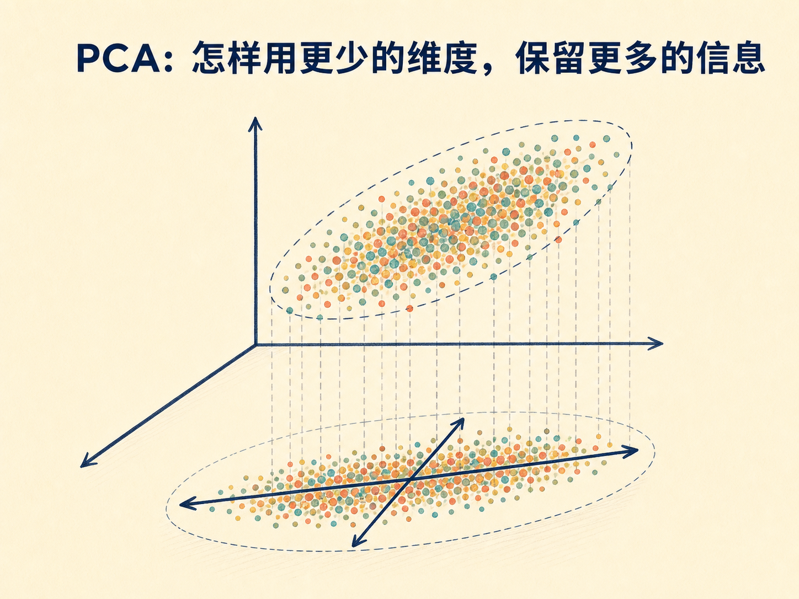
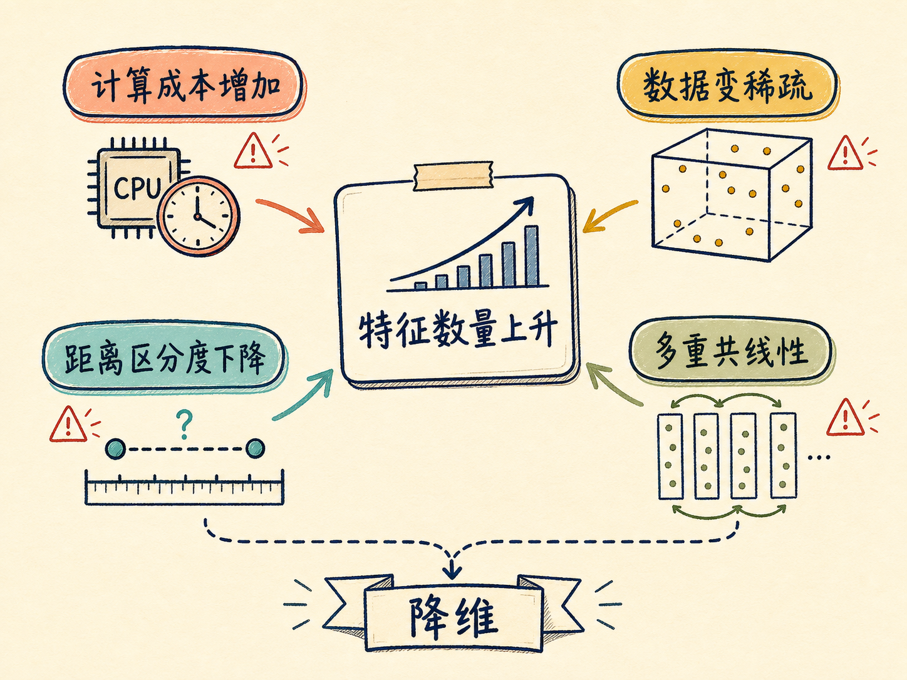
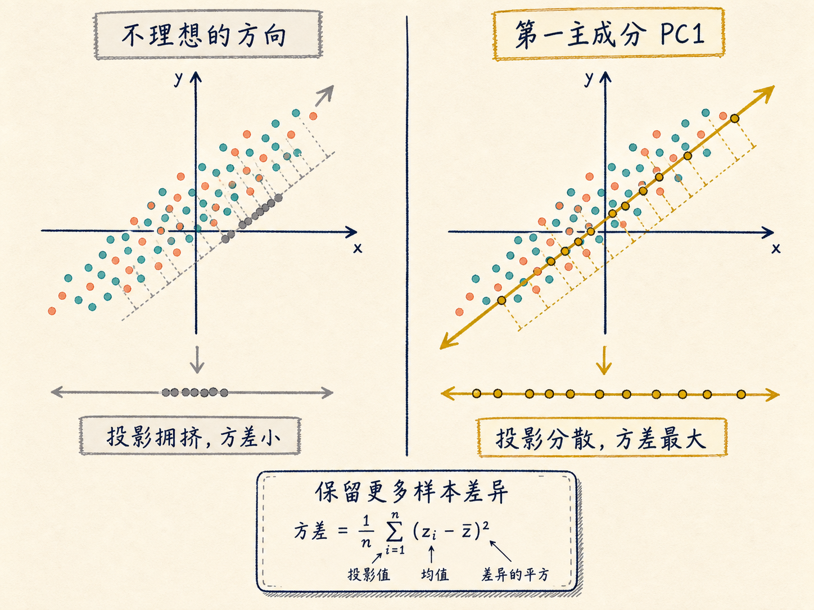
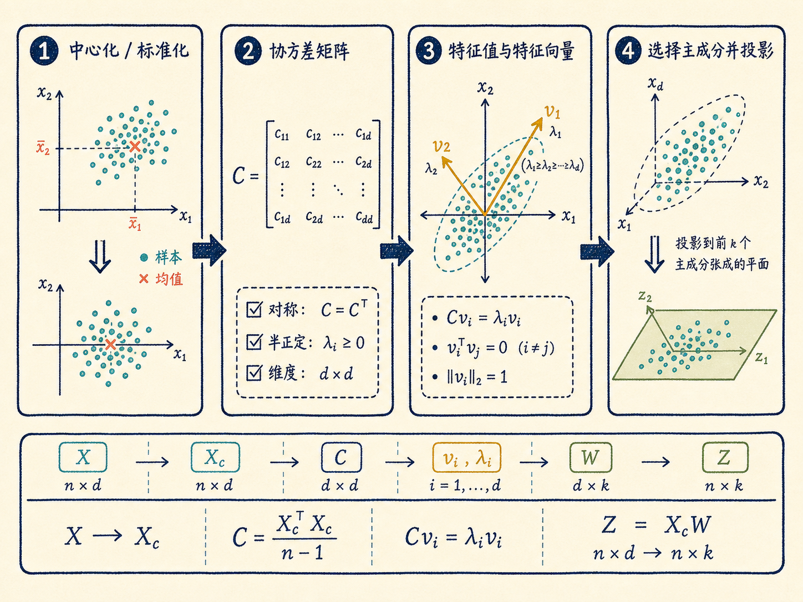
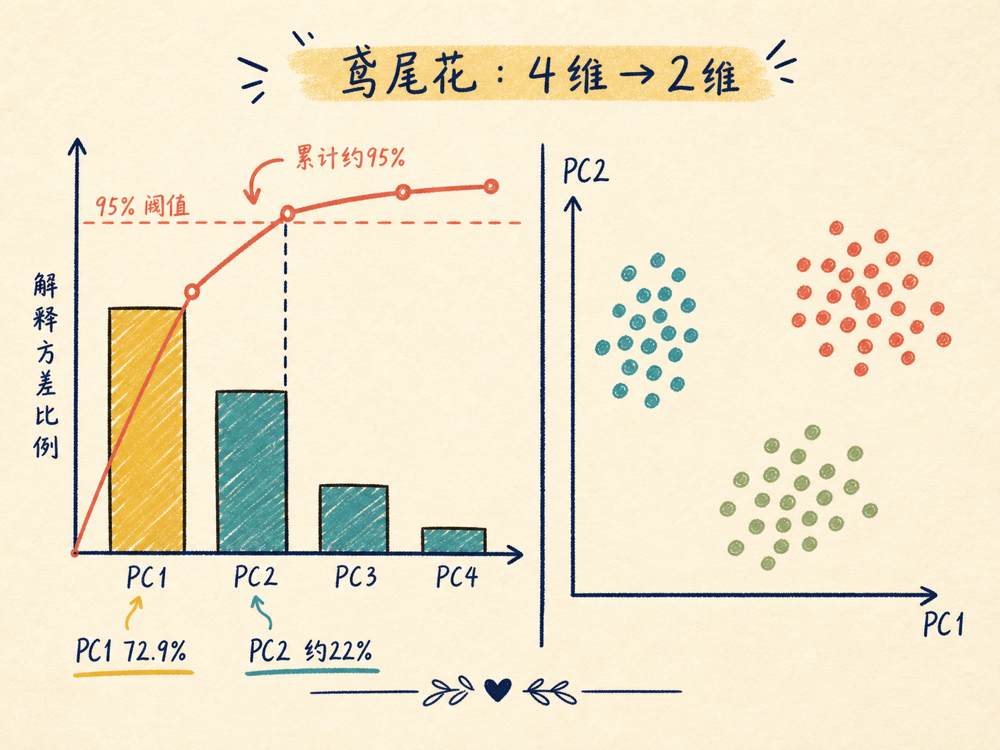
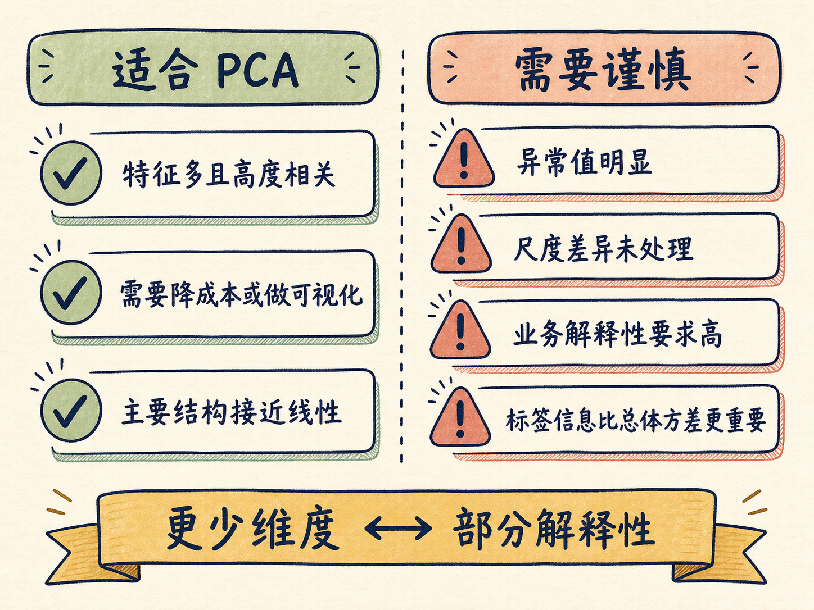

# PCA：怎样用更少的维度，保留更多的信息

假设一套房子有 1000 个特征：离地铁多远、附近有多少公交线路、学校评分、医院等级、公园面积……把这些特征全部交给模型，看起来信息越多越好，实际却可能让计算更慢、数据更稀疏、模型更容易记住噪声。

真正的问题不是“特征太多就删掉一些”，而是：能不能换一个观察角度，用少数几个新坐标，概括原来大部分变化？PCA，也就是主成分分析，做的正是这件事。

读完这篇，你会知道

- 高维数据为什么会带来“维度灾难”
- PCA 为什么把“方差最大”当作信息保留的目标
- 协方差矩阵、特征向量和特征值分别在做什么
- 怎样用解释方差率决定保留几个主成分
- PCA 什么时候有用，什么时候会损失解释性

## 特征越多，为什么不一定越好

维度可以先简单理解为特征的个数。二维数据有两个特征，1000 维数据就有 1000 个特征。当维度持续增加时，问题会从多个方向同时出现。

第一，计算成本上升。特征越多，模型需要处理的参数和运算通常越多，训练时间与存储成本都会增加。

第二，数据在高维空间里会变得稀疏。想让样本充分覆盖更多维度，所需数据量会快速增长。样本不够时，模型更容易把偶然噪声当成规律，增加过拟合风险。

第三，距离可能失去区分度。在高维空间中，点与点之间的距离会趋于接近。KNN、K-Means 这类依赖距离的算法，因此更难判断谁近、谁远。

第四，多个特征可能反复表达同一件事。房屋面积与房间数量往往正相关；地铁距离、公交线路和商场数量也可能共同反映“地段便利性”。这类多重共线性会增加冗余，并干扰部分模型的参数估计和解释。

降维就是为了缓解这些问题，但降维有两条不同的路。

- 特征选择：从原始特征中挑一部分，其他特征直接不用。方差阈值、相关系数筛选和 L1 正则化都可能用于这条路线。
- 特征提取：不直接丢掉某几个特征，而是把原始特征重新组合成更少的新特征。

PCA 属于第二种。它保留的不是原来的某几列，而是原始特征的线性组合。

## PCA 不是删列，而是在换坐标轴

想象桌上放着一个三维茶壶，现在只能给它拍一张二维照片。从正上方拍，茶壶可能只剩一个圆，壶嘴和把手都不明显；从侧前方拍，壶身、壶嘴和把手可以同时被看见。

物体没有变化，变化的是投影角度。一个好的角度能让二维照片保留更多三维结构。

PCA 也在寻找这样的角度。只不过它面对的不是茶壶，而是高维空间中的一团数据点。它寻找一组新的坐标轴，让数据投影到这些轴之后，尽可能保留原有差异。

为什么用方差衡量这种差异？如果某个方向上的所有投影值几乎相同，这个方向无法区分样本，包含的信息就少；如果投影值分得很开，这个方向能解释更多样本差异，信息就多。PCA 因此把“投影后的方差最大”作为第一主成分的目标。

以身高和体重为例。如果样本大致沿一条斜线分布，身高越高，体重通常也越大，那么这两个特征携带了部分重复信息。PCA 会找到数据延伸最明显的方向，把每个人投影到这条线上，用一个新坐标概括原来的两个坐标。

这个新坐标与 BMI 都有“把多个身体指标综合成一个数”的直觉，但二者并不等价。BMI 是基于医学定义的非线性比值 $\text{BMI}=\frac{w}{h^2}$；PCA 主成分则由当前数据的方差结构自动学习，是标准化方式与样本分布共同决定的线性组合。

## 第一主成分找到之后，为什么下一条轴要与它正交

如果第二条轴仍然和第一条轴方向接近，它看到的大多还是同一批变化，新增的信息很少。为了避免重复，PCA 要求各主成分彼此正交。

第一主成分 PC1 是方差最大的方向。第二主成分 PC2 必须与 PC1 正交，并在剩余方向中找到方差最大的那一个。后续主成分继续遵守同样的规则。

正交的直接结果是：不同主成分之间不相关。它们像一组重新摆放过的坐标轴，PC1 解释最多变化，PC2 解释次多变化，之后依次减少。

把房价数据中的地铁距离、公交线路、商场数量、学校评分、医院等级和公园面积放在一起，PC1 可能主要表达“综合地段便利性”，PC2 可能更偏向“商业便利与自然环境的差异”。这些含义不是人为事先指定的，而是根据各特征的权重事后解释出来的。

这也揭示了 PCA 的代价：新特征更紧凑，却不再拥有原始特征那样直接的业务含义。

## PCA 的数学过程，其实就是四步

设数据矩阵为 $X\in\mathbb{R}^{n\times d}$，其中 $n$ 是样本数，$d$ 是原始特征数。希望把它降到 $k$ 维，且 $k<d$。

### 第一步：中心化，必要时再标准化

对每个特征减去自己的均值，得到中心化矩阵 $X_c$。中心化后，每列的均值为 0，数据云被移到坐标原点附近。

如果不同特征的量纲或数量级差别明显，还应先做标准化。例如“距离”用米、“评分”用 5 分制时，数值尺度大的特征会主导方差。标准化可以让 PCA 比较的是相对变化，而不是单位大小。

### 第二步：计算协方差矩阵

样本协方差矩阵为 $C=\frac{1}{n-1}X_c^{\mathsf T}X_c$，它的尺寸是 $d\times d$。

矩阵对角线上的元素是每个特征自己的方差；非对角线元素是两个特征之间的协方差。协方差为正，说明两者倾向于同向变化；为负，说明一方增加时另一方倾向于减少；接近 0，说明没有明显的线性共同变化。

### 第三步：求特征值和特征向量

对协方差矩阵求解 $Cv_i=\lambda_i v_i$。

- 特征向量 $v_i$ 给出第 $i$ 个主成分的方向。
- 特征值 $\lambda_i$ 给出数据投影到这个方向后的方差。

把特征值从大到小排列，就得到了主成分的重要性顺序。这里的特征值表示解释的方差，不是预测误差。

### 第四步：选择主成分并完成投影

取前 $k$ 个特征向量组成投影矩阵 $W=[v_1,v_2,\ldots,v_k]$，降维结果就是 $Z=X_cW$。原来 $n\times d$ 的数据由此变成 $n\times k$。

PCA 并没有从原表格中挑出 $k$ 列。$Z$ 中的每一列，都是原始 $d$ 个特征按不同权重组合得到的新特征。

## 保留几个主成分，要看解释方差率

第 $i$ 个主成分的解释方差率为 $r_i=\frac{\lambda_i}{\sum_{j=1}^{d}\lambda_j}$。前 $k$ 个主成分的累计解释方差率为 $R_k=\sum_{i=1}^{k}r_i$。

实际使用时，可以从小到大增加 $k$，直到 $R_k$ 达到预先设定的阈值，例如 95%。阈值不是自然定律，而是信息保留与模型复杂度之间的选择：阈值越高，保留的信息越多，降维幅度通常越小。

以标准化后的鸢尾花数据为例，150 个样本原本有 4 个特征。第一主成分的特征值约为 2.93，可以解释约 72.9% 的方差；第二主成分的特征值约为 0.92，再解释约 22% 多。前两个主成分合计保留约 95% 的方差，因此可以把 4 维数据压到 2 维，用于可视化，同时仍能看出三个类别的大致分布。

注意，PCA 在计算这些方向时没有使用鸢尾花的类别标签。把类别颜色画在降维结果上，只是事后观察；PCA 本身仍然是无监督方法。

## PCA 与随机森林的特征筛选，不是同一种降维

随机森林可以依据特征重要度选择原始特征，PCA 则构造新的综合特征。两者的差异可以从三个方面看。

第一，是否需要标签。随机森林的特征重要度来自监督学习任务，需要目标标签；PCA 只看特征矩阵，不需要标签。

第二，能处理什么关系。随机森林能够捕捉非线性关系；标准 PCA 寻找的是线性投影，只能压缩线性相关结构。

第三，可解释性。随机森林筛选后留下的仍然是“地铁距离”“学校评分”这样的原始特征；PCA 得到的是若干线性组合，通常更难赋予明确业务名称。

有标签的数据中，可以先用业务知识或监督模型去掉明显无用的特征，再用 PCA 压缩剩余的线性冗余。但这不是固定配方，是否有效仍要用下游任务的验证结果判断。

## PCA 什么时候值得用，什么时候要谨慎

PCA 适合以下情况：特征很多且高度相关；需要降低计算成本；希望把高维数据压到二维或三维做探索；或者需要在尽量保留总体变化的前提下削弱部分噪声。

它也有清晰的局限。

- 线性限制：弯曲流形或其他非线性结构，未必能被线性投影保留下来。
- 解释性下降：主成分是多个原始特征的线性组合，业务含义可能不直观。
- 对尺度敏感：未标准化时，大量纲特征容易支配结果。
- 对异常值敏感：极端值会显著改变均值、协方差和最大方差方向。
- 目标无关：PCA 保留的是特征总体方差，不保证这些方差就是预测标签最有用的信息。

最后一点尤其需要注意。方差大代表样本变化明显，但不等于对任何具体任务都重要。一个低方差特征也可能对分类标签很关键，而 PCA 可能把它排在后面。

## 最后收束：PCA 保留的不是特征名，而是数据变化的主方向

PCA 的核心可以压缩成一句话：先把数据移到同一个中心，再寻找方差最大的彼此正交方向，最后把数据投影到其中最重要的几个方向上。

所以，PCA 不是从 1000 个特征里随手删掉 950 个，而是重新选择观察数据的坐标系。它用更少的维度保留更多的总体变化，代价是牺牲一部分业务解释性，以及对非线性结构和异常值的适应能力。
