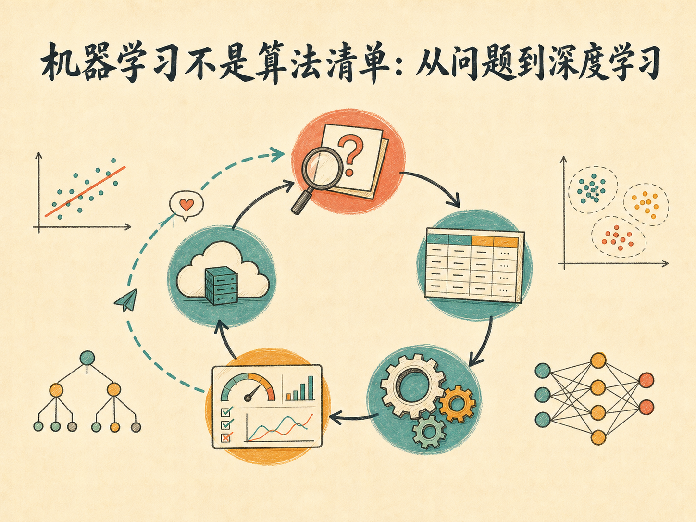
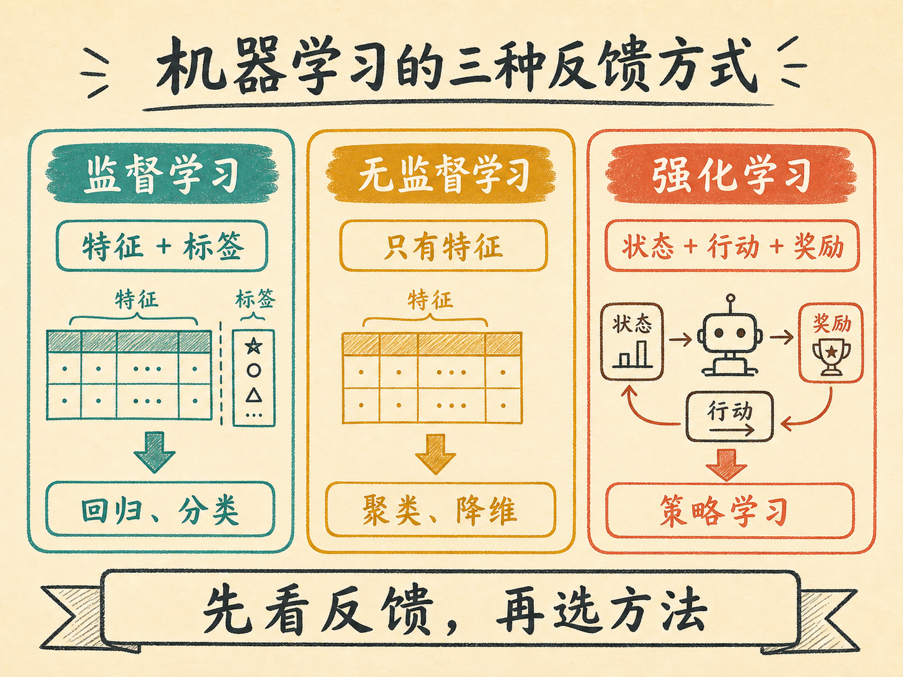
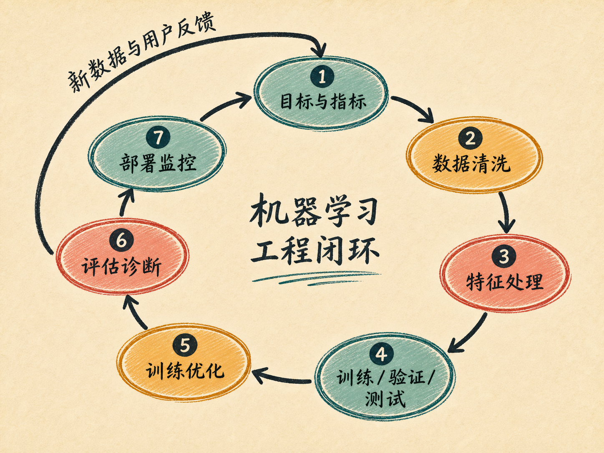
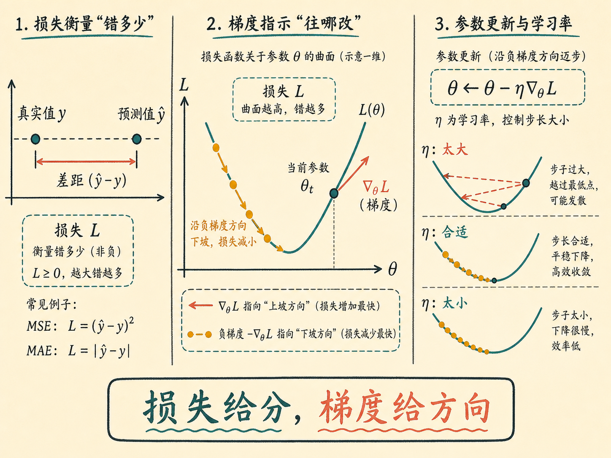
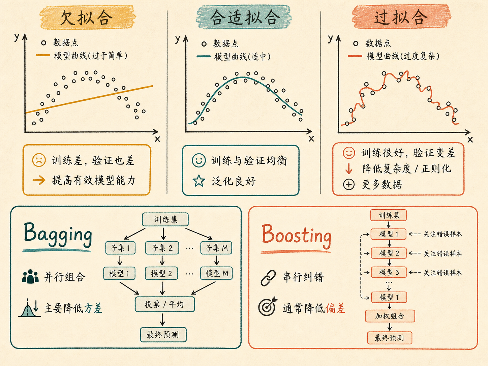
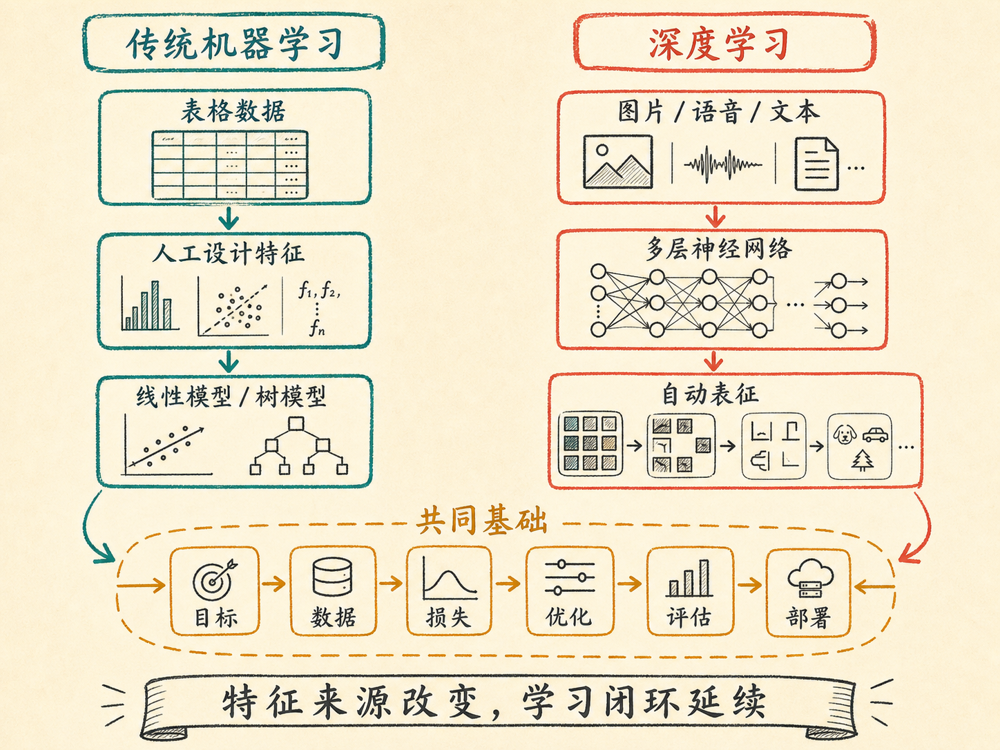

# 机器学习不是算法清单：从问题到深度学习

学完线性回归、决策树、随机森林、K-Means 和 PCA，很容易产生一种错觉：机器学习就是记住一串算法，然后为新问题挑一个名字最合适的模型。

真正到了项目里，最先让系统失败的往往不是算法选错，而是目标没定义清楚、标签有问题、训练数据泄漏到测试环节，或者上线后数据已经变了却没人监控。算法只是中间的一环。机器学习真正要掌握的，是一套用数据解决问题、验证结果并持续迭代的工程方法。

读完这篇，你会知道

- 监督学习、无监督学习和强化学习分别在学什么
- 为什么机器学习的第一步不是选算法，而是定义目标
- 数据怎样经过训练、验证、测试，最终变成可用模型
- 欠拟合、过拟合、Bagging 和 Boosting 分别在解决什么问题
- 传统机器学习为什么是通往深度学习的最好入口之一

## 先看全貌：三种学习范式，三种反馈方式

机器学习可以先按“模型从哪里得到反馈”分成三类。

监督学习拿到的是带答案的数据。每个样本既有输入特征，也有目标标签，模型要学习从输入 $x$ 到输出 $y$ 的映射 $f:x\mapsto y$。如果输出是房价、温度、销量这类连续数值，就是回归；如果输出是猫或狗、垃圾邮件或正常邮件这类有限类别，就是分类。

无监督学习没有标签。模型只能观察样本之间的关系，自己寻找结构。K-Means 通过距离把相似样本聚成若干簇；PCA 则寻找数据变化最大的方向，用更少的新特征概括原有信息。前者回答“哪些样本更像一组”，后者回答“哪些方向承载了更多变化”。

强化学习得到的不是标准答案，而是行动之后的奖励。智能体在环境中反复尝试，根据长期回报调整策略。这类方法常见于游戏、机器人控制，以及需要连续决策的推荐策略。

三类方法的差别不在于谁更高级，而在于可获得的反馈不同：有标签就学习映射，没有标签就发现结构，能与环境互动就学习策略。先弄清反馈形式，才知道问题属于哪一类。

## 机器学习究竟在学什么

传统编程由人写规则：规则加数据得到结果。机器学习则反过来，把历史数据和目标交给训练算法，让系统从样本中提炼出可用于新数据的规则。

这里需要区分算法和模型。算法是学习的方法，例如线性回归的参数估计、决策树的分裂规则；模型是算法在一批具体数据上训练后的结果，例如一组权重或一棵已经长好的树。同一种算法换一批数据，得到的模型也会不同。可以记成一句话：算法是过程，模型是产物。

因此，开始项目时不应先问“用随机森林还是 XGBoost”，而要先把业务问题翻译成可学习的关系：

- 一条样本代表什么？
- 哪些变量是模型可获得的特征？
- 希望预测的标签是什么？
- 预测提前多久做出才有价值？
- 成功由什么指标判断？

如果这些问题没有答案，再复杂的模型也只是在优化一个含糊目标。

## 从问题到上线，是一条闭环而不是一次训练

一个可用的机器学习系统通常经过七个环节。

第一，定义目标与指标。要明确预测对象、使用场景和错误代价。信用卡欺诈检测中，漏掉一次欺诈和错拦一次正常交易的代价不同，因此不能只看总体准确率。

第二，准备与清洗数据。需要处理缺失值、异常值、重复值和错误标签，并确认训练时可见的信息在真实预测时也确实可见。否则模型可能发生数据泄漏：离线分数很好，上线后却无法复现。

第三，构造和预处理特征。数值特征可能需要缩放，类别特征可能需要 One-Hot 编码，还可以利用业务知识构造组合特征。PCA 能压缩相关特征，但会牺牲一部分解释性，所以不是所有任务都应该使用。

第四，划分训练集、验证集和测试集。训练集用于拟合参数，验证集用于选择模型和调超参数，测试集只在最后评估泛化能力。数据较少时可使用 $K$ 折交叉验证，让不同样本轮流承担验证角色。

第五，训练与优化。模型通过损失函数衡量预测误差，再调整参数降低损失。线性模型和神经网络常用梯度方法；树模型依靠分裂准则逐步建立结构。

第六，评估与诊断。不能只看训练分数，还要观察验证集和测试集表现，判断是否欠拟合、过拟合、类别不平衡，或指标与业务目标不一致。

第七，上线、监控与再训练。用户行为、市场环境和数据分布都会变化。模型上线不是终点，而是开始接收新反馈、发现漂移并重新训练的下一轮起点。

机器学习的最小闭环因此是：定义问题 → 准备数据 → 训练模型 → 独立评估 → 部署监控 → 用新反馈迭代。

## 损失函数告诉模型“错了多少”，梯度告诉它“往哪改”

模型训练的核心，是把“做得不好”转换成一个可以优化的数值。

以回归为例，均方误差可以写成 $\mathrm{MSE}=\frac{1}{n}\sum_{i=1}^{n}(y_i-\hat y_i)^2$。真实值是 $y_i$，预测值是 $\hat y_i$。误差经过平方后，大误差会获得更高权重，因此模型会更重视那些偏差很大的样本。它的代价是对异常值也更敏感；平方损失本身并不保证任何模型都收敛得更快。

梯度是损失函数对模型参数的偏导数组成的向量。需要注意，求导对象是模型参数，不是输入特征。梯度指向损失上升最快的方向，所以参数更新通常沿相反方向进行：$\theta\leftarrow\theta-\eta\nabla_\theta L$。其中 $\theta$ 是参数，$L$ 是损失函数，$\eta$ 是学习率。

学习率太大，更新可能越过最低点甚至发散；太小，训练会非常慢。训练过程就是反复计算误差、估计方向、迈出一小步，直到验证表现不再改善或满足停止条件。

模型训练时使用的损失函数，和最终汇报的业务指标不一定相同。回归任务常看 MAE、MSE、RMSE 和 $R^2$；分类任务常看准确率、精确率、召回率、F1、ROC-AUC 和混淆矩阵。指标必须根据错误代价选择，而不是哪个数字最高就用哪个。

## 欠拟合与过拟合：模型能力和泛化之间的平衡

欠拟合意味着模型连训练数据中的主要规律都没有学到。它在训练集和测试集上都表现较差，常见原因是模型过于简单、特征表达不足、训练不充分，或正则化过强。解决方向可能包括增加有效特征、提高模型容量、训练更久，或适当减弱正则化。

过拟合则相反：模型在训练集上表现很好，到了未见数据上明显变差。它不仅学到了稳定规律，也把训练样本中的噪声和偶然细节记住了。常见处理包括降低模型复杂度、剪枝、正则化、早停、增加有代表性的数据，以及用交叉验证更可靠地选择超参数。

两种问题不能用同一个动作机械处理。例如增加模型复杂度可能缓解欠拟合，却会加重过拟合。诊断必须同时看训练误差与验证误差，而不是只看一个分数。

这也是集成学习出现的原因：让多个模型共同决策，以不同方式改善偏差与方差。

- Bagging 并行训练多个模型，再对分类结果投票或对回归结果求均值。随机森林是典型代表，它通过样本和特征的随机性降低模型之间的相关性，主要用于降低方差、缓解单棵决策树的不稳定。
- Boosting 串行训练模型，后一个学习器重点修正前面尚未处理好的误差。梯度提升决策树及其工程实现 XGBoost、LightGBM、CatBoost 都属于这条路线，通常侧重降低偏差并提高预测精度。

结构化表格数据上，这些树模型至今仍然很有竞争力。XGBoost 强调正则化和成熟的工程优化；LightGBM 面向大规模数据和训练效率；CatBoost 对类别特征提供了更直接的处理机制。选择哪一个，仍应由数据规模、特征类型、延迟要求和验证结果决定。

## 工具能加速流程，但不能替代理解

真实项目不需要每一步都从零手写。探索性数据分析工具可以快速生成缺失值、分布、相关性和异常值报告；scikit-learn 的 Pipeline 可以把预处理与模型封装在同一流程中，减少训练与验证之间的数据泄漏；AutoGluon 等 AutoML 工具可以快速训练多个候选模型，提供一个有竞争力的基线；实验跟踪工具可以记录参数、指标和模型版本；Cleanlab 可以利用模型置信信息发现疑似错误标签，供删除、修正或人工复核。

这些工具真正的价值是缩短反馈周期，而不是取消判断。没有基础理论，就无法判断自动报告暴露的是数据问题还是正常分布，也无法知道基线模型为什么好、标签修正是否合理、自动调参是否优化了错误指标。

最实用的顺序是：先建立简单且可复现的基线，再逐项改善数据、特征和模型。任何新方案都要和基线比较，证明它确实改善了目标指标，而不是只增加复杂度。

## 从传统机器学习到深度学习，什么变了

传统机器学习更擅长结构化表格数据。人通常需要先把业务对象整理成一行行样本和一列列特征，再交给线性模型、树模型或其他算法训练。它的优势是训练成本较低、可解释性较强，并且在中小规模结构化数据上常常足够有效。

图片、语音和文本则很难完全依靠人工特征描述。一张图包含边缘、纹理、形状和对象关系，一段语言包含上下文和层级语义。深度学习使用多层神经网络，让浅层到深层逐步学习更抽象的表示，把大量特征设计工作交给模型完成。

变化最大的是特征从哪里来：传统方法主要依赖人工设计，深度学习更强调自动表征。没有变化的是基本闭环。深度学习仍然需要目标、数据、训练集与验证集、损失函数、梯度优化、泛化评估、部署监控和持续迭代。

它还带来新的代价：通常需要更多数据、更大算力、更长训练时间，也更难解释。互联网积累了大规模数据，GPU 提供了并行计算能力，新的网络结构和训练方法提高了可扩展性，这些条件共同推动了深度学习、Transformer 和大模型的发展。

因此，学习深度学习之前先掌握机器学习，并不是绕远路。它让你提前理解模型为什么要划分数据、为什么要优化损失、怎样识别过拟合、为什么离线分数不等于线上价值。进入神经网络之后，主要新增的是表征方式和模型规模，工程逻辑仍然相通。

## 最后收束：把算法放回完整系统里

机器学习可以用一句话概括：把一个真实问题转成可学习的目标，用数据训练出能泛化的模型，再通过部署后的反馈持续修正它。

监督学习、无监督学习、梯度下降、随机森林、PCA 和深度学习，都只是这条链上的不同工具。真正可迁移的能力不是背下算法名单，而是知道每一步要解决什么问题、怎样验证它确实有效，以及失败时应该回到数据、目标、模型还是运行环境中排查。
