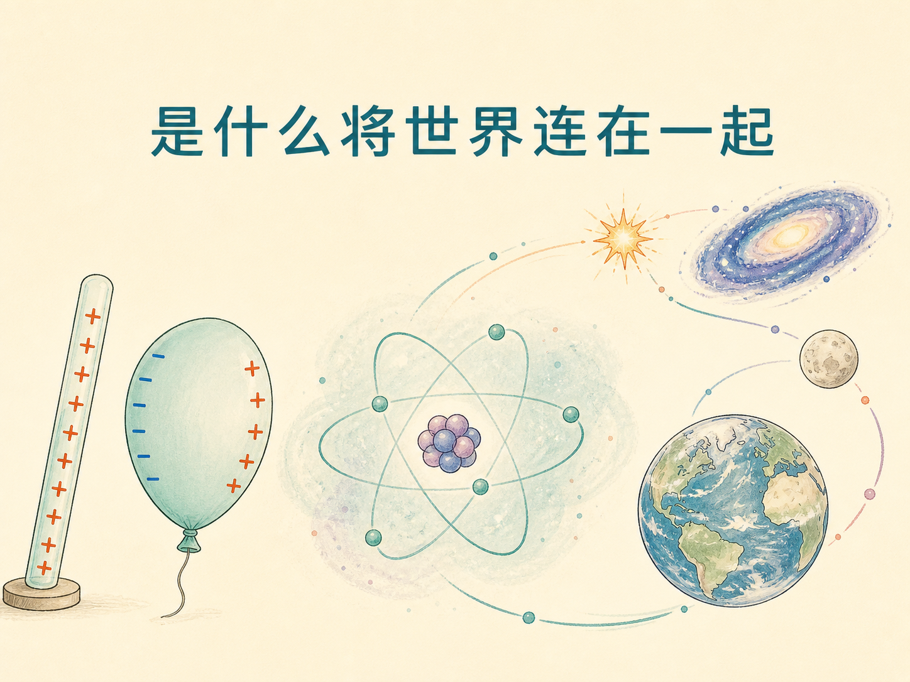
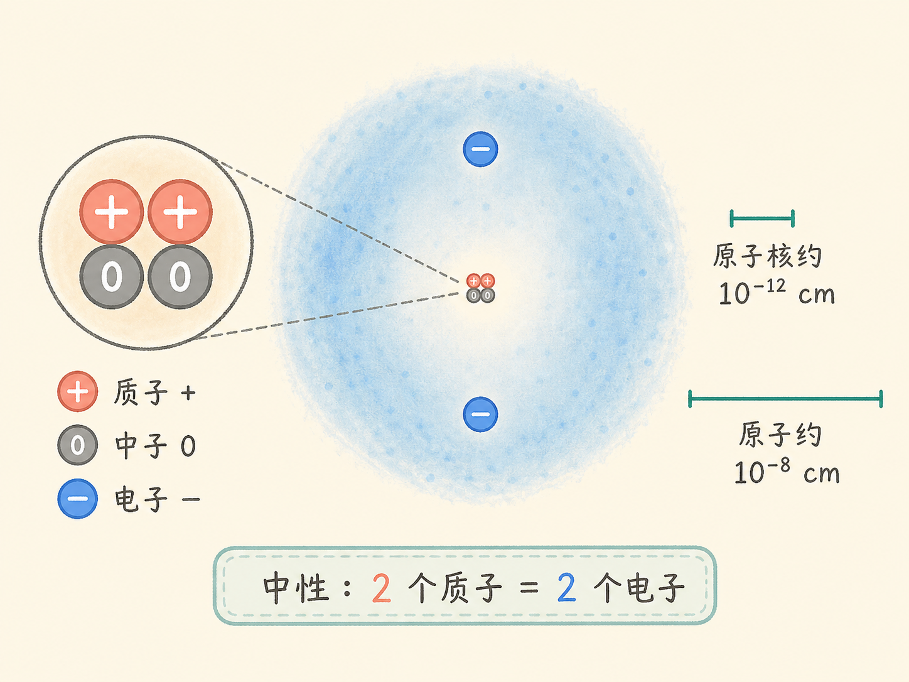
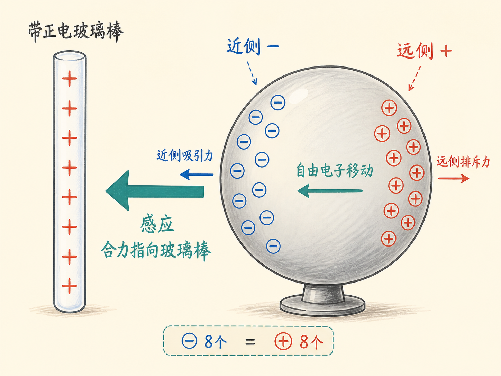
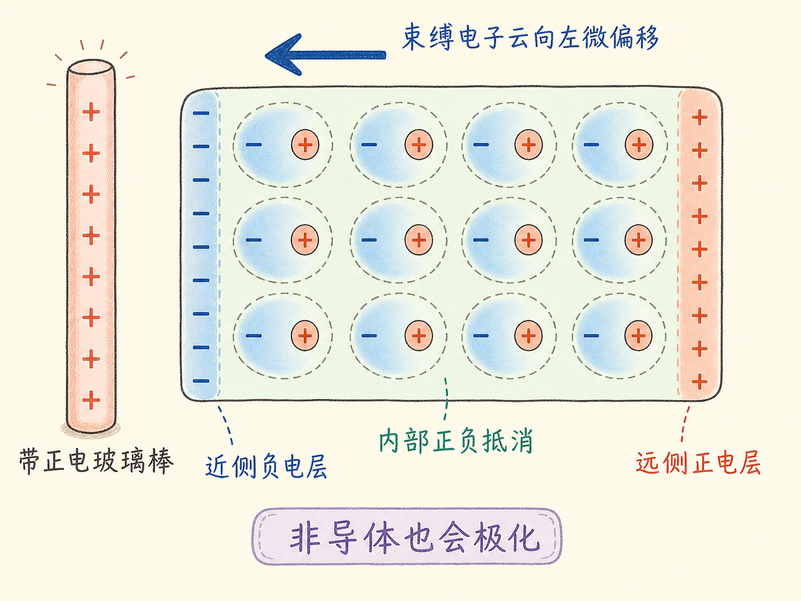
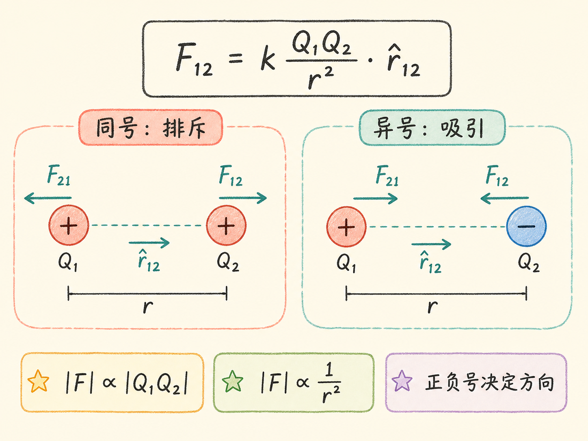
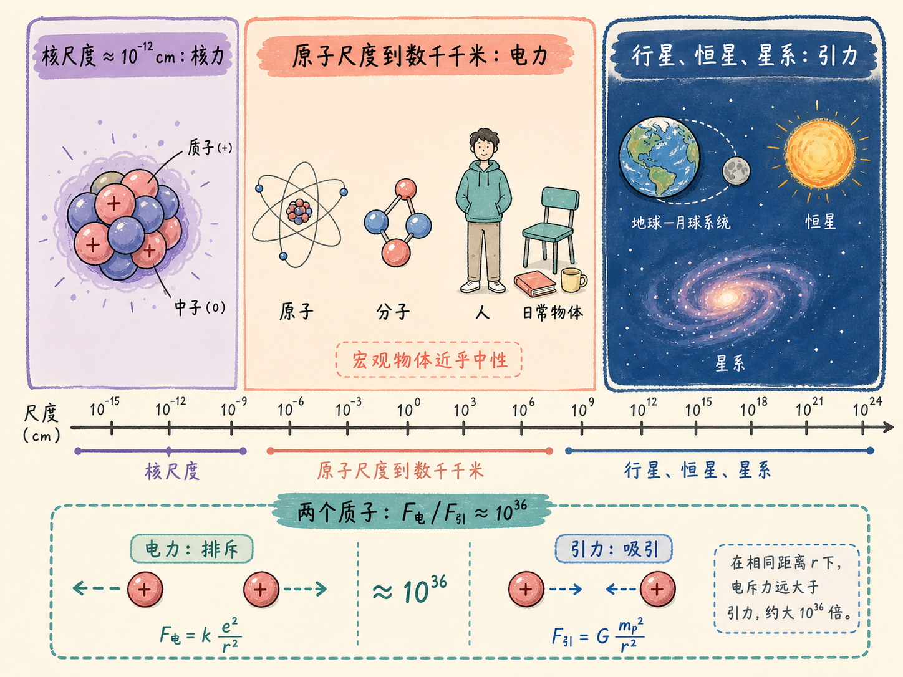
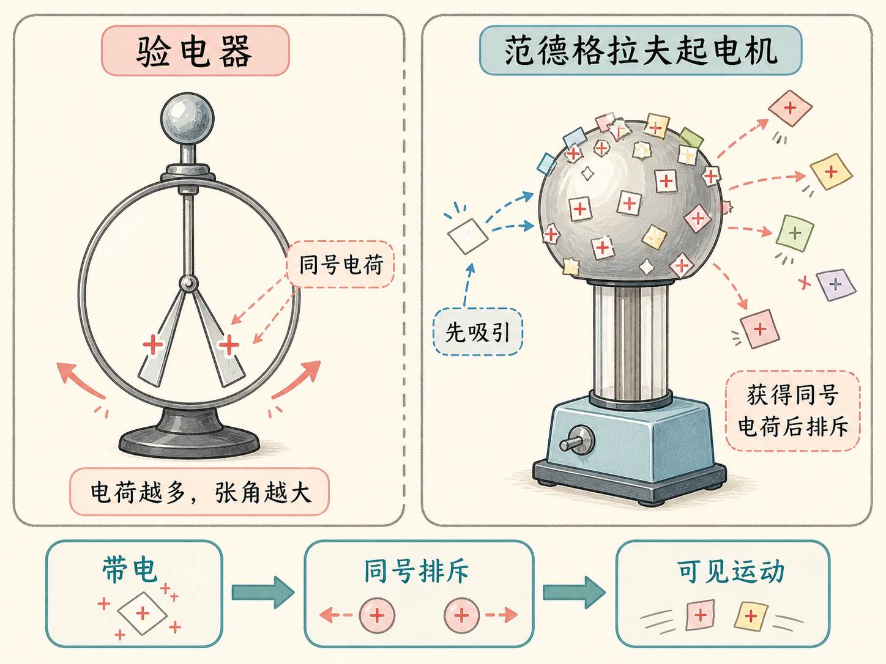

# 是什么将世界连在一起

一根用丝绸摩擦过的玻璃棒带正电。把它靠近一只没有带电的气球，气球却会主动靠过来。奇怪之处在于：气球整体明明是中性的，为什么还会受到电力？如果气球换成非导体，电子不能在整个物体中自由移动，这种吸引还会不会发生？

从一只气球出发，我们会遇到一个尺度大得多的问题：原子为什么能组成物质，质子为什么没有把原子核撑散，地球和月球又为什么没有被电力支配？答案不是某一种力包办一切，而是不同尺度上，不同的相互作用接过了“连接世界”的任务。

读完这篇，你会知道

- 电荷的正负约定和电荷守恒怎样连在一起
- 中性导体为什么会被带电玻璃棒吸引
- 没有自由电子的非导体为什么也会发生极化
- 库仑定律如何同时表达力的大小、方向和正负号
- 电力比引力强得多，为什么宇宙的大尺度结构仍由引力支配

## 电不只在电器里

电灯、电钟、麦克风、收音机、电视和计算机显然离不开电。但电磁现象的范围远不止插座和电路：光与无线电波都是电磁现象；彩虹的颜色和蓝色天空也与电有关；肌肉收缩、神经活动、心脏跳动、视觉以及化学反应，都离不开电。

要理解这种广泛影响，先把视线缩到原子。一个原子由很小的原子核和周围的电子云构成。原子核里有带正电的质子和不带电的中子，电子带负电。中性原子的电子数与质子数相等；拿走一个电子，原子成为正离子；增加一个电子，它成为负离子。

电子和质子的电荷量大小相同、符号相反，但质量相差悬殊：电子质量大约只有质子质量的 $1/1830$。因此，原子的质量几乎全部集中在原子核，而原子的空间尺度主要由外面的电子云决定。课堂给出的尺度是：原子核约为 $10^{-12}$ 厘米，原子约大一万倍，达到 $10^{-8}$ 厘米。即使把 60 亿个原子紧挨着排成一列，总长度也只有约 60 厘米。

## 正与负，先是一套约定

早在公元前 600 年，人们就知道摩擦琥珀可以吸引干树叶碎片。后来人们发现，摩擦玻璃得到的一类电与摩擦橡胶或琥珀得到的另一类电不相同：同类相斥，异类相吸。

本杰明·富兰克林当时并不知道质子和电子。他用一种“电流体”或“电火”的模型解释现象：某物体得到过量电火，就说它带正电；缺少电火，就说它带负电。他把摩擦后的玻璃定义为正。这个符号选择有一半机会反过来，但约定一旦沿用下来，后人就必须按它表达。

这个模型虽然不是今天的原子图像，却抓住了电荷守恒的核心：电荷从一个物体转移到另一个物体时，一方出现正电荷，另一方同时出现负电荷。你不能只产生一份“正”而不留下相应的“负”。用丝绸摩擦玻璃棒后，如果玻璃带正电，丝绸就带负电。

## 中性导体为什么会被吸引

现在把带正电的玻璃棒靠近一个中性导体。导体中有一小部分电子没有束缚在某个特定原子上，可以在导体中移动。正电玻璃棒出现后，这些电子被吸向靠近玻璃棒的一侧；远侧则相对缺少电子。物体的总电荷没有改变，但电荷分布改变了：近侧偏负，远侧偏正，这个过程叫感应，也可以看成电荷分离产生的极化。

重新分布的电子比例可能小到约每 $10^{13}$ 个电子中只有一个，但已经足以产生可见运动。原因在距离：近侧负电荷离玻璃棒更近，异号电荷间的吸引较强；远侧正电荷离玻璃棒更远，同号电荷间的排斥较弱。两种力没有抵消，中性导体受到的合力指向玻璃棒。

课堂上的金属气球把这条因果链直接展示出来。玻璃棒靠近时，气球先因感应被吸引。随后反复摩擦，让气球也带上正电，两者就转为相互排斥。再把用猫皮摩擦后带负电的橡胶靠近正电气球，气球又被吸引。三个现象放在一起，区分了“中性物体因感应而吸引”和“带电物体之间同号相斥、异号相吸”。

## 非导体没有自由电子，也能极化

非导体中的电子不能穿过整个物体自由移动，似乎不该发生感应。但把尺度缩到单个原子，情况就清楚了。带正电玻璃棒靠近时，电子云会稍微偏向玻璃棒，正电的原子核则相对留在远侧。电子仍束缚在自己的原子中，只是出现位置的分布发生了微小偏移，于是每个原子都被极化。

许多原子一起发生这种偏移时，物体内部相邻的正负电荷彼此抵消，靠近玻璃棒的表面却留下偏负的一层，远端表面留下偏正的一层。结果与导体相似：近侧吸引强于远侧排斥，非导体气球也会向玻璃棒靠近。

非导体演示还有一个重要提醒：实验对象可能在此前的摩擦或触摸中已经带电，而且这些电荷不容易流走。课堂上的非导体气球就出现了这种情况。它对橡胶棒表现出排斥，说明气球已经带负电。演示的意外表现没有否定极化，反而暴露了实验的条件：判断感应前，必须考虑物体原先是否带电，以及电荷能否通过导电路径离开。

空气湿度也会影响演示。干燥的冬天里，摩擦起电更容易保持；潮湿时效果较差。梳头时的噼啪声、碰门把手时跳过的火花、从卷筒上撕下后纠缠不休的保鲜膜，都是摩擦带电在日常生活中的表现。

## 从“会吸引”走向定量关系

设两个点电荷为 $Q_1$ 和 $Q_2$，相距 $r$，从电荷 1 指向电荷 2 的单位矢量为 $\hat{\mathbf r}_{12}$。电荷 1 作用在电荷 2 上的力可写为 $\mathbf F_{12}=k\dfrac{Q_1Q_2}{r^2}\hat{\mathbf r}_{12}$。

这个式子包含三层信息。第一，力的大小与 $|Q_1Q_2|$ 成正比，电荷越多，作用越强。第二，力与 $r^2$ 成反比，距离越近，作用越强。第三，$Q_1Q_2$ 的正负决定方向：同号相乘为正，力沿 $\hat{\mathbf r}_{12}$，表现为排斥；异号相乘为负，方向反转，表现为吸引。另一电荷受到大小相等、方向相反的力。

SI 单位制用库仑表示电荷量。一个质子的电荷量大小约为 $1.6\times10^{-19}\ \mathrm C$，所以 $1\ \mathrm C$ 大约相当于 $6\times10^{18}$ 个质子的电荷量。库仑常数约为 $k=9\times10^9\ \mathrm{N\,m^2/C^2}$，也常写成 $k=1/(4\pi\varepsilon_0)$，其中 $\varepsilon_0$ 称为真空介电常数。

如果有第三个电荷 $Q_3$，$Q_2$ 所受合力就是其他电荷分别作用在它上面的力的矢量和。这就是叠加原理。它并非从“看起来应该如此”得到，而是因为它与实验一致。叠加原理让多个电荷的问题可以拆成一对一的相互作用，再把这些力按方向相加。

## 电力强得惊人，为什么宇宙仍由引力支配

库仑定律与万有引力定律有相似的结构：一种与电荷量乘积成正比，另一种与质量乘积成正比，两者都与距离平方成反比。把两个质子放在相距 $d$ 的位置，电排斥力大小为 $F_E=ke^2/d^2$，引力吸引大小为 $F_G=Gm_p^2/d^2$。两者相除时，$d^2$ 消掉，结果约为 $F_E/F_G\approx10^{36}$。

这意味着两个质子之间的电排斥比引力吸引高约 36 个数量级。如果只考虑这两种力，把质子放进尺度约 $10^{-12}$ 厘米的原子核，电力产生的加速度会比地球表面重力加速度高 26 个数量级。质子仍能被束缚在原子核内，说明核尺度还有非常重要的核力；这门电磁学课程不继续展开它。

既然电力如此强，为什么行星、恒星和星系不是由电力控制？关键不在距离，因为比较两个质子时距离已经消掉；关键在净电荷。大多数宏观物体是中性的，或非常接近中性，正负电荷的作用大量抵消。课堂用地球和月球举例：即使人为假设它们分别带 $+10\ \mathrm C$ 和 $-10\ \mathrm C$，相应电力仍小到可以忽略；地月引力会比它高约 25 个数量级。

于是，“是什么将世界连在一起”有一个分尺度的回答。约 $10^{-12}$ 厘米的核尺度上，核力维系原子核；从原子尺度到数千千米的范围，电力支配我们周围的物质与生命过程；到了行星、恒星和星系的尺度，宏观物体几乎中性，引力成为主导。

## 看不见的电荷，怎样让它显形

验电器把电荷变成肉眼可见的角度。它可以由一根导电杆和两片很轻的金属箔组成。带电物体触碰导电杆后，两片金属箔获得同号电荷并相互排斥。电荷越多，张开的角度越大，因此张角能提供一定程度的定量信息。

范德格拉夫起电机则像一根“超级琥珀棒”，可以达到几十万伏。把纸屑放在带电球顶，纸屑先被吸向球顶；获得同号电荷后，又彼此排斥并向外飞散。手握金属彩条的人站上绝缘台并通过起电机带电时，每根彩条也会因同号相斥而散开，整个人就像一台活的验电器。

气球、纸屑、金属箔和金属彩条看起来是四种不同的演示，背后却是同一条逻辑：电荷可以转移，也可以在物体内部重新分布；同号相斥、异号相吸；距离改变各部分作用的强弱；最后，合力把看不见的电荷变成可见的运动。

这也是电磁学第一讲想建立的视角。不要只记住“摩擦会带电”或一条平方反比公式，而要能从原子中的电荷分布，一路解释气球为什么靠近玻璃棒，再判断为什么我们身边的物质主要由电力维系，而星系的尺度却交给了引力。
