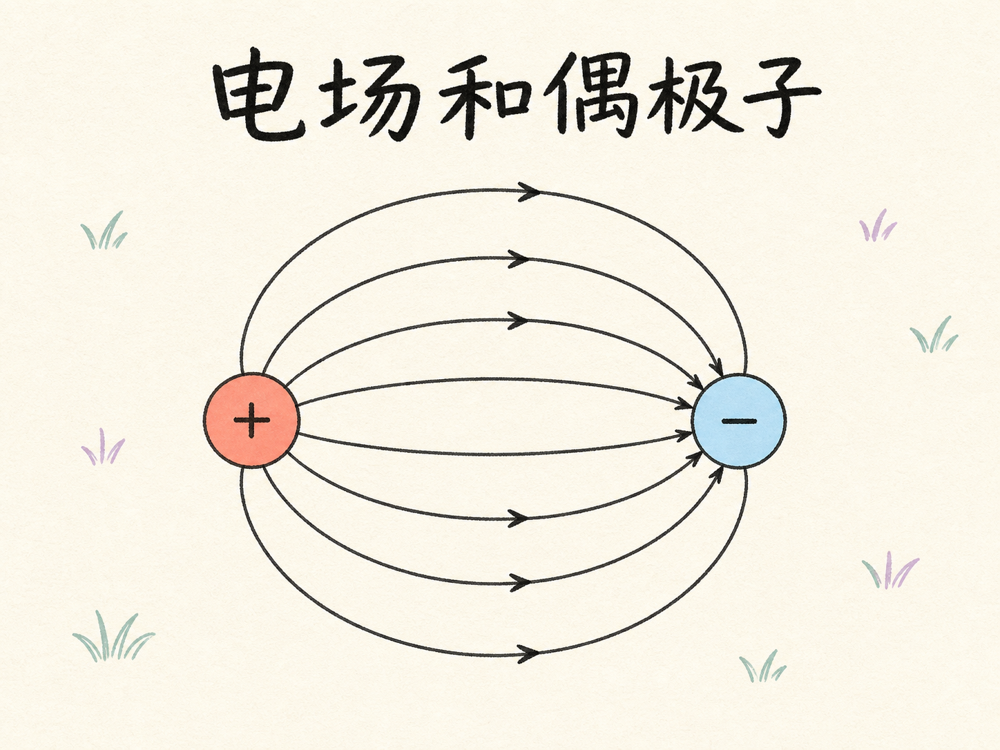
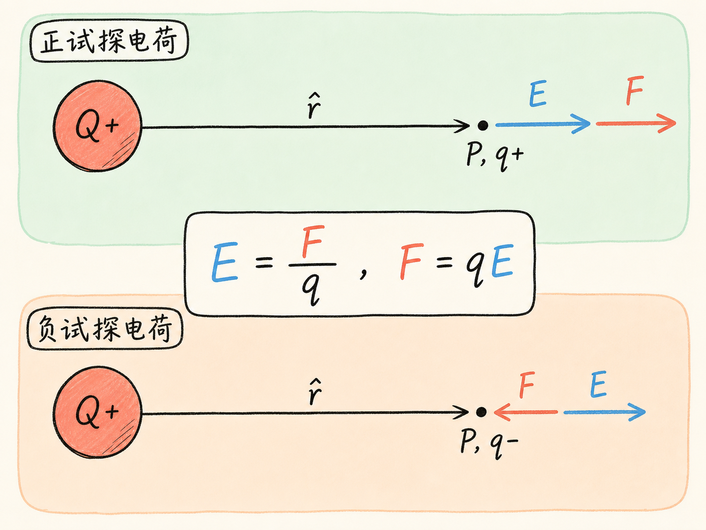
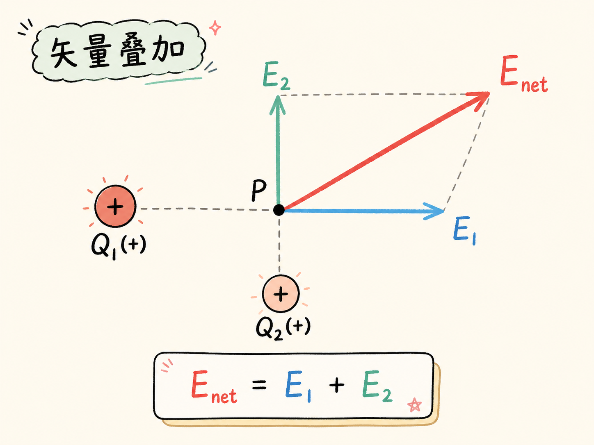
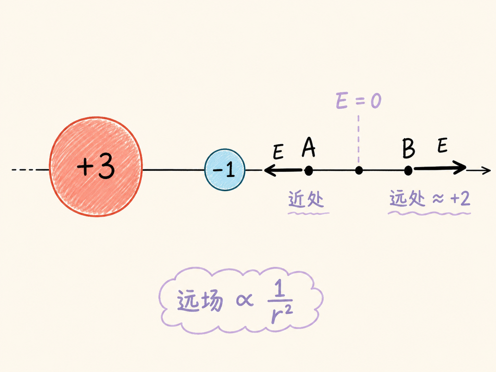
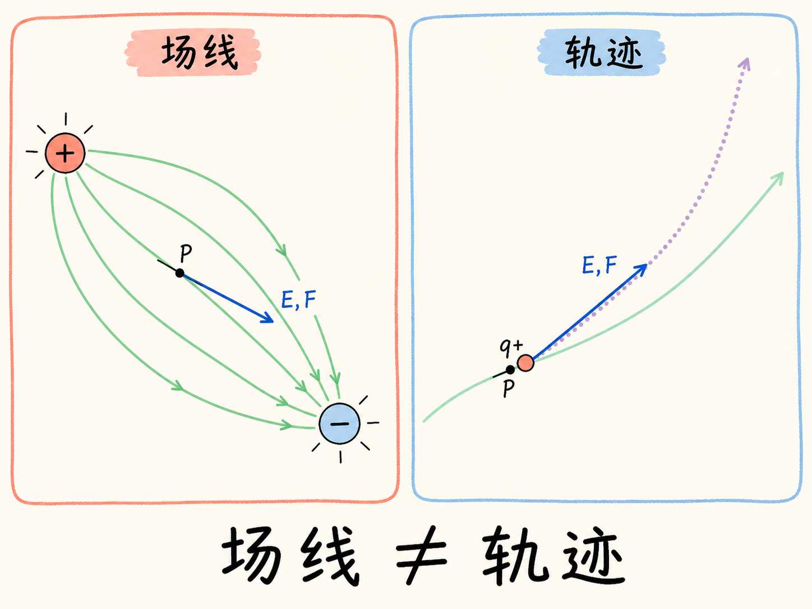
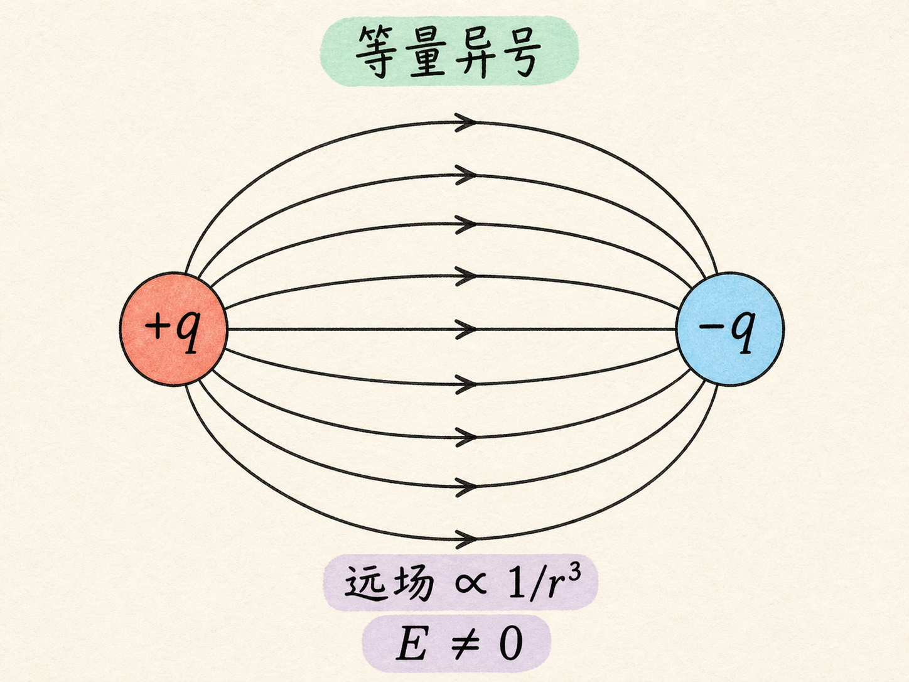
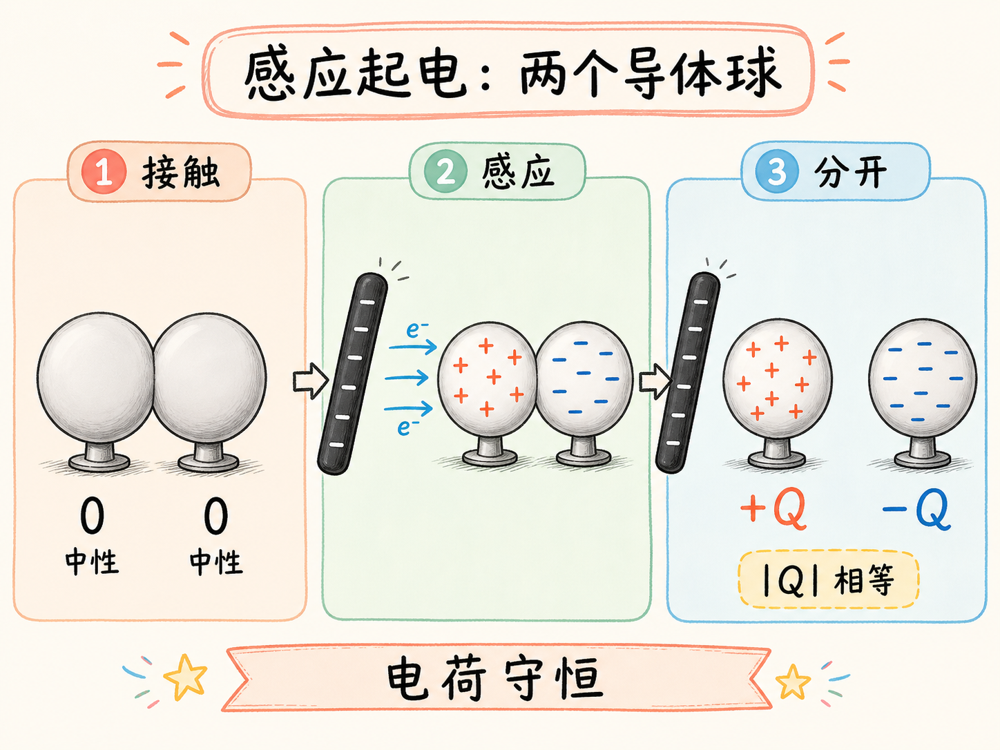
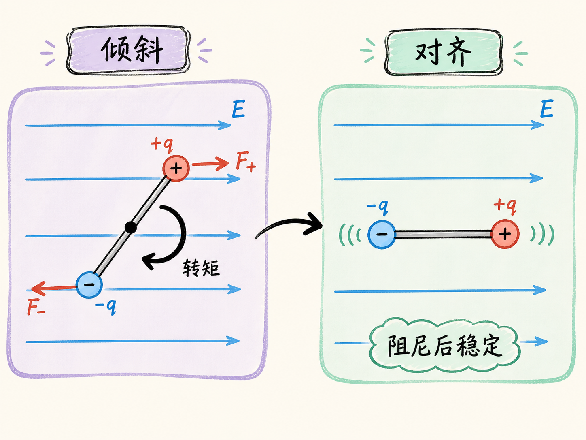
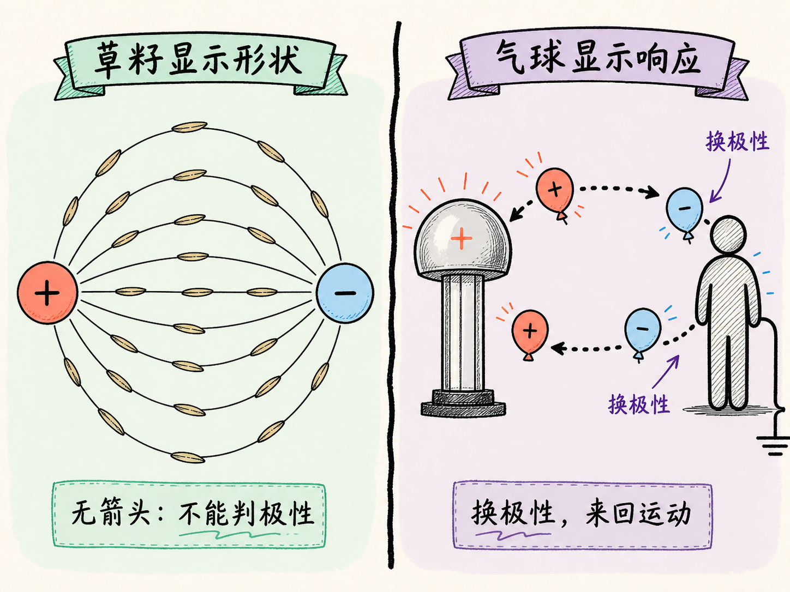

# 电场和偶极子

把一粒草籽放进油里，再给周围加上电场，原本杂乱的草籽会逐渐转动，排成一条条弧线。它们没有看见电场，也没有沿着什么实体轨道滑动；每一粒草籽只是被极化，然后朝当地电场的方向转过去。许多草籽一起排列，就让看不见的电场显出了形状。

这正是“场”这个概念要解决的问题：不必先在空间中放入某个特定电荷，我们也能描述每一点具有什么电作用。等真正把电荷放进去时，只需知道它的电量和正负号，就能得到它受到的力。

读完这篇，你会知道

- 为什么要把“某个电荷受到的力”改写成“空间中某点的电场”？
- 多个电荷同时存在时，怎样用矢量叠加得到净电场？
- 电场箭头和电场线分别表达什么，为什么电场线通常不是粒子的运动轨迹？
- 等量异号电荷组成的偶极子，为什么与一个带净电荷的组合不同？
- 怎样通过静电感应制造偶极子，又怎样用它探测电场？

## 从两个电荷之间的力，到空间中一点的场

先放一个源电荷 $Q$，再在距离它 $r$ 的位置放一个试探电荷 $q$。从 $Q$ 指向 $q$ 的单位矢量记作 $\hat{\mathbf r}$。库仑定律给出试探电荷所受的力：$\mathbf F=kqQ\hat{\mathbf r}/r^2$，其中 $k$ 是库仑常数。

这个式子同时包含了两类信息。$1/r^2$ 决定力随距离按平方反比衰减；$qQ$ 的符号决定实际受力相对 $\hat{\mathbf r}$ 的方向：同号相斥，异号相吸。

但如果每换一个试探电荷，就重新描述一次力，空间本身的电作用会一直和试探电荷混在一起。于是把力除以试探电荷，定义 $P$ 点的电场：$\mathbf E(P)=\mathbf F/q$。对单个点电荷，板书中的关系变为 $\mathbf E(P)=kQ\hat{\mathbf r}/r^2$。

小写 $q$ 消失了，这就是关键。电场只由产生场的电荷分布和观察位置决定，不再取决于你拿什么试探电荷去测量。电场的 SI 单位是牛顿每库仑，写作 $\mathrm{N/C}$。

电场方向还有一个固定约定：它等于正试探电荷在该点的受力方向。因此，正源电荷周围的电场背离电荷，负源电荷周围的电场指向电荷。真正放入一个电荷后，再用 $\mathbf F=q\mathbf E$ 恢复受力。若 $q>0$，力与 $\mathbf E$ 同向；若 $q<0$，力与 $\mathbf E$ 反向。

## 复杂电荷分布，只需要逐个相加

如果空间中同时有 $Q_1$、$Q_2$、$Q_3$ 等多个电荷，就先分别求它们在 $P$ 点产生的电场 $\mathbf E_1$、$\mathbf E_2$、$\mathbf E_3$，再做矢量相加：$\mathbf E(P)=\mathbf E_1+\mathbf E_2+\mathbf E_3+\cdots$。

这里相加的是矢量，不是只把几个大小加在一起。每个分量都有自己的方向，净电场要由这些箭头共同决定。这就是电场的叠加原理。它并非仅凭直觉就显然成立；接受它的依据，是它与实验结果一致。

一旦净电场算出，复杂的源电荷分布就被浓缩成了 $P$ 点的一个矢量。此后无论带来怎样的试探电荷，都用同一个 $\mathbf E(P)$，再乘以该电荷的 $q$。电荷量改变力的大小，电荷正负改变力相对电场的方向，却不反过来改变这里已经定义好的电场。

## $+3$ 和 $-1$：近处看局部，远处看净电荷

考虑一个相对电量为 $+3$ 的电荷和一个为 $-1$ 的电荷。把正试探电荷放得非常靠近 $-1$ 时，由于 $1/r^2$ 对距离很敏感，近处的 $-1$ 项可能压过较远的 $+3$ 项，合力便指向 $-1$。

把同一个试探电荷放到很远处，而且距离远大于两个源电荷之间的间隔，情形会改变。此时两个距离的差别相对很小，这个组合从远处看等效为净电荷 $+2$，电场总体向外，并按 $1/r^2$ 衰减。

近处的电场可以指向 $-1$，远处却转为向外，因此在 $-1$ 外侧存在一个净电场为零的点：在那里，$+3$ 的排斥与 $-1$ 的吸引恰好抵消。这个例子说明，电场方向不能只看哪个电荷的绝对值更大；必须同时考虑距离和矢量方向。

在正、负电荷之间的连线上，情况反而直接：正电荷产生的场向外，负电荷产生的场向内，两者都从正电荷指向负电荷，因此彼此加强。

## 箭头与电场线：一张图里保留方向和强弱

表示电场最直接的方法，是在许多位置画电场矢量。箭头朝向表示正试探电荷的受力方向，箭头长度大致表示电场大小。对点电荷，越靠近电荷，箭头越长；越远，箭头越短，用来表现 $1/r^2$ 的衰减。

另一种更有组织的表示方法是电场线。电场线在每一点的切线方向，就是当地电场方向。正电荷附近的线向外发出，负电荷附近的线向内终止。空间中每一点都有电场，因此理论上可以画无穷多条线；实际只选有限条，否则图会挤得无法使用。

箭头长度不再直接出现后，电场线还能用疏密表达强弱：线越密，表示电场越强；线越疏，表示电场越弱。对 $+3$ 与 $-1$ 的示意图，可以从 $+3$ 发出三倍于终止在 $-1$ 上的线数，用相对数量表现两者电量大小的差异。

需要注意，电场线是表示工具，不是电荷预先铺好的轨道。电荷在某一位置受到的力只与当地电场线相切。若电场线笔直，而且正电荷从静止释放，它可以一直沿线加速；若电场线弯曲，电荷刚开始沿切线获得加速度后就会积累速度，下一时刻的运动方向不再等于新位置的场线切向，轨迹于是会离开原来的电场线。

## 等量异号以后，出现了偶极子

把两个电荷做成大小相等、符号相反，就得到电偶极子。靠近正电荷时，电场线向外；靠近负电荷时，电场线向内。两端作用同样强，整个分布呈现明显的对称性。

偶极子与 $+3$、$-1$ 组合的根本差别在远处。后者有净电荷 $+2$，远场按 $1/r^2$ 衰减；偶极子的净电荷为零，不能在远处简化成一个更弱的正点电荷或负点电荷。它的远场衰减得更快，按 $1/r^3$ 下降，但并不是在有限距离外突然变成零。

这也解释了为什么偶极场的箭头在远处既不是简单地径直向外，也不是径直向内。两个等量异号电荷的贡献仍需做矢量叠加，只是它们的主要部分在远处相互抵消，留下更快衰减的空间变化。这个偶极场在空间中没有净电场恰好为零的点。

## 怎样用两个金属球制造偶极子

偶极子不只存在于预先带电的两个小球。把球形原子或分子放进电场，电子倾向于逆着电场方向偏移，正电荷一侧则沿电场方向。电子在原子核一侧停留得稍多，另一侧就留下等量的正电，这个原子或分子便被极化成偶极子。

课堂上用导体更容易把这个过程做出来。先让两个中性的金属球彼此接触，再把一根带负电的橡胶棒靠近其中一个球。自由电子受到排斥，穿过接触处移动到较远的球；靠近橡胶棒的球留下正电，远端球积累负电。整个两球系统的总电荷仍为零，因为电荷没有被创造出来。

关键步骤是：橡胶棒还在原位时，把两个球分开。电子失去回流通道，负电被留在远端球，等量的正电被留在近端球，于是得到一对极性相反、大小相等的电荷。验电器不仅能显示球上确有电荷，还能借静电感应判断两球的极性不同：靠近与验电器异号的球时，金属箔的张开程度变小；换成同号的球，张开程度变大。

## 偶极子为什么会转向电场

把偶极子斜放进电场，正电荷端受到沿 $mathbf E$ 方向的力，负电荷端受到逆着 $\mathbf E$ 的力。这一对作用在不同位置、方向相反的力产生转矩，使偶极子转向电场线方向。

如果它越过了对齐位置，转矩会反向，于是偶极子可能来回振荡。有足够阻尼时，振荡逐渐减弱，最终大致沿电场方向停下。这个机制把偶极子变成了一个电场方向探针。

课堂演示先用金属连接杆让两个导电乒乓球在范德格拉夫起电机的电场中发生感应，再断开连接，得到悬挂在绝缘线上的偶极子。拿着它绕起电机移动时，偶极子不断转动，最后沿当地的径向电场排列。若已知偶极子哪端带负电，还可以反过来判断起电机的极性。

## 从草籽到气球：看见场，但不要把它当轨道

油中的草籽也会在电场中被极化。每粒草籽形成微小的正负两端，受到转矩后沿当地电场排列。许多草籽一起排成曲线，就显示出偶极子或两个同号电荷附近的场线形状。草籽本身没有箭头，所以这幅图只能显示线的形状，不能单独告诉你哪一端是正、哪一端是负。

带电气球展示的是另一件事。范德格拉夫起电机与站在地面上的人之间形成复杂电场；气球在其中受到当地电场决定的力。它碰到人或起电机时会得到相反极性的电荷，受力随之反向，于是在两者之间来回运动。

气球运动得慢，是因为阻尼很大；它的路线只能让人粗略感受电场分布。每一刻的力仍与当地电场线相切，但气球不会严格沿某一条电场线走到底。这与前面对弯曲场线的分析一致：场线给出局部受力方向，轨迹还包含此前已经积累的运动状态。

## 最后收束：场把“来源”和“响应”分开了

电场先描述电荷分布在空间中建立了什么：方向按正试探电荷约定，大小由源电荷、距离和矢量叠加决定。等真正放入电荷，再由 $\mathbf F=q\mathbf E$ 决定它如何响应。

偶极子把这种分工表现得尤其清楚。等量异号电荷的净电荷为零，却仍能建立具有方向和空间结构的电场；放进外场后，它又会因为两端受力不同而转动。草籽、金属球和气球的演示只是让这套关系变得可见：看见的是物体的响应，背后组织这些响应的是每一点的电场。
