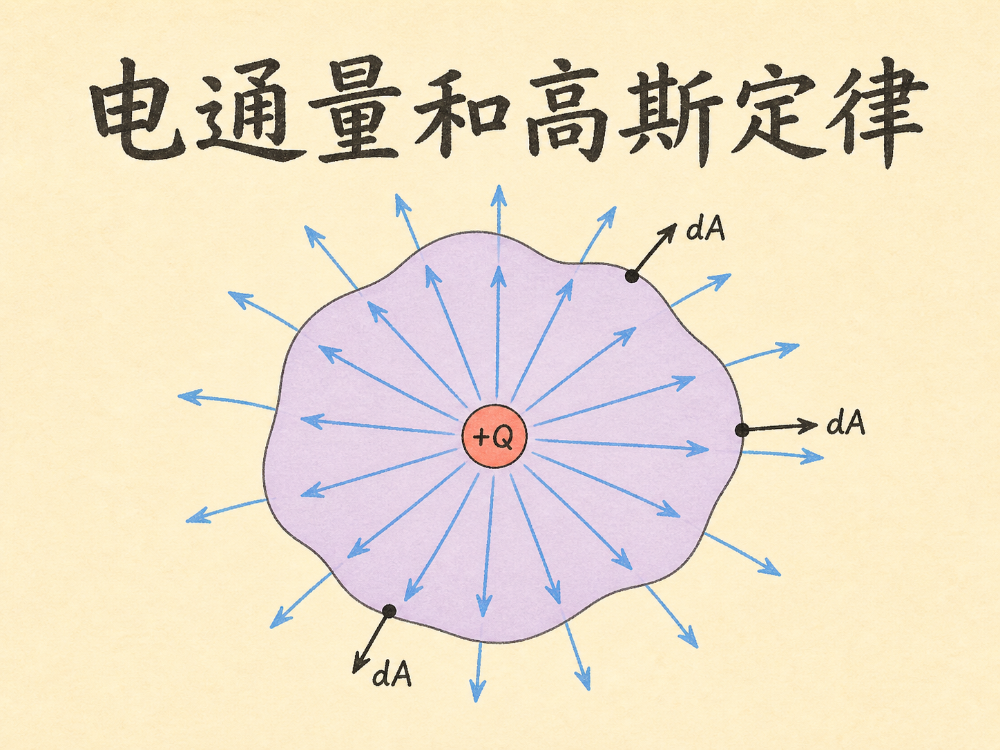
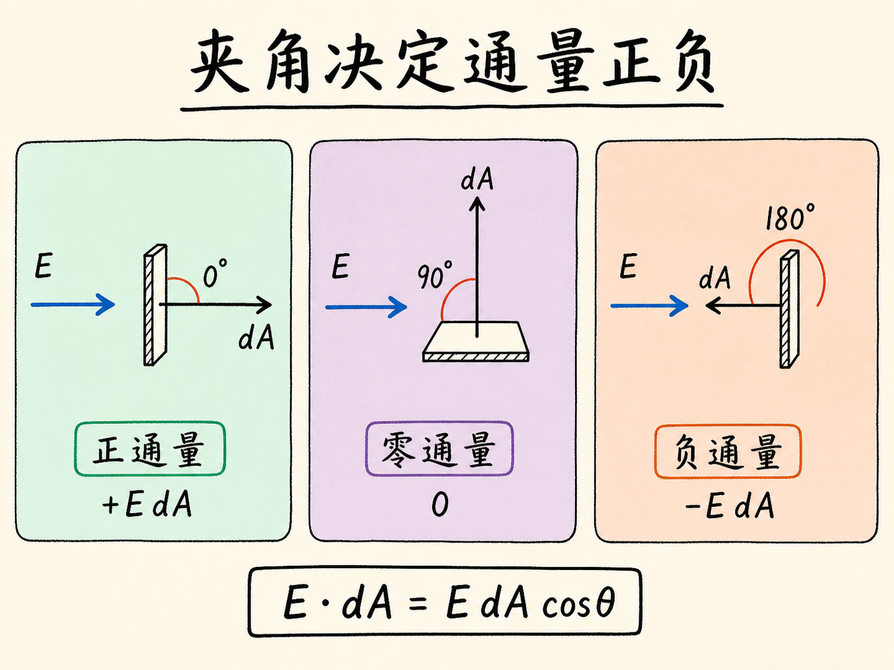
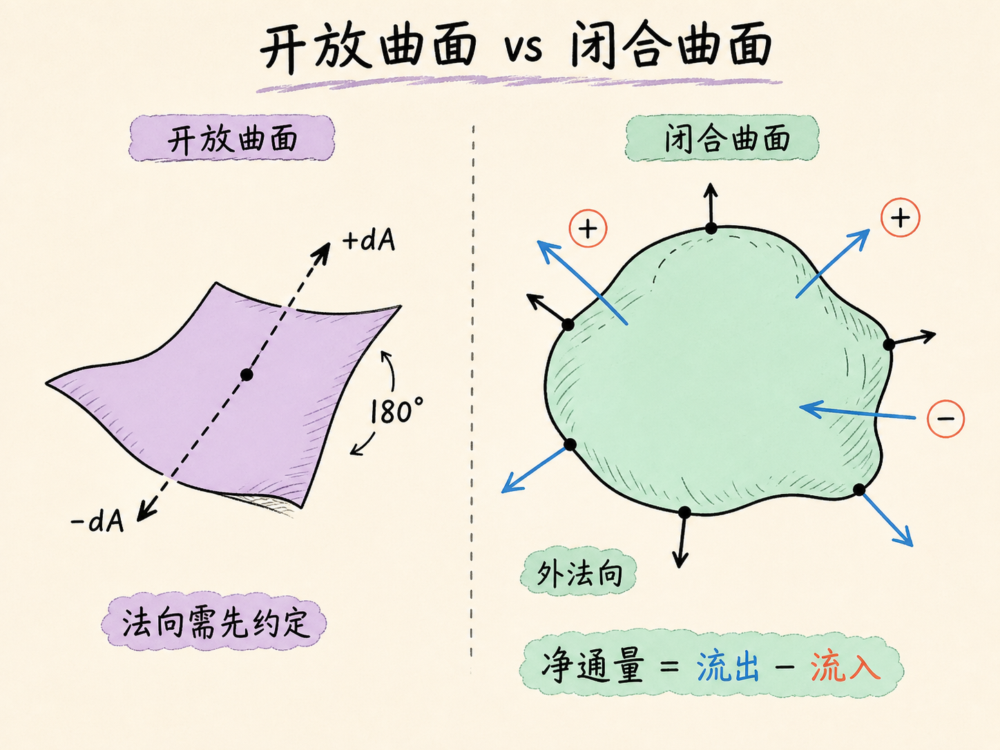
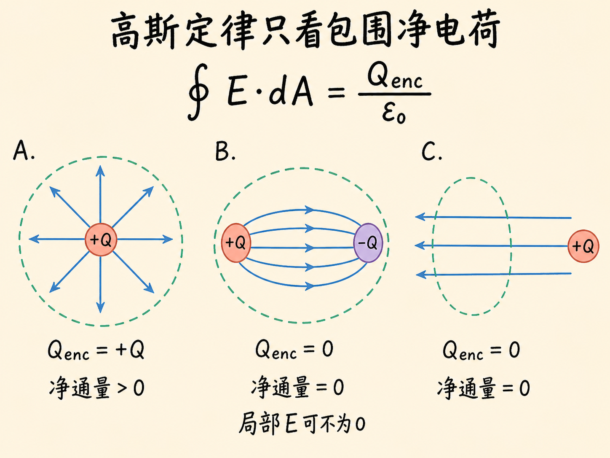
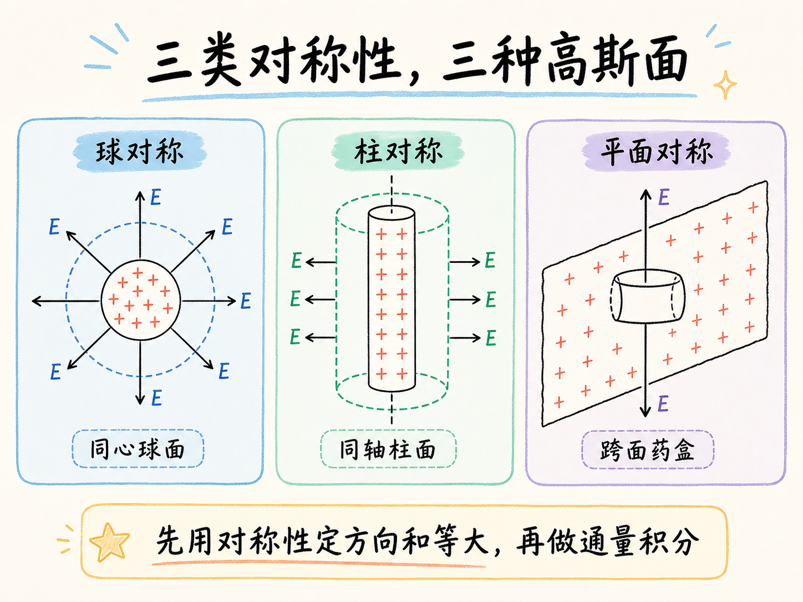
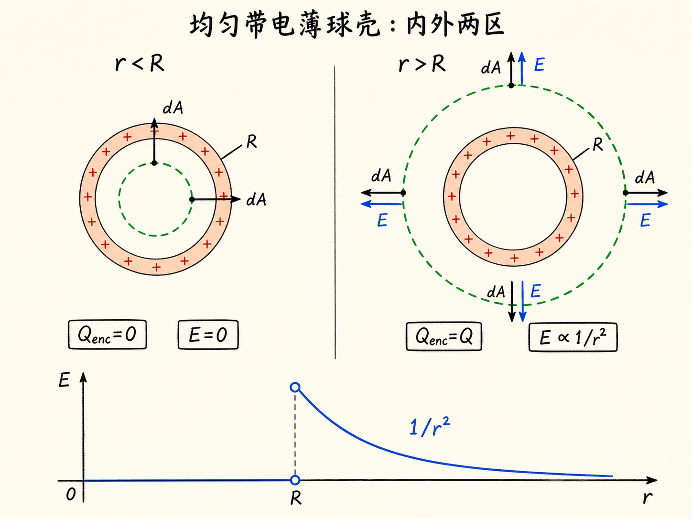
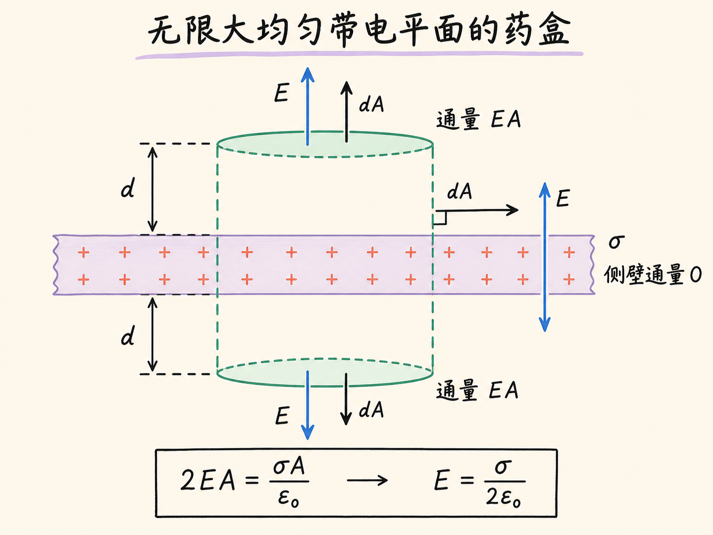
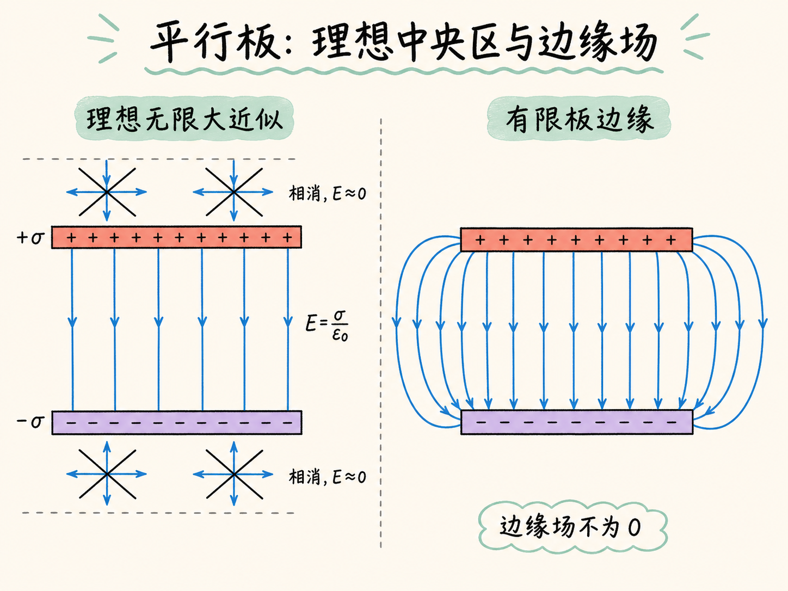
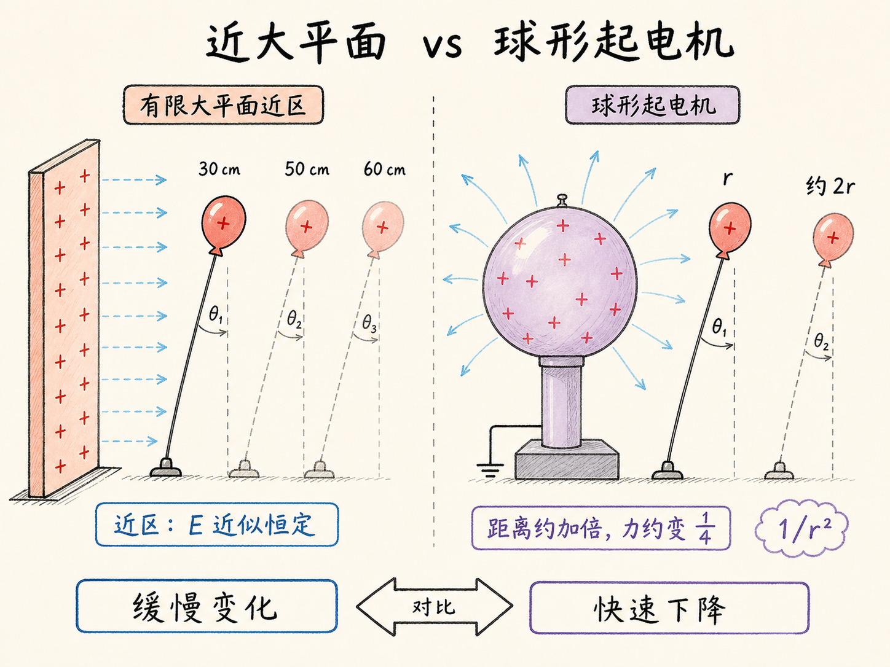

# 电通量和高斯定律

同一个电场里放一张纸，纸面正对着电场时，似乎有很多“场”穿过去；把纸转过 $90^\circ$，电场仍然存在，穿过纸面的量却变成零。变化的不是电场本身，而是电场相对于表面的方向。

这正是电通量要描述的事情。它把电场、面积和方向装进一个标量，并最终把任意闭合面上的总通量，直接联系到这个闭合面包围的净电荷。

读完这篇，你会知道

- 面积为什么也要带方向，$d\mathbf A$ 到底指向哪里？
- $\mathbf E\cdot d\mathbf A$ 为什么会有正、负和零？
- 开放曲面与闭合曲面的法向选择有什么区别？
- 高斯定律为什么总成立，却只有在高对称问题中才方便求电场？
- 球、无限大平面和平行板的电场怎样由同一条定律得到？

## 先把“穿过多少”写成一个数

在电场中取一个很小的面元，面积是 $dA$。单有面积还不够，因为同一块面元朝向不同，穿过它的电通量不同。于是给它配一个垂直于表面的法向单位矢量 $\hat{\mathbf n}$，定义面积矢量 $d\mathbf A=\hat{\mathbf n}\,dA$。它的大小是 $dA$，方向垂直于面元。

穿过这个小面元的电通量为 $d\Phi_E=\mathbf E\cdot d\mathbf A=E\,dA\cos\theta$。这里 $\theta$ 是电场 $\mathbf E$ 与面积矢量 $d\mathbf A$ 的夹角。点积的结果是标量，因此电通量不是一支箭头，而是一个可以带正负号的数。它的单位由定义直接得到：$\mathrm{N\,m^2/C}$。

符号来自余弦。$\mathbf E$ 与 $d\mathbf A$ 同向时，$\theta=0^\circ$，通量为正且达到 $E\,dA$；两者垂直时，$\theta=90^\circ$，通量为零；两者反向时，$\theta=180^\circ$，通量为负。若夹角是 $60^\circ$，通量就是 $E\,dA\cos60^\circ$。

把曲面切成许多小面元，再把每一块的通量相加，就得到整个开放曲面的通量 $\Phi_E=\int_S\mathbf E\cdot d\mathbf A$。空气穿过窗框的类比可以帮助建立直觉：速度矢量与窗面法向平行时流量最大，垂直时没有空气穿过，倾斜时只取法向分量。但类比只负责解释点积，电通量本身仍由电场和面积矢量定义。

## 开放曲面的法向可选，闭合曲面的外法向唯一

对一张纸这样的开放曲面，可以从两侧任选一侧作为法向。把所选法向翻转 $180^\circ$，每个面元的通量符号也会翻转。因此，说开放曲面的通量之前，必须先说明选了哪一侧。

闭合曲面不同。像气球或扎紧的袋子那样，它明确分出内部和外部。约定每个面元的 $d\mathbf A$ 都从内部指向外部，这个外法向不再有二义性。穿过整个闭合面的总电通量写成 $\Phi_E=\oint_S\mathbf E\cdot d\mathbf A$，积分号上的圆圈提醒我们：积分区域是闭合面。

现在正负号有了统一含义。电场沿外法向穿出闭合面，贡献正通量；电场沿内向穿入闭合面，贡献负通量。总通量为零，只说明所有面元贡献的代数和为零，也就是净流出量等于净流入量。它并不意味着闭合面上处处没有电场。

## 一个点电荷，为什么不在乎球面大小

把正点电荷 $+Q$ 放在半径为 $R$ 的球面中心。球面任意位置的外法向都沿径向向外；点电荷产生的电场也沿径向向外，所以 $\mathbf E$ 与 $d\mathbf A$ 处处平行。同一球面上的每一点离电荷都一样远，电场大小也处处相同。

于是闭合面通量可以直接把 $E$ 提出积分：$\Phi_E=E\oint_S dA=E\,4\pi R^2$。点电荷的电场是 $\mathbf E=Q\hat{\mathbf r}/(4\pi\epsilon_0R^2)$。代入之后，电场中的 $1/R^2$ 与球面积中的 $R^2$ 正好相消，得到 $\Phi_E=Q/\epsilon_0$。

这说明球面做大或做小，总通量都不变。球面变大时，单位面积上的电场按 $1/R^2$ 变弱；与此同时，球面积按 $R^2$ 增大，两种变化正好抵消。把球面捏成凹凸不平的闭合面，总通量仍不改变；只要点电荷仍在闭合面内部，所有向外的通量最终都要穿过这层边界。

## 高斯定律只数“包围的净电荷”

多个电荷产生的电场可以矢量叠加，因此上面的结果扩展为高斯定律：$\oint_S\mathbf E\cdot d\mathbf A=Q_{\mathrm{enc}}/\epsilon_0$。$Q_{\mathrm{enc}}$ 不是空间中的总电荷，也不是离曲面最近的电荷，而是这个闭合面实际包围的全部电荷的代数和。

若闭合面内同时有正、负电荷且代数和为零，那么净通量为零。这里仍不能推出闭合面上电场为零，因为不同位置可以有正、负通量，最后相互抵消。高斯定律对任意闭合面、任意内部电荷分布都成立；曲面可以光滑，也可以很奇怪。

不过，“定律成立”和“能方便地算出 $\mathbf E$”是两件事。要从积分中把 $E$ 提出来，必须先依靠对称性知道电场的大小在某些面上相同，也知道它与面积矢量是平行、反平行还是垂直。本讲使用三类对称性：球对称、柱对称和均匀带电平面对称。

## 均匀带电薄球壳：内部为零，外部像点电荷

考虑半径为 $R$、总电荷为 $Q$ 的薄球壳，电荷均匀分布在球面上。要求距球心 $r$ 处的电场，就选择半径为 $r$ 的同心球面作为高斯面。均匀分布带来两个关键约束：同一高斯面上电场大小相同；电场方向只能沿径向，不可能偏向某个切向方向。

当 $r<R$ 时，高斯面位于球壳内部，没有包围任何电荷，所以 $Q_{\mathrm{enc}}=0$。由于球对称性已经允许写出 $\oint_S\mathbf E\cdot d\mathbf A=E\,4\pi r^2$，因此 $E=0$。球面上每一小块电荷都产生电场，但这些矢量贡献在球内任一点恰好相消。

这里不能把“没有包围电荷”单独当成“电场为零”的理由。外面的电荷已经通过对称性进入推导。若球面电荷不均匀，同一高斯面上 $E$ 不再处处相同，方向也不再保证纯径向；高斯定律仍给出净通量为零，却不能推出局部电场为零。

当 $r>R$ 时，高斯面包围全部电荷 $Q$，于是 $E\,4\pi r^2=Q/\epsilon_0$，得到 $E=Q/(4\pi\epsilon_0r^2)$。$Q>0$ 时电场径向向外，$Q<0$ 时径向向内。球外的结果与把全部电荷集中在球心完全相同。电场随 $r$ 的曲线在球壳内部为零，在 $r=R$ 处跃升，随后按 $1/r^2$ 衰减。

本讲把这个结果与引力作了平行比较：引力也服从平方反比，因此均匀球形空壳内部的引力场同样为零，而非球形空壳不能沿用这个球对称结论。

## 无限大均匀带电平面：距离为什么消失

再看面电荷密度为 $\sigma=Q/A$ 的均匀带电大平面。这里没有球对称性，球形高斯面不能让积分简化。应选择一个跨过平面的闭合“药盒”：上下端盖平行于带电平面，侧壁垂直于平面，并让上下端盖到平面的距离同为 $d$。

平面对称性告诉我们，电场垂直于平面；在上下等距位置，电场大小相同，方向分别指向两侧。因此在药盒侧壁上，$\mathbf E$ 与 $d\mathbf A$ 垂直，侧壁通量为零。上下两个端盖上，电场都与各自的外法向平行，通量各为 $EA$。药盒包围的电荷是 $\sigma A$。

代入高斯定律得到 $2EA=\sigma A/\epsilon_0$，所以 $E=\sigma/(2\epsilon_0)$。正带电平面的电场在两侧都背离平面，负带电平面的电场在两侧都指向平面。公式中没有 $d$，所以无限大均匀带电平面的场强与距离无关。

“无限大”是这个结论的条件。实际平面只有有限尺寸时，只在观察距离远小于平面线性尺寸的近区，场强才近似不随距离变化。离得足够远，整个带电平面看起来像一个点电荷，电场又会转为按 $1/r^2$ 衰减。

## 两块异号平板：板间相加，板外相消

现在放置两块很大的平行板，一块面电荷密度为 $+\sigma$，另一块为 $-\sigma$。单独看每块板，它都在两侧产生大小 $\sigma/(2\epsilon_0)$ 的电场：正板的场背离正板，负板的场指向负板。

把两块板的电场做矢量叠加。两板之间，两份电场方向相同，都从正板指向负板，因此相加为 $E=\sigma/\epsilon_0$。两板外侧，两份电场方向相反、大小相等，因此在无限大平板近似下相消为零。

这个结论只适用于远离板边缘的区域。靠近边缘时，电场线弯向外部，形成边缘场；此处板外电场不再为零，板内电场也不再完全均匀。高斯定律没有失效，失效的是把局部电场从曲面积分中直接提出的平面对称性。

## 三个演示，把条件也一起看见

第一个演示把有限大金属平面接到范德格拉夫起电机，再用同号带电小气球的偏角反映电力大小。气球从距平面约 30 厘米移到 50、60 厘米时，偏角只缓慢减小，说明在平面近区，电场近似恒定。移走平面后，只剩近似球形的起电机；距离大致加倍时，作用力明显降到约四分之一，符合 $1/r^2$。

第二个演示检验带电球壳内部的零场。用两只相接触的导电乒乓球做电场探针：在球壳外，静电感应使两球分开后带异号电荷，验电器有响应；在球壳内，第二次实验几乎测不到电荷。实验球壳为了放入探针留有小孔，所以只能非常接近理想的“完整闭合、均匀带电”条件，不能把结果说成绝对精确的零。

第三个演示把导电乒乓球放在两块异号平行板附近。板外的球沿弧线运动，直接表明有限平板外仍有边缘场；放入板间后，球快速往返，说明板间电场强得多。每次碰板，球改变所带电荷的极性并转向另一块板。

## 高斯定律不会替你寻找对称性

电通量把局部关系 $\mathbf E\cdot d\mathbf A$ 累加成闭合面的净结果；高斯定律再把这个净结果锁定为 $Q_{\mathrm{enc}}/\epsilon_0$。定律本身不要求闭合面是球、柱或药盒，也不要求内部电荷分布规则。

真正决定“能不能直接求出电场”的，是你能否用电荷分布的对称性确定 $\mathbf E$ 的方向，并让它在选定高斯面上具有足够简单的大小关系。球、柱和平面不是三种记忆题，而是三种把积分变简单的对称性。离开这些条件，高斯定律依然正确，只是不再自动给出局部电场。
