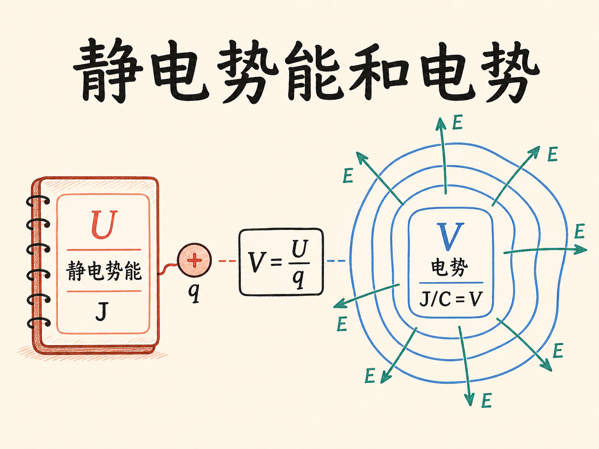
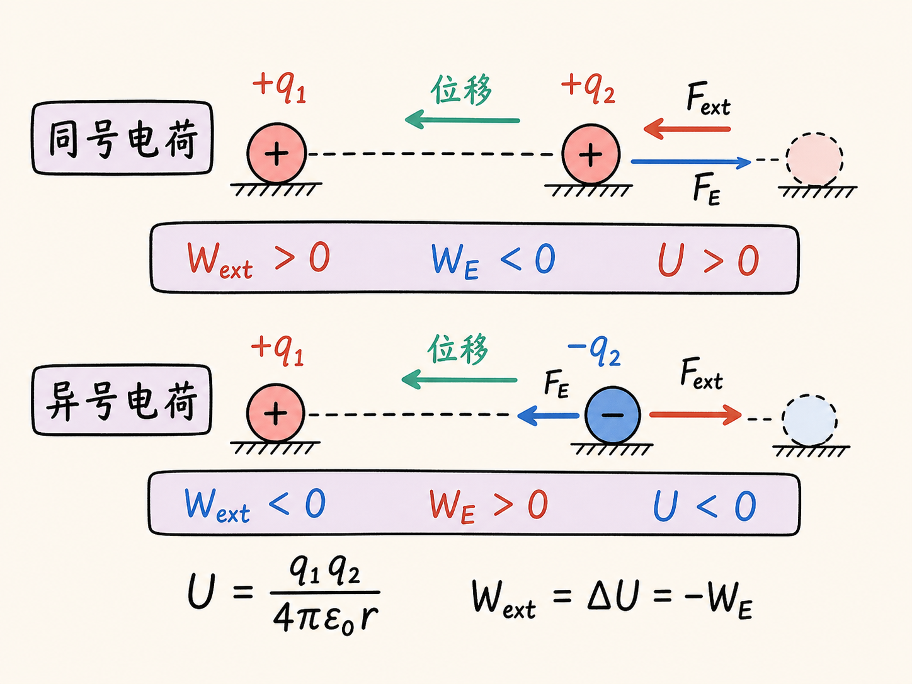
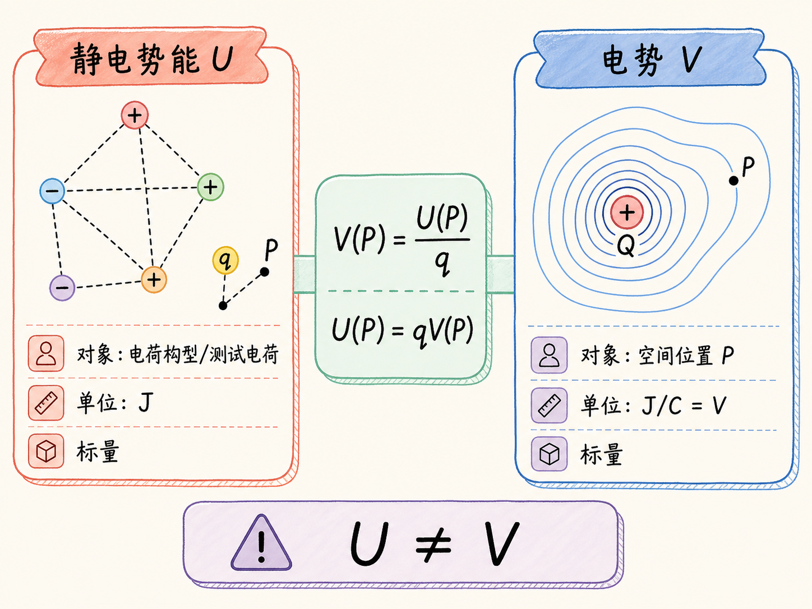
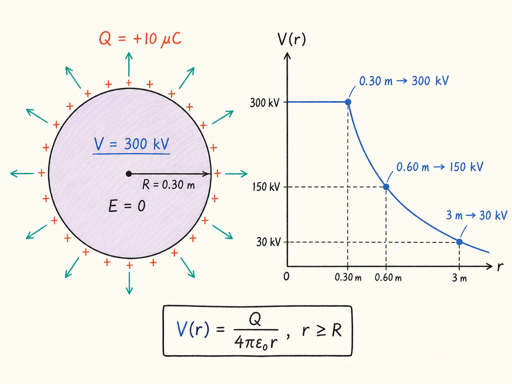
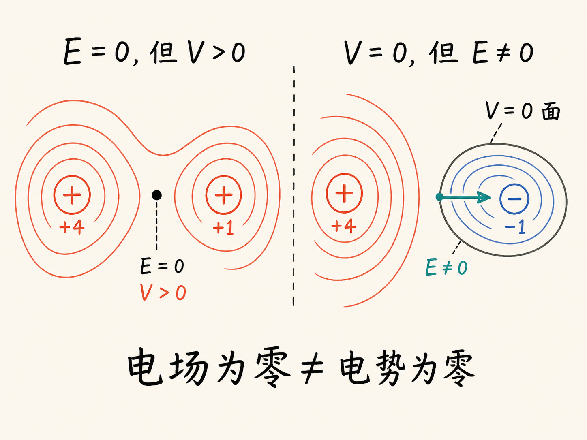
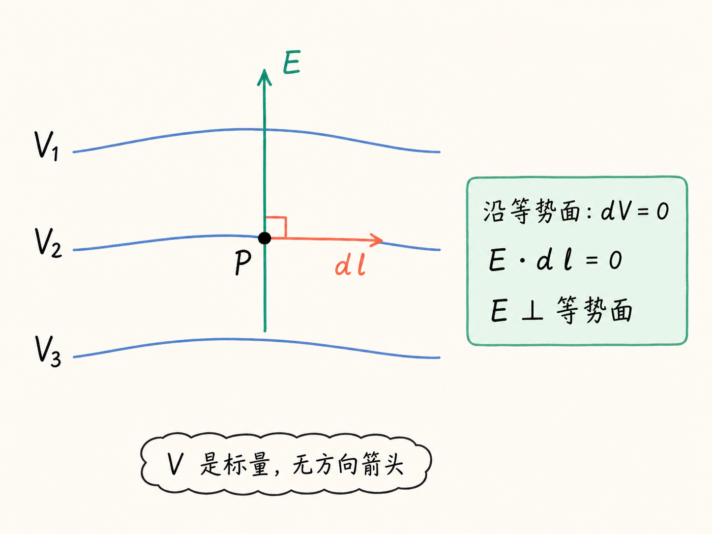
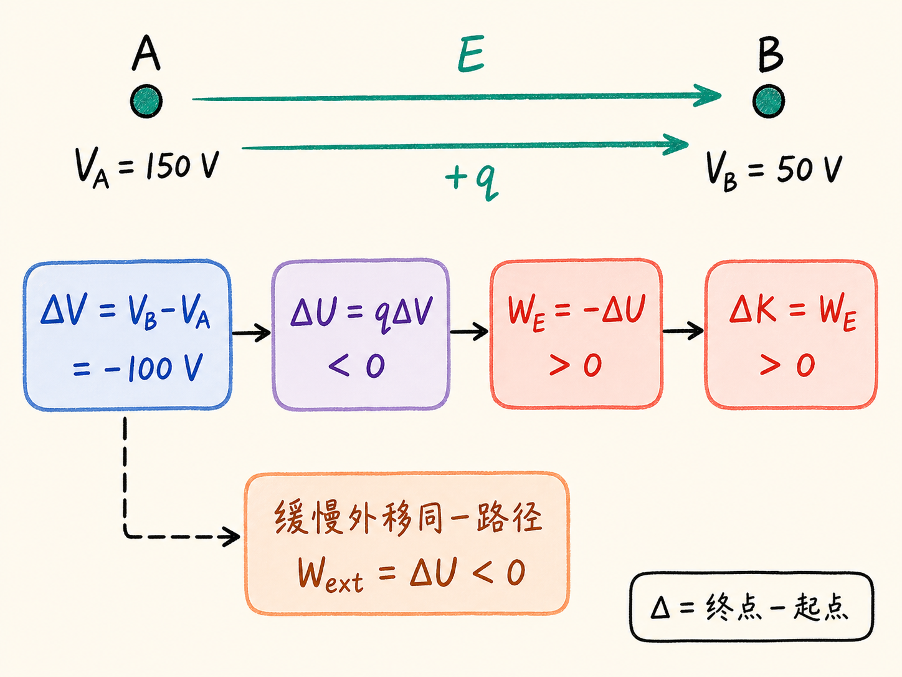
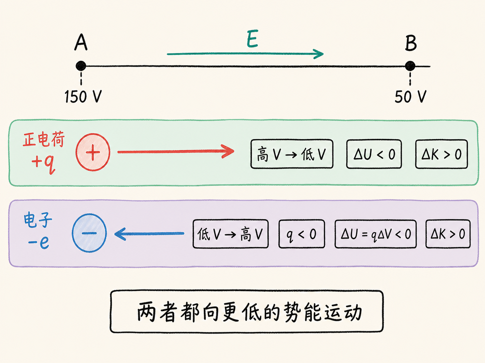
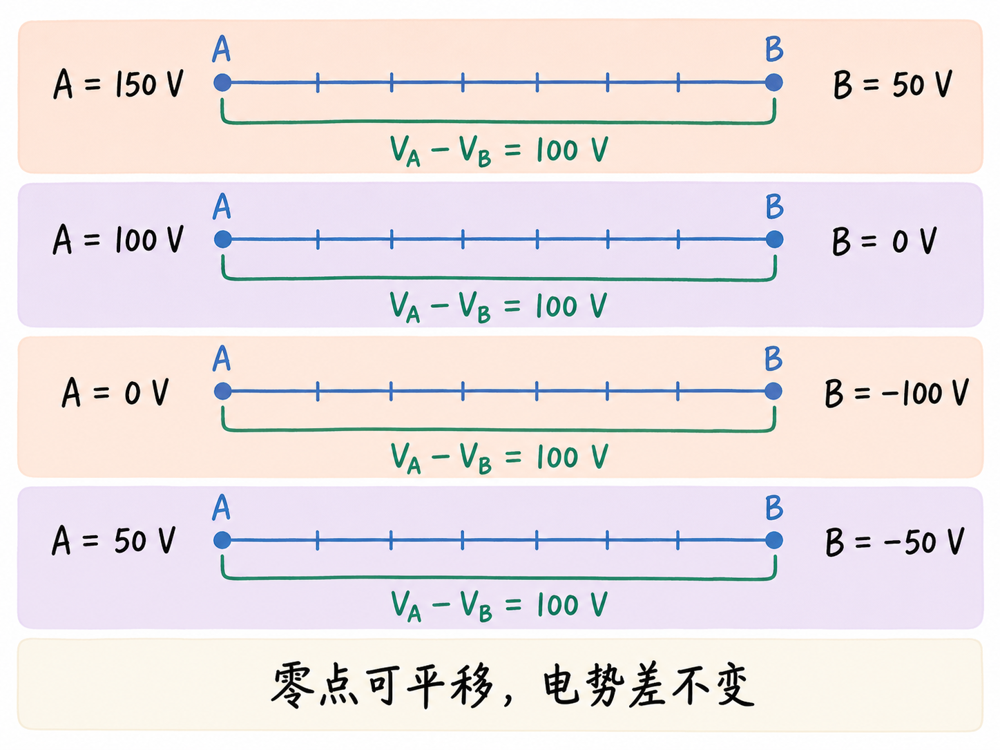
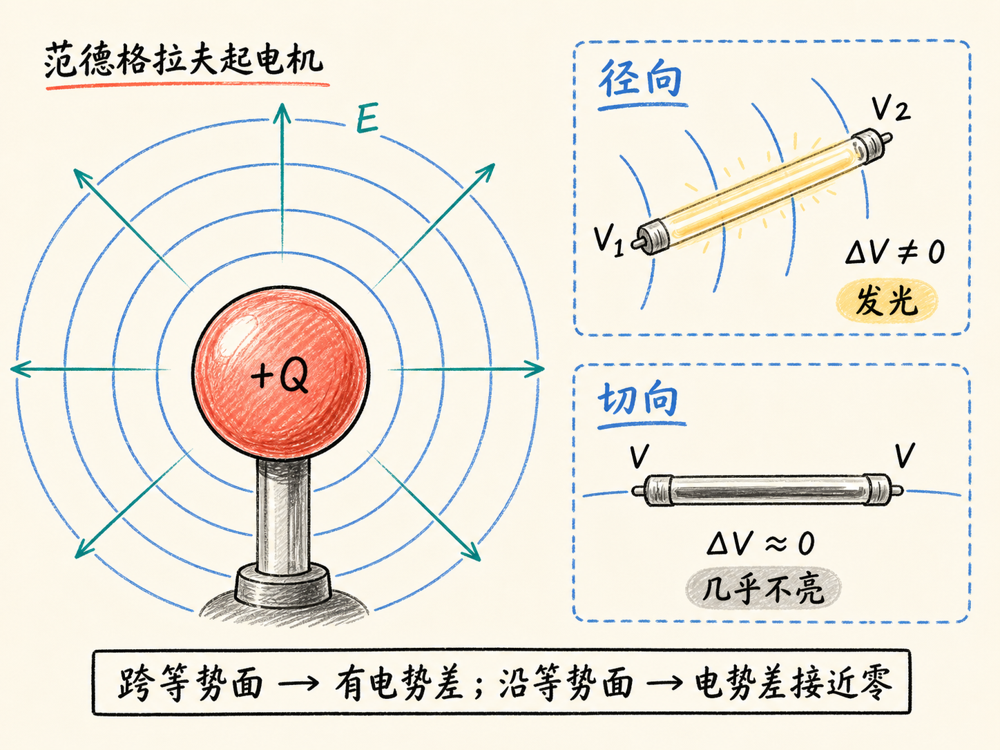

# 静电势能和电势

一根没有接导线的荧光灯管，放在范德格拉夫起电机旁边：沿径向握住，它会发出微光；转到切向，光几乎消失。灯管的位置没有离开电场，方向一变，两端的效果却完全不同。

要解释这个演示，光知道“这里有电场”还不够。真正决定灯管两端能不能推动电荷运动的，是两端的电势差。由此会遇到两个名字很像、却不能混用的物理量：静电势能 $U$ 和电势 $V$。

读完这篇，你会知道

- 静电势能 $U$ 与电势 $V$ 分别在计算什么
- 为什么对测试电荷有 $V=U/q$，但二者不是同一个物理量
- 电势的参考零点为何可以改变，而电势差不变
- 外力做功、电场力做功、势能变化与动能变化的符号怎样对应
- 等势面为什么与电场垂直，以及“电场为零”和“电势为零”为何是两回事

## 先算把两个电荷摆到一起要付出多少功

设空间中已有电荷 $q_1$。现在把另一个电荷 $q_2$ 从无穷远缓慢带到距离它为 $r$ 的位置。如果两者同号，它们相互排斥。越接近目标位置，外力越要顶着排斥力向前，因此外力做正功。

这个过程像压缩弹簧：做进去的功没有消失，而是储存在电荷构型中。把电场力从当前距离积分到无穷远，可得两点电荷构型的静电势能

$U=\dfrac{q_1q_2}{4\pi\epsilon_0r}$。

这里 $q_1$、$q_2$ 是两个电荷量，$r$ 是它们的间距，$\epsilon_0$ 是式中的常量；$U$ 是标量，单位为焦耳。

符号已经包含在电荷量里。同号时 $q_1q_2>0$，外力组装它们要做正功，$U>0$；异号时 $q_1q_2<0$，电荷会相互吸引，外力反而要“拽住”它们，外力做负功，$U<0$。

如果组装过程足够缓慢，没有额外的动能变化，那么

$W_{\text{ext}}=\Delta U$，而 $W_E=-\Delta U$。

$W_{\text{ext}}$ 是外力做功，$W_E$ 是电场力做功。组装同号电荷时，外力做正功、电场力做负功；组装异号电荷时，符号恰好相反。

电场力是保守力，所以从无穷远到目标位置，沿直线走还是绕一条曲折路径走，外力需要完成的净功相同。对于一组正负电荷，可以逐个从无穷远带入，并把每一步的功相加；最后得到的一个总数，就是整个电荷构型的静电势能 $U$。

## 从“总共做了多少功”到“每单位电荷要做多少功”

现在固定一个源电荷 $Q$，在距它为 $r$ 的 P 点放入测试电荷 $q$。测试电荷在 P 点的静电势能为

$U(P)=\dfrac{Qq}{4\pi\epsilon_0r}$。

把它除以测试电荷量，就得到 P 点的电势：

$V(P)=\dfrac{U(P)}{q}=\dfrac{Q}{4\pi\epsilon_0r}$。

这就是 $V=U/q$ 的准确含义：对处在某一点的测试电荷，电势等于它的静电势能除以电荷量；反过来，$U=qV$。测试电荷 $q$ 被除掉以后，$V$ 只描述源电荷在这个位置建立的电势，不再取决于拿来试探的电荷有多大。

$U$ 和 $V$ 都是标量，但它们回答的问题不同。一个已经组装好的电荷构型只有一个总静电势能 $U$；同一构型产生的电势 $V$ 却随空间位置变化。$U$ 的单位是焦耳，$V$ 的单位是焦耳每库仑，后者称为伏特：$1\,\mathrm V=1\,\mathrm{J/C}$。

对单个正源电荷，空间中的电势为正，并按 $1/r$ 随距离减小；对单个负源电荷，电势为负。把无穷远规定为零电势时，二者都在 $r\to\infty$ 时趋近于零。

## 带电导体球把“场”和“势”的差别画了出来

考虑一个半径 $R=0.30\,\mathrm m$、带电量 $Q=+10\,\mu\mathrm C$ 的空心导体球。球外的电势与把全部电荷看成集中在球心相同：

$V(r)=\dfrac{Q}{4\pi\epsilon_0r},\qquad r\ge R$。

球面电势是 $300\,\mathrm{kV}$。距离加倍到 $0.60\,\mathrm m$，电势减半为 $150\,\mathrm{kV}$；到 $3\,\mathrm m$，电势约为 $30\,\mathrm{kV}$。

球内的情况不同。静电平衡时内部电场为零，测试电荷在里面移动不受电场力，因此电场不做功，电势也不发生变化。于是球内处处都与球面等势：从球心到球面，$V$ 保持 $300\,\mathrm{kV}$；离开球面后，才按 $1/r$ 下降。

这里已经出现一个重要区别：某一区域的电场为零，只能说明电势在那里不随位置变化，不能据此断言电势数值就是零。

## 等势面是电势的“等高线”

地图用等高线连接高度相同的位置，电场中也可以用等势面连接电势相同的位置。单个点电荷或带电球的等势面是一组同心球面。多个电荷同时存在时，各电荷产生的电势直接按标量相加，等势面就可能变得很复杂。

两个正电荷 $+4$ 和 $+1$ 附近，电势处处为正。靠近任一电荷时，等势面近似球面；走得足够远，它们整体又像一个 $+5$ 电荷，等势面重新接近球面。两者之间则可能出现形状扭曲的等势面，其中甚至有一个电场为零的点。

但那个点的电势不是零。从无穷远把正测试电荷带到那里，仍然要克服两个正电荷的排斥而做正功。到达以后不受力，只表示当地 $\mathbf E=0$；此前已经积累的每单位电荷的功并没有因此消失，所以那里仍是正电势。

换成 $+4$ 和 $-1$，空间中会同时出现正电势面、负电势面和零电势面。零电势面上的电场并不一定为零：它只表示从所选零点来到该面时，每单位电荷的净功为零。反过来，电场为零的某一点也完全可能处在正电势上。

不同数值的等势面不能相交。若 $+5\,\mathrm V$ 与 $+3\,\mathrm V$ 的等势面在一点相交，同一个位置就会同时拥有两个电势值，能量的记账会发生矛盾。

## 为什么电场线总与等势面垂直

从 A 点走到 B 点，电势差可以写成

$V_B-V_A=-\int_A^B\mathbf E\cdot d\mathbf l$。

这里 $\mathbf E$ 是沿路径各点的电场矢量，$d\mathbf l$ 是微小位移矢量。把等式左右同时换序，也可以写成 $V_A-V_B=\int_A^B\mathbf E\cdot d\mathbf l$。

如果沿等势面移动，起点与终点的电势相同，所以积分为零。局部位移 $d\mathbf l$ 沿等势面切向，而 $\mathbf E\cdot d\mathbf l=0$，这意味着电场方向与等势面的切向垂直。电势是标量，图上没有“电势箭头”；真正带方向的是电场 $\mathbf E$。

同一个积分还说明电势差与具体路径无关。只要起点和终点不变，绕路不会改变 $V_B-V_A$。如果 A、B 之间处处没有电场，积分为零，两点就有相同电势。

## 一套符号关系把做功和能量变化连起来

假设 A 点电势为 $V_A=150\,\mathrm V$，B 点电势为 $V_B=50\,\mathrm V$。把一个正电荷 $+q$ 从无穷远缓慢带到 B，外力做功为 $qV_B=50q$ 焦耳；带到 A，则是 $qV_A=150q$ 焦耳。

现在让正电荷从 A 自由运动到 B。它沿电场从高电势走向低电势。定义 $\Delta V=V_B-V_A$，就有

$\Delta U=U_B-U_A=q\Delta V=q(V_B-V_A)$。

因为这里 $q>0$ 且 $V_B<V_A$，所以 $\Delta U<0$。势能减少的量转成动能：

$\Delta K=K_B-K_A=-\Delta U=q(V_A-V_B)$。

电场力做功等于动能变化，外力若要缓慢完成同一段移动，则符号相反：

$W_E=-\Delta U=q(V_A-V_B)$，

$W_{\text{ext}}=\Delta U=q(V_B-V_A)$。

这几行关系只需要统一一个约定：$\Delta$ 始终是“终点减起点”。一旦起终点、测试电荷符号和 $\Delta V$ 的定义固定，所有功和能量的正负号都会自动跟上。

## 负电荷为什么会逆着电场走向高电势

正电荷释放后从高电势走向低电势；负电荷则从低电势走向高电势。原因仍然是 $U=qV$。对负电荷，$q<0$，所以 $V$ 升高时，$U$ 反而降低；它仍然是在向较低势能运动。

把一个金属垃圾桶接到 A 点，整个垃圾桶稳定后都处在 $150\,\mathrm V$；把金属汽水罐接到 B 点，整个罐体都处在 $50\,\mathrm V$。静电平衡的金属内部电场为零，因此每一块金属都是等势体。

若在 B 点从静止释放一个电子，它会从 $50\,\mathrm V$ 的汽水罐飞向 $150\,\mathrm V$ 的垃圾桶。电子的实际轨迹可能穿过非常复杂的电场，但如果只关心最终动能，就不需要先求出整条轨迹。

对电子，$q=-e$，从 B 到 A 的电势变化为 $V_A-V_B=100\,\mathrm V$，因此

$\Delta U=(-e)(100\,\mathrm V)<0$，

$\Delta K=-\Delta U=e(100\,\mathrm V)>0$。

取电子电荷量大小 $e=1.6\times10^{-19}\,\mathrm C$、质量约 $9\times10^{-31}\,\mathrm{kg}$，并令初速度为零，用 $\Delta K=\frac12m_ev^2$ 就能求出到达 A 时的速度，约为光速的 $2\%$。这正是电势方法的价值：只关心能量变化时，起点和终点的电势差往往已经足够，不必先解出复杂轨迹。

## 零点可以换，结果不会变

前面的点电荷和带电球把无穷远选作零电势。但真正决定电荷动能变化的是电势差，不是电势的绝对标号。

A、B 两点写成 $150\,\mathrm V$ 和 $50\,\mathrm V$，电势差是 $100\,\mathrm V$；把它们同时改写成 $100\,\mathrm V$ 与 $0\,\mathrm V$、$0\,\mathrm V$ 与 $-100\,\mathrm V$，或 $50\,\mathrm V$ 与 $-50\,\mathrm V$，电势差都不变，电子的运动结果也不变。电气工程中常把大地规定为零电势，就是选择了一个方便的参考点。

## 回到那根会亮的灯管

范德格拉夫起电机的电场径向向外，电势沿径向变化。把荧光灯管沿径向放置，两端落在不同等势面上，因此存在较大的电势差，灯管中的电荷会运动并发出微光。

把灯管转到切向，两端近似落在同一个等势面上，电势差接近零，微光也就消失。氖闪光管在钓鱼竿末端旋转时，同样只在接近径向的姿态更容易发光。

所以，$U$ 是电荷构型或某个电荷在电场中的能量账本，$V$ 是空间每一点“每单位电荷对应多少能量”的地图。电场告诉你局部受力方向，电势差告诉你跨越两个位置时能量能改变多少。把这两张图分清，灯管为什么会亮、正负电荷为什么朝相反方向运动、等势面为什么与电场垂直，就能用同一套能量关系连起来。
