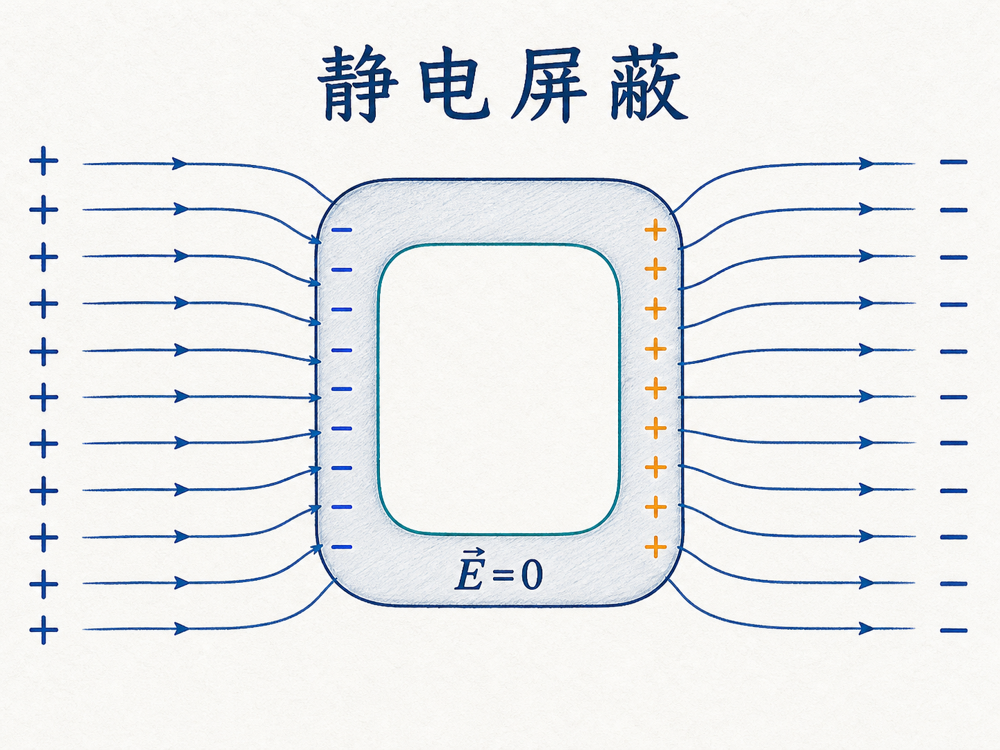
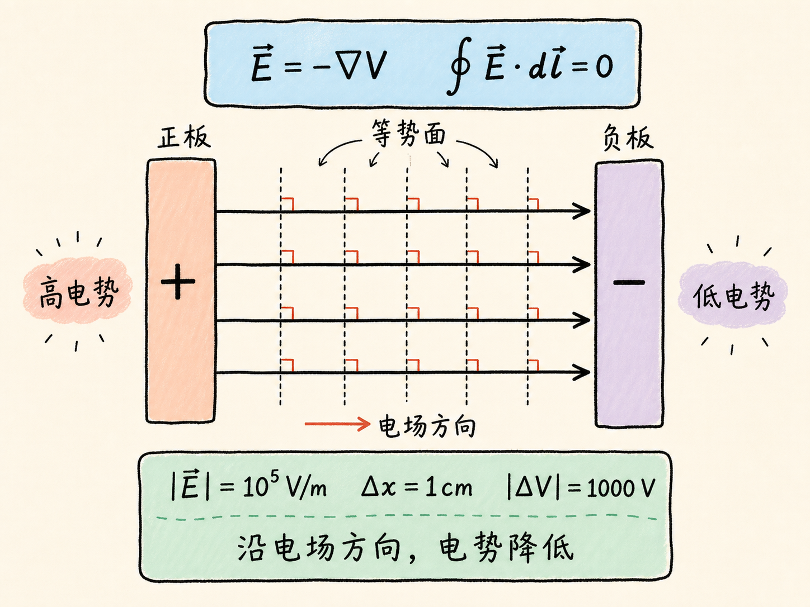
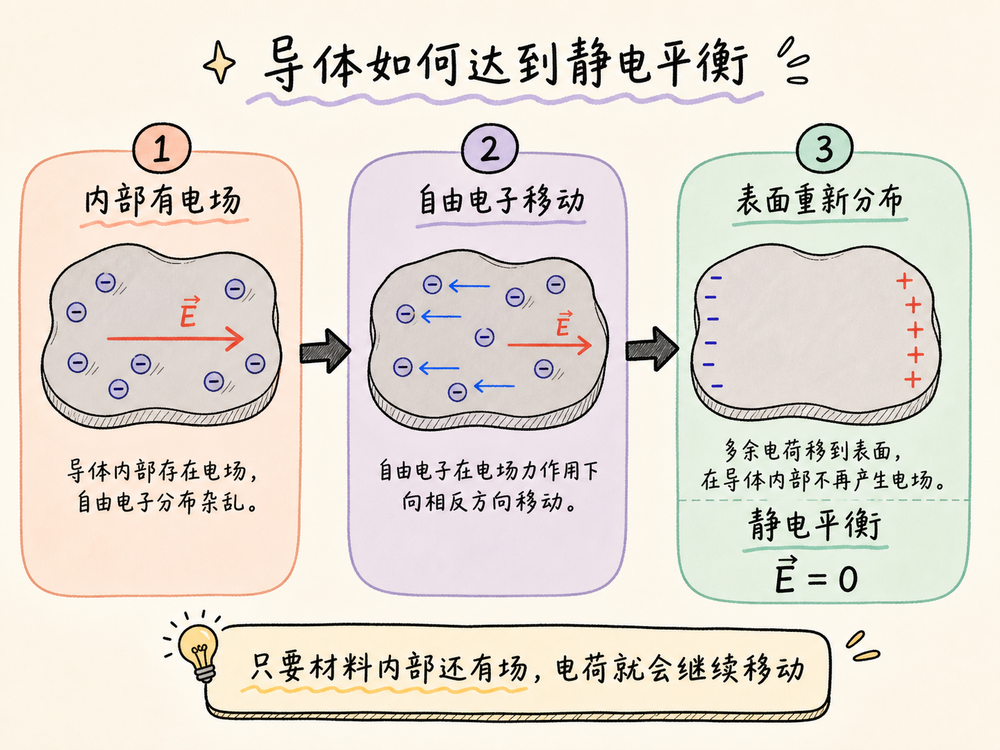
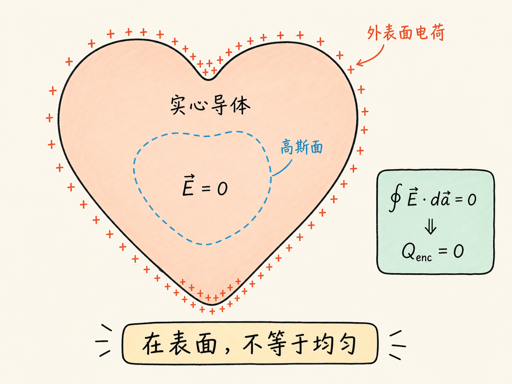
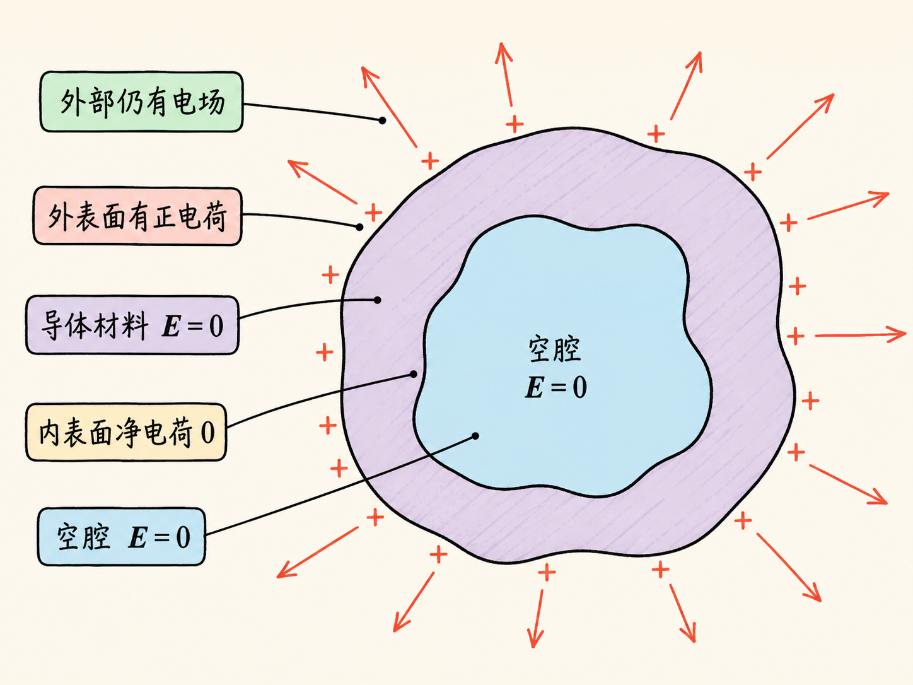
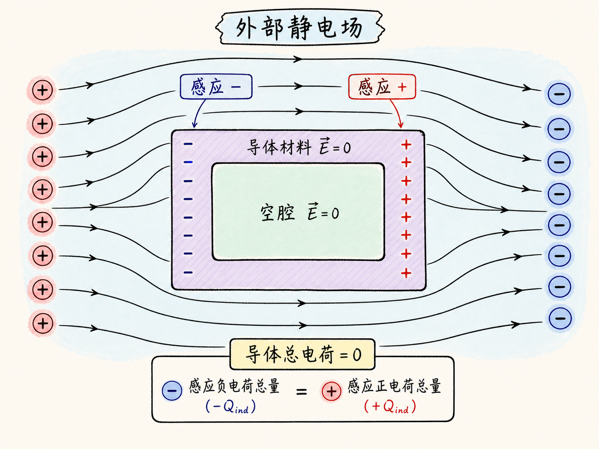
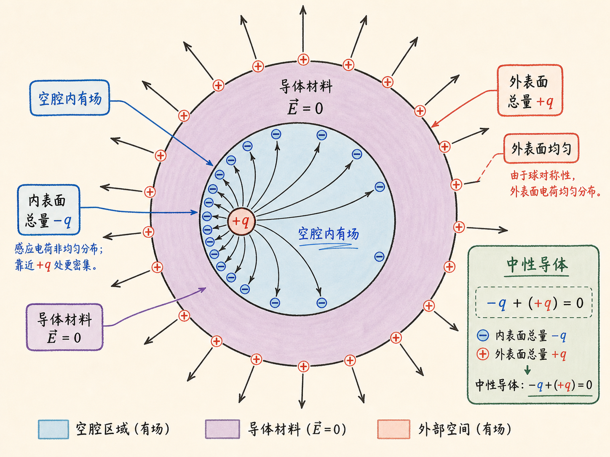
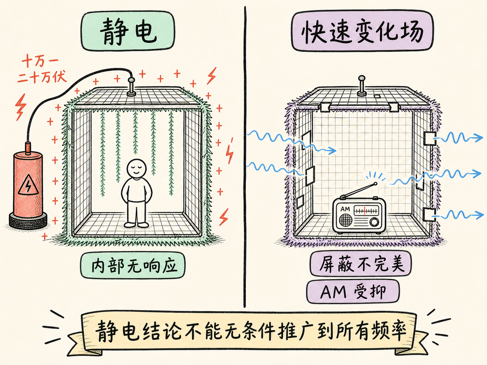
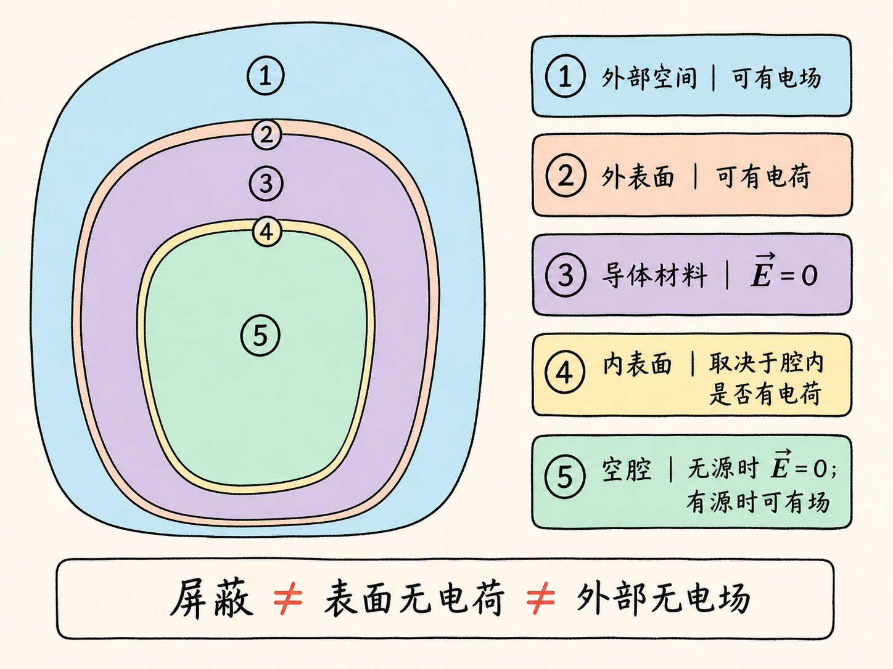

# 静电屏蔽：导体如何让空腔安静下来

一个金属盒的外表面可以一边带正电、一边带负电，盒外也可以存在很强的电场；与此同时，封闭空腔里却测不到静电场。这不是因为“电荷消失了”，而是因为导体中的自由电荷重新排好了位置。

静电屏蔽最容易被说错的地方，也正在这里：被屏蔽的是空腔内部，不是整个空间；导体材料内部电场为零，不等于导体表面没有电荷，更不等于导体外部没有电场。

读完这篇，你会知道

- 为什么静电平衡时导体材料内部必须有 $\mathbf E=0$
- 多余电荷为什么留在表面，而不是散布在导体体积内
- 外部电场怎样改变外表面电荷，却不进入封闭空腔
- 空腔内另放一个电荷后，内外表面会怎样重新分配电荷
- 法拉第笼能屏蔽什么，课程演示又揭示了什么边界

## 先把电势和电场接起来

静电场是保守场。口袋里带着测试电荷，从 A 点出发绕一圈再回到 A，起点和终点的电势相同，总功也就是零。用电场写出来，就是沿任意闭合路径都有

$\oint \mathbf E\cdot d\mathbf l=0$。

这条关系说明，知道空间中处处的电场，就能通过积分得到电势；知道处处的电势，也能通过求导恢复电场。对点电荷的径向问题，关系是 $\mathbf E=-\dfrac{dV}{dr}\hat{\mathbf r}$；在三维笛卡尔坐标中，则写成

$\mathbf E=-\nabla V=-\left(\dfrac{\partial V}{\partial x}\hat{\mathbf x}+\dfrac{\partial V}{\partial y}\hat{\mathbf y}+\dfrac{\partial V}{\partial z}\hat{\mathbf z}\right)$。

负号给出了方向：电场指向电势降低最快的方向。比如两块平行板之间若有 $V=10^5x$，那么板间电场就是 $\mathbf E=-10^5\hat{\mathbf x}\,\mathrm{V/m}$。一厘米距离对应的电势差大小为 $1000\,\mathrm V$。电场的单位既可以写成 N/C，也可以写成 V/m；后一个写法直接表达“单位距离上电势改变了多少”。

沿等势面移动时，电势不变，因此 $\mathbf E\cdot d\mathbf l=0$。这要求电场线处处垂直于等势面。若把电荷以零初速度释放，正电荷起初沿电场方向运动，负电荷起初沿反方向运动；两者的起步方向都沿等势面的法线。

## 自由电荷为什么一定要重新排队

现在进入导体。导体中有可以移动的自由电子。只要导体材料内部还存在电场，这些电子就会受力并继续移动；只要它们还在定向移动，体系就没有达到静电平衡。

电荷会一直重新分布，直到导体材料内部处处满足 $\mathbf E=0$。所以，这不是人为附加的一条规定，而是“静电平衡”本身对自由电荷运动的要求。这里的条件也不能省略：讨论的是静态或缓慢达到平衡的情形，不是快速变化的电磁场。

$\mathbf E=0$ 还意味着导体材料内部没有电势变化。导体在静电平衡时是等势体；外部场线如果到达导体表面，只能沿表面法线方向相交，否则切向电场会继续驱动表面电荷移动。

## 多余电荷为什么不留在导体体积内

想象一颗从里到外都是钢制导体的实心心脏，再从外部给它带上正电荷。多余电荷会均匀散布在整个体积中吗？

在导体材料内部取一个闭合高斯面。由于这个面上处处有 $\mathbf E=0$，穿过它的电通量为零。高斯定律因此要求它包围的净电荷为零。只要这个高斯面仍完全位于导体材料内部，就不能包围任何多余净电荷。

因此，多余电荷只能留在导体表面。但“在表面”不等于“均匀分布”。球形导体在相应对称条件下可以均匀分布；心形导体没有这种形状对称，表面电荷密度会随位置改变。无论是否均匀，导体材料内部仍保持 $\mathbf E=0$。

## 挖出空腔之后，别把两种“里面”混在一起

现在把实心心脏挖出一个封闭空腔，再从外部给导体充电。这里必须区分两个区域：一是包围空腔的导体材料，二是空腔中的空旷空间。

先看空腔内没有另放电荷的情形。在导体材料内部取一个包围空腔的闭合高斯面。高斯面上仍有 $\mathbf E=0$，所以它包围的净电荷为零；由此，外加的多余电荷不会跑到空腔内表面，而是留在外表面。空腔内表面没有这部分净电荷，空腔中的静电场也为零。

于是，导体材料和空腔处于同一电势。外表面可以带电，导体外部也可以有弯曲而复杂的场线；这些场线到达外表面时处处垂直。屏蔽没有消灭外部场，它只让封闭空腔不受这部分外部静电作用。

课堂上的金属罐演示直接检验了这个判断。给罐子充电后，用小测试球接触外侧，验电器明显偏转；接触内侧，验电器没有反应。罐子并非理想地完全封闭，因为探头必须从开口伸进去，所以实际屏蔽不会严格完美，但结果已经非常接近理想情形。

## 外面施加电场，表面会发生什么

把一个原本中性的空心导体放进外部静电场，导体外表面的自由电荷会发生感应极化。一侧出现负电荷，另一侧出现正电荷。导体总电荷仍可为零，但表面电荷不再处处为零。

这些外表面电荷共同建立出新的电场分布，使导体材料内部恢复到 $\mathbf E=0$，封闭空腔内也保持 $\mathbf E=0$。外部场线仍然存在，而且会连接外部电荷与导体外表面；它们在接触导体表面时保持垂直。

这正是静电屏蔽，也是法拉第笼的核心。住在导体盒的空腔里，你不会从内部静电测量得知外面正在给盒子充电，还是正在施加外部静电场。外界改变的是外表面的电荷分布，导体中的自由电荷用重新排列维持了内部的静电平衡。

金属罐放进范德格拉夫起电机的电场后，测试球从罐子两侧取到的电荷极性相反，而从内侧取不到电荷。它同时说明了三件事：外表面确实发生极化；导体整体仍是等势体；空腔内侧没有因外场而积累净电荷。

## 如果电荷本来就在空腔里

“空腔内电场为零”有一个关键前提：空腔内没有另放电荷。现在把一个 $+q$ 放进空腔，情况立即改变。空腔里当然会有电场，但包围空腔的导体材料内部仍必须保持 $\mathbf E=0$。

再取一个完全位于导体材料中的闭合高斯面，让它包围空腔。因为高斯面上 $\mathbf E=0$，它包围的净电荷必须为零。空腔里已有 $+q$，所以内表面必须感应出总量为 $-q$ 的电荷。

若导体原本整体中性，内表面的 $-q$ 来自导体自身，外表面就必须留下总量 $+q$，才能保持导体总净电荷仍为零。于是三处必须分开写：

- 空腔中有源电荷 $+q$，空腔内存在电场；
- 内表面感应电荷总量为 $-q$，分布通常不均匀；
- 外表面电荷总量为 $+q$，外部仍可存在电场。

如果 $+q$ 靠近空腔某一侧，那一侧内表面的负电荷密度会更高，空腔内的场也更强。对于球形外表面，课程给出的结论是：外表面的 $+q$ 均匀分布，而且与内部电荷的位置无关。内部电荷怎样移动会改变内表面分布，却不会把这些细节泄露给外界。

## 法拉第笼的演示边界

课堂上的法拉第笼带有小开口，并与范德格拉夫起电机相连。笼子升到十万伏、二十万伏时，外侧的金属丝穗明显张开；人进入笼内后，内侧金属丝穗没有同样的响应，人也可以触碰内壁。这演示的是静电条件下的屏蔽。

但课程也特意指出，快速变化的电场不是同一个问题。笼内的高频无线发射器仍能把信号传到外部，AM 收音却会受到明显屏蔽。带开口的金属笼对快速变化电磁场的屏蔽并不完美，因此不能把静电结论不加条件地推广到所有频率。

## 把整条机制链复述一遍

静电场满足 $\oint\mathbf E\cdot d\mathbf l=0$，并有 $\mathbf E=-\nabla V$。导体中的自由电荷会在电场作用下移动，直到导体材料内部 $\mathbf E=0$，导体成为等势体。外加电荷或外部静电场仍可以在外表面留下真实而且不均匀的电荷分布，也可以在导体外部留下真实电场；自由电荷的重新分布同时让封闭空腔保持静电安静。

如果空腔里另放电荷，空腔本身就不再无场：内表面会感应出等量异号的总电荷，外表面则承担满足导体总电荷守恒所需的剩余电荷。把导体材料、空腔、内表面、外表面和外部空间分开，静电屏蔽就不会再被误解成“哪里都没有电荷、哪里都没有电场”。

