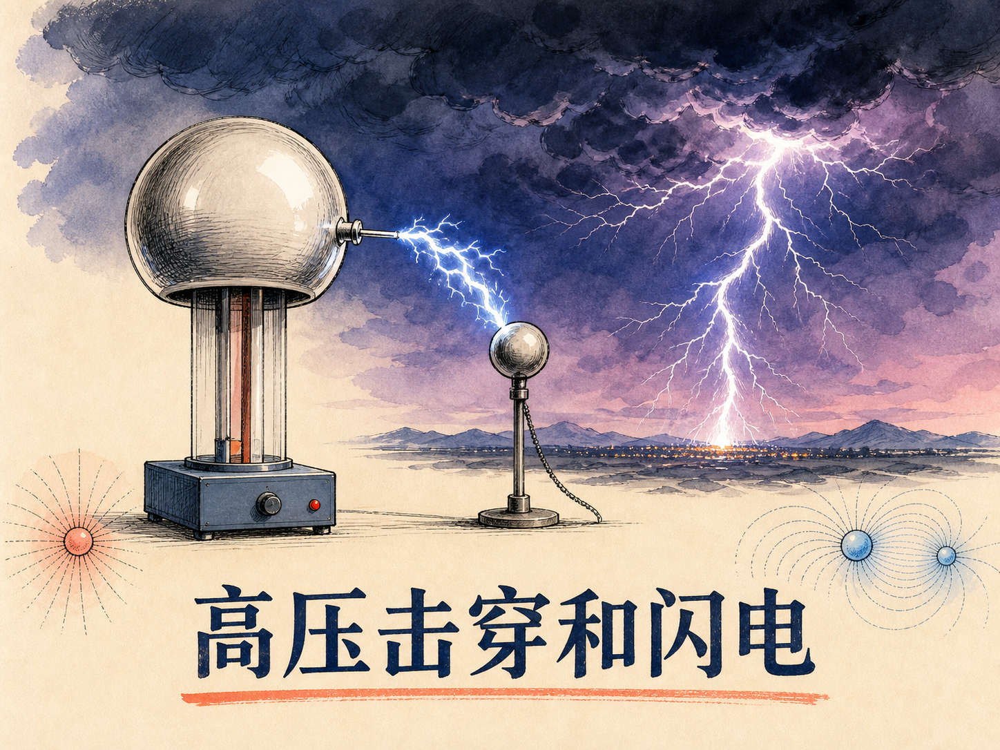
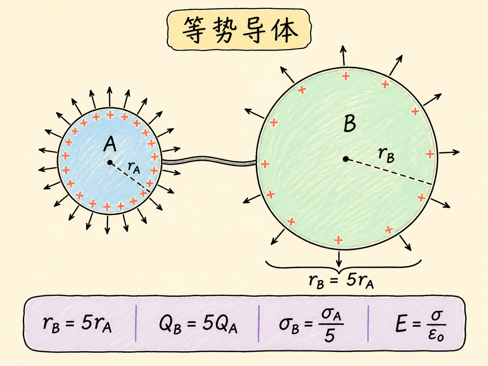
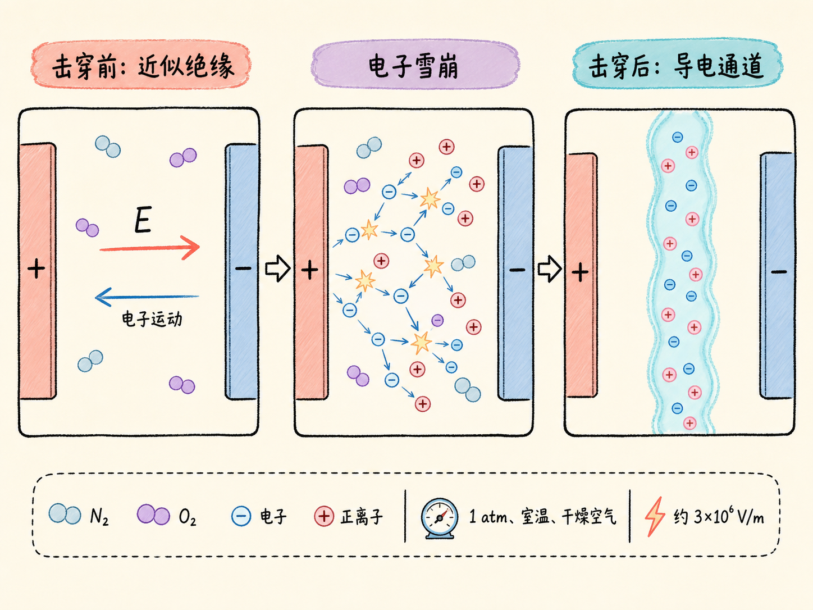
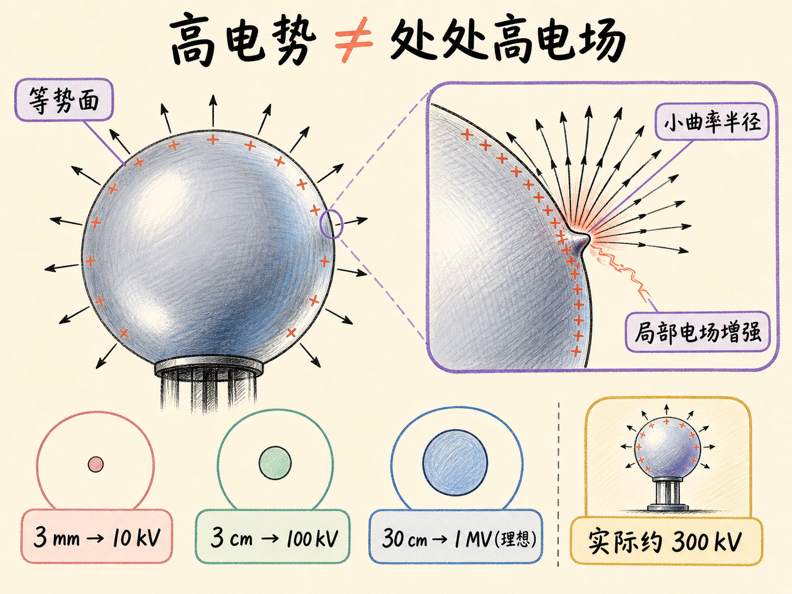
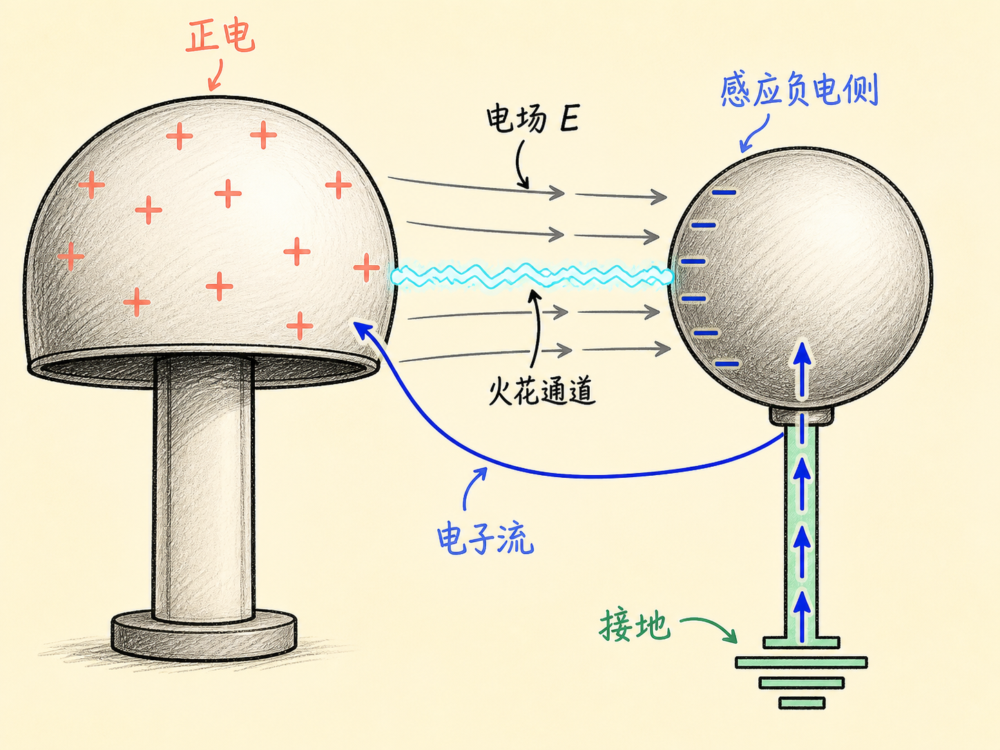
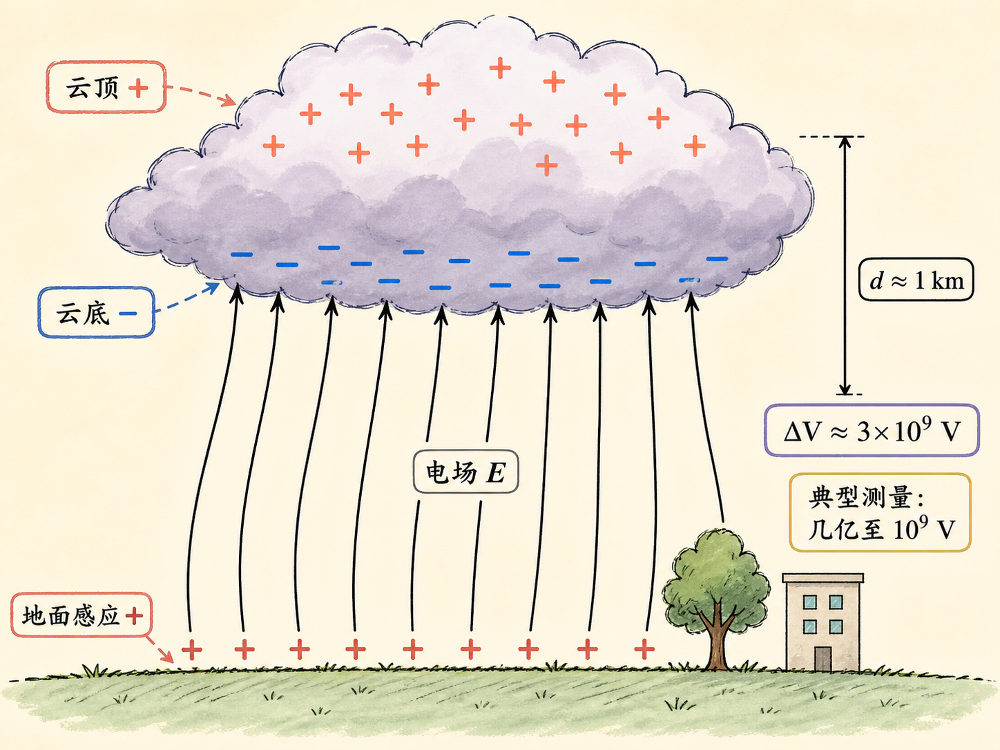
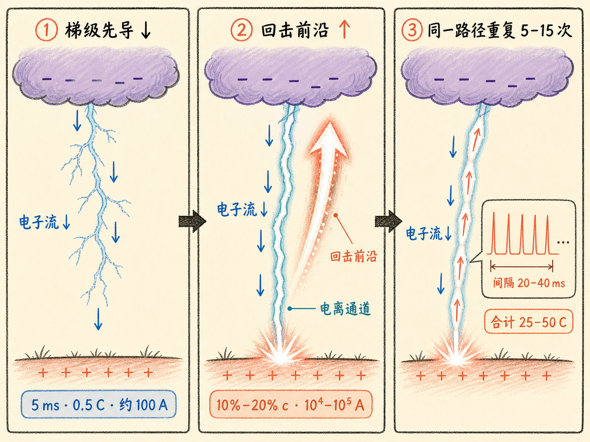
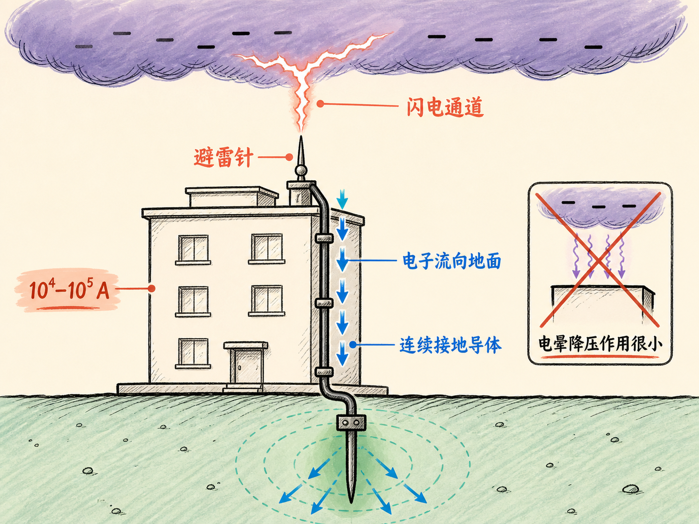
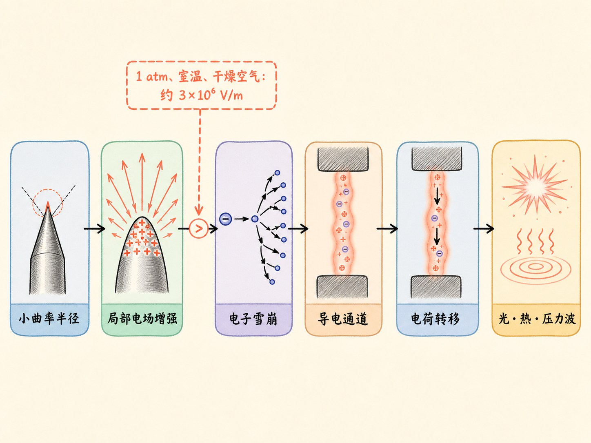

# 高压击穿和闪电

摸到门把手时，一道几毫米长的火花突然跳过空气。雷暴中，一道闪电跨越上千米，把云和地面暂时连成一条通道。两种现象的尺度相差巨大，起点却相同：空气原本近似绝缘，局部电场超过一定条件后，少量自由电子触发连锁电离，空气随即变成能导电的通道。

真正决定放电从哪里开始的，不只是“电压有多高”，而是空间中某个位置的电场有多强。一个整体等势的导体，表面各处的电场仍可以很不一样；尖端曲率半径小，电荷更集中，局部电场也更强，所以火花总爱从那里出现。

读完这篇，你会知道

- 为什么同一个等势导体的尖端更容易积累电荷并首先放电？
- 空气怎样从近似绝缘体变成导电通道？
- 为什么“高电势”不等于空间各处都有“高电场”？
- 一道闪电为什么往往由多次先导和回击组成？
- 避雷针有效的原因，为什么不同于富兰克林最初的设想？

## 等势，不等于表面电场处处相同

先看两个相隔很远、由导线连接的导体球 A 和 B。它们连成一个导体系统，因此电势相同。若半径分别为 $r_A$、$r_B$，电荷分别为 $Q_A$、$Q_B$，远距离近似下有

$V_A=\dfrac{Q_A}{4\pi\varepsilon_0r_A},\qquad V_B=\dfrac{Q_B}{4\pi\varepsilon_0r_B}$。

由于 $V_A=V_B$，所以

$\dfrac{Q_A}{r_A}=\dfrac{Q_B}{r_B}$。

假设 B 的半径是 A 的五倍，B 上的总电荷也是 A 的五倍。但球的面积与半径平方成正比，B 的表面积是 A 的二十五倍。面电荷密度 $\sigma=Q/(4\pi r^2)$，因此 B 的面电荷密度反而只有 A 的五分之一。

这个结果给出了一条直观规律：在同一个等势导体上，曲率半径越小的位置，面电荷密度越大。课堂上用一口带柄的金属锅做了定性演示。用小勺分别接触曲率半径较大的锅身和半径很小的锅柄，再把电荷带到验电器，锅柄位置能取走明显更多的电荷。只有理想球体凭借球对称性，电荷才会均匀分布。

面电荷密度为什么会决定放电？在静电平衡下，实心导体内部电场为零。让一个极薄的高斯小柱面跨过导体表面，外侧端面面积为 $A$。若表面带正电，电场垂直表面向外，穿过高斯面的电通量是 $EA$；柱面包围的电荷是 $\sigma A$。由高斯定律得到

$EA=\dfrac{\sigma A}{\varepsilon_0},\qquad E=\dfrac{\sigma}{\varepsilon_0}$。

因此，尖端的曲率半径小，局部面电荷密度高，紧邻表面的局部电场也强。导体整体处在同一电势，并不妨碍不同位置拥有不同的表面电场。

## 击穿不是空气一直导电，而是条件达到后发生转变

空气在击穿前近似绝缘。处在电场中的自由电子会加速，并与氮分子、氧分子碰撞。如果电子在两次碰撞之间获得的动能足以使分子电离，一次碰撞就能产生额外电子。新电子继续加速、碰撞和电离，电子数迅速增加，形成电子雪崩。

这一步改变了介质状态。击穿前，空气中没有足够的自由载流子来形成强电流；击穿后，大量电子和离子构成导电通道，电荷可以迅速转移。离子复合时发光，空气被加热并形成压力波，所以火花既能看见，也能听见。

可以用本讲给出的数值做一个数量级估算。在一个大气压、室温、干燥空气中，电子两次碰撞间的平均距离约为一微米，即 $10^{-6}$ 米。氧分子的电离能约为 12.5 电子伏特，氮分子约为 15 电子伏特。粗略取 10 电子伏特，就希望电子在一微米内跨越约 10 伏特的电势差：

$E\sim\dfrac{\Delta V}{\Delta x}=\dfrac{10}{10^{-6}}\approx10^7\ \mathrm{V/m}$。

实际测得的击穿场强更接近 $3\times10^6\ \mathrm{V/m}$。这两个数值并不完全相同，因为前者只是纸背估算。本讲采用的击穿条件是：一个大气压、室温、干燥空气中，空气大约在每米三百万伏特的电场下击穿。离开这些条件，这个数值不能被当成无条件常数。

## 高电压与高电场，中间还隔着空间尺度

在近似匀强电场中，$E\approx\Delta V/d$。两块平行板相差 300 伏特，若距离只有 0.1 毫米，电场就能达到约 $3\times10^6\ \mathrm{V/m}$。反过来，若门把手的火花跨越约 3 毫米，要达到同一量级的电场，人与门之间的电势差就需要达到约一万伏特量级。

但这仍不意味着“只要电势很高，空间各处电场都同样高”。电场由电势在空间中的变化决定，还受到几何形状影响。真实金属板不可能绝对平整，微小凸起的曲率半径更小，局部电场先达到击穿条件，所以实际放电往往比理想平板估算更早发生。

范德格拉夫起电机把“电势”和“局部电场”之间的区别表现得更清楚。对半径为 $r$、带电量为 $Q$ 的理想球体，球面电势和电场分别为

$V=\dfrac{Q}{4\pi\varepsilon_0r},\qquad E=\dfrac{Q}{4\pi\varepsilon_0r^2}$，

所以在球对称条件下 $V=Er$。若把表面击穿场强取为每米三百万伏特，半径 3 毫米的球大约只能达到 10 千伏，半径 3 厘米的球约能达到 100 千伏，半径 30 厘米的球理想极限约为 100 万伏。

课堂上的起电机半径约 0.3 米，但球面并不完美。微小尖锐缺陷会先使局部电场达到击穿条件，所以实际只能达到几十万伏，讲义取约 30 万伏。代入球体电势公式，球上最大电荷约为 10 微库仑。这里的限制来自球面局部电场，而不是一句笼统的“高电压会放电”。

## 火花如何在两个带电区域之间搭起通道

让一个接地小球靠近带正电的范德格拉夫球，静电感应会使小球靠近起电机的一侧带负电。电场线从正电荷出发，指向负电荷，因此从范德格拉夫球指向接地小球的负电侧，并垂直于两边的等势面。两球最接近的位置电场最强；距离足够近时，空气先在这里击穿，火花通道把两边短暂连接起来。

接地在这个演示里有明确作用：小球可以通过接地导体与大地交换电荷。对这里设定的正电起电机，电子从大地经接地导体进入小球，再跨过击穿通道流向正球；电场方向与电子运动相反，从正球指向小球的感应负电侧。放电通道跨过空气间隙，接地导体连接大地，两段共同构成电荷转移路径。

尖端还可能产生连续的电晕放电，而不是一个个分立火花。尖锐金属杆靠近起电机时，持续放电会不断排走电荷、降低起电机电势，装置内部原本的噼啪火花随之停止；移开尖端，电势重新升高，火花又出现。圣艾尔摩火、刷状放电和这里的电晕放电，指的都是这种从尖端出现的连续电荷流动。

## 从一米实验台到一千米雷云

本讲采用的雷云电荷分布是：云顶带正电，云底带负电。云底的负电荷通过静电感应，使下方地面带正电。因此，云地之间的电场线从正电的地面指向负电的云底。

若云底离地约 1 千米，并把云地之间近似成匀强电场，用每米三百万伏特估算，得到

$\Delta V\sim Ed=3\times10^6\times10^3=3\times10^9\ \mathrm{V}$。

也就是约 30 亿伏特。典型测量值为几亿到 10 亿伏特。差异并不意外：地面不是平板，树木和建筑物形成尖锐部位，使局部电场在更低的云地电势差下先达到击穿条件。

闪电开始时，电子从带负电的云底向地面推进，形成直径约 1 到 10 米的梯级先导。它以每秒约 100 英里的速度下降，大约 5 毫秒到达地面，并在这段时间内转移约 0.5 库仑电荷，对应约 100 安培电流。更重要的是，它留下了一条充满电子和离子的电离空气通道。

一旦先导到达地面，电子便能沿这条高导电通道迅速流向大地。最靠近地面的电子先进入地面，更高位置的电子随后依次下行。与此同时，最强发光和加热区域的传播前沿从地面向云端上移，这个向上传播的现象称为回击。需要把两件事分开：电子沿通道流向地面，而回击的可见传播方向从地面指向云端。

回击速度约为光速的 10% 到 20%，电流从 1 万安培到几十万安培，一次回击约交换 5 库仑电荷。强电流加热空气，离子复合产生强光，快速升温带来压力变化，于是形成雷声。

## 眼中的一道闪电，实际可能来回很多次

一次回击结束大约 20 毫秒后，新的梯级先导可能沿着已经电离、导电性更高的旧通道再次下降，随后又发生回击。这个过程可能重复 5 次、10 次，甚至 15 次。

相邻回击可以相隔 20、30 或 40 毫秒，五到十次回击在短至十分之一秒内完成，肉眼看起来仍像一道闪电。一次回击约交换 5 库仑电荷，多次回击合计可能交换 25 到 50 库仑。随着电荷转移，云地电势差下降；降到不足以维持过程后，放电停止。等待云重新充电 4 到 20 秒，下一道闪电才可能出现。

梯级先导发光较弱，回击才是闪电中最明亮的部分。旋转的 Boys 相机把不同时间的光迹展开，可以分辨同一道闪电中的多次回击，并由光迹测量传播时间和速度。帝国大厦遭雷击的记录显示，闪电击中最尖锐的顶部，同一次闪电里可以分辨出六七次回击。

## 避雷针为什么有效

富兰克林最初以为，尖锐避雷针会在云与建筑物之间持续产生电晕放电，降低电势差，从而阻止闪电。后来知道，这种持续放电对降低云地电势差的作用很小；避雷针也确实会成为闪电优先连接的尖锐位置。

避雷针仍然有效，是因为它提供了可承受巨大电流的导电路径。本讲给出的闪电电流范围是 1 万到 10 万安培。只要金属杆足够粗，电流就能沿避雷针进入大地，而不穿过建筑物。它并没有让雷云停止放电，而是把击中位置和接地电流路径限制在能够承受电流的导体上。

## 从局部电场开始复述整条链条

高压击穿和闪电可以用一条连续的因果链说明：导体几何形状改变面电荷密度；小曲率半径使局部面电荷密度和电场增强；在一个大气压、室温、干燥空气的近似条件下，局部电场达到每米三百万伏特量级后，电子碰撞触发雪崩电离；空气由近似绝缘转为形成导电通道；电荷沿通道迅速转移，并产生光、热和压力波。

所以，判断放电不能只问“电压有多高”。还必须问：电势在多大距离内变化？导体哪里最尖？局部电场是否达到当前空气条件下的击穿阈值？击穿之后，导电通道连接了哪些带电区域，电荷又沿什么路径转移？这几步连起来，几毫米火花、范德格拉夫起电机和跨越云地的闪电，才落在同一套物理图景里。
