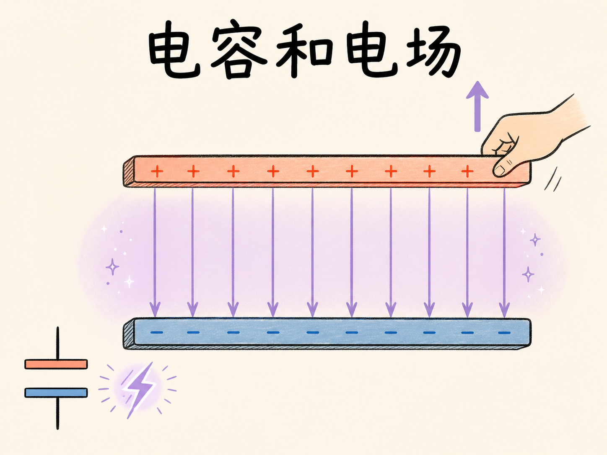
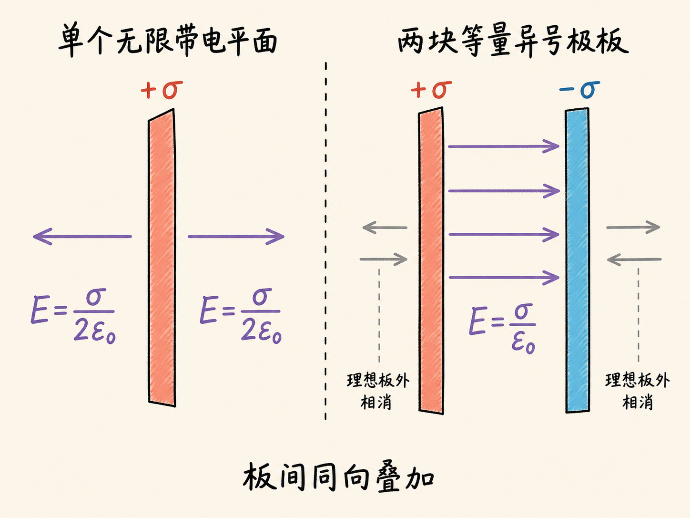
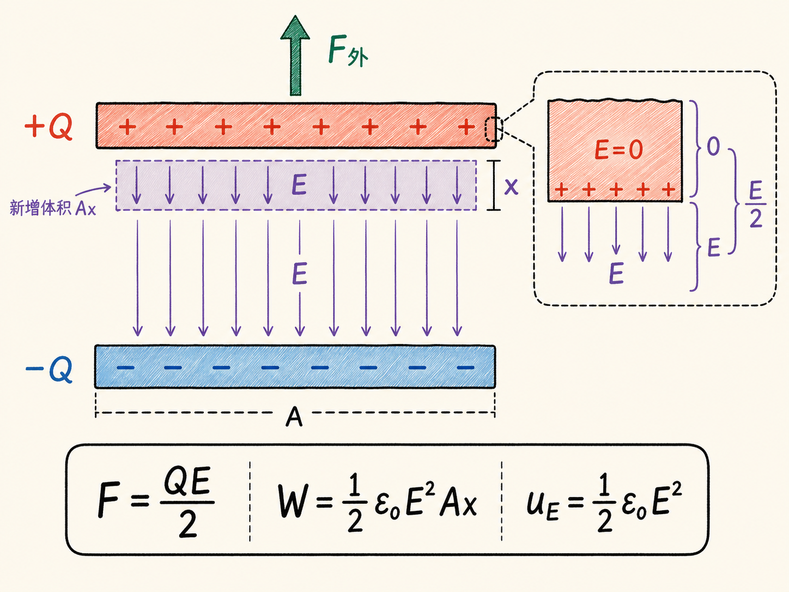
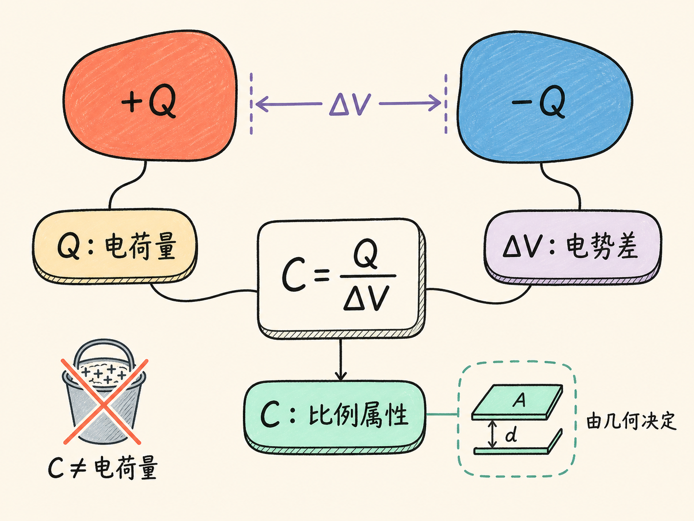
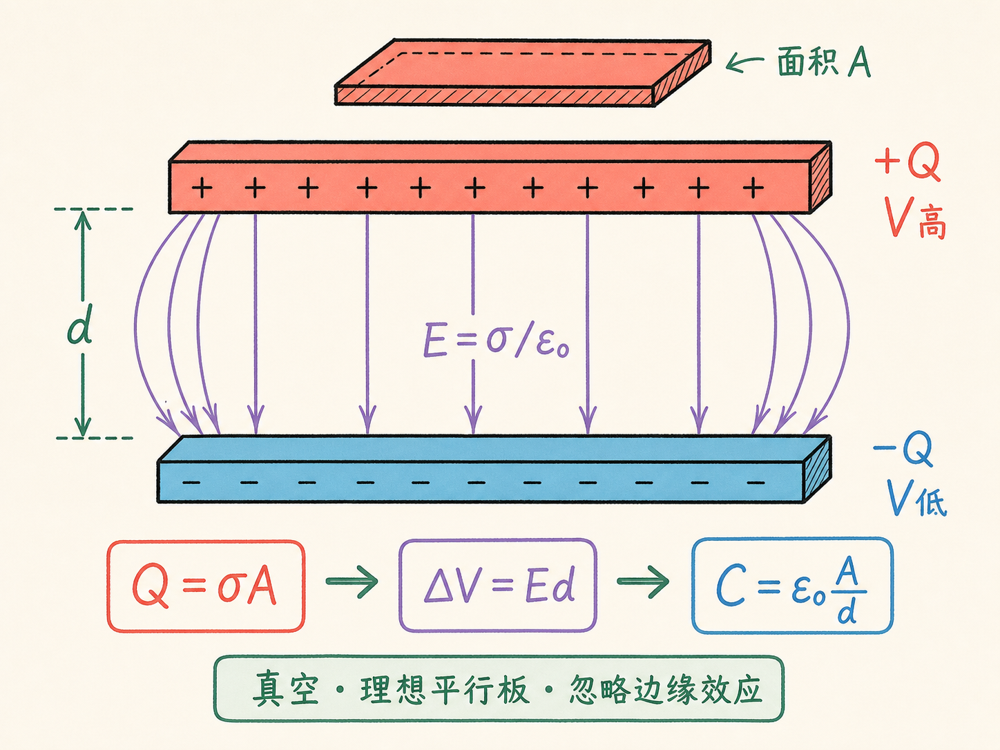
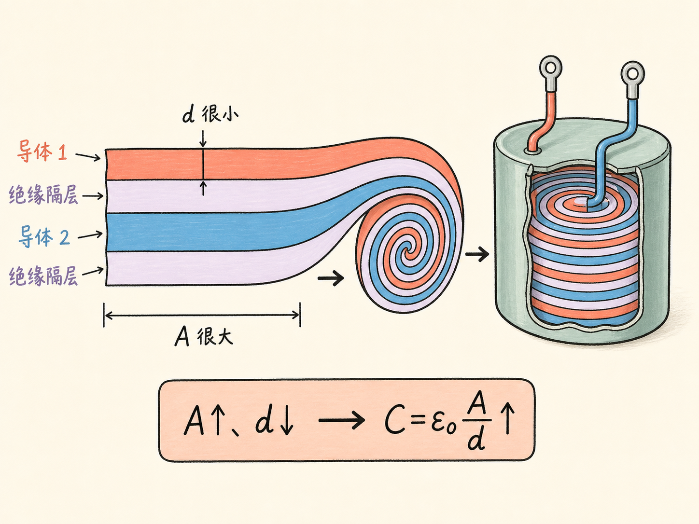
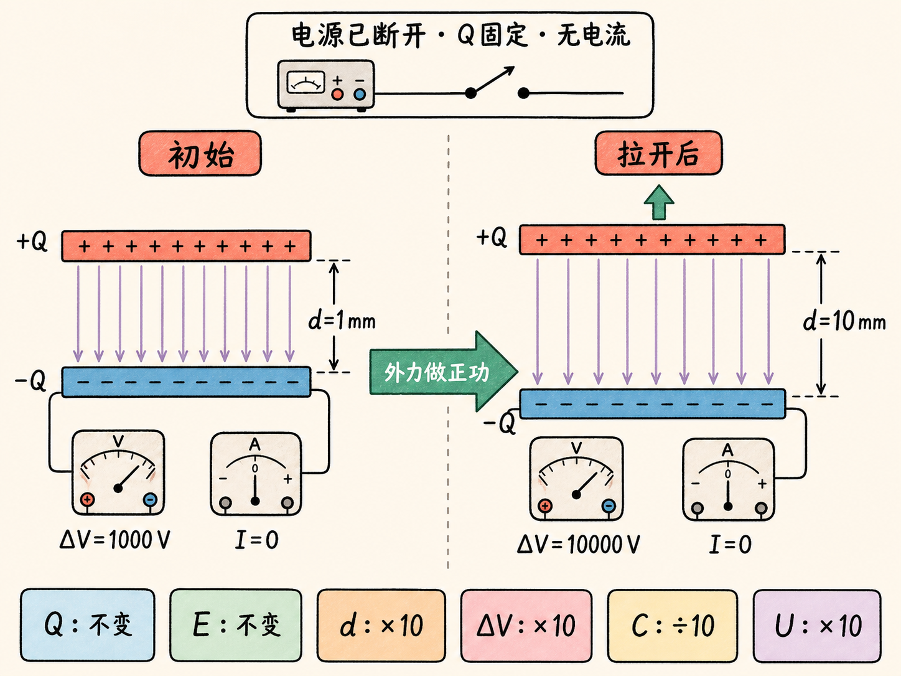
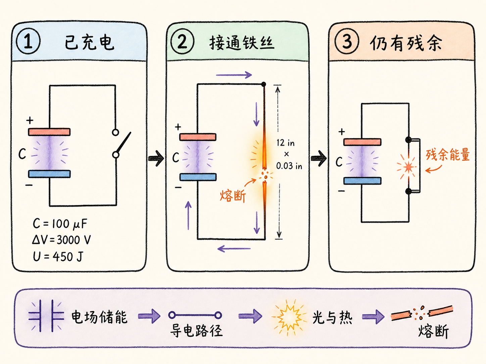
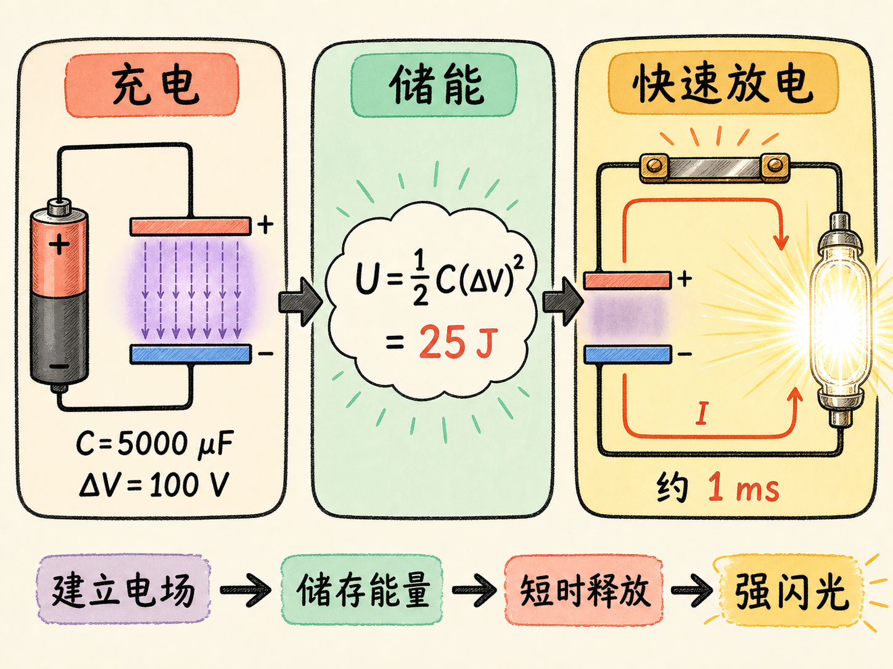

# 电容和电场

两块已经带电的平行金属板互相吸引。把它们拉开时，手上要用力；如果极板上的电荷没有流走，拉得越开，两板间的电势差反而越大。外力做的功去了哪里？最直接的回答是：原来没有电场的一段空间，现在有了电场，增加的能量就在这片电场中。

沿着这条线索，电场能量、电容和电容器储能会连成同一套物理关系。关键是始终分清三个量：$Q$ 是极板上的电荷量，$\Delta V$ 是两导体之间的电势差，$C=Q/\Delta V$ 是由导体组合与几何决定的电容。电容不是“储存了多少电荷”，而是在给定电势差下，系统能对应多少电荷的比例。

读完这篇，你会知道

- 为什么拉开两块带电极板需要做功，这些功怎样变成电场能量？
- 为什么极板受力不能直接写成板上电荷乘以两板之间的总电场？
- 电容 $C=Q/\Delta V$ 到底描述什么，为什么它主要由几何决定？
- 理想平行板电容器的 $C=\varepsilon_0A/d$ 怎样得到？
- 电容器为什么能在极短时间里释放足以产生强闪光或熔断铁丝的能量？

## 把做功摊到新出现的电场体积里

先取两块面积为 $A$ 的理想平行导体板，上板带 $+Q=+\sigma A$，下板带 $-Q=-\sigma A$，板间距为 $h$。忽略边缘效应时，两板之间的电场近似均匀，方向由正板指向负板，大小为

$E=\dfrac{\sigma}{\varepsilon_0}$。

这里容易混淆一个因子 2。单个无限带电平面在两侧各产生大小为 $\sigma/(2\varepsilon_0)$ 的场；两块等量异号极板的场在板间同向叠加，得到 $\sigma/\varepsilon_0$，在板外反向相消。板外场为零只属于理想无限大极板近似；有限极板仍有边缘场。

现在保持极板电荷不变，把上板再向上拉开距离 $x$。两板吸引，所以外力必须做正功。由于 $Q$、$A$ 和 $\sigma$ 都不变，板间场强 $E$ 也不变；变化的是电场所占的体积，它增加了 $Ax$。

计算受力时不能直接使用 $QE$，因为这里的 $E$ 是两块极板共同形成的板间总场，而一块极板不能把自身产生的电场当成推动自己的外场。作用于上板的外场只来自下板，大小为总板间场的一半。也可以像课堂推导那样，把极薄表面电荷层两侧的场取平均：导体内部静电平衡时 $E=0$，导体外侧是板间总场 $E$，平均值为 $E/2$。因此外力大小为

$F=\dfrac12QE$。

拉开距离 $x$ 所做的功是

$W=Fx=\dfrac12QEx=\dfrac12\sigma AEx=\dfrac12\varepsilon_0E^2Ax$。

$Ax$ 是新出现电场的体积，所以每单位体积增加的能量为

$u_E=\dfrac{W}{Ax}=\dfrac12\varepsilon_0E^2$。

这就是真空中的电场能量密度，单位是焦耳每立方米。对于一般电场分布，静电势能可以写成对全空间的积分

$U=\int_{\text{all space}}\dfrac12\varepsilon_0E^2\,d\tau$。

这里把体积元写成 $d\tau$，只是为了避免它与电势符号 $V$ 混淆。能量并没有换成另一种东西：计算组装电荷所需的功，或计算全空间电场的能量，得到的是同一份静电势能。

## 从电场能量得到 $U=\tfrac12Q\Delta V$

对刚才的理想平行板，板间电场均匀，板外场在无限板近似下相消，因此只有面积 $A$、间距 $h$ 的板间体积贡献能量：

$U=\dfrac12\varepsilon_0E^2Ah$。

又因为 $Q=\sigma A$、$E=\sigma/\varepsilon_0$，并且从负板到正板的电势升高量满足 $\Delta V=Eh$，可得

$U=\dfrac12Q\Delta V$。

方向和符号需要一起看：电场从正板指向负板，电势沿电场方向降低，所以正板电势高、负板电势低；若定义 $\Delta V=V_+-V_->0$，其大小就是 $Eh$。能量式中的 $Q$ 取任一极板电荷量的绝对值，因此 $U$ 为正。

## 电容不是电荷量，而是 $Q$ 与 $\Delta V$ 的比例

先看一个孤立导体球。半径为 $r$、带电量为 $Q$ 时，球面电势为

$V=\dfrac{Q}{4\pi\varepsilon_0r}$，

所以 $Q/V=4\pi\varepsilon_0r$。半径越大，同一电势下可以对应越多电荷。半径约 1 厘米的球，电容约为 1 皮法；半径约 30 厘米的范德格拉夫球约为 30 皮法；地球约为 700 微法。若要让孤立球达到 1 法拉，半径需要约 $9\times10^9$ 米。

但“一个物体的电容”并不总是公平的说法。假设正电球 B 附近放一个负电球 A。A 会吸引从无穷远带来的正试探电荷，使把试探电荷送到 B 附近所需的功减少，于是 B 所在位置的电势降低。B 的电荷量不变，$Q/V$ 却增大。也就是说，附近另一个导体会影响这个比例。

因此，对电容器更稳妥的定义是：两个导体带等量异号电荷 $+Q$ 与 $-Q$，这组导体的电容为

$C=\dfrac{Q}{\Delta V}$。

$Q$ 是任一导体上电荷量的绝对值，$\Delta V$ 是两导体电势差。单位是法拉，$1\,\mathrm F=1\,\mathrm C/\mathrm V$。定义告诉我们：在同样的电势差下，$C$ 越大，对应的 $Q$ 越大；它没有说电容本身就是电荷量。

## 平行板的几何怎样决定电容

回到两块面积为 $A$、间距为 $d$ 的理想平行板。忽略边缘效应并假设板间是真空时，单板电荷量为 $Q=\sigma A$，两板叠加后的板间场为 $E=\sigma/\varepsilon_0$，电势差大小为 $\Delta V=Ed$。代入定义：

$C=\dfrac{Q}{\Delta V}=\dfrac{\sigma A}{(\sigma/\varepsilon_0)d}=\dfrac{\varepsilon_0A}{d}$。

电荷量 $Q$ 在推导中约掉了。这正说明，在当前理想条件下，电容只由几何和 $\varepsilon_0$ 决定：面积 $A$ 越大，电容越大；间距 $d$ 越小，电容越大。改变 $Q$ 会同时改变 $\Delta V$，两者的比例保持为同一个 $C$。

数值能说明法拉是多大的单位。两条极板各长 25 米、宽 5 厘米，间距只有 0.01 毫米，这样庞大的平行板电容器仍只有约 1 微法。实际器件把两条很长的导体薄带夹着绝缘层卷进小外壳，看起来不长，内部却可能有许多米材料。若把间距再缩小一千倍，电容可增大到约 1000 微法。

课堂上还给出一个直观比较：若两手之间只有 10 毫伏电势差，拿着一个 1000 微法电容器时，$Q=C\Delta V$ 对应 10 微库仑电荷。这与大型范德格拉夫起电机击穿前的最大电荷量级相当。比较的是同一电势差下 $C$ 与 $Q$ 的关系，不是说“1000 微法”本身等于某个电荷量。

## 固定电荷拉开极板，电势差和能量一起上升

利用 $C=Q/\Delta V$，平行板的能量还可写成

$U=\dfrac12Q\Delta V=\dfrac12C(\Delta V)^2$。

课堂演示把两块极板先接到 1000 伏电源上充电，随后移走电源。移走电源很关键：此后电荷被困在极板上，$Q$ 不变，因而 $\sigma=Q/A$ 不变，板间场 $E=\sigma/\varepsilon_0$ 也不变。

接着把间距从 1 毫米增大到 10 毫米。因为 $\Delta V=Ed$，电势差从 1000 伏升到 10000 伏；与此同时 $C=\varepsilon_0A/d$ 降为原来的十分之一。电流表不再偏转，说明没有电荷流入或流出；电压表却持续上升。

能量增加同样清楚。在固定 $Q$ 条件下，$U=\tfrac12Q\Delta V$，所以电势差增大十倍，能量也增大十倍。增加的能量来自拉开极板的机械功，也等于新增电场体积里的能量。这个演示把“做功创建电场”直接显示在电压读数上。

## 储存得慢，释放得快

电容器的效果不仅取决于存了多少能量，也取决于能量在多长时间内释放。一个 $100\,\mu\mathrm F$ 电容器充到 3000 伏时，带电量和能量分别为

$Q=C\Delta V=0.3\,\mathrm C$，

$U=\dfrac12C(\Delta V)^2=450\,\mathrm J$。

课堂上给它充电约 15 分钟，再把能量通过一根长 12 英寸、直径 0.03 英寸的铁丝释放。铁丝发光并熔断，之后短接电容器仍出现火花，说明还有残余能量。

闪光灯把同一思路用于更短时间。一个总电容约 $1000\,\mu\mathrm F$ 的电容器组充到 100 伏，储能约 5 焦耳；升到 250 伏，能量约 30 焦耳；升到 337 伏，能量约 50 焦耳，足以在演示中打坏灯泡。能量按电压平方增长，所以电压增加并不大，能量却增长得更快。

另一台照相闪光灯使用约 $5000\,\mu\mathrm F$ 电容，充到 100 伏后储存 25 焦耳。若这些能量在约 1 毫秒内通过灯管释放，就会形成很亮的瞬时闪光。更短的微秒级闪光可以冻结子弹穿过灯泡、气球刚被刺破的瞬间；反复放电则形成频闪灯，可把周期运动分解成一连串可观察时刻。

这些演示从不同角度说的是同一件事：电容器先用电势差建立电场并储存能量，再在导电路径接通时把能量释放出去。亮光、灯泡破裂、铁丝熔断，都是能量在短时间内进入负载后的结果。

## 从几何到能量，把整条链条接起来

电容和电场的关系可以按一条因果链复述：两导体的几何形状与间距决定电容 $C$；给定电势差 $\Delta V$ 后，电荷量满足 $Q=C\Delta V$；这些电荷建立电场，真空中的能量密度为 $u_E=\tfrac12\varepsilon_0E^2$；对全空间积分得到总能量，也可写成 $U=\tfrac12Q\Delta V=\tfrac12C(\Delta V)^2$。

拉开已经断开电源的带电极板时，$Q$ 不变、$E$ 近似不变，但 $d$ 增大，因而 $\Delta V$ 与 $U$ 上升。手做的机械功没有消失，它变成了更大体积中的电场能量。反过来，接通灯泡或铁丝，电场建立时储存的能量又能在极短时间内释放。电容不是一只“装电荷的桶”，而是几何、带电量、电势差与电场能量之间的比例枢纽。
