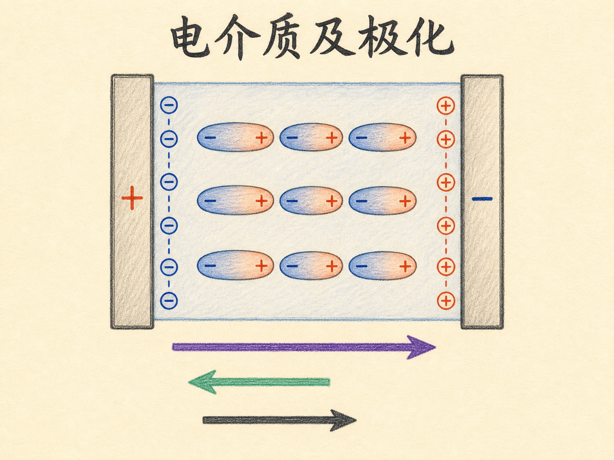
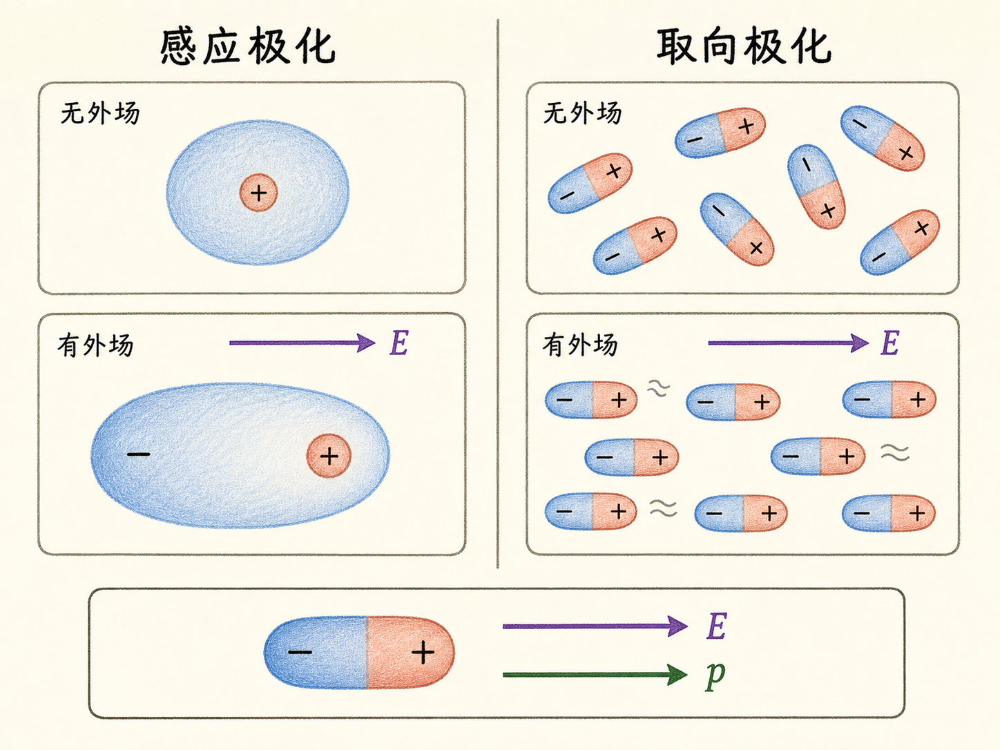
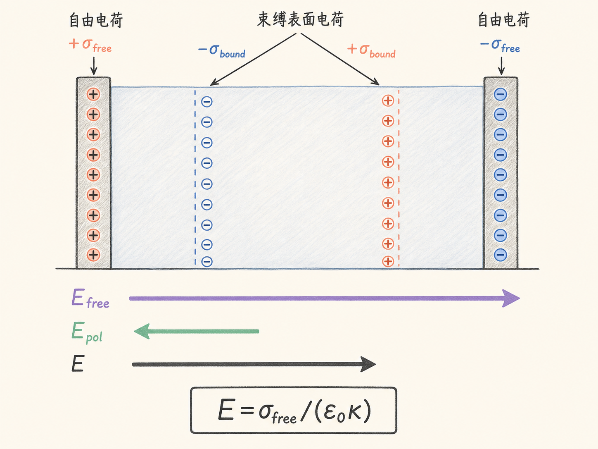
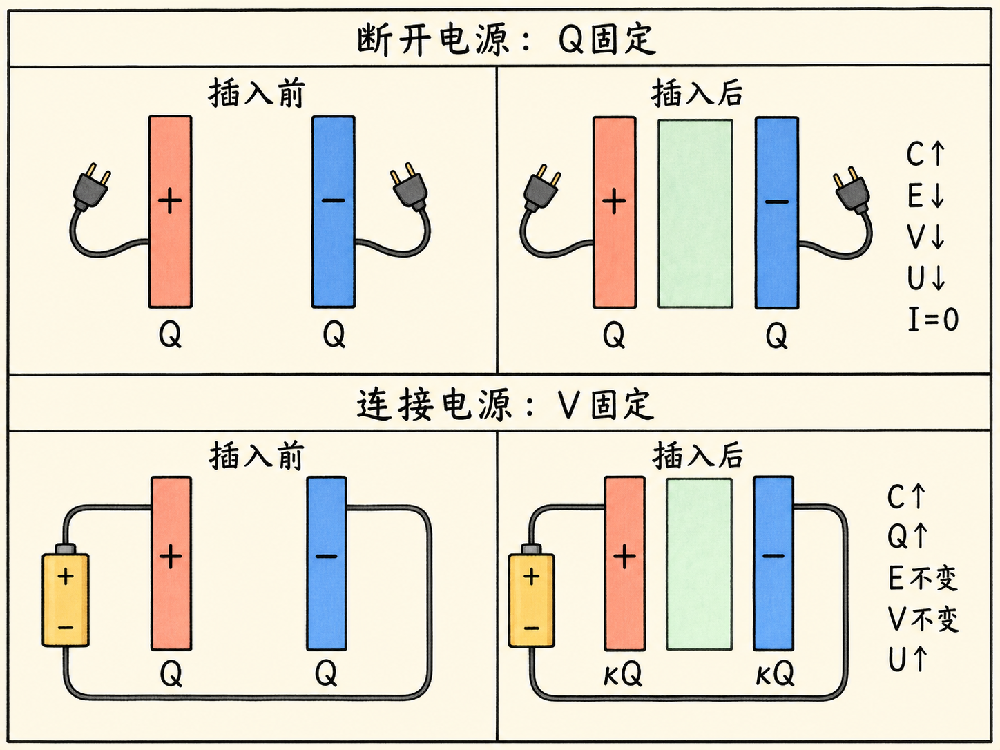
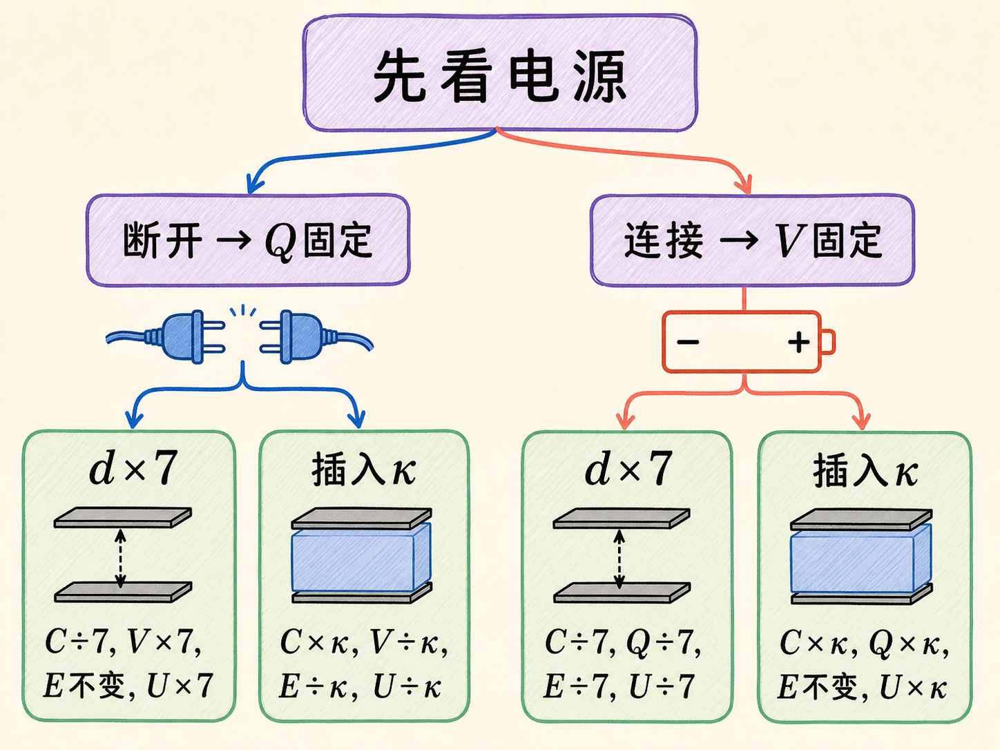
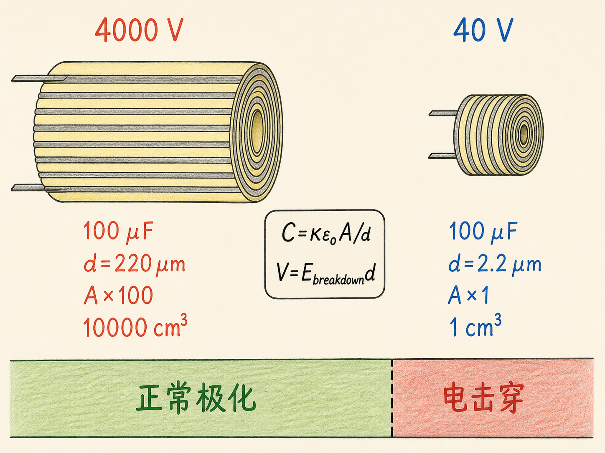
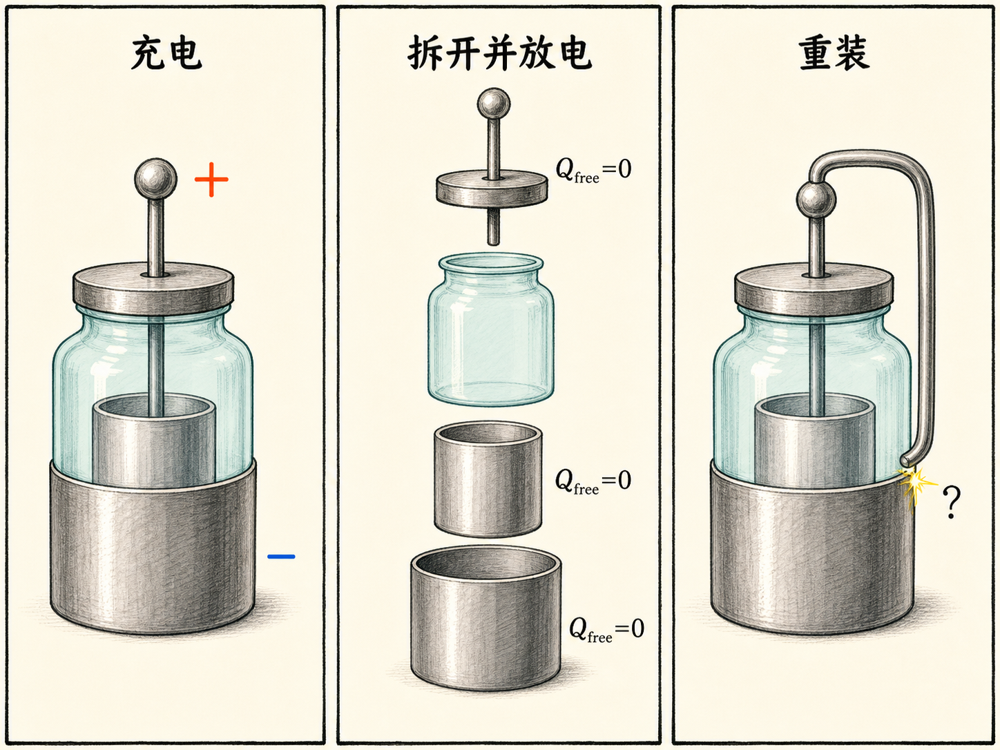
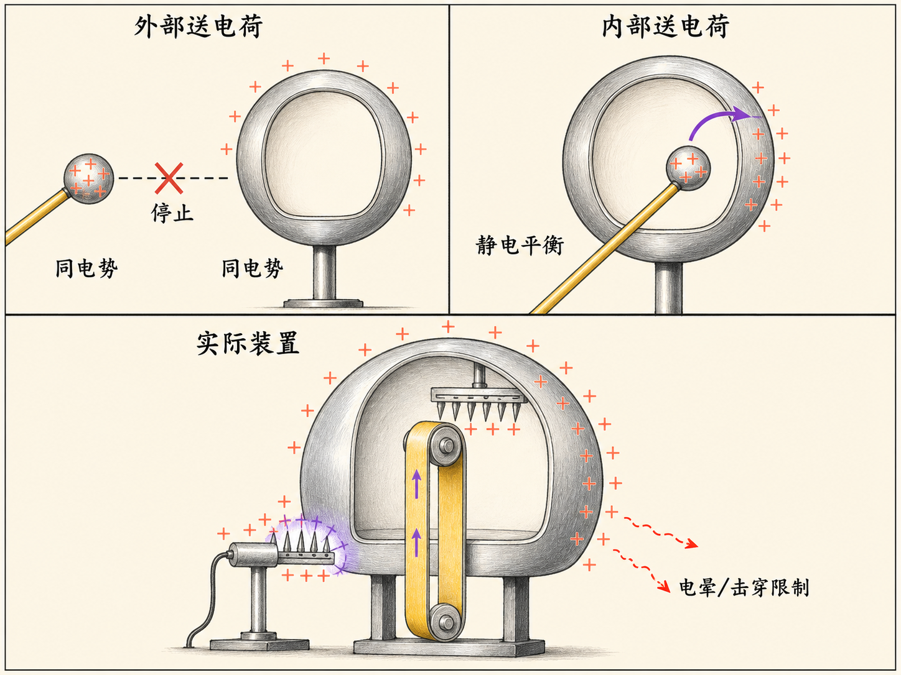

# 电介质及极化：先找不变量，再判断电容器

把一块玻璃插进平行板电容器，同一个动作会产生两种看起来相反的结果：断开电源时，电势差下降；保持电源连接时，电势差却不变，反而有更多电荷流上极板。

玻璃没有变，极板也没有变。决定结果的，是实验边界条件。只要先认清哪些量被固定，后面的变化就能从三条关系一步步推出。

读完这篇，你会知道

- 绝缘体中的极化怎样产生束缚表面电荷和反向电场
- 介电常数 $\kappa$ 为什么会让介质内部的合电场减弱
- 断开电源与连接电源时，插入电介质为何得到不同结果
- 怎样用 $E$、$V$、$C$ 三条关系冷静分析四个电容器演示
- 介电常数、击穿场强、介质厚度和电容器体积怎样相互制约

## 电子不能自由跑，但可以稍微偏一点

导体中的电子可以自由移动，绝缘体中的电子却束缚在原子或分子上。束缚并不等于纹丝不动。施加外电场后，电子云可以相对原子核发生很小的位移：电子更偏向一侧，使这一侧带少量负电，另一侧带少量正电。原本没有永久正负端的原子或分子，就这样被拉成了感应偶极子。

如果一整块介质都处在由上向下的外电场中，这种微小位移会在宏观上累积。介质顶部出现负的束缚表面电荷，底部出现正的束缚表面电荷。它们不是能够穿过介质持续流动的自由载流子，也不代表介质内部出现了自由传导电流；它们来自束缚电荷分布的改变。

由自由电荷建立的电场向下，由束缚表面电荷建立的极化场向上。两者方向相反，所以介质内部的合电场变弱。若把自由电荷产生的场记为 $\mathbf E_{\mathrm{free}}$，极化产生的场记为 $\mathbf E_{\mathrm{induced}}$，那么

$\mathbf E=\mathbf E_{\mathrm{free}}+\mathbf E_{\mathrm{induced}}$。

按图中方向只比较大小时，它变成

$E=E_{\mathrm{free}}-E_{\mathrm{induced}}$。

若感应电荷面密度满足 $\sigma_{\mathrm{induced}}=b\sigma_{\mathrm{free}}$，其中 $b<1$，那么 $E_{\mathrm{induced}}=bE_{\mathrm{free}}$，于是

$E=E_{\mathrm{free}}(1-b)$。

把 $1-b$ 定义为 $1/\kappa$，便得到

$E=\frac{E_{\mathrm{free}}}{\kappa}=\frac{\sigma_{\mathrm{free}}}{\varepsilon_0\kappa}$。

$\kappa$ 是无量纲的介电常数。真空中按定义 $\kappa=1$；气体通常只比 1 略大；这堂课给出的塑料约为 3、玻璃约为 5。

## 有些偶极子不是感应出来的

还有一些分子在没有外电场时就带有永久偶极矩。外电场会让这些偶极子沿电场方向取向，热运动则会破坏这种排列。电场越强，取向作用越明显；温度造成的无规则运动越强，整齐排列越难维持。

永久偶极子的作用通常比实验室普通条件下感应出的偶极子强，因此这类材料可能有更大的介电常数。课堂给出的例子是水：水的介电常数约为 80；零下 $40\ ^\circ\mathrm C$ 的冰可达到约 100。这里讨论的仍然是极化和取向，不是电介质发生击穿后的导电状态。

## 三条关系，先决定从哪一条下手

平行板间完全填入介电常数为 $\kappa$ 的介质，并忽略边缘效应时，课堂把分析压缩成三条关系：

$E=\frac{\sigma_{\mathrm{free}}}{\varepsilon_0\kappa}$，

$V=Ed$，

$C=\frac{Q_{\mathrm{free}}}{V}=\frac{\kappa\varepsilon_0A}{d}$。

第一条说明合电场由极板自由电荷、介质极化和几何共同决定。第二条把均匀场、极板间距和电势差连接起来。第三条既是电容的定义，也给出理想平行板电容器的几何关系。

高斯定律并没有因为介质出现而失效。若直接计算高斯面内的净电荷，必须同时计入自由电荷和束缚电荷；若只以自由电荷表达介质内的结果，$\kappa$ 就承担了极化的影响。两种说法不能混着用，否则会重复计算或漏掉束缚电荷。

公式本身不难，容易混淆的是边界条件。遇到极板移动、电介质插入或取出时，先问两个问题：电源是否连接？极板间距是否固定？先找出不变量，再选关系式。

## 四个演示：同一个装置，四组边界条件

### 演示一：断开电源，再把极板拉开

初始条件是 $V=1500\ \mathrm V$、$d=1\ \mathrm{mm}$。电容器充好电后断开电源，再把间距增大到 $7\ \mathrm{mm}$。

电源断开意味着 $Q_{\mathrm{free}}$ 被困在极板上。极板面积不变，所以 $\sigma_{\mathrm{free}}$ 不变；此时没有电介质，$E=\sigma_{\mathrm{free}}/\varepsilon_0$ 也不变。因为 $V=Ed$，$d$ 增大 7 倍，$V$ 便增大约 7 倍，达到接近 $10000\ \mathrm V$。电流表没有偏转，因为没有电荷流入或流出极板。

同时，$C=\varepsilon_0A/d$ 缩小为原来的七分之一。由本讲稍后使用的 $U=\tfrac12Q_{\mathrm{free}}V$ 可知，固定自由电荷时电势差升高，储能也随之增加。

### 演示二：电源仍断开，再插入玻璃

现在保持 $d=7\ \mathrm{mm}$，仍然不接电源，再把玻璃插进两板之间。$Q_{\mathrm{free}}$ 依旧不能改变，因此电流表没有动作。

玻璃的介电常数约为 5，合电场缩小为原来的 $1/\kappa$。间距不变，所以 $V=Ed$ 告诉我们，电势差也缩小为原来的 $1/\kappa$。实验中叶片式静电电压表的偏转明显变小；取出玻璃后，电势差又恢复。

由于 $C=Q_{\mathrm{free}}/V$，固定 $Q_{\mathrm{free}}$ 时 $V$ 缩小为原来的 $1/\kappa$，电容便增大为原来的 $\kappa$ 倍。若再用 $U=\tfrac12Q_{\mathrm{free}}V$ 检查能量，储能会缩小为原来的 $1/\kappa$。正常极化使场和电势差下降，不等于玻璃内部出现自由传导电流。

### 演示三：电源保持连接，再把极板拉开

第三次从 $V=1500\ \mathrm V$、$d=1\ \mathrm{mm}$ 开始，但电源始终连接。把间距增大到 $7\ \mathrm{mm}$ 时，电源把 $V$ 固定在 $1500\ \mathrm V$。

根据 $V=Ed$，$d$ 增大 7 倍，$E$ 必须缩小为原来的七分之一。根据 $C=\varepsilon_0A/d$，$C$ 也缩小为原来的七分之一。最后由 $Q_{\mathrm{free}}=CV$，自由电荷同样缩小为原来的七分之一，多余电荷从极板流回电源，所以电流表向与充电时相反的方向偏转。

此时 $U=\tfrac12CV^2$ 也缩小为原来的七分之一。这里没有插入电介质，变化完全来自固定电压条件下的极板间距改变。

### 演示四：电源保持连接，再插入玻璃

最后保持 $V=1500\ \mathrm V$、$d=7\ \mathrm{mm}$，电源仍然连接，再插入玻璃。电势差和间距都不变，所以由 $V=Ed$，合电场 $E$ 也不能改变。

这听起来像是与极化减弱电场矛盾，其实没有。玻璃仍会极化，束缚表面电荷仍会建立反向电场。为了在这个反向场出现后仍维持相同的合电场，电源必须向极板补充更多自由电荷。电容增大为原来的 $\kappa$ 倍，$Q_{\mathrm{free}}=CV$ 也增大为原来的 $\kappa$ 倍。插入玻璃的一瞬间，电流表显示电荷流向极板；取出玻璃时，电荷反向流走。

由 $U=\tfrac12CV^2$ 可知，固定电压时电容增大，电容器储能也增大。增加的自由电荷来自仍然连接的电源，所以不能把这个过程误当成孤立电容器。$C$ 增大是两种边界条件的共同结果，但 $Q$、$V$、$E$ 和 $U$ 并不会在两种情况下都朝同一方向变化。

## 把四种情况放在一张表里

| 操作 | 固定量 | $C$ | $Q_{\mathrm{free}}$ | $V$ | $E$ | $U$ |
| --- | --- | --- | --- | --- | --- | --- |
| 断电后，$d$ 增大 7 倍 | $Q_{\mathrm{free}}$ | 变为 $1/7$ | 不变 | 变为 7 倍 | 不变 | 变为 7 倍 |
| 断电后，插入介质 | $Q_{\mathrm{free}},d$ | 变为 $\kappa$ 倍 | 不变 | 变为 $1/\kappa$ | 变为 $1/\kappa$ | 变为 $1/\kappa$ |
| 接电后，$d$ 增大 7 倍 | $V$ | 变为 $1/7$ | 变为 $1/7$ | 不变 | 变为 $1/7$ | 变为 $1/7$ |
| 接电后，插入介质 | $V,d$ | 变为 $\kappa$ 倍 | 变为 $\kappa$ 倍 | 不变 | 不变 | 变为 $\kappa$ 倍 |

这张表不是用来背的。它只是把分析顺序固定下来：先看电源连接状态，再找固定量，最后从三条关系逐项推出其余变量。

## 想要大电容，还要过击穿这一关

$C=\kappa\varepsilon_0A/d$ 看起来给出三个直接办法：选更大的 $\kappa$，增大极板面积 $A$，减小介质厚度 $d$。但 $d$ 不能无限减小。电场超过介质的击穿场强后，会出现火花或导电通道，那已经不是前面讨论的正常极化条件。

本讲给出的空气击穿场强约为 $3\times10^6\ \mathrm{V/m}$。水虽然有约 80 的高介电常数，击穿场强却很低。聚乙烯的 $\kappa$ 约为 3，击穿场强约为 $18\times10^6\ \mathrm{V/m}$，因此常被用作电容器介质。

课堂比较了两个同为 $100\ \mu\mathrm F$ 的聚乙烯介质电容器，一个额定 $4000\ \mathrm V$，另一个额定 $40\ \mathrm V$。由 $V=Ed$，高压电容器的介质最小厚度约为 $220\ \mu\mathrm m$，低压电容器则约为 $2.2\ \mu\mathrm m$，相差 100 倍。

两者的 $C$、$\kappa$ 和 $\varepsilon_0$ 相同，所以 $A/d$ 必须相同。高压电容器的 $d$ 大 100 倍，$A$ 也必须大 100 倍。忽略导体本身厚度，体积近似与 $Ad$ 成正比，于是高压电容器的体积会大约 $10000$ 倍。课堂展示的大电容约为 $10000\ \mathrm{cm}^3$，而 $40\ \mathrm V$ 的小电容可以只有约 $1\ \mathrm{cm}^3$。

## 莱顿瓶留下了一个没有当场解答的谜题

莱顿瓶由玻璃瓶以及玻璃内外两层导体组成，本质上是一个以玻璃为介质的电容器。实验先给它充电，再把内导体、玻璃和外导体拆开，把两块导体上的自由电荷彻底去掉，然后重新组装。

若只看 $U=\tfrac12Q_{\mathrm{free}}V$，自由电荷已经去掉，似乎不应再有电势差和能量。但重新组装后短接内外导体，实验却产生了一个很大的火花。课堂没有在这里直接给出解释，而是把问题留到后面的课程：拆开并放掉导体自由电荷后，为什么重新组装仍然出现很大的电势差？

## 范德格拉夫起电机为什么要从内部送电荷

如果用一个只有几千伏的小导体球，反复把电荷送到中空金属球壳外表面，球壳电势很快会追上小球。两者电势相同后，不再有电势差，也就不能继续转移电荷，球壳只能停在几千伏附近。

改变位置就能突破这个限制。把带电小球送进处于静电平衡的中空导体内部，再让它接触内壁，电荷最终会转移到外表面。把电荷搬入内部的过程做了正功，而导体自身的自由电荷不会在空腔内建立阻止搬运的静电场。反复“送入内部—接触内壁”，球壳电势就能继续升高。

真实的范德格拉夫起电机用电机驱动绝缘带：下方尖端通过电晕放电把电荷送上皮带，皮带把电荷运到金属罩内部，上方尖端再取走电荷并交给罩体。电势最终仍有上限；一旦空气发生电晕放电或击穿，新增电荷会泄漏，电势不再升高。

课堂用油漆罐做了缩小版演示。只向外表面送电荷时，电势在约 $3000$ 至 $4000\ \mathrm V$ 附近停滞；改为从内部送入后，它越过 $5000$、$10000$、$20000\ \mathrm V$，最后接近 $30000\ \mathrm V$，直到电晕放电限制继续升高。

## 最后只记住一个分析动作

极化的微观起点，是束缚电子或永久偶极子的微小重排；宏观结果，是介质表面出现束缚电荷并建立反向电场。介电常数 $\kappa$ 把这种作用写进了场强和电容关系。

但只知道“插入电介质会让电容增大”还不够。电源断开时，自由电荷固定；电源连接时，电势差固定。先找不变量，再用 $E=\sigma_{\mathrm{free}}/(\varepsilon_0\kappa)$、$V=Ed$、$C=Q_{\mathrm{free}}/V$ 推下去，四个演示就不再需要依赖直觉。
