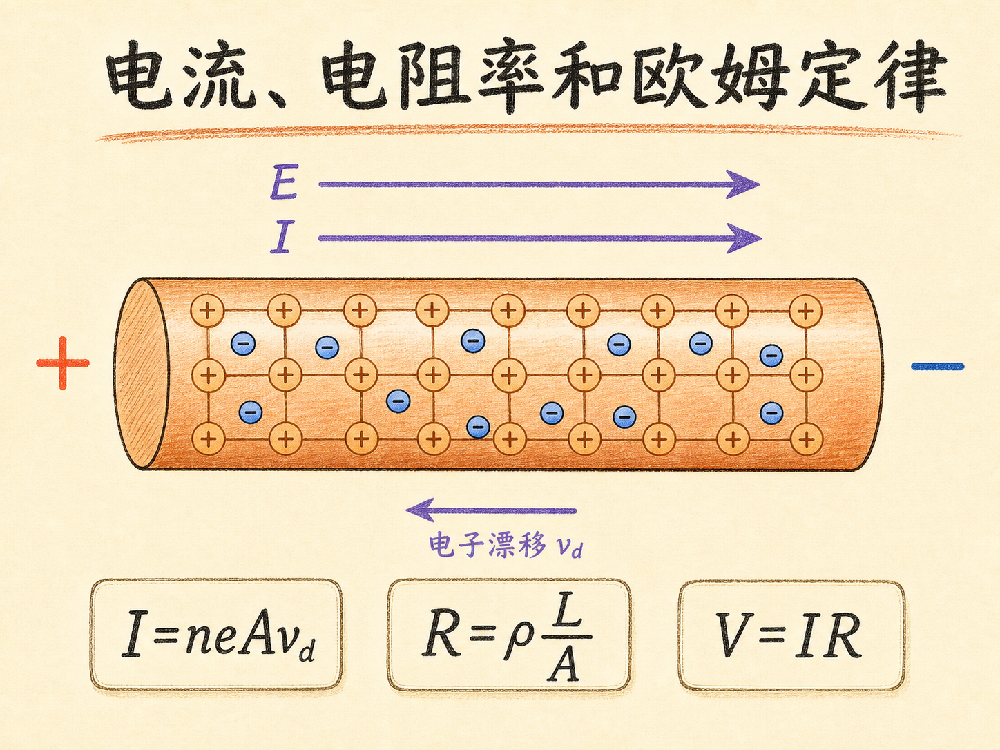
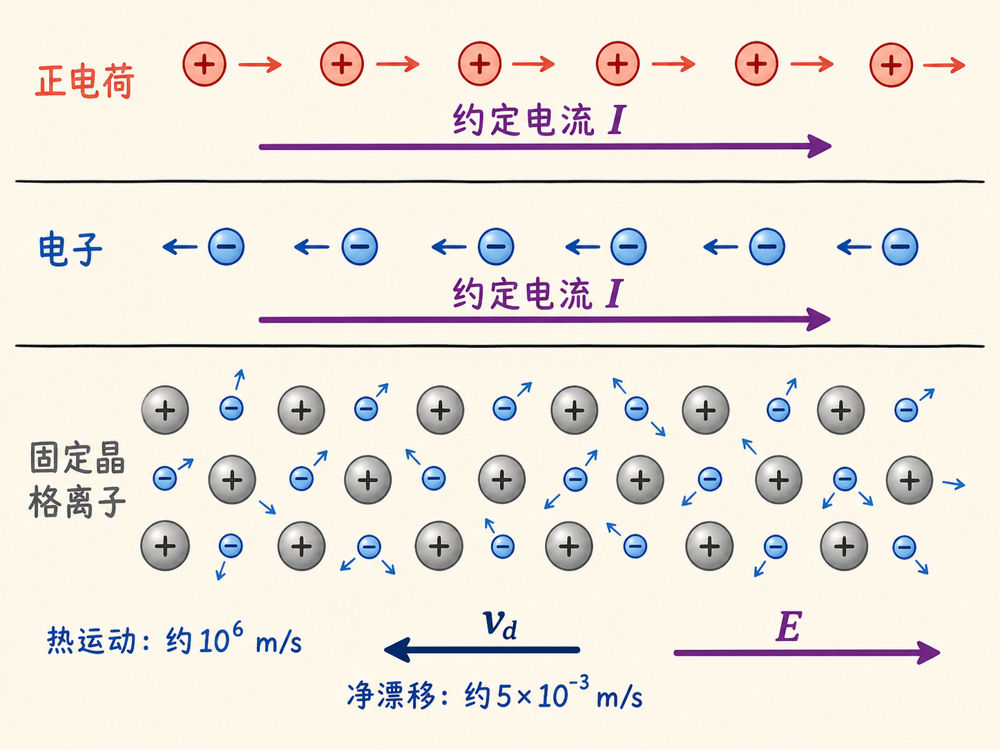
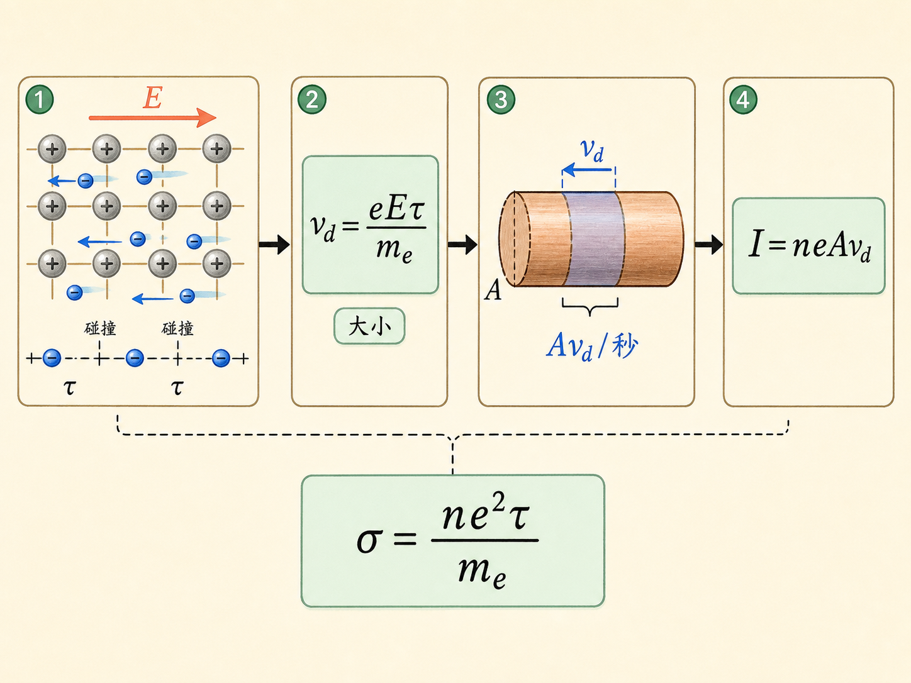
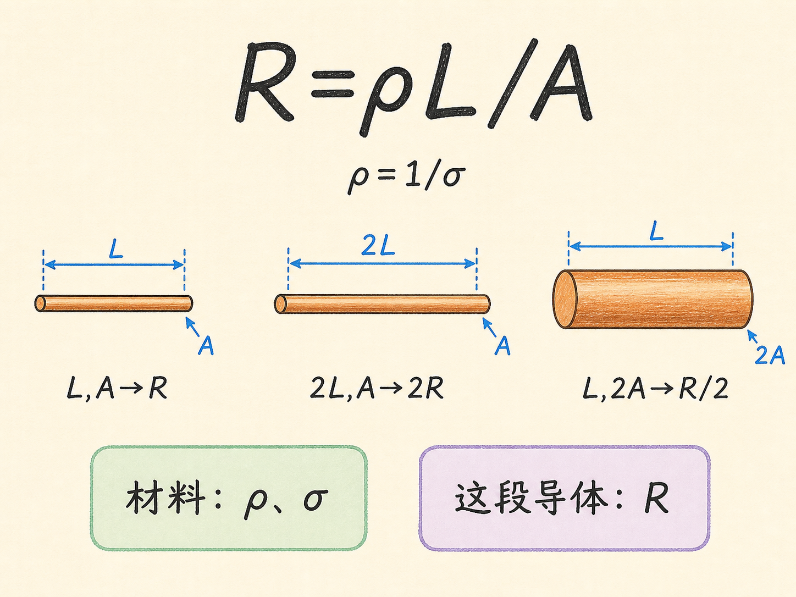
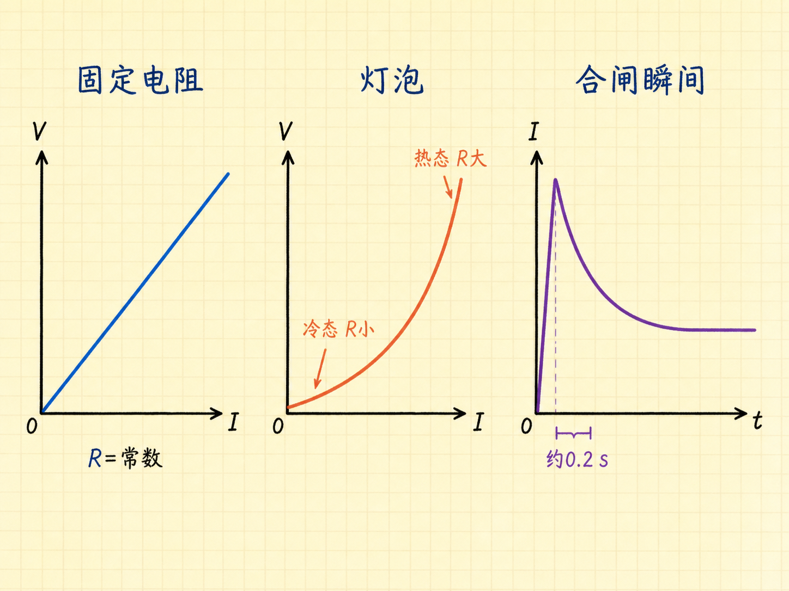
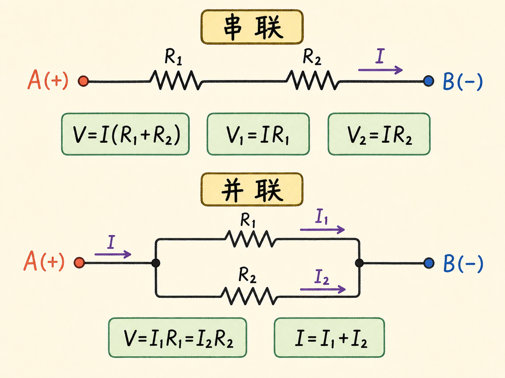
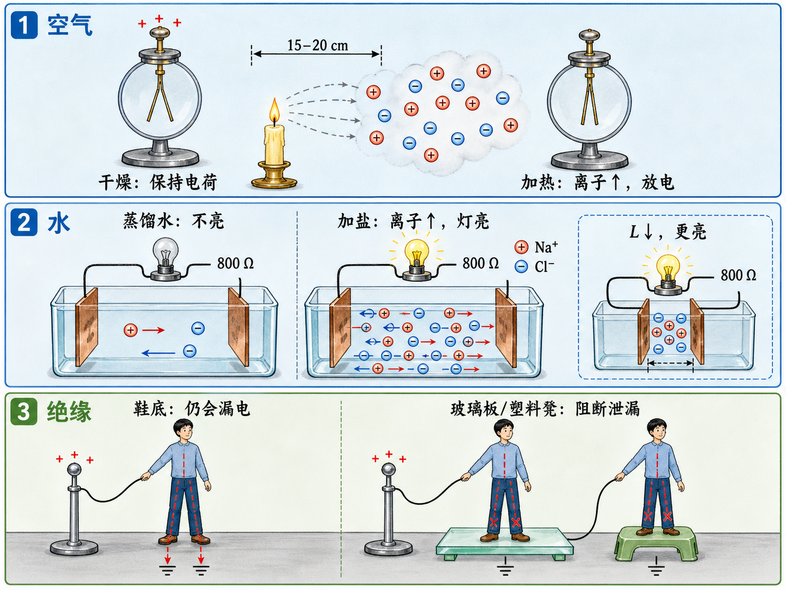

# 电流、电阻率和欧姆定律

一只普通电阻接上逐渐升高的电压，电流会沿直线增加；换成一只小灯泡，曲线却弯了。刚通电时，灯泡甚至会出现一个很高的电流峰值，随后才回落。两个元件都能“让电流通过”，为什么表现不同？

答案不能只靠一句 $V=IR$。我们得先弄清电流到底是什么，电子怎样在导体里移动，电阻由什么决定，以及什么时候 $R$ 才真的可以看成常数。

读完这篇，你会知道

- 为什么约定电流方向与金属中电子的漂移方向相反？
- 电子热运动极快，为什么沿导线的漂移却慢得像蜗牛？
- 电阻 $R$ 与电阻率 $\rho$ 有什么区别，导线的长度和截面积怎样进入公式？
- 为什么固定电阻可以满足欧姆定律，白炽灯泡却会偏离直线？
- 空气、蒸馏水和鞋底看似绝缘，为什么仍可能让电荷流失？

## 电流方向是一条约定

先把方向说清楚。正电荷向哪边移动，我们就把电流方向定义在哪边；负电荷向哪边移动，约定电流方向则在它的反方向。这不是在判断哪一种载流子真实存在，而是在统一记账方式。

金属导体里，能够穿过晶格移动的是自由电子，正离子则被束缚在固体晶格中。因此，金属中的实际载流子是带负电的电子：导线内的电场指向约定电流方向，电子受到的力与电场相反，于是电子漂移方向也与约定电流相反。

这里还有一个容易被静电知识误导的地方。导体两端只要持续维持电势差，导体内部就要保留一个电场来驱动电子。电子确实会移动并试图削弱这个场，但外部持续维持的电势差使它们不能把场完全消掉。因此，稳恒电流中的导体内部电场通常不是零；“导体内部电场为零”说的是静电平衡，不是正在通电的导线。

## 一百万米每秒，为什么还走得这么慢

室温约 300 K 时，铜中的自由电子作无规则热运动，平均速率约为 $10^6\ \mathrm{m/s}$。这个数字非常大，但运动方向杂乱，向各个方向的贡献彼此抵消，所以它并不直接形成稳定的宏观电流。

电子在运动中不断与晶格中的原子碰撞。两次碰撞之间的平均时间记作 $\tau$，室温铜中大约是 $3\times10^{-14}\ \mathrm s$。给导线施加电势差后，内部电场为电子增加一个很小的定向运动。只看大小，电子受力为 $eE$，加速度为

$a=\frac{eE}{m_e}$。

一次碰撞前，电子被加速的平均时间约为 $\tau$，因此漂移速度的大小是

$v_d=a\tau=\frac{eE\tau}{m_e}$。

公式中的 $v_d$ 只表示大小。对金属里的电子，它的实际方向与电场、也与约定电流方向相反。电场越强，$v_d$ 越大；平均碰撞间隔越长，电子持续加速的时间越久，$v_d$ 也越大。

把数值放进去会看到两种速度之间巨大的反差。10 m 长的铜线两端加 10 V，导体内部电场约为 $1\ \mathrm{V/m}$，电子漂移速度约为 $5\times10^{-3}\ \mathrm{m/s}$，也就是每秒半厘米。热运动速率约为每秒一百万米，定向漂移却只有每秒半厘米。照这个速度，一批电子沿 10 m 导线漂移完要约半小时。

## 从漂移速度到电流

设导线横截面积为 $A$，自由电子数密度为 $n$。一秒内，参与定向漂移的电子扫过长度 $v_d$，对应一个体积为 $Av_d$ 的柱体。这个体积中的电子数为 $nAv_d$，每个电子的电荷量大小为 $e$，所以电流大小是

$I=neAv_d$。

这里的 $I$ 是每秒穿过整个截面的电荷量，而不是电子的速度。截面积越大，同一时间能穿过截面的载流子越多；数密度越大，可参与输运的载流子也越多。方向仍按约定电流记，和电子漂移相反。

把 $v_d=eE\tau/m_e$ 代入，得到

$I=\frac{ne^2\tau}{m_e}AE$。

在给定温度下，$n$、$e$、$\tau$ 和 $m_e$ 中与材料输运有关的组合写成

$\sigma=\frac{ne^2\tau}{m_e}$，

$\sigma$ 称为电导率。于是电流关系变成 $I=\sigma AE$。这不是凭空写下的一条比例式，而是把载流子数、每次碰撞前的加速、导线截面积和内部电场连在了一起。

## 电阻率属于材料，电阻还取决于形状

均匀导线长为 $L$，两端电势差为 $V$ 时，内部电场大小近似为 $E=V/L$。代入上式：

$I=\sigma A\frac{V}{L}$，

整理后得到

$V=\frac{L}{\sigma A}I$。

把比例系数定义为电阻 $R$，再定义电阻率 $\rho=1/\sigma$，就有

$V=IR$，

$R=\frac{L}{\sigma A}=\rho\frac{L}{A}$。

现在可以清楚地区分三个量。$\sigma$ 是材料的电导率，越大表示越容易导电；$\rho$ 是材料的电阻率，和 $\sigma$ 互为倒数；$R$ 是这一段具体导体的电阻，不仅取决于材料，还取决于长度 $L$ 与横截面积 $A$。

电阻 $R$ 的单位是欧姆，即 $\mathrm V/\mathrm A$。由 $R=\rho L/A$ 可知，电阻率 $\rho$ 的单位是 $\Omega\cdot\mathrm m$。长度加倍，相当于载流子要通过更长的路径，电阻加倍；截面积加倍，相当于可供电流通过的通道变宽，电阻减半。这个几何关系只针对材料均匀、截面一致的这段导体。

材料之间的差别可以大到惊人。对一根长 1 m、截面积 $10^{-6}\ \mathrm{m^2}$ 的试样，若材料是电阻率约 $10^{-8}\ \Omega\cdot\mathrm m$ 的优良导体，电阻约为 $10^{-2}\ \Omega$；若材料是电阻率约 $10^{14}\ \Omega\cdot\mathrm m$ 的优良绝缘体，电阻可达 $10^{20}\ \Omega$。相同尺寸下，两者相差 22 个数量级。

## 欧姆定律说的是“比例不变”

$V=IR$ 看起来简单，但要称为欧姆定律，关键不是某一时刻能不能把 $V/I$ 算成一个数，而是改变电压和电流时，这个比值是否保持常数。若 $R$ 不变，电压加倍，电流也加倍，$V$—$I$ 图像就是一条直线。

课堂上的 $50\ \Omega$ 电阻正是这种情况：电压从 0 V 升到 4 V，电流从 0 升到约 $0.08\ \mathrm A$，示波器上得到近似直线。此时把 $R$ 视为常数是可行的。

灯泡则不同。金属灯丝温度升高时，电子碰撞更加频繁，平均碰撞间隔 $\tau$ 变短；电导率 $\sigma$ 下降，电阻率 $\rho$ 上升，灯丝电阻随之增加。而灯丝温度本身又受电流影响，于是 $R$ 成了电流状态的函数，$V/I$ 不再保持常数。

一只小灯泡冷态电阻约为 $7\ \Omega$，热态接近 $50\ \Omega$。电压升高时，它的 $V$—$I$ 曲线会因灯丝升温而弯折。另一只灯泡接到 125 V 电源时，冷态电阻约为 $25\ \Omega$，热态约为 $250\ \Omega$。刚合闸的瞬间，电流会冲得很高；约 0.2 s 内灯丝升温、电阻增大，电流便回落到低得多的稳定水平。

这也说明“电阻随温度改变”为什么不只是换一个 $R$ 数值那么简单：当温度又由电流改变时，电流与电阻互相影响，线性比例关系已经失效。灯丝电阻随温度上升还有一个好处。若温度越高电阻反而越低，电流会继续增大、灯丝继续升温，形成不断增强的正反馈。

## 串联和并联：先看什么相同

只要明确假设电阻值不随发热改变，就可以用欧姆定律分析简单电阻网络。

两个电阻 $R_1$、$R_2$ 串联时，同一个电流 $I$ 依次通过二者，总电势差为

$V=I(R_1+R_2)$。

每个电阻两端分别有 $V_1=IR_1$、$V_2=IR_2$。串联电阻相加，也可以从 $R=\rho L/A$ 看出：若材料与截面积相同，把两段导线首尾相接，就等于增加了总长度。

两个电阻并联在同一对 A、B 节点之间时，两条支路具有相同电势差：

$V=I_1R_1=I_2R_2$。

进入结点的电荷不能凭空消失，所以总电流满足

$I=I_1+I_2$。

串联先抓住“电流相同”，并联先抓住“电势差相同”，再加上电荷守恒，就能求出各支路的量。这里仍有同一个前提：每个电阻都工作在可把 $R$ 当作常数的范围内。

## 导不导电，取决于有多少载流子

冷而干燥、一个大气压下的空气，电阻率约为 $4\times10^{13}\ \Omega\cdot\mathrm m$，所以带电验电器可以把电荷保持很久。把蜡烛靠近验电器，空气受热并产生离子，自由电子和离子都能参与电流，电荷便经空气流向大地；移走蜡烛，放电又停止。

蒸馏水给出了同样的逻辑。pH 为 7 的洁净水中，只有很少一部分水分子电离，导电主要依靠 $\mathrm H^+$ 和 $\mathrm{OH}^-$，而不是自由电子。加入盐后，$\mathrm{Na}^+$ 和 $\mathrm{Cl}^-$ 大量增加，电导率可提高约三十万到一百万倍。

两块铜板插入蒸馏水，板间距约 20 cm。利用 $R=\rho L/A$，两板之间的水电阻约为 $2\ \mathrm{M\Omega}$，远大于串联灯泡热态的 $800\ \Omega$，所以电流太小，灯泡不亮。加盐后，水的电阻可以降到约 $2\ \Omega$，灯泡便会发亮。把铜板靠近，$L$ 变小，水的电阻下降，灯泡更亮；把铜板分开，灯泡变暗。

这个演示把材料和几何放进了同一幅图景：加盐改变的是载流子数，因而改变 $\rho$；移动铜板改变的是电流路径长度 $L$。二者最后都通过 $R=\rho L/A$ 改变总电阻。

## 几十亿欧姆，为什么仍不够绝缘

人体含有大量水，导电并不差。人在地面上做静电实验时，对地电阻主要由鞋底决定。若鞋底厚约 1 cm、材料电阻率约为 $10^{10}\ \Omega\cdot\mathrm m$，估算一只鞋的电阻约为 $4\times10^9\ \Omega$。双脚站立相当于两条并联路径，对地电阻约为 $2\times10^9\ \Omega$。

几十亿欧姆听起来很大，但范德格拉夫起电机上的总电荷很少。取电势约 20 万伏、人体对地电阻 $2\times10^9\ \Omega$，按欧姆关系，电流约为 $100\ \mu\mathrm A$。一秒钟足以转移约 $100\ \mu\mathrm C$，而起电机上可能只有约 $10\ \mu\mathrm C$。所以这条看似“高阻”的路径仍会很快带走实验所需电荷。

穿鞋站在地面上摩擦双脚时，验电器只有在持续摩擦、不断补充电荷时才能保持张开；停止摩擦，电荷就经人体和鞋底泄放。脱掉鞋后，对地电阻更低，更难积累电荷。天气潮湿时，器材表面的薄水膜也会提供泄漏路径。这就是静电实验偏爱冬季干燥环境，并且需要玻璃板或塑料凳绝缘的原因。

## 最后把关系串起来

电流从载流子的定向运动开始。金属里，电子漂移方向与约定电流相反；电场通过两次碰撞之间的短暂加速建立漂移速度。载流子数、碰撞间隔和材料属性汇入电导率 $\sigma$，材料的难导程度写成电阻率 $\rho=1/\sigma$，再与具体导体的长度和截面积合成 $R=\rho L/A$。

只有当这些条件使 $R$ 在考察范围内保持不变时，$V$ 才与 $I$ 成正比，欧姆定律才成立。灯泡、受热空气、盐水和鞋底的演示都在提醒同一件事：先判断载流子、温度、材料和几何有没有改变，再决定能不能把一个电阻值当作常数。
