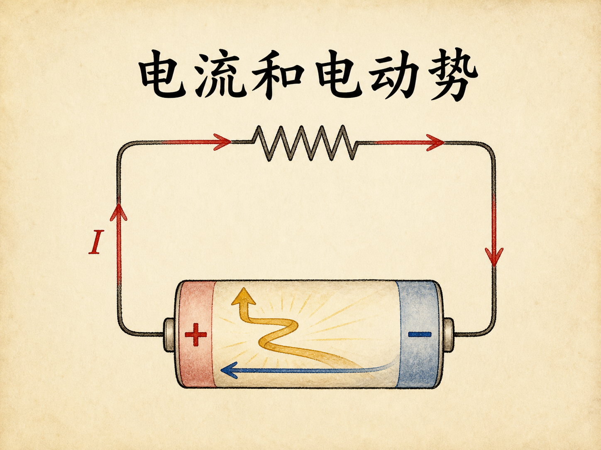
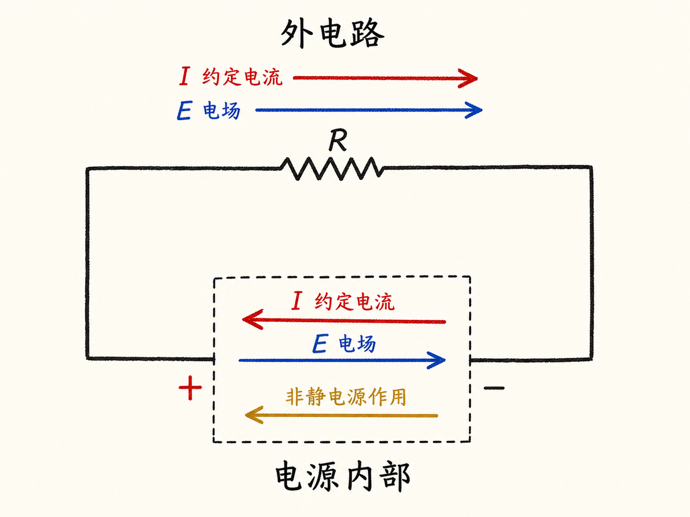
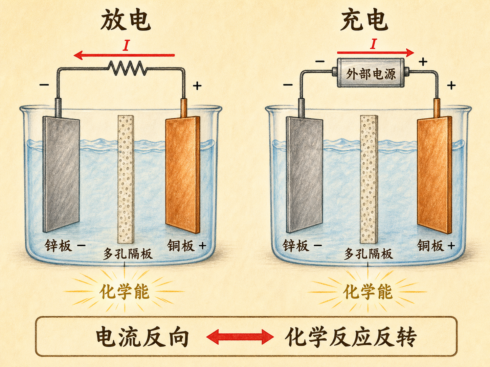
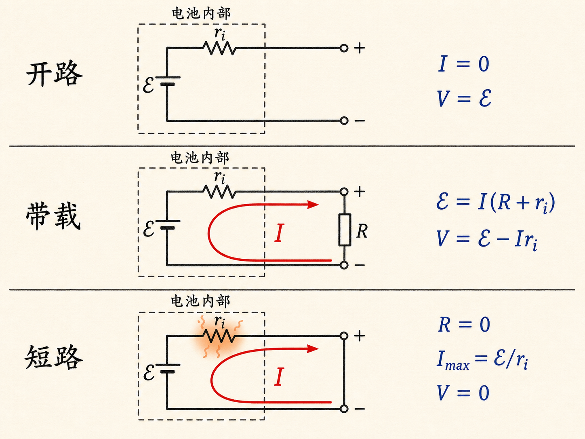
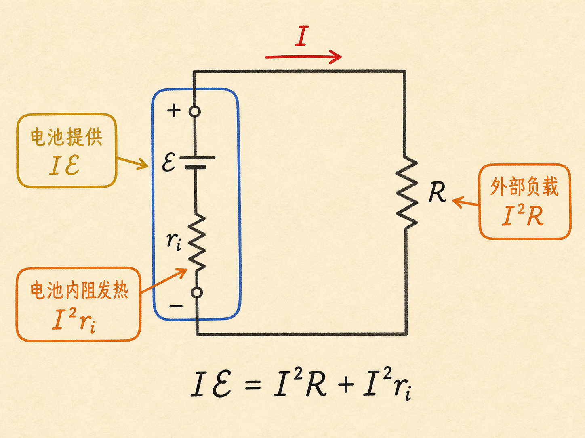
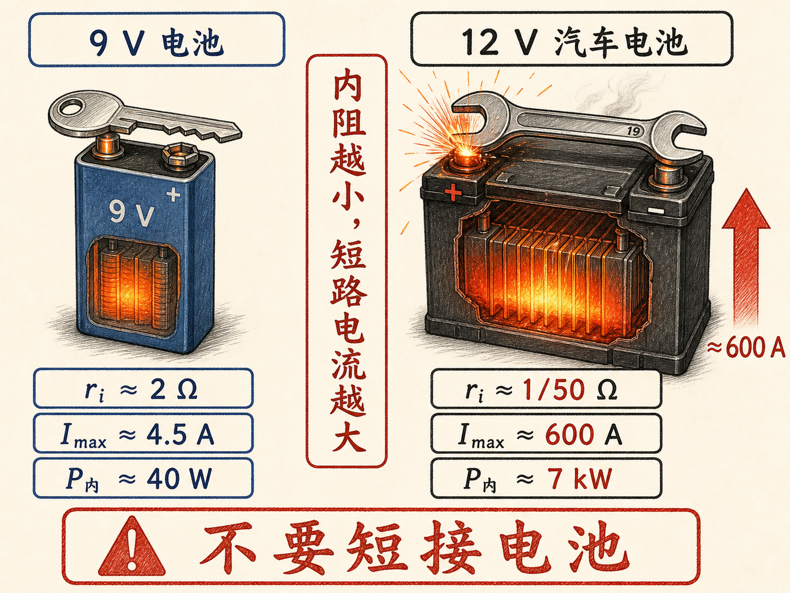
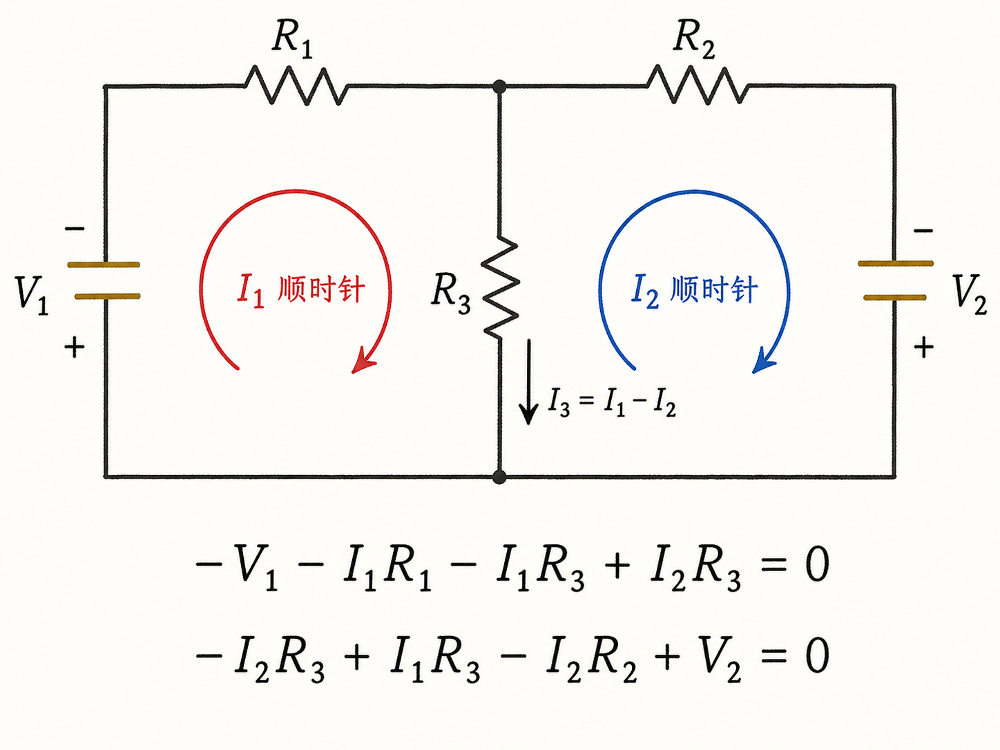
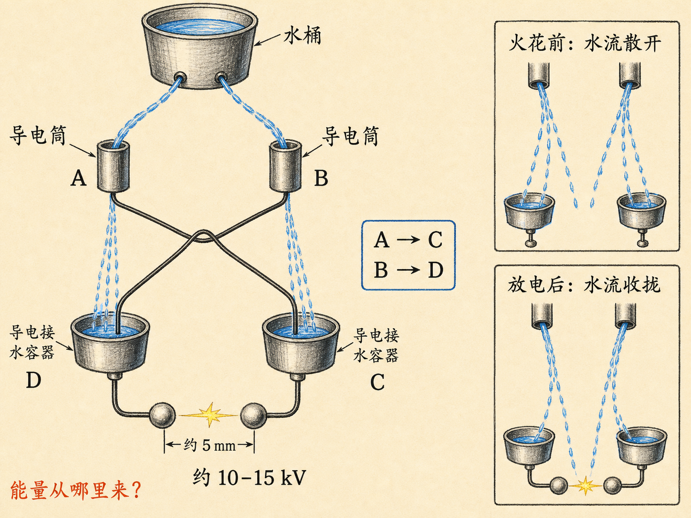

# 电流和电动势

一节九伏电池接在电压表上，读数接近九伏；用金属钥匙把两端短接，读数却迅速降到接近零。直觉很容易把这解释成“电池没电流了”，事实正相反：此时电流接近电池能够提供的最大值，电池也开始明显发热。

端电压接近零而电流最大，这个反差迫使我们把三个容易混在一起的概念分开：电势差、电动势和内阻。只有分清它们，才能理解电池为什么能持续供电、负载为什么会让电压下降，以及短路为什么危险。

读完这篇，你会知道

- 电源内部为什么必须把约定电流“送回”高电势端？
- 电动势为什么不是一种力，它与端电压有什么区别？
- 开路、带载和短路时，电流与端电压分别怎样变化？
- 电池输出的能量怎样分配到负载和内阻？
- 双回路电路中，怎样用电势变化和电荷守恒判断电流方向？

## 电源内部必须把电荷送上“电势山坡”

先看最简单的闭合电路：一个电源接一个电阻。电源正端电势较高，负端电势较低。外部电阻中的电场从正端指向负端，约定电流也沿这个方向流动。这里的导体内部电场并不为零；正是这个电场维持着稳恒电流。

但电流要持续流动，就必须在电源内部从负端回到正端。电源内部的电场仍然从正端指向负端，因此内部约定电流与电场方向相反。只靠静电场，电荷不会自己从低电势端回到高电势端，就像石头不会自己爬上山坡。

所以电源内部必须有一种非静电的“泵”。范德格拉夫起电机靠转动的皮带输送电荷，手摇起电机靠人转动曲柄做功，普通电池则靠化学反应提供能量。不同电源的机制不同，但共同任务相同：对电荷做功，把它送回高电势端，维持两端的电势差。

这正是电动势 $\mathcal E$ 要描述的量。名字里虽然有“力”，它却不是力；它表示电源中的非静电机制对单位电荷提供的能量，单位是焦耳每库仑，也就是伏特。

## 化学能怎样维持电池两端的电势差

课程用锌板、铜板和溶液搭建了一只化学电池。两块金属板插入溶液后，端点间出现约一伏的电势差。把外部电阻接上，约定电流从正端经电阻流向负端，再在电池内部从负端回到正端。

电池内部的离子运动伴随化学反应。演示中，硫酸根离子穿过多孔隔板移动；一侧的铜离子减少并沉积到铜板上，另一侧的锌溶解，使锌离子增加。化学反应释放的能量承担了“逆着电势变化输送电荷”的代价。

当溶液状态变化到无法继续维持反应时，电池停止供电。若用外部电源强迫电流反向，化学反应也会反转：铜重新进入溶液，锌沉积回锌板。持续足够长时间后，电池又能按原方向工作。这就是本讲对充电过程给出的核心图景：外部电源改变电流方向，也把化学变化推回相反方向。

串联则改变电源总电势差。把一节电池的正端接到下一节的负端，三节电动势均为 $\mathcal E$ 的独立电池在开路时给出总电动势 $3\mathcal E$。课堂上把两只铜—锌电池串联，电压表读数也从约一伏增到约两伏。

## 开路、带载和短路是三种不同状态

用一个更接近真实电池的模型来整理实验。设电池正端为 $B$、负端为 $A$，外部负载电阻为 $R$，电池内阻为 $r_i$。

开路时，外部电阻相当于无限大，电流 $I=0$。这时没有内阻压降，测得的端电压就是

$$V_{BA}=V_B-V_A=\mathcal E.$$

接入有限负载后，约定电流从正端流出，经过 $R$ 回到负端。电流同时也经过电池内阻，因此整个回路满足

$$\mathcal E=I(R+r_i).$$

电压表只能测到电池端点间的电势差。负载两端电压为 $IR$，所以带载端电压是

$$V_{BA}=IR=\mathcal E-Ir_i.$$

这说明电动势、端电压和内阻压降不是同一个量。电动势描述电源每单位电荷提供的能量；端电压是外部实际测到的电势差；$Ir_i$ 是电流经过内阻时对应的电势降。负载电流越大，带载端电压通常比开路电压低得越多。课堂上，两节串联电池接上小灯泡后，灯泡发光，同时端电压从开路时约 $1.9\ \mathrm V$ 明显下降。

若把外部电阻降到零，便得到理想化短路：

$$I_{\max}=\frac{\mathcal E}{r_i},\qquad V_{BA}=IR=0.$$

端电压为零并不表示电流为零。它只表示外部短路线两端没有电势差；电动势几乎全部对应于电池内阻上的电势降，电流反而达到最大。

## 功率说明能量去了哪里

设一小份电荷 $dq$ 从电势 $V_A$ 移到 $V_B$，电场做功为

$$dW=dq(V_A-V_B).$$

两边除以时间 $dt$，$dW/dt$ 是功率，$dq/dt$ 是电流，于是得到

$$P=IV.$$

这个关系本身不依赖欧姆定律。如果器件还满足 $V=IR$，才可以进一步写成

$$P=I^2R=\frac{V^2}{R}.$$

例如 $R=100\ \Omega$、$I=1\ \mathrm A$ 时，电阻耗散 $100\ \mathrm W$；若电阻不变而电流增到 $2\ \mathrm A$，功率变为 $400\ \mathrm W$。电流只增加一倍，发热功率却增加到四倍。

电池供电时，非静电机制提供的总功率是

$$P_{\text{battery}}=I\mathcal E=I^2(R+r_i).$$

其中，外部负载得到 $I^2R$，电池内部则耗散 $I^2r_i$。两部分相加正好等于电池提供的总功率。内阻不是外部看不见就可以忽略的部分；只要有电流，它就在电池内部产生热。

白炽灯正是把这种发热推到很高温度，使灯丝发出可见光。课程给出的 100 瓦、110 伏灯泡电流约为 $0.9\ \mathrm A$，热态电阻约为 $120\ \Omega$。加热器追求热而不是光，因此会用空气冷却或较大的散热表面积把温度控制得更低。功率描述能量转移的快慢，电费账单上的千瓦时则描述总能量：两千瓦电炉运行两小时，消耗的是四千瓦时。

## 为什么小电池短路发热，汽车电池短路却可能出事故

对一节电动势约 $9\ \mathrm V$、内阻约 $2\ \Omega$ 的电池，理想化最大电流是

$$I_{\max}\approx\frac{9}{2}=4.5\ \mathrm A.$$

短路时外部 $R=0$，全部功率都在内阻上变成热：

$$P_{\max}=I_{\max}^2r_i=\frac{\mathcal E^2}{r_i}\approx40\ \mathrm W.$$

课堂演示中，9 伏电池开路读数约为 $9.6\ \mathrm V$，用钥匙短接后端电压降到约 $0.1\ \mathrm V$，电池迅速变热。断开短路后，电压又恢复到约 $8.5\ \mathrm V$。这组读数把核心关系直接展示出来：短路时外部端电压很低，但内部电流和发热很大。

汽车电池的差别不主要在电压，而在内阻。课程给出的汽车电池约为 $12\ \mathrm V$，内阻约为 $1/50\ \Omega$，因而短路电流可达到约 $600\ \mathrm A$，内部功率接近 $7\ \mathrm{kW}$。扳手若同时碰到两个端子，极大电流可能把扳手焊在端子上，电池内部大量发热，甚至使酸液沸腾、外壳熔化。因此这不是可以随意重复的演示，而是明确的危险情形。

## 双回路网络：先定方向，再让方程判断对错

对于含两个电源和三个电阻的网络，只凭观察往往无法确定每条支路的电流方向。课程采用两个环流 $I_1$、$I_2$ 来求解。它们最初选顺时针还是逆时针并不重要，重要的是箭头一旦确定，所有电势升降都必须使用同一套符号约定。

第一条约束是回路电势变化闭合：沿任意回路走一周，回到同一点时，总电势变化为零。约定电势升高记正，降低记负。按课堂图中的方向，左回路得到

$$-V_1-I_1R_1-I_1R_3+I_2R_3=0.$$

这里经过电源 $V_1$ 是电势下降；沿 $I_1$ 方向经过 $R_1$ 和公共电阻 $R_3$ 也是下降；$I_2$ 在公共电阻中与该次绕行的作用相反，所以贡献为正。

右回路相应得到

$$-I_2R_3+I_1R_3-I_2R_2+V_2=0.$$

沿 $I_2$ 方向经过 $R_3$ 和 $R_2$ 是电势下降，$I_1$ 在公共电阻中的作用对应电势上升，穿过电源 $V_2$ 则是电势上升。两个方程解出 $I_1$ 和 $I_2$。

第二条约束是稳恒状态下的电荷守恒：任一结点流入多少电流，就必须流出多少电流。采用环流后，这条规则已经包含在电流组合里，公共支路电流为

$$I_3=I_1-I_2.$$

例如 $I_1=3\ \mathrm A$、$I_2=1\ \mathrm A$，就有 $I_3=2\ \mathrm A$；如果两者都是 $1\ \mathrm A$，则 $I_3=0$。若方程解出某个电流为负，并不是计算失败，只表示真实电流方向与最初假设的箭头相反。

## 最后一只电源：能量究竟来自哪里

课程结尾展示了一只由水流和四个导体组成的高压电源。顶部水桶分出左右两股水，水流先穿过两个开口金属筒，再落入下方两个导电容器。左侧上方导体接到右侧下方容器，右侧上方导体接到左侧下方容器。

装置运行一段时间后，两个放电球之间反复出现火花。即使间距约五毫米，电势差也能达到约一万到一万五千伏。更有意思的是，火花出现前，细水柱会逐渐散开；火花放电后，水流立刻收拢，随后再次慢慢散开，等待下一次火花。

本讲没有给出这个装置的完整工作机制，而是留下一个问题：既然它能一次次维持高电势差并产生火花，能量从哪里来？这也把整讲内容收束到同一个判断上——无论电源靠化学反应、机械转动还是流水工作，维持电势差都需要持续的能量转移；电动势记录的，正是电源为单位电荷提供了多少能量。
