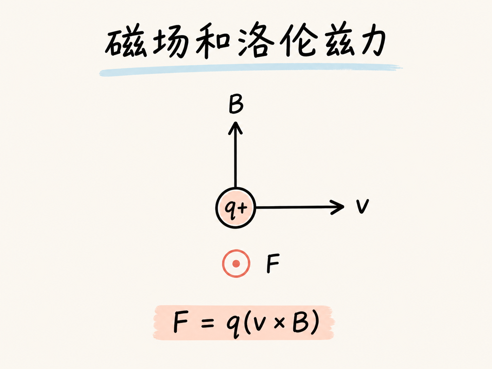
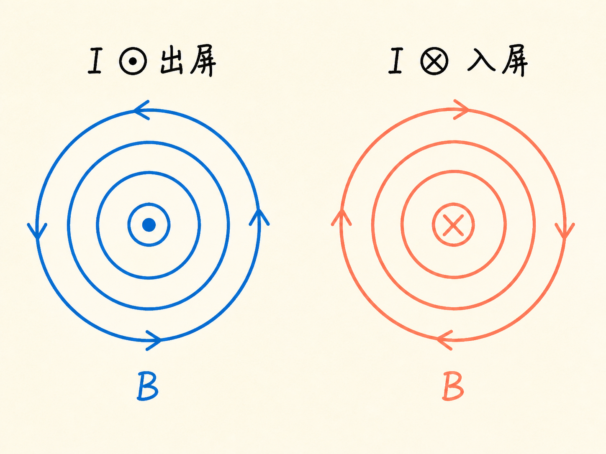
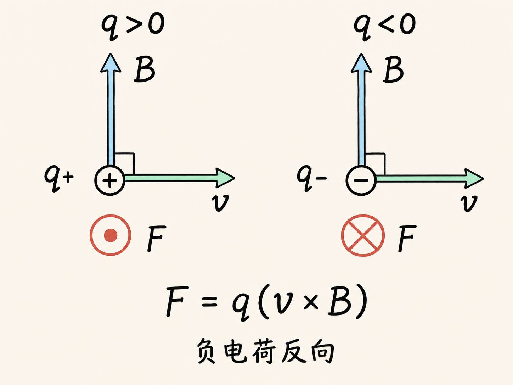
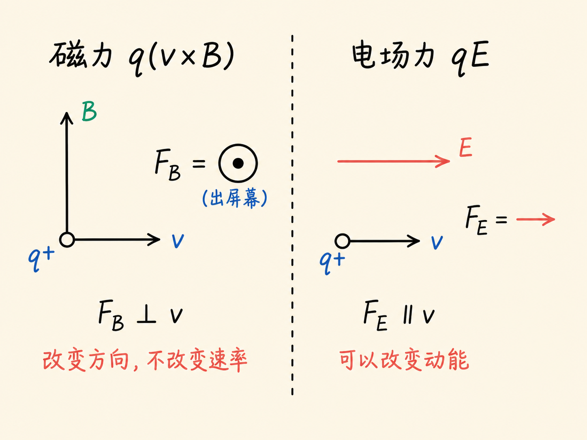
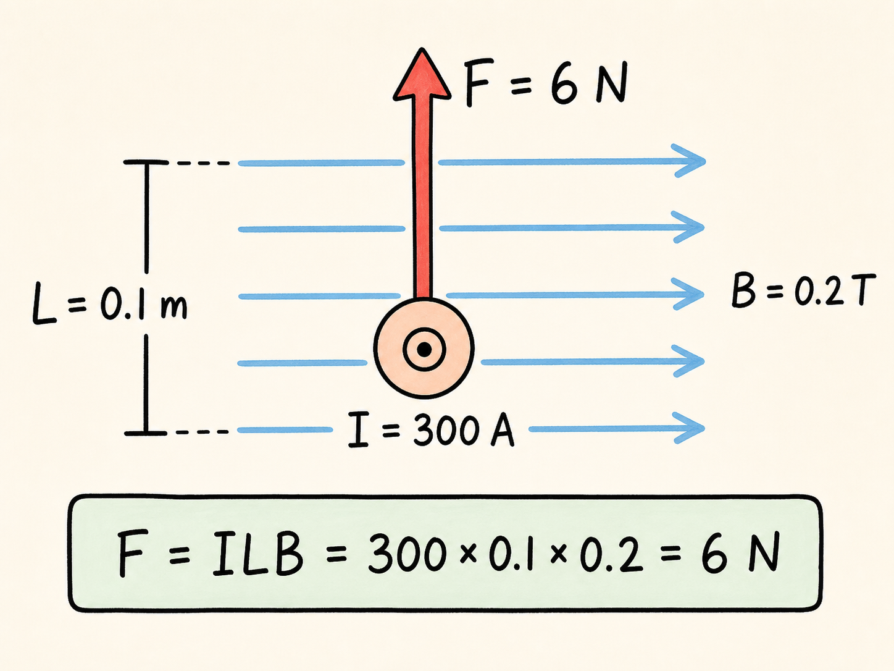
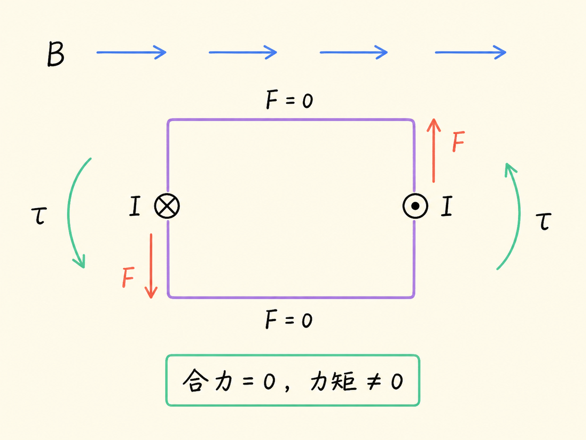
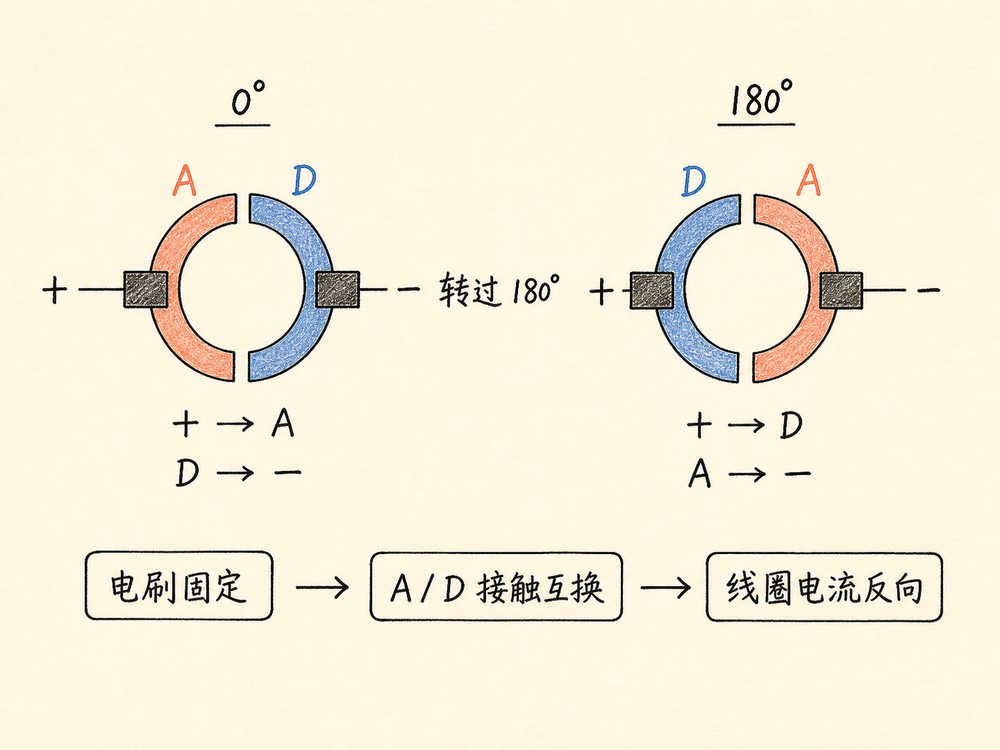

# 磁场和洛伦兹力

把一块强磁体靠近老式电视屏幕，画面会立刻扭曲。磁体没有碰到屏幕，电子枪也仍在发射电子，但原本规整的扫描轨迹变了方向。这个现象把磁场最关键的作用摆在眼前：它会对运动电荷施力，让运动方向发生改变。

问题是，这个力到底指向哪里？为什么它能让电子转弯，却不能单靠自己让电子越跑越快？再把许多运动电荷装进导线和线圈里，这个力又怎样变成导线的跳动和电动机的旋转？

读完这篇，你会知道

- 电流怎样让磁针转动，并由此暴露电与磁的联系
- 怎样用 $\mathbf F_B=q(\mathbf v\times\mathbf B)$ 判断磁力方向和大小
- 为什么磁力可以改变方向，却不改变粒子的速率和动能
- 运动电荷的磁力怎样变成载流导线的力和电流环的力矩

## 从磁针转动开始

磁体总有成对出现的两个磁极。同名磁极相斥，异名磁极相吸；据我们所知，孤立的磁极，也就是磁单极子，从未被观察到。这一点与电荷不同：单独的正电荷或负电荷都可以存在。

1819 年，奥斯特把电与磁真正接到了一起。他发现，导线中一旦有电流，附近的磁针就会转动。把电流方向反过来，磁针的新平衡方向也反过来。最直接的解释是：电流在导线周围产生了磁场，磁针沿局部磁场方向排列。

当导线垂直纸面时，方向可以用两个符号表示：⊙ 像朝向我们的箭尖，表示电流从纸面出来；⊗ 像远离我们的箭尾，表示电流进入纸面。电流进入纸面时，磁场顺时针环绕导线；电流从纸面出来时，磁场逆时针环绕。右手螺旋规则把这两个方向连接起来。

这个关系不只会推动磁针。把几百安培的电流通入磁体气隙中的导线，导线会突然跳动；反转电流，导线受力也反向。两根平行导线中的电流同向时相互吸引，反向时相互排斥。载流导线既产生磁场，也会在另一个磁场中受力。

## 用运动电荷定义磁场

电场可以用电荷所受的力来定义：$\mathbf F_E=q\mathbf E$。磁场不能照搬“磁荷乘磁场”的写法，因为没有可用的磁单极子。实际做法是让电荷运动起来，再观察它受到的力。

实验关系是 $\mathbf F_B=q(\mathbf v\times\mathbf B)$。

先按正电荷理解叉乘：右手四指从 $\mathbf v$ 转向 $\mathbf B$，拇指所指就是 $\mathbf v\times\mathbf B$ 的方向。若电荷为负，实际磁力方向再反转 180 度。速度或磁场任一方向反转，力也反转。

叉乘还同时给出三个条件。第一，$\mathbf F_B$ 垂直于 $\mathbf v$；第二，它也垂直于 $\mathbf B$；第三，大小为 $F_B=|q|vB\sin\theta$。因此静止电荷的磁力为零，速度与磁场平行或反平行时磁力也为零，二者垂直时磁力大小最大。

磁场的 SI 单位是特斯拉，符号为 $\mathrm T$。本讲使用的强磁体约为 $0.2\ \mathrm T$。还常见非 SI 单位高斯，换算关系为 $1\ \mathrm G=10^{-4}\ \mathrm T$；所以 $0.2\ \mathrm T$ 就是 $2\ \mathrm{kG}$。作为量级对照，本讲给出的地球磁场约为 $0.5\ \mathrm G$。

## 有力，但不做功

电视图像被磁体扭曲，说明运动电子确实受到了力。可如果只有磁力，这个力始终垂直于电子的瞬时速度。力可以把速度矢量转向，却没有沿运动方向的分量，因此不会改变速率，也不会改变动能。

所以，“磁场不做功”绝不等于“磁场没有力”。磁场的力真实存在，它改变的是运动方向。电场则不同，电场力可以沿运动方向有分量，因而可以改变电荷的动能。电场和磁场同时存在时，总力为 $\mathbf F=q(\mathbf E+\mathbf v\times\mathbf B)$。

其中 $q\mathbf E$ 是电场力，$q(\mathbf v\times\mathbf B)$ 是磁力；两者的方向规则和做功能力不能混在一起。

## 从一个电荷到一段导线

导线中的电流来自大量电荷的定向漂移。室温下，即使电流为零，自由电子也以本讲给出的约 $3\times10^6\ \mathrm{m/s}$ 做方向杂乱的热运动。每个电子可能受磁力，但各方向的平均效果为零。形成电流后，电荷出现有方向的漂移，宏观净力才不再为零。

取一小段正电荷 $dq$，让它以漂移速度 $\mathbf v_d$ 沿约定电流方向移动。它受到 $d\mathbf F_B=dq(\mathbf v_d\times\mathbf B)$。

因为 $I=dq/dt$，而电荷在 $dt$ 内的位移为 $d\mathbf l=\mathbf v_d dt$，所以 $d\mathbf F_B=I(d\mathbf l\times\mathbf B)$。

这里 $d\mathbf l$ 沿约定电流方向。金属中真正漂移的电子带负电，运动方向与约定电流相反；负电荷与反向速度这两个符号同时计入后，得到相同的导线受力结果。若磁场沿导线变化，就必须沿整根导线作矢量积分：$\mathbf F_B=I\int d\mathbf l\times\mathbf B$。

课堂演示可以作一个直接估算。假设只有 $L=0.1\ \mathrm m$ 的导线位于均匀磁场中，电流 $I=300\ \mathrm A$，磁场 $B=0.2\ \mathrm T$，且导线与磁场垂直，那么 $F_B=ILB=300\times0.1\times0.2\ \mathrm N=6\ \mathrm N$。

这个力足以把导线明显拉动，甚至拉倒支架。这里的数值依赖两个简化条件：磁场在这 $0.1\ \mathrm m$ 区段内均匀，而且只在这个区段内起作用。

## 合力为零，为什么线圈还能转

把导线弯成一个矩形电流环，放进均匀磁场。两条与磁场平行或反平行的边满足 $d\mathbf l\times\mathbf B=0$，不受磁力；另两条与磁场垂直的边受到大小相等、方向相反的力。一边向上，另一边向下，所以整个线圈的合力为零。

但两个力的作用线不重合。它们没有把线圈整体推走，却形成了力矩，让线圈转动。在本讲图示位置，若线圈边长为 $a$ 和 $b$，力的大小为 $IaB$，两条作用线间距为 $b$，因此当时的力矩为 $\tau=IabB$。

线圈转动后，两条力的作用线逐渐靠近，力矩变小；转过 90 度时，力矩降到零。若线圈靠惯性再越过这个位置，力矩会反向，把它推回来。没有额外设计，线圈只会来回摆动，这还不是能够持续旋转的电动机。

## 换向器做了什么

持续旋转有两个问题。第一，直接连接线圈的外部导线会越绕越紧，最后断裂；电刷通过滑动接触解决连接问题。第二，也是更关键的问题，是线圈每转过半圈，原来的力矩会反向。

换向器把线圈两端接到彼此绝缘的两个接触片上。线圈转过 180 度时，接触片与电池正负端的连接交换，电流自动反向。磁场没有变，但电流及时反向后，两侧导线的受力也随之反向，于是力矩仍推动线圈沿原来的旋转方向前进。

课堂最后的演示把这个机制直接展示出来：固定电流方向时，线圈转到另一侧就想退回来；每到合适位置手动切换电流方向，线圈便能持续转动。手在这里临时充当了换向器。磁场并不是给线圈“不断加速”的神秘推力，持续旋转来自电流方向与磁场方向在每半圈中的正确配合。

从磁针偏转到电视图像扭曲，再到导线跳动和线圈旋转，这一整条链只依靠同一个方向关系：运动电荷受到 $q(\mathbf v\times\mathbf B)$。理解叉乘、正负号和“不做功”的边界，磁场造成的种种运动就不再是分散的现象，而是同一条规律在不同尺度上的表现。
