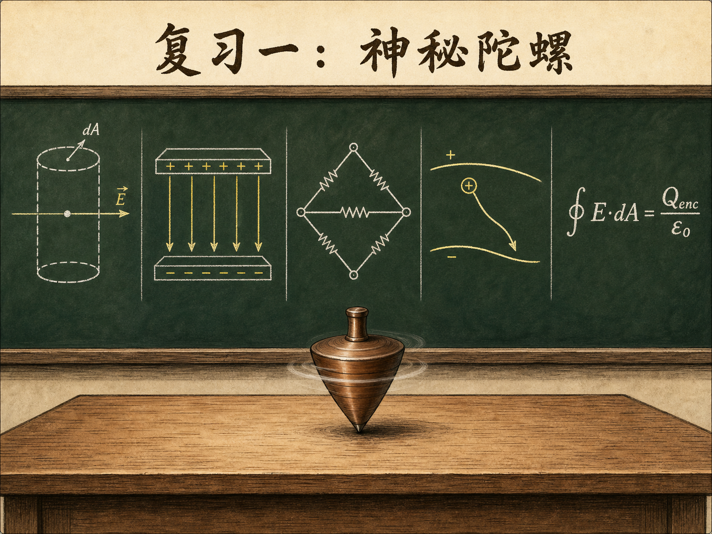
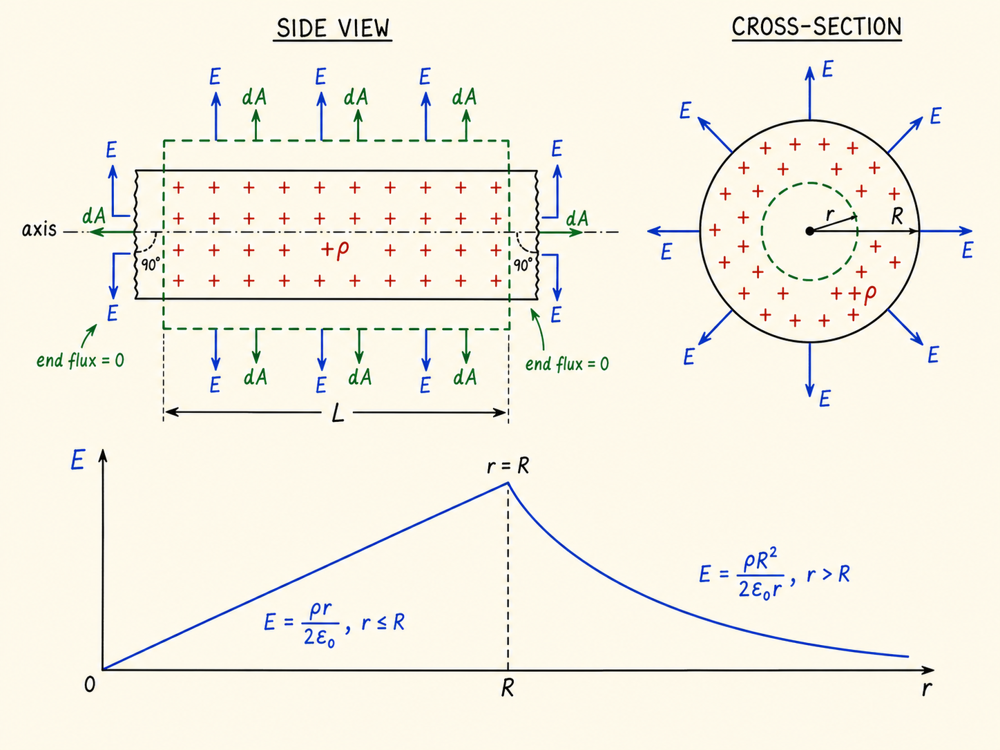
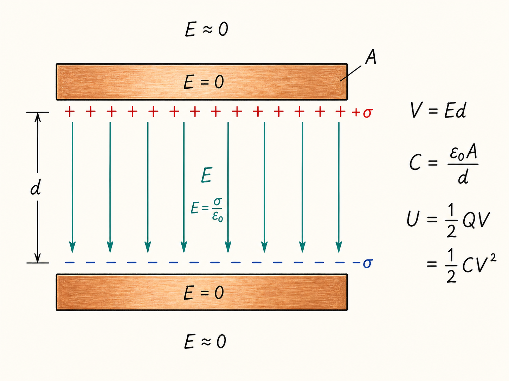
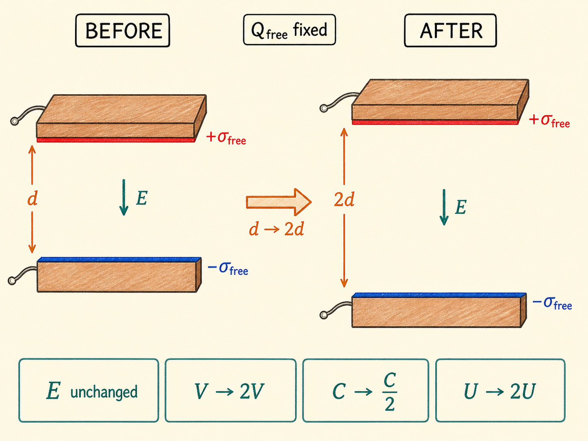
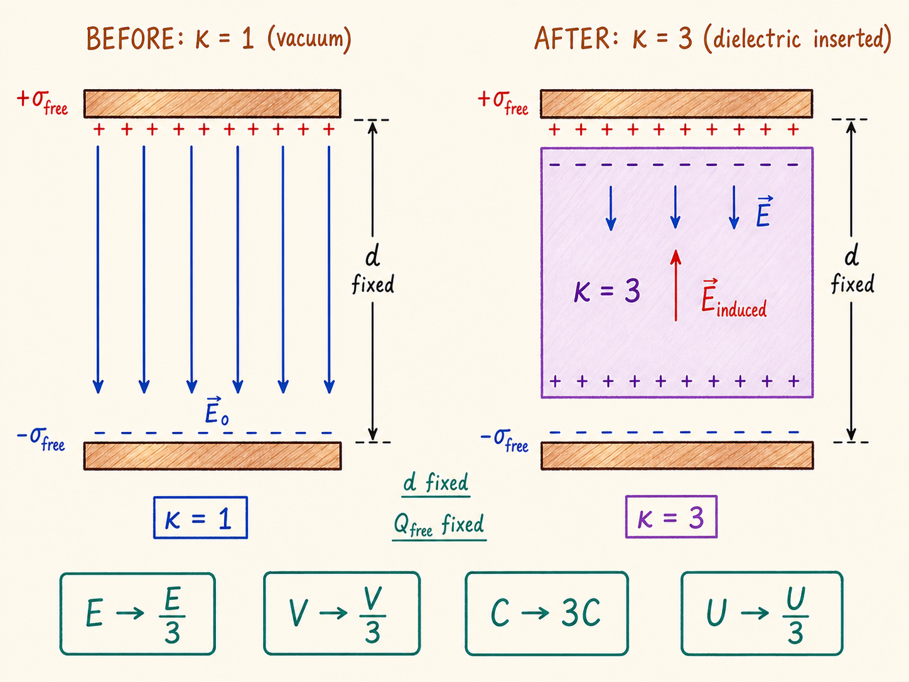
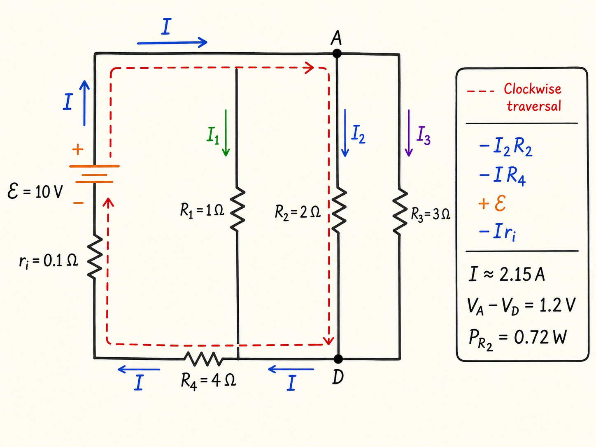
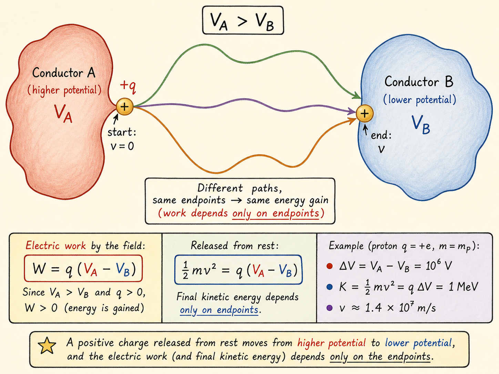

# 复习一：神秘陀螺，以及五条电磁学解题主线

讲台上有一个陀螺。它与空气和接触面之间都有摩擦，照理说旋转会逐渐衰减，最后倒下。可是老师让它转起来以后，先讲完一道柱对称高斯定律题，再讲完平行板电容器，它居然还在转。

这堂课没有解释陀螺为什么能持续旋转。它只是一个不断回来的悬念，提醒我们：眼前的现象可能还需要 8.02 中更深一层的物理。不过，真正占据课堂主体的，是一次考试前复习。五类看似分散的问题背后，反复使用的是同一种解题方式：先找约束，再写关系，最后检查方向、边界和能量。

读完这篇，你会知道

- 为什么高斯定律只有遇到球、柱或平面对称时才真正好用？
- 怎样从一个均匀带电长圆柱推出内外电场，并检查两个答案在表面接上？
- 断开电源后，拉开电容器极板或插入电介质，哪些量固定、哪些量随之改变？
- 一个带内阻的并联电阻网络，怎样从等效电阻走到支路电流和功率？
- 电荷跨越电势差时，为什么不用知道它走过的具体路径，也能求出末速度？

## 高斯定律的关键不是积分，而是对称性

高斯定律写成

$\displaystyle \oint \mathbf E\cdot d\mathbf A=\frac{Q_{\mathrm{enc}}}{\varepsilon_0}$。

左边是穿过闭合曲面的电通量，右边是曲面包围的总电荷除以 $\varepsilon_0$。公式本身很短，困难却不在积分，而在于能不能先确定电场在高斯面上的大小和方向。

这就是为什么复习课把可用的对称性压缩成三类：球对称、柱对称和平面对称。没有这些特殊电荷分布，虽然高斯定律仍然成立，却很难仅凭它求出电场。

现在看一根非常长的实心圆柱。圆柱半径为 $R$，内部均匀分布着体电荷，体电荷密度为 $\rho$。目标是求距轴线为 $r$ 处的电场。

柱对称先给出两个结论。

第一，在同一个半径为 $r$ 的圆柱面上，所有点到轴线的距离相同，因此电场大小相同。第二，电场只能垂直于轴线。若 $\rho>0$，它沿径向单位矢量 $\hat{\mathbf r}$ 向外；若 $\rho<0$，方向自动反转。自然界没有理由在圆周上偏爱某个方位，也没有理由让电场沿轴线偏向某一端。

因此，高斯面也选成与实体圆柱同轴的圆柱，长度任取为 $L$。两个平端面的面积矢量沿轴线，而电场垂直于轴线，所以二者夹角为 $90^\circ$，端面通量为零。全部通量只能穿过侧面。

### 圆柱外部：包围全部截面电荷

当 $r>R$ 时，高斯圆柱的侧面积为 $2\pi rL$，曲面上电场大小相同，且 $\mathbf E$ 与 $d\mathbf A$ 同向。于是左边化成 $E(2\pi rL)$。

高斯面包围的带电体积不是 $\pi r^2L$，因为真正有电荷的实体半径只有 $R$。包围电荷为 $Q_{\mathrm{enc}}=\rho\pi R^2L$。代入高斯定律，$L$ 和 $\pi$ 约去，得到

$\displaystyle \mathbf E(r)=\frac{\rho R^2}{2\varepsilon_0r}\hat{\mathbf r},\qquad r>R$。

圆柱外部的电场大小按 $1/r$ 衰减。

### 圆柱内部：包围的电荷随半径增长

当 $r\le R$ 时，高斯面只包围半径 $r$ 内的那部分电荷，所以 $Q_{\mathrm{enc}}=\rho\pi r^2L$。侧面通量仍是 $E(2\pi rL)$，因此

$\displaystyle \mathbf E(r)=\frac{\rho r}{2\varepsilon_0}\hat{\mathbf r},\qquad r\le R$。

圆柱内部的电场从轴线上的零开始，随 $r$ 线性增加。轴线上为什么是零？因为来自四周的电场两两抵消。这一点甚至可以在计算前由对称性预言。

还要做一个边界检查。把 $r=R$ 分别代入内外两式，都得到 $E=\rho R/(2\varepsilon_0)$。两段曲线在圆柱表面接上：内部线性上升，外部按 $1/r$ 下降。

若把同样的单位长度总电荷全部放到实心导体的外表面，导体内部电场会变为零，而外部结果不变。这个比较也说明，决定外部高斯面结果的是它包围的总电荷；内部电荷如何分布，则决定内部电场。

讲到这里，老师第一次回头看陀螺。它仍在旋转。摩擦没有消失，但陀螺也没有如预期那样停下。答案仍然没有揭晓。

## 平行板电容器：从场一直追到能量和电荷位置

接着看两块很大的平行导体板。两板面积为 $A$、间距为 $d$，横向尺寸远大于 $d$。相对的两个表面分别带面电荷密度 $+\sigma$ 和 $-\sigma$。

这里的“大”是一个条件。只要观察位置没有远到让平板有限尺寸变得重要，就可以近似认为：两板之间的电场均匀，大小为

$\displaystyle E=\frac{\sigma}{\varepsilon_0}$，

方向由正板指向负板；两板外侧的电场由叠加相互抵消，接近零。导体内部没有电流，电场也为零。

从正板内部一点 $P$ 走到负板内部一点 $S$。若路径沿电场方向，两板间电势差为

$\displaystyle V_P-V_S=\int_P^S\mathbf E\cdot d\mathbf l=Ed=\frac{\sigma d}{\varepsilon_0}$。

因为静电场是保守场，换一条路径结果仍相同。同一块导体内部任意两点之间则没有电势差，因为导体内部处处 $E=0$。

一块极板上的电荷量大小为 $Q=\sigma A$，所以电容

$\displaystyle C=\frac{Q}{V}=\frac{\varepsilon_0A}{d}$。

这个结果与 $\sigma$ 无关。电容由几何决定，不是由这一次给极板充了多少电决定。

建立这组电荷分布，也就是建立板间电场，需要静电势能：

$\displaystyle U=\frac12QV=\frac12CV^2$。

两种写法必须给出同一个答案。把 $Q=\sigma A$、$V=\sigma d/\varepsilon_0$ 与 $C=\varepsilon_0A/d$ 分别代入，都会得到相同的 $U$。这不是两种不同的能量，只是同一个能量用不同的已知量表达。

电荷究竟在哪里？在当前理想构型中，答案是两块板相对的内表面。

如果导体内部存在净电荷，可以用完全位于导体内部的闭合高斯面包围它。由于导体内部 $E=0$，通量必定为零；高斯定律却会要求包围电荷也为零，所以净电荷不能留在导体体内。

上板外表面也不能有净电荷。作一个跨过该表面的小药盒形高斯面，药盒两侧的电场都为零，通量仍为零，因此它不能包围表面电荷。于是正电荷位于上板下表面，负电荷位于下板上表面。这个结论依赖的正是当前构型中导体内部和两板外侧的电场都为零。

老师又去看陀螺。它还在转。课堂给出的选择只有三个：违反能量守恒、黑魔法，或者某个尚未讲明的简单物理。前两个显然是在制造悬念，真正的答案仍被留在 8.02 后续内容里。

## 断开电源后，先问哪个量被锁住

现在仍是平行板电容器，但把面电荷密度写成 $\sigma_{\mathrm{free}}$，因为接下来要插入电介质。

先用电源充电，然后拆掉导线。这个动作决定了后面全部变化：电源断开后，自由电荷被困在极板上，所以 $Q_{\mathrm{free}}$ 与 $\sigma_{\mathrm{free}}$ 固定。

接下来反复使用五个关系：

- $Q_{\mathrm{free}}=\sigma_{\mathrm{free}}A$；
- $E=\sigma_{\mathrm{free}}/(\kappa\varepsilon_0)$；
- $V=Ed$；
- $C=Q_{\mathrm{free}}/V=\kappa\varepsilon_0A/d$；
- $U=\tfrac12Q_{\mathrm{free}}V=\tfrac12CV^2$。

重要的不是背一张变化表，而是每次先找不变量，再沿这些关系逐项推出其他量。

### 只把间距增大为两倍

先不放电介质，因此 $\kappa=1$。把两板间距 $d$ 增大为两倍。

由于 $\sigma_{\mathrm{free}}$ 固定，$E=\sigma_{\mathrm{free}}/\varepsilon_0$ 不变。于是 $V=Ed$ 增大为两倍；$C=Q_{\mathrm{free}}/V$ 减为一半；$U=\tfrac12Q_{\mathrm{free}}V$ 增大为两倍。

能量为什么增加？因为拉开彼此吸引的极板需要外力做功。这些功进入了静电势能。

### 保持间距不变，插入 $\kappa=3$ 的电介质

让 $d$ 回到原值并保持不变，再把介电常数为 $\kappa=3$ 的电介质插入两板之间。自由面电荷密度仍固定。

外电场使电介质两侧出现符号相反的感生电荷，它们产生的感生电场与原电场反向。因此合电场按 $E=\sigma_{\mathrm{free}}/(\kappa\varepsilon_0)$ 减为三分之一。

由于 $d$ 不变，$V=Ed$ 也减为三分之一。自由电荷不变而电势差减小，所以 $C=Q_{\mathrm{free}}/V$ 增大为三倍。$U=\tfrac12Q_{\mathrm{free}}V$ 则减为三分之一。

能量下降意味着插入过程中电场对电介质做功，电介质受到把它拉进极板间的力。

如果电源始终连接，推理起点会完全不同：此时被锁住的是电势差 $V$。例如 $d$ 增大为两倍时，为保持 $V=Ed$ 不变，$E$ 必须减为一半。物理关系没有变，改变的是边界条件，因此结果会很不一样。

## 电阻网络：先压缩结构，再恢复支路

下一道题是一只带内阻的电池连接一个简单网络。电池电动势为 $\mathcal E=10\,\mathrm V$，内阻 $r_i=0.1\,\Omega$。三只并联电阻分别为 $R_1=1\,\Omega$、$R_2=2\,\Omega$、$R_3=3\,\Omega$，并联组再与 $R_4=4\,\Omega$ 串联。

第一步不是立刻列很多支路方程，而是先把并联组压缩成等效电阻：

$\displaystyle \frac1{R_{\mathrm{eq}}}=\frac1{R_1}+\frac1{R_2}+\frac1{R_3}$。

它约为 $0.55\,\Omega$，小于最小的支路电阻 $1\,\Omega$。并联增加了电流通路，所以等效电阻下降。

从电池看出去，$R_{\mathrm{eq}}$、$R_4$ 和 $r_i$ 串联，于是

$\displaystyle \mathcal E=I(R_{\mathrm{eq}}+R_4+r_i)$，

得到总电流约为 $I=2.15\,\mathrm A$。

接着恢复并联支路。设并联组两端节点为 $A$、$D$。三条支路跨越同一对节点，因此

$\displaystyle V_A-V_D=I_1R_1=I_2R_2=I_3R_3$。

为了求 $I_2$，选择一条经过 $R_2$、$R_4$ 和电池的闭合路径。规定沿路径电势下降记负号，电势上升记正号，则

$\displaystyle -I_2R_2-IR_4+\mathcal E-Ir_i=0$。

这里 $+\mathcal E$ 是跨过电池时的电势上升，$-Ir_i$ 是电池内阻造成的电势下降。总电流已经知道，所以可求得 $I_2=0.6\,\mathrm A$，进而

$\displaystyle V_A-V_D=I_2R_2=1.2\,\mathrm V$。

把同一个并联电压代回另外两条支路，就能得到 $I_1$ 和 $I_3$。

能量检查也很直接。电池提供的总功率为

$\displaystyle P_{\mathrm{battery}}=\mathcal EI=21.5\,\mathrm W$。

这些能量最终以热的形式出现在四只外部电阻和电池内阻中。对 $R_2$ 而言，它只承受 $1.2\,\mathrm V$，支路电流为 $0.6\,\mathrm A$，所以

$\displaystyle P_{R_2}=(V_A-V_D)I_2=0.72\,\mathrm W$。

这表示 $R_2$ 每秒产生 $0.72$ 焦耳的热。

## 不画复杂电场，也能求带电粒子的末速度

最后一题有两个形状很不规则的导体。导体 $A$ 的电势为 $V_A$，导体 $B$ 的电势为 $V_B$，并且 $V_A>V_B$。把一个正电荷 $+q$ 从 $A$ 处由静止释放，它在真空中沿某条复杂路径到达 $B$。

这条路径可能很弯，周围电场也可能复杂得难以画出。但静电场是保守场，所以电场力做功只由起点和终点决定：

$\displaystyle W=\int_A^B\mathbf F\cdot d\mathbf l=q\int_A^B\mathbf E\cdot d\mathbf l=q(V_A-V_B)$。

若电荷从静止出发，这些功转化为动能，因此

$\displaystyle \frac12mv^2=q(V_A-V_B)$。

例子中，质子质量约为 $1.7\times10^{-27}\,\mathrm{kg}$，电荷为 $1.6\times10^{-19}\,\mathrm C$，跨越的电势差为 $10^6\,\mathrm V$。它获得的动能为

$\displaystyle K=q\Delta V=1.6\times10^{-13}\,\mathrm J=1\,\mathrm{MeV}$。

这里的 $1\,\mathrm{MeV}$ 是 100 万电子伏。把焦耳值代入 $\tfrac12mv^2$，得到

$\displaystyle v\approx1.4\times10^7\,\mathrm{m/s}$，

约为光速的 5%，所以这道题不需要作相对论修正。

## 最后回到陀螺：这堂课只留下线索

高斯定律、电容器、电介质、电阻网络和带电粒子加速都复习完了，那个陀螺仍在旋转。

但这堂课没有给出它持续旋转的机制，更没有把它与刚才任何一条电学公式强行连接起来。唯一明确的线索是：答案在 8.02。于是，本讲能做的正确收束不是替它补上一个解释，而是保留这个尚未解决的问题。

与此同时，五道复习题已经给出一条可以复用的解题主线：先问系统的对称性或边界条件锁住了什么；再选择能把未知量连接起来的关系式；最后检查方向、表面连续性、电势升降和能量去向。数学可以很短，真正决定是否走对路的，是这些约束有没有先看清。
