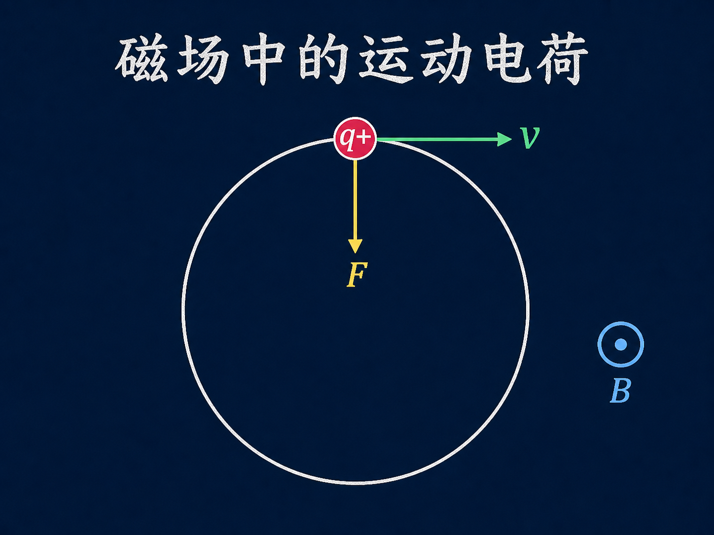
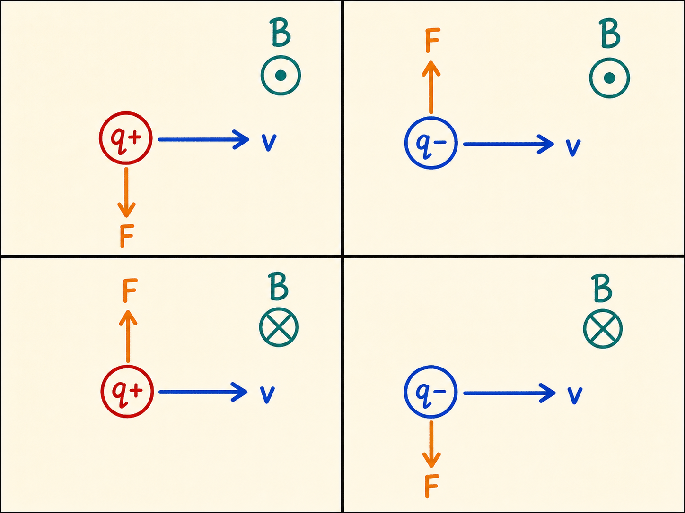
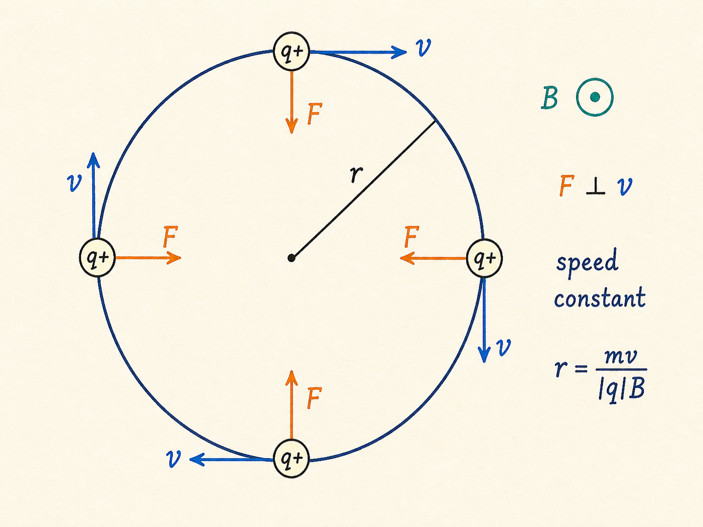
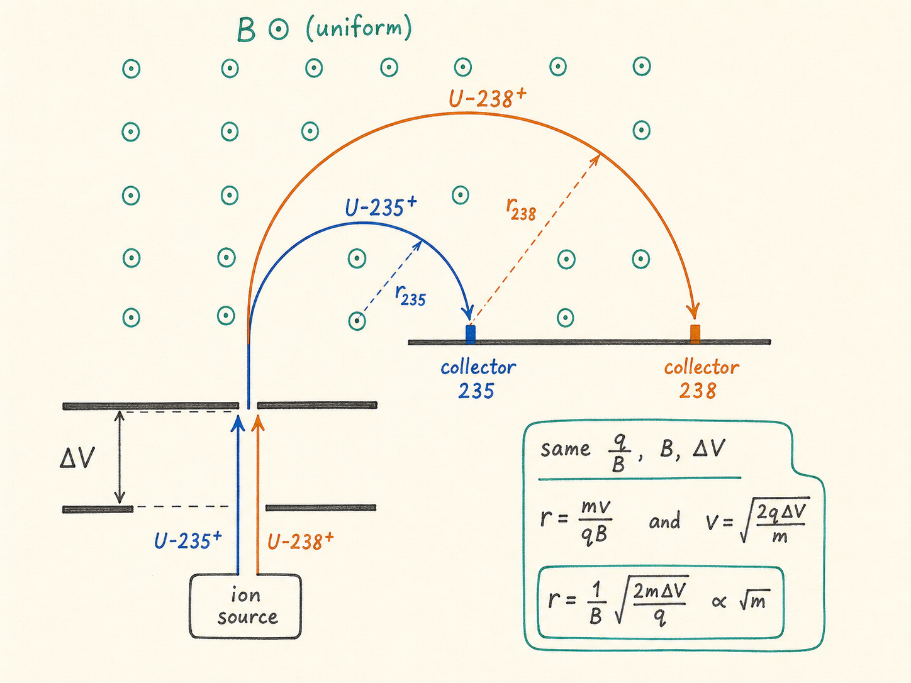
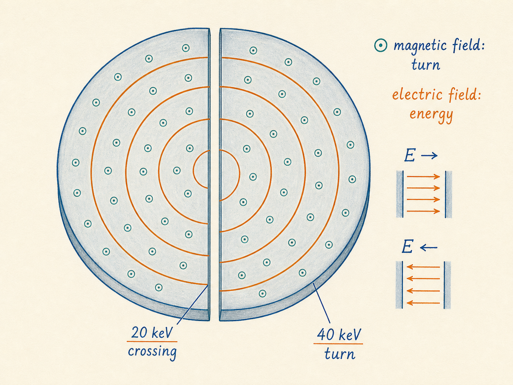
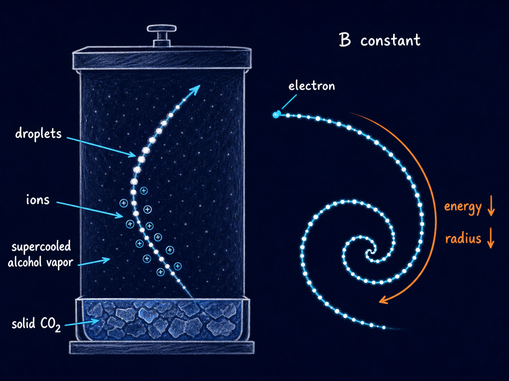
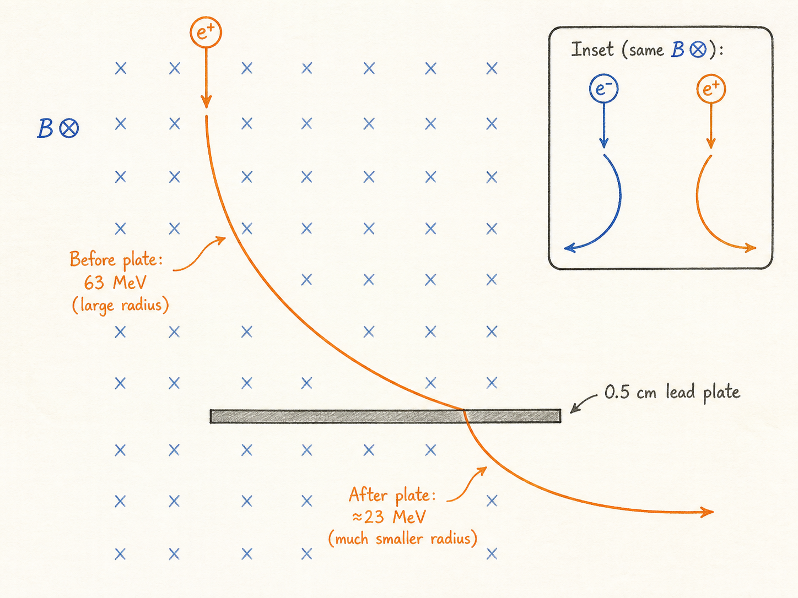

# 磁场中的运动电荷

一束电子打在荧光屏上，本来是一条直线。把条形磁铁靠近，亮线向上弯；把磁铁翻过来，它立刻改为向下弯。电子并没有因为磁场而越跑越快，改变的是速度的方向。

同一个规律还能做更多事：把质量略有差别的同位素送到不同收集器，让质子在回旋加速器里一圈圈向外扩展，或者从云室里逐渐卷紧的轨迹读出粒子的能量变化。它们都从一个简单的叉乘开始。

读完这篇，你会知道

- 为什么磁场能让带电粒子转弯，却不能提高它的速率
- 圆周轨道半径由哪些量决定，公式的适用条件是什么
- 为什么正负电荷在同一磁场中向相反方向偏转
- 质谱仪怎样把质量不同的同位素分开
- 回旋加速器为何必须让电场和磁场分工合作

## 先把方向关系闭合

磁场对运动电荷的作用由洛伦兹力给出：$\mathbf F=q\,\mathbf v\times\mathbf B$。叉乘先决定正电荷受力方向，负电荷再把这个方向反转。

约定用 $\odot$ 表示磁场从纸面向外，用 $\otimes$ 表示磁场指向纸面里面。若正电荷的速度 $\mathbf v$ 向右、磁场为 $\odot$，右手四指从 $\mathbf v$ 转向 $\mathbf B$，拇指给出 $\mathbf v\times\mathbf B$ 的方向，正电荷受力向下；换成电子，受力便向上。若磁场翻为 $\otimes$，两种电荷的偏转方向同时反转。

课堂上的电子枪演示正是这套方向关系的直接检验。电子运动方向与约定电流方向相反。用约定电流做叉乘可以得到电子束的受力方向；翻转条形磁铁，磁场方向反转，荧光屏上的电子束也随之反向弯曲。

## 为什么转弯却不变快

当 $\mathbf v\perp\mathbf B$ 时，洛伦兹力同时垂直于速度和磁场。力没有沿速度方向的分量，因此不能改变速率，也不能改变动能；它只不断改变速度方向。在处处均匀的磁场中，这个持续的垂直力就成为向心力，粒子沿圆周运动。

磁力大小为 $|q|vB$，向心力大小为 $mv^2/r$。令两者相等，得到 $|q|vB=mv^2/r$，于是圆周半径为 $r=mv/(|q|B)$。

这个式子可以直接读出三件事：磁场 $B$ 越强，弯曲越急，半径越小；电荷量绝对值 $|q|$ 越大，受力越强，半径也越小；质量 $m$ 或速率 $v$ 越大，粒子越不容易被转弯，半径越大。式中的 $mv$ 也就是非相对论动量，所以测出 $r$、知道 $q$ 和 $B$，就能反推粒子的动量大小。

这里有明确边界：圆轨道推导假设 $\mathbf v\perp\mathbf B$、磁场均匀，并且速度足够低，可以使用非相对论动量。若速度接近光速，动能不再等于 $\frac12mv^2$，半径和周期都要引入洛伦兹因子 $\gamma$ 修正。

## 从加速电势算轨道半径

课堂先取一个动能为 $1\,\mathrm{MeV}$ 的质子。它经过一百万伏电势差加速，动能为 $1.6\times10^{-13}\,\mathrm J$，非相对论速度约为 $1.4\times10^7\,\mathrm{m/s}$，约等于光速的 5%。把它送入 $1\,\mathrm T$ 磁场，轨道半径为 $0.15\,\mathrm m$，也就是 15 厘米。

如果粒子由电势差 $\Delta V$ 获得动能，可以用 $\frac12mv^2=|q|\Delta V$ 消去速度，得到 $r=\sqrt{2m\Delta V/(|q|B^2)}$。这与 $r=mv/(|q|B)$ 是同一物理过程的两种写法：前者适合已知加速电势，后者适合已知速度或动量。

但不能把这个非相对论公式无限外推。对一个经过 $500\,\mathrm{kV}$ 电势差加速的电子，若硬套 $\frac12mv^2$，会得到 $4.2\times10^8\,\mathrm{m/s}$，已经超过光速。相对论修正后，课堂给出的速度是 $2.6\times10^8\,\mathrm{m/s}$。错误不在磁场公式本身，而在高能电子已经不能用非相对论动能表达式求速度。

## 质谱仪：把质量差变成落点差

铀-235 和铀-238 都有 92 个质子，中性原子也都有 92 个电子，因此化学性质相同，不能靠普通化学性质轻易分开。质谱仪改用质量差来区分它们。

先让铀原子各失去一个电子，成为带一个单位正电荷的离子；再让两种离子经过相同电势差加速，进入同一个从纸面向外的均匀磁场。此时 $q$、$B$ 和 $\Delta V$ 都相同，半径关系只剩 $r\propto\sqrt m$。

铀-238 的质量比铀-235 大约 1.2%，轨道半径因此约大 0.6%。如果半径约为 1 米，两条轨迹在经过半圆后形成的落点差约为 1.2 厘米。让两个收集器分别对准两个落点，就能把同位素分开。质谱仪没有改变两种同位素的化学性质，只是把很小的质量差转换成可以测量的空间距离。

## 回旋加速器：磁场管方向，电场管能量

回旋加速器由两个 D 形导电腔室组成，整个装置处于真空中，均匀磁场垂直于 D 形盒平面。粒子在单个 D 形盒内部只受磁场约束，沿半圆运动；每次穿过两个 D 形盒之间的间隙，才由电场做功并增加动能。

课堂中的例子从一个 $1\,\mathrm{MeV}$ 质子开始。在 $1\,\mathrm T$ 磁场中，它的初始半径为 15 厘米。若间隙电势差为 $20\,\mathrm{kV}$，质子每穿过一次间隙就增加 $20\,\mathrm{keV}$，每转一整圈穿过两次，因此每圈增加 $40\,\mathrm{keV}$。随着动能提高，速度和轨道半径增大，轨迹逐圈向外扩展。

这正好划清电场与磁场的职责：电场沿粒子运动方向做功，改变动能；磁场始终垂直于速度，不做功，只把粒子限制在弯曲轨道中。经过 1225 圈，质子增加 $49\,\mathrm{MeV}$，连同初始能量达到 $50\,\mathrm{MeV}$；对应轨道半径增大到约 1 米。

非相对论条件下，转一圈的时间为 $T=2\pi r/v$。代入 $r=mv/(|q|B)$，速度正好约去，得到 $T=2\pi m/(|q|B)$。因此同一种粒子在恒定磁场中的回旋周期与速率无关。课堂例子中，每圈约 66 纳秒，1225 圈只需约 80 微秒；由于每圈要跨越间隙两次，电场方向约以 $30\,\mathrm{MHz}$ 的频率切换。

速度接近光速后，周期要乘上 $\gamma$，不再保持恒定，间隙电场的切换频率也必须随之调整。若现代环形加速器保持轨道半径不变，那么粒子动量提高时还要逐渐增强磁场，才能继续把粒子约束在同一个环内。

## 云室：从弯曲径迹读出粒子

带电粒子穿过空气会产生离子，同时逐渐损失动能。云室底部用固态二氧化碳冷却，形成一层尚未凝结的过冷酒精蒸气；粒子留下的离子充当凝结核，使酒精形成一串可见小液滴。原本看不见的单个粒子，便留下一条可以观察的径迹。

若云室中存在恒定磁场，电子损失动能时速度降低，由 $r=mv/(|q|B)$ 可知轨道半径随之缩小，于是径迹会逐渐卷紧。课堂给出的例子中，一个 $500\,\mathrm{keV}$ 电子在 $1.1\,\mathrm T$ 磁场中的半径为 2.9 厘米；能量降到 $100\,\mathrm{keV}$ 时，半径变为 1.1 厘米。

弯曲方向还能判断电荷符号。电子与正电子质量相同、电荷量绝对值相同，但电荷符号相反，所以在同一磁场中向相反方向弯曲。Anderson 的云室照片中放入了一块半厘米厚的铅板：粒子穿过铅板会损失能量，出射一侧的半径应更小，于是先确定粒子的运动方向，再根据弯曲方向判断其电荷符号。这个设计排除了“粒子其实从另一端进入”的歧义。

## 把整条逻辑串起来

磁场中的运动电荷并不是被磁场“加速”了。严格说，磁场改变的是速度矢量的方向，而不是速率。这个垂直于速度的力把粒子限制在圆轨道上，半径把质量、动量、电荷和磁场强度联系在一起。

一旦能控制和测量这个半径，就能把同位素送往不同收集器，让带电粒子在加速器里保持轨道，也能从云室和气泡室的弯曲径迹反推粒子的动量与电荷符号。电场负责改变能量，磁场负责改变方向；两者分工，才把不可见的粒子运动变成可操控、可测量的轨迹。
