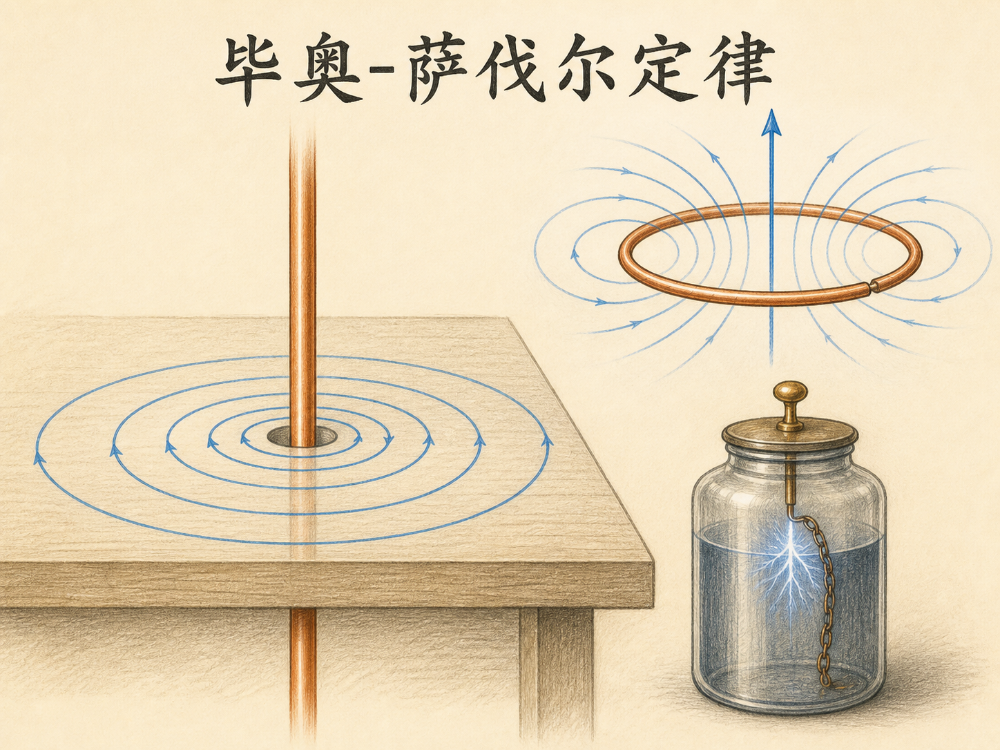
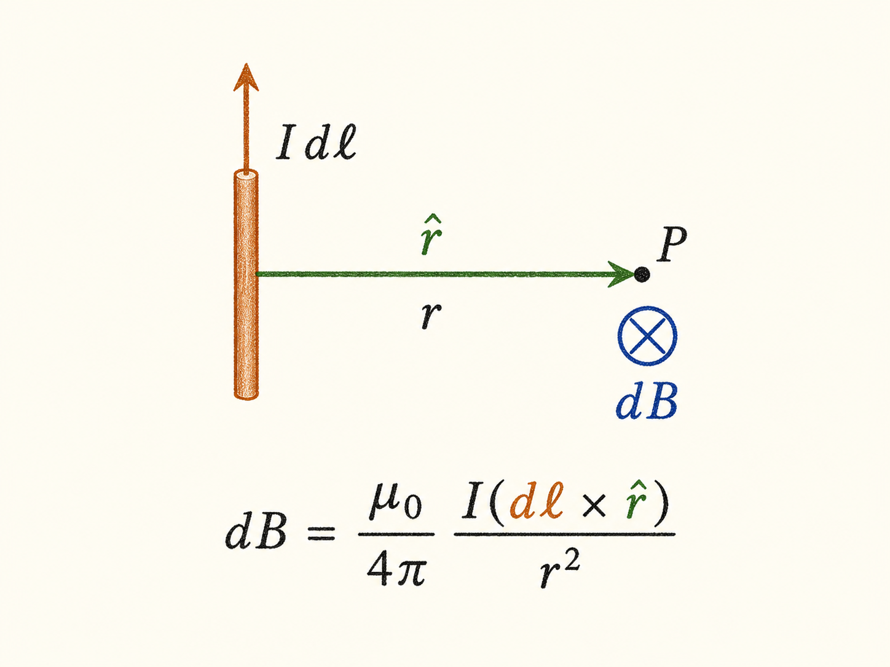
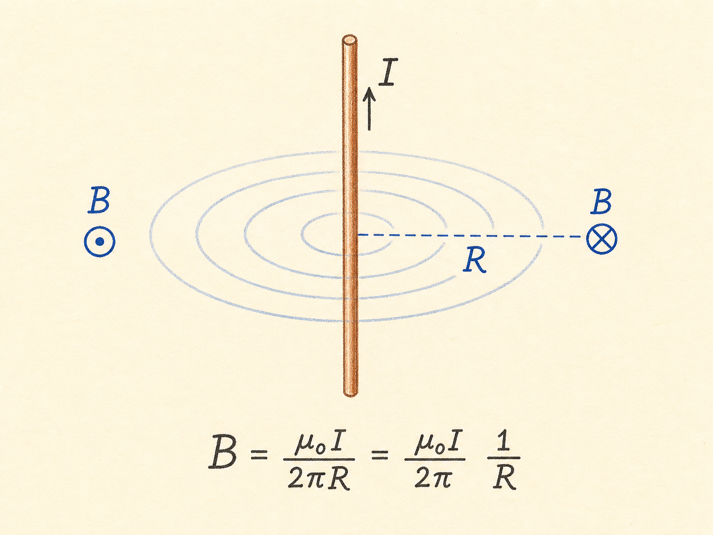
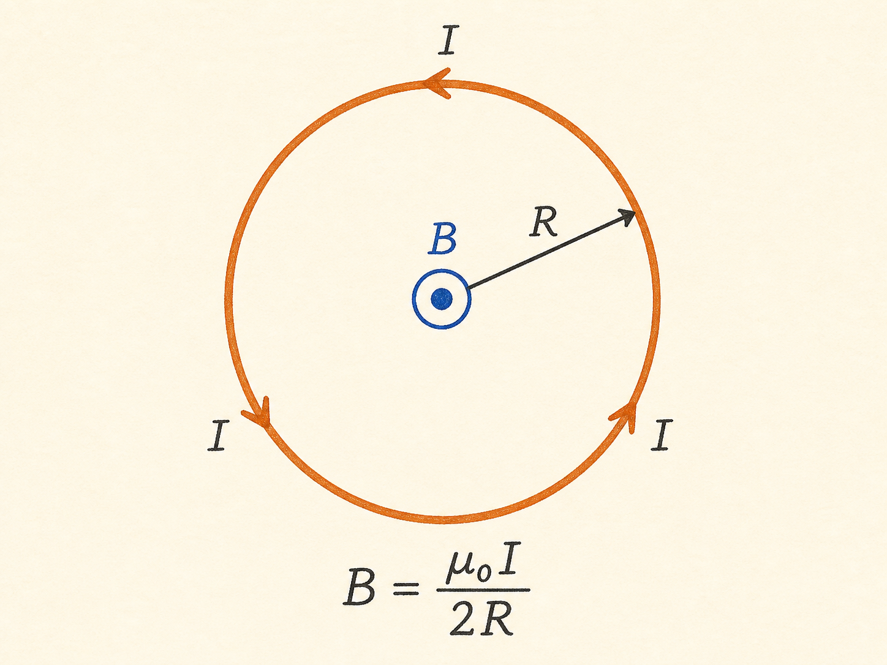
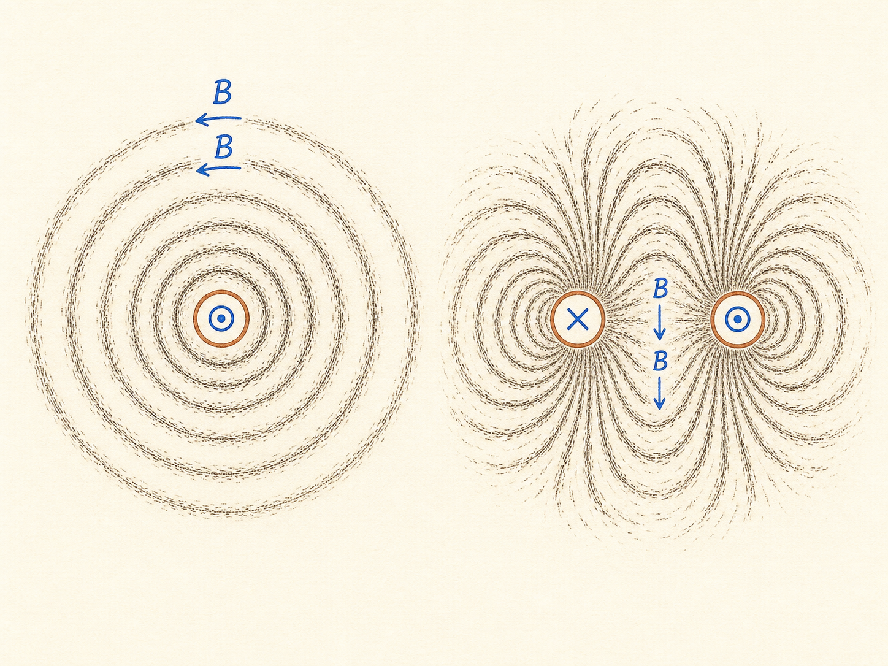
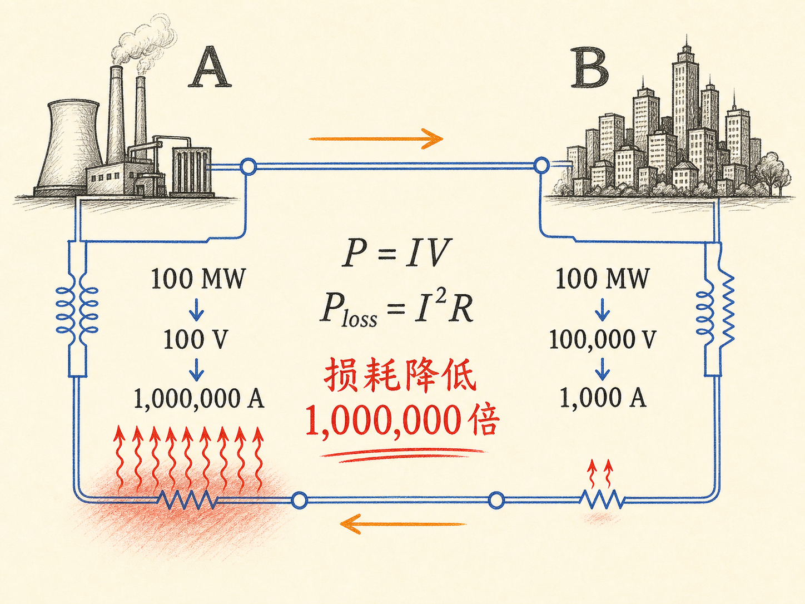
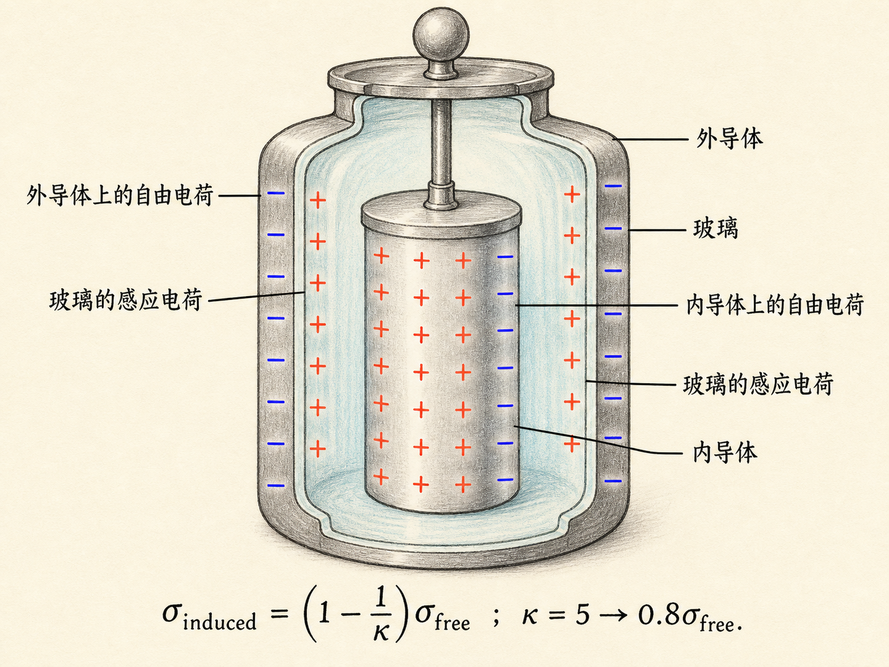
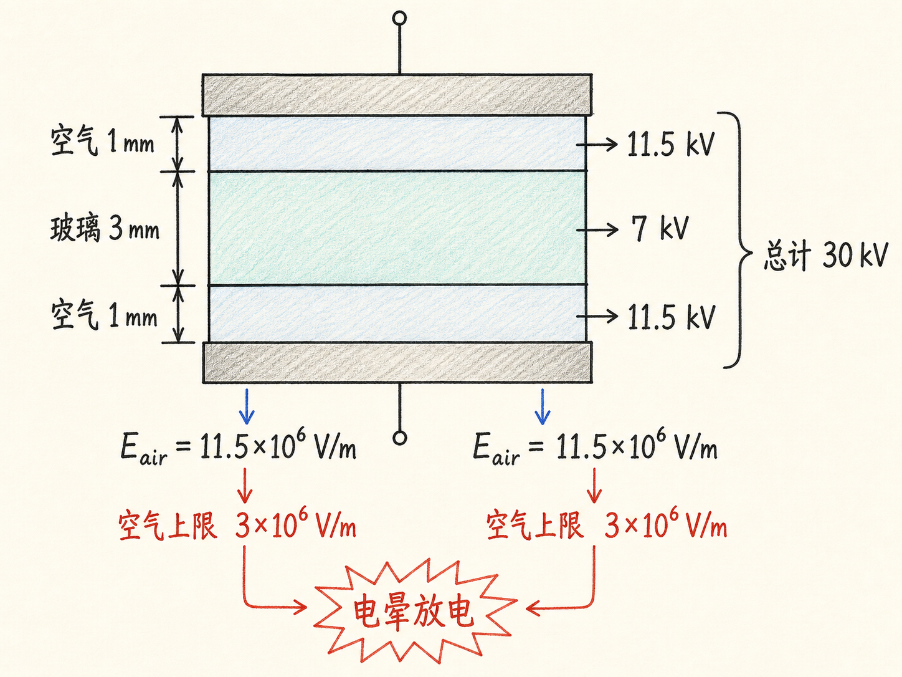
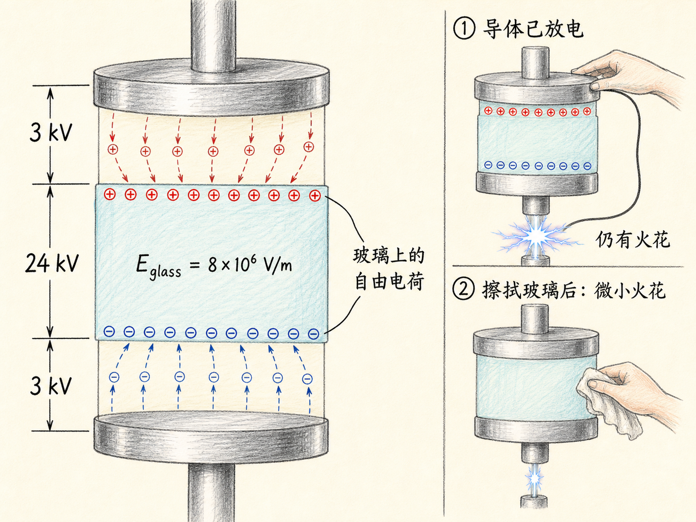

# 毕奥-萨伐尔定律：从载流导线的磁场，到输电损耗与莱顿瓶火花

一根直导线穿过撒有铁屑的平台。几百安培的电流一接通，轻轻敲动平台，铁屑便排成一圈圈同心圆。它们不是被导线“推成”圆形，而是在逐点指示导线周围磁场的方向。

同一堂课的后半段，另一只装置给出了更意外的现象：一个已经拆开、内外金属导体都用手放过电的莱顿瓶，重新组装后仍能打出明显火花。一个实验让看不见的磁场显形，另一个实验提醒我们，不能因为熟悉公式就忽略真实装置中的电场上限与电荷去向。

读完这篇，你会知道

- 毕奥-萨伐尔定律如何把一根导线拆成电流元，再叠加出总磁场
- 为什么长直导线的磁场按 $1/R$ 衰减，圆形电流环中心又得到 $B=\mu_0I/(2R)$
- 右手螺旋定则怎样确定直导线、圆环和两段反向电流附近的磁场方向
- 为什么高压输电能大幅降低 $I^2R$ 热损耗，又为什么电压不能无限升高
- 莱顿瓶的金属导体已经放电，重新组装后为什么仍会出现火花

## 从实验事实到一个电流元

先从直导线周围的实验事实出发。导线中的电流为 $I$，距离导线 $R$ 的位置上，磁场大小与 $I$ 成正比、与 $R$ 成反比；磁场线环绕导线成圆，方向由右手螺旋定则决定。

这里有一个熟悉的类比。单个电荷的电场按 $1/r^2$ 衰减，但把电荷均匀铺在一条无限长直线上，再把每一小段的贡献积分起来，最后会得到 $1/R$ 的距离关系。磁单极子虽然从未被观察到，但载流直导线的 $1/R$ 实验规律提示我们，可以把导线切成无数个微小电流元，让每个电流元先贡献一个按 $1/r^2$ 衰减的小磁场，再沿整根导线叠加。

设电流元为 $I\,d\boldsymbol\ell$，从电流元指向观察点的位移长度为 $r$，对应单位矢量为 $\hat{\mathbf r}$。毕奥-萨伐尔关系写成

$d\mathbf B=\dfrac{\mu_0}{4\pi}\dfrac{I\,d\boldsymbol\ell\times\hat{\mathbf r}}{r^2}$。

这个式子的每一部分都有明确任务：$I$ 越大，贡献越大；线元 $d\boldsymbol\ell$ 越长，贡献也越大；$1/r^2$ 决定距离衰减；叉乘 $d\boldsymbol\ell\times\hat{\mathbf r}$ 则同时给出夹角因子和方向。$\hat{\mathbf r}$ 是单位矢量，它不会额外改变大小。比例常数在 SI 单位制中是 $\mu_0/(4\pi)=10^{-7}$，其中 $\mu_0$ 称为真空磁导率。

要得到一整根导线产生的磁场，必须把所有电流元的 $d\mathbf B$ 按矢量相加，也就是沿导线积分。这里不能只加大小，因为不同位置的电流元可能给出不同方向的贡献。

## 长直导线：积分后为什么从 $1/r^2$ 变成 $1/R$

对无限长直导线，取观察点到导线的垂直距离为 $R$。导线上每个电流元到观察点的实际距离 $r$ 不同，$d\boldsymbol\ell$ 与 $\hat{\mathbf r}$ 的夹角也不同。沿整根导线完成积分后，结果是

$B=\dfrac{\mu_0 I}{2\pi R}$。

单个电流元的贡献含有 $1/r^2$，但无限多个电流元沿直线分布，积分后的总场按 $1/R$ 衰减。这不是两个规律互相矛盾，而是“局部贡献”和“整个几何体叠加结果”的区别。

方向由右手螺旋定则判断。若电流在黑板平面内向上，黑板一侧的磁场指入板内，另一侧则指出板外；若导线垂直纸面并朝向观察者，磁场沿逆时针绕行，电流背离观察者时则沿顺时针绕行。这里描述的是“电流产生 $\mathbf B$ 的方向”，不是“运动电荷在磁场中所受力的方向”，两者不能混用。

代入一个量级：$I=100\,\mathrm A$，$R=0.1\,\mathrm m$，得到 $B=2\times10^{-4}\,\mathrm T$，约为 2 高斯。地磁场约为 0.5 高斯；若观察点退到 1 米，导线磁场还会再小 10 倍。因此课堂上若想用铁屑清楚显示场线，必须使用数百安培的大电流。

## 圆形电流环：所有电流元在圆心同向叠加

再看半径为 $R$ 的圆形电流环。圆心到环上任意电流元的距离都等于 $R$，而且每个 $d\boldsymbol\ell$ 都与指向圆心的 $\hat{\mathbf r}$ 垂直，所以夹角的正弦恒为 1。更重要的是，每个电流元在圆心产生的 $d\mathbf B$ 都沿圆环轴线指向同一侧，没有互相抵消。

于是积分只剩下沿圆周把 $dl$ 加起来：$\oint dl=2\pi R$。代入毕奥-萨伐尔关系，得到圆环中心磁场

$B=\dfrac{\mu_0 I}{2R}$。

电流方向一旦反转，中心磁场方向也反转。观察圆环时，可以把近侧与远侧导线分别看成“电流出纸面”和“电流入纸面”的两段，再逐段用右手螺旋定则判断局部绕行方向；这些局部圆形场线向外延伸后，共同形成穿过圆环中心的整体磁场线。

仍取 $I=100\,\mathrm A$、$R=0.1\,\mathrm m$，圆环中心的磁场为 $6\times10^{-4}\,\mathrm T$，也就是 6 高斯。轴线上其他位置也可以用同一积分思路计算；圆环平面内的任意点则难得多，原则上仍可计算，但实际往往需要计算机。

远离圆环时，它的磁场线构型与电偶极子的远场电场线很相似。不过两者有一个根本差别：包围电荷的闭合曲面可以有非零净电通量，而任何闭合曲面的净磁通量都为零，即

$\oint\mathbf B\cdot d\mathbf A=0$。

这意味着画出的磁场线不会凭空开始或终止；它们穿入闭合曲面的部分，必然以相同净量穿出。

## 铁屑把叠加结果直接摆在眼前

课堂演示先让一根导线垂直穿过平台。汽车电池提供数百安培电流，撒在平台上的铁屑在通电后沿圆周排列。这个图样直接显示了单根直导线附近的磁场方向。

第二个演示使用两段垂直平台、方向相反的电流：一段进入平面，另一段从平面出来。每根导线附近仍以各自为中心形成近似圆形的场线；在两根导线之间，两套局部磁场按方向叠加，铁屑排出与圆形电流环剖面相似的整体构型。判断这张图时，要逐段应用右手螺旋定则，再把两个结果相加，不能只凭“看起来像一个环”猜方向。

## 课堂转向实际问题：为什么远距离输电要提高电压

讲完载流导线的磁场，课堂转向了电能输送。设发电站位于 A 点，用户位于 B 点，输电电缆和回流电缆构成完整回路。若回流线电势取零，发电站送出端电势为 $V_A$，用户端为 $V_B$，电缆电阻为 $R$，则

$V_A-V_B=IR$，也就是 $V_B=V_A-IR$。

用户得到的功率为

$P_B=IV_B=IV_A-I^2R$。

$IV_A$ 是发电站送出的功率，$I^2R$ 是电缆变热所消耗的功率。要降低损耗，可以减小 $R$，而均匀导线的电阻满足 $R=\rho L/A$：增大铜线截面积、换用更低电阻率的材料或采用需要低温冷却的超导材料都能减小电阻，但代价很高。

另一个办法是直接减小电流。假设用户需要 100 兆瓦功率：若用户端只有 100 伏，电流需要 100 万安培；若电压提高到 10 万伏，电流只需 1000 安培。电流降低 1000 倍，$I^2R$ 损耗就降低 100 万倍，所以远距离输电要尽可能采用高电压，到达用户附近后再用变压器降压。

但“尽可能高”并不是“没有上限”。空气中的电场接近 $3\times10^6\,\mathrm{V/m}$ 时会发生击穿或电晕放电，输电线表面发光并产生额外损耗。课堂给出的典型量级是：电缆半径约 2 厘米，截面积约 $10^{-3}\,\mathrm{m^2}$，输电电压约 300 千伏。

如果铜线长 1000 千米，取 $\rho=2\times10^{-8}\,\Omega\cdot\mathrm m$，电阻为

$R=\rho\dfrac{L}{A}=20\,\Omega$。

再取 $I=300\,\mathrm A$，发电站送出功率约为 $300\,\mathrm{kV}\times300\,\mathrm A=90\,\mathrm{MW}$；线路损耗 $I^2R$ 约为 2 兆瓦，约占 2%；电压下降 $IR$ 约为 6 千伏。提高电压确实把损耗控制在较小比例内，但雷暴可能抬高导线附近电场，让输电线出现可见辉光和噼啪声，这正是电晕放电在真实线路上的表现。

## 已经放过电的莱顿瓶，为什么还能打出火花

课堂最后重新做了莱顿瓶实验。莱顿瓶本质上是一个电容器：内、外两个金属导体之间夹着玻璃电介质。充电后，导体上有自由电荷 $\sigma_{\mathrm{free}}$，玻璃极化后出现感应电荷。课程给出的关系是

$\sigma_{\mathrm{induced}}=\left(1-\dfrac{1}{\kappa}\right)\sigma_{\mathrm{free}}$。

若玻璃的介电常数 $\kappa=5$，感应表面电荷密度约为自由表面电荷密度的 0.8 倍。照这个模型推想，只要拆开莱顿瓶并触摸内外金属导体，把导体上的自由电荷全部去掉，玻璃上的感应电荷也应随之消失，重新组装后不该再有能量。

真实演示却出现了明显火花。问题不在于公式失效，而在于此前把玻璃上的电荷全部当成了“由极化产生的感应电荷”。如果充电时空气隙的电场已经超过击穿阈值，电晕放电会把真正的自由电荷喷到玻璃表面。玻璃是绝缘体，触摸金属导体很容易把导体放电，却很难去掉黏在玻璃表面的自由电荷。

## 用三层电势差算出电晕放电必然发生

把瓶状结构简化成“1 毫米空气隙—3 毫米玻璃—1 毫米空气隙”三层，设总电势差为 30 千伏，玻璃的 $\kappa=5$。若先假设玻璃中电场是空气中的 $1/5$，则

$2E_{\mathrm{air}}(1\,\mathrm{mm})+\dfrac{E_{\mathrm{air}}}{5}(3\,\mathrm{mm})=30\,\mathrm{kV}$。

解得空气隙中的电场为 $11.5\times10^6\,\mathrm{V/m}$，玻璃中为 $2.3\times10^6\,\mathrm{V/m}$。对应三层电势差依次为 11.5 千伏、7 千伏、11.5 千伏，总和正好是 30 千伏。

数值相加没有问题，物理假设却无法维持：空气中的 $11.5\times10^6\,\mathrm{V/m}$ 远高于 $3\times10^6\,\mathrm{V/m}$ 的击穿电场。于是空气隙发生电晕放电，自由电荷被输送到玻璃表面，原来只含极化电荷的模型随之失效。

电晕发生后，两个空气隙的电场被限制在约 $3\times10^6\,\mathrm{V/m}$，每个 1 毫米空气隙承担约 3 千伏。总电势差仍是 30 千伏，剩余 24 千伏只能落在 3 毫米玻璃上，所以玻璃中的电场变成

$E_{\mathrm{glass}}=\dfrac{24\,\mathrm{kV}}{3\,\mathrm{mm}}=8\times10^6\,\mathrm{V/m}$。

玻璃中的场现在反而比空气隙中更强，因为玻璃表面已经带有自由电荷，电场不再只由外加场和介质极化决定。按照课堂给出的计算，玻璃表面的自由电荷约为导体上自由电荷的 12 倍。因此，拆开后只给金属导体放电，实际上只去掉了较小一部分电荷，大部分能量仍保存在玻璃表面电荷建立的场中。

最后的复现实验把这个判断直接交给现象检验。教授再次给莱顿瓶充电并拆开，不只触摸内外导体，还尽力擦拭玻璃内表面以去除自由电荷。重新组装并短接后，只剩一个很小、甚至不易看见的火花。

## 三个看似分开的部分，共用同一种思考方式

毕奥-萨伐尔定律要求先找出每个电流元的局部贡献，再按方向叠加；输电问题要求把用户得到的功率和电缆中的 $I^2R$ 损耗分别记账；莱顿瓶则要求把导体自由电荷、玻璃极化产生的感应电荷和电晕喷到玻璃上的自由电荷分开。

三段内容研究的对象不同，却都在提醒同一件事：公式里的每一项必须对应真实的物理对象、方向和成立条件。少算一段导线、混淆一种电荷，或者忽略空气能承受的最大电场，都会得到形式上顺畅、实验上却站不住的结论。
