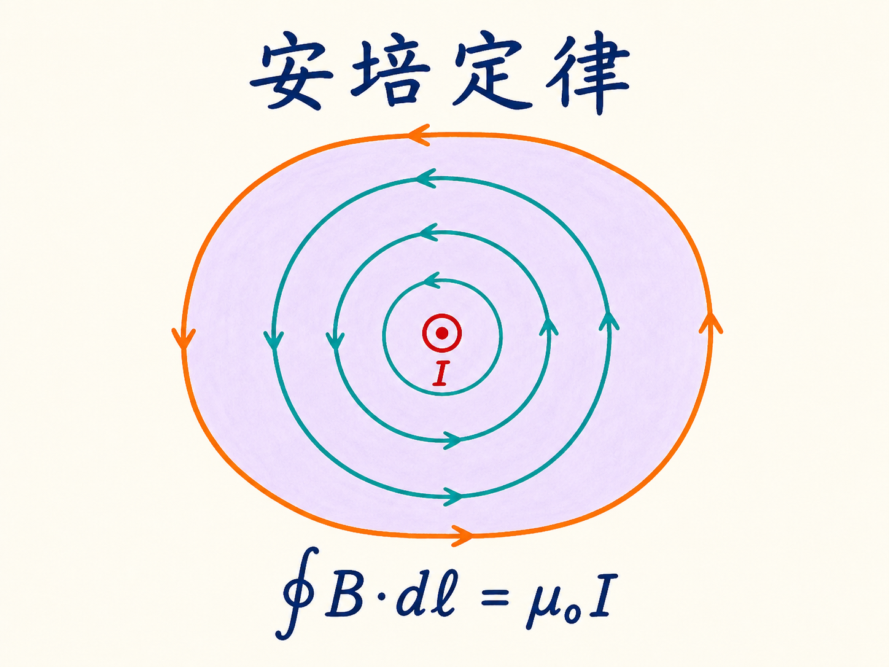
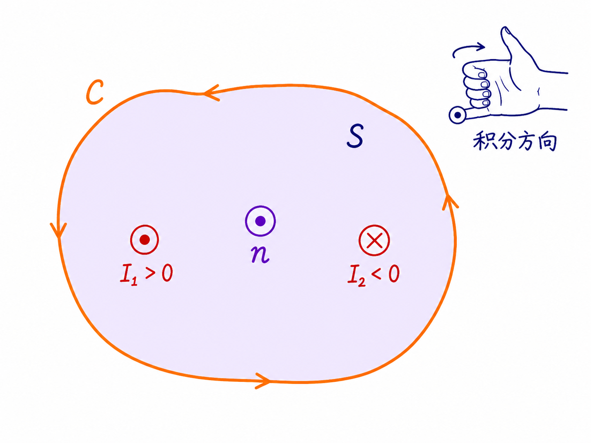
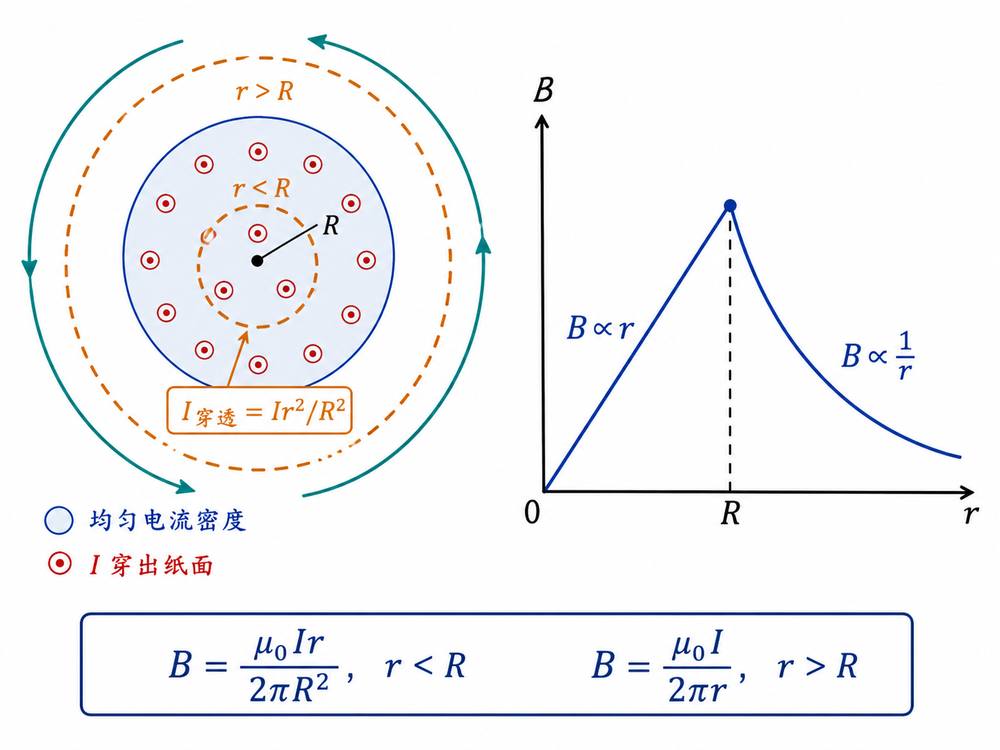
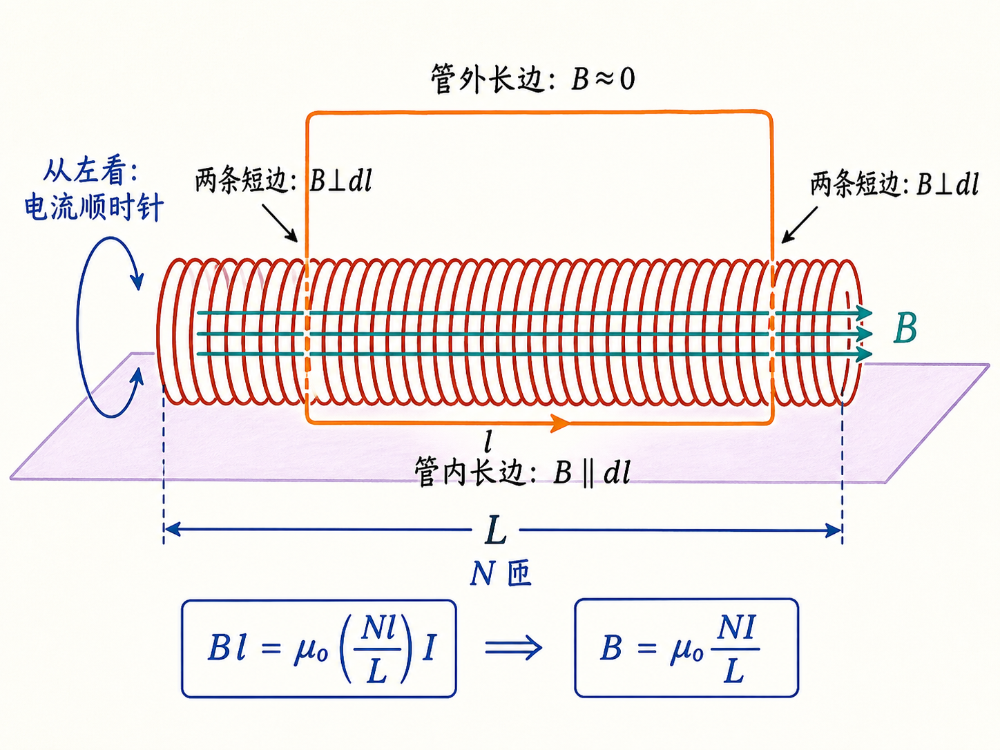
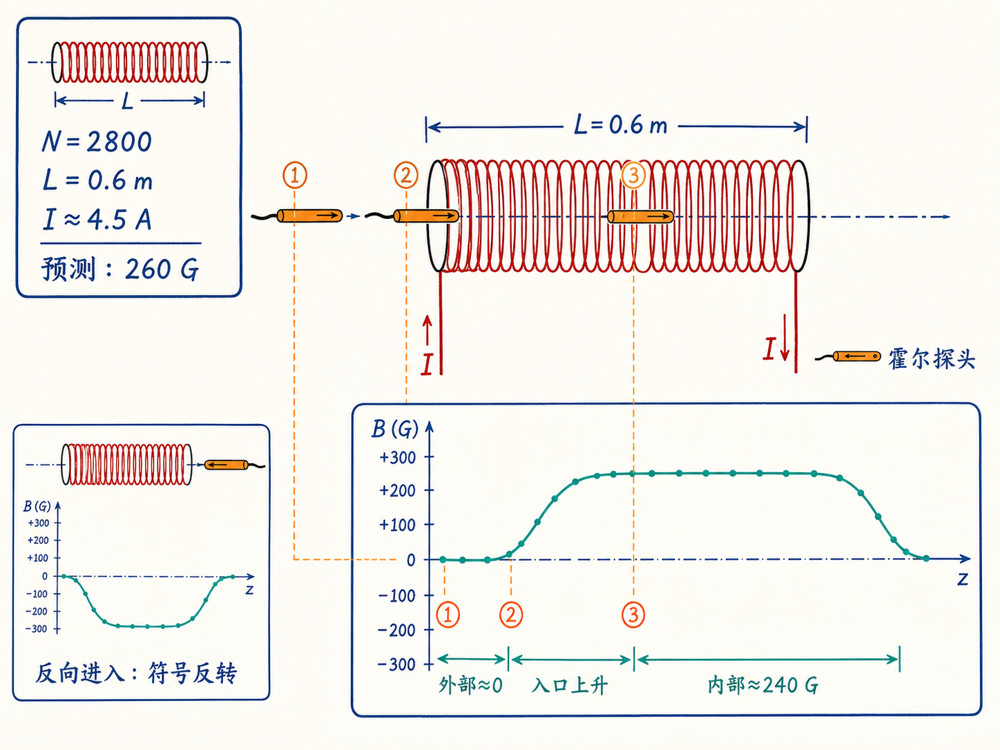
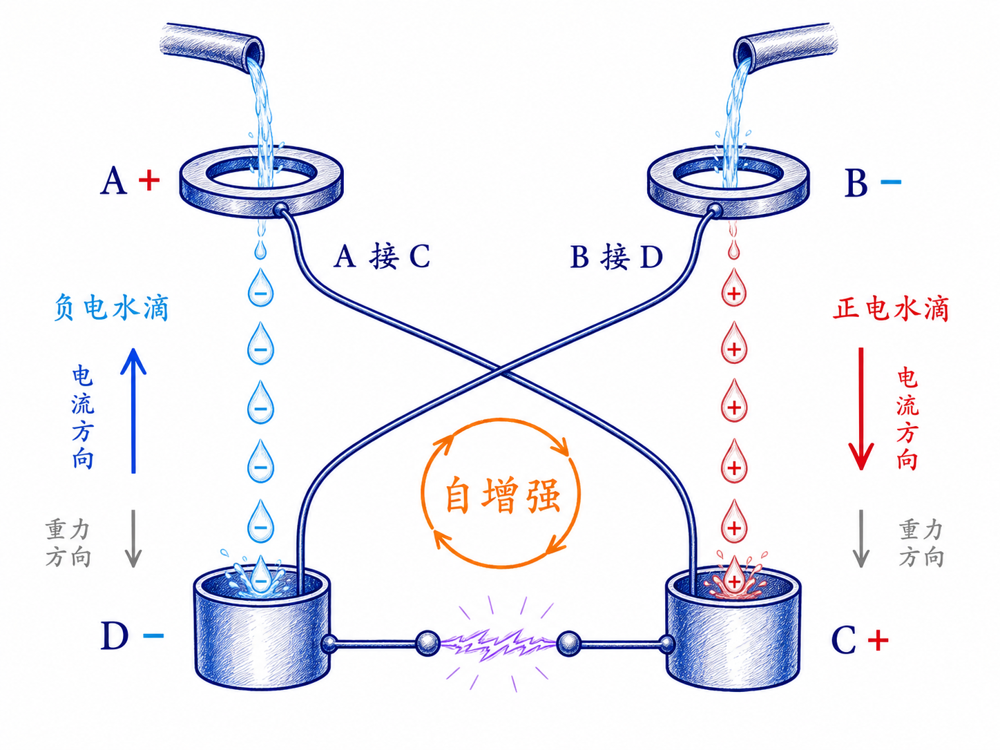

# 安培定律：沿一条闭合路径，读出穿过曲面的电流

一根笔直导线垂直穿过黑板，电流朝向你。导线周围的磁场沿同心圆切向绕行，离导线越远，磁场越弱。奇怪的是，如果沿任意一个同心圆走一整圈，把沿途的磁场与微小路程逐段相乘再相加，结果不会随圆的大小改变。

更反直觉的是，这条闭合路径甚至不必是圆。只要把路径方向、附着曲面和电流正负约定清楚，任意闭合曲线都能写出同一个关系。安培定律真正提供的，不是一条只能套在圆上的公式，而是一种把“环路上的磁场”与“穿过曲面的电流”联系起来的方法。

读完这篇，你会知道

- 为什么直导线周围的环路积分与半径无关？
- “闭合路径包围的电流”为什么不如“穿透曲面的电流”准确？
- 均匀载流圆导线内部和外部的磁场为什么分别按 $r$ 与 $1/r$ 变化？
- 螺线管内部的磁场为什么取决于单位长度匝数？
- Kelvin 滴水起电机如何靠重力持续充电，并用火花与水流形状显示充放电？

## 从直导线的圆形磁场开始

对一根很长的直导线，电流 $I$ 垂直穿过黑板。距离导线为 $r$ 的位置，磁场大小为

$B=\dfrac{\mu_0 I}{2\pi r}$。

磁场方向沿以导线为圆心的圆周切线。现在选取半径为 $r$ 的圆形路径，并规定沿磁场方向行走。路径上每一点的 $d\mathbf l$ 都与 $\mathbf B$ 同向，所以点积不需要再乘夹角因子：

$\oint \mathbf B\cdot d\mathbf l=B(2\pi r)=\mu_0 I$。

半径增大时，圆周长度按 $r$ 增大，而磁场按 $1/r$ 减小，两者正好抵消。因此，无论沿哪个同心圆走一圈，积分都等于 $\mu_0 I$。

这里有两个容易混淆的长度元。毕奥-萨伐尔定律里，$d\mathbf l$ 可以表示载流导线上的微小线段；安培环路积分里，$d\mathbf l$ 是你沿所选闭合路径行走的微小位移。两者可能写成相同符号，却位于不同的曲线上，承担不同的计算角色。

## 路径不必是圆，但必须先把方向说清楚

安培的关键认识是：闭合路径可以是任意形状。一般形式写成

$\oint_C \mathbf B\cdot d\mathbf l=\mu_0 I_{\text{穿透}}$。

圆形路径只是在对称性足够好时最容易计算。若路径弯弯曲曲，局部的 $\mathbf B$ 与 $d\mathbf l$ 未必同向，点积会自动只取磁场沿路径切向的分量。安培定律仍成立，只是这个积分不一定容易求。

“穿透电流”需要一张曲面才能定义。给闭合路径 $C$ 附上一张以它为边界的开曲面 $S$。曲面可以平，也可以像帽子或鼓起的塑料袋；重要的是，它的边缘就是 $C$。电流若从曲面一侧穿到另一侧，就计入 $I_{\text{穿透}}$。

环路方向与曲面法向通过右手螺旋约定绑定。右手四指沿积分方向弯曲，大拇指所指就是正法向；沿正法向穿出曲面的电流取正，反向穿入取负。如果把环路方向反过来，$d\mathbf l$ 的方向反转，曲面正法向也随之反转，所以等式左右两侧会同时改变符号。

因此，安培定律不要求你顺时针或逆时针走。它只要求：先选定环路方向，再用同一个右手约定确定电流正负。与其含糊地说“路径包围了多少电流”，更准确的说法是“有多少带符号的电流穿透了附着曲面”。

## 为什么选对环路比套公式更重要

任何闭合路径都能写进安培定律，但并非任何路径都能帮你把 $B$ 算出来。实用步骤是：

1. 先从电流分布识别对称性。
2. 选择一条能让 $B$ 在某些线段上恒定、平行或垂直于 $d\mathbf l$ 的闭合路径。
3. 给路径附上一张便于数穿透电流的开曲面。
4. 由环路方向确定曲面正法向，再给各股穿透电流标正负。
5. 分段计算 $\mathbf B\cdot d\mathbf l$，而不是只看磁场大小。

圆柱对称的问题常选圆，长螺线管的问题常选矩形。路径的形状不是由定律强制规定，而是由“怎样让积分可计算”决定。

## 均匀载流圆导线：外部按 $1/r$，内部按 $r$

考虑一根半径为 $R$ 的圆柱导线，电流 $I$ 从黑板内朝向我们，并在截面内均匀分布。由于圆柱对称性，以导线轴为圆心、半径为 $r$ 的圆周上，磁场大小处处相同，方向沿圆周切向。取逆时针环路时，$\mathbf B$ 与 $d\mathbf l$ 同向。

先看导线外部，即 $r>R$。整个电流 $I$ 都穿过圆形曲面：

$B(2\pi r)=\mu_0 I$，

所以

$B=\dfrac{\mu_0 I}{2\pi r}$，$\qquad r>R$。

这就是外部磁场按 $1/r$ 衰减的原因。

再看导线内部，即 $r<R$。此时不能把总电流 $I$ 直接放到等式右边。电流密度均匀，半径 $r$ 的圆只截取了总截面积的 $r^2/R^2$，所以穿透电流为

$I_{\text{穿透}}=I\dfrac{r^2}{R^2}$。

代入安培定律：

$B(2\pi r)=\mu_0 I\dfrac{r^2}{R^2}$，

得到

$B=\dfrac{\mu_0 I}{2\pi R^2}r$，$\qquad r<R$。

这里很关键：内部环路缩小时，穿透电流按面积 $r^2$ 减少，而环路长度只按 $r$ 减少，最后留下一个 $r$，所以磁场从轴心的零值开始线性增大。到导线表面 $r=R$，内外两条公式都给出

$B(R)=\dfrac{\mu_0 I}{2\pi R}$。

因此，$B(r)$ 在导线内部是一条上升直线，在表面达到最大值，随后在外部按 $1/r$ 下降。这里计算的是电流产生的磁场分布；它与“给定速度和电荷后，磁场通过洛伦兹力产生什么受力”是另一个问题，不能把磁场方向直接画成受力方向。

## 螺线管：用一个矩形把复杂绕组变简单

螺线管像一根绕得很密的弹簧，电流一圈接一圈流过。单个电流环的磁场会在空间中弯回；许多同向线圈沿轴向紧密排列后，各环在内部的磁场相互叠加，内部场越来越接近沿轴向的均匀场，外部场则很弱。

设螺线管长度为 $L$，总匝数为 $N$，每匝电流为 $I$。课程采用两个近似：管内磁场沿轴向且大小近似恒定，管外磁场近似为零。这个近似适用于长度 $L$ 明显大于线圈半径的螺线管。

选一个跨过螺线管边界的矩形环路，其中一条长度为 $l$ 的边位于管内并沿磁场方向，另一条平行边位于管外，两条短边垂直于磁场。分四段看积分：

- 管外长边上，$B$ 近似为零，贡献近似为零。
- 两条短边上，$\mathbf B\perp d\mathbf l$，点积为零。
- 只有管内长边上，$\mathbf B\parallel d\mathbf l$ 且大小近似恒定，贡献为 $Bl$。

再数穿过矩形曲面的电流。总长 $L$ 内有 $N$ 匝，所以长度 $l$ 内有 $Nl/L$ 匝；每一匝携带电流 $I$ 穿过曲面。于是

$Bl=\mu_0\left(\dfrac{Nl}{L}\right)I$，

消去 $l$ 后得到

$B=\mu_0\dfrac{N}{L}I$。

公式中出现的是单位长度匝数 $N/L$，而不是总匝数 $N$ 单独决定磁场。原因很直接：把螺线管无限延长、在极远处增加一匝，那一匝在当前测量点的磁场已经很弱；只有测量点附近的绕组密度持续影响局部场强。若把所有线圈真正叠在同一位置，它们的场才会在同一点直接相加。

## 从 260 高斯的预测到 240 高斯的测量

课程中的螺线管有约 $N=2800$ 匝，长度 $L=0.6\ \mathrm m$，预估电流 $I=4.5\ \mathrm A$。代入 $\mu_0=4\pi\times10^{-7}$：

$B=\mu_0\dfrac{N}{L}I\approx0.026\ \mathrm T\approx260\ \mathrm G$。

实验中实际电流约为 $4.8\ \mathrm A$。能分辨磁场方向的霍尔探头从距入口约一英尺处逐渐靠近：远处几乎没有读数，接近入口后开始出现磁场，进入内部后依次达到约 100 高斯、200 高斯，深处约为 240 高斯。继续在内部前后移动约 20 厘米，读数大致不变；从另一端测量时，探头显示相反符号。移到螺线管外部，读数又接近零。

这个演示检验的不是“公式每一位数字都必须毫无偏差”，而是推导中最重要的场分布假设：紧密绕制、足够长的螺线管内部磁场近似均匀，外部磁场很弱。另一个只有七匝、绕得很松的线圈也展示了同一趋势：通入大电流后，铁屑在内部沿轴向排列，外部铁屑没有明显优先方向。

## 课堂后半：Kelvin 滴水起电机为什么能自己越充越高

课程随后回到 Kelvin 滴水起电机。它有两只感应桶 A、B，两股水从上方经过感应桶后，分别落入导体收集桶 D、C。交叉连接是整个反馈的关键：A 接 C，B 接 D。两只放电球连接在系统两侧；水流运行一段时间后，球间会产生火花。间距约 6 毫米时，电势差约为 20 千伏。

先假设 A 偶然带有一点正电。它使经过附近的水极化：靠近 A 的水滴一端略带负电。水滴断开后把负电带入 D，D 又让与它相连的 B 变负。B 再把另一股水反向极化，使落入 C 的水滴带正电；C 与 A 相连，于是 A 变得更正。

于是形成一条正反馈链：

$A\text{ 更正}\rightarrow D\text{ 收集负电}\rightarrow B\text{ 更负}\rightarrow C\text{ 收集正电}\rightarrow A\text{ 更正}$。

如果初始随机电荷的极性相反，整套极性也会反过来，但反馈仍能启动。连续水流可以看成连续落下的水滴；水中的 $\mathrm{H^+}$ 与 $\mathrm{OH^-}$ 承担电荷输运。系统不断充电，直到局部电场达到约 $3\times10^6\ \mathrm{V/m}$，空气击穿，放电球间出现火花。

## 是重力在给这只“电池”做功

这套装置没有化学电池，却能把电势差推高到约 20 千伏，能量从哪里来？课程通过电流与电场方向回答：重力在做功。

负电水滴向下运动，对应约定电流向上；正电水滴向下运动，对应约定电流向下。电场从正电势一侧指向负电势一侧。对其中一些带电水滴，电场力倾向于让它们朝另一个方向运动，而重力强迫它们继续下落。也就是说，水滴下降的重力势能被用来逆着相应的电作用搬运电荷，系统因而被充电。

临近火花时，带电水流明显向感应桶偏转并扇形散开。火花发生后，系统电场骤降，水流恢复为较窄的一束；随后再次充电，水流又逐渐展开。因此，不只电场仪表能显示“充电—放电”循环，水流形状和声音也在显示同一过程。

把两只放电球拉得很开，球间不再出现火花，但装置的尖锐边缘会在别处发生连续电晕放电。此时电荷持续泄放，水流一直保持散开。再把球靠近，电晕停止，球间重新出现火花，水流随即收窄并重新开始下一轮展开。

## 随机启动，也可以被外部电荷选定方向

滴水起电机靠极小的随机初始电荷启动，所以两种极性方向都可能出现。把感应桶与喷口距离拉大，桶对水的极化变弱，系统启动变慢，甚至不能自行启动。课程演示中，距离约 50 厘米时装置仍意外地缓慢启动；继续拉大到约 80 至 85 厘米后，可以把一块带负电圆盘靠近 B 上方喷口，暂时规定水的极化方向，帮助系统沿预期极性建立反馈。

外部圆盘只负责给出启动偏置。一旦交叉连接形成的正反馈接管，A、B 上的电荷会继续缓慢增加。演示也显示，随机初始电荷可能让系统先沿一个方向启动，后来再转向另一个方向；极性不固定，但反馈机制不变。

## 把安培定律复述成一个可执行的方法

安培定律可以压缩成一句话：沿闭合路径累加磁场的切向分量，结果等于 $\mu_0$ 乘以按右手约定穿过附着曲面的带符号电流。

真正解题时，还要补上四个动作：利用对称性选环路；明确 $d\mathbf l$ 的方向；给环路附上曲面并数穿透电流；逐段判断 $\mathbf B$ 与 $d\mathbf l$ 是平行、垂直还是成其他角度。均匀载流导线和长螺线管之所以能迅速求解，不是因为安培定律只适用于圆和矩形，而是因为这两种路径把点积和穿透电流都变得容易计算。

这条定律描述的是电流如何与环路上的磁场联系。课程也提醒，它还只是第三条麦克斯韦方程的近似前身，未来需要修正。此刻最重要的是先把路径、曲面、方向和符号定义清楚：只要这四件事不含糊，复杂的磁场问题才可能被一条闭合环路化简。
