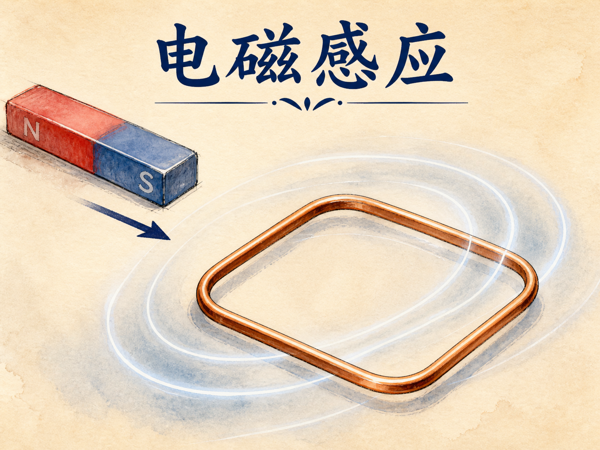
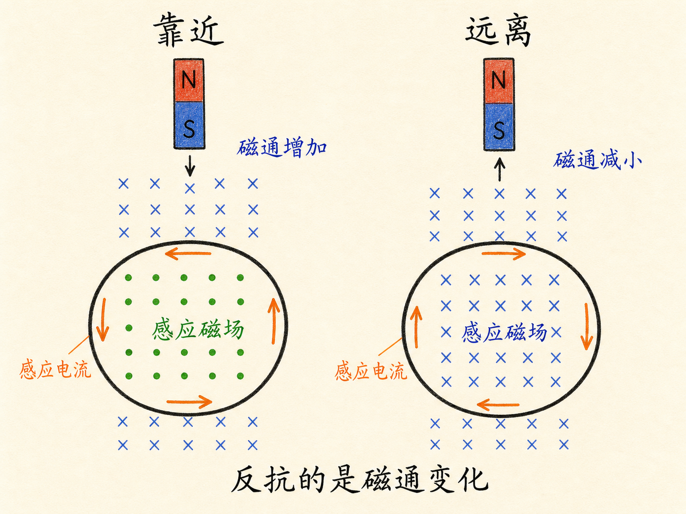
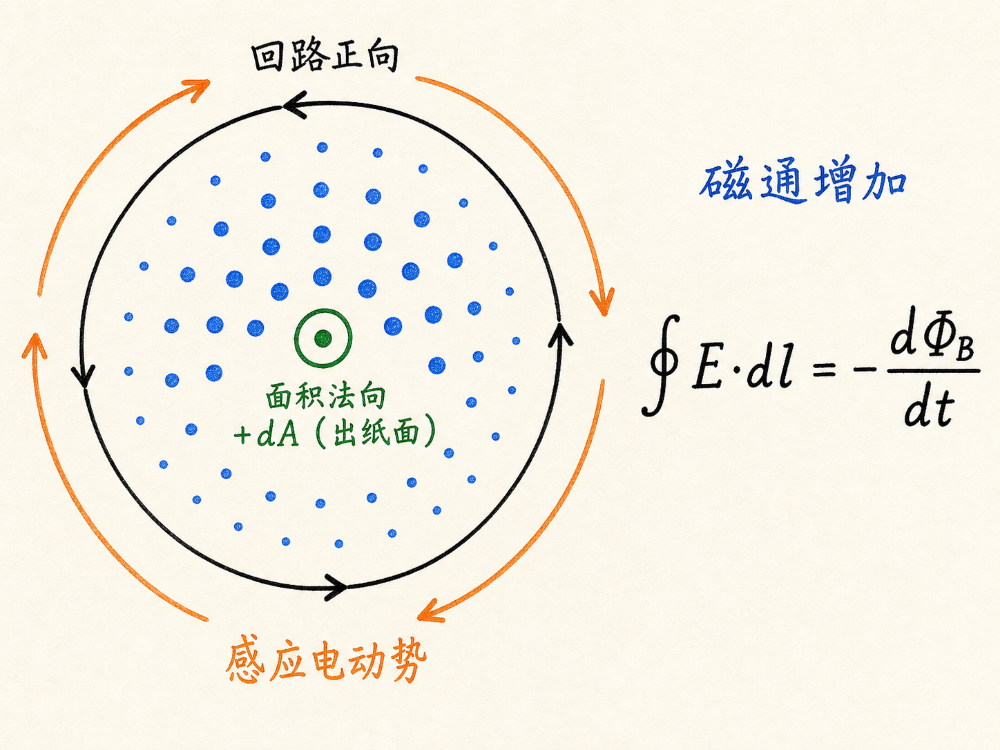
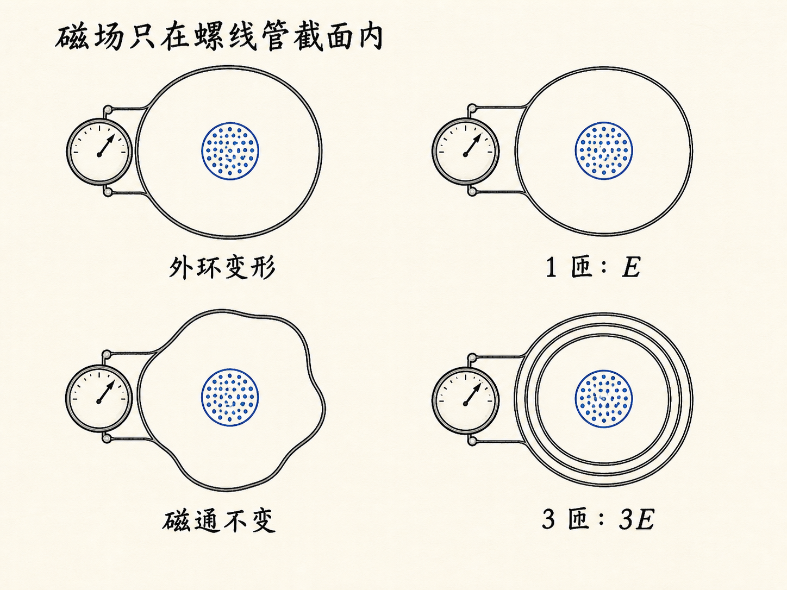
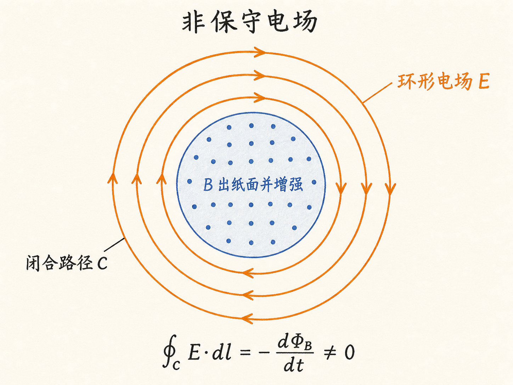
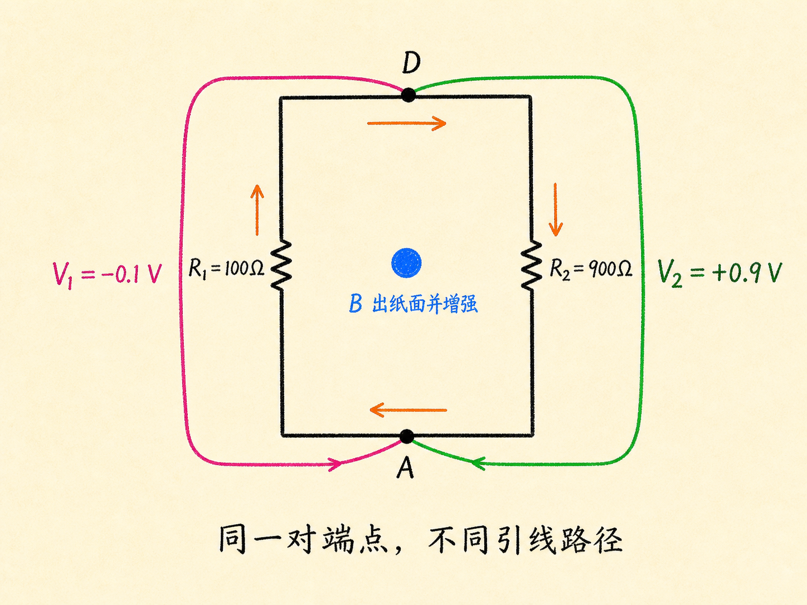

# 电磁感应：变化的磁通如何生出环形电场

把条形磁铁停在线圈中央，磁场可以很强，电流表却一动不动。把磁铁向线圈推进，指针立刻偏转；再把磁铁抽走，指针反向偏转。决定电流是否出现的，不是“这里有没有磁场”，而是穿过线圈的磁通量是否正在变化。

这个差别会迫使我们放弃一个熟悉的直觉：电场并不总能用两个端点之间唯一的电势差来描述。变化磁通产生的电场可以沿闭合回路环绕，它是非保守的。

读完这篇，你会知道

- 为什么稳恒磁场不能维持感应电流，开关瞬间却可以
- 怎样把楞次定律、回路绕向和面积法向放在同一套方向约定里
- 为什么多绕几匝就能得到更大的感应电动势
- 为什么两只连接同一对节点的电压表可能读出不同数值

## 关键不是磁场，而是变化

奥斯特发现稳恒电流会产生稳恒磁场后，法拉第反过来问：稳恒磁场能否产生稳恒电流？他用电池和开关驱动螺线管，再在螺线管外套上第二个闭合线圈。只要螺线管中的电流保持不变，第二个线圈中就没有持续电流。

真正的线索出现在开关动作的瞬间。闭合开关时，第二个线圈中短暂出现电流；断开时，电流再次出现，而且方向相反。开关没有把第二个线圈接上电池，它改变的是螺线管的磁场。因此，能够产生电流的是变化的磁场，而不是稳恒磁场。

条形磁铁演示把这件事表现得更直接。磁铁越快靠近线圈，单位时间内磁场变化越快，电流表偏转越大；磁铁缓慢移动，偏转很小；磁铁静止，即使线圈内磁场已经很强，偏转仍回到零。

闭合导体中因此出现了感应电动势 $\mathcal E$。电动势不是力，而是推动电荷沿回路运动的环路量。若回路总电阻为 $R$，感应电流为 $I$，仍满足 $\mathcal E=IR$。

## 楞次定律判断的是“反抗哪一种变化”

设条形磁铁从上方向线圈靠近，穿过线圈的磁场指向下方，而且磁通量的大小正在增加。感应电流必须产生一个向上的磁场，反抗这种“向下磁通增加”。如果磁铁开始远离，向下磁通不再增加而是减小，感应电流就反向，试图维持原来的向下磁通。

这里要把三件事分开：磁场指向哪里、磁通量大小在增加还是减小、感应线圈要产生哪个方向的磁场。楞次定律反抗的是磁通量的变化，不是简单反抗磁场本身。

确定感应磁场方向后，再用右手定则得到电流绕向。四指沿电流方向弯曲，拇指指向线圈产生的磁场方向。换到线圈另一侧观察，同一电流会从顺时针变成逆时针，所以判断时必须说清观察方向。

楞次定律能解决方向问题，却不能单独算出电流强弱。定量计算还需要磁通量。

## 磁通量把磁场、面积和方向合在一起

给闭合回路 $C$ 附着一个开曲面 $S$。曲面每个位置都有局部面积矢量 $d\mathbf A$，它垂直于曲面。穿过曲面的磁通量定义为

$\Phi_B=\int_S\mathbf B\cdot d\mathbf A$。

点积意味着只有磁场在面积法向上的分量计入磁通量。面积变大、磁场变强，或者磁场与法向之间的夹角改变，都可能改变磁通量。法拉第的实验说明，感应电动势取决于磁通量变化率：

$\mathcal E=\oint_C\mathbf E\cdot d\mathbf l=-\frac{d\Phi_B}{dt}=-\frac{d}{dt}\int_S\mathbf B\cdot d\mathbf A$。

左边是沿闭合回路的电场线积分，右边是穿过所附曲面的磁通量变化率。负号就是楞次定律的数学表达：选定回路正向后，感应电动势总朝着反抗磁通变化的方向。

## 回路绕向和面积法向必须成对选择

法拉第定律不规定必须顺时针还是逆时针绕行，但一旦选定绕行方向，面积法向就不能独立选择。右手四指沿回路正向弯曲，拇指给出 $d\mathbf A$ 的正方向。若反转绕行方向，面积法向也必须反转，$\Phi_B$ 与环路积分会同时改变符号，等式仍保持一致。

曲面不必是平面。它可以像袋子一样鼓起，只要边界仍是同一条闭合回路。由于磁场的闭合曲面净通量为零，同一边界所附的不同曲面给出相同的磁通结果。因此计算时可以选最方便的曲面，但必须始终保留同一边界和一致的方向约定。

螺线管演示说明了这一点。强磁场几乎只存在于螺线管内部，外部接近零。把外面的导线环拉大、缩小或扭成不规则形状，只要它仍围住同一段螺线管，真正有磁场穿过的仍是螺线管截面，电流表偏转几乎不变。

## 多一匝，就多一份磁通变化

如果外导线不是绕一圈，而是绕三圈，每一匝都被同一变化磁场穿过。三匝对应三份磁通链变化，所以总感应电动势约为单匝三倍；绕一千匝，就能得到单匝约一千倍的电动势。

可以把多匝导线想象成一条螺旋上升的边界。它所附的曲面虽然形状复杂，但磁场依次穿过每一匝对应的部分。重要的不是外观是否像一个简单平面，而是磁通量在完整闭合路径上累计了多少次。

## 变化磁通产生的是非保守电场

在静电场中，从 A 点到 D 点的 $\int\mathbf E\cdot d\mathbf l$ 与路径无关，因此可以定义唯一的电势差。沿闭合路径绕一周，积分为零。这正是普通基尔霍夫回路规则背后的条件。

但变化磁通存在时，法拉第定律明确给出

$\oint_C\mathbf E\cdot d\mathbf l=-\frac{d\Phi_B}{dt}\neq0$。

这时电场沿闭合回路环绕，是非保守场。从 A 到 D 走不同路径，$\int\mathbf E\cdot d\mathbf l$ 可以不同；只报两个端点，已经不足以唯一确定读数。普通基尔霍夫回路规则只是法拉第定律在 $d\Phi_B/dt=0$ 时的特例。

## 两只电压表为什么能给出两个答案

先看熟悉的电池电路：$1\,\mathrm V$ 电池串联 $R_1=100\,\Omega$ 与 $R_2=900\,\Omega$。总电阻为 $1000\,\Omega$，电流为 $10^{-3}\,\mathrm A$。沿 $R_2$ 一侧计算，节点 D、A 之间得到 $+0.9\,\mathrm V$；沿电池和 $R_1$ 一侧计算，$1-0.1$ 仍是 $+0.9\,\mathrm V$。保守电场下，两条路径一致。

现在取走电池，让螺线管中增长的磁场提供 $1\,\mathrm V$ 感应电动势。总电阻不变，电流仍是 $10^{-3}\,\mathrm A$。沿 $R_2$ 一侧连接电压表，读数为 $+0.9\,\mathrm V$；让另一只电压表的引线沿另一侧绕过磁通变化区域连接同样两个节点，读数却是 $-0.1\,\mathrm V$。

两只表的端点名称相同，引线走过的路径却不同。把两段路径接成闭合回路，$0.9\,\mathrm V+0.1\,\mathrm V=1\,\mathrm V$，恰好等于该回路的感应电动势，而不是零。这就是非保守电场路径依赖的直接表现。

实际演示中，$R_2/R_1=9$，所以两路脉冲极性相反，$|V_2|$ 约为 $|V_1|$ 的九倍；当磁场停止变化后，两路脉冲同时消失。

课堂对磁通变化率还做了数量级估算：$dB/dt\approx10\,\mathrm{T/s}$，螺线管面积约 $10\,\mathrm{cm^2}=10^{-3}\,\mathrm{m^2}$，因此 $|d\Phi_B/dt|\approx0.01\,\mathrm V$。这里已校正课堂板书把 $10\,\mathrm{cm^2}$ 误换算为 $10^{-2}\,\mathrm{m^2}$ 的单位错误；演示的核心判断仍是两路信号极性相反、幅值比约为九比一。

## 最后只问一件事：磁通量在变吗

磁场很强但保持不变，可以没有感应电流；磁场并不大却变化很快，反而可以产生明显电动势。判断电磁感应时，第一步不是只看 $\mathbf B$，而是先选定回路和面积法向，再问穿过曲面的 $\Phi_B$ 是否随时间变化。

若磁通量在变，法拉第定律给出电动势大小，楞次定律给出反抗变化的方向；若磁通量不变，环形感应电场消失，普通的保守场与基尔霍夫回路规则才重新成为适用的简化描述。
