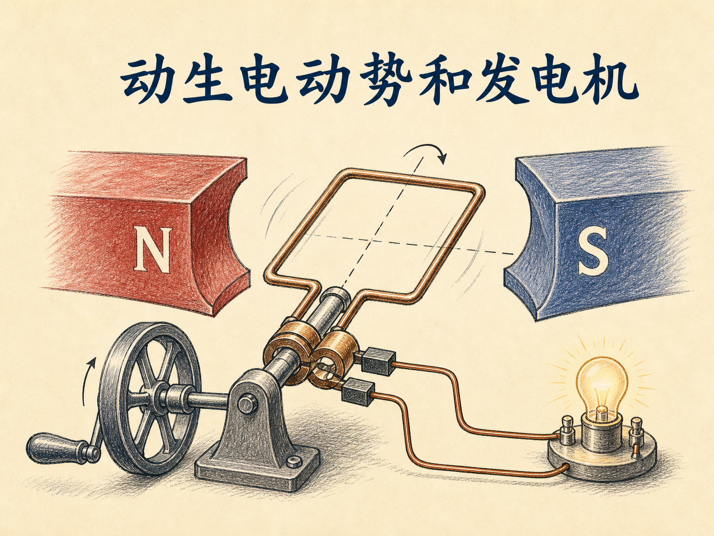
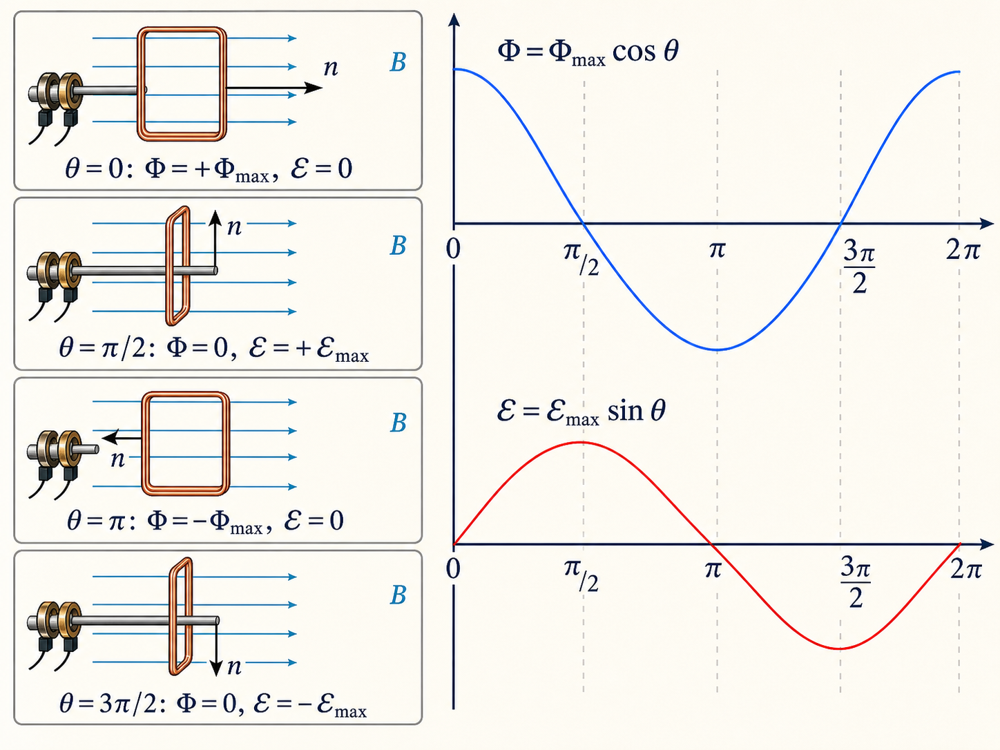
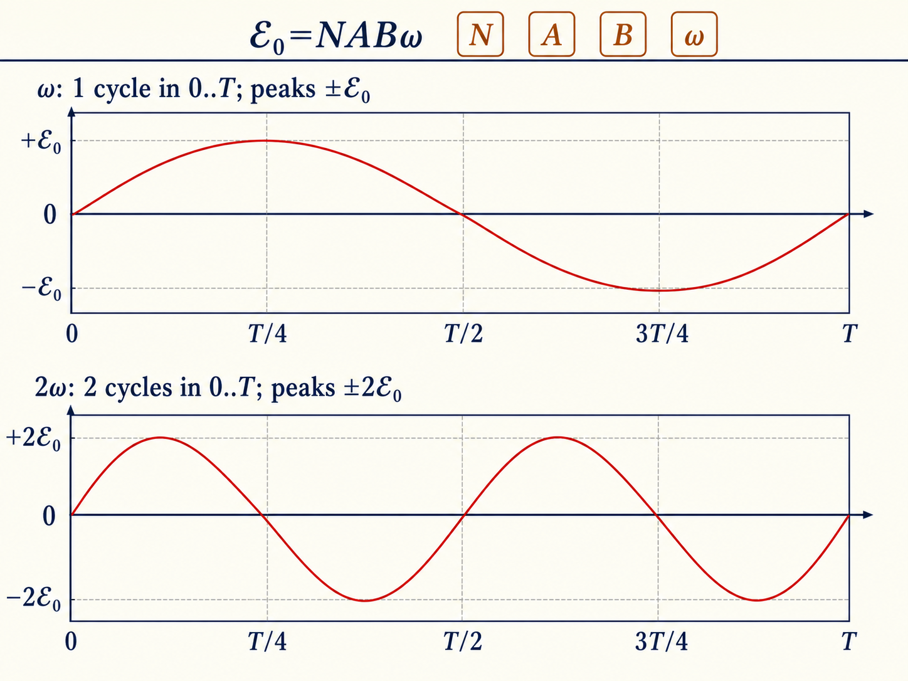
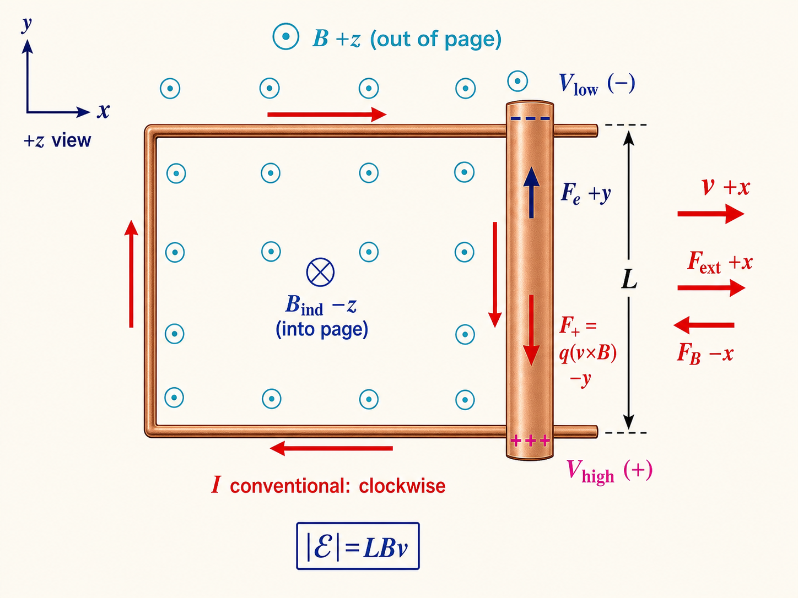
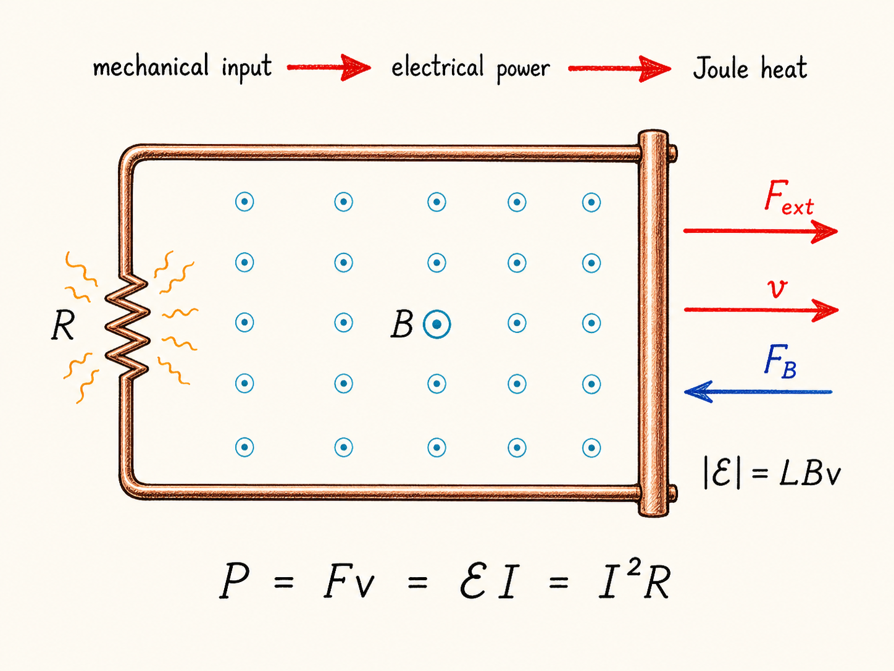
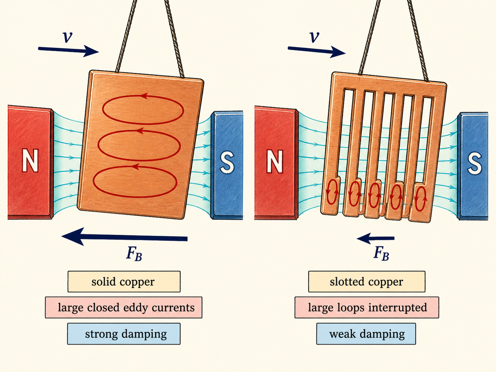

# 动生电动势和发电机

把一只线圈放进很强的磁场里，然后稳稳地停住，灯泡不会亮。反过来，磁场未必很强，只要线圈不停转动，电流计的指针就会左右摆动。发电机抓住的并不是“有磁场”这件事，而是磁通量正在变化。

这一区别把旋转线圈、滑动导体棒、手摇发电机和磁制动串成了同一个故事：磁通量的变化产生电动势；一旦回路闭合，电流又会反抗这种变化；要让过程继续，外界就必须持续做功。

读完这篇，你会知道

- 为什么旋转线圈产生正弦交流电，以及磁通量与电动势为何相差四分之一周期
- 发电机的电动势为什么同时取决于匝数、面积、磁场和转速
- 运动导体棒中的正电荷、电子、电势高低和回路电流分别朝哪边
- 为什么无论推还是拉导体棒，外力都必须做正功
- 为什么实心铜板会受到强磁阻尼，而开槽铜板的阻尼小得多

## 真正需要改变的是磁通量

先给导电回路选定一个有边界的开放曲面，再给这个曲面规定面积法向。穿过曲面的磁通量是 $\Phi_B=\int_S\mathbf B\cdot d\mathbf A$。磁通量是标量；在法向已经选定后，它可以为正、为负或为零。

对面积为 $A$ 的平面回路，如果磁场均匀，磁场与面积法向的夹角为 $\theta$，就有 $\Phi_B=AB\cos\theta$。因此，改变磁场 $B$、改变面积 $A$，或者改变夹角 $\theta$，都能改变磁通量。

法拉第定律把这种变化写成 $\mathcal E=-d\Phi_B/dt$。这里的 $\mathcal E$ 是电动势，它不是力；负号表达楞次定律：感应电流产生的磁通量总会反抗原磁通量的变化。判断“正负”之前，必须先把面积法向与回路正向按右手规则配成一对。换一套约定，两个符号会一起变，物理电流方向不会变。

## 旋转线圈为什么输出交流电

让线圈以角频率 $\omega$ 匀速旋转，并把 $t=0$ 选在面积法向与磁场同向的位置，于是 $\theta=\omega t$。单匝线圈的磁通量为 $\Phi_B=AB\cos(\omega t)$；若同一闭合导线绕成 $N$ 匝，每一匝都被磁场穿过，总磁通链按 $N$ 倍计，因此

$\Phi_B=NAB\cos(\omega t)$，$\mathcal E=-d\Phi_B/dt=NAB\omega\sin(\omega t)$。

这两条曲线的相位关系值得单独看清：

| 转角 | 磁通量 $\Phi_B$ | 磁通量变化率 | 电动势 $\mathcal E$ |
| --- | --- | --- | --- |
| $0$ | 正向最大 | 0 | 0 |
| $\pi/2$ | 0 | 绝对值最大 | 正向最大 |
| $\pi$ | 反向最大 | 0 | 0 |
| $3\pi/2$ | 0 | 绝对值最大 | 反向最大 |

磁通量最大时，曲线顶部是平的，所以电动势为零；磁通量过零时，曲线变化最快，所以电动势达到峰值。电动势并不与磁通量同相，而是相差四分之一周期。回路若有总电阻 $R$，在这里的电阻性简化中，电流满足 $I=\mathcal E/R$，也随时间正负交替，这就是交流电。

峰值 $\mathcal E_0=NAB\omega$ 直接给出四个控制量：匝数更多、面积更大、磁场更强或转得更快，峰值都更大。转速加倍时，$\omega$ 加倍，所以电动势峰值加倍；与此同时周期减半，频率也加倍。只是“在磁场里旋转”还不够：如果旋转轴使面积法向始终与磁场垂直，磁通量始终为零，仍然没有电动势。

课堂上的地磁演示使用 $N=42$ 匝、半径约 $0.30\,\mathrm m$ 的圆形线圈，因此 $A\approx0.28\,\mathrm{m^2}$；地磁场取 $B\approx5\times10^{-5}\,\mathrm T$，一秒转一圈，$\omega\approx6\,\mathrm{rad/s}$。代入得到 $\mathcal E_0\approx42\times0.28\times5\times10^{-5}\times6\approx3.5\,\mathrm{mV}$。转得更快，电流计的摆幅也随之增大。

## 发电机提高的不只是转速

发电机用涡轮机带动线圈在磁场中旋转。公式 $\mathcal E_0=NAB\omega$ 看似只是一行乘法，却同时规定了电压幅值与频率：提高转速会抬高电动势峰值，也会改变交流频率。课堂里那台从欧洲带到美国的唱片机虽然用变压器把 $110$ 伏升到 $220$ 伏，仍因为电源从 $50$ 赫兹变为 $60$ 赫兹而快了约 $20\%$。电压变换并没有修正频率。

同一公式也能做发电站的量级估算。若峰值电动势取 $300\,\mathrm{kV}$，线圈面积约 $1\,\mathrm{m^2}$，磁场约 $0.5\,\mathrm T$，频率为 $60\,\mathrm{Hz}$，即 $\omega$ 约为 $360\,\mathrm{rad/s}$，那么大约 $1700$ 匝就能得到这一电压量级。

电力不会从公式里凭空出现。输出功率为 $P=\mathcal EI$；若回路按欧姆电阻处理，又可写成 $P=I^2R$。线圈想持续旋转，外界就要持续输入机械功。燃料、核能、落水、风或人手只是输入方式不同，能量账本不能省略。

人力发电演示把这件事变得很直观：一只 $20$ 瓦灯泡已经需要每秒输入约 $20$ 焦耳；六只灯泡合计 $120$ 瓦，志愿者很难持续摇动。这里还有一个必须说明的转录矛盾：紧接着，小型登山手摇灯被识别成“一只 $120$ 瓦灯泡，而且可以一直点亮”。这与前一分钟刚完成的演示直接冲突。只按本讲前后文，合理解释是口语识别漏掉了否定词，讲者说的是“这不是一只 $120$ 瓦灯泡”。因此，这个 $120$ 瓦不能当作小手摇灯的真实功率；它不影响“低功率手摇装置靠持续做功供电”的结论。

## 滑动导体棒里的方向关系

旋转线圈通过改变角度来改变磁通量；滑动导体棒则通过改变面积做到同一件事。设矩形回路位于 $xy$ 平面，磁场 $\mathbf B$ 沿 $+z$ 方向，也就是垂直纸面向外。右侧导体棒沿 $y$ 方向，长度为 $L$，以速度 $\mathbf v$ 沿 $+x$ 方向向右运动。回路面积为 $Lx$，所以 $\Phi_B=BLx$，电动势大小为 $|\mathcal E|=|d\Phi_B/dt|=BLv$。

这套坐标也把电荷方向说清了。对随导体棒一起向右运动的正电荷，磁力方向由 $q\mathbf v\times\mathbf B$ 决定。因为 $+x\times+z=-y$，正电荷被推向棒的 $-y$ 端；电子带负电，受力方向相反，被推向 $+y$ 端。于是棒的 $-y$ 端积累正电荷，电势较高；$+y$ 端积累负电荷，电势较低。

电荷分离建立了棒两端的电势高低。回路闭合后，约定电流沿棒的 $-y$ 方向流动；从 $+z$ 方向看，整个回路中的电流为顺时针，它产生的磁场沿 $-z$，正好反抗正在增加的 $+z$ 磁通量。电子在棒中的运动方向与约定电流相反，为 $+y$。

再看导体棒整体受到的力。棒中约定电流方向为 $-y$，所以 $\mathbf F=I\mathbf L\times\mathbf B$ 沿 $-x$，与导体棒向右的速度相反。要让棒保持匀速向右，外力必须沿 $+x$ 做正功。若把棒向左推，电荷分离、电势高低和电流方向全部反转，磁力也改为向右，仍然反抗运动。

功率关系把两种推导接在一起：外力克服磁力所做的功率为 $P=Fv=ILBv$；电路得到的功率为 $P=\mathcal EI$。约去 $I$，再次得到 $|\mathcal E|=LBv$。同一个结果，一次来自磁通量变化，一次来自能量守恒。

## 涡流为什么能让铜板像陷进泥里

不必把导线绕成规则回路，整块导体内部也能形成环形感应电流，这就是涡流。当实心铜板进入磁场区域时，穿过铜板局部回路的磁通量增加；涡流产生反抗这一增加的磁场。铜板离开时，磁通量减小，涡流反向，仍然反抗变化。因此无论进入还是离开，铜板受到的磁力都与运动趋势相反，动能转化为 $I^2R$ 热，这就是磁制动。

实心铜摆在磁场中很快停下，开成梳齿状的铜摆却只受到较弱阻尼。课堂口语把原因说成“电流必须穿过空气，空气电阻极大”。更准确地理解这句话：开槽切断了原本横跨铜板的大闭合涡流路径，显著限制了能够形成的电流；不是说有可观的传导电流真的穿过空气。电流减小后，磁阻力和耗散功率都随之减小，所以开槽铜摆仍有阻尼，但弱得多。

闭合铜环与带开口铜环的下落实验也是同一逻辑。闭合环进入磁场时先减速；完全进入近似均匀场区后，磁通量变化变小，又会加速；离开时磁通量再次变化，再次减速。开口环缺少完整的闭合电流路径，涡流很小，三个阶段中的磁制动都不明显。

还有一个更直接的演示：把上千匝线圈慢慢推进磁极之间，灯泡只发出微光；移动越快，磁通量变化率越大，灯越亮；把线圈停在强磁场里，灯立刻熄灭，因为磁通量不再变化。快速移动甚至能让灯泡烧坏。强磁场本身仍不是答案，变化率才是。

## 能量账本是楞次定律的另一种读法

旋转线圈、滑动导体棒和涡流看起来是三套装置，其实遵守同一条链条：磁通量变化产生电动势；闭合路径中出现电流；电流产生的磁效应反抗原变化；外界必须克服反作用力做功；输入的机械能最终变成电能、热或灯光。

如果感应电流不是反抗磁通量变化，而是帮助它继续增强，那么增强的磁场会产生更大的电动势，更大的电动势又产生更强的磁场，形成无需能量输入的失控增长。这既与所有演示相反，也违反能量守恒。楞次定律的负号不是记号上的麻烦，而是这本能量账能够闭合的原因。
