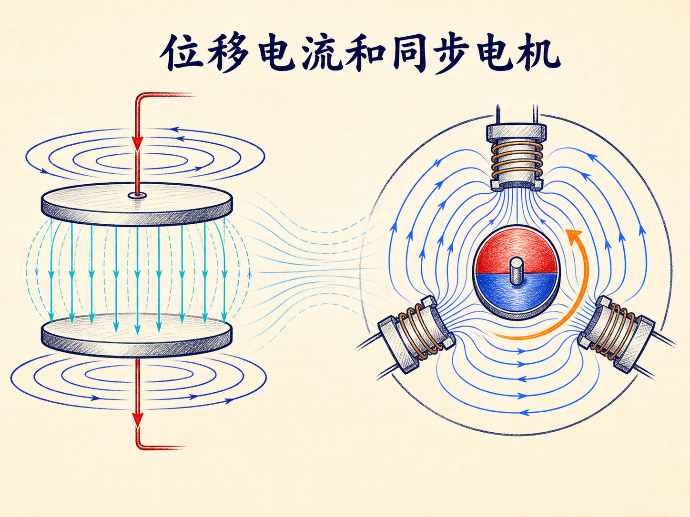
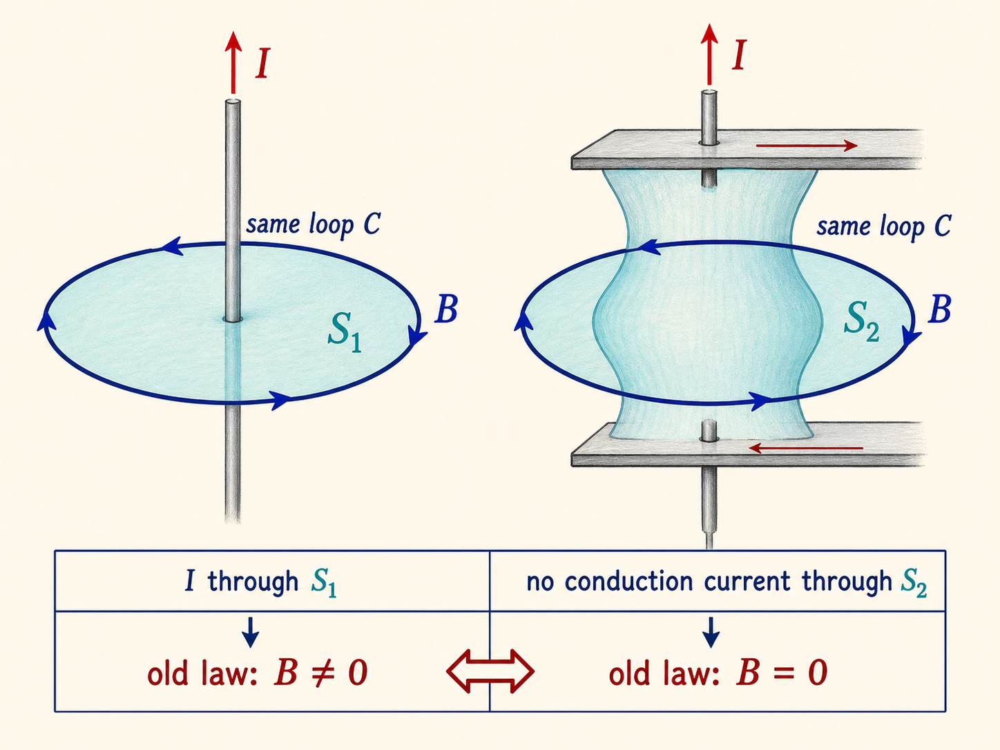
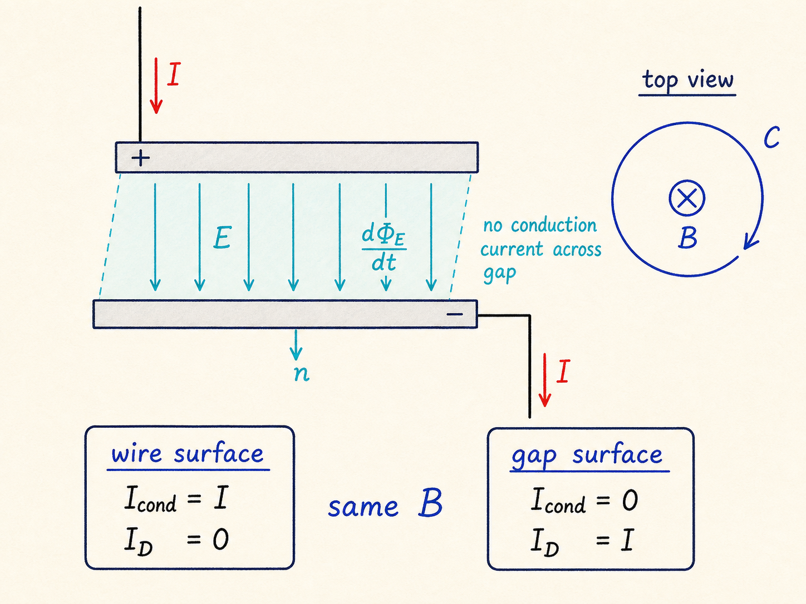
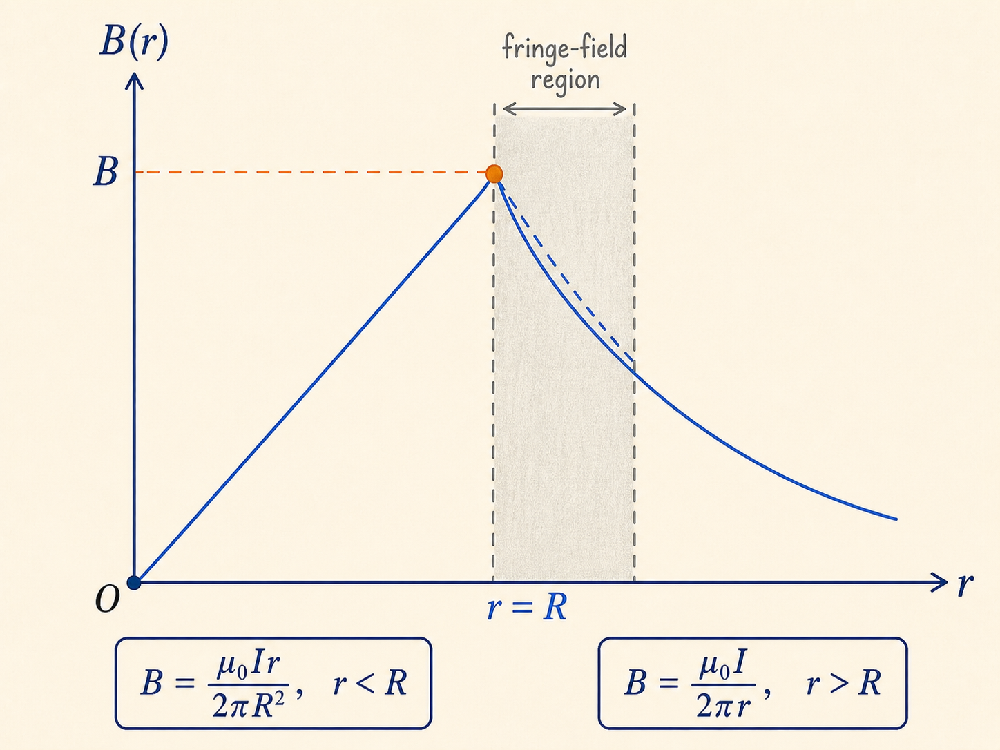
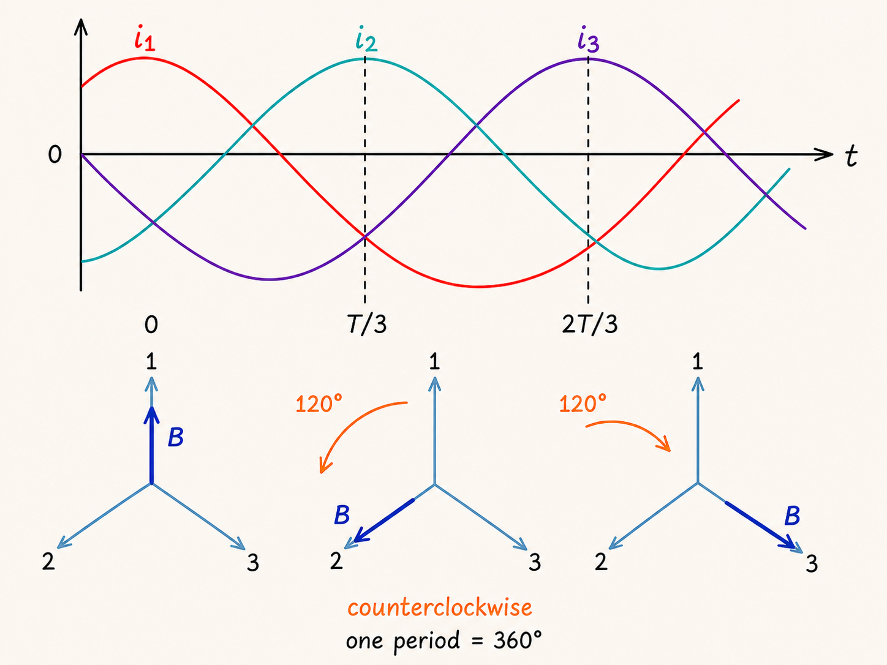
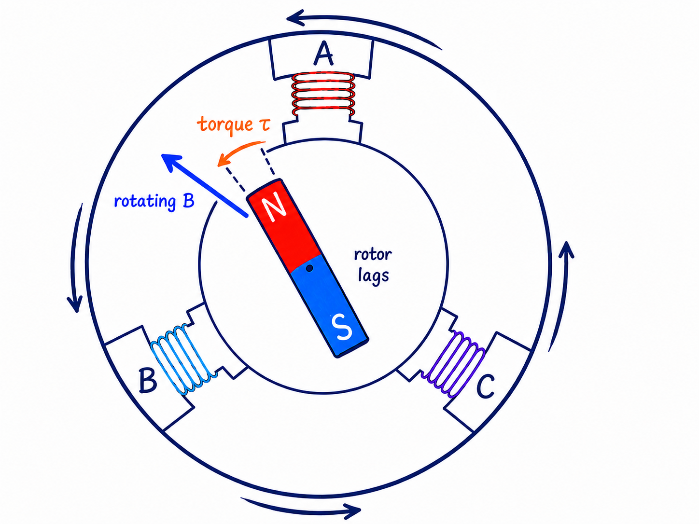
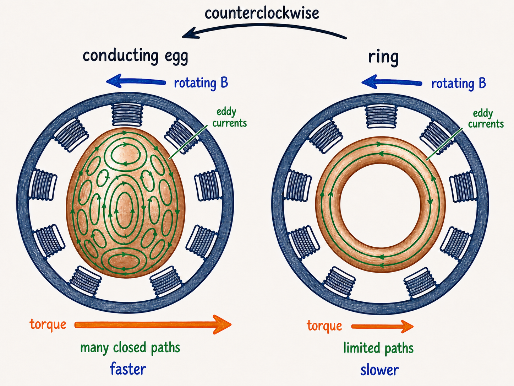
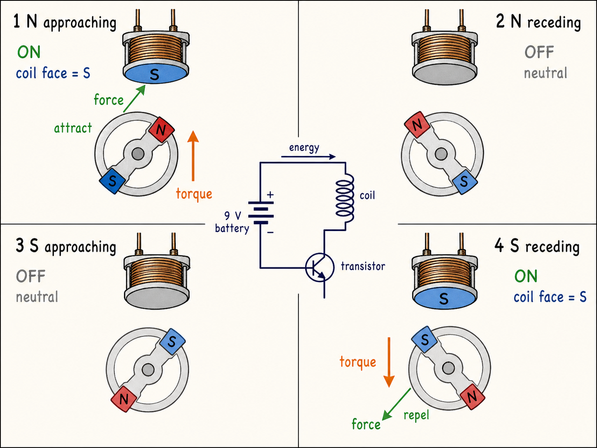
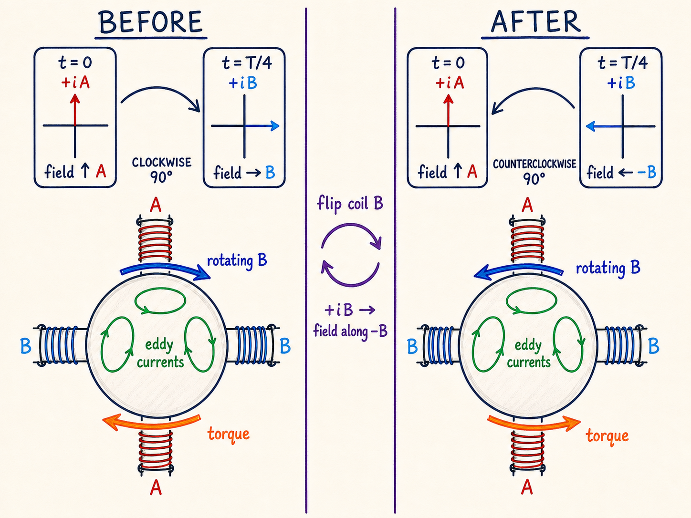

# 位移电流和同步电机：当“断路”仍然产生磁场

一根导线给电容器充电时，导线里明明有电流，极板之间却没有电荷穿过。可是在电容器附近，磁场并不会因为导线中间出现了间隙而突然消失。更麻烦的是：沿同一条闭合环路计算，只因选取的积分曲面不同，原来的安培定律竟会给出“有磁场”和“没有磁场”两个答案。

这个矛盾迫使麦克斯韦补上位移电流项。下半场，课程又把“随时间变化”换成另一种更直观的运动：三组错开相位的交流磁场合成一个旋转磁场，磁体和导体因此获得持续转矩。前后两部分看似分开，真正共同的线索都是：只盯着某一瞬间的电流或磁场不够，还必须追踪场怎样随时间变化。

读完这篇，你会知道

- 为什么同一条安培环路会被原始安培定律算出两个答案
- 位移电流如何让传导电流与变化电通量保持连续
- 充电电容器内部的磁场为什么先随半径增大，再在外部减小
- 三相旋转磁场怎样带动同步转子，又怎样通过涡流带动导体

## 一条环路，为什么会有两个答案

设一个圆形极板电容器正在充电。极板半径为 $R$，极板上的自由电荷为 $Q_{\mathrm{free}}$，极板间介质的相对介电常数为 $\kappa$。忽略边缘场时，极板间电场可写成 $E=Q_{\mathrm{free}}/(\pi R^2\kappa\varepsilon_0)$。由于导线电流满足 $I=dQ_{\mathrm{free}}/dt$，所以电场变化率为 $dE/dt=I/(\pi R^2\kappa\varepsilon_0)$。

现在在导线外取一条半径为 $r$ 的圆形安培环路。先给它配一张穿过导线的平面。圆柱对称性使环路上磁场大小相同，原始安培定律给出 $B(2\pi r)=\mu_0I$，也就是 $B=\mu_0I/(2\pi r)$。

但同一条闭合环路还可以配另一张曲面：让曲面像袋子一样鼓起，从电容器两块极板之间穿过去。它的边界仍是原来的圆环，却没有传导电流穿过。若仍只用 $\oint_C\mathbf B\cdot d\mathbf l=\mu_0I_{\mathrm{穿过}}$，右边变成零，于是同一点的磁场又被算成零。

问题不在磁场，而在定律缺了一项。闭合环路 $C$ 的正向与开曲面 $S$ 的面积法向必须按右手规则成对选择：右手四指沿 $C$ 的正向弯曲，拇指就是 $d\mathbf A$ 的正向。既然两张曲面共享同一个边界，最后的环量就不能依赖曲面是平的还是鼓起的。

## 麦克斯韦补上的不是“穿过真空的电荷”

麦克斯韦注意到，极板间虽没有传导电流，却有变化电场。对以 $C$ 为边界的开曲面定义电通量 $\Phi_E=\int_S\mathbf E\cdot d\mathbf A$，课程采用的线性电介质写法把位移电流定义为 $I_D=\kappa\varepsilon_0\,d\Phi_E/dt$。修正后的安培—麦克斯韦定律是 $\oint_C\mathbf B\cdot d\mathbf l=\mu_0(I_{\mathrm{cond}}+I_D)$。

对穿过导线的平面，传导电流为 $I$，而该曲面没有电通量贡献，所以 $I_D=0$。对穿过极板间隙的鼓包曲面，传导电流为零，但忽略边缘场时 $\Phi_E=E\pi R^2$。于是 $I_D=\kappa\varepsilon_0\pi R^2(dE/dt)=I$。两张曲面都得到 $B(2\pi r)=\mu_0I$，矛盾消失。

这里必须区分“数值等效”和“电荷真的穿过”。导线中的 $I$ 是传导电流；有电介质时，极化变化会带来感应电荷的重新排列；真空中则没有电荷从一块极板穿到另一块极板。位移电流是变化电通量在定律中承担的等效电流项，它让同一条边界对应的磁场环量保持一致，不是把真空说成一根隐形导线。

若电流和面积法向同向为正，环向磁场的正向就由同一右手规则确定。反转充电电流会反转 $d\Phi_E/dt$ 的符号，环向 $\mathbf B$ 也随之反转。图示时，极板间只能画 $\mathbf E$ 与 $d\Phi_E/dt$，不能画传导电流穿过介质。

## 电容器内部的磁场怎样随半径变化

在极板之间，取一条以极板中心为圆心、半径为 $r<R$ 的圆形环路。它包围的变化电通量只来自面积 $\pi r^2$，因此 $I_D(r)=\kappa\varepsilon_0\pi r^2(dE/dt)=I r^2/R^2$。代回安培—麦克斯韦定律可得 $B(2\pi r)=\mu_0I r^2/R^2$，也就是 $B(r)=\mu_0Ir/(2\pi R^2)$。

因此，在理想模型中，磁场从中心的零开始，随 $r$ 线性增大。到 $r=R$ 时，内部公式给出 $B(R)=\mu_0I/(2\pi R)$；极板外部则回到 $B(r)=\mu_0I/(2\pi r)$，按 $1/r$ 下降。两段在 $r=R$ 处数值相接。

但这条漂亮的分段曲线不能在极板边缘被当成精确解。推导假定电场只存在于两板正对区域，而实际边缘附近有边缘场，极板外同样可能有变化电通量。课程明确承认，这一带的简单计算“不正确”，而且具体修正依赖电容器几何形状。可靠的结论是：远离边缘时，这个理想模型揭示了内部线性增长和外部反比下降；靠近边缘时必须停止过度解释。

## 一个补项，打开了电磁波的门

位移电流并不是为了修补一道电容器习题而临时加入。课程指出，麦克斯韦由这一项预言了无线电波，还计算出它的传播速度就是光速。赫兹起初认为设备不够好，七年后才接受挑战，又用两年时间在实验中显示无线电波确实存在。

“位移电流”这个名字也容易误导。极板间有电介质时，变化极化确实对应感应电荷重新排列；在真空中却没有实际传导电流。麦克斯韦曾把真空看作 $\kappa=1$ 的特殊电介质，并相信那里存在实际电流。名称留下来了，但课程强调，真正必不可少的是变化电通量这一项，而不是对名称作字面理解。

## 三个相位，怎样合成一根旋转的磁场箭头

课程随后回到旋转线圈产生交流电动势。三只彼此独立的线圈在空间中依次错开 $120^\circ$，它们产生的正弦电动势在时间相位上也依次错开 $120^\circ$。把对应三相电流送入同样按 $120^\circ$ 排列的三组定子线圈，就能得到旋转磁场。

看三个时刻最直观。先设 1 号电流达到最大，2、3 号电流的大小各为它的一半；后两组磁场的矢量和恰好与 1 号磁场同向。再过 $T/3$，2 号达到最大，总磁场转到 2 号轴线方向；再过 $T/3$，3 号达到最大，总磁场继续转到 3 号轴线方向。一个周期 $T$ 内，总磁场转完 $360^\circ$。在课程这套装置中，60 Hz 交流对应每秒 60 圈的旋转磁场。

把一块磁体放在中央，它的磁轴会追随旋转磁场。课程把这种磁体转子称为同步电机：转子以交流电的频率转动。“三相是必须的”应放回本讲语境理解——这里展示的三线圈同步方案使用三相电流；课程后面又用相差 $90^\circ$ 的两相电流合成旋转磁场，说明形成旋转场并不只有三相这一种组合。

方向也不是装饰。三组电流的相序决定总磁场依次从哪一组轴线转向下一组；转子受到的转矩促使磁轴追随这个旋转方向。若改变一组线圈的空间朝向，合成磁场的旋转方向会改变，电机转矩也随之反向。

## 同一旋转磁场，为什么还能带动一只导电蛋

若中央放的不是永久磁体，而是一只导电蛋，旋转磁场会让穿过导体的磁通量持续改变，从而产生涡流。涡流处在磁场中受到转矩，导体便沿旋转磁场方向加速。只要导体还没有完全跟上旋转磁场，磁通量就在变化，涡流和转矩就能继续存在。演示中的导电蛋转速略低于 3600 rpm，而 3600 rpm 对应 60 Hz。

导体形状会改变可用的涡流路径。导电蛋能提供许多闭合路径，因此转得很快；圆环主要只允许电流沿环周流动，转得慢得多，而且从错误方向启动时无法像导电蛋那样自行反转。课程把这类由涡流获得转矩的装置称为感应电机，并指出它不需要电刷。

这与同步电机的差别可以用一句话复述：同步演示让永久磁体转子直接追随旋转磁场；感应演示先在导体内产生涡流，再由磁场对涡流施加转矩。两者都需要方向一致的持续转矩，但转子获得磁性的方式不同。

## 秘密陀螺：感应信号只负责决定何时“踢一脚”

复习课上的秘密陀螺能转到第二天，能量当然不可能凭空出现。盒子里有 9 V 电池、线圈、开关和晶体管，陀螺本身藏着一块条形磁体。平台是凹的，能让陀螺反复回到中心线圈附近。

当陀螺北极接近线圈时，变化磁通在线圈中产生感应电动势。晶体管检测到这个方向的信号后闭合开关，让电池电流把线圈上端变成南极，于是北极被吸引，陀螺获得向前转矩。北极越过线圈开始远离时，感应电动势反向，晶体管断开开关，避免南极线圈把已经离开的北极往回拉。

随后陀螺南极接近。对线圈而言，这与北极远离造成同方向的感应信号，开关继续断开。等南极越过线圈并开始远离，感应电动势又与北极接近时同向，晶体管重新闭合开关；线圈上端仍是南极，于是排斥正在离开的南极，再给陀螺一次同向推动。

课程把它也称为感应电机，但其具体能量链必须说清：感应电动势只被晶体管用来判断开关时刻，实际补充的机械能来自电池，经脉冲线圈传给陀螺。它不是前面那只导电蛋的同一种转子结构。顺时针或逆时针都能启动，是因为控制逻辑根据磁极接近和远离来选择通电窗口。

## 两相也能旋转，翻转一只线圈就能反转

最后一个咖啡罐演示只使用两只相互垂直的线圈，两路 60 Hz 电流相差 $90^\circ$。第一路达到最大时，第二路为零；过 $T/4$，第一路为零，第二路达到最大。合成磁场因此从第一只线圈的轴向转到第二只线圈的轴向，并持续旋转。

金属咖啡罐表面的磁通量不断变化，罐内产生涡流，旋转磁场对涡流施加同向转矩，罐就转起来。如果翻转其中一只线圈，它产生的磁场方向关系随之反转，合成磁场改为反向旋转。罐先减速到停下，再朝相反方向加速；转矩方向由旋转磁场方向决定。

从充电电容器到旋转咖啡罐，这一讲反复提醒我们：电磁学不能只数“有没有电荷穿过”，也不能只看“某一刻磁场指向哪里”。变化电通量可以在没有传导电流穿过的曲面上维持磁场环量；错开相位的交流磁场可以把静止线圈的作用合成为持续旋转的方向。只要把曲面、相位和方向约定讲清楚，那些看似突然出现的磁场与转矩，就都有连续的物理链条。
