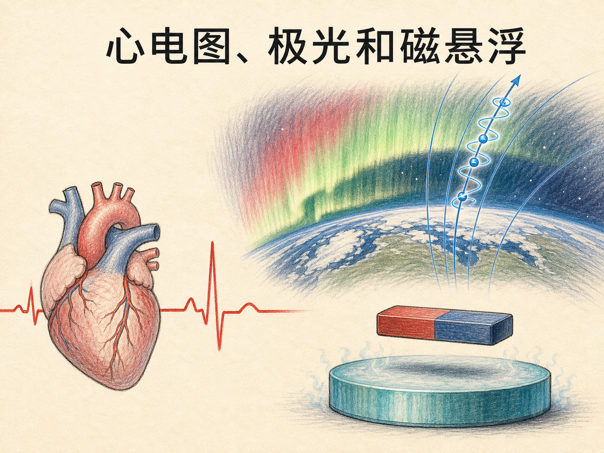
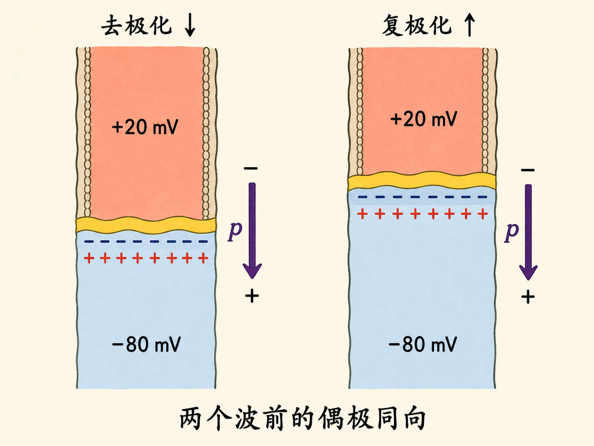
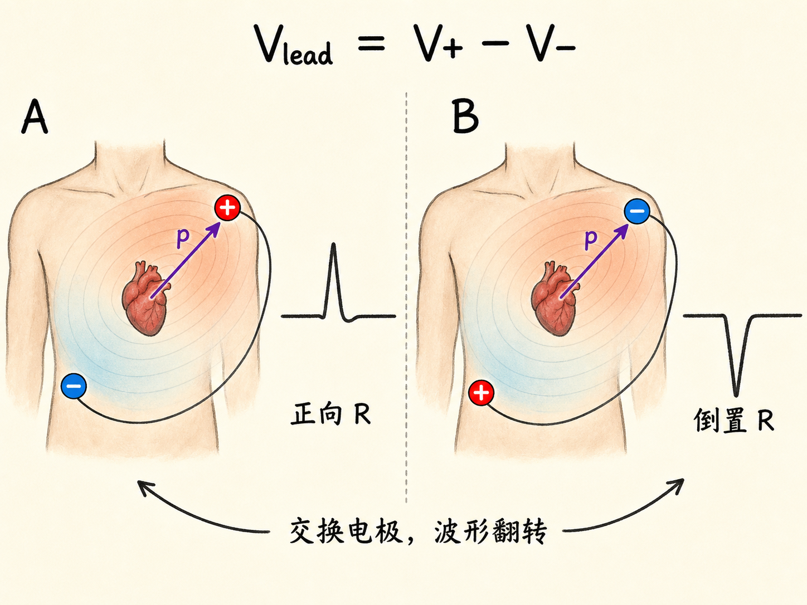
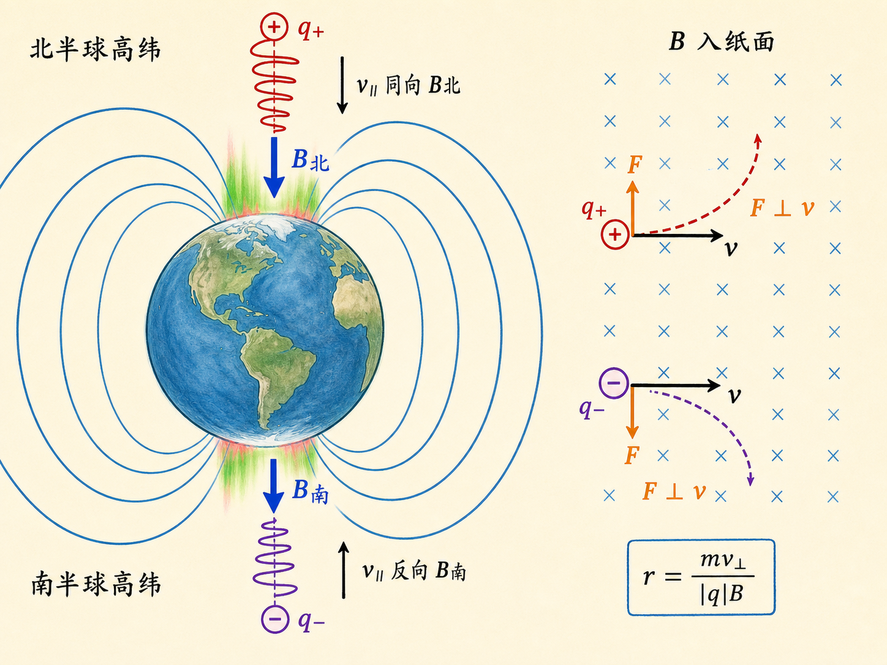
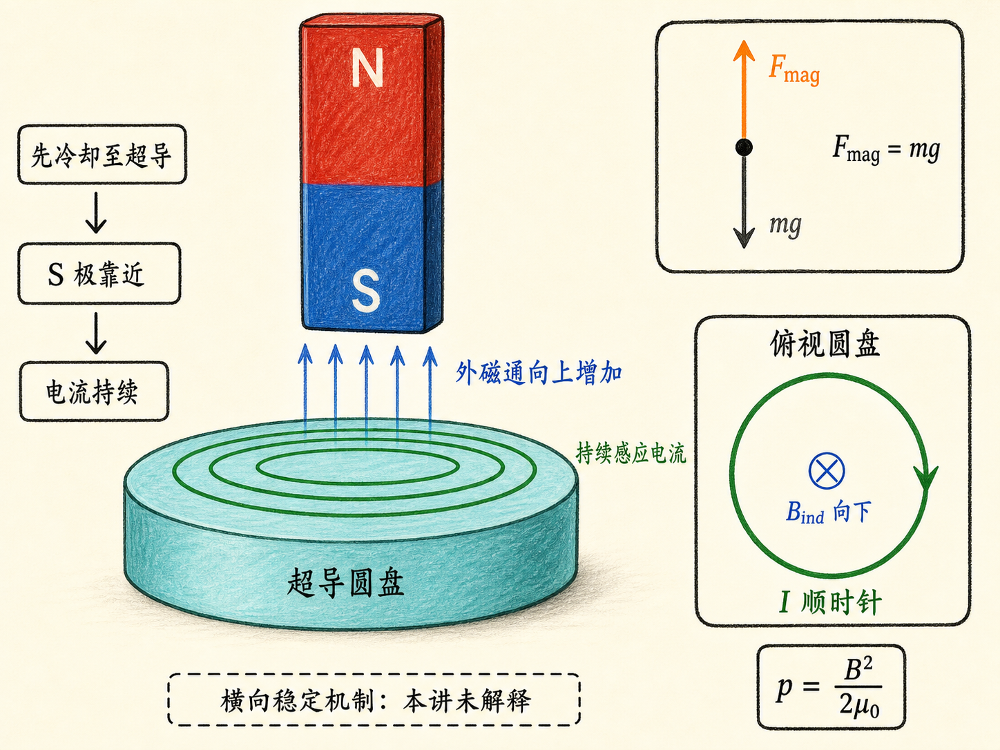
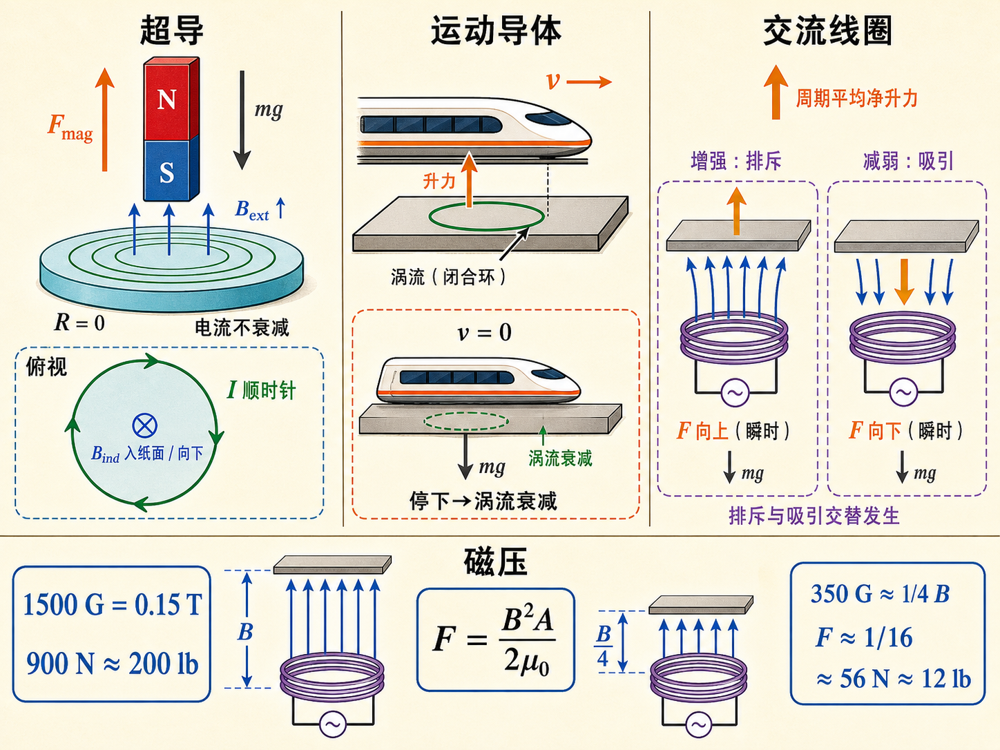

# 心电图、极光和磁悬浮

心电图上几毫伏的起伏、夜空中变化不定的极光、液氮上方悬着的小磁体，看起来属于医学、天文和低温物理三个世界。把它们连起来的不是一句抽象口号，而是三条可以逐步检查的关系：电荷分布变化会产生电势差，运动电荷在磁场中会转弯，变化的磁通会在导体中激起电流。

这节课甚至先从一只转盘开始。频闪灯下“看起来不动”的圆盘，可能每两次闪光之间转了一圈，也可能转了两圈、三圈。一个看似确定的画面，只有把频率、方向和测量端点都说明白，才会变成可信的物理量。后面的心电图和磁悬浮同样如此。

读完这篇，你会知道

- 为什么心肌电活动能在手臂、腿和胸部之间留下毫伏级电势差？
- 为什么去极化向下、复极化向上，却能产生同向的心脏电偶极？
- 为什么带电粒子会绕着地磁场线走螺旋，而不是被磁场沿场线“拉”向地球？
- 超导圆盘、运动中的磁悬浮列车和交流线圈，分别靠什么维持悬浮？
- 为什么磁场只有目标值的四分之一时，能抬起的重量会降到十六分之一？

## 先把“静止”测准：频闪仪的多重答案

假设转盘以每分钟 1000 转旋转，而频闪灯每分钟只闪 500 次。相邻两次闪光之间，转盘已经转了两圈，每次被照亮时白色标记都回到原位，于是人眼看到一个静止图像。把闪光频率改成每分钟 1000 次，标记仍会静止，但这并不能单独证明转速就是 1000 RPM，因为 2000 或 3000 RPM 也可能在每次闪光时回到同一角度。

课程采用的是排除法：继续把频闪提高到每分钟 2000 次。如果这时出现双重影像，就能排除 2000 RPM 及其整数倍；还要用其他频率排除 3000、5000、7000 RPM 等候选。正式测试还会在转子一侧涂白漆，提供明确的角位置标记。若转速本身很不稳定，图像也不会稳定，测量自然更困难。

这个序章给出了一条后面反复用到的原则：读数必须连同测量方式一起解释。心电图的正负号要看电极怎样接，螺旋方向要看电荷正负和磁场方向，悬浮力则要看磁通变化怎样产生。

## 从一层细胞膜，到全身可测的电势差

心脏有左右心房和左右心室四个腔室，它的任务是泵血。课程给出的量级是每分钟约 5 夸脱、每分钟约 70 次心跳。大脑供血若中断约 5 秒，人就会失去意识；约 4 分钟后可能造成永久性脑损伤。这些时间尺度解释了为什么心室颤动必须被快速发现和处理。

每个心肌细胞都像一节微型化学电池。静息时，细胞内部相对外部约为 $-80\,\mathrm{mV}$。右心房附近约 $1\,\mathrm{mm^2}$ 的起搏细胞会率先把电势推到约 $+20\,\mathrm{mV}$，邻近细胞随后跟随，于是去极化波先经过心房，再经过心室。处于 $+20\,\mathrm{mV}$ 状态的细胞收缩；约 $0.2\,\mathrm{s}$ 后，复极化波让它们回到 $-80\,\mathrm{mV}$，整个周期约 1 秒后再次开始。

静息细胞的膜两侧有相反电荷，膜内存在由正侧指向负侧的电场。完整、近似均匀的闭合膜在细胞尺度以外大体互相抵消，所以不能把一颗静息细胞当成强烈的远场偶极。需要注意，这种抵消不能仅凭“高斯面内净电荷为零”推出；净电荷为零只约束总电通量，不保证每一点的电场都为零。

真正产生明显偶极的是传播中的波前。为了看清电荷排列，可以暂时把已经去极化的上半部画成 $0\,\mathrm{mV}$，而下半部仍保持 $-80\,\mathrm{mV}$。上半部膜两侧的电荷层暂不画，下半部仍有内负外正的电荷层。两种区域的交界处便出现一层负电荷和一层正电荷，形成局部电偶极。只有波前正在穿过的那一圈细胞贡献这种偶极场，波已经通过或尚未到达的大片区域不会以同样方式贡献。

去极化波由上向下走，复极化波则由下向上走。为什么两者的合成偶极还能同向？因为复极化不仅传播方向反了，膜电荷的变化也反了。两个反向同时发生，交界处的正负层次仍与去极化前沿相同。因此，分布在同一波前上的许多细胞偶极会彼此加强，形成整个心脏的瞬时合成电偶极。

## 导联正负极决定波形朝上还是朝下

心脏偶极在身体中建立电势分布，因此手臂、腿和胸部的不同位置之间会出现电势差。典型检查会在身体多个位置连接 12 个电极，以获取不同方向的信息；课程演示只接了 3 个电极。任意两个电极之间的最大电势差一般只有约 $2$ 到 $3\,\mathrm{mV}$。

一次导联的读数必须定义为

$V_{\text{lead}}=V_+-V_-.$

电偶极矩 $\mathbf p$ 从负电荷指向正电荷。若 $\mathbf p$ 在某一时刻更朝向正电极一侧，正端所处位置的电势相对更高，导联就记录正向波；若偶极投影反向，波形就向下。交换正、负电极也会把同一信号整体翻转。课程演示中学生的 R 波看起来“方向反了”，不能只凭这一点作判断，因为符号还取决于导联的极性、位置和心脏偶极相对导联轴的投影。

健康心电图中，P 波对应心房去极化；稍后的 R 波主要对应心室去极化，心室肌肉更多，所以电势差更大；T 波对应心室复极化。课程特别指出，虽然复极化波沿相反方向传播，它产生的偶极方向仍可与去极化阶段相同。U 波的成因在课程讲授时仍被说成不清楚。

电极测到的不只心脏。志愿学生放松时能看到心电波形；一旦站起并活动双臂，其他骨骼肌收缩也产生电偶极场，信号立刻盖过心脏。这说明心电图不是“把心脏直接画出来”，而是从身体表面的电势差反推心脏内部的传播过程，接触质量、导联方向和肌肉活动都会进入读数。

当心室不再服从起搏信号，而是随机、不同步地去极化时，就会发生心室颤动，心脏失去有效泵血能力。课程给出的治疗量级包括胸部大电极板施加约 $3000\,\mathrm V$、$1\,\mathrm A$、持续 $0.1\,\mathrm s$ 的电击；人工起搏器则在心率过低时，以约 $10\,\mathrm{mA}$、半毫秒的脉冲每分钟触发 60 次。植入式除颤器在检测到颤动时可给出约 $650\,\mathrm V$、持续约 $5.5\,\mathrm{ms}$、最高 $5$ 到 $10\,\mathrm A$ 的脉冲。这里的数字是课程用来说明时间尺度和同步作用的量级，不是操作指引。

## 磁场不负责“拉”，它只负责让粒子转弯

进入极光之前，先看带电粒子在磁场中的运动。纯磁场中的洛伦兹力为

$\mathbf F_B=q\mathbf v\times\mathbf B.$

把速度拆成平行和垂直于磁场的两部分，$\mathbf v=\mathbf v_\parallel+\mathbf v_\perp$。由于 $\mathbf v_\parallel\times\mathbf B=0$，磁力完全来自 $\mathbf v_\perp$。这部分力始终与瞬时速度垂直，改变运动方向却不直接改变速率，于是垂直分量形成圆周运动；平行分量不被磁力改变，继续沿磁场前进。两种运动叠加，轨迹就是绕场线的螺旋。

回旋半径为

$r=\frac{m v_\perp}{|q|B}.$

这里必须用 $|q|$ 表示半径大小。若正、负粒子具有相同的速度和磁场，$q$ 的符号会让洛伦兹力反向，因此两者的回旋方向相反，但它们的平行速度方向不由电荷符号决定。一个粒子是否沿场线进入大气，取决于 $\mathbf v_\parallel$ 是朝向大气还是离开大气。

地磁场线是弯曲的，所以螺旋轨迹的中心会沿弯曲场线前进。太阳发出的等离子体包含电子和质子，称为太阳风。粒子沿场线来到高纬大气后，使高层大气中的成分电离、激发并发光，于是出现极光。北半球高纬处场线指向地球，向下进入大气的粒子可具有沿 $\mathbf B$ 的平行速度；南半球高纬处场线离开地球，向下粒子的平行速度则可与 $\mathbf B$ 反向。南北两侧都能有极光，不能用电荷正负来决定它“去哪个磁极”。

极光能在几秒到几分钟内改变。颜色取决于入射粒子的能量、被激发的是氮分子还是氧分子，以及过程发生的高度。课程展示的白色、红色帘幕以及紫外卫星图像还说明，最强发光常形成以磁极为中心、半径约 $500\,\mathrm{km}$ 的环带；相隔 12 分钟的图像已经能看到显著变化。

## 超导圆盘：让反抗磁通变化的电流不再衰减

超导最直接的电学特征是电阻降到零。课程从约 $4\,\mathrm K$ 的汞讲起，又讲到在约 $35\,\mathrm K$ 发现的高温超导材料、课程当时约 $135\,\mathrm K$ 的纪录，以及 $77\,\mathrm K$ 液氮让超导演示进入普通实验室。转录把其中几处 K 误写成摄氏度；同一段的温标关系只有按 K 才自洽。

在理想稳态模型中，超导体内部不能维持普通电阻导体那样的电场。否则 $V=IR$ 在 $R=0$、$V\ne0$ 时会给出失控的理想结果。对这次演示，更关键的顺序是：先把圆盘冷却到超导态，再让磁体从远处靠近。磁体靠近会改变穿过圆盘的磁通，法拉第定律驱动感应电流；楞次定律决定电流产生的磁场反抗这次磁通变化。

普通导体中的涡流会因 $I^2R$ 发热而衰减。超导圆盘中 $R=0$，感应电流可以持续，因而它产生的磁场持续抵抗外磁通进入。把外磁体的场与感应电流的场叠加，会看到两者之间的磁场被挤密。课程用磁压力表示这种作用：

$p=\frac{B^2}{2\mu_0}.$

小磁体悬浮时，向上的磁力平衡向下的重力。旋转磁体，感应电流会随磁通条件调整，磁体仍能悬着。课程明确说这种悬浮为什么横向稳定“不容易理解”，所以这里只能确认演示给出的竖直力平衡，不能凭空补出本讲没有给出的稳定机制。

液氮温度约 $77\,\mathrm K$，低于演示圆盘约 $90\,\mathrm K$ 的超导转变温度。直径约 1 英寸的圆盘冷却后，小磁体靠近便激起持久电流并悬在上方；它还可以在悬浮时旋转。这与两块同名磁极相对的桌面玩具都表现为磁压力，但前者的排斥场来自超导体内被感应出来的电流，不能把圆盘本身画成一块预先存在的永久磁体。

## 普通导体也能悬浮，但必须持续制造磁通变化

若让磁体高速掠过普通导电板，穿过板的磁通不断变化，板内就会产生涡流。涡流的磁场反抗正在发生的磁通变化，在合适速度下形成向上的净力，足以让列车浮起。普通导体有电阻，所以列车一旦停下，磁通变化消失，涡流又因 $I^2R$ 损耗衰减，悬浮力随之消失。这就是它必须保持运动、而超导圆盘可以静止悬浮的原因。

课程当时提到德国和日本已有磁悬浮测试列车，记录速度约为每小时 340 英里；还提到华盛顿到巴尔的摩的建设设想，以及每英里约 3000 万美元的成本。这些数字在文章里只代表课程当时给出的工程背景，核心物理仍是“相对运动持续改变磁通”。

第三种方法不用高速，也不用超导体，而是在线圈中通交流电。线圈的磁场不断翻转，放在线圈上方的导电板便持续经历磁通变化。外磁场向下增强时，涡流产生向上的磁场，瞬时作用表现为排斥；外磁场随后减弱，涡流反向，瞬时作用也可能变成吸引。

因此，不能把交流悬浮画成每个瞬间都是“同极相斥”。课程只给出实验事实：一个周期平均后存在净排斥力，上方导电板会浮起，把导电板翻面后也仍能浮起；为什么吸引和排斥没有恰好抵消，要到下一讲才解释。当前能确定的是，交流源持续提供变化磁场，普通导体中的涡流虽有损耗，却能被每一周期重新驱动。

把三种方法并排看，差别就清楚了：超导圆盘靠零电阻维持已经建立的感应电流；列车靠持续运动维持磁通变化；交流线圈靠电源持续翻转磁场。三者都用楞次定律确定感应响应，却不能互换维持条件。

## 磁场少四倍，承载力为什么少十六倍

课程最后试图用面积约 $0.1\,\mathrm{m^2}$ 的交流线圈抬起 200 磅。若磁场能达到 1500 高斯，也就是 $0.15\,\mathrm T$，在磁场近似均匀的条件下，力为

$F=pA=\frac{B^2A}{2\mu_0}.$

代入 $A=0.1\,\mathrm{m^2}$、$\mu_0=4\pi\times10^{-7}$ 和 $B=0.15\,\mathrm T$，得到约 $900\,\mathrm N$，相当于约 $90\,\mathrm{kg}$ 的重量，也就是约 200 磅。

问题出在电流。要得到 1500 高斯需要几百安培，现有供电会让断路器跳闸。实际只能做到约 350 高斯，约为目标场强的四分之一。由于力与 $B^2$ 成正比，承载力不是降到四分之一，而是降到约十六分之一：200 磅于是只剩约 12 磅。最后的“悬浮一位女士”演示正是用这个较轻的对象完成。

从心电图到极光再到磁悬浮，真正需要记住的不是三个场景的名字，而是每个读数背后的条件：导联先定义 $V_+-V_-$，螺旋轨迹先分清 $\mathbf v_\parallel$ 与 $\mathbf v_\perp$，悬浮先说明磁通为什么持续变化。方向、端点和维持条件一旦含糊，看起来正确的波形、轨迹或受力图就可能给出错误答案。
