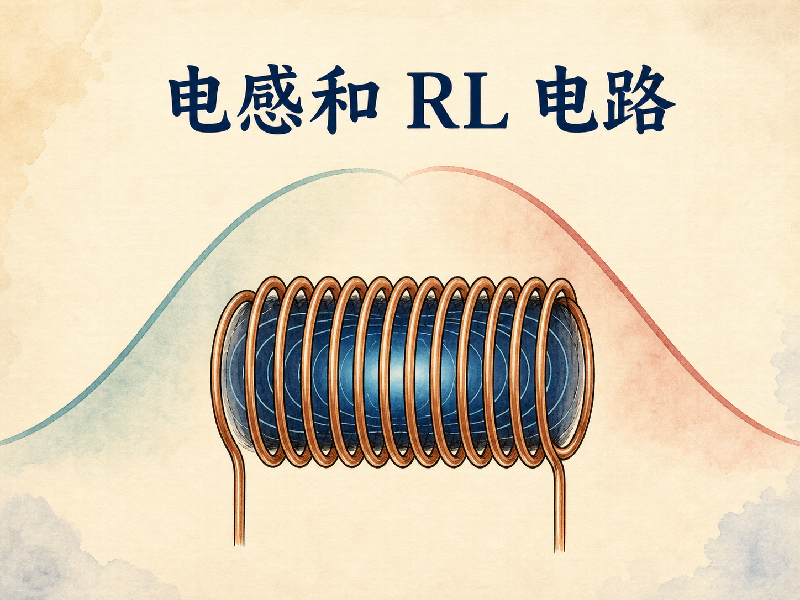
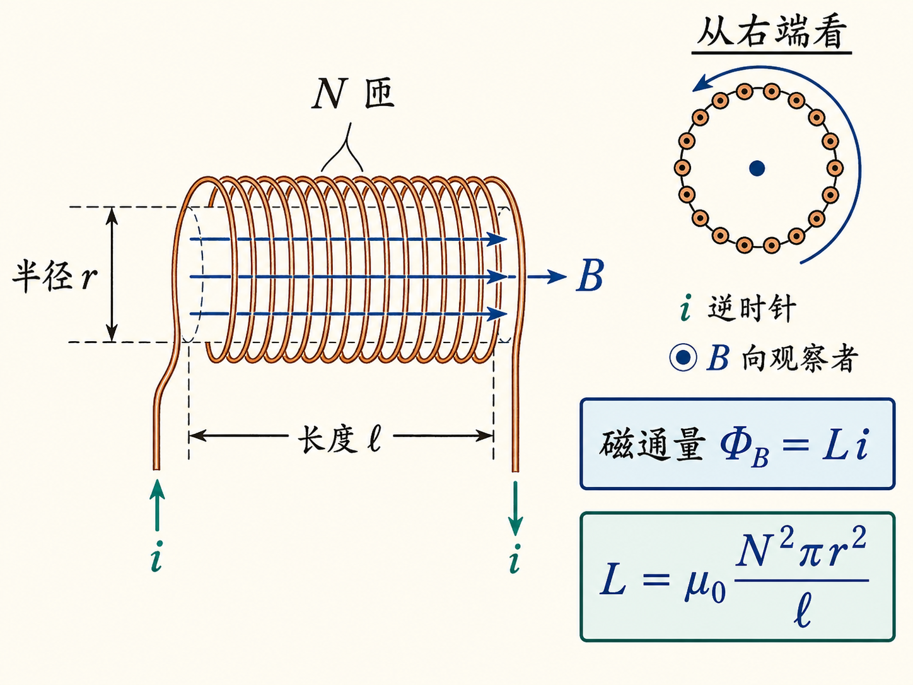
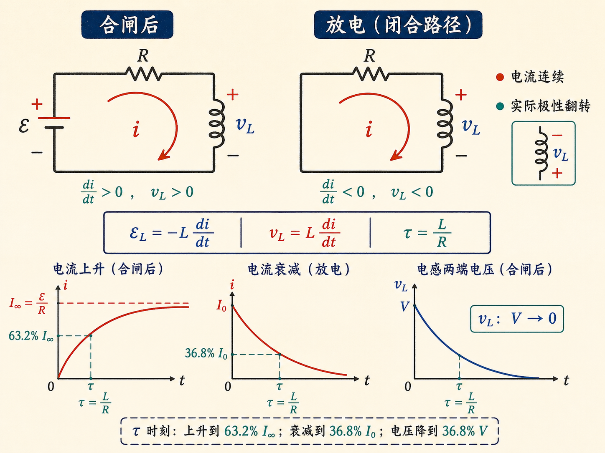
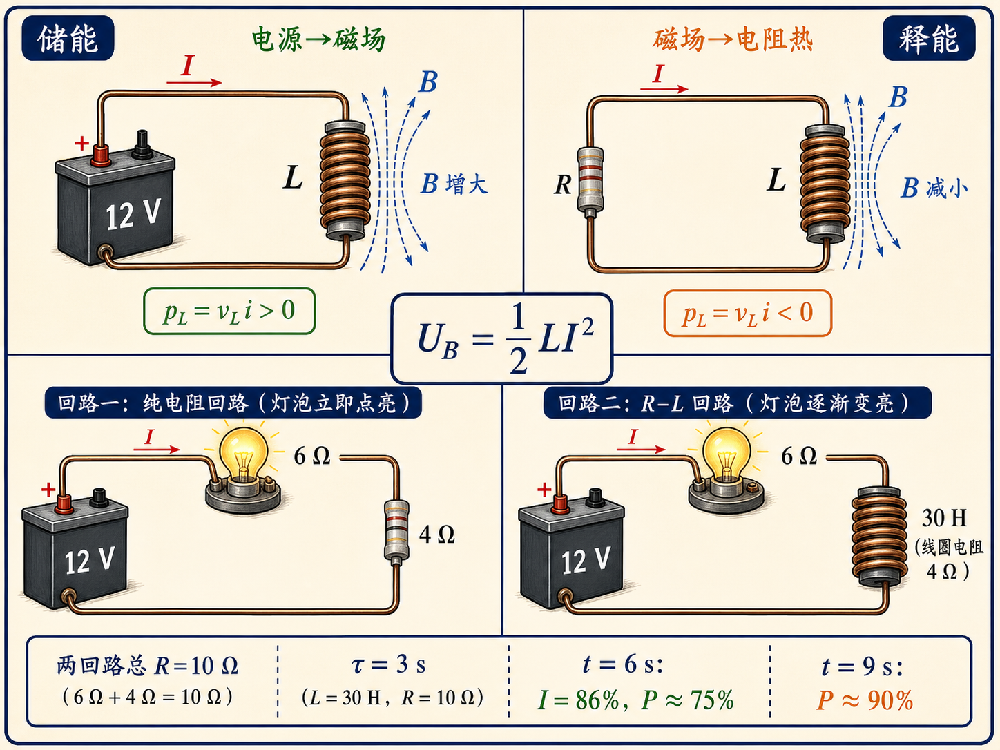
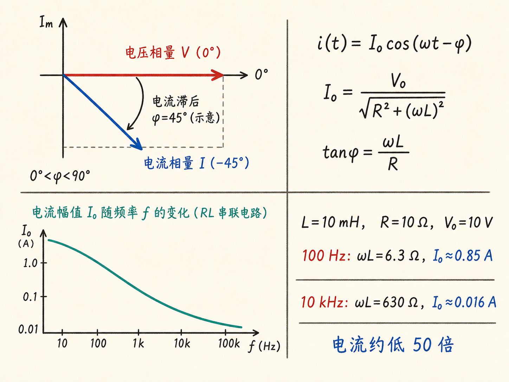
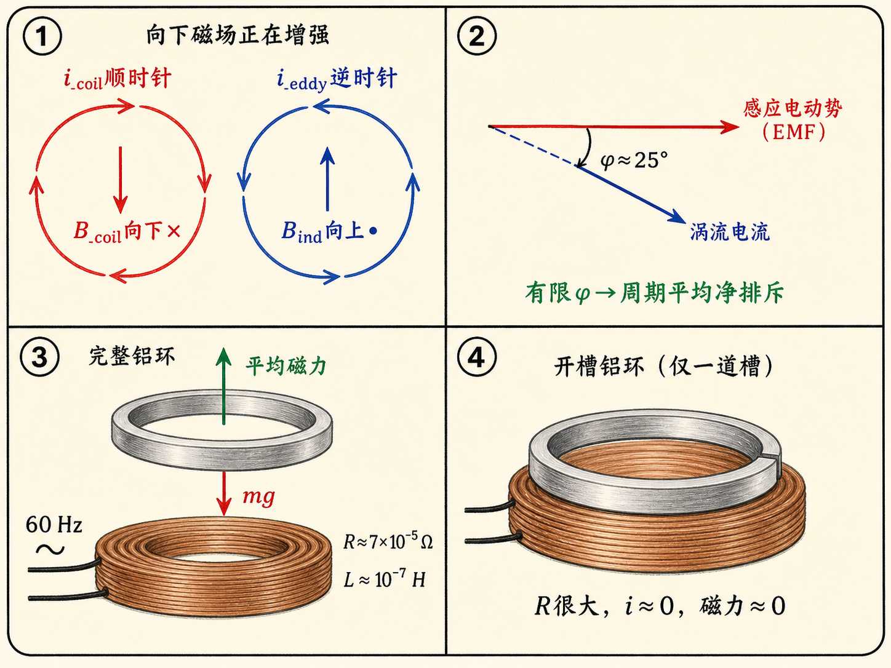

# 电感和 RL 电路：电流为什么不能说变就变

同一节 12 V 汽车电池，同时接通两只最终亮度相同的灯泡。一只几乎立刻点亮，另一只却像慢慢醒来一样，几秒以后还在继续变亮。两条支路的总电阻明明相同，差别只在于后一条支路串入了一个很大的电感器。

这不是电流“走得慢”，而是电流一旦试图改变，就会改变回路自身产生的磁通量；变化的磁通量又会产生一个反抗这种变化的电动势。电路因此获得一种“记住刚才电流”的能力：合闸时不让电流骤增，撤去电源时也不让电流骤降。

读完这篇，你会知道

- 自感 $L$ 究竟量化了什么，为什么它主要由回路几何结构决定？
- 为什么串联 RL 电路合闸后按指数规律上升，时间常数为什么是 $\tau=L/R$？
- 撤去电源后，电流为什么保持连续，电感端电压为何翻转极性？
- 磁场中的能量如何变成电阻中的热，为什么 $U_B=\tfrac12LI^2$？
- 交流电流为什么滞后于电压，高频成分又为什么被电感压低？

## 自感量化的是“自己反抗自己的变化”

回路中有电流 $i$，就会产生磁场；选定一个以回路为边界的曲面，磁场穿过这个曲面形成磁通量 $\Phi_B$。在线性条件下，电流加倍，磁通量也加倍，因此可以写成

$\Phi_B=Li$。

比例常数 $L$ 就是自感。它描述同样大小的电流能在该回路中建立多少磁通量。法拉第定律给出

$\mathcal E_L=-\frac{d\Phi_B}{dt}=-L\frac{di}{dt}$。

负号是楞次定律的内容：自感电动势反抗的是磁通量的变化，也就是在这里反抗电流的变化。电流增加时，它阻碍增加；电流减少时，它又试图维持原来的方向。

理想长螺线管能把 $L$ 的几何意义看得很清楚。设螺线管半径为 $r$、长度为 $\ell$、总匝数为 $N$，内部磁场近似均匀、外部磁场近似为零。管内磁场为

$B=\mu_0\frac{N}{\ell}i$。

每一匝的面积是 $\pi r^2$，磁场穿过 $N$ 匝，因此总磁通链为

$\Phi_B=N(\pi r^2)B=\mu_0\frac{N^2\pi r^2}{\ell}i$。

于是

$L=\mu_0\frac{N^2\pi r^2}{\ell}$。

这个结果回答了四件事：半径增大，截面积变大，$L$ 增大；匝数增大，磁通链按 $N^2$ 增长；螺线管加长，单位长度匝数下降，$L$ 减小；在这个空气芯、线性近似中，$L$ 不随电流改变。课堂上的 2800 匝、半径约 5 cm、长度 0.6 m 的螺线管，自感约为 $0.1\,\mathrm H$。亨利也等价于伏特·秒每安培。

任何实际回路都会产生某种磁场，所以自感也许很小，却不会严格为零。普通单匝导线回路可能只有纳亨或微亨量级，小到通常可以忽略；但“忽略”不等于“物理上不存在”。

## 合闸：电流从零开始，而不是瞬间跳到 $V/R$

把电池 $V$、理想电感 $L$ 和电阻 $R$ 串联，初始开关断开且 $i(0)=0$。在 $t=0$ 合闸后，沿约定电流方向写法拉第定律，可得

$iR-V=-L\frac{di}{dt}$，

也就是

$V=L\frac{di}{dt}+iR$。

这里需要把两个常见写法放在同一套符号约定中理解。若采用被动符号约定，让参考电流流入电感的正端，则电感端电压为 $v_L=L\,di/dt$；若沿参考电流方向描述电感内部产生的自感电动势，则 $\mathcal E_L=-L\,di/dt$。二者符号相反，指的是同一物理效应，不是两条矛盾的定律。

闭合环路上的电场线积分在磁通变化时并不为零，而是 $-d\Phi_B/dt$。把感应项移到等式左边后当然可以写成 $L\,di/dt+iR-V=0$，但右边出现零只是代数移项；关键仍是变化磁通对应的感应电动势已经计入方程。

解这个微分方程得到

$i(t)=\frac{V}{R}\left(1-e^{-t/\tau}\right)$，其中 $\tau=\frac LR$。

$t=0$ 时，指数项为 1，所以 $i=0$；$t\to\infty$ 时，指数项趋于零，电流逐渐逼近 $V/R$。电流不是匀速上升：开始时斜率最大，随后随着 $iR$ 增大，留给 $L\,di/dt$ 的电压越来越小，上升速度也越来越慢。

当 $t=\tau$ 时，

$i(\tau)=\frac VR(1-e^{-1})\approx0.632\frac VR$。

一个时间常数对应最终电流的 63.2%，两个时间常数约为 86.5%。$L$ 越大，维持原电流状态的能力越强，建立过程越慢；$R$ 越大，在同一个 $L$ 下时间常数越短。

$L/R$ 的量纲确实是时间。因为 $1\,\mathrm H=1\,\mathrm{V\,s/A}$，而 $1\,\Omega=1\,\mathrm{V/A}$，所以 $\mathrm H/\Omega=\mathrm s$。这不是为拟合曲线硬塞进去的参数，而是回路自己的时间尺度。

## 撤去电源：电流连续，电感电压翻转

现在让回路先达到稳态 $I_0=V/R$，再把电源电压变为零，同时保留电感和电阻组成的闭合放电路径。方程变为

$L\frac{di}{dt}+iR=0$，

解为

$i(t)=I_0e^{-t/\tau}$。

刚切换的瞬间，电流仍是 $I_0$，随后才逐渐下降。若电流试图瞬间跳变，$di/dt$ 将趋于无穷，自感电动势也将趋于无穷；理想模型用这一点表达“电感电流不能突变”。因此，切换前后的电流方向保持连续。

不过端电压的极性变了。仍用“参考电流流入电感正端”的被动符号约定，放电时 $di/dt<0$，所以 $v_L=L\,di/dt<0$。这表示电感原先标注的正端现在电势更低：电感把自己变成了向外送能的源，驱动同方向电流继续流过电阻。自感电动势 $\mathcal E_L=-L\,di/dt$ 则沿原电流方向为正，恰好说明它在反抗电流的下降。

一个时间常数后，

$i(\tau)=I_0e^{-1}\approx0.368I_0$。

也就是说，上升曲线在 $t=\tau$ 到达 63.2%，衰减曲线在同一时刻剩下 36.8%。这两个数字来自同一个 $e^{-1}$，不是两套互不相关的经验规律。

## 能量没有消失：它先进入磁场，再流向电阻

电源已撤去，电阻却仍在以 $i^2R$ 发热。能量只能来自先前建立的磁场。把衰减电流代入总热量

$Q=\int_0^\infty i^2R\,dt$

可得

$Q=I_0^2R\int_0^\infty e^{-2Rt/L}dt=\frac12LI_0^2$。

因此，电感在电流为 $I$ 时储存的磁场能量是

$U_B=\frac12LI^2$。

功率方向也能给出同样的结论。采用被动符号约定时，电感吸收功率

$p_L=v_Li=Li\frac{di}{dt}=\frac{d}{dt}\left(\frac12Li^2\right)$。

合闸期间 $i>0$、$di/dt>0$，所以 $p_L>0$，能量流入磁场；放电期间 $i>0$、$di/dt<0$，所以 $p_L<0$，能量从磁场流出，最后在电阻中变成热。储能与释能的符号完全由同一个端电压和电流参考方向决定。

对理想螺线管，把 $L=\mu_0N^2\pi r^2/\ell$ 和 $B=\mu_0Ni/\ell$ 代入，可得

$U_B=\frac{B^2}{2\mu_0}(\pi r^2\ell)$。

括号里是磁场所在的螺线管体积，因此磁场能量密度为

$u_B=\frac{B^2}{2\mu_0}$。

它与电场能量密度 $u_E=\tfrac12\varepsilon_0\kappa E^2$ 相呼应：建立电场要做功来安排电荷，建立磁场则要做功来顶住自感电动势、把电流逐渐推起来。

## 两只灯泡，把三秒时间常数直接变成亮度

灯泡演示使用一个 30 H 的大电感。它的线圈有 $4\,\Omega$ 实际电阻，再串联一只热态电阻约 $6\,\Omega$ 的 8 W 灯泡，总电阻为 $10\,\Omega$。另一条支路用相同灯泡再串入 $4\,\Omega$ 电阻，使两条支路的欧姆电阻相同。这样，亮起速度的差别就主要来自大电感，而不是总电阻不同。

含电感支路的时间常数是

$\tau=\frac{30\,\mathrm H}{10\,\Omega}=3\,\mathrm s$。

6 s 后，也就是 $2\tau$，电流只有最终值的约 86%。灯泡功率与 $i^2R$ 成正比，所以亮度约为 $0.86^2\approx0.75$，只有最终亮度的四分之三。9 s 后电流约为最终值的 95%，亮度约为 90%。于是肉眼能明显看到它在十几秒内还在继续变亮。比较中的灯泡电阻取热态数值，这也是演示条件的一部分。

## 接上交流：电感不只在开关瞬间起作用

若电源变成

$v(t)=V_0\cos\omega t$，

电流每个周期都在变化，自感便持续起作用。忽略刚接通后的暂态，串联 RL 电路的稳态电流为

$i(t)=\frac{V_0}{\sqrt{R^2+(\omega L)^2}}\cos(\omega t-\phi)$，

其中

$\tan\phi=\frac{\omega L}{R}$。

这两个式子分别回答“电流有多大”和“电流晚多久”。$\omega L$ 的量纲是欧姆，它在幅值关系中像电阻一样限制电流，因此常把它看作电感对交流变化的阻碍。频率越高或 $L$ 越大，电流幅值越小；同时 $\phi$ 越大，电流相对电压滞后越明显。若 $\omega\to0$，就回到直流极限：幅值趋于 $V_0/R$，相位差趋于零。

课堂示例取 $L=10\,\mathrm{mH}$、$R=10\,\Omega$、$V_0=10\,\mathrm V$。100 Hz 时，$\omega L\approx6.3\,\Omega$，与电阻相当；10 kHz 时，$\omega L\approx630\,\Omega$，电流幅值比 100 Hz 时小约 50 倍。把这个电感突然接入音乐信号，高频小提琴成分会明显变弱，而低频受到的影响较小。

相移却不容易用耳朵听见。10 kHz 的周期只有 $100\,\mu\mathrm s$，即使相移达到 $90^\circ$，时间延迟也只有四分之一个周期，即 $25\,\mu\mathrm s$。幅值变化能改变音色，但这点时间差远低于演示中可直接听辨的尺度。

## 铝环为什么悬浮：关键不是“总在排斥”，而是相位

交流线圈下方放一块导体。约定从上往下看，某一瞬间线圈电流顺时针，线圈产生向下的磁场。若这个向下磁场正在增强，楞次定律要求导体中的涡流产生向上的磁场，因此涡流为逆时针，两个回路电流方向相反，瞬时作用表现为排斥。

但交流进入下一阶段时，向下磁场会开始减弱。感应电动势随 $d\Phi_B/dt$ 立即翻转。如果涡流与感应电动势完全同相，那么两个电流会有半个周期反向、半个周期同向，排斥和吸引交替，无法解释周期平均的净升力。

导体回路本身同时具有 $R$ 和 $L$，所以涡流相对感应电动势滞后 $\phi$。把线圈电流写成余弦，相应感应电动势与它相差四分之一周期；涡流再相对电动势滞后。当 $\phi$ 趋近 $90^\circ$ 时，涡流几乎始终与线圈电流反向，排斥占据整个周期。实际装置的相位角未必达到 $90^\circ$；只要相位滞后有限，周期平均仍可出现净排斥。

定量演示使用半径约 5 cm 的铝环。室温电阻约为 $7\times10^{-5}\,\Omega$，粗略估算自感约为 $10^{-7}\,\mathrm H$；在 60 Hz 下取 $\omega\approx360\,\mathrm{rad/s}$，有 $\omega L/R\approx1/2$，对应 $\phi\approx25^\circ$。这个相位滞后足以让完整铝环获得平均向上的力并悬浮。

把同样的铝环切开一道槽，磁通变化仍会产生感应电动势，但闭合电流路径被破坏，等效电阻变得极大。此时 $\omega L/R\to0$，更重要的是感应电流本身几乎为零；没有足够的涡流，就没有足够的磁力，开槽环不会悬浮。

## 最后收束：电感保存的不是电流，而是改变电流所付出的功

从合闸、放电到交流与磁悬浮，所有现象都由同一条关系串起来：$\mathcal E_L=-L\,di/dt$。它让电流保持连续，让直流暂态以 $L/R$ 为时间尺度，让交流电流产生幅值衰减与相位滞后，也让建立电流时所做的功以 $\tfrac12LI^2$ 储存在磁场中。

所以，电感并不是把电流“锁住”。它做的是更准确的一件事：任何人想改变电流，都必须先处理随之改变的磁通量和能量。合闸时，电源把能量推入磁场；撤去电源时，磁场把能量送回电路；交流时，这场能量交换每个周期都在发生。RL 电路的指数曲线、相位角和悬浮铝环，只是这条机制在不同时间尺度上的三种面貌。
