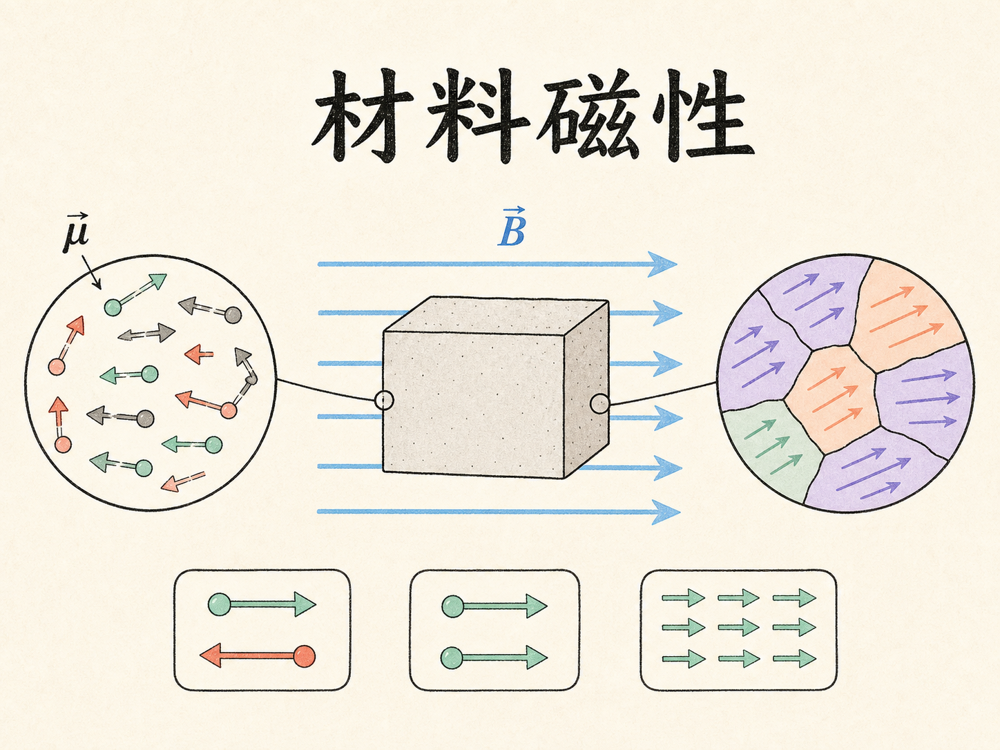
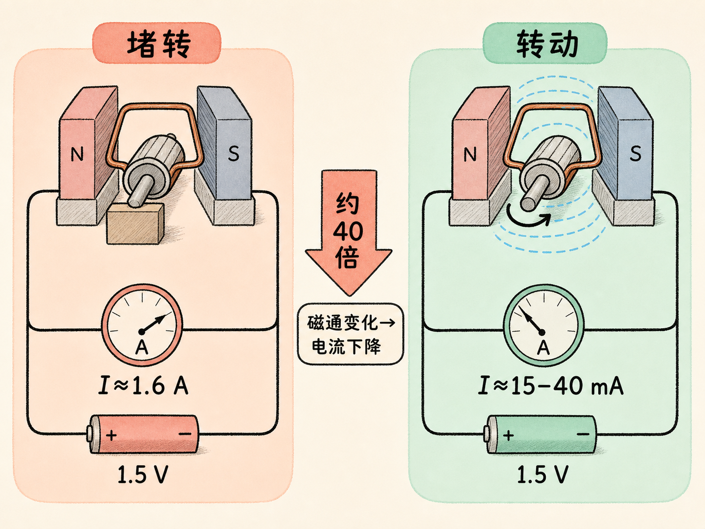
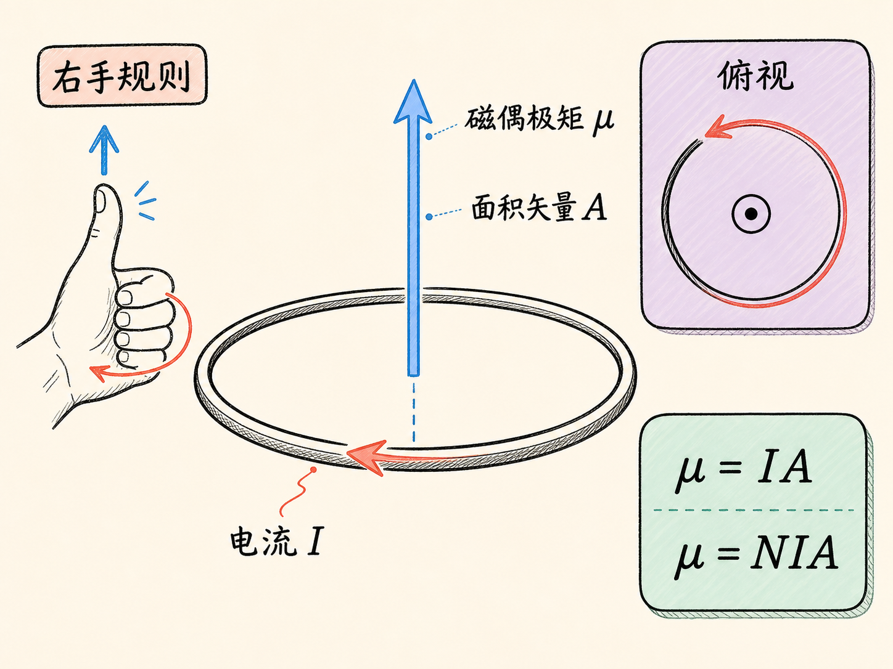
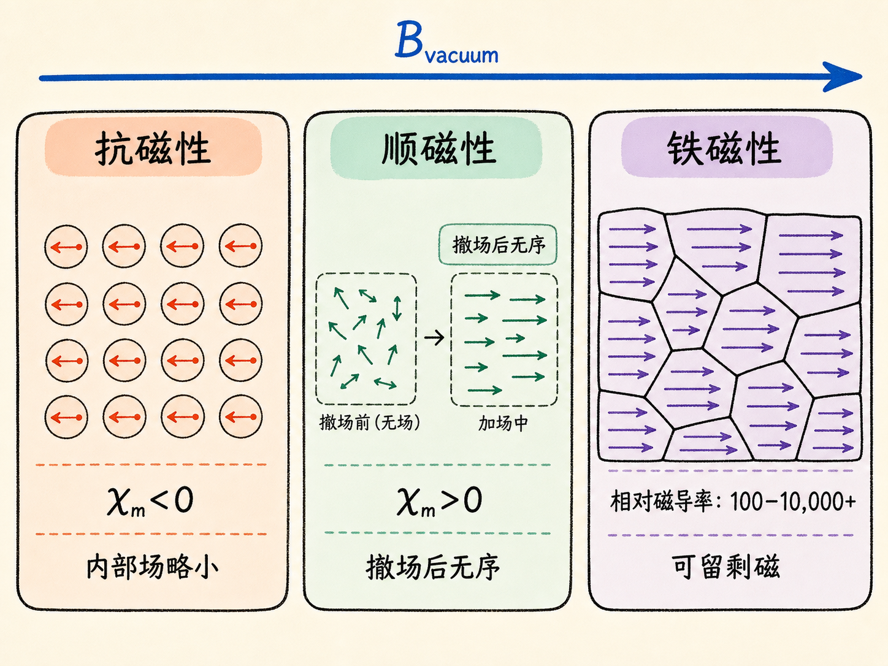
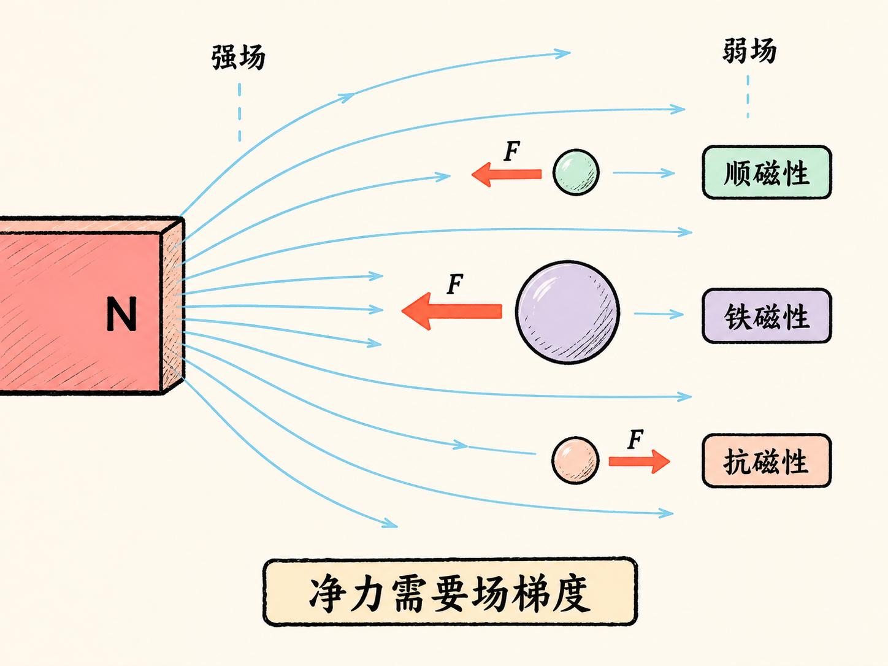
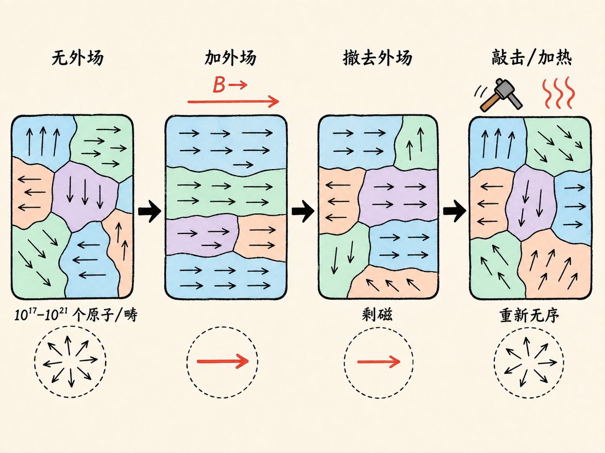
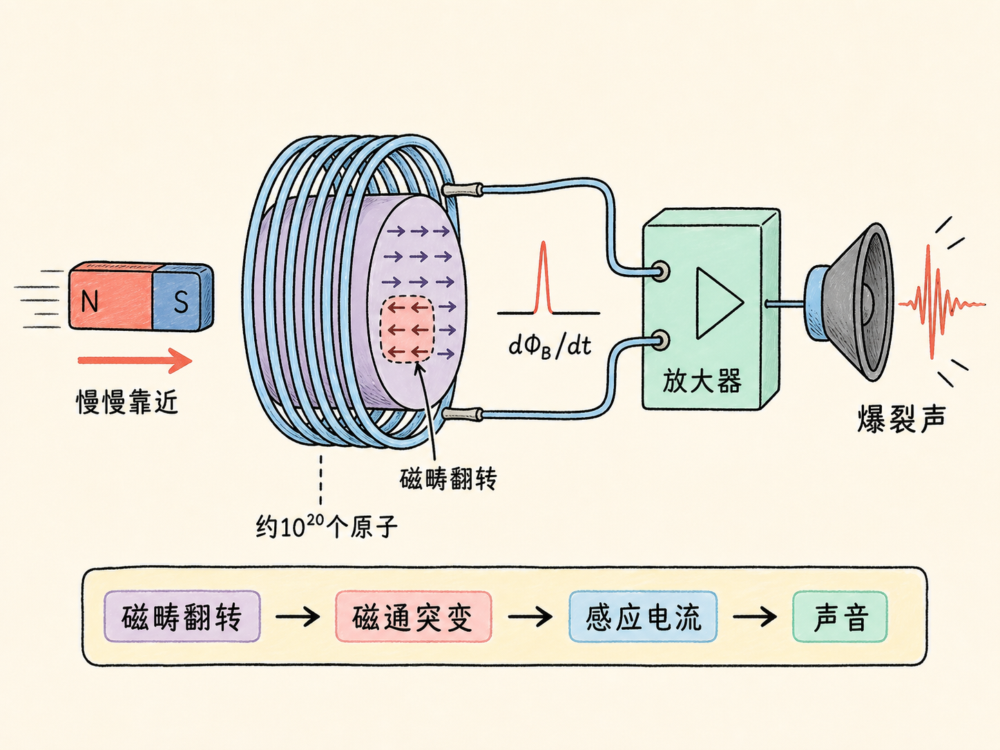
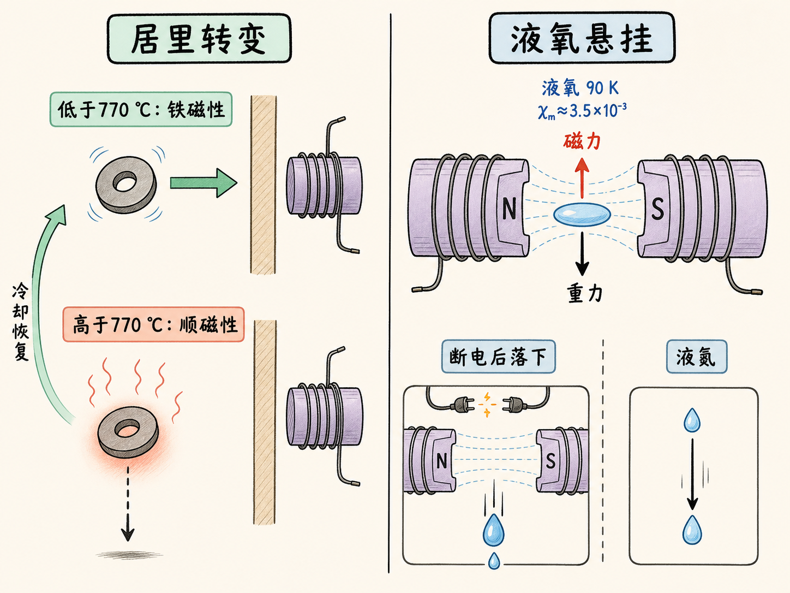

# 材料磁性：同一块磁铁，为什么能吸铁、推开抗磁材料，还能托住液氧

一根 15 kg 的铁磁棒，会被通电的螺线管猛地吸向中心；一小团液氧，也能悬在电磁体两极之间。可同样是磁场，把铝放到普通磁铁旁边，它却几乎纹丝不动。

区别不只是“有没有磁性”。所有材料都会响应外加磁场，只是原子尺度的磁偶极矩以不同方式响应，最终把材料分成抗磁性、顺磁性和铁磁性三类。要理解它们，关键是把三个问题分开：材料内部的磁场怎样改变，偶极矩怎样取向，以及非均匀磁场怎样产生净力。

读完这篇，你会知道

- 电流回路的磁偶极矩如何定义，方向怎样判断
- 抗磁性、顺磁性和铁磁性的微观响应有什么不同
- 为什么材料只有在非均匀磁场中才会被拉向强场或推向弱场
- 磁畴为什么会留下永久磁性，又怎样被敲击或加热打乱
- 相对磁导率、磁化率、居里温度和液氧悬挂演示怎样连成一条物理链

## 先从获奖电机看见一个熟悉的反作用

课堂一开始展示的是电机竞赛。225 台电机中有 6 台超过 2,000 RPM，冠军电机的回路欧姆电阻很低。转子被卡住时，电流大约为 1.6 A；电机转起来后，电流会降到 40 mA、30 mA，甚至 15 mA，前后可以相差约 40 倍。

原因在于，转子一旦转动，线圈中的磁通量便持续变化。由法拉第定律产生的感应效应会抑制原来的电流。堵住电钻或其他电机时，这个抑制作用随转动消失，大电流就可能损坏电机。

这段演示讨论的是变化的磁通量。接下来要讲的抗磁性却不是涡流，也不能简单归到楞次定律：即使外加磁场保持恒定，材料仍会在原子尺度上作出响应。

## 一只电流回路，就是一个磁偶极子

先把磁偶极矩定义清楚。对面积为 $A$、电流为 $I$ 的单匝回路，磁偶极矩为

$\boldsymbol{\mu}=I\mathbf A$。

这里的 $\mathbf A$ 是垂直于回路平面的面积矢量，方向由右手螺旋规则确定：四指沿电流方向弯曲，拇指所指就是 $\mathbf A$，也就是 $\boldsymbol{\mu}$ 的方向。若有 $N$ 个同向线圈，它们彼此加强，磁偶极矩变为

$\boldsymbol{\mu}=NI\mathbf A$。

材料磁性的差别，可以先看成材料内部这些“微小电流回路”怎样面对外加磁场。

## 抗磁性：诱导出的磁偶极矩反抗外场

所有材料都具有一定程度的抗磁响应。恒定外加磁场会在原子尺度上诱导出磁偶极矩，其方向反抗外场，所以材料内部磁场会比没有材料时的真空场略小。

这里需要划清边界：这不是变化磁场在导体自由电子中激起的涡流，也不能用楞次定律来解释。外场可以是恒定的，这种原子尺度响应需要量子力学才能说明；在这堂课的范围内，只接受这个结果。

## 顺磁性：已有的小磁体只做轻微取向

有些原子或分子本身就具有永久磁偶极矩，可以把它们想成一个个小磁体。没有外场时，它们方向杂乱，彼此抵消，因此材料整体没有净磁场，也不是永久磁体。

施加外场后，这些磁偶极矩会尝试沿外场取向。外场越强，取向趋势越明显；温度越低，热运动越弱，也越容易取向。它们加强外场，所以顺磁性材料内部的磁场会比真空场略大。

一旦撤去外场，偶极矩马上重新变得杂乱，材料不会留下永久磁性。这一点与铁磁性正好构成分界。

## 有净力的关键，不是“有磁场”，而是“磁场不均匀”

把一个已经朝外场方向取向的顺磁性原子想成小电流回路。回路各处都受到洛伦兹力，方向由 $\mathbf I\times\mathbf B$ 判断。在均匀磁场中，各处受力互相抵消；在磁体外部那种强弱随位置变化的磁场中，靠近磁体的一侧受力更大，回路就得到指向强场区的净力。

因此，顺磁性材料被拉向强场区。抗磁性材料诱导出的磁偶极矩方向相反，会被推向弱场区。只有场不均匀时，这种方向差别才会表现为平移的净力。

铝是顺磁性的，确实会受到指向磁体的力，但这个力通常远小于自身重量，所以普通磁体提不起铝。不能把“没有被提起来”误解成“完全没有磁力”。

## 铁磁性：不是一个偶极子慢慢转，而是一整个磁畴翻转

铁磁性材料的原子同样带有永久磁偶极矩。不同之处在于，大量偶极矩会组成磁畴：每个磁畴的尺度约为十分之几毫米，也许约 0.3 mm；畴内偶极矩百分之百同向排列，一个磁畴可包含约 $10^{17}$ 至 $10^{21}$ 个原子。

没有外场时，不同磁畴朝向不同，整块材料仍可能没有净磁场。施加外场后，磁畴可以整体翻转并朝外场取向。温度越低，热运动造成的随机扰动越弱，取向越容易。材料内部磁场由此可以比真空场强上千倍。

撤去外场后，一部分磁畴会因热运动翻回杂乱方向，另一部分却可能保留取向，于是材料留下永久磁性。敲击材料会扰乱磁畴；加热也会破坏它们的共同取向。回形针挂过磁体后可以短暂吸住另一枚回形针，摔落几次后磁性减弱，正是这种残留取向被扰乱的表现。

铁磁性材料同样被非均匀磁场拉向强场区，但力远大于顺磁性材料。课堂中的电磁体产生约 320 G 的非均匀磁场，15 kg 铁磁棒一通电就被猛地吸入，并在越过中心后被拉回最强场位置。决定它停在哪里的不是磁极名称，而是哪里场最强。

## 三个演示，把看不见的磁畴变成可观察的结果

第一个演示用 $8\times8$ 枚罗盘针模拟成组取向。磁针会分成若干区域，同一区域朝向一致，不同区域朝向不同。这个画面像磁畴，却不能当作真正的磁畴模型：装置没有热运动，磁针只有两个优选方向，其排列可以用最低能量解释，不需要量子力学。它只能帮助我们看见“成组取向”这件事。

第二个演示让人直接听见磁畴翻转。线圈接到放大器和扬声器，没有铁磁芯时，磁体快速靠近会造成明显的磁通量变化，从而产生感应电动势和电流；磁体缓慢移动时，$d\Phi_B/dt$ 太小，扬声器几乎无声。

把铁磁性材料放进线圈后，即使磁体移动得很慢，一组磁畴也可能在极短时间内突然翻转。材料内部磁通量因此骤变，线圈感应出短促电流，扬声器发出爆裂声。一次翻转可能涉及约 $10^{20}$ 个原子。顺磁性材料没有这种磁畴成组翻转，因此不会产生同样的声音。

第三个演示回到温度：一只铁磁性垫圈被磁体拉向隔热屏。加热到居里温度以上，它失去铁磁性并掉下来；停止加热后，它冷却并恢复铁磁性，又回到磁体旁。这个突然的变化告诉我们，磁畴本身也有存在条件。

## 用两个数描述材料怎样改变磁场

在许多情况下，材料内部磁场与没有材料时的真空场近似成线性关系：

$B_{\text{inside}}=\kappa_m B_{\text{vacuum}}$。

$\kappa_m$ 是相对磁导率。对内部场只比真空场大一点或小一点的材料，再定义磁化率 $\chi_m$：

$\kappa_m=1+\chi_m$。

抗磁性材料的 $\chi_m<0$，所以 $\kappa_m$ 略小于 1。例如 $\chi_m=-1.7\times10^{-4}$ 时，内部场只比真空场小一点。顺磁性材料的 $\chi_m>0$，但数值通常也很小，内部场只略大于真空场。

铁磁性材料完全不同。它的 $\chi_m$ 大到式子中的 1 可以忽略，因而 $\chi_m$ 近似等于 $\kappa_m$。$\kappa_m$ 可以是 100、1,000、10,000，甚至更大；若 $\kappa_m=10{,}000$，内部场就可能是真空场的 10,000 倍。不过这种增长存在上限，这堂课暂不展开。

## 温度怎样改写顺磁性和铁磁性

顺磁性和铁磁性都依赖温度。降温会削弱热运动，使磁偶极矩或磁畴更容易沿外场取向。抗磁性则不依赖温度。

对铁磁性材料，加热到一个精确温度后，磁畴会突然消失，材料转为顺磁性。这个温度叫居里温度。铁的居里温度是 1,043 K，也就是 770 ℃；镍约为 358 ℃；钴约为 1,400 K。钆的转变温度约为 16 ℃，所以低于 16 ℃ 时为铁磁性，高于 16 ℃ 时为顺磁性。

一旦越过居里点，原本能挂在磁体上的材料可能立刻掉落，因为顺磁力通常小于它自身的重量。降温越过居里点后，铁磁性又会恢复。

## 液氧为什么能挂在磁体上

一标准大气压、300 K 的氧气，其磁化率约为 $2\times10^{-6}$。液氧在 90 K 时，磁化率会达到气态数值的约 1,800 倍。第一部分增幅来自密度：液体通常比一标准大气压下的气体密约 1,000 倍，每立方米中可参与取向的偶极子也相应更多。第二部分来自更低温度：热运动减弱，外场更容易使偶极矩取向。

即便如此，液氧内部磁场也只比真空场高 0.35%，因为此时 $\chi_m$ 约为 $3.5\times10^{-3}$。但只要电磁体足够强，而且磁场足够不均匀，这一点点差别产生的净力就能超过液氧自身重量，于是液氧悬在两极之间。切断电流后，电磁体失去磁场，液氧便落下。

液氮的表现相反。氮是抗磁性的，会被推离强场区，因此倒入两极之间后直接落下。铝虽是顺磁性的，$\chi_m$ 约为 $2\times10^{-5}$，但仍不足以让普通大小的样品挂在磁体上。

## 最后收束：先看内部场，再看场梯度

材料磁性可以用两层判断串起来。

第一层看材料怎样改变内部磁场：抗磁性诱导出反向响应，$\chi_m<0$；顺磁性让已有偶极矩稍微顺着外场取向，$\chi_m>0$；铁磁性让大量偶极矩以磁畴为单位共同翻转，内部场可以被极大增强，还可能留下永久磁性。

第二层看外场是否不均匀。没有梯度，各处受力可以互相抵消；有梯度，顺磁性和铁磁性材料被拉向强场区，抗磁性材料被推向弱场区。15 kg 铁磁棒与悬挂的液氧看似是两个完全不同的演示，其实都服从这条共同的受力逻辑，只是响应强度相差巨大。
