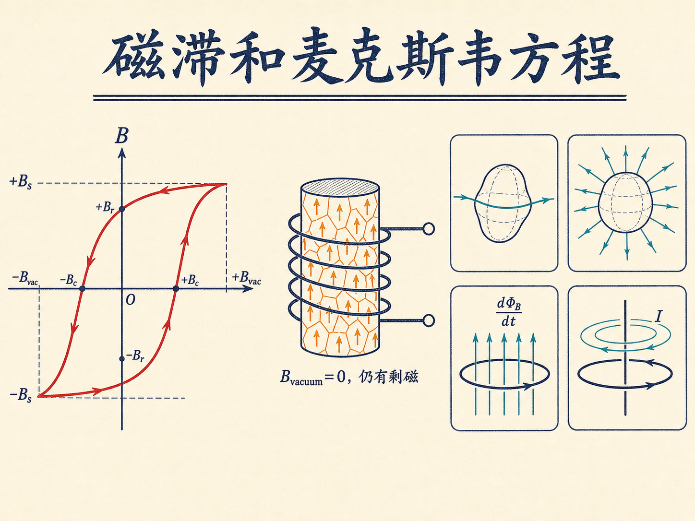
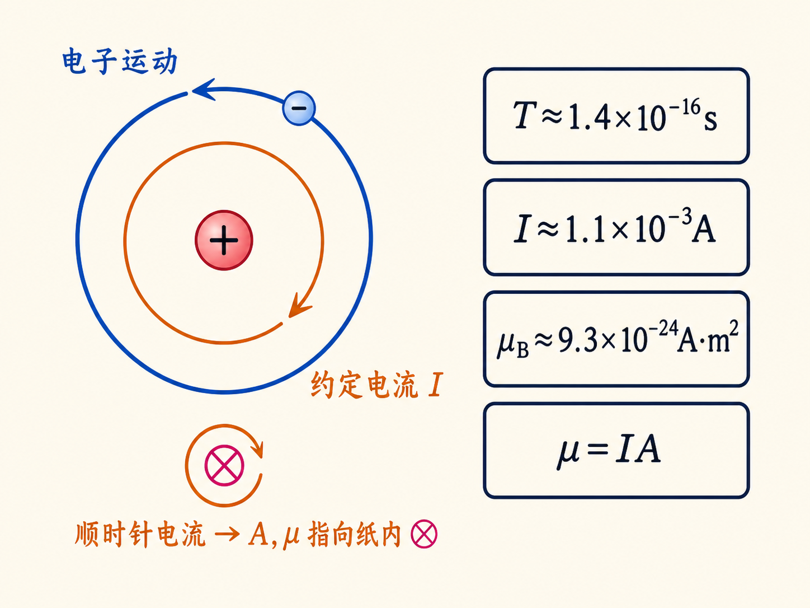
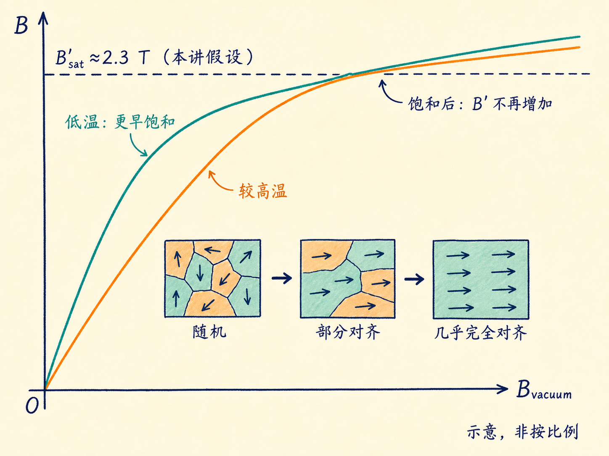
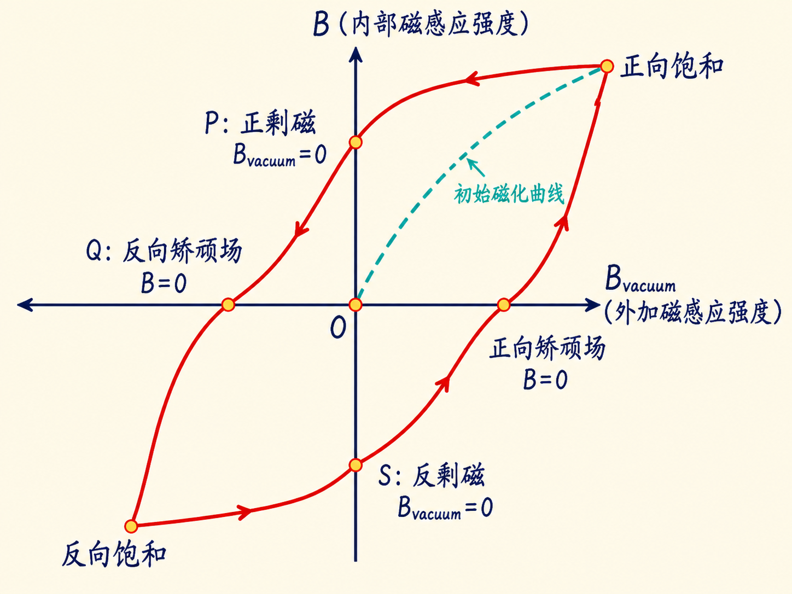
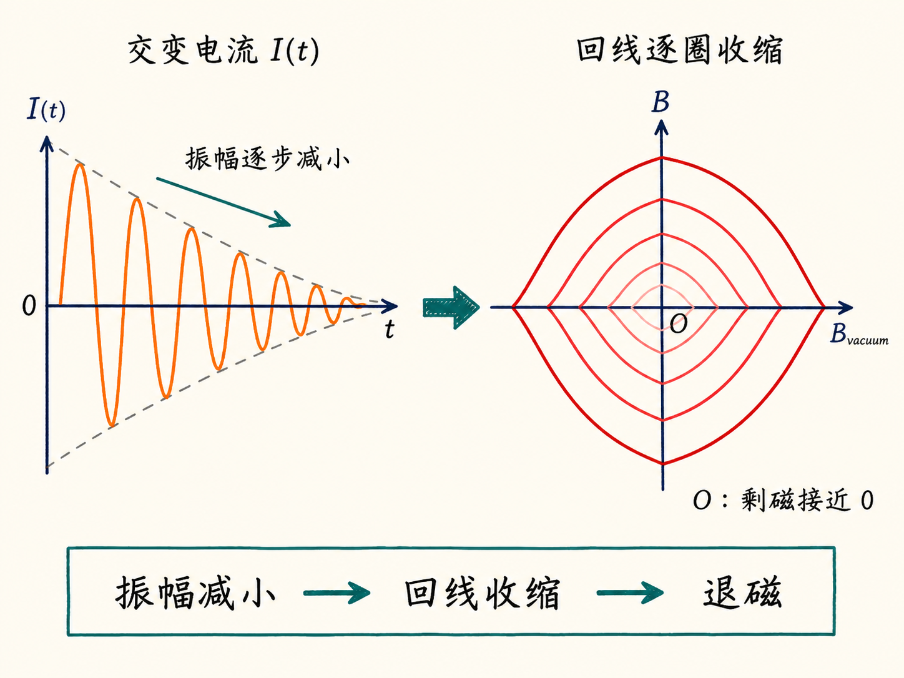
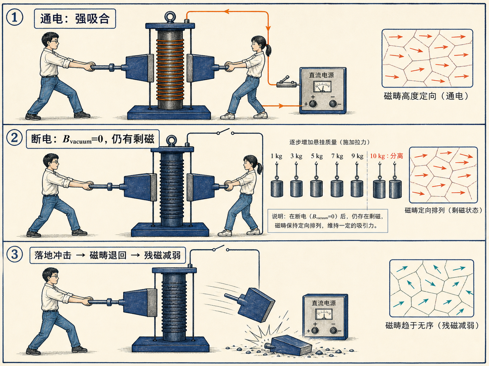
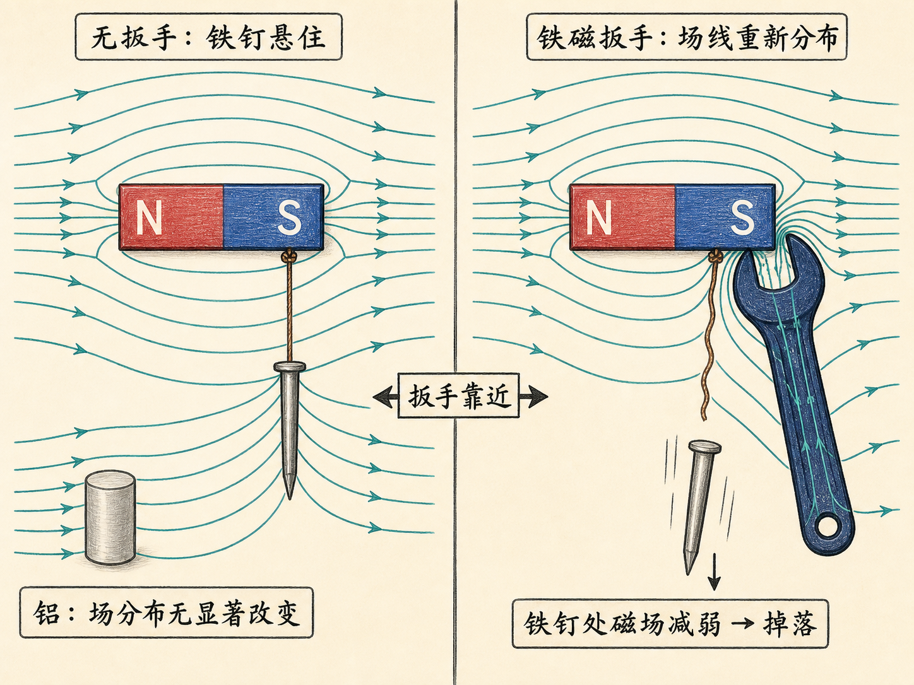
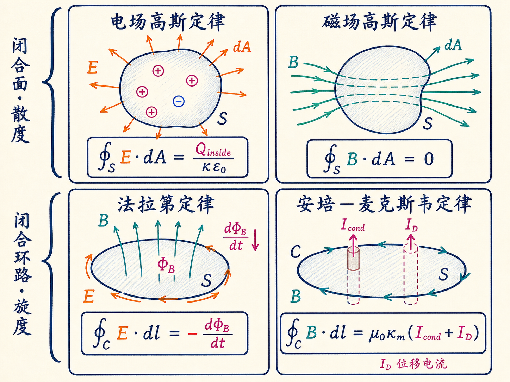

# 磁滞和麦克斯韦方程

一只通电的电磁铁能把两块铁磁材料牢牢吸在一起，这不奇怪。奇怪的是：把电流关掉以后，它们仍然没有分开，甚至还能承受接近 $10\,\mathrm{kg}$ 的负载。螺线管产生的外加磁场已经归零，材料为什么还像磁体一样？

更反直觉的现象出现在磁滞曲线上：同一个外加磁场，材料内部可能对应两个不同的磁场。只知道此刻的电流还不够，你还要知道这块材料此前经历过怎样的磁化过程。

读完这篇，你会知道

- 单个原子的磁偶极矩为什么可以估算到玻尔磁子的量级
- 铁磁材料为什么会进入磁饱和，线性相对磁导率何时失效
- 磁滞回线怎样记录饱和、剩磁、矫顽场和反向磁化路径
- 怎样用加热、敲击或幅度递减的交流磁场退磁
- 磁性材料进入后，四条麦克斯韦方程该怎样分类和使用

## 从一个电子得到玻尔磁子

先把原子想成一个经典的微型电流环。氢原子中心的质子带电 $+e$，电子带电 $-e$，电子沿半径 $r$ 的圆轨道运动。电子运动方向与约定电流方向相反；电流环的面积矢量按右手规则确定，磁偶极矩满足

$\boldsymbol\mu=I\mathbf A$。

这个模型不是完整的量子力学，但能给出正确的数量级。取电子质量 $m_e\approx9.1\times10^{-31}\,\mathrm{kg}$、电荷量 $e\approx1.6\times10^{-19}\,\mathrm C$、轨道半径 $r\approx5\times10^{-11}\,\mathrm m$，电流环面积为

$A=\pi r^2\approx8\times10^{-21}\,\mathrm{m^2}$。

质子与电子之间的库仑力提供向心力：

$\dfrac{e^2}{4\pi\varepsilon_0r^2}=\dfrac{m_ev^2}{r}$。

由此得到电子速率约 $v\approx2.3\times10^6\,\mathrm{m/s}$。它绕一圈的时间为 $T=2\pi r/v\approx1.4\times10^{-16}\,\mathrm s$，所以等效电流

$I=\dfrac eT\approx1.1\times10^{-3}\,\mathrm A$。

一个电子的轨道运动竟对应约一毫安的电流。把它乘以轨道面积，得到

$\mu=IA\approx9.3\times10^{-24}\,\mathrm{A\,m^2}$。

这个量级就是玻尔磁子 $\mu_B$。再加入量子力学的限定后，轨道磁偶极矩只能取玻尔磁子的整数倍；电子自旋也贡献磁偶极矩。一个原子或分子的净磁偶极矩，是所有轨道贡献与自旋贡献的矢量和，其中一些会相互抵消，常见结果是一个或两个玻尔磁子。

## 线性关系只在磁畴尚未饱和时好用

把材料放进螺线管，先把线圈单独产生的外加场记为 $\mathbf B_{\rm vacuum}$，把材料中磁偶极子取向产生的贡献记为 $\mathbf B'$。材料内部总场是两者的矢量和：

$\mathbf B=\mathbf B_{\rm vacuum}+\mathbf B'$。

如果 $\mathbf B'$ 与外加场成线性正比，就可以写成

$\mathbf B'=\chi_m\mathbf B_{\rm vacuum}$，

于是

$\mathbf B=(1+\chi_m)\mathbf B_{\rm vacuum}=\kappa_m\mathbf B_{\rm vacuum}$。

这里 $\chi_m$ 是磁化率，$\kappa_m=1+\chi_m$ 是相对磁导率。关键条件是“线性”。顺磁材料在这里没有明显问题，铁磁材料却会偏离这条直线，因为铁磁材料中的磁偶极子已经组成磁畴，外场可以让整个磁畴一起翻转。当越来越多磁畴取向一致，最终所有可取向的磁偶极子都沿同一方向，材料就进入磁饱和。

饱和场能有多大，可以再做一次数量级估算。设每个原子的磁偶极矩为 $2\mu_B$，原子数密度为 $n\approx10^{29}\,\mathrm{m^{-3}}$。把整齐排列的原子电流环类比成一根螺线管，一米长度内的等效匝数与 $An$ 对应，于是材料取向产生的饱和贡献约为

$B'_{\rm sat}\approx\mu_0(2\mu_B)n\approx2.3\,\mathrm T$。

这个 $2.3\,\mathrm T$ 依赖“每个原子两个玻尔磁子”和上述数密度，不是所有材料的固定数值。到达饱和前，曲线可以很陡，例如初始斜率对应 $\kappa_m\sim10^3$；到达饱和后，$\mathbf B'$ 无法再增加，内部总场只能随 $\mathbf B_{\rm vacuum}$ 缓慢上升。温度越低，热运动越弱，磁偶极子越容易取向，也就越早进入饱和。

## 磁滞：材料把历史写进了当前状态

现在令横轴为 $B_{\rm vacuum}$，纵轴为材料内部总场 $B$，并把右和上定义为正方向。从未磁化状态的原点出发，逐渐增加正向电流，曲线沿初始磁化路径进入正向饱和。然后按下面的顺序改变外场：

1. 从正向饱和减小 $B_{\rm vacuum}$。外场回到零时，部分磁畴没有翻回去，曲线到达 $P$ 点；此时 $B_{\rm vacuum}=0$，但 $B>0$，这就是正向剩磁。
2. 继续施加反向外场。到达 $Q$ 点时，反向的 $\mathbf B_{\rm vacuum}$ 恰好抵消仍保持正向的 $\mathbf B'$，所以内部总场 $B=0$。这个反向外场的量值就是这条曲线上的矫顽场。
3. 继续增大反向外场，磁畴进一步翻转，材料进入反向饱和。
4. 再把外场从反向饱和拉回零，曲线到达 $S$ 点；这时 $B_{\rm vacuum}=0$，但 $B<0$，留下反向剩磁。
5. 最后增加正向外场，先经过另一个 $B=0$ 的矫顽场点，再回到正向饱和。

按这组坐标和步骤，闭合回线沿“正向饱和 $\rightarrow P\rightarrow Q\rightarrow$ 反向饱和 $\rightarrow S\rightarrow$ 正向矫顽点 $\rightarrow$ 正向饱和”的方向运行。初始磁化曲线只在材料第一次从未磁化状态走向饱和时出现；一旦进入循环，系统就在磁滞回线上往返。

这条回线最重要的信息不是形状，而是“状态有记忆”。在某个给定的 $B_{\rm vacuum}$ 下，内部场 $B$ 可以落在上支，也可以落在下支。于是 $\mathbf B=\kappa_m\mathbf B_{\rm vacuum}$ 不能再被理解为一个固定比例关系。曲线上甚至存在 $B=0$ 而 $B_{\rm vacuum}\ne0$ 的点，此时若硬算比值会得到 $\kappa_m=0$；还有内部总场与外场方向相反的区段，硬算比值会得到负值。这些结果提醒我们：对铁磁材料，不能脱离磁化历史，把 $\kappa_m$ 当作一个始终不变的材料常数。

## 退磁不是把开关关掉

关掉励磁电流，只能让 $\mathbf B_{\rm vacuum}$ 回到零，不能保证磁畴全部回到无序状态。要让材料重新接近未磁化状态，可以走三条路径。

第一条是把材料加热到居里点以上，使磁畴结构瓦解，再冷却回来。第二条是敲击材料，用机械冲击促使许多磁畴翻回去，不过这种做法只能“希望得到最好结果”。第三条是更可控的退磁：施加交变电流，让外场先在正、反方向之间往返，再逐步减小振幅。磁滞回线随振幅缩小，一圈圈向原点收缩，最后让剩磁接近零。

课堂上的电磁铁把剩磁变成了可称量的结果。通电时，两块铁磁材料吸得极牢，两个人也没能拉开。断电后，外加场消失，装置仍能依次承受 $1$、$3$、$5$、$7$、$9\,\mathrm{kg}$，直到 $10\,\mathrm{kg}$ 时才分离。材料落地的冲击又像锤击一样，使许多磁畴退回，残余磁性随之显著减弱。

## 铁磁材料还会重排周围的磁场

把铁磁材料移近磁体，材料内部的磁畴会沿外场取向，使内部场增强，周围的磁场分布也随之改变。磁力线在铁磁材料中变得更集中，别处的场就可能减弱。

一枚铁钉原本被磁体吸向一侧，同时又被细线拉住，因此悬在空中。把铝块或手伸进附近，磁场分布没有显著变化；但把铁磁扳手移近磁体后，场的分布被重新安排，铁钉所在位置的磁场不再足以拉住它，于是铁钉掉了下来。这里观察到的不是“扳手把铁钉推下去”，而是铁磁材料改变了整个磁场配置。

## 四条方程：两条看闭合面，两条看闭合环路

麦克斯韦方程组可以先按几何对象分成两组。前两条讨论穿过闭合面的通量，回答“一个小体积中有没有场的源”，对应散度问题；后两条讨论沿闭合环路的环量，回答“场会不会绕着某种变化或电流旋转”，对应旋度问题。

电场的高斯定律写成闭合面积分：

$\displaystyle\oint_S\mathbf E\cdot d\mathbf A=\dfrac{Q_{\rm inside}}{\kappa\varepsilon_0}$。

源项是闭合面包围的电荷，介电常数 $\kappa$ 在这里使材料内部电场减弱。磁场的高斯定律则是

$\displaystyle\oint_S\mathbf B\cdot d\mathbf A=0$。

积分对象仍是闭合面 $S$，不是线元 $d\mathbf l$。右边为零表示没有被闭合面包围的磁单极源；磁力线不会在盒子里凭空开始或终止。

法拉第定律改用闭合环路 $C$：

$\displaystyle\oint_C\mathbf E\cdot d\mathbf l=-\dfrac{d}{dt}\int_S\mathbf B\cdot d\mathbf A$。

这里的 $S$ 是以 $C$ 为边界的开曲面，回路方向与面积法向按右手规则成对选择。负号表示感应电场的环量反抗磁通量的变化，不能把负号省掉或画成同向增强。

安培—麦克斯韦定律同样沿闭合环路积分：

$\displaystyle\oint_C\mathbf B\cdot d\mathbf l=\mu_0\kappa_m\bigl(I_{\rm cond}+I_D\bigr)$，

其中 $I_{\rm cond}$ 是穿过所选开曲面的传导电流，$I_D$ 是位移电流。它们是磁场环量的源项；闭合环路 $C$ 与所选开曲面法向仍按右手规则配对。抗磁和顺磁材料的 $\kappa_m$ 分别略小于和略大于 1，可以在这里正常使用；铁磁材料却可能饱和并产生磁滞，所以把 $\kappa_m$ 直接当作固定倍数前，必须先确认材料所处的磁化路径。

## 从磁滞回线回到麦克斯韦方程

原子的磁偶极矩可以小到 $10^{-23}\,\mathrm{A\,m^2}$ 量级，但 $10^{29}\,\mathrm{m^{-3}}$ 数量级的原子一旦协同取向，就能让材料内部出现特斯拉量级的磁场。也正因为这种集体取向会饱和、会留下剩磁、还会依赖历史，铁磁材料不能只用一个固定的 $\kappa_m$ 概括。

四条麦克斯韦方程仍然组织着电荷、电流、电场和磁场；材料没有把它们推翻。真正需要谨慎的是，把材料响应放进方程时，必须先问它是否线性、是否饱和，以及它沿磁滞回线走到了哪里。
