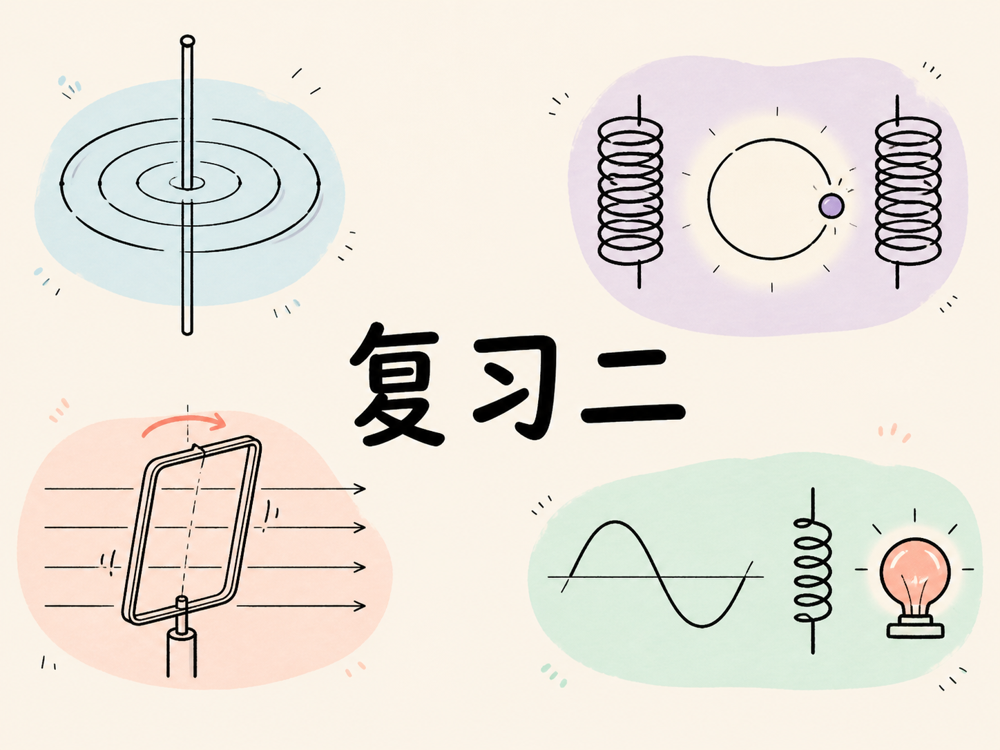
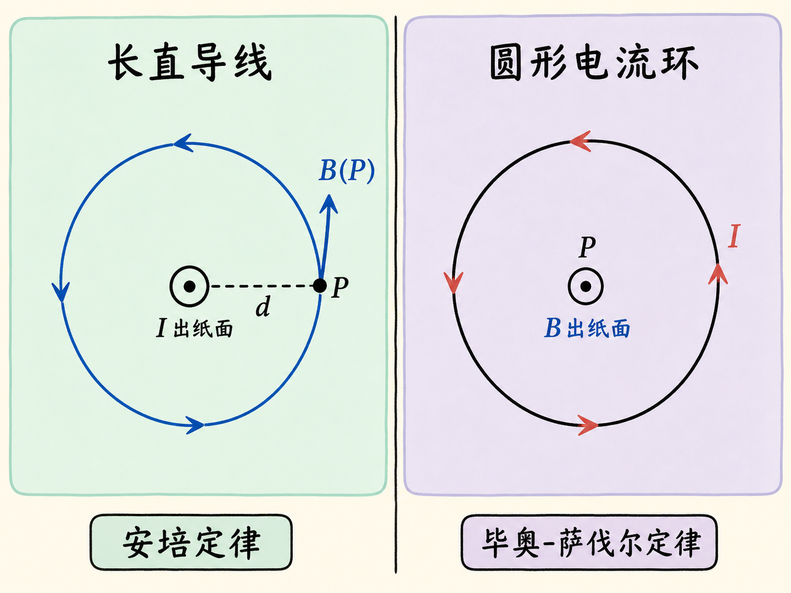
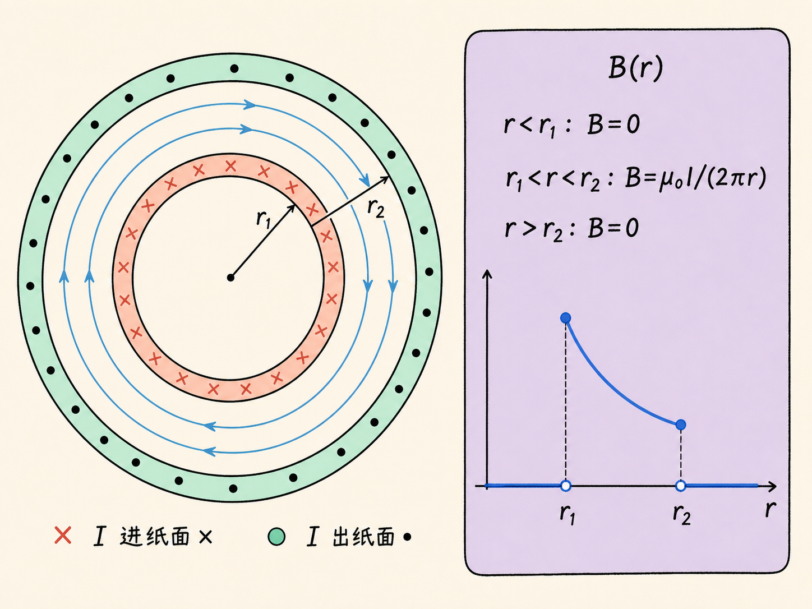
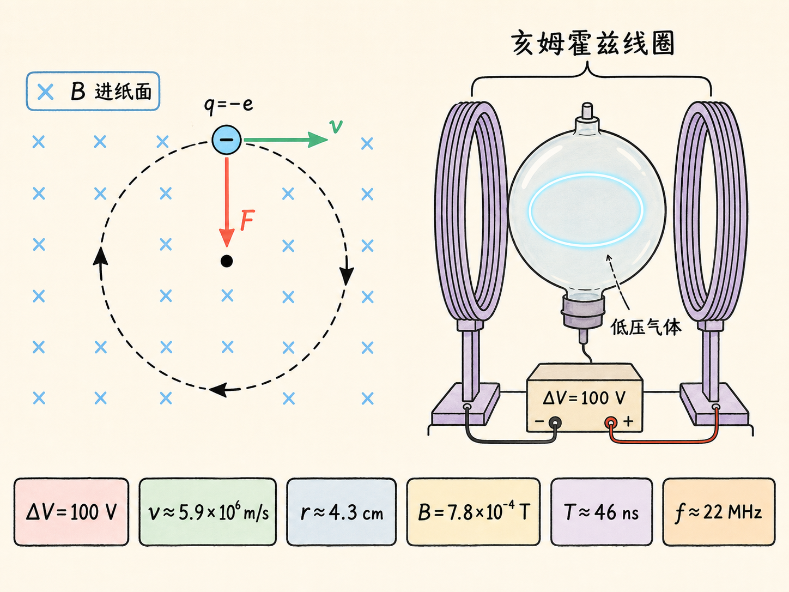
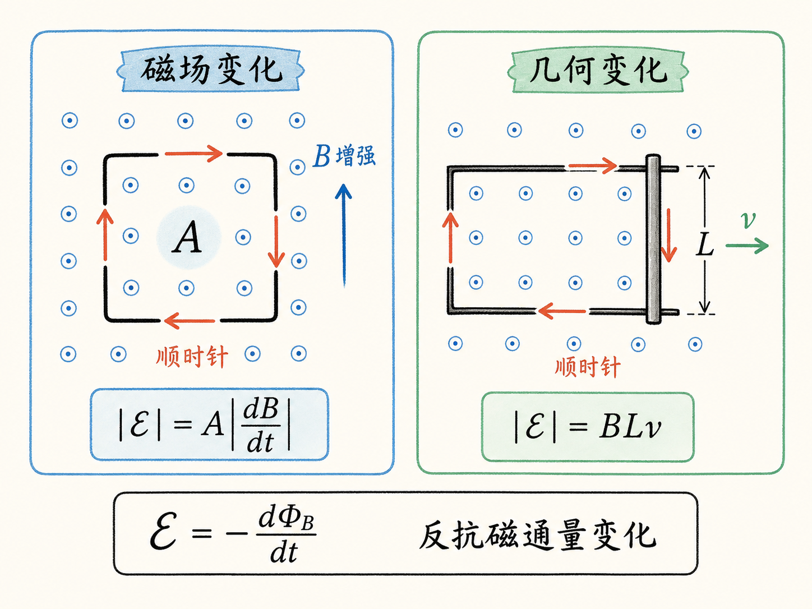
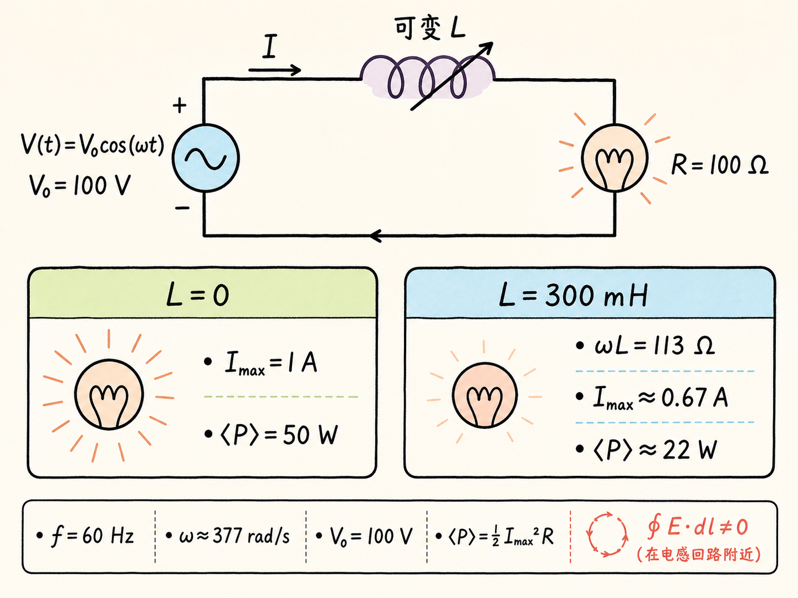
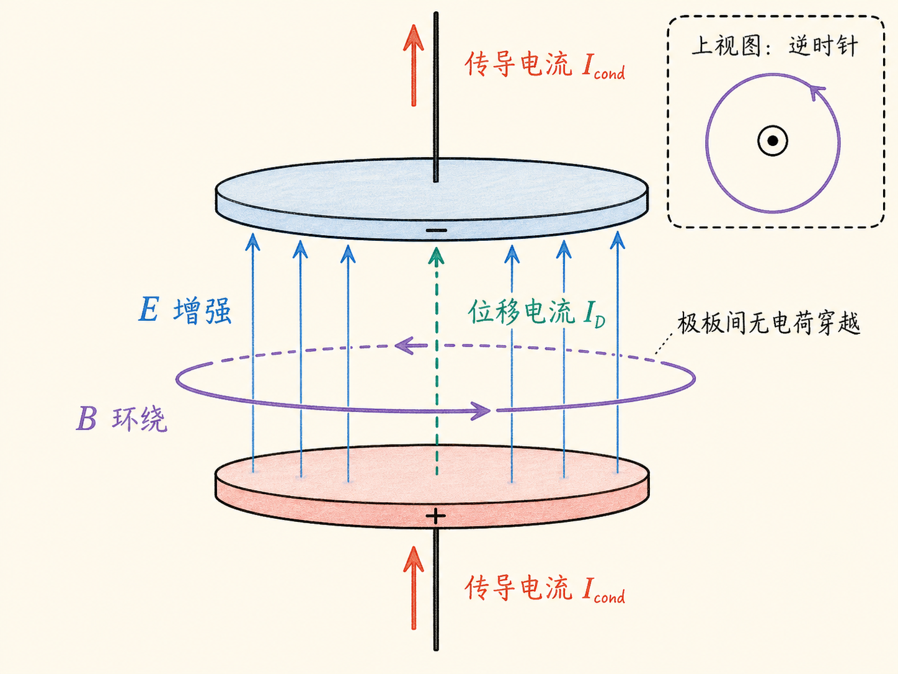

# 复习二：从磁场对称性到交流调光

一场电磁学复习课最容易变成公式清单，但真正决定你会不会做题的，往往不是记住了多少公式，而是能不能先看出问题的结构：这里有没有对称性？磁通量究竟是磁场变了，还是回路的几何形状变了？磁场力是在改变粒子的速率，还是只改变方向？

这次复习从一根无限长直导线开始，经过同轴圆筒、电子束圆周运动和航天飞机的导电系绳，最后落到交流电源、自感器与灯泡。表面上是许多分散题型，背后却始终在训练同一件事：先判断哪条物理定律最贴合问题，再处理大小、方向和适用条件。

读完这篇，你会知道

- 为什么同一根长直导线既能用毕奥-萨伐尔定律算，也更适合用安培定律算
- 怎样从对称性得到同轴圆筒内外三段不同的磁场
- 电子在匀强磁场中为何转弯却不改变速率，回旋周期为何与速率无关
- 变化磁场、运动导体棒和旋转线圈怎样以不同方式产生感应电动势
- 为什么 LR 交流电路不能只把各元件电压当成普通静电势差相加

## 先明确复习课的边界

这是一场为考试准备的概念复习，但它刻意强调：50 分钟不可能深入覆盖所有主题，复习课没讲到的内容仍然可能进入考试。考试共有七道题，其中五道只有一个问题，另外两道各有两个问题。几位任课教师试做需要 15 到 18 分钟，因此题量本身不被认为是主要障碍。

真正的要求不是做繁复数学，而是识别概念与方法。遇到题目时，先问“哪条定律能直接利用这个系统的结构”，通常比立刻展开积分更重要。

## 同一个磁场问题，选对定律比硬算更重要

毕奥-萨伐尔定律写成

$d\mathbf B=\frac{\mu_0}{4\pi}\frac{I\,d\mathbf l\times\hat{\mathbf r}}{r^2}$。

它从一小段电流元 $I\,d\mathbf l$ 出发，计算这一小段在观察点产生的磁场，再对整条导线积分。对一根无限长直导线，当然可以这样做：观察点到导线的垂直距离为 $d$，电流元到观察点的距离为 $r$，几何关系给出 $\sin\theta=d/r$，最后沿整根导线积分。

问题在于，这条路虽然能走通，却绕远了。无限长直导线具有柱对称性，磁场必然沿以导线为轴的圆周切向分布，并且同一半径 $d$ 上的磁场大小处处相同。沿这个圆周应用安培定律，稳恒情形下没有变化的电通量项，立即得到

$B(2\pi d)=\mu_0 I$，

所以

$B=\frac{\mu_0 I}{2\pi d}$。

这道题的核心不是“毕奥-萨伐尔定律不能用”，而是“安培定律把对称性直接变成了答案”。磁场方向则由右手螺旋规则确定。

反过来，一个载流圆环在圆心处的磁场就适合用毕奥-萨伐尔定律。安培定律本身仍然成立，但找不到一条能让 $\mathbf B\cdot d\mathbf l$ 简化为常量乘周长的环路，因此无法像无限长直导线那样直接解出 $B$。这说明选公式时不能只看题目里有没有“电流”，还要看对称性能不能把积分简化。

## 同轴薄圆筒：一条安培环路划出三个区域

考虑两个很长、很薄、同轴的空心圆筒，半径分别为 $r_1$ 和 $r_2$。内圆筒表面载有电流 $I$，外圆筒表面有大小相同、方向相反的回流电流。要求空间各处的磁场。

因为系统具有柱对称性，安培环路必须选为与圆筒同轴、半径为 $r$ 的圆。磁场沿圆周切向，且在环路上大小相同，于是左侧总能化为 $B(2\pi r)$。不同区域的区别只在于环路所围曲面穿过多少净电流。

当 $r<r_1$ 时，圆盘曲面没有被任何电流穿过，所以

$B=0$。

当 $r_1<r<r_2$ 时，曲面只包围内圆筒上的电流 $I$，因此

$B(2\pi r)=\mu_0 I$，即 $B=\frac{\mu_0 I}{2\pi r}$。

磁场在两个圆筒之间按 $1/r$ 衰减；按课堂图中选定的电流方向，从学生席看是顺时针。

当 $r>r_2$ 时，内外两股大小相等、方向相反的电流都穿过曲面，净电流为零，所以

$B=0$。

于是 $B(r)$ 的图像很清楚：$r_1$ 内为零，在 $r_1$ 外侧跳到 $\mu_0 I/(2\pi r_1)$，随后按 $1/r$ 下降，到 $r_2$ 外侧再次变为零。

安培环路也不一定非得是圆。计算长螺线管内部磁场时，可以选矩形环路，并采用“管内磁场近似均匀、管外磁场近似为零”的理想化条件。这里决定环路形状的，仍然是怎样让闭合积分最容易计算。

## 洛伦兹力为什么只让电子转弯

带电粒子在电场与磁场中受到洛伦兹力

$\mathbf F=q(\mathbf E+\mathbf v\times\mathbf B)$。

先取 $\mathbf E=0$。一个电子在垂直纸面的匀强磁场中运动时，$\mathbf v\times\mathbf B$ 给出正电荷的受力方向；电子带负电，所以实际受力方向必须反转。随着电子沿轨道运动，磁场力始终垂直于瞬时速度并指向圆心。

力与速度垂直意味着功率 $\mathbf F\cdot\mathbf v=0$。磁场力不做功，不改变电子动能，也不改变速率；它改变的只是速度方向。因此轨迹成为圆周。

在非相对论条件下，把磁场力大小与向心力相等：

$\frac{mv^2}{r}=|q|vB$。

由此得到

$r=\frac{mv}{|q|B}$。

速率越大，半径越大；磁场越强，轨道弯得越紧。电子绕行一周所需时间为

$T=\frac{2\pi r}{v}=\frac{2\pi m}{|q|B}$。

这里速度 $v$ 被约掉了，因此只要仍处在非相对论范围，周期与电子速率无关。这也是回旋运动中一个不太直观、却非常重要的结果。

## 玻璃球里的“人造极光”

课堂演示把这些公式变成了一条可见的圆轨道。磁场取

$B=7.8\times10^{-4}\ \text{T}$，

由电子质量和电荷可以算出周期约为

$T\approx46\ \text{ns}$，

频率约为

$f=\frac1T\approx22\ \text{MHz}$。

也就是说，电子每秒绕行约 2,200 万次。

球形玻璃容器中装有低压气体，电子由电子枪加速，加速电势差可在 0 到 300 V 之间调节。若设 $\Delta V=100\ \text{V}$，由

$|q|\Delta V=\frac12mv^2$

可得电子速率约为

$v\approx5.9\times10^6\ \text{m/s}$。

再代入轨道半径公式，得到

$r\approx4.3\ \text{cm}$。

装置用两组间距合适的亥姆霍兹线圈，在玻璃球区域内产生近似均匀的磁场，其强度约为地磁场的 15 倍。电子在低压气体中绕行，并使部分气体电离；随后退激发出的微弱光把轨道显示出来。由于发光机制与极光演示所强调的电离、退激过程相联系，这个装置看起来像玻璃球里的一圈“人造极光”。

调低电子枪的电势差，电子速率下降，圆周半径也缩小。因为 $v\propto\sqrt{\Delta V}$，而 $r\propto v$，所以

$r\propto\sqrt{\Delta V}$。

增大电势差时，发光圆轨道会变大，直到接近玻璃球边缘。这个演示同时验证了方向、半径、周期和电势差之间的关系，而不是只展示“电子会转圈”。

## 法拉第定律：磁通量可以用两种方式改变

感应电动势（electromotive force, EMF）虽然名字里有“力”，却不是机械力。法拉第定律写成

$\mathcal E=-\frac{d\Phi_B}{dt}=-\frac{d}{dt}\int_S\mathbf B\cdot d\mathbf A$。

这里的 $S$ 是以闭合回路为边界的任意开曲面。负号表达楞次定律：感应效应反抗磁通量的变化。实际做题时，可以先计算大小，再用磁通量增加还是减少来判断方向，但不能因此忘掉负号的物理含义。

改变磁通量有两条基本路径。

第一条路径是回路不动、磁场变化。若一圈总电阻为 $R$ 的导线围成固定面积 $A$，均匀磁场垂直于回路平面，则

$\Phi_B=AB$，qquad $|\mathcal E|=A\left|\frac{dB}{dt}\right|$，qquad $I_{\text{ind}}=\frac{|\mathcal E|}{R}$。

如果指向纸面外的磁场正在增强，感应电流必须产生指向纸面内的磁场来反抗这种增加，因此从正面看电流沿顺时针方向。

第二条路径是磁场不变、几何形状变化。设均匀磁场垂直纸面并指向外面，一根长度为 $L$ 的导体棒沿平行导轨以速度 $v$ 向右移动。若 $\mathbf v$、导体棒与 $\mathbf B$ 两两垂直，回路面积为 $xL$，那么

$\Phi_B=BxL$，qquad \left|\frac{d\Phi_B}{dt}\right|=BLv$。

所以动生电动势与感应电流大小分别为

$|\mathcal E|=BLv$，qquad $I_{\text{ind}}=\frac{BLv}{R}$。

导体棒向右移动时，指向纸面外的磁通量增加，感应电流就要产生指向纸面内的磁场，因此从正面看仍沿顺时针方向。

## 20 千米导电系绳：太空中也有闭合回路

1996 年，NASA 在航天飞机上连接了一根长约 $20\ \text{km}$ 的导电系绳。近地轨道处的地磁场约为半高斯，即

$B\approx5\times10^{-5}\ \text{T}$，

航天飞机在圆轨道上的速度约为

$v\approx8\ \text{km/s}$。

在 $\mathbf B$ 垂直于系绳与速度所张平面的理想几何条件下，$LBv$ 给出的最大电动势约为 $8\ \text{kV}$。实际的方向并不完全垂直，所以观测值约为 $3.5\ \text{kV}$，大约只有最大值的一半。

一根悬在太空中的导线看起来不是闭合回路，但航天飞机所在高度仍有极少量被太阳紫外线高度电离的气体，也就是电离层等离子体。周围介质能够导电，所以电流可通过系绳和电离层形成闭合路径。路径形状与总电阻不容易确定，这也使电流比电动势更难预测。

实验中系绳电流约为 $1\ \text{A}$，导电系绳因电流过大而熔断，并在实验早期与航天飞机分离。这个事故也留下一个必须回答的能量问题：既然动生电动势能够驱动电流，甚至可以让灯泡发光，那么电能从哪里来？复习课把这个问题留给学生继续思考。

## 旋转线圈与电动机的反电动势

让面积为 $A=ab$ 的导电线圈在恒定磁场中以角频率 $\omega$ 转动，并令线圈法向与磁场夹角为 $\theta=\omega t$。磁通量为

$\Phi_B=BA\cos\omega t$。

对时间求导得到感应电动势

$\mathcal E=BA\omega\sin\omega t$，

其中整体正负取决于预先选择的环路正向和面积法向。最关键的比例关系是：感应电动势幅值与 $\omega$ 成正比。总电阻不变时，感应电流幅值也随转速增加。

同一机制解释了电动机正常运转后电流为什么会下降。转子不动时 $\omega=0$，没有旋转引起的反向感应电动势，堵转电流按欧姆定律达到 $1.6\ \text{A}$。转子旋转后，线圈产生反抗电池驱动作用的感应电动势，时间平均电流降到约 $40\ \text{mA}$，缩小了 40 倍。

因此，堵转不只是“电动机不转了”。它还意味着反电动势消失，电流回到主要由电池电压与电阻决定的水平。

## LR 交流电路：普通电势差相加为何不够

考虑一个 60 Hz 交流电源，

$V(t)=V_0\cos\omega t$，

其中 $V_0=100\ \text{V}$，$\omega=2\pi f\approx377\ \text{rad/s}$。电源串联一只可变自感器和一只电阻为 $R=100\ \Omega$ 的灯泡。

由于自感器产生变化磁通量，沿整个闭合回路有

$\oint\mathbf E\cdot d\mathbf l\ne0$。

因此不能把这个问题当成纯静电场中的电势降落，直接套用普通形式的基尔霍夫回路规则；必须从法拉第定律处理闭合回路。正确推导得到

$I(t)=I_{\max}\cos(\omega t-\phi)$，

$I_{\max}=\frac{V_0}{\sqrt{R^2+(\omega L)^2}}$，

$\tan\phi=\frac{\omega L}{R}$。

先令 $L=0$，则 $I_{\max}=V_0/R=1\ \text{A}$。灯泡中的瞬时功率是 $I^2(t)R$，不是先天带有 $1/2$。因为 $I(t)$ 按余弦变化，而 $\cos^2$ 在一个周期内的平均值为 $1/2$，所以时间平均功率才是

$\langle P\rangle=\frac12 I_{\max}^2R=50\ \text{W}$。

再把自感增加到 $L=300\ \text{mH}$。此时

$\omega L\approx113\ \Omega$，

$I_{\max}\approx0.67\ \text{A}$，

灯泡的时间平均功率下降到约

$\langle P\rangle\approx22\ \text{W}$。

灯因此变暗。复习课把一个更深入的问题留作期末考试候选题：既然串联可变电阻也能把灯泡电流降到 $0.67\ \text{A}$，为什么调光器要考虑可变自感器，而不是只增加串联电阻？这里不急着背结论，先把问题中的能量去向与各元件作用分清楚。

## 位移电流与最后的考试策略

位移电流在这一阶段能直接形成的题型不多。重点场景是圆形平行板电容器充电或放电：真实电荷没有穿过极板间隙，但变化的电通量必须进入安培—麦克斯韦定律，才能计算两极板之间的磁场。复习课没有重新展开完整推导，而是要求回看此前笔记。

最后的建议同样具体：每道题至少读两遍，先做自己认为最容易的题；如果一道题卡住超过十分钟，就立刻放下，转去做另一题。这里的逻辑和选择物理定律其实一样——先识别结构，再把时间用在最有把握的路径上。

## 把整场复习压成一条判断链

遇到磁场问题，先找对称性：它决定安培定律能否直接给出 $B$。遇到运动电荷，先分清磁场力方向与速度方向：垂直的力改变方向而不改变速率。遇到电磁感应，先问磁通量为什么变化，再用楞次定律确定方向。遇到含自感的闭合回路，则必须记住环形感应电场使 $\oint\mathbf E\cdot d\mathbf l$ 不再为零。

公式只有放回这些判断里才有意义。会做题，不是看到符号就代数，而是知道为什么此刻应当选这条定律、这个回路、这个方向和这个近似。
