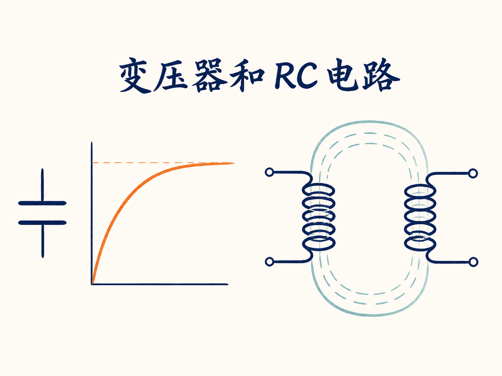
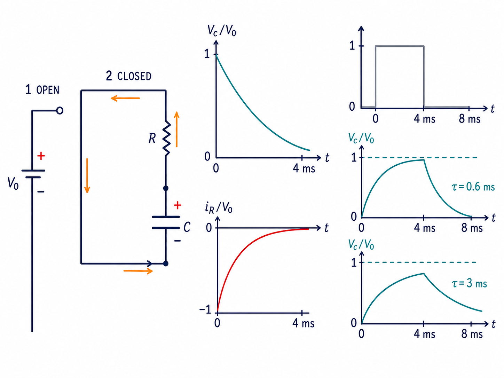
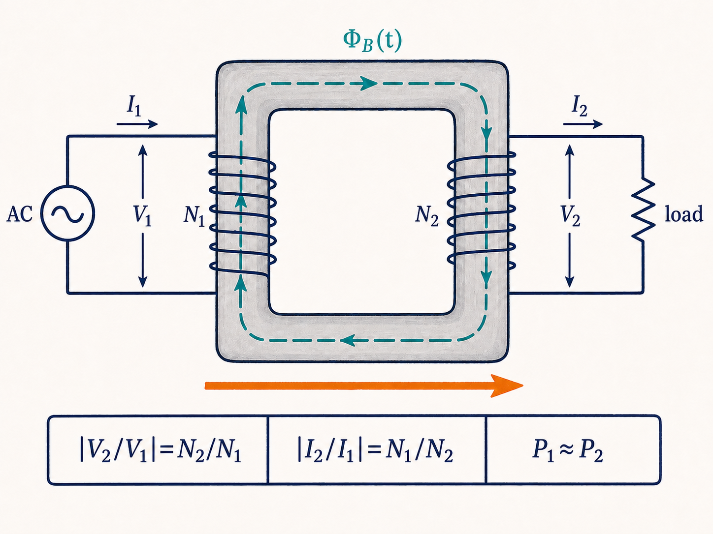
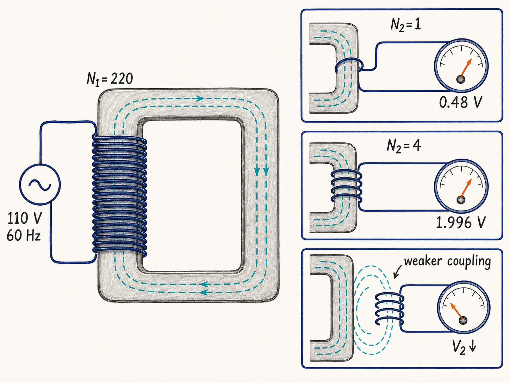
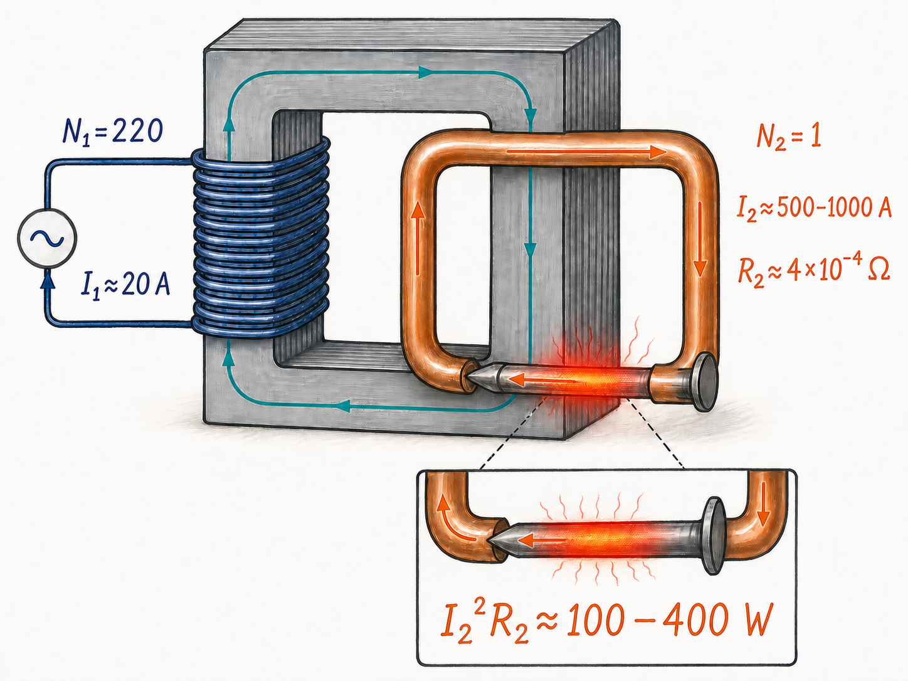
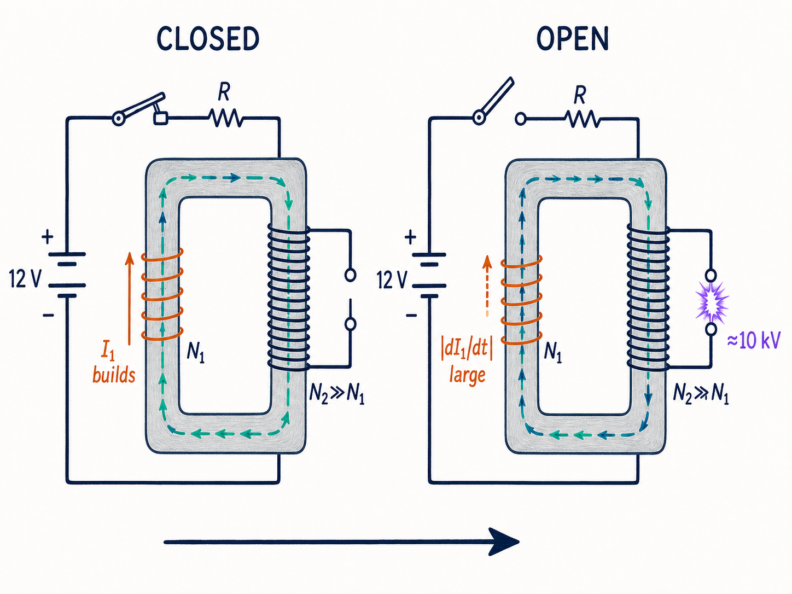

# 变压器和 RC 电路：一个开关怎样控制时间与电压

同一个“开关”动作，在两类电路里会留下完全不同的痕迹。接上一节电池，电容器不会立刻得到最终电压，而是按自己的节奏慢慢充电；突然切断线圈中的电流，却能让一节 12 伏汽车电池在另一只线圈上制造上万伏的电势差。

这两个现象都在追问同一件事：电路状态改变时，电压和电流究竟怎样响应？RC 电路用时间常数回答“变化有多快”，变压器则用磁通耦合回答“一个线圈的变化怎样传到另一个线圈”。

读完这篇，你会知道

- 电容器为什么不是瞬间充满，充电电压和电流怎样随时间变化？
- 为什么一个时间常数之后，电压达到 63.2%，电流只剩 36.8%？
- 电容器放电时，电流方向、能量去向和充电时有何不同？
- 变压器的电压比为什么由匝数比决定，电流比又为什么需要额外条件？
- 12 伏直流电池怎样借助线圈和开关产生足以点火的高电压？

## 先不用方程：充电时什么会上升，什么会下降

把电动势为 $V_0$ 的电池、电阻 $R$、电容器 $C$ 和开关串成闭合回路。规定充电时的电流方向为正，并把电容器两端电势差记为 $V_C$。刚合上开关的 $t=0$ 时刻，电容器还没有电荷，因此 $V_C=0$。

时间开始流逝，电荷在两块极板上积累，一侧变正、另一侧变负，$V_C$ 随之升高。电池电压固定为 $V_0$，电容器分走的电势差越来越大，电阻上的电势差就越来越小，所以电流不断下降。等待足够久以后，$V_C$ 渐近地达到 $V_0$，电流则趋于零。

这已经给出了两条曲线的大致形状：电容电压从零向 $V_0$ 上升，电流从最大值向零下降。$C$ 越大，积累到同一电压所需的电荷越多，曲线也就越缓；$C$ 越小，变化越快。

## 回路方程把直觉变成指数函数

这个 RC 回路中没有变化的磁通，也没有自感造成的非保守电场。沿闭合回路积分，电容器和电阻上的电势差与电池电压满足 $V_C+iR-V_0=0$。

这里的符号来自选定的绕行方向：经过电容器和电阻时，电场与路径方向同向；经过电池时，电场与路径方向相反。再使用 $i=dQ/dt$ 和 $V_C=Q/C$，便得到关于电容器电荷量的方程 $Q/C+R\,dQ/dt-V_0=0$。

在初始条件 $Q(0)=0$ 下，解为 $Q(t)=V_0C\left(1-e^{-t/(RC)}\right)$。

电流是电荷量对时间的变化率，电容电压则是 $Q/C$，因此 $i(t)=(V_0/R)e^{-t/(RC)}$，$V_C(t)=V_0\left(1-e^{-t/(RC)}\right)$。

这两个式子完整描述了刚才的直觉。$t=0$ 时，$i=V_0/R$、$V_C=0$；时间足够长时，指数项趋于零，于是 $i\to0$、$V_C\to V_0$。

## $RC$ 是电路自己的时钟

指数中的 $RC$ 具有时间量纲，称为 RC 时间常数：$\tau=RC$。

当 $t=\tau$ 时，指数项为 $e^{-1}$。于是充电电流只剩初值的 $1/e\approx36.8\%$，电容电压则达到终值的 $1-1/e\approx63.2\%$。

所以时间常数不是“充满所需的时间”，而是描述指数变化速度的标尺。实验中通常经过三到五个 $RC$，电容电压就已经非常接近最终值，但数学上的曲线仍是渐近逼近。

$RC$ 可以跨越极大范围。若 $R=1\ \Omega$、$C=1\ \mu\mathrm F$，则 $RC=1\ \mu\mathrm s$；若 $R=100\ \mathrm{M}\Omega$、$C=1\ \mathrm{mF}$，则 $RC=10^5\ \mathrm s$，超过一天。后一种情况下，即使等待三天，电容电压也只有最大值的约 95%。

## 把开关拨到另一边：电容器开始放电

先让电容器在位置 1 充到 $V_0$，此时稳态电流为零。再把开关拨到位置 2，电池离开回路，带异号电荷的两块极板通过电阻相连。若仍把充电方向定义为正方向，放电电流就为负，因为实际电流方向已经反转。

此时原方程中的电池项 $V_0$ 被去掉。电容电压从 $V_0$ 指数衰减到零，电流从一个负值逐渐趋于零。电容器原来储存的能量 $U_C=\tfrac12CV^2$ 在电阻中以 $i^2R$ 的功率转化为热。放电不是电荷凭空消失，而是电容器的电场能量沿闭合路径送入电阻并耗散。

## 方波演示：时间常数决定能不能来得及

用电子开关每 4 毫秒在充电位置和放电位置之间切换一次，电池给出的就是高电平 1 伏、低电平 0 伏的方波，完整周期为 8 毫秒。

当 $R=6\ \mathrm{k}\Omega$、$C=0.1\ \mu\mathrm F$ 时，$RC=0.6\ \mathrm{ms}$，远小于每个位置保持的 4 毫秒。屏幕上可以看到电容电压在高电平期间接近 1 伏，在低电平期间又接近零；电流在每次切换后先出现较大幅值，再衰减到接近零，放电时符号反向。

把电容增大五倍到 $0.5\ \mu\mathrm F$ 后，$RC$ 增加到 3 毫秒。4 毫秒已经不够电容器完全充电或放电：电压尚未到达终值，开关就再次切换；电流也来不及衰减到零。这一演示把“电路自己的时钟”直接画在了屏幕上。

## 从 RC 转向变压器：关键是共同变化的磁通

现在换成两个彼此靠近的线圈。原线圈有 $N_1$ 匝、自感 $L_1$，原边电压和电流记为 $V_1$、$I_1$；副线圈有 $N_2$ 匝、自感 $L_2$，副边接负载，电压和电流记为 $V_2$、$I_2$。两个电压表只取极小电流，用来持续监测两侧电压。

变压器需要变化的磁通，所以稳态工作使用交流。原线圈建立的变化磁通穿过副线圈，在副边产生感应电动势。若磁通耦合理想，每一匝原线圈和副线圈看到相同的磁通变化率 $d\Phi_B/dt$，但两边的匝数不同。取电压幅值，就有 $|V_2/V_1|=N_2/N_1$。

$N_2>N_1$ 时副边电压更高，是升压变压器；$N_2<N_1$ 时副边电压更低，是降压变压器。这里写的是交流电压的幅值关系，瞬时量还带有 $\sin\omega t$ 或 $\cos\omega t$ 的时间变化，因此不能用一个固定箭头代表整个周期内不变的极性。

这是一套简化推导。严格地写原、副边方程时，还应包含两线圈之间的互感项，例如与 $M\,dI_2/dt$ 有关的贡献。课堂为了突出基本匝数关系把这部分省略，不能因此把简化模型误认为包含了变压器的全部细节。

## 升高电压，不等于无条件放大功率

电站先把电压升到 30 万伏送上输电线，电能到达波士顿后降到 12 千伏，对应一次 $N_1/N_2=25$ 的降压；住宅附近的电线杆变压器再把 12 千伏降到约 120 伏，对应 $N_1/N_2\approx100$。

电压比主要由匝数比给出，电流比却不能无条件照搬。要近似认为原边输入功率全部送到副边负载，必须同时满足课程给出的几个条件：原、副边电阻相对感抗足够小，即 $R\ll\omega L$；铁芯涡流没有造成能量损失；原、副线圈之间的磁通耦合理想。

只有在这些条件下，才可近似写 $I_1V_1=I_2V_2$，进而结合电压比得到幅值关系 $|I_2/I_1|=N_1/N_2$。

因此理想升压会伴随电流下降，理想降压会伴随电流上升。匝数比重新分配电压和电流，但这里的功率关系依赖无损与完全耦合等前提。

## 一匝、四匝：先检验电压比

演示中的原线圈有 220 匝，接在 60 赫兹、110 伏交流电源上。这里的电压表显示的是 110 伏；对应瞬时电压的峰值是 $110\sqrt2$ 伏，并随 $\cos\omega t$ 变化，角频率约为 $\omega=2\pi f\approx377\ \mathrm{rad/s}$。

副线圈只绕一匝时，匝数比预计给出 $V_2\approx(110/220)\ \mathrm V=0.5\ \mathrm V$，实测为 0.48 伏。改成四匝后，预计约 2 伏，实测 1.996 伏。把副线圈沿原线圈移开，穿过两者的磁通不再充分重合，$V_2$ 随之下降；移得很远时耦合很差，仍可测到约 0.3 伏。

这次副边近似开路，电压表电阻高达数兆欧，因此不满足 $R\ll\omega L$。演示仍能检验电压匝数比，因为这个附加条件是近似推出电流比和功率关系所需，并不是这里观察电压比所必需的条件。

## 一匝粗铜副边：电压很低，电流可以很大

第二个演示把副边做成接近半英寸粗的铜导体，并让它近似只有一匝，回路中串入一枚铁钉。铁钉电阻约为 $4\times10^{-4}\ \Omega$，这一匝回路的自感估算约为 $5\times10^{-7}\ \mathrm H$，所以在 60 赫兹下 $\omega L_2\approx2\times10^{-4}\ \Omega$。

$R_2$ 并没有远小于 $\omega L_2$，两者只是数量级接近，因此不能直接采用理想电流比。原边电流约为 20 安培，理想匝数比虽是 220:1，也不能期待副边真达到 $220\times20=4400$ 安培。估计副边电流约为 500 到 1000 安培。

即使铁钉的电阻极小，$I_2^2R_2$ 仍可达到约 100 到 400 瓦。通电后铁钉迅速烧红并熔断。低副边电压与大副边电流并不矛盾：在近似功率传递的图景里，降压对应升流；而实际数值又受到电阻、感抗、损耗和耦合程度限制。

## 直流电池也能点火，但关键发生在断开的瞬间

变压器通常要求交流，可汽车点火线圈由 12 伏直流电池供电。这里并不是让恒定直流一直“变压”，而是先闭合原边开关，让电流按 $L/R$ 的时间常数建立；等电流接近最大值后，再突然断开开关。

断开使原边电流在很短时间内下降，$|dI_1/dt|$ 变得很大。与电流耦合的磁通也快速变化，于是原边感应出数百伏电动势。副线圈的 $N_2$ 远大于 $N_1$，感应电动势再按近似匝数比升高。汽车所需的约 10 千伏足以让火花塞放电。

如果发动机以每分钟 3000 转运行并有四个气缸，这种开断每秒发生 200 次。真正制造高压的不是开关保持闭合的阶段，而是把原边电流打断的瞬间。

课堂上的老式装置同样由 12 伏电池供电，估计副、原边匝数比至少为几千。每次断开原边，副边可产生约 30 万到 50 万伏，使火花跨越约 10 厘米的空气间隙；对应的空气击穿场量级约为 $3\times10^6\ \mathrm{V/m}$。把开关改成自动反复闭合和断开，便能连续看到高压火花。

## 两个电路，共同提醒我们先问“变化有多快”

RC 电路的状态变化被 $\tau=RC$ 控制。它告诉我们充电和放电不是瞬间完成，而是沿指数曲线推进：一个时间常数后，上升量达到 63.2%，衰减量剩下 36.8%。

变压器的核心则是变化磁通和匝数。理想耦合给出电压匝数比；再加上低损耗、低电阻与完全耦合等条件，才能进一步得到功率和电流关系。对于直流电池供电的点火线圈，决定性事件是快速断开，它把很大的电流变化率变成很大的感应电动势。

无论是缓慢充满的电容器，还是瞬间跃起的高压火花，真正需要追踪的都不是一个静态数字，而是电压、电流与磁通怎样随时间改变。
