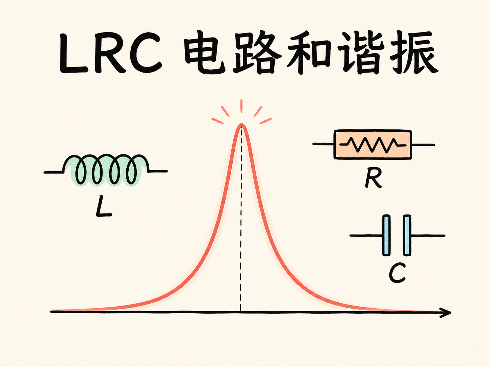
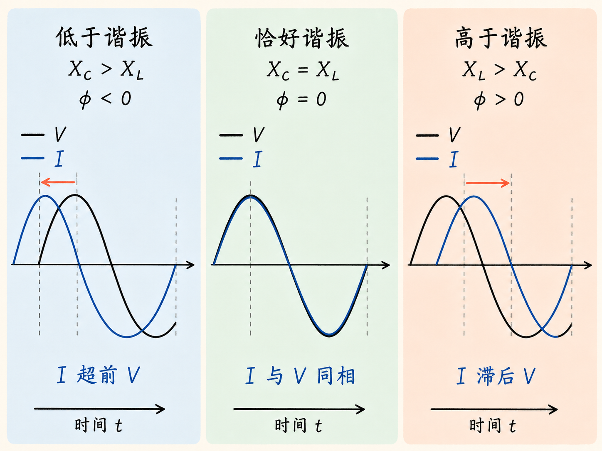
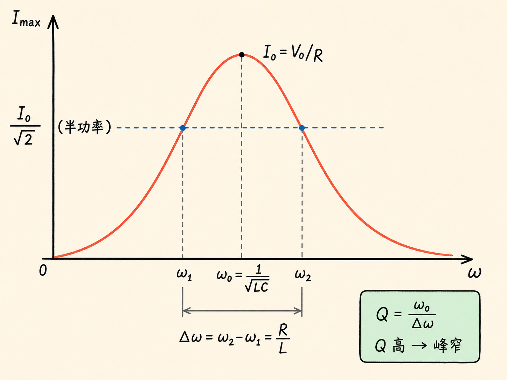
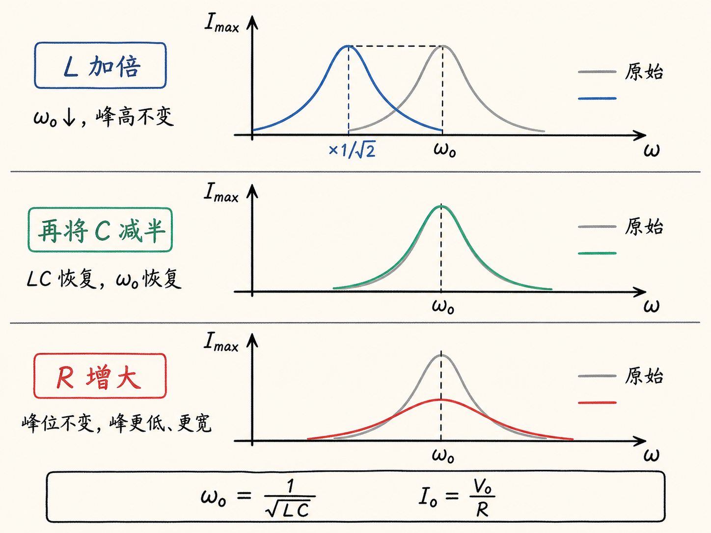
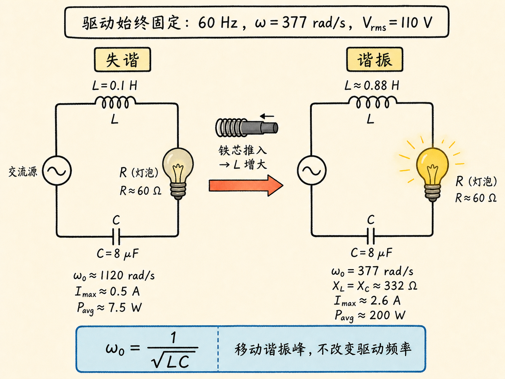
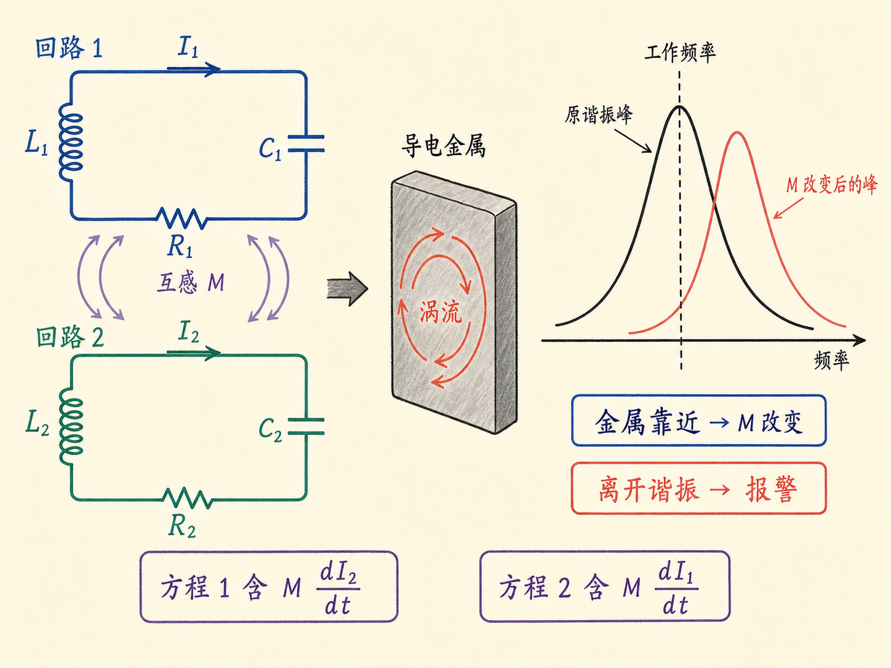

# LRC 电路和谐振：为什么同一只灯泡会突然亮起来

一只 200 瓦灯泡接在 110 伏、60 Hz 的电源上，电路明明已经接通，却几乎看不到光。把一根铁芯慢慢推进旁边的线圈，灯泡却突然亮到额定状态；再把电容加倍，它又暗下去，随后只要把铁芯拉出一部分，灯泡又亮了。

电源频率从头到尾没有改变，灯泡和电阻也没有更换。真正移动的是串联 LRC 电路的谐振点。要看懂这个现象，需要把电容器、电感器和电阻对交流电流的作用放进同一个方程里。

读完这篇，你会知道

- 为什么含有自感的回路不能直接照搬普通静电回路规则？
- 电抗、阻抗和相位怎样共同决定串联 LRC 电路的稳态电流？
- 为什么低频时电容主导、高频时电感主导，而中间只出现一个电流峰？
- 谐振峰的位置、峰高、带宽和品质因数分别由什么控制？
- 扫频、亮灯调谐和金属探测器如何把这些关系变成可观察的现象？

## 先把串联 LRC 电路写成一个方程

考虑一个交流电源与电感器 $L$、电阻 $R$、电容器 $C$ 串联的回路。驱动电压取为

$V(t)=V_0\cos\omega t$。

这里 $V_0$ 是电压峰值，$\omega$ 是驱动角频率。选定电流 $I$ 的正方向后，电容器上的电荷满足 $I=dQ/dt$，电容器两端电势差为 $V_C=Q/C$。

这个回路不能把闭合路径上的电场积分直接写成零。电感器中的磁通随电流变化，根据法拉第定律，沿所选回路方向有

$\oint\mathbf E\cdot d\mathbf l=-L\dfrac{dI}{dt}$。

沿电流方向逐段走一圈：跨过电容器得到 $V_C$，跨过电阻得到 $IR$，经过电源得到 $-V_0\cos\omega t$。理想电感器导线本身没有电阻，沿其导线的电场积分取零；自感效应则由右侧的法拉第定律项表示。把 $I=dQ/dt$ 和 $V_C=Q/C$ 代入，并把各项移到常见的排列方式，得到

$L\dfrac{d^2Q}{dt^2}+R\dfrac{dQ}{dt}+\dfrac{Q}{C}=V_0\cos\omega t$。

这是一个二阶微分方程。课堂没有要求推导它的完整解，而是直接给出长期稳定后的电流响应。这里的“长期”很重要：刚接通电源时还会有更复杂的瞬态，瞬态逐渐消失后，下面的稳态解才适用。

## 三个元件怎样合成一个阻抗

稳态电流写成

$I(t)=\dfrac{V_0}{\sqrt{R^2+\left(\omega L-\dfrac{1}{\omega C}\right)^2}}\cos(\omega t-\phi)$，

其中

$\tan\phi=\dfrac{\omega L-1/(\omega C)}{R}$。

把电感项和电容项分别记成

$X_L=\omega L$，$\qquad X_C=\dfrac{1}{\omega C}$。

二者的单位都是欧姆。串联电路的总电抗是它们的代数差：

$X=X_L-X_C=\omega L-\dfrac{1}{\omega C}$。

再把电阻与电抗合成阻抗：

$Z=\sqrt{R^2+X^2}$。

于是电流峰值就是

$I_{\max}=\dfrac{V_0}{Z}$。

阻抗可以看作交流条件下限制电流的“有效电阻”，但它与普通电阻不同：$Z$ 不只取决于 $R$、$L$、$C$，还随驱动角频率 $\omega$ 改变。调频率，相当于在不更换元件的情况下改变整个电路对电流的限制。

相位也由同一个差值 $X_L-X_C$ 决定。若 $X_L>X_C$，则 $\phi>0$，在 $I(t)=I_{\max}\cos(\omega t-\phi)$ 中，电流相对电压滞后；若 $X_C>X_L$，则 $\phi<0$，电流相对电压超前。

“电流超前”只描述稳态波形之间的相位关系，并不表示开机前已经有电流。刚接通电源时稳态解尚未成立，必须经历瞬态过程后才能谈这个固定相位差。

## 谐振：两个电抗恰好相消

电流峰值要最大，阻抗就要最小。因为 $R$ 固定，而 $X^2$ 不会小于零，所以最小阻抗出现在

$X=0$，

也就是

$\omega L=\dfrac{1}{\omega C}$。

由此得到谐振角频率

$\omega_0=\dfrac{1}{\sqrt{LC}}$。

在这个频率上，电感电抗与电容电抗数值相等、符号相反，它们在总电抗中相消。这里不是说电感器和电容器从电路中消失了，而是说它们对串联稳态阻抗的净电抗贡献为零。因此

$Z(\omega_0)=R$，$\qquad I_{\max}(\omega_0)=\dfrac{V_0}{R}$，$\qquad \phi=0$。

谐振时，驱动电压与电流同相，电流峰值达到这个串联电路在给定 $V_0$ 和 $R$ 下的最大值。

谐振峰的位置只由 $L$ 和 $C$ 决定，$R$ 不出现在 $\omega_0=1/\sqrt{LC}$ 中；但峰高由 $V_0/R$ 决定。这个区分贯穿后面的所有演示：改变 $L$ 或 $C$ 会移动峰的位置，改变 $R$ 会改变峰的高度和宽度。

## 为什么曲线两端都回到零

固定 $R$、$L$、$C$，从很低的频率一直扫到很高的频率，$I_{\max}$ 会先从接近零开始，升到谐振峰，再降回接近零。

低频端，$\omega\to0$，于是

$X_C=\dfrac{1}{\omega C}\to\infty$。

阻抗随之变大，$I_{\max}\to0$。在极限上，$\omega=0$ 就是直流：电容器充满后，不再有持续电流。因此低于谐振时，电容项主导，$X<0$，电流超前电压。

高频端，$\omega\to\infty$，于是

$X_L=\omega L\to\infty$。

阻抗同样变大，$I_{\max}\to0$。变化越快，自感对电流变化的反抗越强。因此高于谐振时，电感项主导，$X>0$，电流滞后电压。

只有在二者交会的 $\omega_0$，总电抗为零，相位也由负变正并恰好经过零。这就形成单一的串联谐振峰。

## 峰有多宽：半功率带宽与 Q

一个数值例子能让曲线的形状更具体。取

$L=5\times10^{-2}\ \mathrm H$，$\qquad C=3\times10^{-7}\ \mathrm F$，$\qquad R=10\ \Omega$。

谐振角频率略高于 $8000\ \mathrm{rad/s}$。当驱动频率比谐振低 10% 时，$X_L=367\ \Omega$，$X_C=453\ \Omega$，所以 $X=-86\ \Omega$，其大小为 86 欧姆。此时

$Z=\sqrt{10^2+86^2}\approx87\ \Omega$，

最大电流约为 $0.11\ \mathrm A$。进入谐振后，$X=0$、$Z=10\ \Omega$，最大电流升到 $1\ \mathrm A$。高于谐振 10% 时，电感项改为主导，电流又明显下降，在这个例子中约为谐振电流的八分之一。

为了描述峰宽，在峰值电流的约 0.7 倍处取左右两个频率点，它们之间的角频率差记作 $\Delta\omega$。串联 LRC 电路在这里给出

$\Delta\omega=\dfrac{R}{L}$。

对刚才的参数，

$\Delta\omega=\dfrac{10}{5\times10^{-2}}=200\ \mathrm{rad/s}$。

为什么不是在半峰值电流处量宽度？因为实际更关心电阻中的功率，而功率与电流平方成正比。电流降到峰值的 $1/\sqrt2\approx0.7$ 时，功率正好降到峰值的一半，所以 $\Delta\omega$ 是半功率宽度。

品质因数定义为

$Q=\dfrac{\omega_0}{\Delta\omega}=\dfrac{1}{R}\sqrt{\dfrac{L}{C}}$。

这里的 $Q$ 不是电荷。它比较谐振中心频率与半功率宽度：Q 越高，峰越窄；Q 越低，峰越宽。由于 $\Delta\omega=R/L$，增大 $R$ 会把曲线展宽，同时由 $I_{\max}(\omega_0)=V_0/R$ 可知，峰高也会降低。

高 Q 意味着系统只在很窄的频率范围内产生强响应。它能带来高灵敏度，也可能带来破坏：略微偏离谐振时，电流和电阻耗散功率都很小；一旦准确进入谐振，电流与耗散功率突然增大，电阻和电路可能被烧坏。

## 扫频演示：L、C、R 各自控制什么

第一组扫频参数取 $R=60\ \Omega$、$L=50\ \mathrm{mH}$、$C=0.3\ \mu\mathrm F$，让驱动角频率从 0 扫到 $16000\ \mathrm{rad/s}$，跨过约 $8000\ \mathrm{rad/s}$ 的谐振点。

示波画面显示的是随时间正负振荡的电流，而不是一条光滑的 $I_{\max}$ 曲线。每个频率处，电流都按余弦规律上下振荡；这些振荡的外包络才是谐振曲线 $I_{\max}(\omega)$。扫频经过谐振时，包络明显增大。

接下来依次改变元件：

- 把 $L$ 加倍，$\omega_0=1/\sqrt{LC}$ 降为原来的 $1/\sqrt2$，所以峰向低频移动；$R$ 不变，因此峰高不变。
- 保持加倍后的 $L$，再把 $C$ 减半，乘积 $LC$ 回到原值，峰也回到原来的频率。
- 保持 $L$、$C$ 不变，把 $R$ 从 60 欧姆提高到 100 欧姆，谐振频率不动，但 $V_0/R$ 变小，峰明显降低。

三步演示把参数分工直接显现出来：$L$ 和 $C$ 决定峰在哪里，$R$ 决定峰能有多高，并通过 $\Delta\omega=R/L$ 影响峰有多宽。

## 亮灯演示：固定 60 Hz，也能把谐振点移过来

现在回到开头那只 200 瓦灯泡。电源有效值为 $110\ \mathrm V$，频率固定为 60 Hz，因此

$\omega=377\ \mathrm{rad/s}$，$\qquad V(t)=110\sqrt2\cos\omega t$。

灯泡热态电阻约 $R=60\ \Omega$，电感 $L=0.1\ \mathrm H$，电容 $C=8\ \mu\mathrm F$。在固定驱动频率下，

$X_L=\omega L\approx38\ \Omega$，

$X_C=\dfrac{1}{\omega C}\approx332\ \Omega$。

电容项远大于电感项，整个系统处在谐振频率以下。阻抗约为 $300\ \Omega$，因此

$I_{\max}=\dfrac{110\sqrt2}{300}\approx0.5\ \mathrm A$。

电流是余弦波，一个周期内 $\cos^2\omega t$ 的平均值为 $1/2$，所以灯泡平均耗散功率为

$P_{\mathrm{avg}}=\dfrac12 I_{\max}^2R\approx\dfrac12(0.5)^2\times60=7.5\ \mathrm W$。

对一只 200 瓦灯泡来说，这点功率几乎看不见。

由 $L=0.1\ \mathrm H$、$C=8\ \mu\mathrm F$ 得到原来的谐振角频率约为 $1120\ \mathrm{rad/s}$，远高于固定驱动的 $377\ \mathrm{rad/s}$。要让灯泡变亮，不必改变电源频率，只要增大 $L$ 或 $C$，把 $\omega_0$ 向下移到 377 即可。

保持 $C=8\ \mu\mathrm F$ 不变，由

$\dfrac{1}{\sqrt{LC}}=377\ \mathrm{rad/s}$

算得所需电感约为 $L=0.88\ \mathrm H$。这时 $X_L$ 增大到约 $332\ \Omega$，正好与 $X_C$ 相消。把铁磁材料缓慢推入线圈，会增大穿过线圈的磁通，从而把自感从 0.1 亨逐步提高到接近所需值。谐振峰向固定的 377 弧度每秒移动，经过驱动频率时，灯泡电流达到

$I_{\max}=\dfrac{110\sqrt2}{60}\approx2.6\ \mathrm A$。

相应平均功率约为

$P_{\mathrm{avg}}=\dfrac12(2.6)^2\times60\approx200\ \mathrm W$，

灯泡于是达到额定亮度。

接着把 $C$ 加倍，$\omega_0$ 会继续向低频移动，系统再次离开 377 弧度每秒的谐振点，灯泡变暗。因为 $C$ 加倍，只要再把 $L$ 减半——也就是把铁芯拉出一部分——乘积 $LC$ 就恢复，谐振峰回到固定驱动频率，灯泡再次变亮。

这套演示没有改变输入频率。它改变的是电路自己的谐振频率，让峰从固定驱动频率的一侧移过来，再移过去。

## 调台与金属探测：利用窄峰选择变化

收音机和电视天线会同时接收到许多不同频率的信号。改变 LRC 电路中的可变电容，就会改变 $\omega_0=1/\sqrt{LC}$。当谐振频率对准某个电台频率时，系统对该频率非常敏感并产生较大电流，于是完成选台。

金属探测器使用的是两个彼此耦合的 LRC 回路。第一个回路含 $L_1$、$R_1$、$C_1$ 和电流 $I_1$，第二个含 $L_2$、$R_2$、$C_2$ 和电流 $I_2$。两个线圈之间存在互感 $M$，所以一个方程会出现 $M\,dI_2/dt$，另一个会出现 $M\,dI_1/dt$。它们不是两条彼此独立的方程，而是两条耦合微分方程。

两个耦合线圈会出现两个谐振频率，其中至少一个对互感 $M$ 很敏感。探测器先调在其中一个谐振频率上；导电金属靠近时，交变磁通在金属中激发涡流，涡流改变两个线圈之间的磁耦合，使 $M$ 发生变化。系统随即离开谐振，报警器响应。

高 Q 在这里正是优势：谐振峰很窄，$M$ 只要稍有变化，工作点就会明显偏离峰值。因此门式探测器、手持式探测器和寻找硬币的设备都能对附近金属作出敏感反应；塑料本身不导电，不能以这种机制触发探测。

## 最后把整条逻辑串起来

串联 LRC 电路的核心不是记住一条峰形曲线，而是看清同一组关系怎样控制所有现象：

$X_L=\omega L$ 随频率上升而增大，$X_C=1/(\omega C)$ 随频率上升而减小；二者的差与 $R$ 合成阻抗 $Z$，阻抗再决定电流峰值和相位。当 $X_L=X_C$ 时，总电抗为零，阻抗降到 $R$，电压与电流同相，电流达到 $V_0/R$。

因此，改变 $L$ 或 $C$ 是在移动谐振峰，改变 $R$ 是在改变峰高和峰宽，改变驱动频率则是在曲线上移动工作点。扫频屏幕上的包络、铁芯推进线圈时突然点亮的灯泡、调谐旋钮选出的电台，以及金属靠近后触发的报警，都是这同一套方程在不同装置中的表现。
