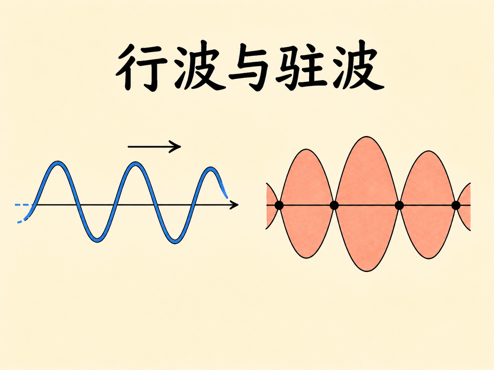
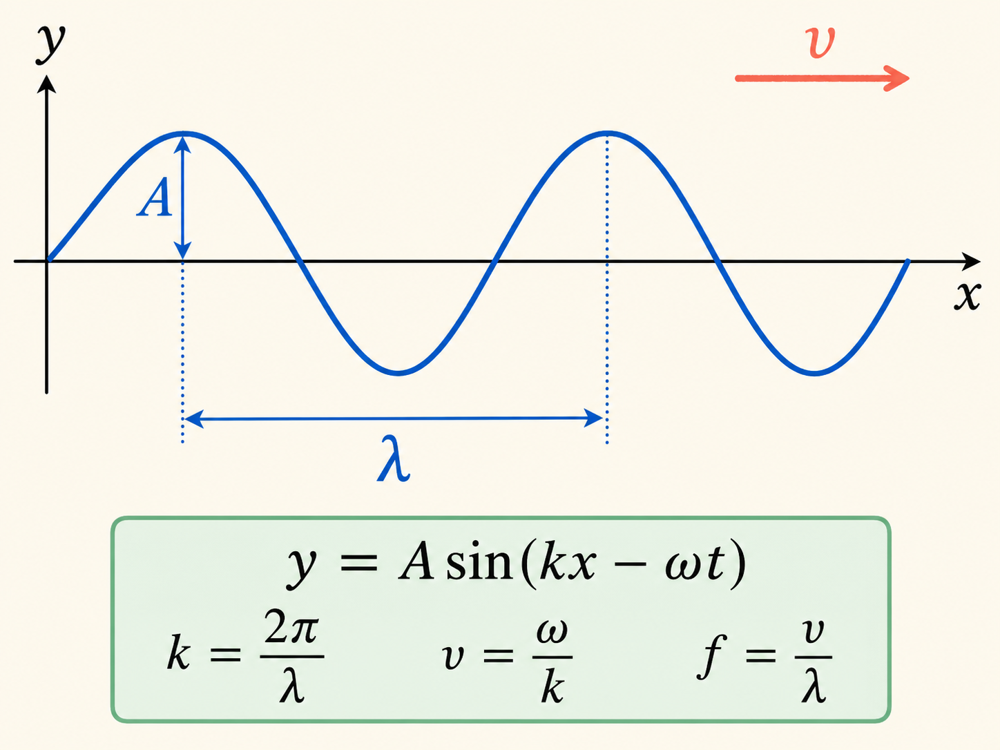
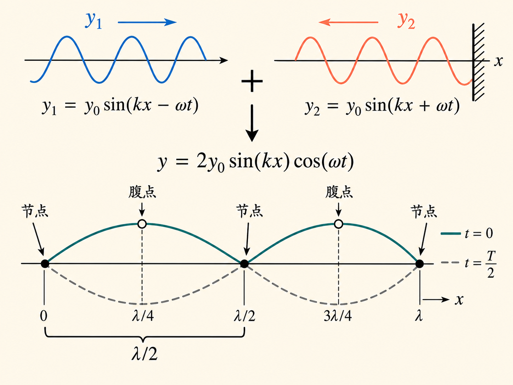
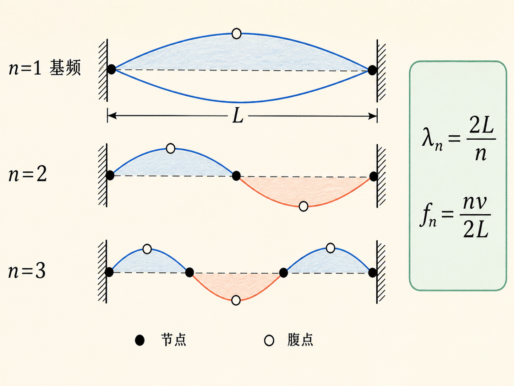
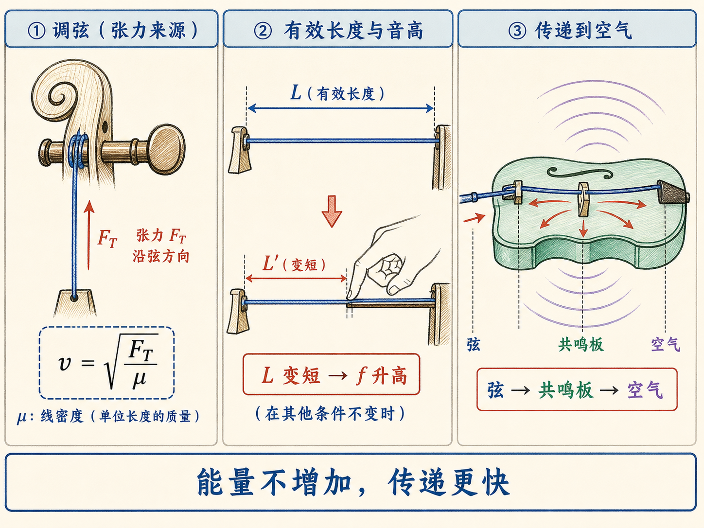
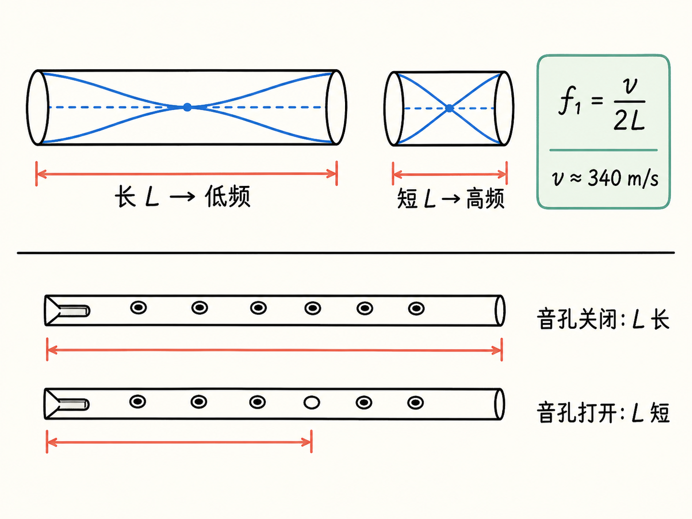
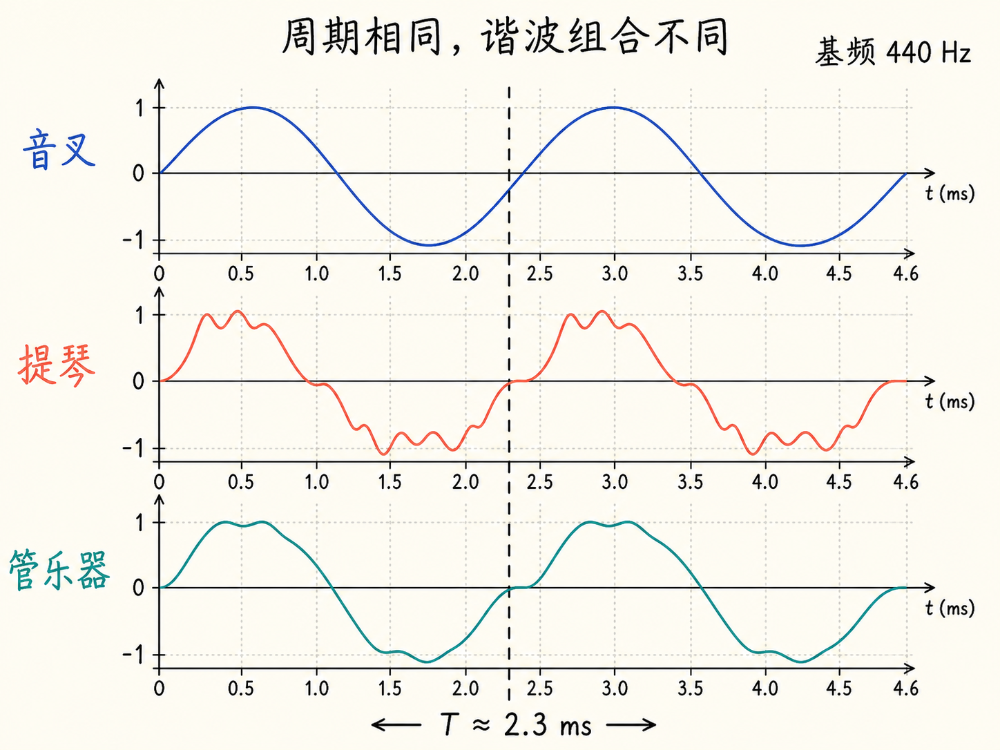
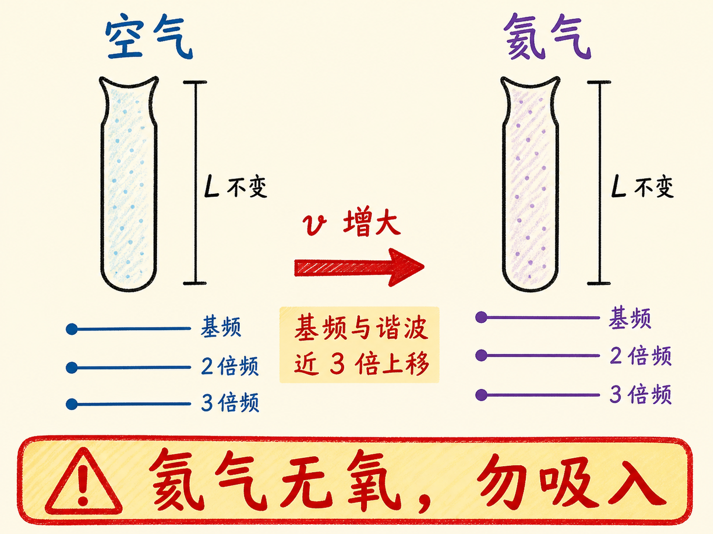

# 行波与驻波：波为什么会前进，又为什么能站在原地

一根弦上出现起伏时，我们很容易说“波向前跑了”。可弦上的每个小点真的跟着波一路跑到另一端了吗？并没有。小点只在原地上下振动，向前传递的是波形。

更反直觉的是，两列都在传播的波叠加后，竟能形成一个不再向前平移的图样：有些点永远不动，另一些位置振幅很大，整条弦像被固定在一组看不见的格点上。这就是驻波，也是弦乐器、管乐器和声音中谐波结构的共同起点。

读完这篇，你会知道

- 为什么把 $x$ 换成 $x-vt$，波形就会沿 $+x$ 方向移动
- 如何从一个波动方程读出振幅、波长、频率、波数和波速
- 两列反向行波为什么会叠加成驻波，节点和腹点分别在哪里
- 固定长度的弦为什么只有一组离散的共振频率
- 弦乐器、空气柱、共鸣板和乐器音色怎样被同一套波动关系串起来

## 先别急着画正弦波：让一条直线动起来

从最简单的图形开始。设一条直线为

$y=\frac13x$。

如果希望它以 $6\ \text{m/s}$ 沿 $+x$ 方向移动，只要把式中的 $x$ 换成 $x-6t$：

$y=\frac13(x-6t)$。

在 $t=0$ 时，它还是原来的直线。到 $t=1\ \text{s}$ 时，方程变成 $y=\frac13x-2$。新直线与原直线平行，横向位置整体向右移动了 6 米。

这给出一条通用规则：若某个形状写成 $y=f(x)$，那么

- $y=f(x-vt)$ 表示它以速度 $v$ 沿 $+x$ 方向移动；
- $y=f(x+vt)$ 表示它以速度 $v$ 沿 $-x$ 方向移动。

符号看起来有些反直觉：括号里是减号，传播方向却是正方向。判断它最稳妥的方法，是盯住波形上的某个固定相位。要让 $x-vt$ 保持不变，时间增加时 $x$ 必须增加，所以这个相位点向 $+x$ 移动。

## 一列行波的方程里藏着什么

把直线换成正弦曲线：

$y=2\sin(3x)$。

它的振幅是 2。正弦函数每经过 $2\pi$ 重复一次，因此括号里的 $3x$ 每增加 $2\pi$，空间位置增加 $2\pi/3$。这就是波长：

$\lambda=\frac{2\pi}{3}$。

波数定义为

$k=\frac{2\pi}{\lambda}$，

所以本例 $k=3$。$k$ 越大，同样空间里塞进的周期越多，波长越短。

现在让这列波以 $6\ \text{m/s}$ 沿 $+x$ 方向传播。按照刚才的规则，

$y=2\sin[3(x-6t)]=2\sin(3x-18t)$。

把它与行波的一般形式比较：

$y=A\sin(kx-\omega t)$。

每一项都有明确职责：

- $A$ 是振幅；
- $k$ 保存空间周期信息，$\lambda=2\pi/k$；
- $\omega$ 保存时间周期信息，$T=2\pi/\omega$；
- $kx-\omega t$ 中的负号说明波沿 $+x$ 传播。

轮子以角频率 $\omega$ 转动并驱动一根绷紧的弦，就能实际产生这种行波。弦上某个固定点只会上下往复，一个周期为 $T$。这一周期内，波形向前走过一个波长，所以

$\lambda=vT=\frac{v}{f}$，

也就是

$f=\frac{v}{\lambda}$。

又因为 $k=2\pi/\lambda$、$\omega=2\pi f$，同一关系还可写成

$v=\frac{\omega}{k}$。

在 $y=2\sin(3x-18t)$ 中，$\omega/k=18/3=6\ \text{m/s}$。拿到一个行波方程后，振幅、波长、周期、赫兹频率、角频率、波速和方向都可以从中读出。

这也是进入电磁波之前先讨论弦波的原因。以后位移 $y$ 会换成以伏每米表示的电场，或以特斯拉表示的磁场，但 $\lambda$、$k$、$T$、$f$、$\omega$ 和传播方向仍扮演相同角色。

## 两列行波相加，为什么波形不走了

设第一列波沿 $+x$ 传播：

$y_1=y_0\sin(kx-\omega t)$。

再让第二列波沿 $-x$ 传播：

$y_2=y_0\sin(kx+\omega t)$。

要得到稳定的驻波图样，这两列波在这里有严格条件：振幅相同、波长相同、频率相同，传播方向相反。弦上的总位移是两者相加。用三角恒等式整理后，

$y=y_1+y_2=2y_0\sin(kx)\cos(\omega t)$。

行波中，空间和时间被绑在同一个相位 $kx\mp\omega t$ 里；驻波中，空间项 $\sin(kx)$ 与时间项 $\cos(\omega t)$ 分开了。这个分离正是“站住不走”的数学特征。

空间项决定每个位置最多能振多大。只要

$\sin(kx)=0$，

无论时间项怎样变化，总位移都为零。这些永远不动的位置是节点。在 $x=0$、$x=\pm\lambda/2$、$x=\pm\lambda$ 等位置都会出现节点，相邻节点间距为 $\lambda/2$。

节点之间，$|\sin(kx)|$ 能达到 1，位移振幅最大可到 $2y_0$。课堂演示把这些位置画成每一段弦的最高点或最低点；这里把最大振幅的位置称为腹点。相邻节点之间有一个腹点。

再按时间看三张“快照”：

- $t=0$ 时，$\cos(\omega t)=1$，弦呈现一条振幅最大的正弦形曲线；
- $t=T/4$ 时，$\cos(\omega t)=0$，整根弦瞬间落在平衡直线上；
- $t=T/2$ 时，$\cos(\omega t)=-1$，曲线相对初始形状上下反转。

弦的各段在原地上下运动，节点始终静止，整套节点和腹点的位置不沿 $x$ 方向平移。驻波不是“什么都不动”，而是振动图样没有向前行进。

## 反射把行波变成驻波，但只有特定频率能站稳

把弦的一端固定在墙上，另一端做很小的周期驱动。驱动产生的波沿弦前进，到端点后反射回来；反射波又继续往返。这样，同一根弦上同时存在入射波和反射波，它们的传播方向相反。

但有反射并不等于一定出现大而稳定的驻波。只有当频率恰好合适，来回反射的波才能持续相长叠加，形成清楚的节点和很大的腹点振幅。这些特殊频率就是共振频率。

设弦长为 $L$，两端近似都是节点。最低的允许模态只有一个腹点，弦长刚好容纳半个波长：

$L=\frac{\lambda_1}{2}$，所以 $\lambda_1=2L$。

它是基频，也叫第一谐波：

$f_1=\frac{v}{\lambda_1}=\frac{v}{2L}$。

第二谐波在中点多出一个节点，弦长中容纳一个完整波长，所以 $\lambda_2=L$、$f_2=2f_1$。第三谐波再增加节点，$f_3=3f_1$。一般地，

$\lambda_n=\frac{2L}{n}$，

$f_n=\frac{nv}{2L}=nf_1$。

因此，一根理想化的固定长度弦不是只有一个共振频率，而是有一列离散、等间隔的共振频率。

课堂用一根巨大的荧光弦把这件事直接展示出来。一位学生握住一端，教师在另一端戴着白手套做很小的驱动。调暗灯光后，基频状态下可以看到中部出现一个很大的腹点，而驱动手几乎不动。提高频率，弦中点出现新节点，形成第二谐波。继续提高频率并找到共振，弦上会出现越来越多的节点。偏离共振时，整齐的图样就难以维持。

## 一根弦如何选出乐器的音高

拨弦、拉弓或用锤敲击，并不是只给弦一个频率，而是同时施加一整套频率。弦会明显响应自己的离散共振频率，并忽略其中偏离共振的成分。

如果基频是 400 Hz，这根弦也能同时在 800 Hz、1200 Hz 等高次谐波振动。一个音因此可能同时含有基频和若干谐波。

对给定谐波，$f_n=nv/(2L)$ 告诉我们可以从两个方向调音：改变波速 $v$，或改变有效长度 $L$。弦上的波速按课堂给出的关系为

$v=\sqrt{\frac{F_T}{\mu}}$，

其中 $F_T$ 是弦的张力，$\mu$ 是单位长度质量。不同材料和粗细带来不同的 $\mu$；转动弦轴改变张力，则可微调 $v$，这就是调音时所做的事。

演奏时更常改变的是 $L$。提琴手或吉他手用手指按弦，使有效长度缩短，频率升高；有效长度变长，频率降低。钢琴的 88 个键则各自对应固定长度的弦，演奏者不必连续控制按弦位置，但仍要在许多键中选对那个键。

## 从弦到空气：听见声音还差一步

弦本身振动时，会不断推拉周围空气，产生压力波。若弦以 400 Hz 振动，空气压力每秒升降 400 次；压力波到达耳膜，耳膜也以同样频率前后振动，大脑于是识别为声音。

一根孤立的弦或音叉推动的空气很少，所以声音很弱。把它连接到带空气的箱体或共鸣板，箱内空气和箱体表面也会参与振动，推动更多空气，声音就明显变响。这里没有凭空增加能量；振动体原有的能量只是更快地传到空气中，因此在较短时间内听起来更响。课堂把音叉和音乐盒分别接触箱体，声音都立刻增强。

## 空气柱也能形成驻波

把扬声器放进长度为 $L$ 的空气腔，声压波在两端来回反射，也会叠加成驻波。振动主体此时不是弦，而是空气本身。

对课堂讨论的两端开放空气柱，共振频率仍服从与弦相同形式的离散关系。不同之处在于，$v$ 变成声速，室温下约为 $340\ \text{m/s}$，乐器制作者不像调弦那样能自由改变它。一端封闭、一端开放的空气柱同样有一组共振频率，但这组频率与两端开放时不同；本讲没有继续推导那套数值关系。

气体声速主要随温度和分子量变化，课堂把主要关系写成大致随 $\sqrt{T/M}$ 变化。对房间里的空气，温度只能小幅改变，氧气和氮气决定的平均分子量约为 30，也基本固定。因此管乐器最直接可调的量仍是有效长度 $L$。

这解释了几个直观现象：

- 长号移动滑管，直接改变空气柱长度；
- 长笛通过开闭音孔改变有效长度，孔打开得越多，有效空气柱越短，频率越高；
- 小号用阀门改变气流路径的有效长度；
- 低频管乐器通常更大，高频管乐器通常更小。

两端开口管的数字能把尺度感说清楚。长度 1 cm 时，课堂给出的基频约为 17,000 Hz；长度 10 cm 时，基频约为 1,700 Hz；能产生 20～30 Hz 基频的管风琴管则非常巨大。

向管乐器吹气，就像拨弦或拉弓：气流带来一整套激励频率，空气柱从中选择自己的共振频率。只是“吹气”本身并不保证发声。以小号为例，嘴唇必须用合适的方式振动，才能有效激励空气柱。

课堂还挥动一根两端开放的管子，让空气流动依次激起不同谐波。转录在管长处出现了 8 cm 与 80 cm 的冲突，因此不把长度写成确定值；演示中读到的频率大约包括 212 Hz、425 Hz，以及 637 或 647 Hz，呈现出基频与高次谐波的关系。

## 同样是 440 Hz，为什么提琴和萨克斯听起来不同

音叉产生的 440 Hz 信号接近纯正弦波，周期为

$T=\frac{1}{440}\ \text{s}\approx2.3\ \text{ms}$。

麦克风像耳膜一样把压力变化转成信号，放大后送到示波器，就能直接看到这个简单的周期波形。

乐器发出接近 440 Hz 的音时，重复周期仍由基频决定，但波形内部常叠加第二、第三、第四等谐波，于是一个周期不再是单纯正弦。课堂让提琴、单簧管、巴松管和萨克斯分别靠近麦克风演奏。屏幕上的波形都能重复，却各有不同的细部形状：提琴显出丰富的高次谐波，某些管乐器则更像由基频和少数低次谐波组成。

不同乐器有各自的谐波组合。耳朵听到的不只是“基频是多少”，还听到这一组高次谐波怎样混合，所以即使基频接近，人们仍能分辨提琴、单簧管、巴松管和萨克斯。

## 最后的氦气演示：几何没变，声速变了

温度不是改变声速的唯一办法，分子量也会影响声速。若把同一支管乐器周围的空气换成氦气，乐器长度 $L$ 没变，但气体中的声速 $v$ 提高，基频和各次谐波都会一起上移。课堂估计这种上移接近 3 倍。

把整间教室换成氦气并不现实，于是教师用自己的声道演示。人的声道也像一个空气腔：几何形状暂时没有改变，内部气体从空气换成氦气后，声速改变，声音的频率结构随之上移，听起来不再像平时的声音。

这个演示也有明确的安全代价：氦气中没有氧气，吸入氦气意味着暂时得不到氧气。课堂只做了短暂演示，声音明显变高后立即结束。

## 把整条链重新接起来

行波的关键是 $kx\mp\omega t$：空间和时间共同组成一个不断平移的相位。驻波的关键是 $\sin(kx)\cos(\omega t)$：空间图样与时间振动分离，节点固定，腹点只在原地上下振动。

反射让相向行波相遇，边界和长度只允许特定波长站稳，于是得到 $\lambda_n=2L/n$ 与 $f_n=nv/(2L)$。弦乐器用张力、单位长度质量和有效弦长选择频率；管乐器主要用空气柱有效长度选择频率；共鸣板把振动更有效地传给空气；基频之上的谐波组合，最后又决定了我们听到的乐器音色。

从一条会移动的直线出发，最后可以解释一根弦为什么出现节点、一支长笛为什么靠开孔升高音调、一个音叉为什么接触箱体后更响，以及同为 440 Hz 的声音为什么仍能听出不同乐器。
