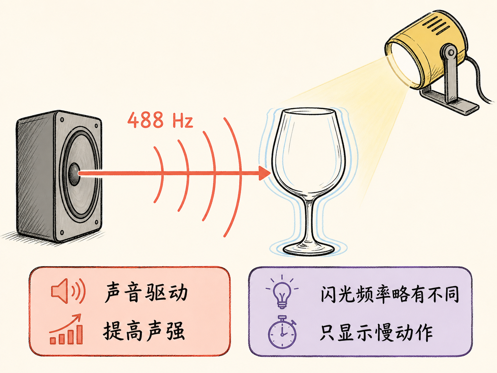
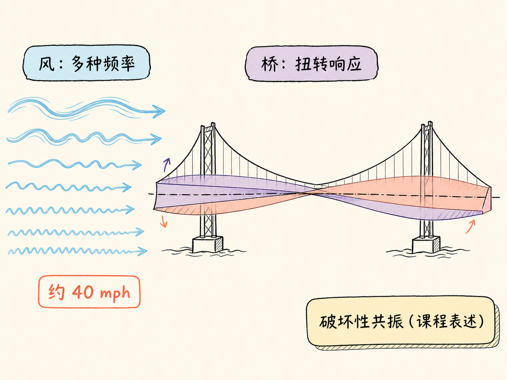
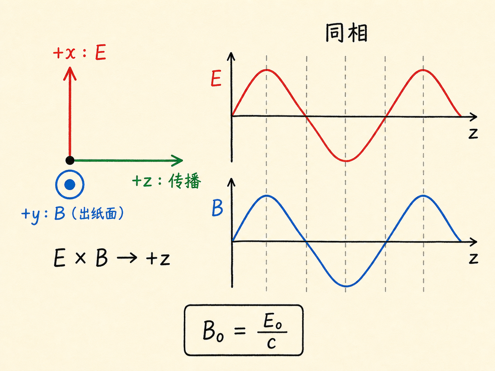
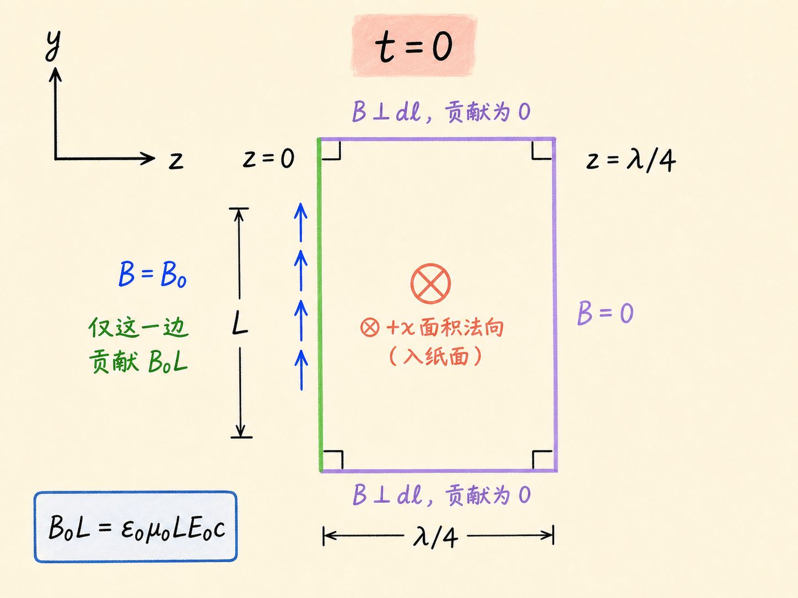
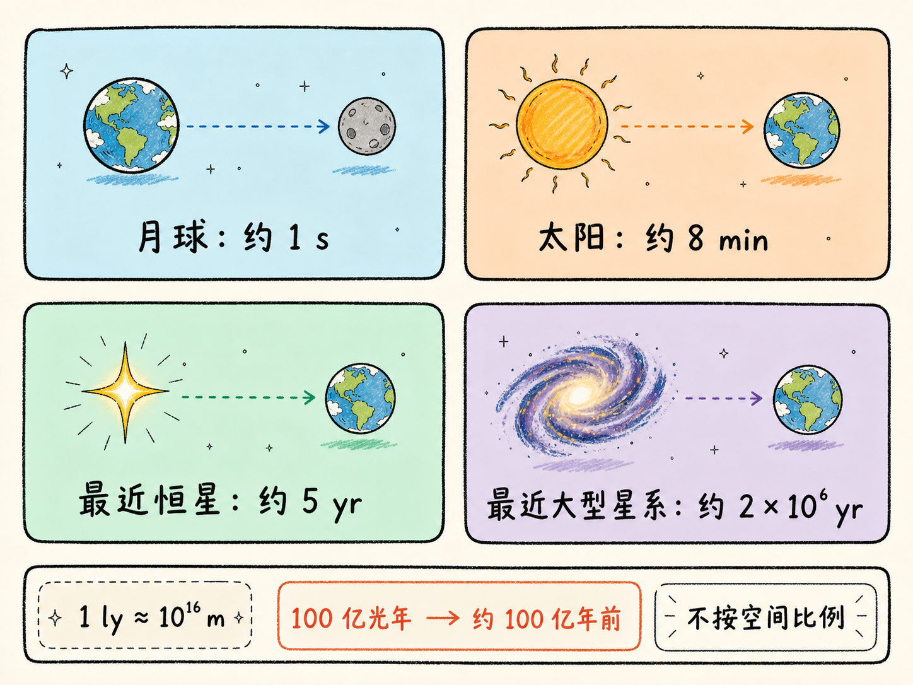
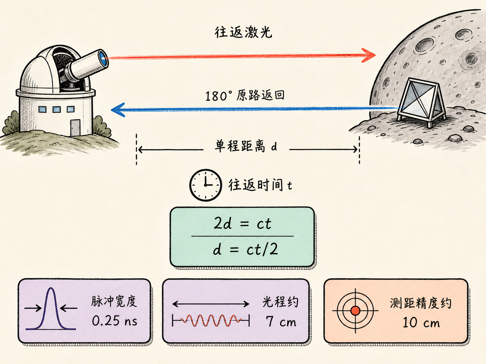
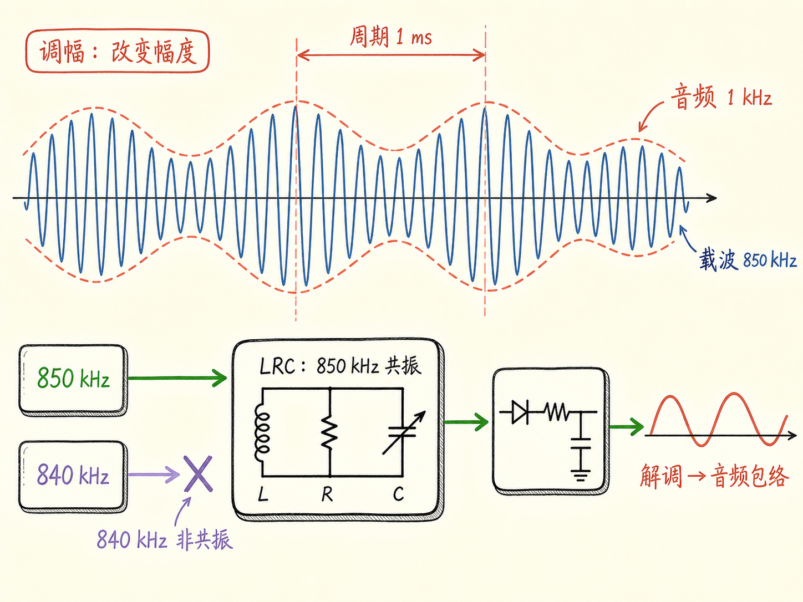

# 共振：从酒杯、桥梁到电磁波与收音机

水龙头开到某个位置，管道突然发出刺耳的轰鸣；车速恰好落在某个区间，车里某个零件开始咯咯作响；再快一点或再慢一点，声音又消失了。这些现象有一个共同点：外界一直在驱动系统，但系统只在某些特定条件下出现格外强烈的响应。

这条线索先经过会发声的酒杯和在风中扭转的大桥，随后转向电磁波：麦克斯韦方程怎样限制波速，电磁波又怎样用于测距。到收音机接收端，共振再次出现，负责从许多载波中选出目标频率。

读完这篇，你会知道

- 为什么酒杯只在声音接近自身共振频率时强烈响应，488 Hz 演示又怎样让这种振动变得可见
- 平面电磁波中的电场、磁场与传播方向满足什么几何关系
- 为什么两个用静态实验测得的常数，竟能给出真空中的光速
- 四分之一波长的闭合回路怎样把安培—麦克斯韦定律化成一个简单结果
- 收音机为什么能让 LRC 电路在 850 kHz 共振，而不在 840 kHz 共振

## 共振并不罕见，只是常被当作“奇怪的噪声”

这类现象的共同特征是：响应不只取决于驱动有多大，还取决于驱动条件是否碰上系统敏感的频率。条件稍微改变，响应便可能迅速减弱。

酒杯给出了一个可以亲手触发的例子。把手指弄湿，沿杯口摩擦，酒杯会发出它的基频，也就是最低频率的振动。摩擦杯口时，杯壁发生周期性形变并发声；一百名学生同时这样做，足以让一场不受欢迎的餐后演讲很快结束。

这也引出了一个流传很广的说法：歌手能否仅凭嗓音震碎酒杯？一则录音带广告甚至编出这样的故事——歌手在音乐会上唱碎酒杯，观众把声音录下来，回家播放时，家里的酒杯也跟着碎了。这个故事有两个直接的问题。普通录音机很难给出足够大的声强；更重要的是，故事中家里的那些酒杯显然不会恰好与音乐会上的酒杯拥有完全相同的共振频率。只把某次破裂的声音录下来，并不能保证另一只杯子也处在自己的共振点上。

## 488 Hz 酒杯：频率对准以后，还要有足够强的驱动

为了把问题做成可重复的实验，课堂使用扬声器驱动一只事先测过的酒杯。它的共振频率是 $488\ \mathrm{Hz}$。扬声器先发出非常接近这个频率的声音，再逐步提高音量。

杯壁振动很快，肉眼本来难以追踪。演示因此加入闪光灯，并让闪光频率与声音频率略有差别。两者之间的小频差把快速运动变成了视觉上的“慢动作”，于是杯壁的形变清楚地显现出来。这里要区分两个频率：声音负责驱动酒杯，闪光灯只负责让运动看起来变慢；它并不决定酒杯的共振频率。

当频率已经非常接近共振点时，酒杯会明显响应。随后还必须继续增大声强，振幅才有机会大到使杯子破裂。教师事先提醒，这套装置只是“大多数时候有效”，并不保证每次成功。高声强驱动持续了一段时间后，他说了一句“这酒杯真结实”，随后重申：没有电子放大和扬声器，仅靠人声做到这一点并不可信。可辨旁白没有明确说明这只酒杯最终是否破裂，因此不能把结果写成已破或未破。

## 风把许多频率都送来，结构从中作出响应

接下来出现的是课程所称的“破坏性共振”：1940 年塔科马海峡大桥的坍塌。大桥在建成前后就表现出异常运动：轻风中，桥面会出现波动；当地人甚至把在刮风天开车过桥当成一种刺激的活动，因为前方汽车会随着桥面的起伏从视野中消失。

影片记录到，在大约每小时 $40$ 英里的风中，桥面不再只是上下起伏，而是发生剧烈扭转。风并不是只提供一条单一频率，它向结构施加的是一整套频率；课程用“结构从中挑出自己的共振频率”来解释响应为何迅速放大。酒杯和大桥的尺度相差巨大，但演示想强调的是同一件事：外界驱动与结构自身的振动方式相遇时，小扰动可能发展成大运动。

## 从机械振动转向电磁波

机械共振告一段落后，问题转向麦克斯韦方程组。麦克斯韦在安培定律中加入位移电流项，由此预言了电磁波的存在；后来无线电波被发现，成为理论的一次重要检验。更令人意外的是，这套方程还能预言电磁波在真空中的传播速度。

考虑一个沿 $+z$ 方向传播的波。电场只沿 $x$ 方向，磁场只沿 $y$ 方向：

$\mathbf E=E_0\hat{\mathbf x}\cos(kz-\omega t)$

$\mathbf B=B_0\hat{\mathbf y}\cos(kz-\omega t)$

余弦中的 $kz-\omega t$ 表明波沿 $+z$ 方向运动。波速为 $\omega/k$，波长为 $\lambda=2\pi/k$。这是一列平面波：在任意一个垂直于 $z$ 轴的平面上，同一时刻的 $\mathbf E$ 与 $\mathbf B$ 处处相同。整个平面上的场一起变化，波形则沿 $z$ 方向推进。

这组表达式要满足麦克斯韦方程组，必须满足两条关系：

$B_0=\dfrac{E_0}{c}$

$c=\dfrac{\omega}{k}=\dfrac{1}{\sqrt{\varepsilon_0\mu_0}}$

第一条联系电场与磁场的最大值，第二条给出真空中的传播速度。

## 静态常数为什么能预言光速

$\varepsilon_0$ 可以从静电现象中测量，它出现在库仑定律里，在 SI 单位制中约为 $8.85\times10^{-12}$。$\mu_0$ 同样可以由稳恒电流之间的作用力测得，约为 $1.26\times10^{-6}$。一个来自静电，一个来自稳恒电流，它们看起来都与传播中的波没有直接关系。

但把它们代入麦克斯韦方程组给出的关系，会得到

$c=\dfrac{1}{\sqrt{\varepsilon_0\mu_0}}\approx2.99\times10^8\ \mathrm{m/s}$

这正是光的传播速度。课堂用一个故意荒诞的类比表达这种惊讶：仿佛只测汽车轮胎压力和电池电压，就能算出汽车速度。类比本身不提供推导，它只强调结果有多反直觉。这两个常数之所以进入波速关系，是因为麦克斯韦方程组把变化的电场与变化的磁场联系起来，位移电流项是其中必要的一环。

## 用四分之一波长做一半推导

现在直接检验这列波。真空中没有传导电流，因此安培—麦克斯韦定律在这里写成

$\oint_C\mathbf B\cdot d\mathbf l=\varepsilon_0\mu_0\dfrac{d\Phi_E}{dt}$

在 $yz$ 平面内取一个矩形闭合回路：一条边长为 $L$，宽度恰好取 $\lambda/4$。回路所围开曲面的面积法向选为 $+x$，与这一处的电场同向。为了与面积法向满足右手规则，从下方看，环路方向应为顺时针。

电场沿 $z$ 变化，不能把它当作整个曲面上的常量。把曲面切成宽度为 $dz$ 的窄条，电通量为

$\Phi_E=L\int_0^{\lambda/4}E_0\cos(kz-\omega t)\,dz$

在 $t=0$ 时对时间求导：

$\left.\dfrac{d\Phi_E}{dt}\right|_{t=0}=LE_0\omega\int_0^{\lambda/4}\sin(kz)\,dz=LE_0\dfrac{\omega}{k}=LE_0c$

四分之一波长的选择在这里发挥作用，因为 $k\lambda/4=\pi/2$，积分端点给出特别简单的结果。

再看闭合环路左边。两条边上的 $\mathbf B$ 与 $d\mathbf l$ 垂直，没有贡献；在 $t=0$ 时位于 $B=0$ 平面上的那条边，整条边上的磁场均为零；只剩下磁场达到 $B_0$ 的一条长度为 $L$ 的边。因此

$\oint_C\mathbf B\cdot d\mathbf l=B_0L$

代回安培—麦克斯韦定律：

$B_0L=\varepsilon_0\mu_0LE_0c$

约去 $L$，得到 $B_0=\varepsilon_0\mu_0E_0c$。推导的另一半由法拉第定律完成，它给出 $B_0=E_0/c$。把两个结果合在一起：

$\dfrac{E_0}{c}=\varepsilon_0\mu_0E_0c$

于是

$c=\dfrac{1}{\sqrt{\varepsilon_0\mu_0}}$

因此，传播速度是这组平面波同时满足安培—麦克斯韦定律和法拉第定律后得到的约束。

## 一列平面电磁波必须满足的方向关系

这列波的几何关系可以压缩成几条互相一致的条件：

- $\mathbf E$ 与传播方向 $\mathbf v$ 垂直；
- $\mathbf B$ 与 $\mathbf v$ 垂直；
- $\mathbf E$ 与 $\mathbf B$ 互相垂直；
- $\mathbf E$ 与 $\mathbf B$ 同相，同时过零，也同时达到最大值；
- $\mathbf E\times\mathbf B$ 指向传播方向。

因此画图时必须使用右手坐标关系 $\hat{\mathbf x}\times\hat{\mathbf y}=\hat{\mathbf z}$。如果电场沿 $+x$、磁场沿 $+y$，传播方向就是 $+z$。只把三根箭头画成彼此垂直还不够；叉乘的方向同样必须正确。在真空中，幅值还满足 $B_0=E_0/c$。

## 频率变了，电磁波的名字和尺度也跟着变

在真空中，频率与波长由 $c=f\lambda$ 联系。频率为 $1000\ \mathrm{Hz}$ 时，波长约为 $300\ \mathrm{km}$；进入兆赫兹范围，仍属于无线电波。频率继续升高、波长缩短，会进入雷达波和微波范围；到 $10^{14}$ 至 $10^{15}\ \mathrm{Hz}$，则涉及红外、可见光和紫外；再向上是 X 射线与伽马射线。X 射线的短波长常用埃表示，$1\ \text{Å}=10^{-10}\ \mathrm m$。

这些名字并不代表互不相干的物理对象，它们都是电磁波，只是频率和波长范围不同。统一的传播速度也让时间变成一把测量距离的尺。光走过一英尺大约需要一纳秒；穿过约 30 米深的教室约需 $0.1\ \mathrm{\mu s}$；到月球单程约一秒；太阳光到达地球约需八分钟；最近恒星的光要走约五年；最近的大型星系发出的光则要走约两百万年。

于是，看得越远，也就看得越早。光年是光在一年中走过的距离，量级约为 $10^{16}\ \mathrm m$。当我们观察两百万光年外的星系，看到的是它两百万年前的样子；若观察 100 亿光年外的对象，看到的是约 100 亿年前的宇宙。

## 让电磁波往返一次，就能把时间变成距离

光、无线电波和雷达波都能在某些表面上发生反射。向目标发出一个短脉冲，等待回波返回；如果目标距离为 $d$，往返时间为 $t$，信号走过的总路程就是

$2d=ct$

因此 $d=ct/2$。这里的二分之一不能漏掉，因为测到的是往返时间，不是单程时间。

月球激光测距把这个方法推到了很小的时间尺度。月面有五个角反射器，其中三个由美国留下，两个由当时的苏联留下。地面光学望远镜向它们发出时间宽度只有四分之一纳秒的激光脉冲；在这么短的时间内，光只传播约 7 厘米。角反射器经过设计，会让入射光沿相反方向返回。

一个脉冲大约包含 $2\times10^{17}$ 个光子，但回波非常微弱，平均发射十个脉冲才有一个光子返回。把许多次测量积累起来，仍可把地面与角反射器之间的距离精确到大约 10 厘米，用来更准确地掌握月球轨道。

幻灯片还从月面视角展示了另一个效果：从月球上看，地球长期停留在同一方向，只是自身转动，昼夜区域不断变化。因此月面摄像机可以一直朝固定方向观察地球。在一张照片中，纽约的城市灯光并不可见，亚利桑那州和加利福尼亚州两座天文台射向月球的激光却形成了明显光点——那像是地球上的人主动朝月球“闪了一下”。

## 收音机把故事重新带回共振

振荡电荷能够产生无线电波。让交流电流过称为天线的导线，就可以向外发射电磁波。WEEI 电台使用 $850\ \mathrm{kHz}$ 的载波，对应波长约为 $353\ \mathrm m$。但人说话或音乐的频率远低于载波频率，收音机为什么还能还原声音？

办法是调制载波的强度。载波仍快速振荡，但它的幅度按照音频信号缓慢变强、变弱，这就是调幅。若音频是 $1000\ \mathrm{Hz}$ 的单音，包络每 $1\ \mathrm{ms}$ 重复一次。接收端再做解调，从高频载波中取出音频包络，于是扬声器恢复出讲话与音乐。

在解调之前，收音机还必须先选中目标电台。调谐旋钮改变内部电容器，使 LRC 电路恰好在 $850\ \mathrm{kHz}$ 共振，而不在 $840\ \mathrm{kHz}$ 共振。机械系统对特定频率强烈响应的逻辑，在这里变成了电路的选频能力：目标频率获得强响应，邻近电台被压低。

课堂演示先用 $802\ \mathrm{kHz}$ 载波发送一个 $1\ \mathrm{kHz}$ 音频信号，因为这个频点没有广播电台。拔掉天线后，收音机随即失去信号，说明接收到的确实是现场发出的电磁波。随后载波被改到 $850\ \mathrm{kHz}$，与 WEEI 重合，音调和即兴讲话便进入同一频道。演示者先承认这属于违法干扰，随后假装自己也上了广播，报出台号“WHTL，以色列王国电台”，宣称在 $850\ \mathrm{kHz}$ 发射、下周一上午 10 点开播，最后把咨询地址故意报成哈佛大学物理系，并补一句“我们可不友好”。
