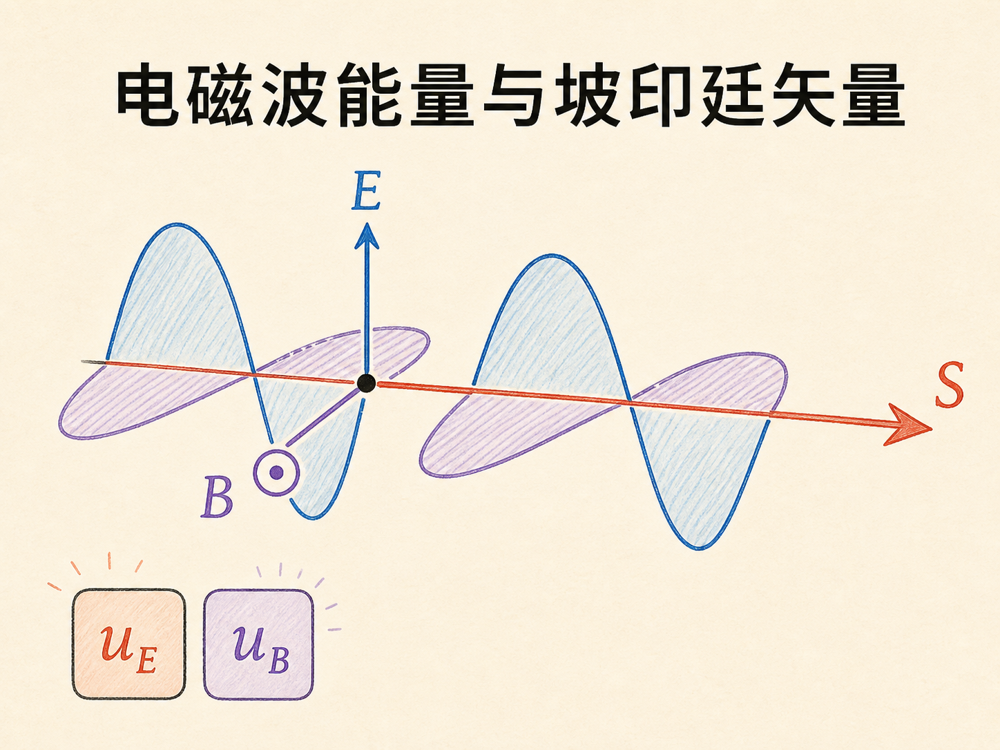
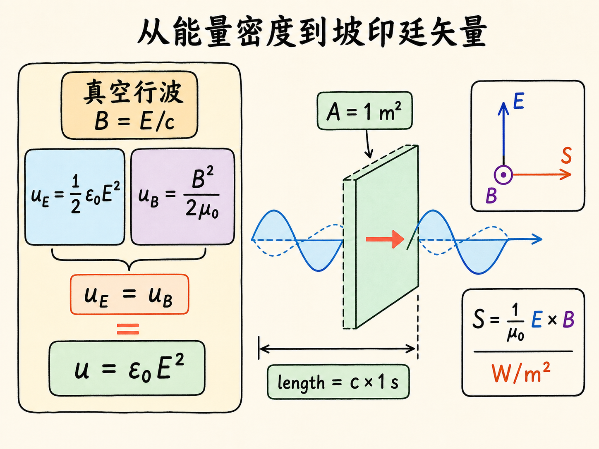
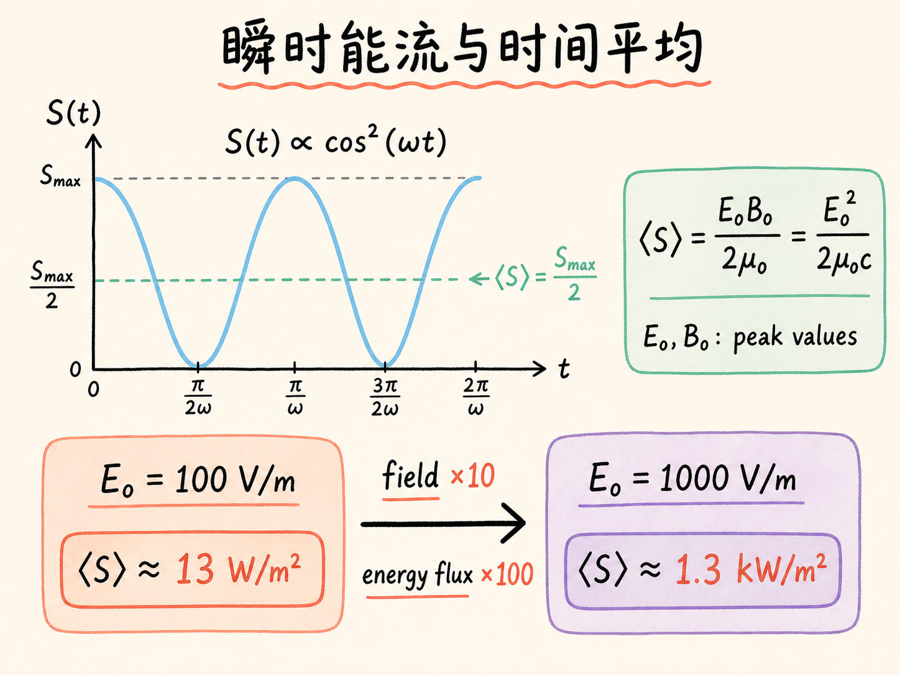
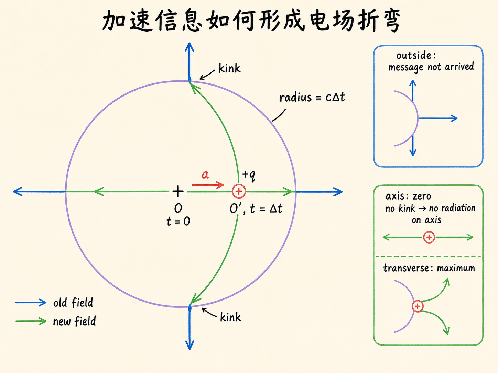
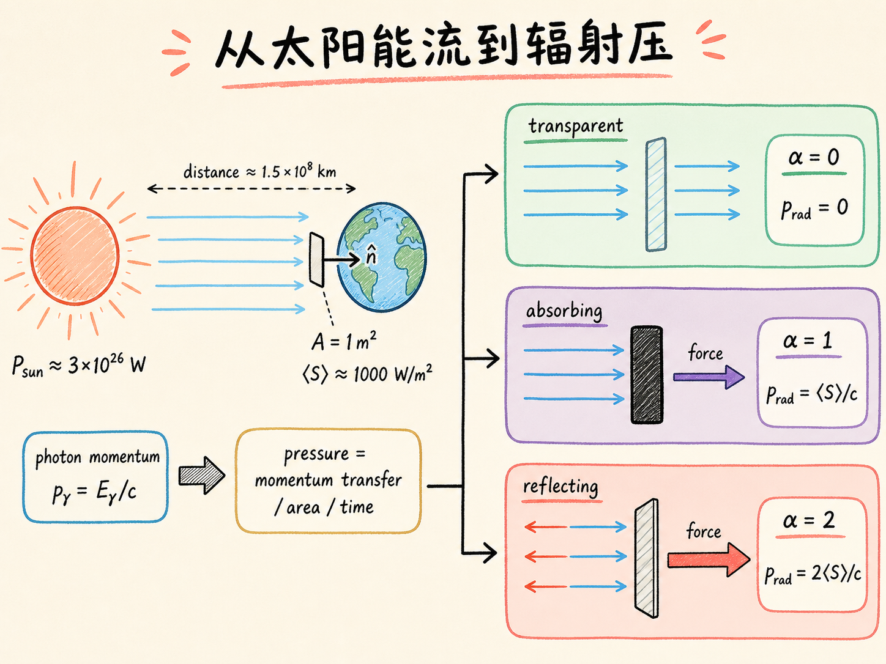
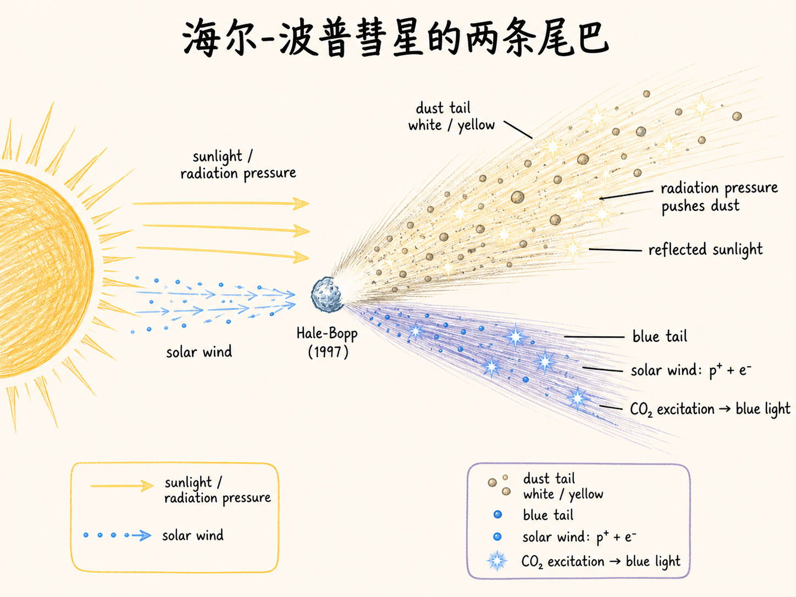
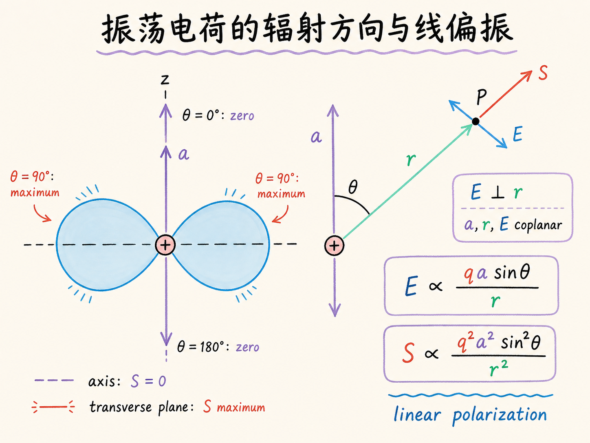
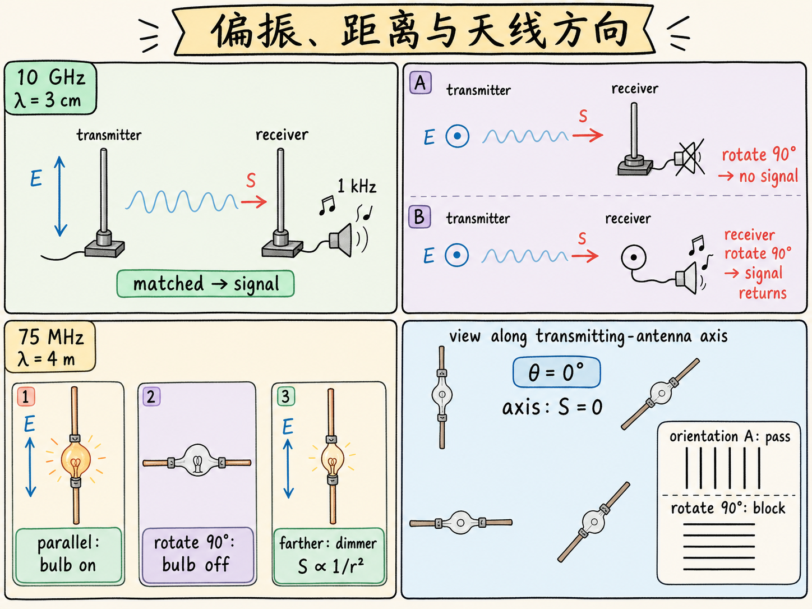

# 电磁波能量与坡印廷矢量

一根直铜线从中间剪开，再接上一只小灯泡。把它放到一个 75 MHz 发射天线旁边，方向合适时，灯泡亮了；把铜线转过 90°，灯泡立刻熄灭。更奇怪的是：即使把铜线转来转去，只要站到发射天线的轴线上，灯泡怎么都不亮。

这不是接收器“时灵时不灵”。它同时暴露了电磁波的三个关键性质：能量流有大小、有方向，还有偏振。要把这三个性质连起来，我们得先回答一个更基础的问题：电磁波的能量究竟放在哪里，又怎样从一处流到另一处？

读完这篇，你会知道

- 为什么真空行波的电场和磁场各承担一半能量；
- 坡印廷矢量为什么等于 $\mathbf E\times\mathbf B/\mu_0$，方向怎样判断；
- 为什么比较电磁波强弱时通常使用时间平均能流；
- 加速电荷怎样产生有方向、有偏振的辐射；
- 光子动量怎样变成辐射压，并解释彗尾与两组天线演示。

## 一、电磁波的能量怎样变成有方向的能流

电场中有能量，磁场中也有能量。在真空中，电场能量密度和磁场能量密度分别是

$u_E=\frac12\varepsilon_0E^2,$

$u_B=\frac{1}{2\mu_0}B^2.$

$u_E$ 和 $u_B$ 都表示每立方米空间中储存多少焦耳，单位是 $\mathrm{J/m^3}$。这里的 $E$、$B$ 是这一时刻当地电场和磁场的大小。

现在只看真空中的行波。电场和磁场的大小满足

$B=\frac{E}{c},$

而光速满足

$c^2=\frac{1}{\varepsilon_0\mu_0}.$

把 $B=E/c$ 代入磁场能量密度：

$u_B =\frac{1}{2\mu_0}\frac{E^2}{c^2} =\frac12\varepsilon_0E^2 =u_E.$

结果很漂亮：在真空行波中，任意时刻的电场能量密度和磁场能量密度完全相等。不是电场在“带着”磁场走，也不是磁场只占一点配角；两者各承担一半。

所以总能量密度是

$u=u_E+u_B=\varepsilon_0E^2.$

因为 $E=Bc$，也可以把其中一个 $E$ 换掉：

$u=\varepsilon_0EBc.$

这个看似多余的改写，马上就会把能量密度变成能量流。

想象在电磁波前进的路上竖起一个 $1\ \mathrm{m^2}$ 的平面，而且平面垂直于传播方向。我们要问：一秒内有多少能量穿过它？

光在一秒内走过距离 $c$，大约是 30 万千米。于是，一秒内会穿过这个平面的那一段波，可以看成一个截面积为 $1\ \mathrm{m^2}$、长度为 $c$ 的长柱体。它的体积是 $c\ \mathrm{m^3}$，里面每立方米有 $u$ 焦耳，所以一秒内穿过平面的能量是 $uc$。

因此，单位面积、单位时间的能流大小是

$uc=\varepsilon_0EBc^2.$

再利用 $c^2=1/(\varepsilon_0\mu_0)$：

$uc=\frac{EB}{\mu_0}.$

到这里我们只得到了大小，还没有说明能量往哪边流。真空行波中，$\mathbf E$ 与 $\mathbf B$ 互相垂直，它们又都垂直于传播方向。把方向信息也放进去，就得到坡印廷矢量：

$\boxed{\mathbf S=\frac{1}{\mu_0}\mathbf E\times\mathbf B}.$

$\mathbf S$ 的单位是 $\mathrm{W/m^2}$，也就是每平方米多少焦耳每秒。它的方向不是另行规定的，而是由叉乘直接给出：右手从 $\mathbf E$ 转向 $\mathbf B$，拇指所指就是 $\mathbf S$，也是波和能量传播的方向。

这正是矢量写法比 $EB/\mu_0$ 更有价值的地方。标量只告诉你“流得有多强”，叉乘还告诉你“流向哪里”。

## 二、为什么真正有用的是平均能流

对正弦电磁波，固定在空间某一点观察，电场和磁场都随时间振荡。若它们都按 $\cos\omega t$ 变化，那么坡印廷矢量的大小就按 $\cos^2\omega t$ 变化：有些时刻 $E$、$B$ 同时为零，$S$ 也为零；有些时刻二者都达到峰值，$S$ 最大。

因此，只盯着某一个瞬间并不能代表这束辐射通常搬运多少能量。一个周期内

$\left\langle\cos^2\omega t\right\rangle=\frac12.$

若 $E_0$、$B_0$ 分别表示电场和磁场的峰值，那么时间平均能流是

$\boxed{ \langle S\rangle =\frac12\frac{E_0B_0}{\mu_0} =\frac{E_0^2}{2\mu_0c} }.$

这个式子里没有频率。只要给出平面波的电场峰值，就能算出它平均每秒通过每平方米的能量。

例如，若

$E_0=100\ \mathrm{V/m},$

代入上式得到

$\langle S\rangle\approx13\ \mathrm{W/m^2}.$

如果一个面积约 $1\ \mathrm{m^2}$ 的人站在波前，而且身体把这束辐射吸收了，那么接收功率大约是 13 W。是否真的吸收，要看辐射种类：课堂举例说，有些辐射可能穿过身体，可见光不会直接穿过去，一些无线电波也会被身体吸收。13 W 相比课堂给出的人体自身约 100 W 的辐射量级，并不显眼。

但若把电场峰值提高到

$E_0=1000\ \mathrm{V/m},$

情况就变了。$E_0$ 增加 10 倍时，和它耦合的 $B_0$ 也增加 10 倍，二者的乘积增加 100 倍。因此

$\langle S\rangle\approx1.3\ \mathrm{kW/m^2}.$

这已经不再是可以随便忽略的能流。课堂用海滩日晒作比较：如果身体持续吸收这种量级的辐射，会晒得很深，时间够长还会造成严重伤害。

这里也能看出一个重要关系：电磁波的“场有多大”和“能流有多大”不是一次关系，而是平方关系。场增加 10 倍，平均能流增加 100 倍。

## 三、现实中的波不会铺满全部时空

上面的推导从平面波开始，但理想平面波有一个明显问题：它没有开头，也没有结尾；无论把位置和时间取到哪里，数学表达式都给得出一个值。真实灯泡、天线或脉冲源当然不是这样。真实辐射会在某一时刻开始，也会结束，因此波列有有限长度。

课堂提到上一讲向月球发出的四分之一纳秒脉冲：

$\Delta t=0.25\ \mathrm{ns},$

它在空间中的长度只有约 7 cm。这样一小段脉冲，显然不像铺满宇宙的无限平面波。

那真实电磁波是怎样产生的？关键不在“电荷存在”，甚至也不在“电荷运动”，而在电荷的速度发生变化，也就是电荷有加速度。

先看一幅受限但直观的经典图景。一个静止的正电荷周围，电场方向向外；若是负电荷，方向向内。电场线只是帮助我们表示场方向的线，不是空间里真实存在的绳子。

现在让电荷在 $\Delta t$ 内向一边加速，然后停下。到 $t=\Delta t$ 时，电荷已经来到新位置，但“电荷动过了”这个信息不可能瞬间传遍空间，它最多只传播到半径

$c\Delta t$

的球面。

球面外还没有收到消息，那里的电场仍保持电荷原来在旧位置时的样子；球面内已经收到消息，电场要对应电荷的新位置。内外两段必须接起来，于是在球面附近出现电场方向的“折弯”。这些折弯随着球面以光速向外传播，构成电磁扰动。

如果电荷来回振荡，远处的观察者就会不断看到这样的折弯经过，体验到电场随时间变化。按照麦克斯韦方程组，变化的电场还伴随着变化的磁场，于是形成电磁波。

这个图景还有一个非常关键的方向性。沿着电荷加速的轴线看，场线没有出现这样的横向折弯，所以轴向没有辐射；在垂直加速度的方向，折弯最明显，辐射最强；中间角度的强度则介于两者之间。它更像一个有明显方向图的球面波，而不是各个方向同样强的球面波。

课堂动画把这个过程分解得更清楚：电荷匀速运动时不再形成新的折弯；把它停下来，也是在加速——你可以称为减速——这时会发出一个向外传播的波前；让它再加速，又会形成新的波前。静止或匀速阶段不持续产生这种电磁波，只有速度改变的阶段才产生。

天线中的高频交变电流，正是在让电荷不断向上、向下加速。频率可以是约 70 MHz，也可以进入 GHz 范围。电荷持续来回振荡，速度不断改变，因此不断把电磁扰动送向远处。

## 四、从太阳能流到光子动量和辐射压

太阳可以看成一个极强的辐射源，辐射功率约为 $3\times10^{26}\ \mathrm W$，主要以可见光和红外辐射的形式发出。地球距离太阳约 1.5 亿千米。在地球附近，取一个面朝太阳、也就是垂直于来光方向的 $1\ \mathrm{m^2}$ 平面，能流约为

$\langle S\rangle\approx1000\ \mathrm{W/m^2}.$

太阳不是无限平面波源，但“每平方米、每秒有多少能量流过”这个问题仍然成立，所以课堂仍把它称为坡印廷矢量。你可以把光想成平面波、从太阳向外扩展的波，或者一包包光子；面对不同问题，这些图景各有用途。

如果硬把这 $1000\ \mathrm{W/m^2}$ 当作理想平面波的时间平均能流，就可以反推一个电场峰值：

$1000=\frac{E_0^2}{2\mu_0c},$

得到

$E_0\approx870\ \mathrm{V/m}.$

但讲者紧接着提醒：他并不确信该怎样理解这个数。它是由平面波公式反推出来的“等效电场”，而太阳辐射并不是前面那种铺满时空的理想平面波。这里最可靠、最直接的物理量仍是能量通量本身。

波和光子看起来是两套很不一样的语言。课堂在这里没有展开量子力学，只指出：真正把波图景和光子图景合在一起，是量子力学要处理的事情。

把电磁辐射换成光子图景。光子可以描述为有有限时空范围、携带确定能量的波包。一个能量为 $E_\gamma$ 的光子具有动量

$\boxed{p_\gamma=\frac{E_\gamma}{c}}.$

如果许多光子射到物体上并被吸收，光子原来沿传播方向的动量就交给物体。单位时间转移的动量就是力，因此辐射会推物体。

课堂用了一个很形象的番茄例子。假设每秒有 1 kg 番茄以 $5\ \mathrm{m/s}$ 的速度砸到你的脸上，撞上后向下掉，原来前进方向的动量全部消失。那么这个方向上每秒转移的动量是

$1\ \mathrm{kg/s}\times5\ \mathrm{m/s}=5\ \mathrm N.$

你受到的平均力就是 5 N。如果番茄像完全弹性的球一样原路反弹，它的动量不只是从原值变为零，而是反向，动量变化量翻倍，于是平均力变成 10 N。

电磁辐射也是同一个逻辑。$\langle S\rangle$ 是每平方米、每秒到达的能量；根据 $p_\gamma=E_\gamma/c$，把它除以 $c$，就得到每平方米、每秒到达的动量。动量除以时间是力，力再除以面积就是压强。

于是辐射压可以写成

$\boxed{p_{\mathrm{rad}}=\alpha\frac{\langle S\rangle}{c}}.$

系数 $\alpha$ 记录辐射与物体怎样相互作用：

- $\alpha=0$：完全透射，辐射直接穿过，没有净动量交给物体；
- $\alpha=1$：完全吸收，入射方向的动量全部交给物体；
- $\alpha=2$：完全反射，动量方向反转，转移量是完全吸收的两倍。

以地球处约 $1000\ \mathrm{W/m^2}$ 的太阳能流为例，如果完全吸收，辐射压只有

$p_{\mathrm{rad}}\approx3\times10^{-6}\ \mathrm{N/m^2}.$

手掌面积大约只有 $0.01\ \mathrm{m^2}$，受到的力更小，日常生活中完全感觉不到。但“感觉不到”并不等于它不存在；在天文学尺度上，这个持续作用可以留下清楚的痕迹。

## 五、彗星的两条尾巴不是同一种东西

课堂把彗星简化描述为含二氧化碳和尘埃、尺度约如 Manhattan 的天体。当彗星接近太阳时，太阳辐射把动量传给尘埃颗粒，把它们推开，形成白色或略带黄色的尘埃尾。我们看到的颜色来自尘埃反射的太阳光。

另一条较难用肉眼看到的蓝尾，课堂给出的机制不是辐射压，而是太阳风。太阳风由太阳发出的质子和电子组成，强弱会变化，速度约为每秒 250 英里。课堂把蓝光解释为这些粒子使二氧化碳电离、激发，随后退激发时发出蓝光。

所以两条尾巴必须分清：

- 白色或黄色的尘埃尾：太阳光的辐射压推动尘埃，尘埃反射日光；
- 蓝尾：课堂所述太阳风粒子与二氧化碳相互作用的结果。

两条尾巴都可能延伸到约一亿千米。课堂展示了 1997 年海尔-波普彗星（Hale-Bopp）的长时间曝光照片，照片中两条尾巴都很明显。讲者说，自己多次看见白色尘埃尾，却从未用肉眼看见蓝尾。这个例子让辐射压从一个微小的数字，变成了天文学中可见的结构。

## 六、振荡电荷向哪里辐射

现在把一个电荷放在原点，让它沿固定方向以角频率 $\omega$ 来回振荡。它的加速度方向记为 $\mathbf a$。观察者位于 $P$ 点，从电荷指向观察者的位置矢量是 $\mathbf r$，$\mathbf a$ 与 $\mathbf r$ 的夹角是 $\theta$。

判断电场方向有两条简单规则：

1. 辐射电场 $\mathbf E$ 总是垂直于传播方向 $\mathbf r$；
2. $\mathbf a$、$\mathbf r$、$\mathbf E$ 三个矢量在同一个平面内。

因此，只要知道电荷怎样振荡、观察者位于哪个方向，就能确定观察点电场沿哪条线振荡。电荷以 $\omega$ 振荡，接收到的电场也以 $\omega$ 振荡。

场强的比例关系是

$E\propto\frac{qa\sin\theta}{r}.$

它把四件事合在了一起：

- 电荷量 $q$ 增加一倍，电场振幅增加一倍；
- 加速度 $a$ 增加一倍，电场振幅增加一倍；
- 距离 $r$ 增加一倍，电场振幅减小一半；
- 方向由 $\sin\theta$ 决定：$\theta=0$ 时为零，$\theta=90^\circ$ 时最大。

坡印廷矢量由 $E$、$B$ 的乘积决定，而行波中二者彼此成比例，所以能流的比例关系是

$\boxed{ S\propto\frac{q^2a^2\sin^2\theta}{r^2} }.$

这解释了前面经典图景里的方向性：沿振荡轴两端，$\theta=0$，没有能量流出；在垂直振荡轴的整个平面内，$\theta=90^\circ$，辐射最强；其他方向介于两者之间。

$1/r^2$ 也不是偶然。辐射向外扩展时，半径增大一倍，球面面积变成四倍；若总能量守恒，每平方米分到的能量只能降到四分之一。所以 $S$ 按 $1/r^2$ 衰减，而 $E$、$B$ 的振幅各按 $1/r$ 衰减。

在任意固定观察方向上，电场始终沿同一条直线来回振荡，这就是线偏振。接收天线能不能接到信号，取决于它是否允许电荷沿这条电场方向被驱动。

## 七、两组演示把方向、偏振和能流连了起来

### 1. 10 GHz、3 cm 的雷达波

第一组装置由发射器和接收器组成。发射频率是

$f=10\ \mathrm{GHz},$

对应波长约 3 cm。发射天线中的电流以每秒 100 亿次的频率振荡；接收天线是一根直导体。

当发射天线和接收天线方向匹配时，来到接收端的电场正好沿接收导体方向振荡，可以驱动导体中的电流。为了让人耳听见是否收到信号，课堂用约 1 kHz 的音频对 10 GHz 信号做幅度调制。方向匹配时，扬声器能听见这个音调。

把手放在发射器和接收器之间，声音消失；拿开手，声音回来。课堂据此展示身体会挡住这束 3 cm 辐射。

接着把发射天线旋转 90°。电场的振荡方向也跟着转过 90°，但接收导体仍保持原方向，于是它无法被这个电场有效驱动，声音消失。再把接收天线也旋转 90°，两者重新匹配，声音又回来。

随后，课堂在发射器与接收器之间放入一组平行金属条。金属条处于一个方向时信号通过，整体旋转 90° 后信号被阻断，说明这组栅格会选择偏振。

### 2. 75 MHz、4 m 的无线电波

第二组发射器的频率是

$f=75\ \mathrm{MHz},$

对应波长 4 m。接收器极其简单：一根直铜线从中间断开，左右两段通过一只小灯泡连接。收到足够强的信号时，交变电场驱动电流，灯泡就亮。

当接收铜线与发射天线平行时，灯泡点亮；把接收器旋转 90°，它与电场偏振方向失配，灯泡熄灭。这和 10 GHz 演示是同一个偏振选择，只是一个用声音显示，一个用灯泡显示。

保持方向匹配，接收器靠近发射器时灯泡更亮，走远时逐渐变暗。这一变化可用坡印廷矢量的

$S\propto\frac{1}{r^2}$

来解释。靠得太近甚至可能烧坏灯泡，因为接收到的能流太强。

最后，把接收器拿到发射天线的轴线上，也就是 $\theta=0$ 的方向。无论把接收铜线横着、竖着还是换成其他方向，灯泡都不亮；稍微离开严格轴线，才又能接到一部分辐射。这正是

$S\propto\sin^2\theta$

的直接展示：问题不在接收器有没有找对偏振，而在这个方向上本来就几乎没有能量流过。

## 结语：一条叉乘，把整讲串了起来

这讲从每立方米空间里有多少能量出发，最后落到一根会不会点亮灯泡的铜线上。中间的桥梁是

$\mathbf S=\frac{1}{\mu_0}\mathbf E\times\mathbf B.$

它同时回答两个问题：电磁波每秒穿过每平方米多少能量，以及这些能量流向哪里。对正弦波取时间平均，就能比较不同场强；把能量除以 $c$，就得到光子携带的动量并进一步得到辐射压；再追问电场是怎样由加速电荷产生的，就能看出辐射为什么有方向图、为什么是线偏振，也就能解释天线旋转、距离改变和轴向零信号的全部演示。

所以，电磁波不是一团没有方向的“能量雾”。在这讲讨论的真空行波中，电场、磁场和传播方向构成严格的右手关系；能流随场强平方变化。振荡电荷只在加速阶段发出这种辐射，并以特定方向和偏振把能量送到远处。
