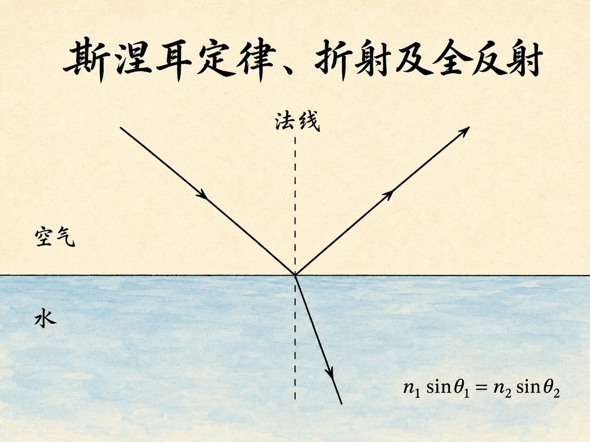
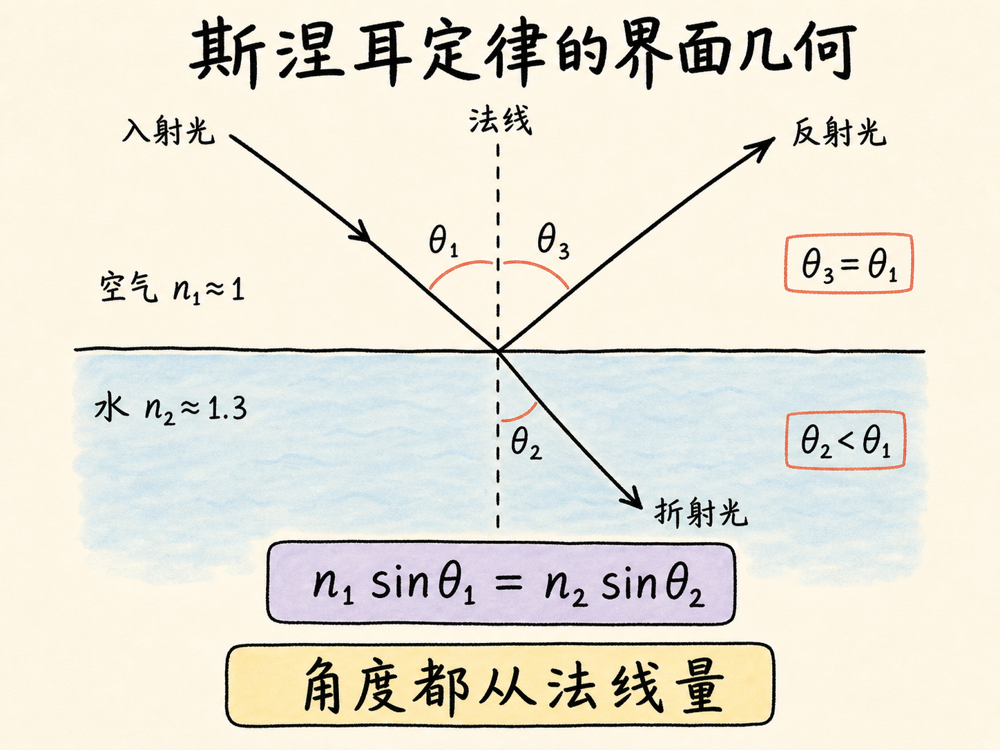
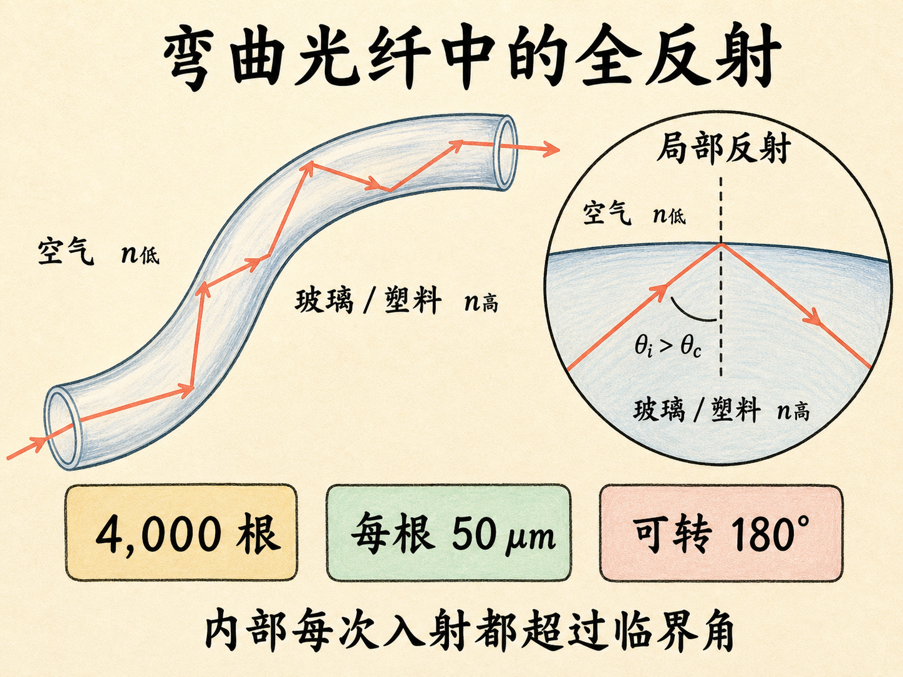
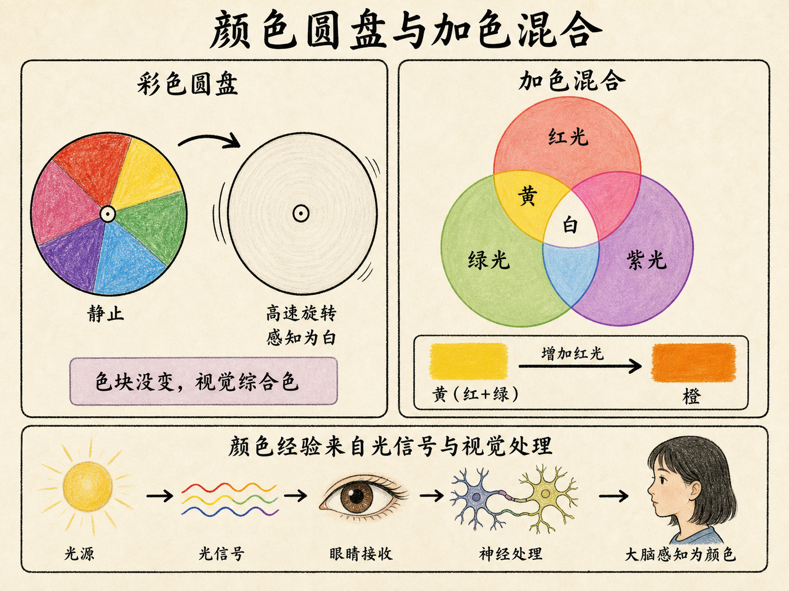
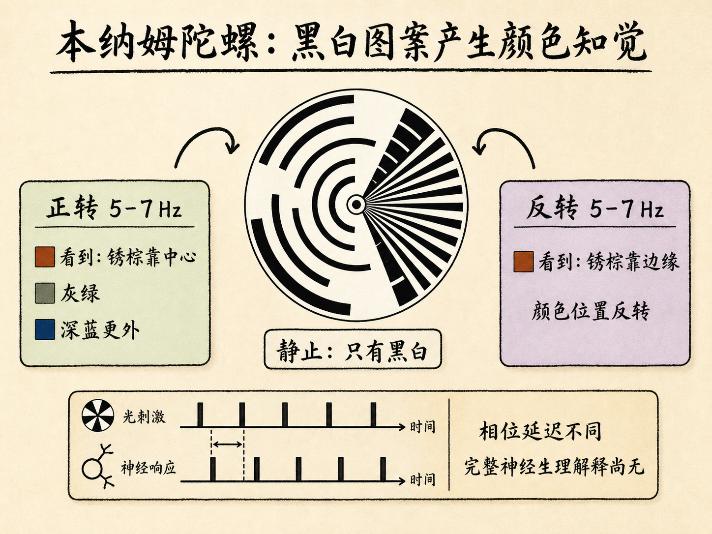
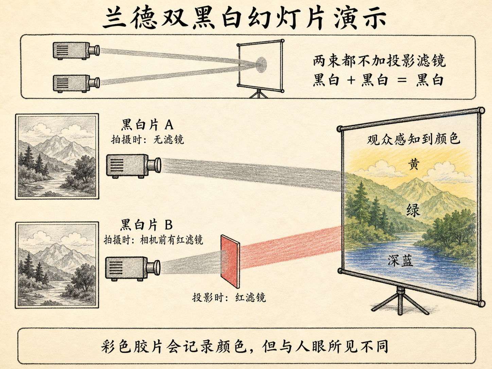

# 斯涅耳定律、折射及全反射

一束光碰到水面，不会只做一件事：一部分折回水中，另一部分穿过界面进入空气。继续改变入射方向，穿出水面的那束光会越来越贴近水面；再多倾斜一点，它竟会完全消失，只剩反射光。

这不是水面临时改变了脾气，而是同一条折射定律走到了它的边界。顺着这条线索继续追下去，我们还能解释光为什么会被困在弯曲的光纤里、棱镜为什么能拆开白光，以及为什么眼睛看到的“颜色”并不只由一个波长决定。

读完这篇，你会知道

- 为什么光进入不同介质时会向法线或离法线弯折？
- 全反射为什么只能从高折射率介质射向低折射率介质？
- 牛顿和惠更斯怎样从同一个折射现象得出相反的光速判断？
- 折射率、传播速度、频率和色散之间是什么关系？
- 为什么彩色圆盘、黑白圆盘和两张黑白幻灯片都可能让人看到颜色？

## 先把三个角量对

设界面上方是空气，记作介质 1；下方是水，记作介质 2。一束光从空气射向水面后，出现入射光、反射光和折射光。描述这三束光之前，必须先画出一条与界面垂直的法线。

入射角 $\theta_1$、折射角 $\theta_2$ 和反射角 $\theta_3$ 全都从法线开始量，而不是从界面开始量。只要测量基准弄错，后面的大小关系和临界角都会一起颠倒。

界面上的光遵守三条规律：

1. 入射光、反射光和折射光位于同一个平面内。
2. 反射角等于入射角，即 $\theta_3=\theta_1$。
3. 入射角与折射角满足斯涅耳定律：$n_1\sin\theta_1=n_2\sin\theta_2$。

这里的 $n_1$ 是入射侧介质的折射率，$n_2$ 是光将进入的介质的折射率。真空的折射率定义为 1，空气很接近 1，通常也按 1 处理；水约为 1.3；玻璃随种类而变，大约为 1.5。

把公式改写为 $\dfrac{\sin\theta_1}{\sin\theta_2}=\dfrac{n_2}{n_1}$，就能直接读出光向哪边弯。如果光从空气进入水或玻璃，$n_2>n_1$，所以 $\theta_2<\theta_1$，折射光向法线弯。如果光从水进入空气，$n_2<n_1$，所以 $\theta_2>\theta_1$，折射光离法线弯。

“向法线”或“离法线”不是另一条独立规则，而是斯涅耳定律在两种折射率次序下的直接结果。

## 当折射角走到九十度

现在让光从水射向空气。此时 $n_1\approx1.3$，$n_2\approx1$，斯涅耳定律变成 $\dfrac{\sin\theta_1}{\sin\theta_2}=\dfrac{1}{1.3}$。

随着入射角 $\theta_1$ 增大，折射角 $\theta_2$ 也会增大。但折射角不可能超过 $90^\circ$。当 $\theta_2=90^\circ$ 时，折射光刚好沿界面传播；与此对应的入射角就是临界角 $\theta_c$，满足 $\sin\theta_c=\dfrac{n_2}{n_1}$。

对水到空气的界面，临界角大约是 $50^\circ$。

这时可以把界面行为分成三种状态：

- $\theta_1<\theta_c$：既有反射光，也有进入空气的折射光。
- $\theta_1=\theta_c$：折射角为 $90^\circ$，折射光沿界面传播。
- $\theta_1>\theta_c$：若还要求有一束传播到空气中的折射光，公式就会给出 $\sin\theta_2>1$，没有这样的实数角度；空气侧不再出现传播的折射光，光全部反射回水中。

最后一种情况就是全反射。它有两个缺一不可的条件：光必须从较高折射率的介质射向较低折射率的介质，即 $n_1>n_2$；入射角还必须大于临界角。仅仅“角度很大”不够，如果 $n_1\le n_2$，就不存在这样的全反射临界角。

水槽激光演示把这三个状态连续地摆在眼前。激光从水中射向水面，水里同时可以看到入射光和反射光，空气中可以看到折射光。慢慢增大水中的入射角，空气里的折射光越来越贴近水面；接近临界角时，折射角接近 $90^\circ$；越过临界角后，空气侧的传播光消失，只剩水中的反射光。桌面稍一晃动，水面也会晃，光路随之摇摆，但决定每一瞬间角度的基准仍是局部水面的法线。

## 光为什么能沿着弯曲的光纤前进

把水面换成一根塑料或玻璃纤维的侧壁，机制没有改变。光从纤维内部射到与空气的界面，只要每一次入射都从侧壁法线量起并且大于临界角，它就会一次次全反射，在纤维内部继续前进，而不是穿到空气中。

需要分清两个角：光线与纤维轴的夹角，不是斯涅耳定律中的入射角；真正要比较临界角的，是光线与每个局部侧壁法线的夹角。纤维弯成 S 形，甚至把出光方向转过 $180^\circ$，宏观路径虽然变了，每个反射点仍按同一个局部条件判断。

演示中的光纤束有 4,000 根纤维，每根直径约 50 微米。激光进入一端后，即使把整束纤维弯来弯去，另一端仍能看到光。另一组由数千根细纤维组成的光纤束还能传递图像或文字；观察输出端时，可以分辨一根根直径大约 50 到 100 微米的纤维，而摄像机能在另一端看到整幅图像。

在这个理想化演示中，“把光留在纤维内”的关键不是纤维一定要笔直，而是内部各次入射都保持在临界角条件之上。

## 牛顿和惠更斯给出相反答案

折射定律不仅描述光路，还能反过来追问：光进入水后，速度究竟变快还是变慢？

牛顿用粒子图景解释折射。他设想光粒子到达水面时，获得一个垂直于界面的加速。因此，平行于界面的速度分量保持不变，垂直分量增大，合速度便向法线偏转。速度三角形给出 $\dfrac{\sin\theta_1}{\sin\theta_2}=\dfrac{v_2}{v_1}$。

因为从空气进入水时 $\theta_1>\theta_2$，这个式子要求 $v_2>v_1$。牛顿的模型因此预言：光在水中比在空气中更快，在玻璃中还会更快。这里“相同”的是界面两侧的切向速度分量，不是两边的总速度。

惠更斯从波的图景出发。他把同相点组成的面叫作波前，并假设波前上的每一点都以与波源相同的频率振荡，发出球面次级波；这些次级波的包络成为下一时刻的新波前。这就是惠更斯原理。

用这个波前构造解释折射，会得到相反的速度关系：$\dfrac{\sin\theta_1}{\sin\theta_2}=\dfrac{v_1}{v_2}$。

于是，从空气进入水时，$v_2<v_1$。惠更斯预言光在水里更慢。

关于光在不同现象中更适合用波还是粒子解释，答案不是二选一：一些现象用波的图景更容易解释，辐射压力又可以用光子图景理解。但在“水中的传播速度”这个具体问题上，光在水中确实比在空气中慢，惠更斯给出的速度判断是对的。

## 折射率其实在告诉你传播速度

真空中的电磁波速度满足 $c=\dfrac{1}{\sqrt{\varepsilon_0\mu_0}}$。把同样的关系写到电介质和具有磁响应的材料中，传播速度可写成 $v=\dfrac{c}{\sqrt{\kappa\kappa_m}}=\dfrac{c}{n}$，所以 $n=\sqrt{\kappa\kappa_m}$。

这条关系把折射率与传播速度连在了一起：折射率越大，电磁波在介质中的速度越低。水对可见光的折射率约为 1.3，所以可见光在水中的速度约为 $c/1.3$。

$\kappa$ 和 $\kappa_m$ 还随频率变化。这里采用的解释是：交变外场频率很高时，材料内部的电偶极子和磁偶极子来不及完全跟随场的快速来回变化，因此相应的响应参数会比低频时小。对顺磁性和抗磁性材料，$\kappa_m$ 等于或很接近 1；磁性响应在铁磁性材料中才更重要。

水给出了一个跨度很大的例子。在低频直到约 100 MHz 的无线电频率附近，水的介电常数约为 80，对应的折射率约为 9，无线电波在水中的速度约为 $c/9$。到了可见光频率，水的折射率约为 1.3，传播速度约为 $c/1.3$。同一种材料对不同频率并没有一个永远不变的折射率。

## 色散：红光和蓝光为什么分开

即使都属于可见光，频率不同，折射率也会略有不同。水对红光的折射率为 1.331，对蓝光的折射率为 1.343；因此蓝光在水中约比红光慢 1%。电磁波在介质中的速度随波长或频率变化，这种现象叫作色散。

空气中的声音在这里被拿来作对照。如果高频和低频声音在空气中以明显不同的速度传播，音乐会里的小提琴和低音乐器就会先后到达，离乐团越远，时间错位越严重；课堂后排甚至可能因为语音的不同频率成分到达时间不同而听不懂讲话。空气中的声音没有这种明显色散，避免了这种局面。

玻璃和水对光的色散却很明显。白光射入棱镜，在第一个界面折射一次，在第二个界面还要再用一次斯涅耳定律。因为红光和蓝光的折射率不同，而且棱镜两面不平行，两种光离开棱镜时不再沿同一方向，屏幕上便能看到分开的颜色，形成光谱。

平行平板玻璃给出一个很重要的对照。白光进入玻璃时，各种颜色也会发生略有差别的折射；但它们从与第一面平行的第二面射出后，最终沿同一个方向传播。大脑把来自同一方向的多种颜色组合看成白光，所以普通窗玻璃不会像棱镜那样在远处把白光展开成扇形光谱。

## 波长能标记颜色，却不能独自解释颜色

物理学常把空气中的波长与颜色对应起来：较长的可见波长被看作红色，缩短后依次进入绿色、蓝色区域；再短就进入眼睛看不见的紫外区域，再长则进入红外区域。一个埃等于 $10^{-10}$ 米。

但“知道波长就知道全部色觉”很快遇到问题。白光包含许多颜色，可眼睛不会把它看成一堆彼此分开的颜色，而会得到一个综合色觉。高速旋转的彩色圆盘就是直接演示：圆盘静止时能看到不同色块，转得足够快后，大脑把快速到来的颜色信息组合起来，看到接近白色的结果。圆盘上的颜料没有在物理上变白，改变的是视觉系统给出的综合色觉。

颜色三角进一步展示了加色混合。这里采用的光的三原色是红、绿、紫；颜料混合则另列黄、蓝、红，不能把两套混色规则混为一谈。在光的颜色三角中，红、绿、紫位于三个顶角，三种光按不同强度组合，能够得到三角内部的许多颜色。

黄色可以只由红光和绿光混合而成，不需要紫光；在这个组合中继续增加红光，感觉会向橙色移动；把红、绿、紫按合适比例混合，可以得到白色。三灯箱演示允许分别调节三种光的强度：较多绿光加少量红光得到黄色，再增加红光变成橙色，三盏灯都调强则可被看成白色。

这种三色解释把色觉归因于视网膜细胞对三种原色的不同响应，以及大脑对三种响应的混合处理。彩色电视也用三束电子分别激发屏幕上的红、绿、紫发光点，再靠强度组合产生各种颜色；如果三束没有调好，人脸就可能偏红或偏绿。这个三色框架能解释很多现象，但它并不完整。

## 一个纯黑白圆盘，为什么能转出颜色

本纳姆陀螺把三色框架的边界暴露出来。这个 1895 年出现的圆盘在静止时只有黑白图案，没有彩色颜料。可当它以大约 5 到 7 Hz 旋转时，观察者会看到不鲜艳却可分辨的颜色：中心附近可能有锈棕色，外面还会出现灰绿色和深蓝色。让圆盘反向旋转，锈棕色会移到更靠近边缘的位置，颜色的次序也随之反转。

这里可以用闪烁刺激与视觉响应之间的相位延迟来描述：不同颜色响应的相位延迟不同，圆盘中心和更外侧位置对应的延迟也不同；大脑按平常方式处理这些时间上错开的信号，于是形成颜色知觉。但这不是一个已经完结的解释，当时仍没有完整的神经生理学答案，只有一些能够预测所见颜色的模型。

本纳姆陀螺和前面的彩色圆盘必须分开理解。彩色圆盘本来就有色块，快速旋转后被看成白；本纳姆陀螺本来只有黑白图案，旋转后反而让人看到颜色。两者都说明，视觉结果不是把物体表面的颜色逐项抄进大脑。

## 两张黑白幻灯片叠出多种颜色

埃德温·兰德的演示把这种反直觉推得更远。他使用同一场景的两张黑白幻灯片。其中一张在拍摄时，红色滤光片放在相机镜头前；但记录介质仍是黑白胶片，所以得到的实体幻灯片依然是黑白的。另一张也使用黑白胶片拍摄，只是没有这个拍摄滤镜。

单独投影任一张黑白片，只会得到黑白图像。若在投影光路前放一块红色滤光片，单独那束光只会让画面呈现红色或粉红色调。把两张都以未加投影滤镜的方式准确叠投，黑白加黑白仍然是黑白。

关键的一步是：只在那张“拍摄时曾用红滤镜”的黑白片的投影光路前再次放红滤镜，另一张的投影光路保持不加滤镜，再让两幅图准确重合。观众此时不仅看到红色，还会感到画面中出现黄色、绿色和深蓝色。

如果用彩色胶片拍摄屏幕，照片也会记录到颜色，但记录结果与人眼现场感知到的颜色并不相同。于是“哪一种才是真实颜色”不再是一个简单的物体属性问题：对观察者来说，最终经验取决于视觉系统怎样处理收到的信息。色盲者的处理结果又会不同。

## 从一条光线到一次知觉

这堂课的逻辑可以用一条连续链条复述：界面两侧的折射率通过斯涅耳定律决定光路；高折射率到低折射率的传播在临界角处走到极限，越过极限便出现全反射；折射率又满足 $v=c/n$，因此它同时告诉我们介质中的传播速度；折射率随频率变化便产生色散，棱镜因此能把白光展开成不同颜色。

但光到达眼睛还不是故事的终点。彩色圆盘、三灯箱、本纳姆陀螺和兰德双投影依次说明：进入眼睛的光信号还要被视网膜和大脑处理，最后才形成我们称为颜色的经验。

所以，一束光跨过界面时，入射光与界面法线的夹角，以及界面两侧随频率变化的折射率，共同决定折射方向和是否发生全反射；当它抵达观察者，视觉系统又决定这些信号最终被看成什么。前半段是光怎样走，后半段是我们怎样看见它。
