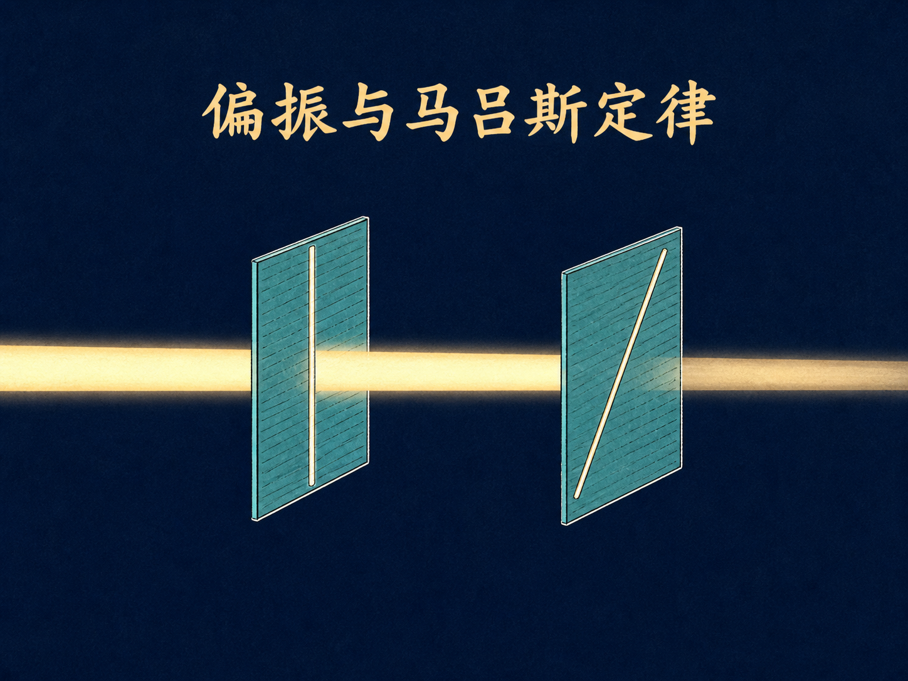
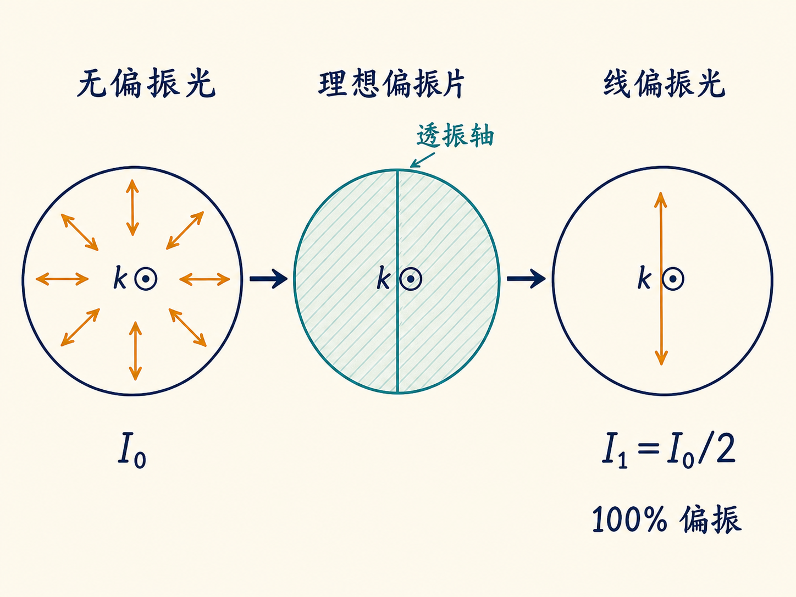
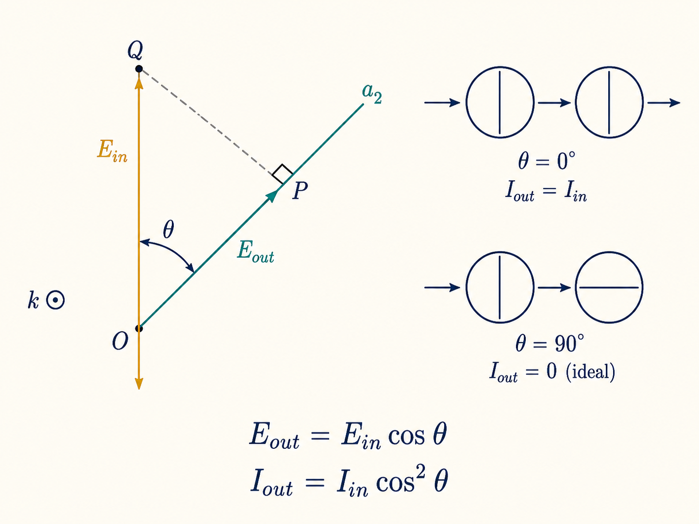

# 偏振与马吕斯定律

把两片看起来都能透光的薄片叠在一起，一片不动，另一片慢慢旋转。你会看到亮度连续下降，直到两片互相交叉时，后面的物体几乎完全消失。光没有被挡板遮住，薄片也没有变黑；改变的只是两个允许方向之间的夹角。

这件事把“偏振”从一个抽象名词变成了可见的明暗变化。此前在 75 MHz 和 10 GHz 的电磁波演示中可以看到线偏振；换到频率高得多的可见光，同一个问题仍然成立：电场沿哪个方向振动，怎样决定最后能有多少光通过？

读完这篇，你会知道

- 无偏振光为什么不是“没有电场方向”，而是平均后没有优先方向
- 为什么一片理想偏振片让无偏振光只剩一半强度
- 马吕斯定律中的 $\theta$ 到底是哪两个方向的夹角
- 为什么玻璃反射和 $90^\circ$ 散射也能产生线偏振光
- 蓝天、偏振天空与红色落日怎样来自同一组散射现象

## 无偏振，不等于没有电场

太阳光和普通灯泡发出的光通常是无偏振光。课堂上采用了一幅便于理解的图像：把一个个光子想成各自具有确定偏振方向的平面波。第一个到来时，电场可能沿一个方向振动；第二个换成另一个方向；后面的光子还会取许多其他方向。

关键不是每一个瞬间都“没有方向”，而是把许多光子、许多时刻平均起来后，没有任何一个横向方向更受偏爱。这才是这里所说的无偏振。

1938 年，埃德温·兰德研制出能把无偏振光变成线偏振光的材料。偏振片并不是随意让电场通过，它有一条透振轴：只有电场在这条轴上的分量能成为透射光。

## 第一片偏振片：先投影振幅，再计算强度

设入射电场的振幅为 $E_0$，它与偏振片透振轴之间的夹角为 $\theta$。把电场矢量向透振轴投影，透射电场振幅就是 $E_0\cos\theta$。

但振幅缩小多少，不能直接当成光强缩小多少。光强由坡印廷矢量描述，且与电场振幅的平方成正比；电场和磁场会同时按相同比例减小。因此，对某个确定的入射偏振方向，透射光强要乘的是 $\cos^2\theta$，不是 $\cos\theta$。

无偏振光包含所有横向偏振方向，所以第一片偏振片面对的不是一个固定 $\theta$，而是要对所有方向取平均。由于 $\langle\cos^2\theta\rangle=1/2$，若理想偏振片前的无偏振光强为 $I_0$，片后的光强就是 $I_1=I_0/2$。与此同时，透射光已经沿偏振片的透振轴成为完全线偏振光。

这里的“一半”是理想结果。课堂把这样的假想偏振片称为 H.N.50，名称中的 50 表示能让 50% 的无偏振入射光以偏振光形式通过。实际教学套件里的偏振片可能只有约 $0.25I_0$ 或 $0.30I_0$ 的透射强度，但透射光仍非常接近完全线偏振。不要把“偏振度接近 100%”误读成“强度保留 100%”。

## 第二片偏振片：马吕斯定律把旋转变成明暗

现在在第一片后面再放一片相同的偏振片，并把第二片的透振轴相对第一片旋转 $\theta$。进入第二片的光已经线偏振，因此这里不再对许多方向求平均；只有第一片透振轴与第二片透振轴之间这一个确定夹角。

若进入第二片的线偏振光强记为 $I_{\text{in}}$，透射光强就是 $I_{\text{out}}=I_{\text{in}}\cos^2\theta$。这就是马吕斯定律。这里的 $\theta$ 是入射线偏振方向与第二片透振轴之间的夹角，也等于两片偏振片透振轴之间的夹角；它不是光线与偏振片表面的夹角。

若仍以最初的无偏振光强 $I_0$ 为基准，两片理想偏振片后的结果应写成 $I_2=(I_0/2)\cos^2\theta$。两个写法并不冲突，只是 $I_{\text{in}}$ 和 $I_0$ 的起点不同。

三个角度最能说明问题：

- 当 $\theta=0^\circ$，两条透振轴平行，第二片不再额外减半，仍有 $I_0/2$ 通过。
- 当 $\theta=30^\circ$，$\cos^230^\circ=0.75$，所以第二片输出为 $0.75I_{\text{in}}$；相对于最初的无偏振光，则是 $0.375I_0$。
- 当 $\theta=90^\circ$，两条透振轴正交，理想情况下 $\cos^290^\circ=0$，透射光强为零。

课堂上的演示很直接：教师在脸前放第一片偏振片，学生在眼前放第二片并旋转。人脸从清楚可见逐渐变暗，交叉时完全看不见，中间则有连续变化的所有亮度。这正是 $\cos^2\theta$ 被亲眼看见的样子。

## 一个必须停下来的地方：光子没有被连续“削弱”

上面的矢量投影对经典电磁波很好用，但若把它逐字套到单个光子上，就会出问题。一个蓝光光子穿过偏振片时，要么通过，要么不通过；只要通过，它仍是蓝光。不能说偏振片把单个光子的电场缩成原来的 $\cos\theta$，从而把它的能量连续降低，否则还会错误地预言颜色改变。

严格处理单光子需要量子力学。值得注意的是，严格处理最终仍得到同一个马吕斯定律。因此，$\cos^2\theta$ 这条规律是对的，课堂上的单光子投影图像只是帮助理解的捷径，不是对单个光子能量变化的严格描述。

## 第二条路：反射也能筛出偏振方向

偏振片不是产生线偏振光的唯一办法。无偏振光从水面或玻璃表面这类电介质反射时，反射光通常会变成部分偏振光；在一个特殊角度上，它还能成为完全线偏振光。

这里仅靠斯涅尔定律不够。斯涅尔定律给出入射角、反射角与折射角之间的几何关系，但偏振分量怎样变化，要由麦克斯韦方程组在介质交界面上的关系来决定。

设光从折射率为 $n_1$ 的介质入射到折射率为 $n_2$ 的介质，入射角为 $\theta_1$，折射角为 $\theta_2$。入射光线和界面法线共同确定入射面。入射光、反射光和折射光的电场，都可以各自分解成垂直于入射面的分量和平行于入射面的分量；每个分量仍必须垂直于相应光束的传播方向。

无偏振入射光的两个分量平均强度相等。经过界面后，两个分量一般按不同的比例反射和折射，于是反射光与折射光都不再无偏振。麦克斯韦方程组把反射、折射的平行分量分别与入射平行分量联系起来，也把反射、折射的垂直分量分别与入射垂直分量联系起来，总共给出四条关系。本讲只展开反射光的平行分量，其振幅满足 $E_{0,\parallel}^{(r)}=E_{0,\parallel}^{(i)}\dfrac{n_1\cos\theta_2-n_2\cos\theta_1}{n_1\cos\theta_2+n_2\cos\theta_1}=-E_{0,\parallel}^{(i)}\dfrac{\tan(\theta_1-\theta_2)}{\tan(\theta_1+\theta_2)}$。这是振幅关系；若要比较光强，仍然必须把振幅比平方。

特殊之处出现在 $\theta_1+\theta_2=90^\circ$。这时正切形式的分母趋于无穷大，反射光的平行分量变为零，只剩垂直于入射面的分量，反射光因此成为完全线偏振光。

结合斯涅尔定律 $\sin\theta_1/\sin\theta_2=n_2/n_1$，再用特殊条件下的 $\sin\theta_2=\cos\theta_1$，便得到 $\tan\theta_B=n_2/n_1$。这个特殊入射角 $\theta_B$ 就是布儒斯特角。

从空气射向折射率约为 1.5 的玻璃时，布儒斯特角约为 $56^\circ$；反过来从玻璃射向空气时，约为 $34^\circ$。课堂先把空气到玻璃的入射角设在约 $45^\circ$，旋转分析偏振片时，反射光只能变暗而不能完全消失；调到约 $56^\circ$ 后，反射光可以被分析片压到接近全黑。角度没有调得绝对精确时，演示当然只是接近完全消失。

这套布儒斯特零反射机制针对这里讨论的电介质。玻璃球的反光会随分析偏振片旋转而明显改变，金属球不会呈现同样结果。即使一束光在投到屏幕前已经完全偏振，光在屏幕上再次反射后也未必保持原状态，所以检验偏振必须在合适的光路位置进行。

## 第三条路：细粒散射为什么在 $90^\circ$ 方向完全偏振

还有第三种办法：让无偏振光被非常细小的粒子散射。先看单个入射电场怎样驱动粒子中的电子。电场对电荷施力，电子的加速度可写成 $a=F/m=qE/m$。质子的质量是电子的 1800 多倍，所以同样受电场驱动时，电子的加速度远大于质子，散射过程主要由电子响应。

在课堂采用的光子图像里，入射光子先被尘埃吸收，随后振荡电子再辐射出光子。振荡电场让电子以同一角频率 $\omega$ 振荡并加速，因此再辐射出的光仍具有相同频率，只是传播方向改变，这就是这里所说的散射。颜色没有因为一次散射而被“改频”。

辐射方向受几何约束：观察到的辐射电场 $\mathbf E$ 必须垂直于从散射体指向观察者的传播方向 $\mathbf r$，同时 $\mathbf a$、$\mathbf r$ 与 $\mathbf E$ 位于同一平面。沿加速度方向和反方向没有辐射，垂直于加速度的方向最强，其他方向的概率较低。

现在让无偏振光进入一团细尘，并只看相对入射方向转过 $90^\circ$ 后到达观察者的光。虽然不同入射光子的电场方向各不相同，但能沿这个观察方向辐射出来的电场都必须同时满足刚才两条几何约束。最终留下的是同一个偏振方向，所以 $90^\circ$ 散射光成为完全线偏振光。

若散射角是 $45^\circ$，得到的只是部分偏振光，旋转分析偏振片时亮度会变化，却不能变成全暗。沿课堂板书所指的正上方观察方向，光仍保持无偏振。这里再次使用了逐个光子的教学图像；严格描述需要量子力学，但得到的偏振结论相同。

## 同一场散射，为什么还会带来颜色

接下来出现的是另一条独立于偏振、却会同时出现在演示里的规律：对很小的粒子，短波长光比长波长光更容易被散射。本讲给出的量级是，蓝光被散射的概率大约是红光的十倍。

粒子尺寸大于约 $0.1\,\mu\text{m}$、例如达到 $1\,\mu\text{m}$ 时，这种颜色偏好会明显减弱；达到约 $10\,\mu\text{m}$ 时，散射不再显示明显的波长偏好。因此，细小烟粒的侧向散射会偏蓝，而云中的水滴约为 $10\,\mu\text{m}$ 或更大，各种颜色近似一起被散射，云看起来就是白色。

课堂把香烟烟雾放入竖直向上的白光束。观众从侧面看到的光近似经历了 $90^\circ$ 散射，因此有两个可同时检验的现象：散射光偏蓝，而且旋转偏振片时亮度会强烈变化。环境很暗时，人眼对颜色不够敏感，所以蓝色可能不容易分辨。

随后，烟在肺中停留一会儿，水蒸气凝结到烟粒上，使颗粒长到约 $10\,\mu\text{m}$ 或更大。第二次吐出的烟与第一次相比明显更白。偏振与颜色在同一束散射光里出现，但原因要分开：偏振来自散射几何，颜色差来自不同波长的散射概率不同。

## 把教室里的烟雾搬到天空

阳光进入大气后，会被细尘、空气分子以及热运动造成的密度涨落散射。蓝光更容易被散进观察者的视线，所以白天的天空呈蓝色。

如果观察天空中与太阳方向相距 $90^\circ$ 的位置，光的传播方向恰好发生接近 $90^\circ$ 的改变，天光会强烈线偏振。所有离太阳方向 $90^\circ$ 的位置在天球上形成一条大圆。换到其他夹角，天光仍可部分偏振，但没有 $90^\circ$ 方向那么强。

日出和日落时，阳光斜穿过更长的大气路径，途中遇到更多散射体。蓝光和绿光更容易先被散出原来的直达光束，最后到达观察者的剩余光便偏红。因此，地平线附近的太阳、行星、亮星和月亮都会显得更红；云若被这束剩余的红光照亮，也会变成红云。

天文学照片里也能看到类似现象。昴星团又叫“七姐妹星团”，但其中远不止七颗星，而有数百颗。周围的细尘把炽热恒星的光散射成明显的蓝色；散射光也带有偏振，只是静态幻灯片不能直接显示偏振。月面行走者扬起细尘时，月球上没有空气，照片中的蓝色只能来自尘埃散射；如果观察几何接近 $90^\circ$，这些散射光也很可能强烈偏振。

## 一桶液体同时做出蓝天、偏振天空和红日

最后一个演示把三件事放进同一套装置。白光从侧面穿过一桶溶液，加入少量硫酸后，液体中逐渐析出微小硫粒，这些颗粒成为散射体。

随着硫粒增多，从侧面看到的散射光逐渐变蓝。处在相对入射光 $90^\circ$ 方向的观众，会看到强烈线偏振；其他角度只能看到部分偏振。把分析偏振片放到侧向散射光里旋转，亮度会明显改变。

与此同时，沿原方向继续传播的光在屏幕上扮演“太阳”。蓝光和绿光不断从直达光束中散出去，屏幕上的光斑便从白色变黄，再逐渐变成浓烈的红色。侧面是偏蓝且偏振的“天空”，正前方是越来越红的“落日”。

这套演示把全篇收在同一个画面里：偏振片靠透振轴投影电场，布儒斯特反射靠让平行分量消失，$90^\circ$ 散射靠辐射几何筛出共同方向；不论是哪条路径，光强都由振幅的平方决定。明暗变化不能被误解成单个光子的能量被连续削弱，散射后的颜色差也不是光子被改了频率，而是不同颜色进入不同方向的概率不同。
