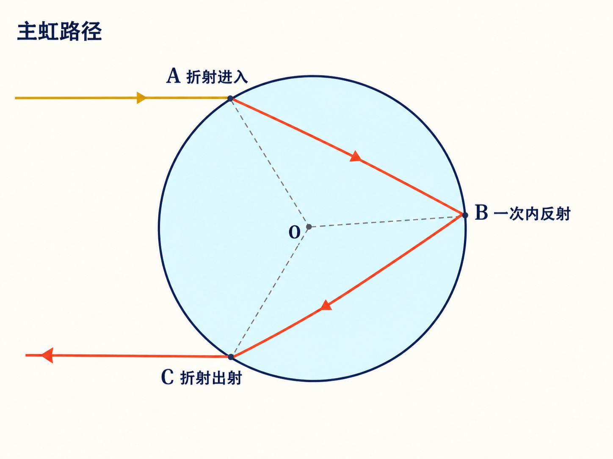
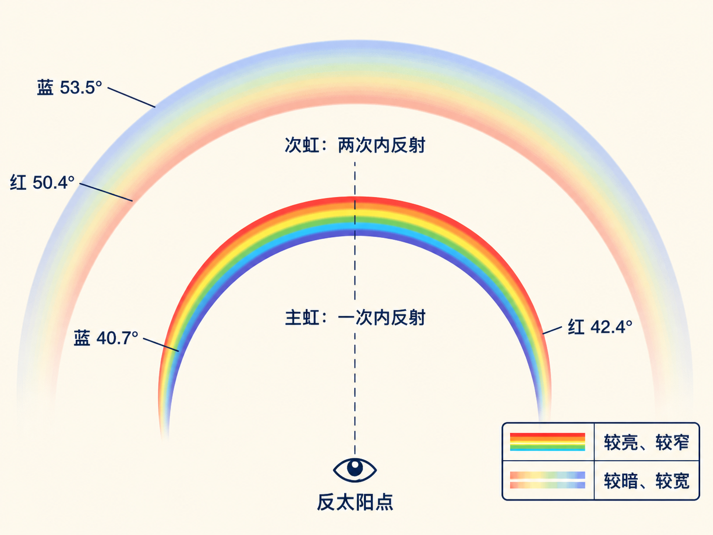

# 彩虹：为什么红在外、蓝在内

几乎每个人都看过彩虹。但下一次彩虹出现时，你能不能不靠猜，立刻说出红色在哪一侧、虹内和虹外哪边更亮、第二道虹应该去哪里找？如果拿出一片线偏振片，你又能不能让整道虹显著变暗？

“看过”只说明光进过眼睛；“看见”意味着你知道该观察什么，也能解释为什么只能看到这样的结构。彩虹正适合检验这两者的差别，因为它的颜色、位置、宽度、明暗和偏振，其实都被一滴水里的同一条光路约束着。

读完这篇，你会知道

- 为什么主虹的红色在外、蓝色在内，角半径约为 $42^\circ$
- 为什么虹内较亮、虹外较暗，以及虹弧为什么有时长、有时短
- 次虹为什么更靠外、颜色反转，而且更宽、更暗
- 小水滴怎样带来多余虹、白虹和云影彩色环，冰晶又怎样形成天空中的晕
- 为什么彩虹几乎完全线偏振，而且偏振方向沿虹弧切线

## 先别找颜色，先找彩虹的圆心

太阳在你身后，雨滴在你面前，这是看到普通彩虹的基本位置关系。更准确地说，太阳必须能够照到你前方的雨滴；如果你和雨滴之间的降雨把阳光挡住，水滴就无法完成接下来的光路。

低头看自己头部影子所在的方向。从眼睛指向头影的直线，就是背向太阳的参考轴。彩虹不是随意挂在天空中的弧，它属于一个以这条轴为中心的圆：主虹红色外缘离这条轴约 $42.4^\circ$，蓝色边缘略向内，在约 $40.7^\circ$。

因此，真正的问题不是“天空为什么画出了一条彩带”，而是“为什么雨滴只会在离反太阳方向约 $42^\circ$ 的位置，把某些颜色送进你的眼睛”。答案要从一颗水滴开始。

## 一颗水滴里的三步光路

把水滴看成一个球。取一束窄太阳光，让它在 A 点射入水滴。入射角记作 $i$，折射角记作 $r$；两个角都相对于界面法线测量，而球面在该点的法线穿过水滴圆心。

形成主虹的光依次经历三步：

1. 在 A 点从空气折射进入水中；
2. 到达 B 点后，在水滴内部反射一次；
3. 到达 C 点后，从水中折射回空气。

光进来时沿一个方向，出来时已经转向。把入射方向与最终出射方向之间的偏折角记作 $\Delta$，水滴中的几何关系给出

$\Delta=180^\circ+2i-4r$。

式中的两个 $i$ 来自入射和出射两端，四个 $r$ 来自水滴内部相应的几何角。$r$ 不是独立选择的；给定 $i$ 后，它由斯涅耳定律决定。因此，太阳照亮整个水滴时，$i$ 可以从 $0^\circ$ 变化到 $90^\circ$，每一个 $i$ 都对应一个 $r$，也对应一个 $\Delta$。

取水的折射率为 $1.336$ 做这组计算，会发现一个关键现象：$i=0^\circ$ 时，$\Delta=180^\circ$；随着 $i$ 增大，$\Delta$ 先减小，在约 $138^\circ$ 处达到最小值，然后再增大。把返回光相对反太阳轴的角度记作 $\phi$，这个最小偏折对应 $\phi$ 的最大值，约为 $42^\circ$。

这里不需要把水滴想成只会发出一条线。水滴是球形的，整条 A—B—C 光路可以绕入射轴旋转，因而具有轴对称性。一次内反射后出射的光围成一个圆锥，半顶角的最大值约为 $42^\circ$。对这条主虹路径来说，$\phi$ 大于这个极限时，没有光能沿那个方向返回。

## 色散把一个极限角拆成一圈颜色

水对不同颜色的折射率略有不同。红光的折射率约为 $1.331$，对应的最大圆锥半顶角约为 $42.4^\circ$；蓝光的折射率约为 $1.343$，对应约 $40.7^\circ$。紫光较难被眼睛看清，因此这里用蓝光代表短波端来讨论。

现在沿圆锥外缘向内看：

- 在 $42.4^\circ$ 的最外缘，红光可以到达，蓝光却不能，因为蓝光的极限只有 $40.7^\circ$；
- 角度逐渐减小时，其他颜色依次加入；
- 到 $40.7^\circ$ 以内，红、黄、绿、蓝等颜色都能沿这类路径返回，叠加后被眼睛判断为白光；
- 在红色外缘之外，这条 A—B—C 主虹路径不能送回光，所以那里较暗。

这四步同时解释了三件事：主虹为什么红色在外、蓝色在内；为什么虹内有额外的白光，显得较亮；以及为什么虹外显得较暗。这里的“无光”只针对正在讨论的主虹光路，不是说空气中不存在任何其他来源的散射光。

如果在一颗水滴的返回光前放一块屏幕，屏上会出现圆锥的截线：外缘为红色，向内逐渐加入其他颜色，更内侧为白光，红色外侧则较暗。真正的天空彩虹，只是把这一几何关系分配给了无数颗雨滴。

## 无数水滴，为什么只拼出一条弧

每颗被太阳照到的雨滴都能把光送向许多方向，但你的眼睛只接收恰好朝向你的那一小部分。位于反太阳轴周围 $42.4^\circ$ 方向上的雨滴，会把红光送进你的眼睛；稍靠内的一组雨滴形成蓝色内缘；再靠内时，多种颜色叠加成白光。

所以，你眼中的每一种颜色其实来自不同的一组雨滴。天空中无数水滴按观察角筛选后，才共同拼出一条以反太阳轴为中心的圆弧。换一个观察者，眼睛位置改变，满足条件的雨滴也会改变；每个人看到的是属于自己位置的彩虹。

太阳接近地平线时，反太阳点也接近地平线，$42^\circ$ 的圆大部分露在天空中，虹弧看起来很高。太阳逐渐升高，圆心向地平线下移，露出的虹弧越来越低、越来越短。太阳升到地平线上方约 $42^\circ$ 后，远处雨幕形成的主虹就落到地平线以下，通常看不到了。

这也解释了方向和时段。清晨太阳在东，虹在西；傍晚太阳在西，虹在东。太阳要低，同时前方还要有被照亮的水滴，所以清晨和傍晚比正午更有利。虹弧的实际长度还取决于哪里有雨：即使几何圆还在，缺少水滴的部分也不会发光。

近处喷雾可以突破“看不到”的地平线限制。晴天用花园水管把水喷到脚边，水滴就在观察者附近，完整圆的一部分甚至可以环绕脚边出现。此时不管虹落在远处天空的哪一部分，决定颜色位置的仍是相对于头影方向的约 $42^\circ$。

## 多一次内反射，色序就会翻转

主虹路径在水滴内反射一次。如果光到达 C 点后不立即射出，而是再反射一次，最后从 D 点出射，就得到次虹（也称副虹）路径。多一次内反射改变了出射几何，也把颜色顺序倒了过来。

主虹中，红光约在 $42.4^\circ$，蓝光约在 $40.7^\circ$，所以红外蓝内。次虹中，红光约在 $50.4^\circ$，蓝光约在 $53.5^\circ$，所以红色在内、蓝色在外。蓝光角在课堂口述中先被说成 $52.5^\circ$，随即改口为 $53.5^\circ$；这里采用改口后的数值。

次虹因此位于主虹外侧，大约再向外找 $10^\circ$。它比主虹暗，也比主虹宽：主虹红蓝极限相差约 $1.7^\circ$，次虹的红蓝间隔超过 $3^\circ$。若再考虑太阳不是点光源，而在天空中有约 $0.5^\circ$ 的角直径，每个太阳表面点都会形成略微错开的虹，主虹实际宽度更接近 $2^\circ$ 到 $2.2^\circ$，次虹约为 $3.5^\circ$。

这给出一套直接的观察顺序：先确认主虹红外蓝内，再向外约 $10^\circ$ 找较暗、较宽的次虹；若找到，检查它是否红内蓝外。暗背景会让次虹更容易辨认。牛顿画出的光路、花园水管制造的人工双虹，以及真实天空中的双虹照片，都可以用同一组反射次数和色序来检查。即使一幅古画很漂亮，只要把主虹画成红内蓝外，它的光学顺序就是错的。

## 雨滴继续变小，斯涅耳定律不再是全部

普通主虹和次虹的骨架来自折射与内反射。但当水滴很小，波的衍射与干涉会变得明显，斯涅耳定律本身不足以描述全部图样。

当水滴小于约 $0.1\,\text{mm}$ 时，虹带附近可能出现相消干涉形成的暗带，课堂把这类结构称为多余虹。水滴若进一步小到约 $50\,\mu\text{m}$ 或更小，不同颜色会更强地彼此重叠，彩色外观逐渐洗成白色，于是形成带暗带的白虹。接近北极、太阳在夏季凌晨仍高于地平线的照片中，就能同时看到白虹和多余虹。

这组现象提醒我们：看到“弧”或“彩色环”时，不能一律用普通彩虹的单滴几何解释。成因不同，角度、颜色和观察位置也会不同。

## 不是所有天空光环都是彩虹

太阳或月亮周围常见的 $22^\circ$ 晕与水滴彩虹不同，它来自大气高处的冰晶。高空即使在夏季也很冷，因此这种晕四季都可能出现。朝太阳方向看不方便，所以月亮周围的 $22^\circ$ 晕更容易被留意。$46^\circ$ 晕则罕见得多。晕的两侧还可能出现亮弧或亮斑，称为幻日或“假太阳”，同样与高空冰晶有关。

飞机飞到云层上方时，若看到飞机影子落在云面上，影子周围可能出现一圈或多圈彩色光环（glory）。观察者总在圆环中心；这种光环来自很细小水滴造成的衍射，不是普通彩虹所用的折射—内反射路径。它的定量解释并不容易。水滴越小，光环半径越大；飞机经过不同云区时，水滴大小改变，圆环半径可以在几秒到几分钟内明显变化。

雾本质上也是由细小水滴组成的云。车灯或低太阳把人的影子投到雾墙上时，头影周围也可能出现与光环相似的结构；课堂随后称它为 fogbow，并引出德语 Heiligenschein。在高加索一座 6 米望远镜旁，傍晚从山谷涌起的雾墙只留下约 30 秒到 1 分钟的合适拍摄窗口：太阳要仍能照到人，影子要落在雾上，相机还必须位于光环中心。一旦雾吞没观察者，太阳光被挡，图样也就消失。

## 彩虹为什么几乎完全偏振

还剩最后三个问题：彩虹是否偏振、沿什么方向偏振、偏振有多强。

形成主虹关键边缘的极限光线，对应 $\Delta$ 约为 $138^\circ$ 的极小值。此时入射角 $i$ 约为 $60^\circ$，水滴内的折射角 $r$ 约为 $40^\circ$。关键的内部反射发生在水到空气的界面。对这个界面，Brewster 角满足

$\tan\theta_\mathrm{B}=\frac{n_2}{n_1}=\frac{1}{1.33}$，

所以 $\theta_\mathrm{B}$ 约为 $37^\circ$。主虹关键光线在水滴内的约 $40^\circ$ 入射角，只比 Brewster 角大约 $3^\circ$。正因为两者很接近，内部反射后留下的光几乎完全沿垂直于入射面的方向偏振，偏振度接近百分之百。

每颗水滴的入射面方向不同，但整套几何绕反太阳轴旋转。把所有水滴的结果拼成圆弧后，局部偏振方向处处沿虹弧切线。因此，线偏振片在一个方向上能让虹通过；把它旋转 $90^\circ$，虹会显著变暗，甚至几乎消失。虹内那部分由同一路径返回的白光也具有偏振，所以旋转偏振片时，颜色和白光会一起变暗。

这并不只是板书结论。海边浪花升起的瞬间，会在离头影约 $42^\circ$ 的方向出现短暂彩虹；戴着方向不合适的偏振太阳镜，可能什么也看不到，摘下眼镜却立即看见。眼镜不是让彩虹消失了，而是挡住了它主要的偏振分量。

## 用一滴水，把整道彩虹放到屏幕上

最后可以把问题缩回一颗水滴。让强光照到一滴水，再把返回光投到屏幕上，会看到一段弧：红色在外、蓝色在内、内侧有白光。屏上曲线只是返回光锥与屏幕的交线，因此观察距离改变时，弧看起来会变大或变小；它不是天空中的完整彩虹，却保留了色序、内外明暗和偏振这些关键要素。

光打到屏幕再返回眼睛后，原有的偏振方向不再保留，因此观众手里的偏振片不能直接检验水滴出射时的偏振。若在光到达屏幕前转动演示用偏振片，就能看到弧和内部白光一起由亮变暗。这一步把 Brewster 角的推理变成了肉眼可见的结果。

下一次看到彩虹，不妨按同一条线索观察：太阳在身后，头影给出圆心；主虹约在 $42^\circ$，红外蓝内；虹内较亮、虹外较暗；再向外寻找颜色反转的次虹；最后用线偏振片检验沿弧切向的偏振。那时你看到的就不只是一条漂亮的彩带，而是一颗水滴如何用折射、反射、色散和偏振，把自己的几何写到整片天空上。
