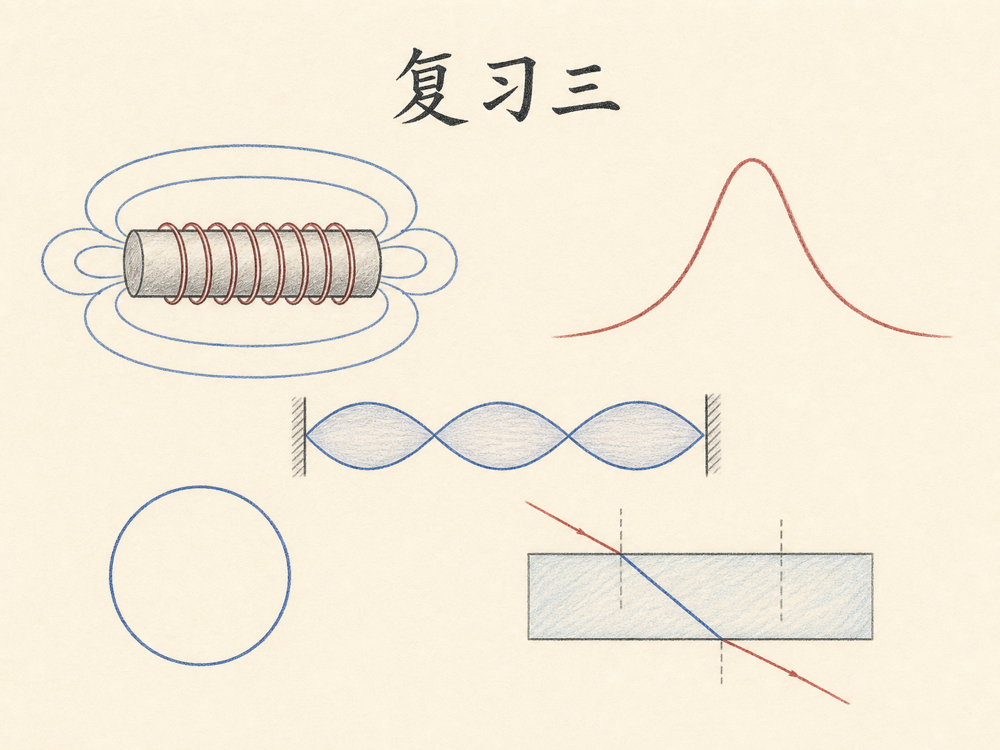
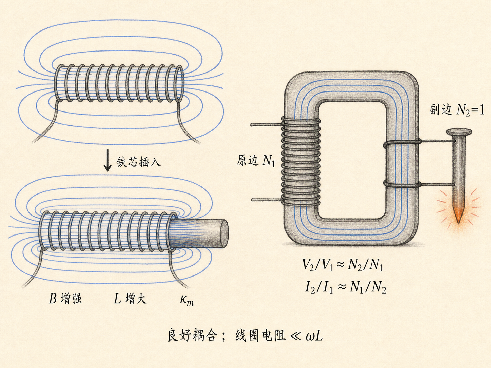
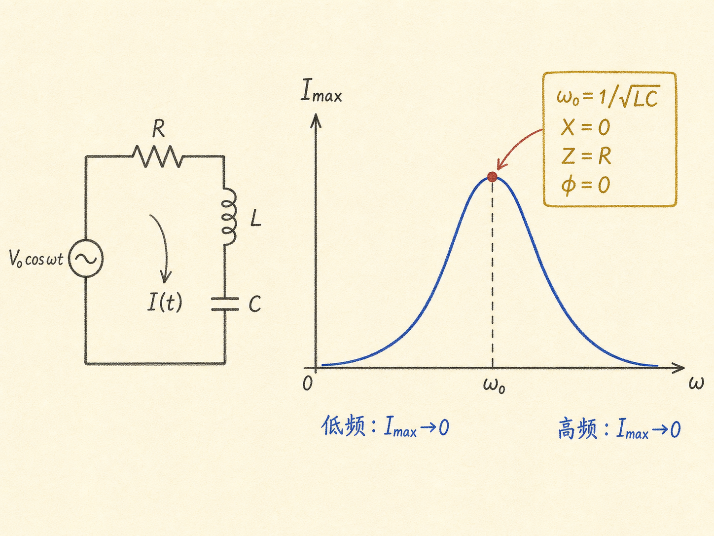
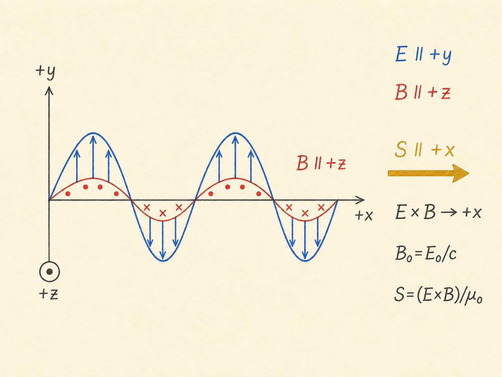
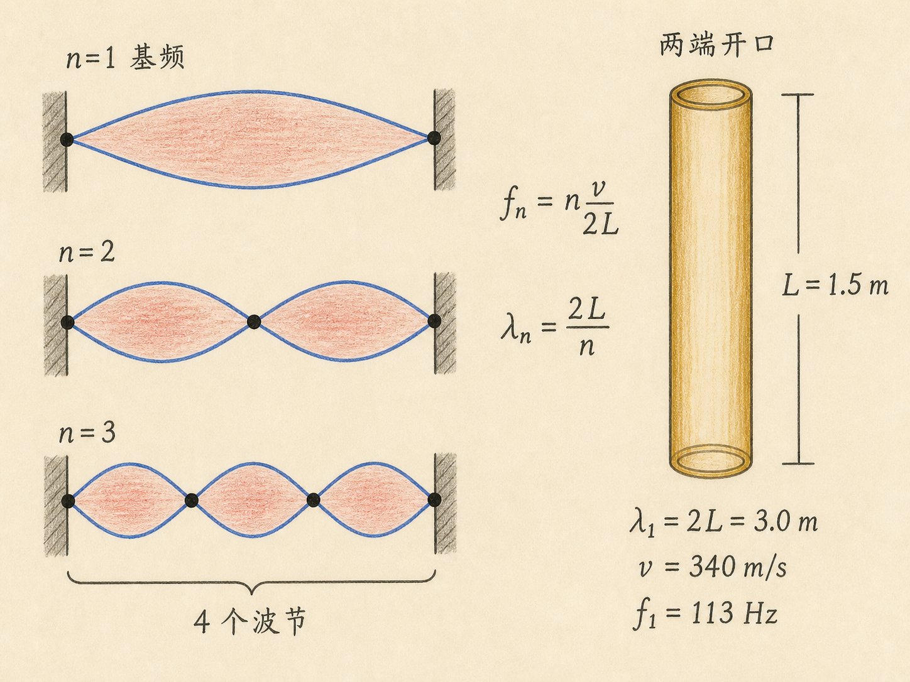
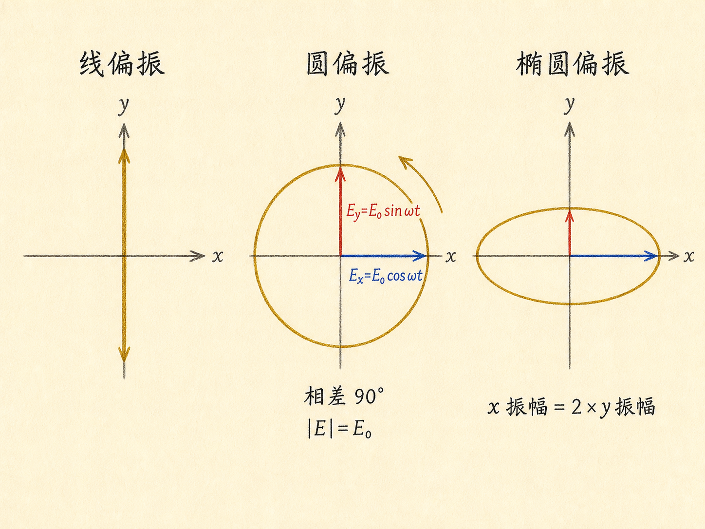
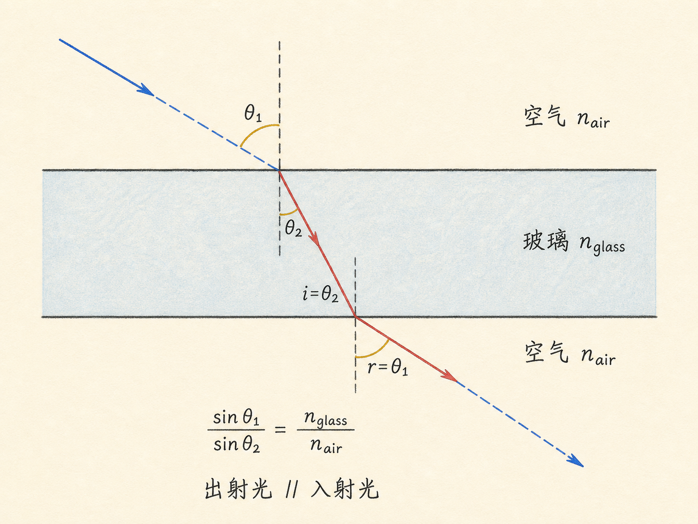

# 从磁芯到斯涅耳定律：电磁学复习三

一堂复习课最容易给人一种错觉：只要把公式重新抄一遍，知识就重新装回脑子里了。但真正面对问题时，决定你能不能选对公式的，往往不是记忆，而是能否看出条件——这是稳态还是暂态？是真空还是物质？讨论的是波的传播速度，还是介质粒子的运动速度？界面是平行的，还是像棱镜那样不平行？

这次复习从磁性材料一路讲到斯涅耳定律，中间跨过变压器、RLC 谐振、行波、驻波、电磁波与偏振。主题很多，但主线一致：每一个简洁关系式背后，都有方向、边界和近似条件。

读完这篇，你会知道

- 铁芯为什么能同时增强螺线管磁场和自感，温度又怎样破坏这种效果
- 变压器的电压比与电流比为什么只是有条件成立的近似
- 串联 RLC 电路为什么只在谐振时取得最大电流与最大平均功率
- 怎样区分行波的传播、介质粒子的振动，以及电磁波中 $\mathbf E$、$\mathbf B$ 和能流的方向
- 驻波、偏振和平行玻璃板折射分别由什么结构决定

## 磁性材料：外场、温度与铁芯同时在起作用

磁性材料可以分为抗磁性、顺磁性和铁磁性材料。顺磁性与铁磁性材料的原子或分子具有内禀磁偶极矩，这些磁矩是玻尔磁子的整数倍。它们会试图沿外加磁场排列，但热运动也在不断打乱这种排列。

因此，排列程度同时取决于外场强度和温度。外场越强，排列越充分；温度越低，越容易克服热运动。铁磁性材料一旦高于居里温度，就会失去铁磁性质，转变为顺磁性。课堂演示过这种温度造成的变化。

考虑一个长螺线管：匝数为 $N$，长度为 $L$，电流为 $I$。用安培定律可以得到没有磁芯时的近似磁场

$$
B_{\mathrm{vac}}\approx\mu_0\frac{NI}{L}.
$$

这里把它叫作“真空场”，意思是线圈本身在没有铁磁芯时产生的场。放入铁磁性材料后，磁场要乘上相对磁导率因子 $\kappa_m$。这个因子可以是 $10$、$100$，甚至 $1000$ 或更大，所以磁场会显著增强。

自感也随之改变。自感按磁通量与电流之比定义；同一电流下，磁场增强 $\kappa_m$ 倍，磁通量也随之增强，自感便增大。把铁芯逐渐插入螺线管时，自感会上升；将铁芯拉出，自感又会下降。若磁路中留有空气隙，问题还需要同时考虑铁芯与气隙，这也是相关作业要求复习的情形。

## 变压器：匝数比很简单，做到它却不简单

变压器用铁磁性材料构成闭合磁路，让原边与副边尽量共享磁通。原边有 $N_1$ 匝、自感 $L_1$，电压为 $V_1$；副边有 $N_2$ 匝、自感 $L_2$，电压为 $V_2$。耦合足够好时，法拉第定律给出近似关系

$$
\frac{V_2}{V_1}\approx\frac{N_2}{N_1}.
$$

$N_2>N_1$ 时升压，$N_2<N_1$ 时降压。但这只是第一层。若还要进一步写出电流比，就必须假设原边输入的时间平均功率几乎全部传到副边：

$$
\langle V_1I_1\rangle\approx\langle V_2I_2\rangle,
\qquad
\frac{I_2}{I_1}\approx\frac{N_1}{N_2}.
$$

这种接近百分之百的功率传递是很特殊的近似。线圈电阻必须远小于 $\omega L$，耦合也必须足够好。课堂演示把副边做成一匝，原边约有几百匝、也可能接近一千匝，使副边电流接近 $1000\,\mathrm A$，大到足以熔化铁钉。实验装置必须把电阻压到远小于 $\omega L$，才可能逼近理想关系。

## RLC 稳态：频率决定电容和电感谁占上风

现在把电阻 $R$、理想电感 $L$ 和电容 $C$ 串联，驱动电压取为

$$
V(t)=V_0\cos\omega t.
$$

这里讨论的是接通一段时间后的稳态，而不是刚接通时的暂态。稳态电流为

$$
I(t)=\frac{V_0}{\sqrt{R^2+\left(\omega L-\frac{1}{\omega C}\right)^2}}
\cos(\omega t-\phi),
$$

相位满足

$$
\tan\phi=\frac{\omega L-1/(\omega C)}{R}.
$$

把

$$
X=\omega L-\frac{1}{\omega C}
$$

称为电抗，把

$$
Z=\sqrt{R^2+X^2}
$$

称为阻抗，两者的单位都是欧姆。电流最大值便是 $I_{\max}=V_0/Z$。

低频时，$1/(\omega C)$ 很大，阻抗趋于无穷，电流趋于零；高频时，$\omega L$ 很大，阻抗同样趋于无穷，电流再次趋于零。所以 $I_{\max}$ 随频率变化时，中间会出现一个峰，这就是谐振曲线。

峰值发生在电抗为零的时候：

$$
\omega_0L=\frac{1}{\omega_0C},
\qquad
\omega_0=\frac{1}{\sqrt{LC}}.
$$

此时 $\phi=0$，电流与驱动电压同相，阻抗只剩 $R$，因此

$$
I_{\max}=\frac{V_0}{R}.
$$

所谓“电感与电容彼此抵消”，是指它们在电抗中的两项大小相等、符号相反；电路在输入端的稳态响应因此像只剩下电阻。

课堂数值表把这个峰展示得很直接。比谐振频率低 $10\%$ 时，电容项较大，$X=-86\,\Omega$；若 $R=10\,\Omega$，阻抗约为 $87\,\Omega$，最大电流约 $0.1\,\mathrm A$。谐振时，取 $V_0=10\,\mathrm V$、$R=10\,\Omega$，最大电流正好是 $1\,\mathrm A$。比谐振频率高 $10\%$ 时，电感项较大，最大电流又下降到约 $1/8\,\mathrm A$。

## 平均功率：最大值为什么也出现在谐振点

电源的瞬时功率是电压与电流的乘积：

$$
P(t)=V_0\cos\omega t\,\frac{V_0}{Z}\cos(\omega t-\phi).
$$

用 $\cos(\alpha-\beta)=\cos\alpha\cos\beta+\sin\alpha\sin\beta$ 展开。一个周期内，$\cos\omega t\sin\omega t$ 的平均值为零，$\cos^2\omega t$ 的平均值为 $1/2$，于是

$$
\langle P\rangle=\frac{V_0^2}{2Z}\cos\phi.
$$

又因为 $\cos\phi=R/Z$，所以

$$
\langle P\rangle=\frac{V_0^2R}{2Z^2}.
$$

谐振时 $Z=R$，平均功率达到

$$
\langle P\rangle_{\max}=\frac{V_0^2}{2R}.
$$

任何其他频率下都有 $Z>R$，平均功率都会更低。最大电流与最大平均功率落在同一个谐振点，不是两个独立结论，而是同一个条件 $X=0$ 的结果。

## 行波：传播的是扰动，不是弦上的粒子

弦沿 $y$ 方向振动，波沿 $x$ 方向传播，可以写成

$$
y(x,t)=y_0\cos(kx-\omega t).
$$

$kx-\omega t$ 表示波沿 $+x$ 方向传播。波数、角频率、周期和传播速度满足

$$
k=\frac{2\pi}{\lambda},
\qquad
\omega=2\pi f=\frac{2\pi}{T},
\qquad
v=\frac{\omega}{k},
\qquad
\lambda=vT.
$$

需要特别区分两种速度。波形以 $v$ 沿 $x$ 方向移动，但弦上的粒子只沿 $y$ 方向上下振动。某个固定位置上粒子的横向速度是 $\partial y/\partial t$，不是波的传播速度 $v$。课堂用水波作了同样的提醒：看到波向前走，并不等于介质中的每个粒子也跟着波峰一路向前。

## 电磁行波：用 $\mathbf E\times\mathbf B$ 锁定方向

真空中的平面电磁波若沿 $+x$ 传播、电场沿 $y$，可以写成

$$
\mathbf E=E_0\hat{\mathbf y}\cos(kx-\omega t).
$$

传播速度是

$$
c=\frac{\omega}{k}=\frac{1}{\sqrt{\varepsilon_0\mu_0}}.
$$

磁场必须同时垂直于传播方向和电场，并满足 $B_0=E_0/c$。采用右手坐标系 $\hat{\mathbf x}\times\hat{\mathbf y}=\hat{\mathbf z}$，还要让 $\mathbf E\times\mathbf B$ 指向 $+x$。在这组约定下，磁场为

$$
\mathbf B=\frac{E_0}{c}\hat{\mathbf z}\cos(kx-\omega t).
$$

能量流由坡印廷矢量表示：

$$
\mathbf S=\frac{\mathbf E\times\mathbf B}{\mu_0}.
$$

它的方向就是波传播与能量输运的方向。两个场含有同相的余弦因子，时间平均后 $\cos^2$ 给出 $1/2$，所以真空中

$$
\langle S\rangle
=\frac{E_0B_0}{2\mu_0}
=\frac{E_0^2}{2\mu_0c}.
$$

## 从真空进入物质：速度与折射率会随频率变

进入介质后，把 $\varepsilon_0$ 换成 $\kappa\varepsilon_0$，把 $\mu_0$ 换成 $\kappa_m\mu_0$。于是波速变为

$$
v=\frac{1}{\sqrt{\varepsilon_0\mu_0\kappa\kappa_m}},
$$

而场振幅关系变为 $B_0=E_0/v$。对顺磁性与抗磁性材料，$\kappa_m$ 在实际讨论中近似为 $1$；铁磁性材料才需要特别注意它。

介电常数 $\kappa$ 可能强烈依赖频率。水在低频以及 $100\,\mathrm{MHz}$ 无线电频率下的 $\kappa$ 约为 $80$，到了频率为几乘以 $10^{14}\,\mathrm{Hz}$ 的可见光范围则约为 $1.77$。折射率定义为 $n=c/v$，所以它也会随频率变化。水的折射率大约为 $1.3$，红光与蓝光略有不同，这一差别使彩虹成为可能。

## 驻波：时间与空间分开，波节固定不动

两端固定、长度为 $L$ 的弦只能在离散频率上形成驻波。第 $n$ 个谐波满足

$$
f_n=\frac{nv}{2L},
\qquad
\lambda_n=\frac{2L}{n},
\qquad n=1,2,3,\ldots
$$

$n=1$ 是基频，也叫第一谐波；$n=2$ 是第二谐波；之后还有第三谐波等。基频可以写成

$$
y_1(x,t)=y_{01}\cos(\omega_1t)\sin(k_1x).
$$

它与行波的关键差别是：时间因子 $\cos(\omega_1t)$ 和空间因子 $\sin(k_1x)$ 分开了。某些位置的正弦项永远为零，这些不动点就是波节。两端 $x=0$ 与 $x=L$ 都是波节；更高谐波还会增加内部波节，并且 $\omega_2=2\omega_1$、$\omega_3=3\omega_1$。

课堂用橡胶管演示第三谐波。把振动频率调到谐振附近，再用频率略有差别的频闪灯照明，快速运动看起来像慢动作。中间一段向下时，左右两段向上，随后反过来；第三谐波一共能看到四个波节：两端各一个，中间两个。再加一盏略有不同频率的频闪灯，红色和绿色会显示弦在不同时间的形状。这个展示方法来自一位在 MIT 高级视觉研究中心工作的艺术家 Sai，他用杆和弦的谐振运动创作艺术。

## 空气柱与电磁场也能形成驻波

两端开口的空气柱与弦使用相同的谐振频率关系。差别在于，弦的传播速度可以通过材料与张力改变；空气柱中的 $v$ 是声速，室温下约为 $340\,\mathrm{m/s}$。一根两端开口、长 $1.5\,\mathrm m$ 的管子，基频约为 $113\,\mathrm{Hz}$。

谐振有时会由看似普通的气流激发。课堂先提到风使系统进入破坏性谐振的塔科马大桥，再演示一张铜网：加热时气流穿过铜网，移走热源后，铜网冷却过程中会激发空气柱的 $113\,\mathrm{Hz}$ 谐振。加热时间过长会熔化铜网，太短又不能激发谐振，所以演示需要把握时间。

电磁场同样能形成驻波。电磁驻波中也有波节，即电场始终为零的位置；时间部分与空间部分仍然分离。与弦相比，较难的一步是求与驻波电场相伴的磁场，课程把这部分留给习题 9-4 复习。

## 偏振：看的是电场矢量怎样运动

如果波朝观察者传播，而电场矢量始终沿一条直线来回振动，这就是线偏振。无论是课堂使用的 $75\,\mathrm{MHz}$ 无线电波，还是可见光，只要电场方向限制在一条直线上，都属于线偏振电磁辐射。

圆偏振可以由两个互相垂直、振幅相同、频率相同且相差 $90^\circ$ 的分量组成：

$$
E_x=E_0\cos\omega t,
\qquad
E_y=E_0\sin\omega t.
$$

合电场大小为

$$
|\mathbf E|=\sqrt{E_x^2+E_y^2}=E_0,
$$

因为 $\sin^2\omega t+\cos^2\omega t=1$。它的大小不变，方向连续旋转；旋转方向由相位差的安排决定。若把其中一个分量的振幅改成另一个的两倍，电场矢量的端点不再画圆，而是画椭圆，这就是椭圆偏振。

## 平行玻璃板：折射两次后方向恢复

光从折射率 $n_1$ 的介质进入折射率 $n_2$ 的介质。入射角为 $\theta_1$，折射角为 $\theta_2$，两个角都相对于界面法线测量。斯涅耳定律是

$$
\frac{\sin\theta_1}{\sin\theta_2}=\frac{n_2}{n_1}.
$$

如果 $n_2>n_1$，那么 $\theta_2<\theta_1$。课堂上先把折射率比说反，随即当场纠正；使用关系式时必须保留纠正后的次序。

现在让光从空气进入一块两面平行的玻璃板，再从玻璃回到空气。第一个界面 $A$ 满足

$$
\frac{\sin\theta_1}{\sin\theta_2}
=\frac{n_{\mathrm{glass}}}{n_{\mathrm{air}}}.
$$

第二个界面 $B$ 的入射角 $i$ 就是 $\theta_2$，并满足

$$
\frac{\sin i}{\sin r}
=\frac{n_{\mathrm{air}}}{n_{\mathrm{glass}}}.
$$

两式相乘，折射率完全约去，又因为 $i=\theta_2$，最终得到 $r=\theta_1$。所以光穿过平行玻璃板后，出射方向与入射方向平行。即使红光与蓝光的折射率不同，这个方向关系也不变，各种颜色仍沿同一方向射出。若两个界面不平行，例如棱镜，折射率差异便不能这样抵消，不同颜色会沿不同方向分开。全反射则留给习题 9-8 复习。

## 最后的考试提醒也是在考“条件意识”

考试共有五道题：两道各一个小问，两道各两个小问，还有一道包含四个判断题。判断题每答对一项得 $4$ 分，答错扣 $4$ 分，不答则不加不扣。若四项中只有两项能确定，放弃另外两项也是允许的选择。

课堂给了两个判断示例。“Benham 陀螺由几种颜色构成，快速旋转时会看到白光”是错的；它并不由几种颜色构成，旋转时看到的也不是白光。“彗星的两条尾巴中，一条来自辐射压，另一条来自太阳风”则是正确的课堂结论。

做题策略同样直接：每道题至少读两遍；先做自己最喜欢、最适合的题；一道题不要停留超过十分钟，卡住就先转向另一题。之后还有一场三小时的复习课和周日辅导，具体安排会在网站更新。

这堂课把许多内容放到了一张桌面上，但真正值得带走的不是一长串孤立公式。铁芯增强磁场，要问温度与材料；变压器写电流比，要问耦合与电阻；RLC 找峰值，要问是否稳态与是否谐振；波动问题要分清传播、振动和能流方向；折射问题要看两个界面是否平行。公式只有和条件一起记住，才会在真正的问题里起作用。
