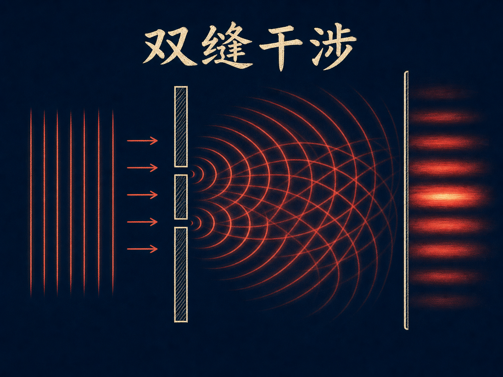
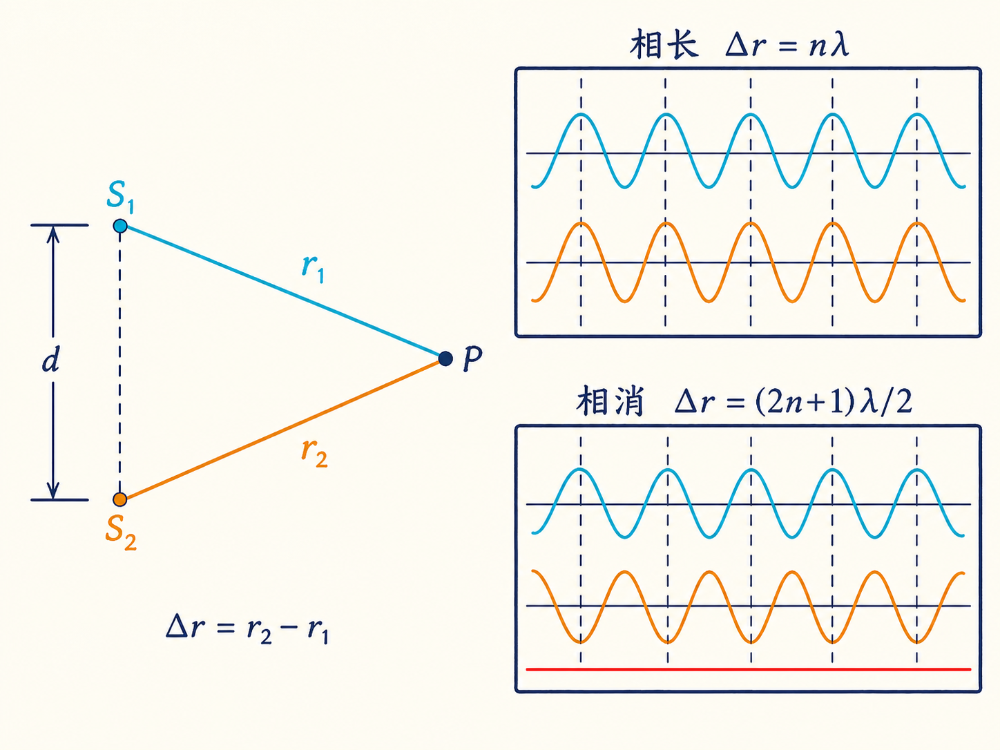
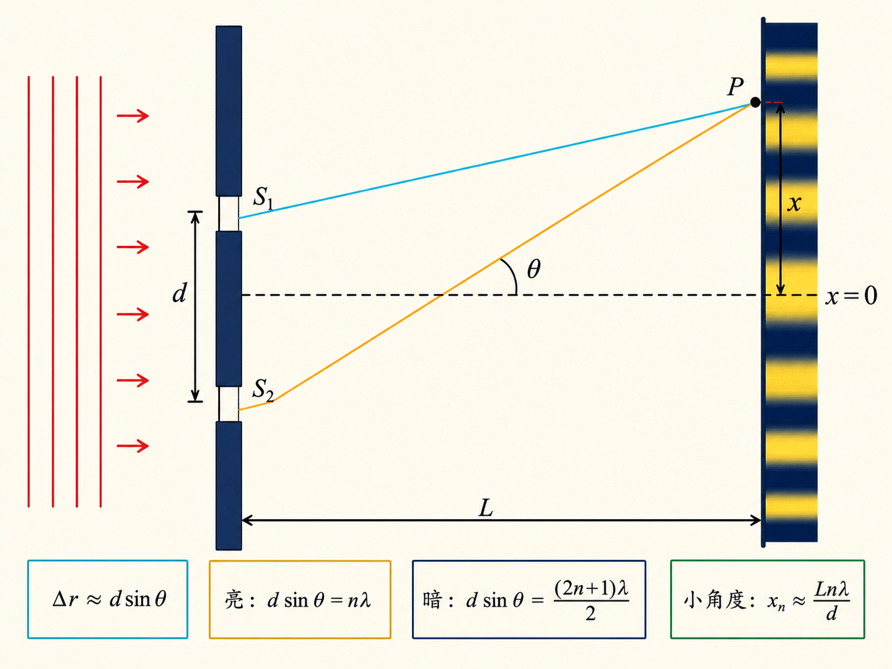
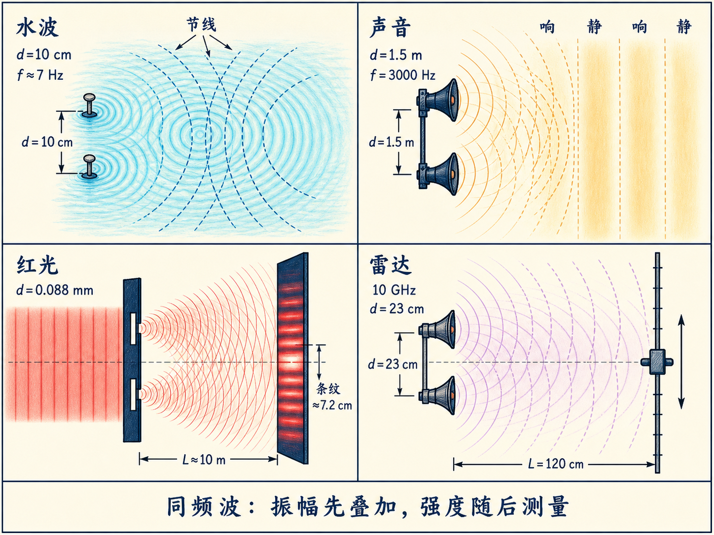
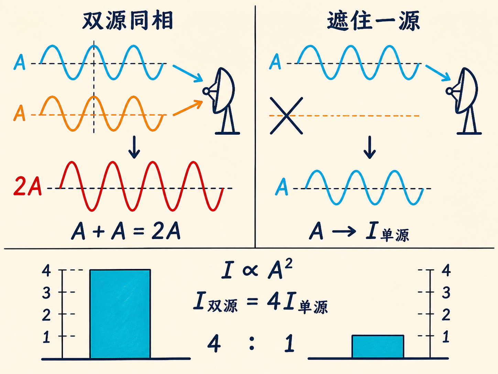

# 双缝干涉：为什么光加光反而会变暗？

两只扬声器一起发声，声音理应更响；两束光叠在一起，屏幕也理应更亮。但只要两列波走过的路程恰好差半个波长，声音加声音可以接近寂静，光加光也可以形成黑暗。减少的不是能量，而是能量在空间中的分布发生了改变。

这个现象把水波、声波、可见光和雷达放进同一套物理关系中。它也是杨在 1801 年用双缝实验说明光具有波动性的关键：只有波才会稳定地产生相长与相消交替的干涉图样。

读完这篇，你会知道

- 两个波源满足什么条件，才能形成稳定的干涉图样？
- 路程差怎样决定某一点是极大还是极小？
- 为什么远场干涉满足 $d\sin\theta=n\lambda$？
- 双缝条纹的间距由哪些量决定，红光、蓝光和白光有何不同？
- 为什么两个同相雷达波叠加后的强度是单个波源的四倍？

## 先把两列波放到同一个点

设两个波源到观察点 $P$ 的距离分别是 $r_1$ 和 $r_2$。如果两列波到达时同相，也就是波峰遇到波峰、波谷遇到波谷，合振幅增大，这叫相长干涉。如果它们到达时相差 $180^\circ$，波峰恰好遇到波谷，合振幅就会减小；在两列波振幅相等的理想情况下，合振幅可以为零，这叫相消干涉。

这种抵消要求两个波源的频率相同。它们不一定从同一初相位出发；初相位不同会移动极大和极小的位置，却不会破坏整幅图样。频率若不同，相位差会随时间漂移，固定的极大和极小便无法保持。

观察点还要离两个波源足够远，才能把两列波的振幅近似看成相同。三维球面波的能量分布在面积随 $r^2$ 增长的球面上，而能量与振幅平方成正比，所以振幅按 $1/r$ 衰减。水面波在二维表面上传播，能量分布在周长随 $r$ 增长的圆周上，因此振幅按 $1/\sqrt r$ 衰减。离某一个波源太近时，两列波振幅差得太多，即使反相也不能完全抵消。

## 路程差就是相位差的尺子

两列同频波的路程差记作

$\Delta r=r_2-r_1$。

多走一个完整波长，波的相位多转一整圈，到达时仍然同相。因此相长干涉的条件是

$\Delta r=n\lambda,\qquad n=0,\pm1,\pm2,\ldots$

多走半个波长，波的相位多转半圈，到达时恰好反相。相消干涉的条件是

$\Delta r=\frac{(2n+1)\lambda}{2},\qquad n=0,\pm1,\pm2,\ldots$

到两个固定点的距离差为常数，在二维中对应双曲线。因此，相长和相消的位置会形成一族交替的双曲线。相消的线叫节线，相长的线可称为波腹线或极大线。推广到三维，这些线绕两波源连线旋转，成为节面与极大面；两个同相波源的垂直平分面上始终有 $r_2-r_1=0$，所以它是中央极大面。

沿两个波源的连线观察，相邻极大线之间的距离是 $\lambda/2$，相邻极小线之间也是 $\lambda/2$。若波源间距为 $d$，能够出现的极大线或极大面数量大致为 $2d/\lambda$。增大 $d$ 或缩短 $\lambda$，都能容纳更多极大与极小。

## 水面把节线直接画了出来

水槽里的两个拍子相距 10 厘米，以约 7 Hz 的相同频率同相拍打水面。水面上出现多条几乎不动的节线，夹在其间的区域则上下起伏。离拍子足够远时，两列波振幅接近；在极大位置，合振幅接近单个波振幅的两倍，在节线上则接近零。

这些节线不是直线，而是双曲线。靠近其中一个拍子时，来自近处波源的振幅更大，所以水面无法严格静止。这正好把“相差 $180^\circ$”与“振幅相等”这两个完全抵消的条件区分开来。

一只落在池塘里的蝴蝶也会在水面激起向外扩散的圆环。圆环投影在池底形成明暗纹理，同时振幅随距离按 $1/\sqrt r$ 减小。若想用两只蝴蝶形成稳定干涉图样，两组波纹还必须拥有完全相同的频率；自然拍动很难提供这种保证。

## 远处看，双曲线变成一个方向

现在把观察点放得很远，远到双曲线逐渐逼近它的渐近线。两个波源相距 $d$，观察方向与中央垂线的夹角为 $\theta$。在远场几何中，两条传播路径的差近似为

$\Delta r=d\sin\theta$。

代入路程差条件，相长干涉的方向满足

$d\sin\theta_n=n\lambda,$

相消干涉的方向满足

$d\sin\theta_n=\frac{(2n+1)\lambda}{2}$。

若在距离波源 $L$ 的位置放一块屏幕，条纹到中央轴的横向距离为 $x$，几何上始终有 $\tan\theta=x/L$。只有在小角度下，才能使用 $\tan\theta\approx\sin\theta$，于是极大位置近似为

$x_n\approx\frac{Ln\lambda}{d},$

极小位置近似为

$x_n\approx\frac{L(2n+1)\lambda}{2d}$。

这两式说明，条纹间距随 $L$ 和 $\lambda$ 增大，随波源间距 $d$ 增大而减小。角度达到几十度时，必须先由 $d\sin\theta=n\lambda$ 求出 $\theta$，再用 $x=L\tan\theta$，不能继续把正切当成正弦。

## 两只扬声器：用头去扫描极小值

声音实验使用两只相距 $d=1.5\,\text m$ 的扬声器，频率为 3000 Hz。取声速约 $340\,\text{m/s}$，波长为

$\lambda=\frac vf\approx\frac{340}{3000}\,\text m\approx0.113\,\text m=11.3\,\text{cm}$。

由 $\sin\theta_n=n\lambda/d$，极大的方向依次是 $0^\circ$、$4.3^\circ$、$8.7^\circ$、$13.1^\circ$；到 $n=10$ 时约为 $49^\circ$。在离扬声器 5、10、15 米的位置，第一极大离中央轴约 38、76、113 厘米，第二极大约为 76、152、228 厘米。极小接近相邻极大的中点，因此从中央极大移动到第一个极小，距离约为 19、38、57 厘米。

听众缓慢移动头部，就能找到声音几乎消失的位置。实验不会像理想计算一样完美，因为墙壁和黑板还会反射声音。另一个实际问题是，两耳间距约 19 厘米：一只耳朵可能处在极大，另一只耳朵已经处在极小，所以寻找极小位置时需要只用一只耳朵判断。

## 杨氏双缝：让两个开口成为同频同相波源

双缝实验的入射光先以平面波照到两个很窄的开口。按照惠更斯的描述，每个开口都成为一个向外发出球面波的次波源。因为两条缝由同一束入射光照亮，两列出射波天然具有相同频率，并且保持确定的初始相位关系。这正是稳定光学干涉所需要的条件。

课堂实验中，两条缝相距 $d=0.088\,\text{mm}$，小于十分之一毫米；照亮它们的激光束直径约 3 毫米。红色激光波长为 6328 埃，其中 $1\,\text{Å}=10^{-10}\,\text m$。屏幕距离约为 10 米。由

$\sin\theta_1=\frac{\lambda}{d}$

得到第一级极大方向约为 $\theta_1=0.41^\circ$，对应屏幕上的第一极大位置约为 $x_1=7.2\,\text{cm}$。因此，相邻亮纹间距约 7.2 厘米，而暗纹位于亮纹之间。暗纹处两列光相差 $180^\circ$，于是出现“光加光得到黑暗”。

实验中各级亮纹的强度并不相等：中央最亮，越往外越弱。把狭缝做得更窄，可以让各极大的强度更接近，但通过的总光量也会减少。这是条纹均匀程度与可见亮度之间的权衡；亮纹强度为何形成这样的包络，将留到下一讲解释。

## 红光、蓝光和白光为什么不同

条纹位置与波长成正比。红光波长较长，亮暗条纹间距较大；蓝光波长较短，间距较小。课堂给出的量级是蓝光约 4500 埃、红光约 6500 埃。两种颜色的中央极大都在 $n=0$ 处重合，但离开中心后，各级极大的位置逐渐分开。

白光同时包含许多波长。每一种颜色都形成自己的干涉图样，一个波长的极小位置不一定是另一个波长的极小位置。各种颜色的亮暗区域叠加后，清晰的黑白条纹很快被冲淡。这也解释了为什么声音演示只选一个频率，激光演示只用近似单一波长：单色或单频条件能让极大和极小的位置保持清楚。

## 10 GHz 雷达仍然服从同一套方程

最后一个实验把可见光换成 10 GHz 电磁波。两个发射器相距 $d=23\,\text{cm}$，波长为 $\lambda=3\,\text{cm}$；接收器放在 $L=120\,\text{cm}$ 处，并可沿横向导轨移动。第一级极大方向约为 $7.5^\circ$，对应横向位置约 15.5 厘米，相邻极大之间仍夹着相消位置。

为了让人耳听见雷达干涉，10 GHz 信号被 1000 Hz 音频调幅。接收器收到电磁波后解调并送入放大器，于是移动接收器时可以直接听到 1000 Hz 声音在极大处增强、在极小处接近消失。

中央位置上，两列同相波的振幅相加，合振幅是单个波源的两倍。强度与振幅平方成正比，所以

$I_{\text{two}}\propto(2A)^2=4A^2=4I_{\text{one}}$。

遮住一个发射器后，强度不是减半，而是降到原来的四分之一。这个结果再次提醒我们：干涉首先叠加的是振幅，探测到的强度才与合振幅的平方相关。

## 把四种波放回同一幅图

水波的静止节线、声音的寂静位置、双缝屏幕上的暗纹，以及雷达接收器听不到 1000 Hz 声音的位置，都是同一件事：两列同频波到达时相差半个奇数波长。相反，路程差为整数个波长时，波峰与波峰相遇，形成极大。

双缝实验的意义不只是一幅漂亮条纹。它把“光是波”变成了可测量的几何关系：给定 $d$、$\lambda$ 和 $L$，就能算出亮暗出现的方向与位置；而屏幕上的实测间距又能反过来检验这套波动描述。
