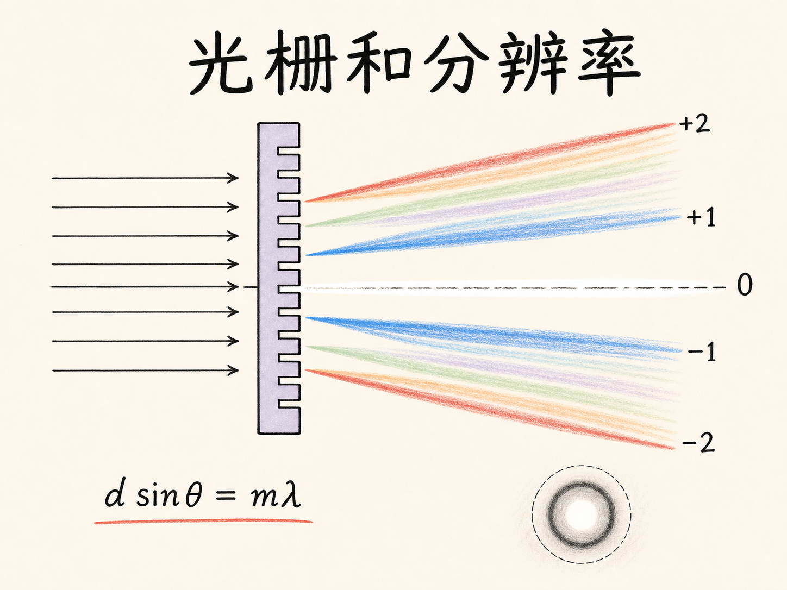
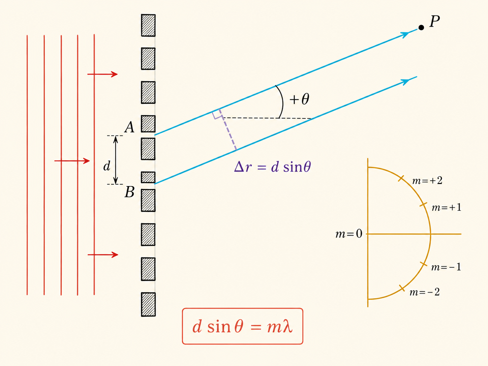
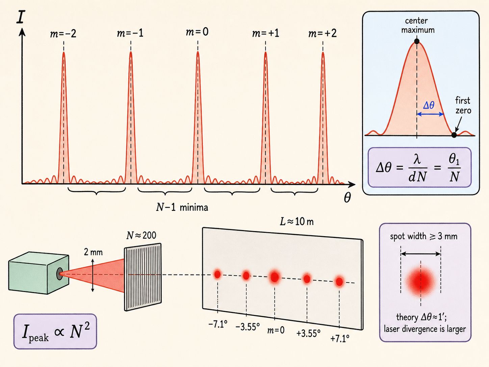
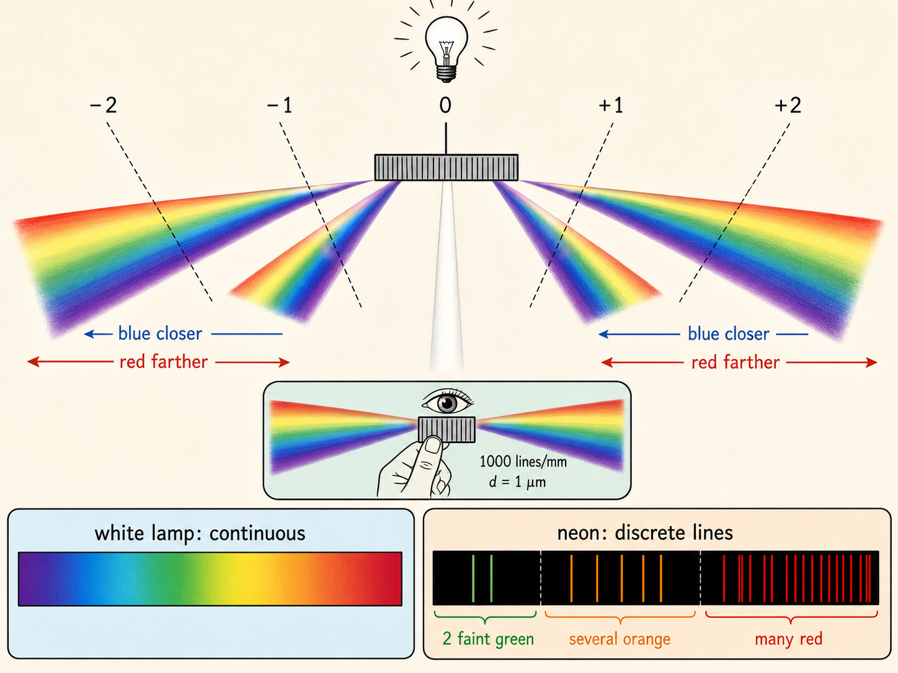
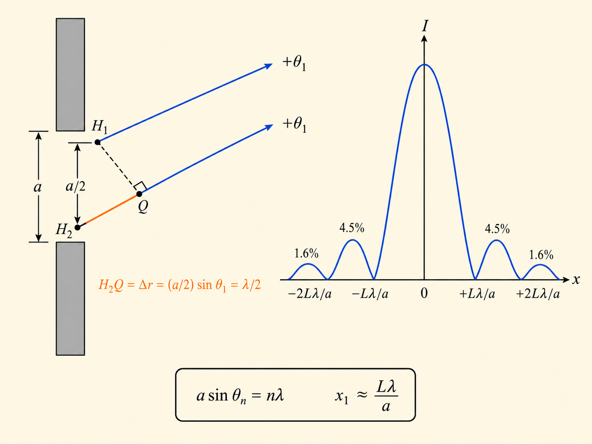
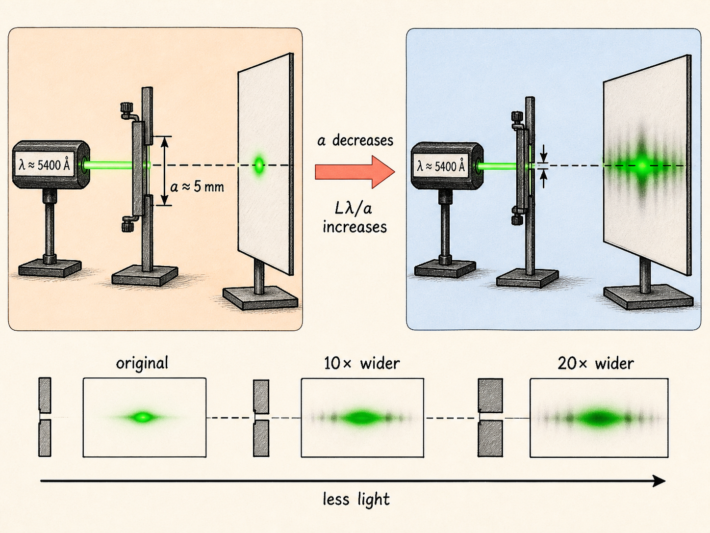
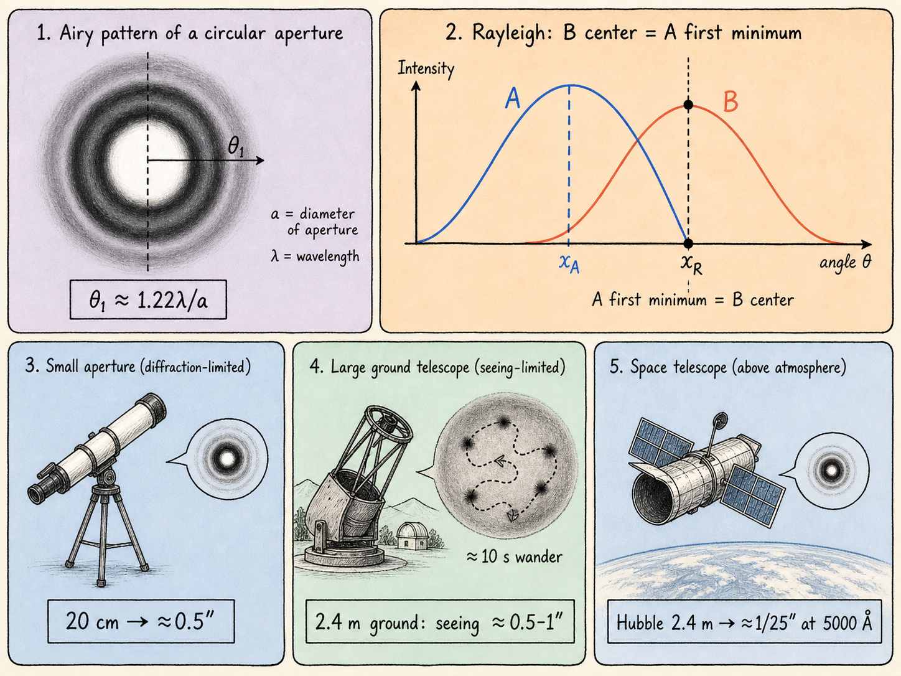
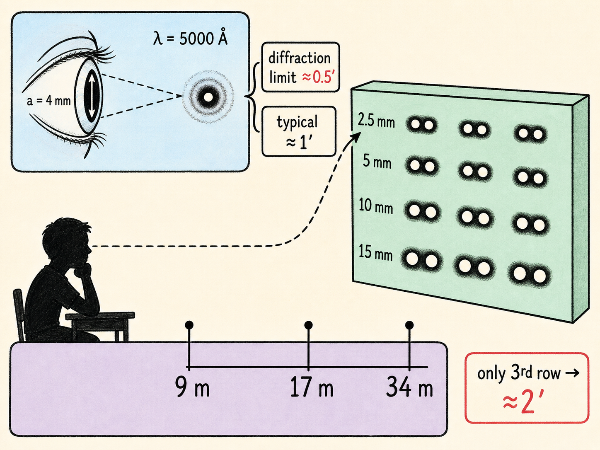

# 光栅把颜色排开，衍射给分辨率设下边界

把一束红色激光照向密密麻麻的刻线，墙上不会只出现一个红点。中央有一个亮点，它的左右还会依次出现一级、二级亮点。把红光换成白光，中央仍是白色；到了两侧，不同颜色却分开了，蓝色靠近中央，红色离中央更远。

这不只是“颜色被摊开”的小把戏。同一套波的叠加规律还会告诉我们：光栅为什么能把谱线变得很窄，狭缝为什么越窄反而让光斑越宽，以及为什么再大的望远镜和再好的眼睛都绕不开分辨率的上限。

读完这篇，你会知道

- 多条等间距狭缝为什么仍满足 $d\sin\theta_m=m\lambda$，正、负级次分别落在哪里
- 为什么狭缝数 $N$ 越大，主峰越高、越窄，却不违反能量守恒
- 白光、红色激光以及氖灯的谱线怎样被光栅分开
- 为什么单缝越窄，中央主极大反而越宽
- 圆孔衍射、瑞利判据、望远镜和人眼的角分辨率如何连成一条因果链

## 从两条缝走向 $N$ 条缝

设有 $N$ 条彼此平行、等间距的狭缝，相邻狭缝中心间距为 $d$。平面波正入射时，每条狭缝都可看成一个同频、同波长、同相的惠更斯次波源。远处某一方向上的观察点，会同时收到这 $N$ 个次波源发出的波。

相邻狭缝到该方向的光程差是 $d\sin\theta$。如果这个光程差正好等于整数个波长，所有相邻次波都同相到达，$N$ 个贡献便一起相长。因此主极大的条件是

$d\sin\theta_m=m\lambda$。

$m=0$ 是中央的零级，$\theta_0=0$；$m=1,2,\ldots$ 给出一侧的一级、二级和更高级，另一侧则有对称的负角度方向。也就是说，同一个 $|m|$ 会在零级两边各出现一次。小角度且角度用弧度表示时，$\sin\theta\approx\theta$，于是

$\theta_m\approx\frac{m\lambda}{d},\qquad x_m\approx L\theta_m=\frac{Lm\lambda}{d}$。

这里的 $L$ 是光栅到屏幕的距离，$x_m$ 是屏幕上第 $m$ 级相对中央的位置。这个极大条件和双缝完全相同，因为一旦相邻两缝在该方向同相，后面每一对相邻狭缝也都会同相。

## 真正改变图样的是峰宽

多缝与双缝的差别不在主极大位置，而在两个主极大之间发生了什么。$N$ 条缝时，相邻两个主极大之间有 $N-1$ 个完全相消的位置。$N$ 很大时，两个亮峰之间可以塞进几百个零点，主峰因此变得非常尖锐。

从零级主极大到旁边第一个零点的角宽约为

$\Delta\theta\approx\frac{\lambda}{dN}=\frac{\theta_1}{N}$。

这给出一条直接关系：照亮的刻线数 $N$ 越多，谱线宽度越小。与此同时，主峰处各狭缝的电场振幅同相相加，合振幅与 $N$ 成正比，光强便与 $N^2$ 成正比。

峰高按 $N^2$ 增长，会不会违反能量守恒？把狭缝数增大到原来的 $3$ 倍，峰高变成 $9$ 倍，但峰宽缩小到原来的三分之一。高而窄的峰所包含的总光量只增大 $3$ 倍，正好对应光源数增加 $3$ 倍。

## 红色激光把级次投到十米外

课堂演示使用一块每英寸 $2500$ 条刻线的透射光栅、一束波长约 $6.3\times10^{-7}\ \mathrm m$ 的红色激光，以及约 $10\ \mathrm m$ 外的屏幕。计算给出的零级在 $0^\circ$，一级约在 $3.55^\circ$，二级约在 $7.1^\circ$；两侧各有对应的一级和二级。

这里有一处必须公开的内部数值矛盾：课堂口述把相邻刻线间距记为约 $2.16\ \mu\mathrm m$，但同一讲随后又说反射光栅的 $2.5\ \mu\mathrm m$ 间距比它小 $4$ 倍，并给出 $3.55^\circ$ 的一级角。这几项不能同时成立。后续演示的角度关系与“四倍”关系共同对应约 $10\ \mu\mathrm m$ 的原光栅间距，因此下面只沿用能在本讲内部互相闭合的角度、级次和峰宽关系。

激光束直径约 $2\ \mathrm{mm}$，照亮约 $200$ 条刻线。按 $\Delta\theta\approx\theta_1/N$，谱线理论角宽约为 $1$ 角分；放到 $10\ \mathrm m$ 外，简单估算的光斑宽度约为 $3\ \mathrm{mm}$。课堂在这一步又口述了“$3.55^\circ$ 除以 $300$”，与前面的 $200$ 条不一致。真实光斑还会比简单估算更宽，因为激光束自身的发散角已经大于约 $1$ 角分，成为新的限制因素。

现场投影确实显示了中央零级、左右约 $3.5^\circ$ 的一级和约 $7.1^\circ$ 的二级。与双缝条纹相比，这些多缝主峰明显更窄；它们接近由 $1/N$ 决定的理论宽度，却受激光发散限制，不能无限收窄。

## 白光为什么中央不分色，两侧却成为光谱

零级满足 $m=0$，因此任何波长都在 $\theta=0$ 处达到极大。白光的所有颜色在这里重合，中央看起来仍是白色。

到了一级、二级和更高级，情况由 $d\sin\theta_m=m\lambda$ 决定。同一级次中，波长较短的蓝光角度较小，更靠近零级；波长较长的红光角度较大，离零级更远。级次越高，各颜色继续按自己的波长分开。

白光演示改用反射光栅：在金属表面刻槽，让光以反射方式形成图样。其间距约 $2.5\ \mu\mathrm m$，口述为前一块光栅的四分之一，所以一级角约增大到四倍。墙上中央是较宽的白色零级，左右能看到一级，甚至二级光谱；每一级里红色都比蓝色离中央更远。

零级之所以没有随着刻线数增多而变成无限窄的点，是因为谱线不能比实际光源的像更窄。这里的白光光源本身较大，所以零级也较宽。再把与白光同方向的红色激光打开，它的零级落进白色中央，它的一级和二级则分别落进白光光谱相应级次的红色位置。

## 透镜把“远处的角度”带到眼前

前面的角度关系针对远场观察。若不想把屏幕放到 $10\ \mathrm m$ 外，可以在光栅后放透镜，并把屏幕放在焦平面上。透镜把不同出射角对应到附近屏幕上的不同位置，于是保留了角度排序，却把装置缩短了。

眼睛自身就有透镜。学生把每毫米 $1000$ 条刻线、间距 $1\ \mu\mathrm m$ 的光栅举到眼前，并把刻线调成竖直方向，就能在灯的左右直接看到光谱。中央零级是灯本身；向一侧移动，先遇到一级蓝光，再遇到一级红光，随后是二级蓝光和二级红光。因为 $d$ 很小，出射角很大，可出现的红光高级次并不会很多。

白炽灯给出连续展开的颜色，氖灯却只在若干离散位置出现亮线：红色区域有很多条，橙色有几条，绿色还能仔细看到两条较暗的线。谱线出现在哪里给出所发射的波长，亮线的相对强弱则反映相对强度。汞灯也会给出许多离散颜色。光栅因此不仅“把白光拆开”，还把原子和分子发出的离散频率显示成可见的谱线。

## 只剩一条缝，干涉并没有消失

把 $N$ 条狭缝减到一条，仍然会出现光加光变暗的方向。名称从多缝“干涉”变成了单缝“衍射”，但底层仍是同一件事：狭缝内连续分布的惠更斯次波彼此叠加。

设单缝宽度为 $a$，平面波正入射。$\theta=0$ 时，由对称性可知所有贡献同相，必有中央极大。极小条件则为

$a\sin\theta_n=n\lambda,\qquad n=1,2,3,\ldots$。

为什么整个缝上下边缘的光程差达到一个完整波长时，结果反而是极小？以 $n=1$ 为例，把狭缝分成上下两半。上半每一个次波源都能在下半找到一个相隔半缝宽的伙伴；两者到观察方向的光程差为 $\lambda/2$，恰好彼此抵消。整条缝可以这样一对一配对，所以总振幅为零。

小角度下，第一个极小位于

$\theta_1\approx\frac{\lambda}{a},\qquad x_1\approx\frac{L\lambda}{a}$。

中央两侧对称，若把第一个零点到中心的距离 $x_1$ 当作半宽，那么中央主极大的全宽是 $2x_1$。第一个与第二个极小之间还有次极大，但它只有中央强度 $I_0$ 的 $4.5\%$；再外侧的次极大只有 $1.6\%$。

## 缝越窄，亮斑越宽

$x_1=L\lambda/a$ 中，$a$ 在分母。狭缝越窄，第一个零点离中央越远，中央主极大越宽。这正好反过来挑战“开口小，投到墙上的亮斑也应当小”的直觉。

演示使用波长约 $5400$ 埃的绿色激光和可变狭缝。开始时缝宽约 $5\ \mathrm{mm}$，衍射宽度很小，墙上光斑主要由激光束发散决定。随着狭缝继续收窄，暗纹开始出现，中央主极大逐渐变宽，先达到原来的约 $10$ 倍，后来约 $20$ 倍。

图样变宽的同时也变暗，因为狭缝越窄，能通过的光越少。学生再用两张卡片构成可调窄缝观察白光：不同颜色的极小位置不同，所以暗纹不如单色绿光那样分明，但中央主极大和两侧暗区仍然可见；把缝调得更窄，图样同样向两边展开。

## 圆孔把暗纹变成暗环

若开口不再是长狭缝，而是直径为 $a$ 的圆孔，轴对称性会把一维的亮暗分布变成同心结构：中心是很亮的圆斑，外面先出现一圈完全黑暗的圆环，再出现较弱的亮环，然后继续交替。

圆孔几何使第一个暗环的角位置比单缝的 $\lambda/a$ 略大：

$\theta_1\approx1.22\frac{\lambda}{a}$。

这里仍使用小角近似，$\theta_1$ 用弧度表示。这个不可消除的圆孔衍射图样，直接把问题带到“两个光源还能不能被看成两个”的角分辨率上。

## 瑞利判据：一个中心落到另一个暗处

设两个等强、单色光源的来光方向稍有不同。它们可以是汽车的两盏前灯，也可以是天空中的两颗星。每个光源经过圆孔后都会形成自己的中央亮斑和暗环。两者角距离大时，可以清楚看见两个亮斑；距离缩小时，两套衍射图样逐渐重叠。

瑞利判据把“刚好还能分开”定义为：一个光源的中央亮斑落在另一个光源的第一暗环位置。于是极限角间隔约为

$\theta_{\mathrm{res}}\approx1.22\frac{\lambda}{a}$。

若两者再靠近，大脑更容易把重叠图样判断成一个光源。增大圆孔、透镜或望远镜镜面的直径 $a$，可以减小这个角度，提升角分辨能力；缩短波长也会减小极限角。无论开口是针孔、圆形透镜还是望远镜的凹面镜，衍射限制都存在。

## 大望远镜还要穿过会扰动的空气

取 $\lambda=5000$ 埃。直径约 $20\ \mathrm{cm}$ 的透镜，衍射极限约为 $0.5$ 角秒。若口径增大到 $2.4\ \mathrm m$，直径增加 $12$ 倍；忽略课堂随后说明暂不计入的 $1.2$ 因子，角分辨率改善到约 $1/25$ 角秒。

把这样的望远镜放在地面，并不等于实际照片就能达到 $1/25$ 角秒。空气始终在湍动，使本来很小的衍射极限星像在约 $10$ 秒内到处移动，可能被涂抹到约 $1$ 角秒的区域。天文学家把这种大气造成的成像限制称为视宁度。课堂给出的地面实际水平通常连相隔 $0.5$ 角秒的两颗星也未必能分开，最好大约是 $0.5$ 角秒。

哈勃空间望远镜没有这层空气湍流。它的镜面直径是 $2.4\ \mathrm m$，在 $5000$ 埃附近确实接近衍射极限，角分辨率约为 $1/25$ 角秒；波长更短时更好，波长更长时稍差。

课堂展示的超新星 1987A 图像把这种差异变成了可见细节。它在 1987 年 2 月被看到，距离约 $150000$ 光年，因此爆炸实际发生在约 $150000$ 年前。图中标出的某段距离是 $1$ 角秒；若由地面天文台拍摄，那一整块细节会混成模糊的一团，而哈勃能够把结构分开。

## 人眼也有自己的衍射极限

瞳孔就是人眼的圆形开口。取瞳孔直径 $a=4\ \mathrm{mm}$、波长 $\lambda=5000$ 埃，人眼最好的衍射极限约为 $0.5$ 角分，不可能再好。多数人的实际角分辨率约为 $1$ 角分，略差于衍射极限，但已很接近。

最后的课堂测试把角度换成肉眼可判断的两点。一个箱子上布置了相距 $2.5\ \mathrm{mm}$、$5\ \mathrm{mm}$、$10\ \mathrm{mm}$ 和 $15\ \mathrm{mm}$ 的成对针孔，每组重复三次，让观众席不同角度的人都更容易找到一组可见光点。

若假设角分辨率为 $1$ 角分，距离小于约 $9\ \mathrm m$ 的人应能分开最上面相距 $2.5\ \mathrm{mm}$ 的两个点；课堂随后还给出约 $17\ \mathrm m$ 和 $34\ \mathrm m$ 的判断距离。实际提问时，观众席中能分开哪一排的人随位置而变；一名只能分开第三排的学生，被粗略判断为约 $2$ 角分的分辨率。

## 分辨率不是仪器疏忽，而是波的结果

光栅让许多同相次波源在少数方向集中相长，于是得到高而窄的级次峰，并把不同波长排到不同角度。单缝和圆孔则让同一开口内部的次波彼此相消，迫使每个点光源扩展成有限宽度的图样。

所以，提高分辨率不能只靠“把机械加工做得更精细”。只要光仍以波的方式通过有限开口，$\lambda/a$ 这组比例就会出现。增大口径、选择更短波长或避开空气湍流可以把边界推远，却不能让衍射消失。光栅的锐利谱线和望远镜的分辨率上限，正是同一套惠更斯叠加机制的两面。
