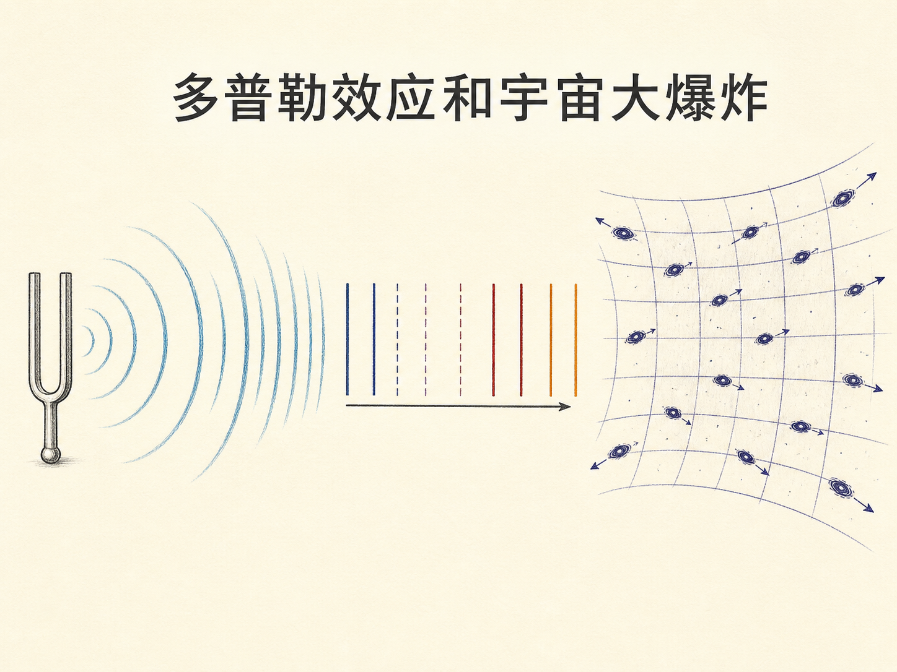
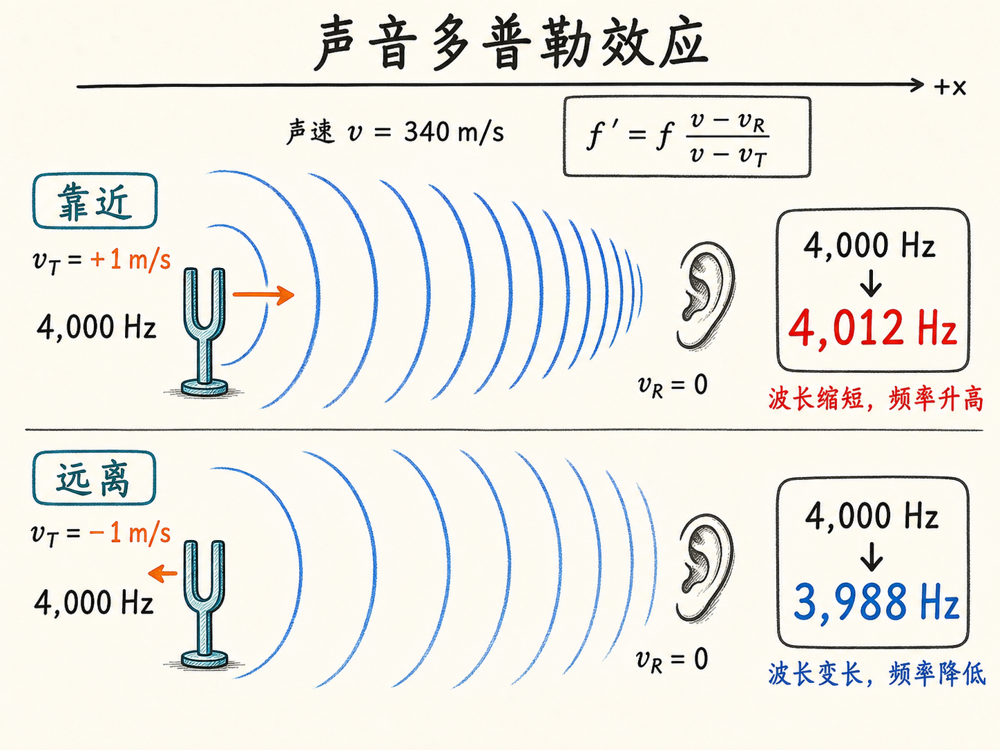
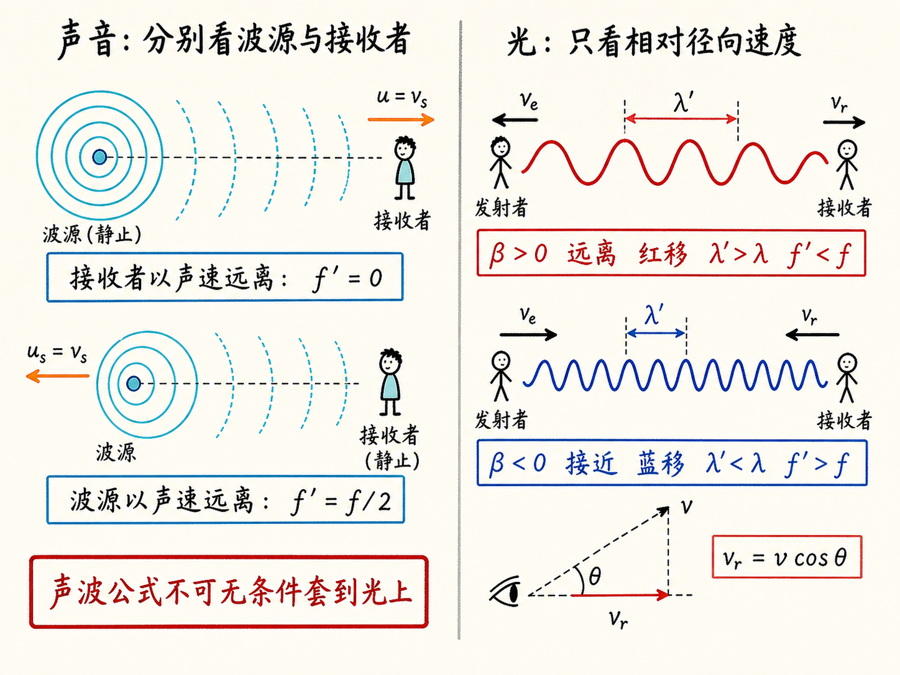
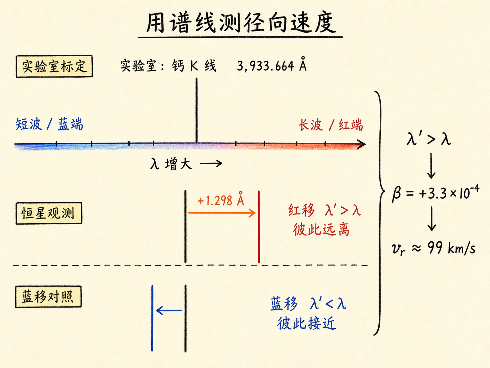
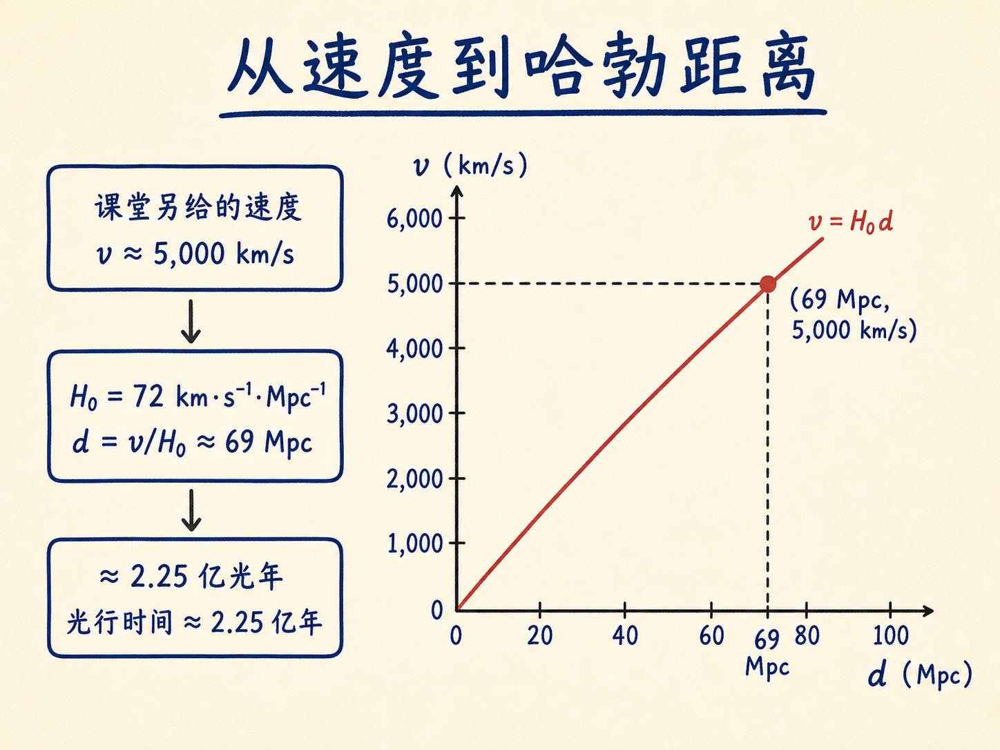
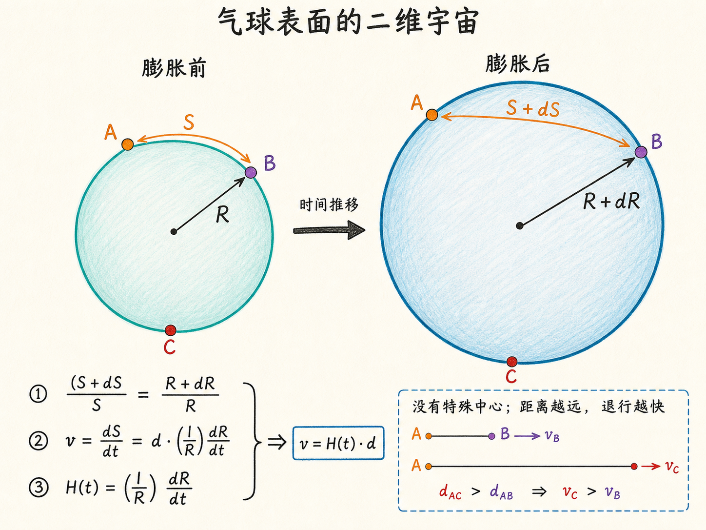
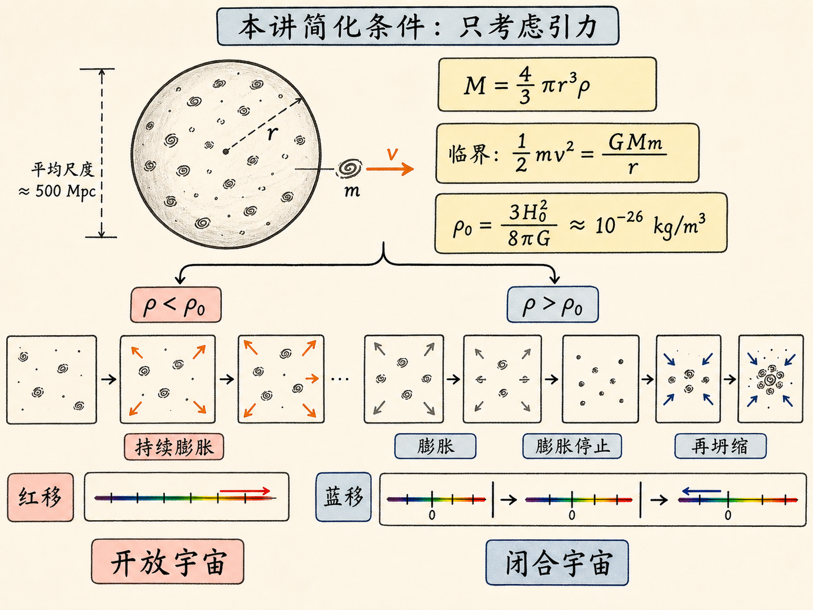

# 一只音叉，怎样把我们带到宇宙的结局

一只频率为 $4{,}000\,\mathrm{Hz}$ 的音叉，本身没有改变振动节奏。可当它以大约 $1\,\mathrm{m/s}$ 向你靠近时，你听到的频率约为 $4{,}012\,\mathrm{Hz}$；它以同样速度远离时，频率约为 $3{,}988\,\mathrm{Hz}$。改变的不是音叉，而是波峰抵达你的节奏。

把声音换成光，同一个问题会一路放大：恒星光谱中的一条谱线移动了多少，能告诉我们恒星是靠近还是远离；星系的谱线普遍红移，又把我们带到宇宙年龄、空间膨胀和宇宙最终命运的问题。

读完这篇，你会知道

- 声音的多普勒效应为什么要区分“波源动”和“接收者动”？
- 光的红移与蓝移怎样给出天体的径向速度？
- 哈勃定律怎样把红移、距离和宇宙年龄连起来？
- 为什么所有星系都远离我们，却不表示我们位于宇宙中心？
- 在本讲的简化模型中，平均密度怎样决定宇宙开放还是闭合？

## 音调变化，来自波峰抵达节奏的变化

先规定一条从波源指向接收者的正方向。波源速度记作 $v_T$，接收者速度记作 $v_R$，声速记作 $v$，发射频率是 $f$，接收频率是 $f'$。本讲给出的声音多普勒关系是

$f'=f\frac{v-v_R}{v-v_T}$。

这个符号约定可以直接用演示检查。接收者不动时，$v_R=0$。波源沿正方向向接收者运动，$v_T>0$，分母变小，所以 $f'>f$；波源反向远离，$v_T<0$，分母变大，所以 $f'<f$。

音叉演示把这个变化变成了耳朵能直接识别的音调。声速取 $340\,\mathrm{m/s}$，音叉为 $4{,}000\,\mathrm{Hz}$，波源速度约 $1\,\mathrm{m/s}$，相对变化量约为 $1/340\approx0.3\%$。于是靠近时约为 $4{,}012\,\mathrm{Hz}$，远离时约为 $3{,}988\,\mathrm{Hz}$。数值只差 $12\,\mathrm{Hz}$，现场却已经很明显。

这里还有一个容易忽略的条件：波源运动和接收者运动并不总是等价。速度远小于声速时，两者给出的变化近似相同；接近声速时，不对称性就显现出来。若接收者以声速远离波源，声音永远追不上它，$f'=0$。若波源以声速远离静止接收者，先前发出的波仍会到达接收者，接收频率是发射频率的一半。声音方程里的 $v_T$ 与 $v_R$ 不能合并成一个相对速度，因此必须分别跟踪波源和接收者的运动。

## 换成光，方程只认相对运动

电磁辐射同样有多普勒频移，但真空中的光不再需要声波那样的介质参考系。本讲直接给出狭义相对论结果：

$f'=f\sqrt{\frac{1-\beta}{1+\beta}},\qquad \beta=\frac{v}{c}$。

这里 $v$ 是发射者与接收者的相对径向速度，$c$ 是光速；本讲约定 $\beta>0$ 表示彼此远离，$\beta<0$ 表示彼此接近。远离时 $f'<f$，接近时 $f'>f$。问题只剩一个相对速度，不再区分“是发射者动，还是接收者动”。

在真空中 $\lambda=c/f$，所以同一个关系也可写成波长形式：

$\lambda'=\lambda\sqrt{\frac{1+\beta}{1-\beta}}$。

因此，彼此远离时 $\lambda'>\lambda$，谱线向长波方向移动，称为红移；彼此接近时 $\lambda'<\lambda$，谱线向短波方向移动，称为蓝移。这里的“红”和“蓝”描述谱线移动方向，不要求那条谱线原本位于可见光的红色或蓝色区域。

真正进入方程的是视线方向上的速度分量。若相对速度与视线夹角为 $\theta$，径向分量含有 $\cos\theta$。因此，多普勒测量告诉我们的是径向速度，而不是天体在三维空间中的完整速度。警车雷达也利用同一思路：雷达波从汽车反射回来，频率变化给出汽车沿测量方向的速度。本讲没有把反射过程进一步展开成另一套公式。

## 一条钙谱线，就是一支宇宙测速枪

恒星大气中的原子和分子会留下离散谱线。实验室先把这些波长测准，再与恒星光谱中的对应谱线比较，微小位移就能转化为径向速度。

天兔座 $\delta$ 星给出了一个具体例子。钙 K 线在实验室中的波长为 $3{,}933.664\,\text{Å}$，在恒星光谱中长了 $1.298\,\text{Å}$。因为 $\lambda'>\lambda$，这是红移。代入波长形式的多普勒方程，得到 $\beta=+3.3\times10^{-4}$，径向速度约为

$v=\beta c\approx99\,\mathrm{km/s}$。

怎样从接近 $4{,}000\,\text{Å}$ 的波长里看出约 $1.3\,\text{Å}$ 的变化？做法不是只看一张恒星光谱，而是同时取得实验室中已知波长的校准光谱，进行相对比较。这要求很高的光谱分辨率。20 世纪初测得的许多恒星速度约为 $100$ 到 $200\,\mathrm{km/s}$，银河系中既有相对我们接近的恒星，也有远离的恒星。

20 世纪20年代的观测把尺度从恒星推到了“星云”。有些天体红移对应的速度高达 $1{,}500\,\mathrm{km/s}$，而且都在远离我们。随后人们确认，它们不是银河系内部的云，而是各自由大约一百亿颗恒星组成的星系。一个星系的光谱混合了数百万颗恒星的光，但平均谱线仍能给出整个星系的平均红移和退行速度。

## 哈勃定律：越远，退行得越快

测速度相对容易，测天文距离却很困难。哈勃等人把两类测量放在一起，发现速度与距离呈线性关系：

$v=Hd$。

本讲采用的现代哈勃常数为

$H_0\approx72\,\mathrm{km\,s^{-1}\,Mpc^{-1}}$。

一个兆秒差距等于 $3.26\times10^6$ 光年，约为 $3.1\times10^{19}$ 千米。下标 $0$ 很重要，它表示“现在”的哈勃常数；哈勃常数会随时间变化，不应把今天的数值当成十亿年前或十亿年后的固定常数。

这里先要检查课堂给出的两个数能否接成一条计算链。讲述先给出某星系满足 $\lambda'/\lambda=1.0033$，随后又说它的速度约为 $5{,}000\,\mathrm{km/s}$。但把 $r=\lambda'/\lambda$ 代回本讲前面给出的波长关系，会有

$\beta=\frac{r^2-1}{r^2+1}\approx0.0032946$，

所以 $v=\beta c\approx988\,\mathrm{km/s}$，约为 $990\,\mathrm{km/s}$，并不是 $5{,}000\,\mathrm{km/s}$。因此，$1.0033$ 与 $5{,}000\,\mathrm{km/s}$ 只能分别保留为课堂口述数值，不能声称后者由前者推出。

下面另取本讲紧接着给出的 $v=5{,}000\,\mathrm{km/s}$ 作为哈勃示例的独立输入。由哈勃定律得到

$d=\frac{v}{H_0}\approx69\,\mathrm{Mpc}\approx2.25\times10^8\,\text{光年}$。

按这组独立的哈勃示例数值，这束光用了约 $2.25$ 亿年才到达我们，所以望远镜看到的不是星系“现在”的样子，而是它约 $2.25$ 亿年前的样子。在线性关系下，距离加倍，退行速度也加倍。

课堂展示的第一组星系光谱中，钙 H、K 吸收线只发生很小红移，对应数值给出约 $1{,}150\,\mathrm{km/s}$ 和约 $16\,\mathrm{Mpc}$。另一星系约在 $305\,\mathrm{Mpc}$，距离约为前者的 $20$ 倍，速度也约为 $20$ 倍。更远星系的谱线继续向红端移动。

现代哈勃图一直延伸到 $400\,\mathrm{Mpc}$，对应速度约 $26{,}000\,\mathrm{km/s}$，约为光速的 $9\%$；此时 $\beta$ 约 $0.1$，$\lambda'/\lambda$ 约 $1.1$。哈勃最初的数据全部低于 $1{,}100\,\mathrm{km/s}$，只占现代图靠近原点的一小段，而且当时的距离估计约比今天小 $7$ 倍。尽管数值标尺后来改变，速度与距离的线性关系保留下来。

## 把时钟倒转：$1/H$ 给出一个年龄尺度

先采用本讲明确标为简化的假设：两个今天相距 $d$ 的天体，从共同起点开始，一直以相同相对速度 $v$ 分离。那么

$d=vt$。

再代入 $v=Hd$，得到

$t=\frac{1}{H}$。

取本讲的 $H_0$，这个时间约为 $4.3\times10^{17}$ 秒，也就是约 $140$ 亿年。引力会使星系的退行速度随时间变化，因此“速度恒定”并不精确。本讲由此把年龄范围收窄到约 $120$ 亿至 $140$ 亿年，并以银河系最老恒星约 $100$ 亿年作为下限：宇宙不能比其中的恒星更年轻。

本讲还指出，宇宙早期可能经历加速、随后减速、也可能再次加速；这一变化正是宇宙学研究的核心。因此，$1/H_0$ 在这里是由简化模型得到的年龄尺度，不是脱离演化历史的无条件等式。

沿同一简化图景，令哈勃退行速度达到光速，可以写出可见视界尺度

$d_{\max}=\frac{c}{H_0}\approx140\,\text{亿光年}$。

当 $\beta\to1$ 时，前面的相对论多普勒式给出 $\lambda'\to\infty$、$f'\to0$。不过本讲随即划出边界：红移非常大时，广义相对论变得重要，不能再用前面的狭义相对论公式算出速度，再机械代入哈勃定律求距离。

两个观测例子把这条边界讲得很具体。一项当时刚发表的星系观测给出 $\lambda'/\lambda=7.56$，只能据此说它大概远至 $130$ 亿光年、接近可见宇宙边缘。另一颗约 $120$ 亿光年外的类星体，氢的莱曼 $\alpha$ 线从 $1{,}216\,\text{Å}$ 移到约 $7{,}800\,\text{Å}$，所以 $\lambda'/\lambda=6.41$。天文学家常写的红移量为 $z=\lambda'/\lambda-1$，因此这里 $z=5.41$。原在紫外的谱线已经移入红外，超过人眼约 $6{,}500\,\text{Å}$ 的可见范围。

## 所有星系都远离，不等于我们在中心

如果把大爆炸想成普通空间里从一个中心炸开的爆炸，很容易误以为我们位于中心。葡萄干面包类比去掉了这个错误中心：面团均匀膨胀时，每颗葡萄干都看见其他葡萄干远离自己；距离是两倍，单位时间内增加的距离也是两倍。无论选择哪颗葡萄干作观察者，它都会得到 $v\propto d$，却没有哪颗葡萄干是膨胀中心。

气球表面的二维世界把这个关系写成了方程。设气球半径为 $R$，表面两个星系的弧长为 $S$。膨胀后半径变为 $R+dR$，弧长变为 $S+dS$。几何相似关系给出

$\frac{S+dS}{S}=\frac{R+dR}{R}$，

于是 $S\,dR=R\,dS$。除以 $dt$，再把 $S$ 记作距离 $d$、把 $dS/dt$ 记作退行速度 $v$，得到

$v=d\left(\frac{1}{R}\frac{dR}{dt}\right)$。

所以气球世界中的哈勃常数就是

$H(t)=\frac{1}{R}\frac{dR}{dt}$。

它不是固定不变的数，因为 $R$ 与 $dR/dt$ 都可能随时间变化。气球类比还能提示一个二维空间可以在第三维中弯曲，但本讲明确提醒不要把它推得过远；它只负责帮助理解“没有特殊中心却处处看到线性退行”以及 $H$ 会随时间变化。

## 平均密度，决定苹果会不会“落回来”

宇宙会永远膨胀，还是先停下再坍缩？本讲把它类比为向上扔苹果：没有大气时，初速度约达到 $11\,\mathrm{km/s}$，苹果就不会返回。若只考虑引力，宇宙的对应条件取决于平均密度。

这里的“平均”不能在剑桥、太阳系或银河系尺度上取值，而要放到几亿秒差距、本讲举例约 $500\,\mathrm{Mpc}$ 的尺度。取一个半径为 $r$ 的球，平均密度为 $\rho$，球内质量为

$M=\frac{4}{3}\pi r^3\rho$。

在本讲采用的牛顿简化模型中，球面附近质量为 $m$ 的星系以速度 $v$ 远离。总能量为零是返回与不返回的临界边界：

$\frac12mv^2=\frac{GMm}{r}$。

约去 $m$，代入球内质量，再用 $v/r=H_0$，得到今天的临界密度

$\rho_0=\frac{3H_0^2}{8\pi G}\approx10^{-26}\,\mathrm{kg/m^3}$。

在这个仅由引力控制的课程模型中，若 $\rho<\rho_0$，宇宙永远膨胀，称为开放宇宙；若 $\rho>\rho_0$，膨胀最终停止，红移先归零再变成蓝移，宇宙开始坍缩，称为闭合宇宙。密度也不只来自恒星、星系和普通物质。根据本讲提到的 $E=mc^2$，电磁辐射的能量同样计入质量—能量。讲者表示，当时通常认为宇宙膨胀不会停下并倒转，但研究仍在快速发展，这个判断也可能变化。

开放宇宙的远景是恒星熄灭，宇宙变得寒冷而沉寂；闭合宇宙则走向炽热的大坍缩，温度重新达到数十亿度。讲者用弗罗斯特的“火与冰”和艾略特的“不是一声巨响，而是一声呜咽”来对照两种结局，又把想象推进一步：大坍缩之后也许还有新的大爆炸；若一切完全重复，几万亿年后，大家或许会在同一地点、同一时间再次参加那场 $8{:}02$ 的课堂重聚。

从 $4{,}000\,\mathrm{Hz}$ 音叉到 $10^{-26}\,\mathrm{kg/m^3}$ 的临界密度，这一讲的主线始终没有变：先测量波抵达我们的方式，再从频率和波长的变化反推运动；把无数天体的运动排成距离—速度关系，最后才追问整个宇宙过去多久、会走向哪里。每一步都由前一步的可测量量支撑，而每个公式也都有自己的适用边界。
